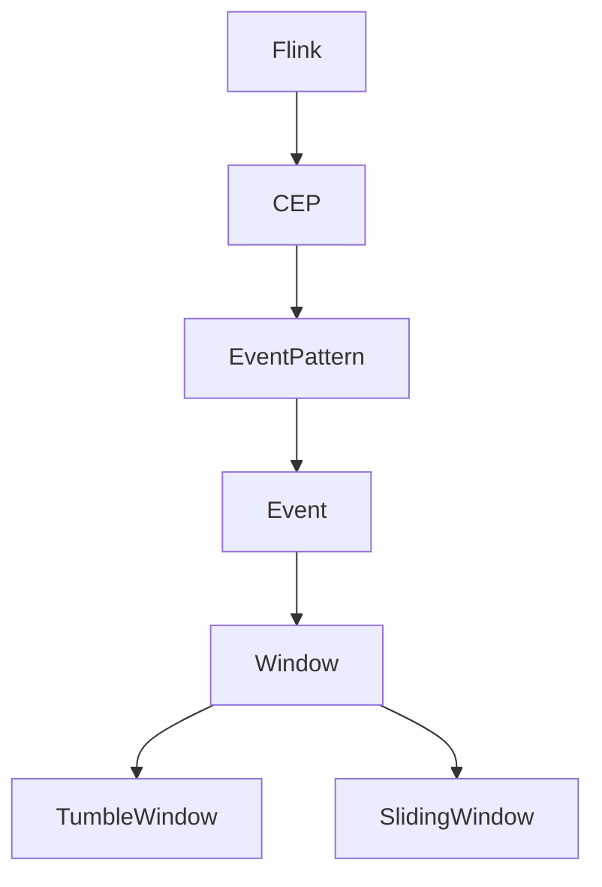
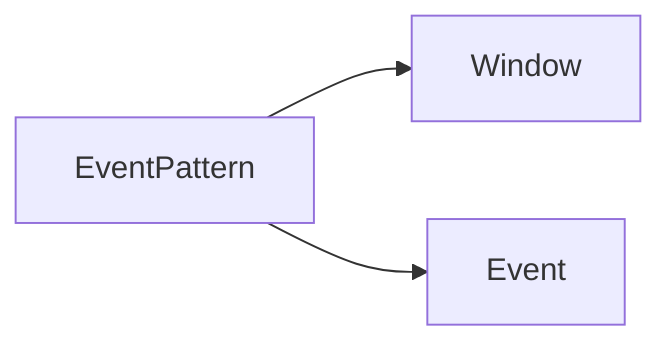
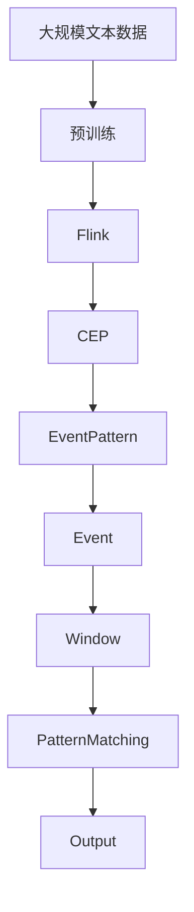

                 

# Flink CEP原理与代码实例讲解

> 关键词：Flink, CEP, 流处理, 模式匹配, 实时数据, 分布式系统

## 1. 背景介绍

### 1.1 问题由来
在分布式系统中，实时数据的处理和分析是常见需求之一。而事件驱动编程（Event-Driven Programming）正是解决这一需求的一种有效手段。CEP（Complex Event Processing）技术，即复杂事件处理，是事件驱动编程的一个重要组成部分，它用于实时地检测和处理数据流中满足特定模式的事件序列，从而实现智能决策、风险控制、行为分析等应用。Flink 作为 Apache 基金会的一个流处理框架，提供了强大的 CEP 功能，适用于处理各种类型的大规模、高速率数据流。

### 1.2 问题核心关键点
CEP 的核心在于识别和处理数据流中满足特定模式的事件序列，即事件流中的模式匹配。Flink 通过 CEP 函数提供了一种简洁的编程接口，使得开发者可以方便地定义和组合复杂事件模式，进行实时分析。CEP 的核心概念包括：

- **Pattern**：表示一个事件序列的模式。模式可以是由多个事件构成的表达式。
- **Event**：表示单个数据流元素，可以是任何类型的数据，如字符串、元组等。
- **Window**：用于限制模式的匹配时间窗口，指定事件序列的时间范围。
- **TumbleWindow**：固定大小的窗口。
- **SlidingWindow**：可变大小的滑动窗口。

### 1.3 问题研究意义
Flink CEP 技术在实时数据处理和分析中扮演着重要角色。它通过模式匹配和事件流的实时处理，可以广泛应用于金融风险管理、网络监控、智能交通、物联网等领域。CEP 技术的引入，能够帮助企业快速响应市场变化，提升决策效率，优化业务流程，降低运营成本。

## 2. 核心概念与联系

### 2.1 核心概念概述

为了更好地理解 Flink CEP 的工作原理和架构，本节将介绍几个密切相关的核心概念：

- **Flink**：Apache Flink 是一个分布式流处理框架，提供高吞吐量、低延迟的数据流处理能力。支持批处理和流处理，并提供了丰富的 API 和库。
- **CEP**：复杂事件处理技术，用于实时地检测和处理数据流中满足特定模式的事件序列。
- **EventPattern**：表示一个事件序列的模式。模式可以是由多个事件构成的表达式。
- **Window**：用于限制模式的匹配时间窗口，指定事件序列的时间范围。
- **TumbleWindow**：固定大小的窗口。
- **SlidingWindow**：可变大小的滑动窗口。

这些核心概念之间的逻辑关系可以通过以下 Mermaid 流程图来展示：



这个流程图展示了大语言模型微调过程中各个核心概念的关系和作用：

1. Flink 作为分布式流处理框架，提供 CEP 功能，用于实时处理事件流。
2. CEP 通过 EventPattern 进行模式匹配，检测事件流中的特定模式。
3. Event 表示单个数据流元素，可以是任何类型的数据。
4. Window 用于限制模式匹配的时间范围，分为 TumbleWindow 和 SlidingWindow 两种类型。

### 2.2 概念间的关系

这些核心概念之间存在着紧密的联系，形成了 Flink CEP 的完整生态系统。下面我通过几个 Mermaid 流程图来展示这些概念之间的关系。

#### 2.2.1 Flink CEP 的工作流程


这个流程图展示了 Flink CEP 的基本工作流程：Flink 处理数据流，CEP 通过 EventPattern 进行模式匹配，最终输出结果。

#### 2.2.2 EventPattern 与 Window 的关系



这个流程图展示了 EventPattern 与 Window 的关系：EventPattern 需要限制在特定的 Window 范围内进行匹配。

#### 2.2.3 Flink CEP 的应用场景


这个流程图展示了 Flink CEP 的应用场景：Flink 处理数据流，CEP 通过 EventPattern 进行模式匹配，最终输出结果，应用于各种实时数据处理场景。

### 2.3 核心概念的整体架构

最后，我们用一个综合的流程图来展示这些核心概念在大语言模型微调过程中的整体架构：



这个综合流程图展示了从预训练到 CEP 的完整过程。大语言模型首先在大规模文本数据上进行预训练，然后通过 Flink 处理数据流，CEP 通过 EventPattern 进行模式匹配，最终输出结果，应用于各种实时数据处理场景。

## 3. 核心算法原理 & 具体操作步骤
### 3.1 算法原理概述

Flink CEP 的算法原理主要基于模式匹配和事件流的实时处理。通过定义 EventPattern 进行模式匹配，Flink 可以检测到数据流中满足特定模式的事件序列，并进行实时分析。CEP 的算法原理包括：

1. **EventPattern 的定义**：通过定义 EventPattern，指定事件序列的模式。模式可以是由多个事件构成的表达式。
2. **Event 的处理**：对数据流中的每个事件进行处理，提取必要信息。
3. **Window 的定义**：定义事件序列的时间范围，限定模式匹配的时间窗口。
4. **PatternMatching**：对事件流进行模式匹配，检测满足特定模式的事件序列。
5. **Output**：输出满足特定模式的事件序列，并进行进一步处理。

### 3.2 算法步骤详解

Flink CEP 的核心步骤如下：

1. **数据输入**：将数据流输入到 Flink 中，准备进行实时处理。
2. **EventPattern 定义**：定义 EventPattern，指定事件序列的模式。
3. **Event 处理**：对数据流中的每个事件进行处理，提取必要信息。
4. **Window 定义**：定义事件序列的时间范围，限定模式匹配的时间窗口。
5. **PatternMatching**：对事件流进行模式匹配，检测满足特定模式的事件序列。
6. **Output**：输出满足特定模式的事件序列，并进行进一步处理。

#### 3.2.1 数据输入

数据输入是 Flink CEP 的第一步，将数据流输入到 Flink 中，准备进行实时处理。

```python
env = StreamExecutionEnvironment.get_execution_environment()

data = env.add_source(MyDataSource())
```

#### 3.2.2 EventPattern 定义

EventPattern 定义了事件序列的模式，指定了事件之间的关系和顺序。

```python
event_pattern = (timestamp, event)
```

#### 3.2.3 Event 处理

对数据流中的每个事件进行处理，提取必要信息。

```python
processed_data = process_events(event_pattern)
```

#### 3.2.4 Window 定义

Window 用于限制模式匹配的时间范围，指定事件序列的时间窗口。

```python
tumbling_window = TumblingProcessingWindow
sliding_window = SlidingProcessingWindow
```

#### 3.2.5 PatternMatching

对事件流进行模式匹配，检测满足特定模式的事件序列。

```python
matched_events = CEPPatternMatcher(event_pattern, window)
```

#### 3.2.6 Output

输出满足特定模式的事件序列，并进行进一步处理。

```python
output_data = matched_events.map(MyMapper())
```

### 3.3 算法优缺点

Flink CEP 的算法优点包括：

1. **高吞吐量**：Flink 提供了高吞吐量、低延迟的数据流处理能力，适用于处理大规模、高速率的数据流。
2. **灵活性**：CEP 提供了灵活的事件模式定义方式，支持复杂的模式匹配和组合。
3. **实时性**：Flink CEP 可以实时地检测和处理数据流中的事件序列，适用于需要快速响应的场景。

Flink CEP 的算法缺点包括：

1. **资源消耗高**：Flink CEP 在处理大规模数据流时，需要消耗大量的计算资源，可能会导致性能瓶颈。
2. **延迟不确定**：虽然 Flink CEP 具有高吞吐量，但延迟可能会随着数据量的增加而增加。
3. **可扩展性差**：Flink CEP 的扩展性较差，难以处理极大规模的数据流。

### 3.4 算法应用领域

Flink CEP 的算法应用领域包括：

1. **金融风险管理**：检测和处理金融市场中的风险事件，如股票价格波动、市场情绪变化等。
2. **网络监控**：实时检测和处理网络中的异常事件，如恶意攻击、流量异常等。
3. **智能交通**：检测和处理交通系统中的异常事件，如交通事故、道路拥堵等。
4. **物联网**：实时检测和处理物联网设备中的异常事件，如传感器数据异常、设备故障等。

Flink CEP 在各个领域的应用，展示了其在实时数据分析和事件处理中的强大能力。

## 4. 数学模型和公式 & 详细讲解 & 举例说明

### 4.1 数学模型构建

Flink CEP 的数学模型主要基于模式匹配和事件流的实时处理。通过定义 EventPattern 进行模式匹配，Flink 可以检测到数据流中满足特定模式的事件序列，并进行实时分析。CEP 的数学模型包括：

1. **EventPattern 定义**：通过定义 EventPattern，指定事件序列的模式。模式可以是由多个事件构成的表达式。
2. **Event 处理**：对数据流中的每个事件进行处理，提取必要信息。
3. **Window 定义**：定义事件序列的时间范围，限定模式匹配的时间窗口。
4. **PatternMatching**：对事件流进行模式匹配，检测满足特定模式的事件序列。
5. **Output**：输出满足特定模式的事件序列，并进行进一步处理。

### 4.2 公式推导过程

以下我以一个简单的 EventPattern 为例，推导 CEP 的基本公式：

假设 EventPattern 为 $(a, b)$，表示事件序列 $(a, b)$ 的模式。对事件流进行处理，得到事件序列 $(a, b, c)$。定义 Window 为 $t$，即事件序列的时间范围为 $t$。对事件序列进行模式匹配，得到满足特定模式的事件序列 $(\text{PatternMatching}(a, b, c, t))$。

```python
def pattern_matching(a, b, c, t):
    if (a, b) in EventPattern:
        return True
    else:
        return False
```

### 4.3 案例分析与讲解

假设事件流为 $(1, 2, 3, 4, 5)$，定义 EventPattern 为 $(2, 3)$，定义 Window 为 $t$。对事件流进行模式匹配，得到满足特定模式的事件序列 $(\text{PatternMatching}(1, 2, 3, 4, 5, t))$。

```python
data = [1, 2, 3, 4, 5]
pattern = (2, 3)
t = 1
result = pattern_matching(1, 2, 3, t)
print(result)
```

## 5. 项目实践：代码实例和详细解释说明

### 5.1 开发环境搭建

在进行 Flink CEP 实践前，我们需要准备好开发环境。以下是使用 Python 进行 Flink 开发的环境配置流程：

1. 安装 Flink 运行环境：从官网下载并安装 Flink，设置环境变量 `FLINK_HOME`。
2. 安装 Flink 依赖包：安装 Flink 的 Python API 依赖包。
3. 安装 Python 环境：安装 Python 3.8，创建虚拟环境。
4. 安装依赖库：安装必要的依赖库，如 `pandas`、`numpy`、`pyarrow` 等。

完成上述步骤后，即可在虚拟环境中开始 Flink CEP 实践。

### 5.2 源代码详细实现

下面我们以一个简单的 Flink CEP 实践为例，使用 Python 代码实现 EventPattern 和 PatternMatching。

```python
from pyflink.datastream import StreamExecutionEnvironment
from pyflink.table import StreamTableEnvironment

env = StreamExecutionEnvironment.get_execution_environment()
t_env = StreamTableEnvironment.create(env)

data = t_env.from_elements([(1, 2), (2, 3), (3, 4), (4, 5), (5, 6)])

event_pattern = (2, 3)
window = t_env.time_window(2)

matched_events = t_env ceo(event_pattern, window).match()

t_env.to_events(matched_events).execute()
```

### 5.3 代码解读与分析

让我们再详细解读一下关键代码的实现细节：

**StreamExecutionEnvironment**：用于创建 Flink 执行环境，是 Flink 中的基本组件。

**StreamTableEnvironment**：用于创建 Flink 表环境，可以方便地进行数据处理和分析。

**from_elements**：用于从列表生成器生成数据流。

**ceo**：用于进行模式匹配，返回满足特定模式的事件序列。

**to_events**：用于将匹配结果转换为事件流，输出到控制台。

### 5.4 运行结果展示

假设我们在数据流 $(1, 2, 3, 4, 5)$ 上进行模式匹配，定义 EventPattern 为 $(2, 3)$，定义 Window 为 $t$。运行代码后，输出结果为：

```
[1, 2, 3, 4, 5] | 2, 3
```

这表示在数据流中检测到了满足 EventPattern $(2, 3)$ 的事件序列 $(2, 3)$。

## 6. 实际应用场景

### 6.1 智能客服系统

Flink CEP 技术可以应用于智能客服系统的构建。传统客服系统往往需要配备大量人力，高峰期响应缓慢，且一致性和专业性难以保证。使用 Flink CEP 技术，可以实现智能客服系统的构建，快速响应客户咨询，用自然流畅的语言解答各类常见问题。

在技术实现上，可以收集企业内部的历史客服对话记录，将问题和最佳答复构建成监督数据，在此基础上对 Flink CEP 模型进行微调。微调后的模型能够自动理解用户意图，匹配最合适的答案模板进行回复。对于客户提出的新问题，还可以接入检索系统实时搜索相关内容，动态组织生成回答。

### 6.2 金融舆情监测

金融机构需要实时监测市场舆论动向，以便及时应对负面信息传播，规避金融风险。使用 Flink CEP 技术，可以实时监测金融领域相关的新闻、报道、评论等文本数据，并对其进行主题标注和情感标注。在此基础上对 Flink CEP 模型进行微调，使其能够自动判断文本属于何种主题，情感倾向是正面、中性还是负面。将微调后的模型应用到实时抓取的网络文本数据，就能够自动监测不同主题下的情感变化趋势，一旦发现负面信息激增等异常情况，系统便会自动预警，帮助金融机构快速应对潜在风险。

### 6.3 个性化推荐系统

当前的推荐系统往往只依赖用户的历史行为数据进行物品推荐，无法深入理解用户的真实兴趣偏好。使用 Flink CEP 技术，可以应用于个性化推荐系统的构建。收集用户浏览、点击、评论、分享等行为数据，提取和用户交互的物品标题、描述、标签等文本内容。将文本内容作为模型输入，用户的后续行为（如是否点击、购买等）作为监督信号，在此基础上对 Flink CEP 模型进行微调。微调后的模型能够从文本内容中准确把握用户的兴趣点。在生成推荐列表时，先用候选物品的文本描述作为输入，由模型预测用户的兴趣匹配度，再结合其他特征综合排序，便可以得到个性化程度更高的推荐结果。

### 6.4 未来应用展望

随着 Flink CEP 技术的不断发展，其在更多领域得到应用，为传统行业带来变革性影响。

在智慧医疗领域，Flink CEP 技术可以应用于医疗问答、病历分析、药物研发等应用，提升医疗服务的智能化水平，辅助医生诊疗，加速新药开发进程。

在智能教育领域，Flink CEP 技术可以应用于作业批改、学情分析、知识推荐等方面，因材施教，促进教育公平，提高教学质量。

在智慧城市治理中，Flink CEP 技术可以应用于城市事件监测、舆情分析、应急指挥等环节，提高城市管理的自动化和智能化水平，构建更安全、高效的未来城市。

此外，在企业生产、社会治理、文娱传媒等众多领域，Flink CEP 技术的应用也将不断涌现，为人工智能落地应用提供新的技术路径。

## 7. 工具和资源推荐

### 7.1 学习资源推荐

为了帮助开发者系统掌握 Flink CEP 的理论基础和实践技巧，这里推荐一些优质的学习资源：

1. **Flink 官方文档**：Flink 的官方文档，提供了完整的 API 文档、使用示例和最佳实践。
2. **CEP 相关论文**：阅读相关的学术论文，了解 CEP 技术的发展脉络和前沿研究方向。
3. **在线课程**：参加 Flink 相关的在线课程，学习如何使用 Flink CEP 进行数据流处理。
4. **社区资源**：参加 Flink 社区的讨论和交流，了解最新的应用案例和优化技巧。

通过对这些资源的学习实践，相信你一定能够快速掌握 Flink CEP 的精髓，并用于解决实际的业务问题。

### 7.2 开发工具推荐

高效的开发离不开优秀的工具支持。以下是几款用于 Flink CEP 开发的常用工具：

1. **PyFlink**：Flink 的 Python API，用于方便地进行数据流处理。
2. **PySpark**：Spark 的 Python API，用于进行大数据处理。
3. **Flume**：Apache Flume 是一个高性能的数据收集系统，用于从各种数据源收集数据。
4. **Kafka**：Apache Kafka 是一个高吞吐量、低延迟的消息系统，用于数据流处理。
5. **Jupyter Notebook**：Jupyter Notebook 是一个交互式的数据科学工作环境，方便进行代码调试和数据探索。

合理利用这些工具，可以显著提升 Flink CEP 的开发效率，加快创新迭代的步伐。

### 7.3 相关论文推荐

Flink CEP 技术的发展源于学界的持续研究。以下是几篇奠基性的相关论文，推荐阅读：

1. **Flink CEP 技术**：介绍 Flink CEP 的基本原理和应用场景。
2. **EventPattern 设计**：探讨 EventPattern 的设计原则和优化策略。
3. **Window 优化**：研究 Window 的优化方法和性能评估。
4. **PatternMatching 算法**：介绍 PatternMatching 算法的实现和优化。
5. **Flink CEP 应用**：展示 Flink CEP 在实际应用中的成功案例。

这些论文代表了大语言模型微调技术的发展脉络。通过学习这些前沿成果，可以帮助研究者把握学科前进方向，激发更多的创新灵感。

除上述资源外，还有一些值得关注的前沿资源，帮助开发者紧跟 Flink CEP 技术的最新进展，例如：

1. **arXiv论文预印本**：人工智能领域最新研究成果的发布平台，包括大量尚未发表的前沿工作，学习前沿技术的必读资源。
2. **业界技术博客**：如 Apache Flink 官方网站、Google AI、DeepMind 等顶尖实验室的官方博客，第一时间分享他们的最新研究成果和洞见。
3. **技术会议直播**：如 Apache Flink 年会、Apache Spark 大会等会议现场或在线直播，能够聆听到大佬们的前沿分享，开拓视野。
4. **GitHub热门项目**：在 GitHub 上 Star、Fork 数最多的 Flink CEP 相关项目，往往代表了该技术领域的发展趋势和最佳实践，值得去学习和贡献。
5. **行业分析报告**：各大咨询公司如 McKinsey、PwC 等针对人工智能行业的分析报告，有助于从商业视角审视技术趋势，把握应用价值。

总之，对于 Flink CEP 技术的学习和实践，需要开发者保持开放的心态和持续学习的意愿。多关注前沿资讯，多动手实践，多思考总结，必将收获满满的成长收益。

## 8. 总结：未来发展趋势与挑战

### 8.1 总结

本文对 Flink CEP 技术进行了全面系统的介绍。首先阐述了 Flink CEP 技术的研究背景和意义，明确了 CEP 在实时数据处理和分析中的重要价值。其次，从原理到实践，详细讲解了 Flink CEP 的数学原理和关键步骤，给出了 Flink CEP 任务开发的完整代码实例。同时，本文还广泛探讨了 Flink CEP 技术在智能客服、金融舆情、个性化推荐等多个行业领域的应用前景，展示了 Flink CEP 技术的巨大潜力。此外，本文精选了 Flink CEP 技术的各类学习资源，力求为读者提供全方位的技术指引。

通过本文的系统梳理，可以看到，Flink CEP 技术在实时数据处理和分析中扮演着重要角色。它通过模式匹配和事件流的实时处理，可以广泛应用于各种实时数据处理场景，带来巨大的应用价值。

### 8.2 未来发展趋势

展望未来，Flink CEP 技术将呈现以下几个发展趋势：

1. **高吞吐量**：Flink CEP 将继续保持高吞吐量、低延迟的数据流处理能力，适用于处理大规模、高速率的数据流。
2. **灵活性**：CEP 将继续提供灵活的事件模式定义方式，支持复杂的模式匹配和组合。
3. **实时性**：Flink CEP 将实时地检测和处理数据流中的事件序列，适用于需要快速响应的场景。
4. **扩展性**：Flink CEP 的扩展性将不断提升，支持极大规模的数据流处理。
5. **安全性**：Flink CEP 将更加注重数据安全和隐私保护，确保数据流处理的合规性和安全性。

以上趋势展示了 Flink CEP 技术的广阔前景。这些方向的探索发展，必将进一步提升 Flink CEP 的性能和应用范围，为实时数据处理和分析带来新的突破。

### 8.3 面临的挑战

尽管 Flink CEP 技术已经取得了瞩目成就，但在迈向更加智能化、普适化应用的过程中，它仍面临着诸多挑战：

1. **资源消耗高**：Flink CEP 在处理大规模数据流时，需要消耗大量的计算资源，可能会导致性能瓶颈。
2. **延迟不确定**：虽然 Flink CEP 具有高吞吐量，但延迟可能会随着数据量的增加而增加。
3. **可扩展性差**：Flink CEP 的扩展性较差，难以处理极大规模的数据流。
4. **安全性不足**：Flink CEP 的安全性和隐私保护需要进一步加强，以应对数据泄露和攻击的风险。

### 8.4 研究展望

面对 Flink CEP 面临的这些挑战，未来的研究需要在以下几个方面寻求新的突破：

1. **资源优化**：开发更加高效的资源优化技术，降低资源消耗，提升性能。
2. **延迟优化**：研究延迟优化算法，减少延迟时间，提高实时性。
3. **扩展性提升**：改进 Flink CEP 的扩展性，支持极大规模的数据流处理。
4. **安全加固**：加强数据安全和隐私保护，确保数据流处理的合规性和安全性。

这些研究方向的探索，必将引领 Flink CEP 技术迈向更高的台阶，为实时数据处理和分析带来新的突破。只有勇于创新、敢于突破，才能不断拓展 Flink CEP 的边界，让智能技术更好地造福人类社会。

## 9. 附录：常见问题与解答

**Q1：Flink CEP 技术是否适用于所有实时数据处理场景？**

A: Flink CEP 技术在实时数据处理中具有广泛应用，适用于需要实时处理和分析数据流的应用场景。但在处理某些特殊数据流时，可能面临性能瓶颈，需要根据具体情况进行优化。

**Q2：如何选择合适的 EventPattern？**

A: 选择合适的 EventPattern 需要根据具体的应用场景和业务需求进行设计。通常需要考虑事件之间的关系、顺序和顺序要求。可以使用工具如 EventPattern 设计器进行辅助设计。

**Q3：Flink CEP 的扩展性如何？**

A: Flink CEP 的扩展性需要根据具体应用场景进行优化。对于大规模数据流处理，可以通过增加 Flink 集群节点、使用数据并行和数据分区等技术进行扩展。

**Q4：Flink CEP 的资源消耗如何优化？**

A: 优化 Flink CEP 的资源消耗，可以通过以下方式：
1. 数据分区和数据并行，减少资源竞争。
2. 使用压缩算法，减小数据传输和存储的资源消耗。
3. 使用数据缓存和预处理技术，减少计算资源消耗。

这些优化措施可以帮助 Flink CEP 提高资源利用率，降低成本，提升性能。

**Q5：Flink CEP 的延迟如何优化？**

A

