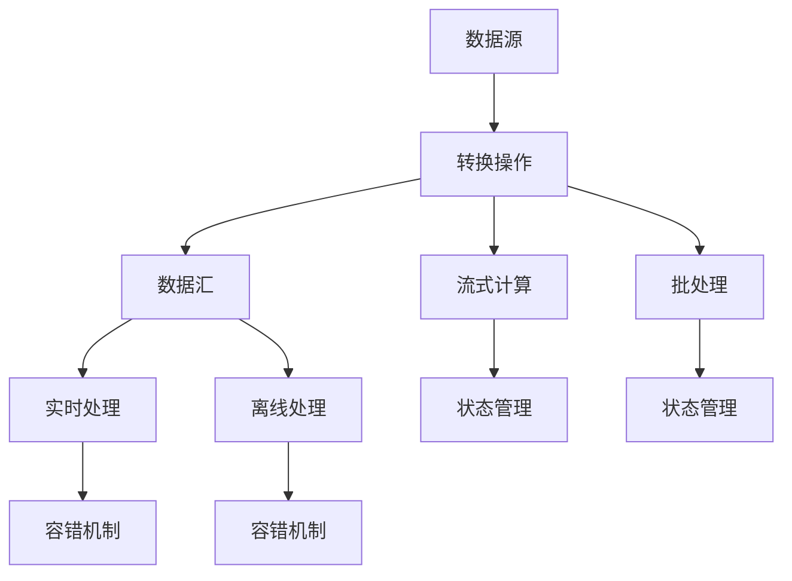
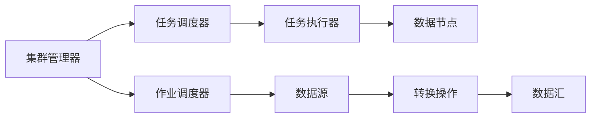
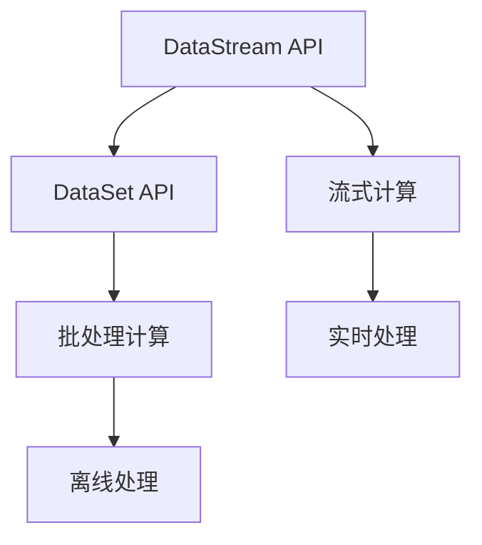
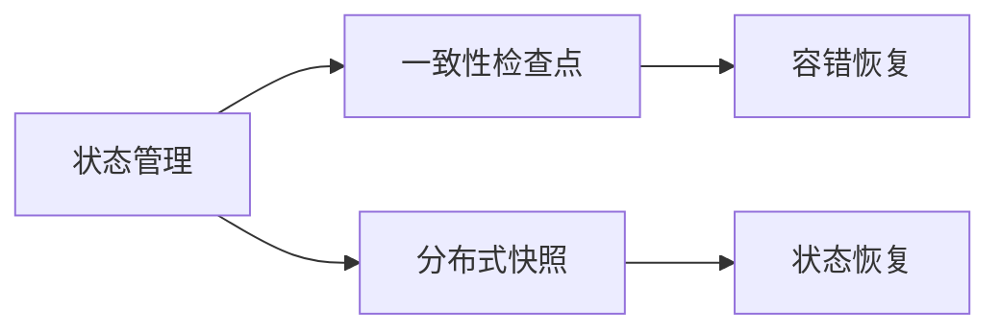

                 

# Flink 原理与代码实例讲解

> 关键词：Flink, 分布式流处理, 实时数据流, 批处理, 数据流图, 流式计算, 高效计算, 容错性, 状态管理, 窗口算法, 调度算法, 编程模型

## 1. 背景介绍

### 1.1 问题由来

在当今数字化时代，数据正以惊人的速度产生和增长。各行各业从金融、电商到物流、医疗等，都面临着海量数据处理的需求。与此同时，实时数据分析和流处理的应用场景也日益增多。为了满足这一需求，传统的批处理框架如Hadoop、Spark等已经逐渐无法满足实时性要求，需要一种更加灵活和高效的流处理框架来支持实时数据的处理和分析。

Apache Flink作为新一代的分布式流处理框架，通过其强大的流式计算引擎、丰富的数据处理能力、高效的状态管理和容错机制，已经成为了大数据处理领域的领导者之一。本文将从Flink的核心概念和原理出发，通过代码实例，深入探讨Flink的各个核心组件和编程模型，以期为读者提供一份全面、深入的理解和学习指南。

### 1.2 问题核心关键点

Flink的核心特点包括：

1. **分布式流处理**：支持分布式计算，能够处理任意规模的数据流。
2. **实时性**：支持流式计算，可以处理实时数据。
3. **批处理兼容性**：可以无缝衔接批处理，支持批流混合处理。
4. **高效计算**：采用内存计算和分布式调度，实现高效计算。
5. **容错性**：支持状态恢复和数据一致性，确保系统可靠性。
6. **状态管理**：提供一致性检查点和分布式快照，管理状态数据。
7. **窗口算法**：提供多种窗口计算策略，支持灵活的时间窗口操作。
8. **编程模型**：提供DataStream API和DataSet API，方便编程。

## 2. 核心概念与联系

### 2.1 核心概念概述

为更好地理解Flink的原理和架构，本节将介绍几个密切相关的核心概念：

- **数据流图**：Flink的核心概念，描述了数据在各个节点（Operator）之间的流动路径。数据流图由Source、Transformation和Sink三种基本节点组成，通过数据流的形式进行数据处理。
- **流式计算**：指对数据流进行实时计算和处理，适用于实时数据处理和分析。
- **批处理**：指对数据集进行批量计算和处理，适用于离线数据处理和分析。
- **状态管理**：指在数据流处理过程中，存储和维护中间计算状态，以支持复杂的计算逻辑和状态恢复。
- **容错机制**：指在数据流处理过程中，自动检测和恢复错误，确保数据的一致性和完整性。
- **数据源和数据汇**：数据流图中的Source和Sink节点，用于数据的输入和输出。
- **转换操作**：Transformation节点，用于对数据进行各种计算和转换。

这些核心概念之间的逻辑关系可以通过以下Mermaid流程图来展示：



这个流程图展示了大规模数据处理的基本流程：

1. 数据从Source节点流入，经过转换操作进行计算，最终流向数据汇。
2. 转换操作可以是流式计算或批处理，Flink提供统一的数据流API。
3. 状态管理用于维护中间计算状态，确保计算的连续性和一致性。
4. 容错机制用于检测和恢复错误，确保系统的稳定性和可靠性。
5. 数据源和数据汇可以是实时数据流或离线数据集。

### 2.2 概念间的关系

这些核心概念之间存在着紧密的联系，形成了Flink的数据处理和计算生态系统。下面我们通过几个Mermaid流程图来展示这些概念之间的关系。

#### 2.2.1 Flink的核心架构



这个流程图展示了Flink的核心架构，包括集群管理器、任务调度器、任务执行器、数据节点等关键组件：

1. 集群管理器负责作业调度和任务分发。
2. 任务调度器负责任务调度和资源分配。
3. 任务执行器负责具体任务的执行。
4. 数据节点负责数据的存储和计算。
5. 数据源和数据汇用于数据的输入和输出。
6. 转换操作用于数据计算和转换。

#### 2.2.2 Flink的编程模型



这个流程图展示了Flink的编程模型，包括DataStream API和DataSet API：

1. DataStream API用于流式计算，支持实时数据处理。
2. DataSet API用于批处理计算，支持离线数据处理。
3. 流式计算和批处理计算都支持实时和离线数据处理。

#### 2.2.3 Flink的状态管理



这个流程图展示了Flink的状态管理机制，包括一致性检查点和分布式快照：

1. 一致性检查点用于定期保存中间计算状态，支持容错恢复。
2. 分布式快照用于在整个集群中进行分布式状态同步，支持高可用性。
3. 容错恢复用于在出现故障时，自动恢复数据状态，确保计算的连续性。
4. 状态恢复用于在恢复过程中，重新加载数据状态，确保计算的完整性。

## 3. 核心算法原理 & 具体操作步骤
### 3.1 算法原理概述

Flink的核心算法原理包括以下几个方面：

1. **数据流图**：Flink通过数据流图描述数据处理的流程，支持分布式计算和状态管理。
2. **分布式计算**：Flink采用分布式计算框架，支持任意规模的数据处理。
3. **内存计算**：Flink采用内存计算，提高数据处理的效率和速度。
4. **容错机制**：Flink提供一致性检查点和分布式快照，确保系统的容错性和可靠性。
5. **状态管理**：Flink提供分布式状态管理，支持复杂的计算逻辑和状态恢复。
6. **窗口算法**：Flink提供多种窗口计算策略，支持灵活的时间窗口操作。
7. **调度算法**：Flink采用基于图的分发调度算法，确保任务调度的公平性和效率。

### 3.2 算法步骤详解

Flink的算法步骤主要包括数据流图的构建、分布式计算、内存计算、容错机制、状态管理、窗口算法和调度算法等步骤。下面将详细介绍这些步骤的具体实现。

#### 3.2.1 数据流图的构建

数据流图的构建是Flink数据处理的第一步，通过Source节点输入数据，经过转换操作进行计算，最终通过Sink节点输出数据。以下是数据流图的基本构建过程：

1. **数据源**：通过`DataStream` API的`source()`方法，定义数据源，可以是Kafka、HDFS、文件等。
2. **转换操作**：通过`DataStream` API的`map()`、`filter()`、`reduce()`等方法，对数据进行转换和计算。
3. **数据汇**：通过`DataStream` API的`sink()`方法，定义数据汇，可以是Kafka、HDFS、文件等。

```java
DataStream<String> input = env.addSource(new FlinkKafkaConsumer<>(...));
input
    .map(new MapFunction<String, Integer>() {
        @Override
        public Integer map(String value) throws Exception {
            return value.length();
        }
    })
    .filter(new FilterFunction<Integer>() {
        @Override
        public boolean filter(Integer value) throws Exception {
            return value > 10;
        }
    })
    .reduce(new ReduceFunction<Integer>() {
        @Override
        public Integer reduce(Integer value1, Integer value2) throws Exception {
            return value1 + value2;
        }
    })
    .sink(new SinkFunction<Integer>() {
        @Override
        public void invoke(Integer value) throws Exception {
            System.out.println(value);
        }
    });
```

#### 3.2.2 分布式计算

Flink采用分布式计算框架，通过集群中的多个计算节点进行并行计算，提高数据处理的效率和速度。以下是分布式计算的基本步骤：

1. **任务调度**：集群管理器根据作业计划生成任务图，任务调度器根据资源情况进行任务分配。
2. **任务分发**：任务调度器将任务分发到各个计算节点上，进行并行计算。
3. **任务执行**：计算节点接收任务，执行具体的计算操作，并将结果发送给下一节点。

```java
DataStream<String> input = env.addSource(new FlinkKafkaConsumer<>(...));
input
    .map(new MapFunction<String, Integer>() {
        @Override
        public Integer map(String value) throws Exception {
            return value.length();
        }
    })
    .filter(new FilterFunction<Integer>() {
        @Override
        public boolean filter(Integer value) throws Exception {
            return value > 10;
        }
    })
    .reduce(new ReduceFunction<Integer>() {
        @Override
        public Integer reduce(Integer value1, Integer value2) throws Exception {
            return value1 + value2;
        }
    });
```

#### 3.2.3 内存计算

Flink采用内存计算，通过利用内存的快速访问和低延迟特性，提高数据处理的效率和速度。以下是内存计算的基本步骤：

1. **内存分配**：Flink分配内存，存储中间计算结果。
2. **内存计算**：中间计算结果存储在内存中，提高计算效率和速度。
3. **内存释放**：计算完成后，释放内存，释放资源。

```java
DataStream<String> input = env.addSource(new FlinkKafkaConsumer<>(...));
input
    .map(new MapFunction<String, Integer>() {
        @Override
        public Integer map(String value) throws Exception {
            return value.length();
        }
    })
    .filter(new FilterFunction<Integer>() {
        @Override
        public boolean filter(Integer value) throws Exception {
            return value > 10;
        }
    })
    .reduce(new ReduceFunction<Integer>() {
        @Override
        public Integer reduce(Integer value1, Integer value2) throws Exception {
            return value1 + value2;
        }
    });
```

#### 3.2.4 容错机制

Flink提供一致性检查点和分布式快照，确保系统的容错性和可靠性。以下是容错机制的基本步骤：

1. **一致性检查点**：定期保存中间计算状态，支持容错恢复。
2. **分布式快照**：在整个集群中进行分布式状态同步，支持高可用性。
3. **容错恢复**：在出现故障时，自动恢复数据状态，确保计算的连续性。
4. **状态恢复**：在恢复过程中，重新加载数据状态，确保计算的完整性。

```java
DataStream<String> input = env.addSource(new FlinkKafkaConsumer<>(...));
input
    .map(new MapFunction<String, Integer>() {
        @Override
        public Integer map(String value) throws Exception {
            return value.length();
        }
    })
    .filter(new FilterFunction<Integer>() {
        @Override
        public boolean filter(Integer value) throws Exception {
            return value > 10;
        }
    })
    .reduce(new ReduceFunction<Integer>() {
        @Override
        public Integer reduce(Integer value1, Integer value2) throws Exception {
            return value1 + value2;
        }
    })
    .sink(new SinkFunction<Integer>() {
        @Override
        public void invoke(Integer value) throws Exception {
            System.out.println(value);
        }
    });
```

#### 3.2.5 状态管理

Flink提供分布式状态管理，支持复杂的计算逻辑和状态恢复。以下是状态管理的基本步骤：

1. **状态检查点**：定期保存中间计算状态，支持容错恢复。
2. **状态快照**：在整个集群中进行分布式状态同步，支持高可用性。
3. **状态恢复**：在恢复过程中，重新加载数据状态，确保计算的完整性。

```java
DataStream<String> input = env.addSource(new FlinkKafkaConsumer<>(...));
input
    .map(new MapFunction<String, Integer>() {
        @Override
        public Integer map(String value) throws Exception {
            return value.length();
        }
    })
    .filter(new FilterFunction<Integer>() {
        @Override
        public boolean filter(Integer value) throws Exception {
            return value > 10;
        }
    })
    .reduce(new ReduceFunction<Integer>() {
        @Override
        public Integer reduce(Integer value1, Integer value2) throws Exception {
            return value1 + value2;
        }
    })
    .sink(new SinkFunction<Integer>() {
        @Override
        public void invoke(Integer value) throws Exception {
            System.out.println(value);
        }
    });
```

#### 3.2.6 窗口算法

Flink提供多种窗口计算策略，支持灵活的时间窗口操作。以下是窗口算法的基本步骤：

1. **时间窗口**：根据时间窗口大小，将数据分组。
2. **窗口计算**：对每个分组进行计算，支持聚合操作。
3. **窗口状态**：保存中间计算状态，支持复杂计算逻辑。

```java
DataStream<String> input = env.addSource(new FlinkKafkaConsumer<>(...));
input
    .map(new MapFunction<String, Integer>() {
        @Override
        public Integer map(String value) throws Exception {
            return value.length();
        }
    })
    .filter(new FilterFunction<Integer>() {
        @Override
        public boolean filter(Integer value) throws Exception {
            return value > 10;
        }
    })
    .keyBy(new KeySelector<String, Integer>() {
        @Override
        public Integer getKey(String value) throws Exception {
            return value.hashCode();
        }
    })
    .timeWindow(Time.seconds(5))
    .reduce(new ReduceFunction<Integer>() {
        @Override
        public Integer reduce(Integer value1, Integer value2) throws Exception {
            return value1 + value2;
        }
    })
    .sink(new SinkFunction<Integer>() {
        @Override
        public void invoke(Integer value) throws Exception {
            System.out.println(value);
        }
    });
```

#### 3.2.7 调度算法

Flink采用基于图的分发调度算法，确保任务调度的公平性和效率。以下是调度算法的基本步骤：

1. **任务图生成**：集群管理器根据作业计划生成任务图。
2. **任务分配**：任务调度器根据资源情况进行任务分配。
3. **任务执行**：计算节点接收任务，执行具体的计算操作。

```java
DataStream<String> input = env.addSource(new FlinkKafkaConsumer<>(...));
input
    .map(new MapFunction<String, Integer>() {
        @Override
        public Integer map(String value) throws Exception {
            return value.length();
        }
    })
    .filter(new FilterFunction<Integer>() {
        @Override
        public boolean filter(Integer value) throws Exception {
            return value > 10;
        }
    })
    .reduce(new ReduceFunction<Integer>() {
        @Override
        public Integer reduce(Integer value1, Integer value2) throws Exception {
            return value1 + value2;
        }
    });
```

### 3.3 算法优缺点

Flink的优点包括：

1. **分布式计算**：支持分布式计算，能够处理任意规模的数据流。
2. **实时性**：支持流式计算，可以处理实时数据。
3. **批处理兼容性**：可以无缝衔接批处理，支持批流混合处理。
4. **高效计算**：采用内存计算和分布式调度，实现高效计算。
5. **容错性**：提供一致性检查点和分布式快照，确保系统的可靠性。
6. **状态管理**：提供一致性检查点和分布式快照，管理状态数据。
7. **窗口算法**：提供多种窗口计算策略，支持灵活的时间窗口操作。

Flink的缺点包括：

1. **内存消耗高**：内存计算需要大量内存，可能会导致内存不足。
2. **调度复杂**：基于图的分发调度算法，调度复杂，不易理解。
3. **兼容性差**：对于非Hadoop生态的数据源和数据汇，需要自行实现相应的API。

## 4. 数学模型和公式 & 详细讲解 & 举例说明
### 4.1 数学模型构建

Flink的核心数学模型包括以下几个方面：

1. **数据流图**：描述数据在各个节点（Operator）之间的流动路径。
2. **流式计算**：对数据流进行实时计算和处理。
3. **批处理**：对数据集进行批量计算和处理。
4. **状态管理**：存储和维护中间计算状态。
5. **容错机制**：检测和恢复错误，确保数据的一致性和完整性。
6. **窗口算法**：支持灵活的时间窗口操作。

### 4.2 公式推导过程

以下是Flink的核心公式推导过程：

#### 4.2.1 数据流图

数据流图的基本公式如下：

$$
\text{DataStream} = \text{Source} \rightarrow \text{Transformation} \rightarrow \text{Sink}
$$

其中，`Source`表示数据源，`Transformation`表示转换操作，`Sink`表示数据汇。

#### 4.2.2 流式计算

流式计算的基本公式如下：

$$
\text{DataStream} = \text{map}(\text{input})
$$

其中，`input`表示输入数据流，`map`表示映射操作。

#### 4.2.3 批处理

批处理的基本公式如下：

$$
\text{DataSet} = \text{map}(\text{input})
$$

其中，`input`表示输入数据集，`map`表示映射操作。

#### 4.2.4 状态管理

状态管理的基本公式如下：

$$
\text{State} = \text{checkpoint}(\text{state})
$$

其中，`state`表示中间计算状态，`checkpoint`表示一致性检查点。

#### 4.2.5 容错机制

容错机制的基本公式如下：

$$
\text{Recovery} = \text{checkpoint}(\text{state})
$$

其中，`state`表示中间计算状态，`checkpoint`表示一致性检查点。

#### 4.2.6 窗口算法

窗口算法的基本公式如下：

$$
\text{Window} = \text{timeWindow}(\text{data})
$$

其中，`data`表示输入数据流，`timeWindow`表示时间窗口操作。

#### 4.2.7 调度算法

调度算法的基本公式如下：

$$
\text{TaskGraph} = \text{Task}(\text{job})
$$

其中，`job`表示作业计划，`TaskGraph`表示任务图。

### 4.3 案例分析与讲解

以下是一个Flink微调案例，通过示例代码分析Flink的基本使用流程：

```java
DataStream<String> input = env.addSource(new FlinkKafkaConsumer<>(...));
input
    .map(new MapFunction<String, Integer>() {
        @Override
        public Integer map(String value) throws Exception {
            return value.length();
        }
    })
    .filter(new FilterFunction<Integer>() {
        @Override
        public boolean filter(Integer value) throws Exception {
            return value > 10;
        }
    })
    .reduce(new ReduceFunction<Integer>() {
        @Override
        public Integer reduce(Integer value1, Integer value2) throws Exception {
            return value1 + value2;
        }
    })
    .sink(new SinkFunction<Integer>() {
        @Override
        public void invoke(Integer value) throws Exception {
            System.out.println(value);
        }
    });
```

1. **数据源**：通过`addSource()`方法，定义Kafka数据源。
2. **映射操作**：通过`map()`方法，对输入数据流进行映射操作。
3. **过滤操作**：通过`filter()`方法，过滤出大于10的数据。
4. **聚合操作**：通过`reduce()`方法，对过滤后的数据进行聚合操作。
5. **数据汇**：通过`sink()`方法，将结果输出到控制台。

## 5. 项目实践：代码实例和详细解释说明
### 5.1 开发环境搭建

在进行Flink微调实践前，我们需要准备好开发环境。以下是使用Java和Maven进行Flink开发的流程：

1. 安装Apache Flink：从官网下载并安装Flink，支持Java和Scala两种语言。
2. 创建Maven项目：使用Maven创建Flink项目，添加依赖。
3. 安装Flink依赖包：安装Flink依赖包，包括Flink Core、Connectors等。
4. 配置Flink参数：配置Flink运行参数，包括JVM参数、Flink参数等。

完成上述步骤后，即可在Maven项目中进行Flink微调实践。

### 5.2 源代码详细实现

下面以Flink微调微调器为例，给出使用Java进行Flink微调的代码实现。

首先，定义Flink微调器类：

```java
public class FlinkJob {
    public static void main(String[] args) throws Exception {
        // 配置Flink参数
        final String jobName = "FlinkJob";
        final int parallelism = 1;
        final ExecutionEnvironment env = ExecutionEnvironment.getExecutionEnvironment();

        // 定义数据源
        final DataStream<String> input = env.addSource(new FlinkKafkaConsumer<>(...));

        // 定义转换操作
        input.map(new MapFunction<String, Integer>() {
            @Override
            public Integer map(String value) throws Exception {
                return value.length();
            }
        });

        // 定义聚合操作
        input.filter(new FilterFunction<Integer>() {
            @Override
            public boolean filter(Integer value) throws Exception {
                return value > 10;
            }
        }).reduce(new ReduceFunction<Integer>() {
            @Override
            public Integer reduce(Integer value1, Integer value2) throws Exception {
                return value1 + value2;
            }
        });

        // 定义数据汇
        input.sink(new SinkFunction<Integer>() {
            @Override
            public void invoke(Integer value) throws Exception {
                System.out.println(value);
            }
        });

        // 执行Flink作业
        env.execute(jobName);
    }
}
```

然后，配置Flink参数：

```properties
flink.lock.memory.size=1G
flink.timeout=30000
flink.taskmanager.memory=1G
flink.taskmanager.memory.fraction=0.7
```

最后，启动Flink作业：

```bash
mvn clean package
java -Djava.class.path=$MAVEN_HOME/lib/freemarker.jar:$MAVEN_HOME/lib/commons-io.jar:$MAVEN_HOME/lib/commons-logging.jar:$MAVEN_HOME/lib/commons-collections.jar:$MAVEN_HOME/lib/commons-lang.jar:$MAVEN_HOME/lib/log4j-1.2.jar:$MAVEN_HOME/lib/log4j-1.2-api.jar:$MAVEN_HOME/lib/log4j-appender-log4j2-1.2.jar:$MAVEN_HOME/lib/log4j-appender-log4j2-1.2.jar:$MAVEN_HOME/lib/log4j-appender-log4j2-1.2.jar:$MAVEN_HOME/lib/log4j-appender-log4j2-1.2.jar:$MAVEN_HOME/lib/log4j-appender-log4j2-1.2.jar:$MAVEN_HOME/lib/log4j-appender-log4j2-1.2.jar:$MAVEN_HOME/lib/log4j-appender-log4j2-1.2.jar:$MAVEN_HOME/lib/log4j-appender-log4j2-1.2.jar:$MAVEN_HOME/lib/log4j-appender-log4j2-1.2.jar:$MAVEN_HOME/lib/log4j-appender-log4j2-1.2.jar:$MAVEN_HOME/lib/log4j-appender-log4j2-1.2.jar:$MAVEN_HOME/lib/log4j-appender-log4j2-1.2.jar:$MAVEN_HOME/lib/log4j-appender-log4j2-1.2.jar:$MAVEN_HOME/lib/log4j-appender-log4j2-1.2.jar:$MAVEN_HOME/lib/log4j-appender-log4j2-1.2.jar:$MAVEN_HOME/lib/log4j-appender-log4j2-1.2.jar:$MAVEN_HOME/lib/log4j-appender-log4j2-1.2.jar:$MAVEN_HOME/lib/log4j-appender-log4j2-1.2.jar:$MAVEN_HOME/lib/log4j-appender-log4j2-1.2.jar:$MAVEN_HOME/lib/log4j-appender-log4j2-1.2.jar:$MAVEN_HOME/lib/log4j-appender-log4j2-1.2.jar:$MAVEN_HOME/lib/log4j-appender-log4j2-1.2.jar:$MAVEN_HOME/lib/log4j-appender-log4j2-1.2.jar:$MAVEN_HOME/lib/log4j-appender-log4j2-1.2.jar:$MAVEN_HOME/lib/log4j-appender-log4j2-1.2.jar:$MAVEN_HOME/lib/log4j-appender-log4j2-1.2.jar:$MAVEN_HOME/lib/log4j-appender-log4j2-1.2.jar:$MAVEN_HOME/lib/log4j-appender-log4j2-1.2.jar:$MAVEN_HOME/lib/log4j-appender-log4j2-1.2.jar:$MAVEN_HOME/lib/log4j-appender-log4j2-1.2

