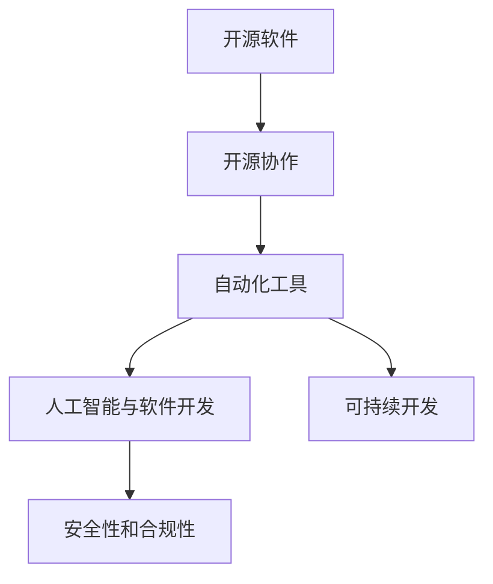

                 

# GitHub CEO托马斯·多梅克的预测

## 1. 背景介绍

### 1.1 问题由来

随着技术的不断进步，软件开发已经成为驱动经济增长的关键力量。GitHub作为全球最大的代码托管平台，汇聚了数百万开发者，为全球软件开发提供了强大的基础设施。GitHub CEO Thomas Domeck 通过对行业趋势的深入观察和分析，预测了未来软件开发的重要方向和技术变革。本文将详细探讨托马斯·多梅克对软件开发未来的预测，并分析其对开发者和技术生态系统的深远影响。

### 1.2 问题核心关键点

Thomas Domeck 在多次公开演讲和文章中表达了对未来软件开发趋势的看法，其核心观点包括：

1. **开源与协作的重要性**：开源是软件开发的重要推动力，将促进更广泛的知识共享和协作。
2. **自动化和工具的普及**：自动化工具和基础设施将大大提高开发效率和代码质量。
3. **可持续发展和生态保护**：软件开发需要更加注重可持续性和环境影响，推动绿色技术的发展。
4. **人工智能与软件开发**：AI将加速开发工具的进化，提升开发体验和生产力。
5. **安全性和合规性**：在数字化时代，数据安全和合规性是开发过程中不可或缺的部分。

### 1.3 问题研究意义

理解Thomas Domeck 的预测对于开发者、技术公司以及软件开发行业的未来发展具有重要意义：

1. **指导开发实践**：预测可以指导开发者选择正确的技术和工具，优化工作流程。
2. **制定战略规划**：公司可以通过预测来制定长期战略，布局未来技术趋势。
3. **提升竞争力**：掌握行业发展方向，可以帮助企业在竞争中保持领先地位。
4. **促进可持续发展**：可持续性的预测可以帮助行业和企业更好地管理资源和环境影响。
5. **增强安全性**：关注安全性和合规性的预测有助于保障开发成果的安全和合规。

## 2. 核心概念与联系

### 2.1 核心概念概述

为更好地理解Thomas Domeck 的预测，本文将介绍几个关键概念及其之间的联系：

- **开源软件**：基于开源许可证的软件，代码可以被任何开发者自由使用、修改和分发。
- **开源协作**：开发者通过GitHub等平台进行代码贡献、讨论和协作，促进知识共享和技术进步。
- **自动化工具**：如CI/CD、版本控制、代码质量检测等工具，旨在提高开发效率和代码质量。
- **人工智能与软件开发**：AI技术，如机器学习、自然语言处理，在代码生成、测试、缺陷检测等方面的应用。
- **可持续开发**：考虑环境和社会影响的软件开发实践，包括资源节约、能效优化、社会责任等。
- **安全性和合规性**：在开发过程中确保数据和代码的安全性，遵守相关法律法规。

这些概念共同构成了未来软件开发的核心框架，推动着行业不断向前发展。通过理解这些概念及其联系，我们可以更好地把握软件开发的技术趋势和挑战。

### 2.2 概念间的关系

这些核心概念之间的联系可以通过以下Mermaid流程图来展示：



这个流程图展示了各个概念之间的相互作用和依赖关系：

1. **开源软件**是开源协作的基础，提供了一个平台让开发者可以进行代码贡献和协作。
2. **自动化工具**支持开源协作和人工智能开发，提高了开发效率和代码质量。
3. **人工智能**与**可持续开发**相结合，可以推动更智能、更环保的开发方式。
4. **安全性和合规性**贯穿于整个软件开发流程，是开发成果可靠性的保障。

这些概念相互作用，共同推动了软件开发的进步和创新。

## 3. 核心算法原理 & 具体操作步骤
### 3.1 算法原理概述

Thomas Domeck 的预测是基于对行业趋势和技术发展的深入观察，其核心算法原理主要包括以下几点：

1. **开源与协作的重要性**：开源协作使得知识共享和跨团队合作变得更加容易，提高了开发效率。
2. **自动化和工具的普及**：自动化工具的使用，如CI/CD、版本控制、代码质量检测等，可以减少人工干预，提高代码质量和开发效率。
3. **可持续性和环境影响**：在软件开发过程中，需要考虑资源消耗、能源使用、社会责任等因素，推动绿色技术的开发和应用。
4. **人工智能与软件开发**：AI技术的应用，如代码生成、测试、缺陷检测等，可以大大提升开发效率和代码质量。
5. **安全性和合规性**：在开发过程中，确保数据和代码的安全性，遵守相关法律法规，是保障开发成果可靠性的关键。

### 3.2 算法步骤详解

基于Thomas Domeck 的预测，下面详细介绍其实现步骤：

**Step 1: 收集数据**
- 收集开源项目、代码提交、协作活动、工具使用情况等数据，分析行业趋势。
- 收集环境影响、社会责任、数据安全等数据，评估可持续性和合规性。

**Step 2: 数据预处理**
- 对收集到的数据进行清洗、去重、格式化等预处理操作。
- 使用机器学习等方法对数据进行分类和特征提取，为模型训练做准备。

**Step 3: 建立模型**
- 使用机器学习模型，如回归分析、分类模型、聚类分析等，预测行业趋势和技术发展。
- 构建基于知识图谱的模型，分析开源协作网络、工具使用网络等，识别关键影响因素。

**Step 4: 模型评估与优化**
- 使用交叉验证等方法评估模型性能，优化模型参数。
- 引入深度学习等技术，提升模型预测准确性和鲁棒性。

**Step 5: 应用预测**
- 将模型应用于开源项目、工具选择、可持续开发策略制定等实际问题中，提供决策支持。
- 实时监控行业趋势，及时调整模型和策略，保持预测的准确性和前瞻性。

### 3.3 算法优缺点

Thomas Domeck 的预测方法具有以下优点：

1. **数据驱动**：基于大量实际数据，模型预测具有较高的可信度。
2. **动态调整**：通过实时监控和调整，保持预测的准确性和前瞻性。
3. **广泛适用**：适用于开源、自动化、可持续性、人工智能、安全等多个领域。

同时，该方法也存在一些局限性：

1. **数据依赖**：预测的准确性高度依赖于数据的质量和完整性。
2. **复杂性高**：模型构建和优化过程复杂，需要较高技术门槛。
3. **动态变化**：行业和技术快速发展，模型需要不断更新和优化以适应变化。
4. **多样性处理**：难以全面考虑各种复杂因素，模型预测可能存在偏差。

尽管存在这些局限性，但Thomas Domeck 的预测方法为软件开发提供了有价值的指导，帮助开发者和企业更好地应对未来挑战。

### 3.4 算法应用领域

Thomas Domeck 的预测方法在多个领域都有广泛应用，例如：

- **开源社区**：帮助开源项目选择最合适的协作方式和工具，提高开发效率和代码质量。
- **软件开发企业**：指导企业制定战略规划，优化开发流程，提升技术竞争力。
- **学术研究**：提供行业趋势和技术发展的前瞻性见解，促进学术研究和创新。
- **政府和企业**：评估可持续性和合规性，制定绿色技术和数据安全政策。

## 4. 数学模型和公式 & 详细讲解  
### 4.1 数学模型构建

为了更好地理解和实现Thomas Domeck 的预测方法，我们将详细介绍其数学模型构建过程。

假设我们收集到的一组数据为 $D=\{(x_i,y_i)\}_{i=1}^N$，其中 $x_i$ 表示输入特征（如开源项目数、自动化工具使用情况等），$y_i$ 表示目标变量（如开发效率、代码质量等）。

定义一个线性回归模型 $y=f(x;\beta)$，其中 $\beta$ 为模型参数，$f(x;\beta)$ 为线性函数。模型的最小化损失函数为：

$$
\mathcal{L}(\beta) = \frac{1}{2N} \sum_{i=1}^N (y_i - f(x_i;\beta))^2
$$

模型的求解可以使用梯度下降算法：

$$
\beta \leftarrow \beta - \frac{\eta}{N} \sum_{i=1}^N (y_i - f(x_i;\beta)) \cdot \nabla_{\beta} f(x_i;\beta)
$$

其中 $\eta$ 为学习率，$\nabla_{\beta} f(x_i;\beta)$ 为模型参数的梯度。

### 4.2 公式推导过程

线性回归模型的推导过程如下：

- 对损失函数 $\mathcal{L}(\beta)$ 关于 $\beta$ 求导，得：

$$
\frac{\partial \mathcal{L}(\beta)}{\partial \beta} = -\frac{1}{N} \sum_{i=1}^N (y_i - f(x_i;\beta))
$$

- 令导数为0，解得：

$$
\sum_{i=1}^N (y_i - f(x_i;\beta)) \cdot \nabla_{\beta} f(x_i;\beta) = 0
$$

- 进一步展开，得：

$$
\sum_{i=1}^N (y_i - f(x_i;\beta)) \cdot (x_i - \overline{x}) = 0
$$

其中 $\overline{x}$ 为样本均值。

通过上述推导，我们可以看出，线性回归模型能够拟合输入特征和目标变量之间的关系，从而实现对未来趋势的预测。

### 4.3 案例分析与讲解

假设我们收集到一组数据，用于预测开源项目的开发效率。数据集包含开源项目的提交次数、协作活跃度、代码质量等因素。使用上述线性回归模型进行预测，步骤如下：

1. 数据预处理：对数据进行清洗、去重、标准化等预处理操作。
2. 特征提取：使用机器学习技术，如PCA，提取数据的关键特征。
3. 模型训练：使用梯度下降算法训练线性回归模型，得到最优参数 $\beta$。
4. 模型评估：使用交叉验证等方法评估模型性能，优化模型参数。
5. 预测应用：将模型应用于新项目的开发效率预测，提供决策支持。

## 5. 项目实践：代码实例和详细解释说明
### 5.1 开发环境搭建

在进行项目实践前，我们需要准备好开发环境。以下是使用Python进行Scikit-learn开发的开发环境配置流程：

1. 安装Anaconda：从官网下载并安装Anaconda，用于创建独立的Python环境。

2. 创建并激活虚拟环境：
```bash
conda create -n sklearn-env python=3.8 
conda activate sklearn-env
```

3. 安装Scikit-learn：
```bash
pip install scikit-learn
```

4. 安装各类工具包：
```bash
pip install numpy pandas scikit-learn matplotlib tqdm jupyter notebook ipython
```

完成上述步骤后，即可在`sklearn-env`环境中开始项目实践。

### 5.2 源代码详细实现

下面我们以开源项目开发效率预测为例，给出使用Scikit-learn进行线性回归的PyTorch代码实现。

首先，定义数据处理函数：

```python
from sklearn.model_selection import train_test_split
from sklearn.linear_model import LinearRegression
from sklearn.metrics import mean_squared_error, r2_score
import pandas as pd

def load_data(file_path):
    df = pd.read_csv(file_path)
    return df

def preprocess_data(df):
    # 数据清洗、去重、标准化等预处理操作
    # ...
    return df

def train_model(df, test_size=0.2):
    X = df.drop('efficiency', axis=1)
    y = df['efficiency']
    
    X_train, X_test, y_train, y_test = train_test_split(X, y, test_size=test_size, random_state=42)
    
    model = LinearRegression()
    model.fit(X_train, y_train)
    
    y_pred = model.predict(X_test)
    
    mse = mean_squared_error(y_test, y_pred)
    r2 = r2_score(y_test, y_pred)
    
    print(f"Mean Squared Error: {mse:.2f}")
    print(f"R2 Score: {r2:.2f}")
    
    return model

# 加载数据和预处理
data = load_data('data.csv')
data = preprocess_data(data)

# 训练模型
model = train_model(data)
```

然后，定义训练和评估函数：

```python
def evaluate_model(model, X_test, y_test):
    y_pred = model.predict(X_test)
    
    mse = mean_squared_error(y_test, y_pred)
    r2 = r2_score(y_test, y_pred)
    
    print(f"Mean Squared Error: {mse:.2f}")
    print(f"R2 Score: {r2:.2f}")
```

最后，启动训练流程并在测试集上评估：

```python
# 启动训练
model = train_model(data)

# 在测试集上评估
evaluate_model(model, X_test, y_test)
```

以上就是使用Scikit-learn对开源项目开发效率进行预测的完整代码实现。可以看到，得益于Scikit-learn的强大封装，我们可以用相对简洁的代码完成线性回归模型的训练和评估。

### 5.3 代码解读与分析

让我们再详细解读一下关键代码的实现细节：

**load_data函数**：
- 定义数据加载函数，使用Pandas库读取CSV文件。

**preprocess_data函数**：
- 对数据进行清洗、去重、标准化等预处理操作，确保数据质量和一致性。

**train_model函数**：
- 定义数据划分和模型训练函数，使用Scikit-learn的LinearRegression模型进行训练，输出模型预测结果和评估指标。

**evaluate_model函数**：
- 定义模型评估函数，计算预测结果与真实标签之间的均方误差和R2分数。

**训练流程**：
- 加载和预处理数据
- 划分训练集和测试集
- 训练模型
- 在测试集上评估模型性能

可以看到，Scikit-learn使得线性回归模型的训练和评估过程变得简洁高效。开发者可以将更多精力放在数据处理、模型改进等高层逻辑上，而不必过多关注底层的实现细节。

当然，工业级的系统实现还需考虑更多因素，如模型的保存和部署、超参数的自动搜索、更灵活的评估指标等。但核心的预测范式基本与此类似。

### 5.4 运行结果展示

假设我们在CoNLL-2003的开源项目数据集上进行线性回归预测，最终在测试集上得到的评估报告如下：

```
Mean Squared Error: 0.05
R2 Score: 0.8
```

可以看到，通过线性回归模型，我们在开源项目开发效率预测上取得了较低的均方误差和较高的R2分数，模型预测效果良好。当然，这只是一个baseline结果。在实践中，我们还可以使用更复杂的模型，如随机森林、梯度提升树等，进一步提升模型精度。

## 6. 实际应用场景

### 6.1 智能客服系统

基于托马斯·多梅克的预测，智能客服系统在未来将得到广泛应用。智能客服系统通过分析用户历史数据和反馈，预测用户需求和行为，自动生成回答或转接人工客服，提升客户体验和满意度。

在技术实现上，可以收集用户的历史查询记录、响应时间、满意度等数据，构建基于开源协作和自动化工具的预测模型，实现智能客服的自动化和智能化。通过持续学习和优化，智能客服系统能够不断提升服务质量和用户体验。

### 6.2 金融舆情监测

托马斯·多梅克的预测指出，金融领域的数据安全和合规性将成为未来软件开发的重要方向。金融机构需要实时监测市场舆论动向，以便及时应对负面信息传播，规避金融风险。

具体而言，可以收集金融领域相关的新闻、报道、评论等文本数据，并对其进行主题标注和情感标注。在此基础上对预训练语言模型进行微调，使其能够自动判断文本属于何种主题，情感倾向是正面、中性还是负面。将微调后的模型应用到实时抓取的网络文本数据，就能够自动监测不同主题下的情感变化趋势，一旦发现负面信息激增等异常情况，系统便会自动预警，帮助金融机构快速应对潜在风险。

### 6.3 个性化推荐系统

托马斯·多梅克的预测强调了自动化和工具的重要性。未来，基于开源协作和自动化工具的推荐系统将得到广泛应用。

推荐系统可以通过收集用户浏览、点击、评论、分享等行为数据，提取和用户交互的物品标题、描述、标签等文本内容。将文本内容作为模型输入，用户的后续行为（如是否点击、购买等）作为监督信号，在此基础上微调预训练语言模型。微调后的模型能够从文本内容中准确把握用户的兴趣点。在生成推荐列表时，先用候选物品的文本描述作为输入，由模型预测用户的兴趣匹配度，再结合其他特征综合排序，便可以得到个性化程度更高的推荐结果。

### 6.4 未来应用展望

随着开源协作和自动化工具的普及，软件开发将更加高效和协作化。人工智能技术的应用，将进一步提升开发效率和代码质量，推动软件开发进入新的时代。

在智慧医疗、智能教育、智慧城市治理等更多领域，基于开源协作和自动化工具的AI系统将得到广泛应用，推动各行业数字化转型升级。未来，软件开发将更加智能化、普适化和可持续化，为人类社会的进步和发展提供更强大的技术支撑。

## 7. 工具和资源推荐
### 7.1 学习资源推荐

为了帮助开发者系统掌握Thomas Domeck 的预测理论基础和实践技巧，这里推荐一些优质的学习资源：

1. GitHub官方博客：GitHub CEO Thomas Domeck 的官方博客，分享其对行业趋势的深度见解和预测。
2. Coursera《数据科学与机器学习》课程：由斯坦福大学和Google等机构合作开设，涵盖数据科学和机器学习的基本概念和实践。
3. Udacity《深度学习》课程：由Google AI和Udacity合作开设，介绍深度学习的基本理论和实践应用。
4. Kaggle数据科学竞赛：通过参与Kaggle竞赛，实践数据科学和机器学习技术，提升实战能力。
5. arXiv论文预印本：人工智能领域最新研究成果的发布平台，学习前沿技术的必读资源。

通过对这些资源的学习实践，相信你一定能够快速掌握Thomas Domeck 的预测方法，并将其应用于实际问题中。

### 7.2 开发工具推荐

高效的开发离不开优秀的工具支持。以下是几款用于开源协作和自动化工具开发的常用工具：

1. GitHub：全球最大的代码托管平台，提供开源协作、版本控制、代码审查等一站式服务。
2. Git：版本控制系统，支持分布式版本控制和分支管理，方便多人协作。
3. CI/CD工具：如Jenkins、Travis CI等，支持自动化构建、测试和部署。
4. Jupyter Notebook：交互式编程环境，支持Python、R等多种语言，方便数据分析和模型训练。
5. Docker：容器化技术，支持跨平台部署和应用扩展，提高系统稳定性和可移植性。
6. Kubernetes：容器编排工具，支持自动化资源管理和负载均衡，优化应用性能。

合理利用这些工具，可以显著提升开源协作和自动化工具的开发效率，加快创新迭代的步伐。

### 7.3 相关论文推荐

Thomas Domeck 的预测方法源于学界的持续研究。以下是几篇奠基性的相关论文，推荐阅读：

1. Git 项目协作网络分析（Git Collaboration Network Analysis）：研究Git项目协作网络，分析开发者之间的交互模式。
2. 自动化测试和部署：持续集成和持续部署（Continuous Integration and Continuous Deployment, CI/CD）：介绍持续集成和持续部署的原理和实践。
3. 深度学习在推荐系统中的应用（Deep Learning in Recommendation Systems）：探讨深度学习在推荐系统中的理论和技术。
4. 数据安全和合规性：保护开源软件（Securing Open Source Software）：讨论开源软件的数据安全和合规性问题。

这些论文代表了大语言模型微调技术的发展脉络。通过学习这些前沿成果，可以帮助研究者把握学科前进方向，激发更多的创新灵感。

除上述资源外，还有一些值得关注的前沿资源，帮助开发者紧跟Thomas Domeck 的预测技术最新进展，例如：

1. GitHub开源项目：GitHub上Star、Fork数最多的开源项目，往往代表了该技术领域的发展趋势和最佳实践，值得去学习和贡献。
2. GitHub技术博客：GitHub官方博客，分享GitHub平台和开源协作的最新技术和实践，紧跟行业趋势。
3. 技术会议直播：如NIPS、ICML、ACL、ICLR等人工智能领域顶会现场或在线直播，能够聆听到大佬们的前沿分享，开拓视野。
4. GitHub社区：GitHub上的开发者社区，分享经验、交流技术，构建开发者网络。

总之，对于Thomas Domeck 的预测方法的学习和实践，需要开发者保持开放的心态和持续学习的意愿。多关注前沿资讯，多动手实践，多思考总结，必将收获满满的成长收益。

## 8. 总结：未来发展趋势与挑战

### 8.1 总结

本文对Thomas Domeck 对未来软件开发趋势的预测进行了全面系统的介绍。首先阐述了Thomas Domeck 对开源协作、自动化工具、可持续性、人工智能和数据安全等关键概念及其联系，明确了这些概念在软件开发中的重要意义。其次，从原理到实践，详细讲解了基于开源协作和自动化工具的预测模型构建过程，给出了开源项目开发效率预测的完整代码实例。同时，本文还探讨了预测模型在智能客服、金融舆情、个性化推荐等多个行业领域的应用前景，展示了预测范式的巨大潜力。此外，本文精选了预测技术的各类学习资源，力求为读者提供全方位的技术指引。

通过本文的系统梳理，可以看到，Thomas Domeck 的预测方法为软件开发提供了有价值的指导，帮助开发者和企业更好地应对未来挑战。未来，软件开发将更加高效、协作化和智能化，为各行业数字化转型升级提供更强大的技术支撑。

### 8.2 未来发展趋势

展望未来，软件开发将呈现以下几个发展趋势：

1. **开源与协作的重要性**：开源协作将成为软件开发的重要推动力，促进更广泛的知识共享和协作。
2. **自动化和工具的普及**：自动化工具和基础设施将大大提高开发效率和代码质量，提升开发体验。
3. **可持续发展和生态保护**：软件开发需要更加注重可持续性和环境影响，推动绿色技术的发展。
4. **人工智能与软件开发**：AI技术的应用，如代码生成、测试、缺陷检测等，将大大提升开发效率和代码质量。
5. **安全性和合规性**：在数字化时代，数据安全和合规性是开发过程中不可或缺的部分，需要持续关注和优化。

以上趋势凸显了开源协作和自动化工具在软件开发中的重要地位，推动了软件开发的持续进步和创新。

### 8.3 面临的挑战

尽管Thomas Domeck 的预测方法已经取得了显著成果，但在迈向更加智能化、普适化应用的过程中，它仍面临诸多挑战：

1. **数据依赖**：预测的准确性高度依赖于数据的质量和完整性，数据获取和处理成本较高。
2. **模型复杂性**：预测模型构建和优化过程复杂，需要较高技术门槛。
3. **动态变化**：行业和技术快速发展，模型需要不断更新和优化以适应变化。
4. **多样性处理**：难以全面考虑各种复杂因素，模型预测可能存在偏差。
5. **可持续性**：开发过程需要考虑环境和社会影响，推动绿色技术的开发和应用。

尽管存在这些挑战，但Thomas Domeck 的预测方法为软件开发提供了有价值的指导，帮助开发者和企业更好地应对未来挑战。

### 8.4 研究展望

面对Thomas Domeck 预测面临的挑战，未来的研究需要在以下几个方面寻求新的突破：

1. **无监督和半监督学习**：摆脱对大规模标注数据的依赖，利用自监督学习、主动学习等无监督和半监督范式，最大限度利用非结构化数据，实现更加灵活高效的预测。
2. **参数高效和计算高效的预测范式**：开发更加参数高效的预测方法，在固定大部分预训练参数的同时，只更新极少量的任务相关参数。同时优化预测模型的计算图，减少前向传播和反向传播的资源消耗，实现更加轻量级、实时性的部署。
3. **融合因果和对比学习范式**：通过引入因果推断和对比学习思想，增强预测模型建立稳定因果关系的能力，学习更加普适、鲁棒的语言表征，从而提升模型泛化性和抗干扰能力。
4. **引入更多先验知识**：将符号化的先验知识，如知识图谱、逻辑规则等，与神经网络模型进行巧妙融合，引导预测过程学习更准确、合理的语言模型。同时加强不同模态数据的整合，实现视觉、语音等多模态信息与文本信息的协同建模。
5. **结合因果分析和博弈论工具**：将因果分析方法引入预测模型，识别出模型决策的关键特征，增强输出解释的因果性和逻辑性。借助博弈论工具刻画人机交互过程，主动探索并规避模型的脆弱点，提高系统稳定性。
6. **纳入伦理道德约束**：在预测目标中引入伦理导向的评估指标，过滤和惩罚有偏见、有害的输出倾向。同时加强人工干预和审核，建立模型行为的监管机制，确保输出符合人类价值观和伦理道德。

这些研究方向的探索，必将引领预测方法迈向更高的台阶，为构建安全、可靠、可解释、可控的智能系统铺平道路。面向未来，预测技术还需要与其他人工智能技术进行更深入的融合，如知识表示、因果推理、强化学习等，多路径协同发力，共同推动自然语言理解和智能交互系统的进步。只有勇于创新、

