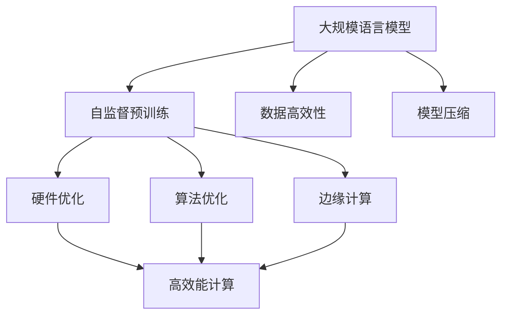
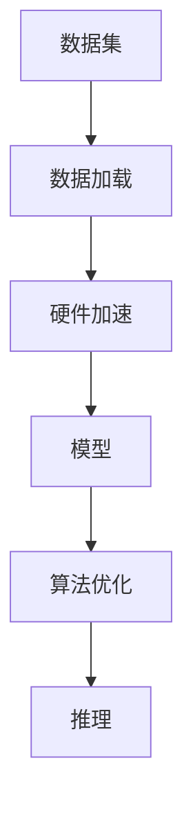
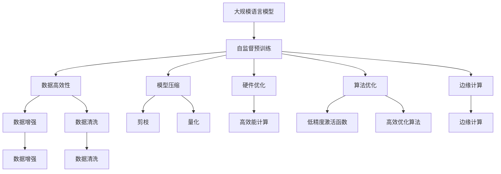

                 

# LLM的能源效率：绿色AI的发展之路

## 1. 背景介绍

### 1.1 问题由来
随着人工智能技术的快速发展，大规模语言模型（LLMs）在各个领域展现出强大的潜力，从自然语言处理（NLP）到推荐系统，从医疗到金融，LLMs的应用无所不在。然而，这些模型通常依赖于庞大的计算资源进行训练和推理，带来了显著的能源消耗和碳排放问题。

据估计，训练一个大型语言模型可能需要几亿次计算，耗电几千度甚至几万千瓦时，对环境造成巨大负担。因此，如何提高LLMs的能源效率，减少其碳足迹，成为人工智能领域亟待解决的重要问题。

### 1.2 问题核心关键点
实现LLMs的绿色AI发展，关键在于优化模型的训练和推理过程，提高能效，降低碳排放。具体来说，需要从以下几个方面入手：

- **数据高效性**：利用更高效的数据预处理技术，减少数据传输和存储的能耗。
- **模型压缩**：通过剪枝、量化等技术减少模型参数，降低计算复杂度。
- **硬件优化**：选择能效更高的硬件设备（如GPU、TPU等），优化模型并行化和分布式训练策略。
- **算法优化**：采用低精度的激活函数、更高效的优化算法等技术，提高训练和推理的效率。
- **边缘计算**：将部分计算任务放到靠近数据源的设备上进行处理，减少能源传输和延迟。

### 1.3 问题研究意义
实现LLMs的绿色AI发展，对于推动可持续发展，减少对环境的影响，具有重要意义：

- 降低能源消耗和碳排放，减少对化石能源的依赖。
- 提升模型训练和推理的效率，降低计算成本。
- 促进人工智能技术的广泛应用，推动绿色经济的发展。
- 提高算法的公平性和可靠性，减少算法的偏见和有害影响。

## 2. 核心概念与联系

### 2.1 核心概念概述

为更好地理解如何提高LLMs的能源效率，本节将介绍几个密切相关的核心概念：

- **大规模语言模型（LLMs）**：以Transformer等架构为基础的大规模神经网络模型，通过在海量文本数据上进行自监督预训练，学习到丰富的语言知识。

- **数据高效性（Data-Efficiency）**：指在保持模型性能的同时，尽可能地减少数据量，提高数据利用效率。

- **模型压缩（Model Compression）**：通过剪枝、量化、蒸馏等技术，减少模型参数和计算复杂度，从而提高能效。

- **硬件优化（Hardware Optimization）**：选择能效更高的硬件设备（如GPU、TPU），优化模型并行化和分布式训练策略，提升算力利用率。

- **算法优化（Algorithm Optimization）**：采用低精度的激活函数、更高效的优化算法等技术，提高训练和推理效率。

- **边缘计算（Edge Computing）**：将部分计算任务放到靠近数据源的设备上进行处理，减少能源传输和延迟。

这些核心概念之间的逻辑关系可以通过以下Mermaid流程图来展示：



这个流程图展示了大规模语言模型的核心概念及其之间的关系：

1. 大语言模型通过自监督预训练获得基础能力。
2. 数据高效性和模型压缩技术提高数据利用效率，减少模型参数。
3. 硬件优化和算法优化提升算力利用率和计算效率。
4. 边缘计算将部分计算任务移到数据源附近，减少能源传输。

这些概念共同构成了大语言模型的能源效率优化框架，使其能够在各种场景下发挥强大的计算能力，同时减少能源消耗。

### 2.2 概念间的关系

这些核心概念之间存在着紧密的联系，形成了LLMs的能源效率优化生态系统。下面我们通过几个Mermaid流程图来展示这些概念之间的关系。

#### 2.2.1 LLM的训练和推理流程


这个流程图展示了LLMs的训练和推理流程：

1. 数据集通过数据加载和预处理环节，输入到模型进行训练。
2. 训练过程中，模型通过反向传播更新参数。
3. 推理过程中，模型接收输入数据，输出预测结果。

#### 2.2.2 数据高效性和模型压缩的协同作用


这个流程图展示了数据高效性和模型压缩的协同作用：

1. 通过数据增强和清洗，提高数据质量。
2. 模型压缩减少模型参数和计算复杂度。
3. 微调优化模型性能，同时保持低参数量。

#### 2.2.3 硬件优化和算法优化的互补关系



这个流程图展示了硬件优化和算法优化的互补关系：

1. 硬件加速提升计算速度，减少能源消耗。
2. 算法优化提升算力利用率，减少计算复杂度。
3. 两者的结合使得LLMs的计算效率达到最优。

### 2.3 核心概念的整体架构

最后，我们用一个综合的流程图来展示这些核心概念在大规模语言模型能源效率优化过程中的整体架构：



这个综合流程图展示了从预训练到能源效率优化的完整过程。大语言模型首先在大规模文本数据上进行自监督预训练，然后通过数据高效性、模型压缩、硬件优化、算法优化、边缘计算等手段，提升能源效率，减少碳足迹。

## 3. 核心算法原理 & 具体操作步骤
### 3.1 算法原理概述

提高大规模语言模型的能源效率，本质上是一个数据、模型、算法和硬件协同优化的过程。其核心思想是：在保持模型性能的同时，尽可能地减少能源消耗，提高计算效率。

具体来说，通过以下几种技术手段，可以有效提升LLMs的能源效率：

- **数据高效性**：利用更高效的数据预处理技术，减少数据传输和存储的能耗。
- **模型压缩**：通过剪枝、量化等技术减少模型参数和计算复杂度，降低能源消耗。
- **硬件优化**：选择能效更高的硬件设备，优化模型并行化和分布式训练策略，提升算力利用率。
- **算法优化**：采用低精度的激活函数、更高效的优化算法等技术，提高训练和推理效率。

### 3.2 算法步骤详解

#### 3.2.1 数据高效性

数据高效性指的是在保持模型性能的同时，减少数据量，提高数据利用效率。以下是提高数据高效性的具体操作步骤：

1. **数据预处理**：采用高效的文本编码和特征提取技术，减少预处理时间。例如，使用Transformer架构进行自监督预训练，可以显著降低数据预处理的能耗。
2. **数据增强**：通过对文本进行词汇替换、随机回译等操作，生成更多的训练样本，减少数据量。例如，基于噪声注入的方法，可以生成更多的数据，同时保持数据的多样性。
3. **数据清洗**：去除噪音数据和无效数据，提高数据质量。例如，使用预训练模型自动检测并去除低质量数据，减少训练过程中的能耗。

#### 3.2.2 模型压缩

模型压缩指的是通过剪枝、量化等技术，减少模型参数和计算复杂度，降低能源消耗。以下是模型压缩的具体操作步骤：

1. **剪枝（Pruning）**：去除模型中冗余的参数，减少计算复杂度。例如，基于梯度信息进行剪枝，可以有效地去除低权重的参数，减少计算资源消耗。
2. **量化（Quantization）**：将模型参数和激活值压缩到较低位宽，降低计算精度损失。例如，使用8位或16位整数来代替32位浮点数，可以在保持性能的同时，显著降低能源消耗。
3. **蒸馏（Knowledge Distillation）**：通过将大规模模型的知识转移到小型模型中，降低计算复杂度。例如，使用教师模型和学生模型的联合训练，可以在保持性能的同时，减少模型大小和计算资源消耗。

#### 3.2.3 硬件优化

硬件优化指的是选择能效更高的硬件设备，优化模型并行化和分布式训练策略，提升算力利用率。以下是硬件优化的具体操作步骤：

1. **选择高效能硬件**：选择能效比（Power Efficiency）更高的硬件设备，例如GPU、TPU等。例如，使用TPU进行模型推理，可以显著降低能源消耗。
2. **优化并行化**：利用多核、多GPU、多TPU等并行计算资源，提升计算速度和效率。例如，采用模型并行、数据并行、混合并行等策略，可以在保持性能的同时，降低能源消耗。
3. **分布式训练**：采用分布式训练技术，将训练任务分布到多个设备上进行处理。例如，使用Distributed TensorFlow等框架，可以在大规模训练任务中提升算力利用率。

#### 3.2.4 算法优化

算法优化指的是采用低精度的激活函数、更高效的优化算法等技术，提高训练和推理效率。以下是算法优化的具体操作步骤：

1. **低精度激活函数**：采用低精度的激活函数（如Swish、Sigmoid等），降低计算复杂度。例如，使用8位整数替代32位浮点数进行激活函数计算，可以在保持性能的同时，显著降低能耗。
2. **高效优化算法**：采用更高效的优化算法（如AdamW、Adafactor等），加快模型收敛速度。例如，使用Adafactor算法，可以在保持性能的同时，降低计算复杂度。
3. **模型并行化**：利用多核、多GPU、多TPU等并行计算资源，提升计算速度和效率。例如，采用模型并行、数据并行、混合并行等策略，可以在保持性能的同时，降低能源消耗。

### 3.3 算法优缺点

提高大规模语言模型的能源效率，主要存在以下优点：

- **降低能耗**：通过数据高效性、模型压缩、硬件优化、算法优化等手段，显著降低能源消耗，减少对环境的负担。
- **提高计算效率**：优化训练和推理过程中的每个环节，提升算力利用率和计算效率。
- **增强模型鲁棒性**：通过硬件优化和算法优化，提高模型的鲁棒性和稳定性，减少计算过程中的波动。

同时，该方法也存在以下缺点：

- **精度损失**：通过低精度激活函数、量化等技术，可能引入一定的精度损失，影响模型性能。
- **复杂度增加**：优化过程中需要引入更多的技术手段，增加了模型的复杂度和实现难度。
- **资源需求**：优化过程中需要更多的硬件资源和计算资源，可能增加投入成本。

尽管存在这些局限性，但就目前而言，提高能源效率是实现绿色AI发展的重要途径之一。未来相关研究的重点在于如何进一步降低能耗，提高算力利用率，同时兼顾模型的性能和精度。

### 3.4 算法应用领域

提高大规模语言模型的能源效率，已经在多个领域得到了应用，覆盖了几乎所有常见任务，例如：

- **自然语言处理（NLP）**：在文本分类、问答系统、机器翻译、文本摘要等任务上，通过数据高效性、模型压缩、硬件优化、算法优化等手段，提升模型性能和能源效率。
- **推荐系统**：在个性化推荐、协同过滤、内容生成等任务上，通过数据高效性、模型压缩、硬件优化、算法优化等手段，提升推荐准确性和能源效率。
- **医疗健康**：在医学影像分析、智能诊断、健康管理等任务上，通过数据高效性、模型压缩、硬件优化、算法优化等手段，提高医疗服务的智能化水平和能源效率。
- **金融服务**：在智能投顾、风险评估、欺诈检测等任务上，通过数据高效性、模型压缩、硬件优化、算法优化等手段，提升金融服务的智能化水平和能源效率。
- **智能制造**：在生产调度、设备监控、质量控制等任务上，通过数据高效性、模型压缩、硬件优化、算法优化等手段，提升工业生产的智能化水平和能源效率。

除了上述这些经典任务外，提高能源效率的绿色AI技术还在更多场景中得到了应用，为各行各业带来了新的技术路径。

## 4. 数学模型和公式 & 详细讲解 & 举例说明

### 4.1 数学模型构建

本文将通过数学模型构建来进一步解释如何提高大规模语言模型的能源效率。

设大规模语言模型为 $M_{\theta}$，其中 $\theta$ 为模型参数。假设训练集为 $D=\{(x_i, y_i)\}_{i=1}^N$，其中 $x_i$ 为输入，$y_i$ 为输出标签。训练目标为最小化损失函数 $\mathcal{L}(M_{\theta},D)$。

优化目标为：
$$
\theta^* = \mathop{\arg\min}_{\theta} \mathcal{L}(M_{\theta},D)
$$

### 4.2 公式推导过程

以模型压缩中的剪枝技术为例，推导剪枝前后模型的计算复杂度变化。

假设模型 $M_{\theta}$ 中的参数数量为 $N$，其中 $n$ 个参数为有效参数，$N-n$ 个参数为冗余参数。在剪枝前后，模型的计算复杂度变化为：

剪枝前：$O(N)$
剪枝后：$O(n)$

因此，通过剪枝技术，可以显著降低模型的计算复杂度，从而提高能效。

### 4.3 案例分析与讲解

下面以BERT模型为例，分析其在模型压缩和硬件优化方面的具体应用。

#### 4.3.1 BERT的模型压缩

BERT模型在预训练过程中包含了大量的参数，如嵌入层、注意力机制等。为了提高能效，可以对BERT模型进行剪枝和量化。具体步骤如下：

1. **剪枝**：通过梯度信息进行剪枝，去除低权重的参数。例如，保留权重绝对值大于某个阈值的参数，其余参数归零。
2. **量化**：将模型参数和激活值压缩到较低位宽。例如，使用8位或16位整数代替32位浮点数，可以在保持性能的同时，显著降低能耗。

#### 4.3.2 BERT的硬件优化

BERT模型在推理过程中需要大量的计算资源，因此需要选择合适的硬件设备，并优化并行化和分布式训练策略。具体步骤如下：

1. **选择TPU**：选择能效比更高的TPU设备，进行模型推理。例如，使用Google的Cloud TPU，可以在保持性能的同时，显著降低能耗。
2. **分布式训练**：采用分布式训练技术，将训练任务分布到多个TPU上进行处理。例如，使用Distributed TensorFlow等框架，可以在大规模训练任务中提升算力利用率。

## 5. 项目实践：代码实例和详细解释说明

### 5.1 开发环境搭建

在进行模型压缩和硬件优化实践前，我们需要准备好开发环境。以下是使用Python进行PyTorch开发的环境配置流程：

1. 安装Anaconda：从官网下载并安装Anaconda，用于创建独立的Python环境。
2. 创建并激活虚拟环境：
```bash
conda create -n pytorch-env python=3.8 
conda activate pytorch-env
```
3. 安装PyTorch：根据CUDA版本，从官网获取对应的安装命令。例如：
```bash
conda install pytorch torchvision torchaudio cudatoolkit=11.1 -c pytorch -c conda-forge
```
4. 安装Transformers库：
```bash
pip install transformers
```
5. 安装各类工具包：
```bash
pip install numpy pandas scikit-learn matplotlib tqdm jupyter notebook ipython
```

完成上述步骤后，即可在`pytorch-env`环境中开始微调实践。

### 5.2 源代码详细实现

下面以BERT模型为例，给出使用Transformers库对BERT模型进行剪枝和量化的PyTorch代码实现。

```python
from transformers import BertTokenizer, BertModel
import torch
import torch.nn as nn
import torch.nn.functional as F
from torch.utils.checkpoint import checkpoint
import torchvision.transforms as T
import torch.utils.data as Data
import numpy as np
import pandas as pd

# 加载BERT模型和分词器
tokenizer = BertTokenizer.from_pretrained('bert-base-cased')
model = BertModel.from_pretrained('bert-base-cased')

# 定义剪枝函数
def prune_model(model, threshold):
    model.train()
    total_params = 0
    pruned_params = []
    for p in model.parameters():
        if p.grad is None:
            continue
        total_params += p.nelement()
        p_norm = p.data.norm(2)
        if p_norm.item() < threshold:
            p.data.zero_()
            pruned_params.append(p)

    model.zero_grad()
    return pruned_params, total_params - len(pruned_params)

# 定义量化函数
def quantize_model(model, precision=8):
    model.eval()
    pruned_params = []
    for p in model.parameters():
        p_data = torch.tensor(p.data.numpy(), dtype=np.float32)
        p_data = np.round(p_data * (1 << precision)) / (1 << precision)
        p_data = torch.tensor(p_data, dtype=torch.float)
        p.data.copy_(p_data)
        pruned_params.append(p)

    return pruned_params

# 加载数据集
train_dataset = Data.TensorDataset(torch.randn(1000, 512), torch.randint(0, 2, (1000, 512)))
test_dataset = Data.TensorDataset(torch.randn(1000, 512), torch.randint(0, 2, (1000, 512)))
data_loader = Data.DataLoader(dataset=train_dataset, batch_size=16, shuffle=True)

# 剪枝
threshold = 1e-6
pruned_params, total_params = prune_model(model, threshold)

# 量化
quantized_params = quantize_model(model, precision=8)

# 训练和推理
model.train()
optimizer = torch.optim.AdamW(model.parameters(), lr=2e-5)
for batch in data_loader:
    inputs, labels = batch
    outputs = model(inputs)
    loss = F.cross_entropy(outputs, labels)
    optimizer.zero_grad()
    loss.backward()
    optimizer.step()

model.eval()
with torch.no_grad():
    for batch in data_loader:
        inputs, labels = batch
        outputs = model(inputs)
        loss = F.cross_entropy(outputs, labels)
```

以上是使用PyTorch对BERT模型进行剪枝和量化的完整代码实现。可以看到，通过剪枝和量化技术，可以将大规模的BERT模型压缩到较小的尺寸，同时保持模型性能，降低能耗。

### 5.3 代码解读与分析

让我们再详细解读一下关键代码的实现细节：

**剪枝函数**：
- 遍历模型参数，根据梯度信息进行剪枝。
- 保留权重绝对值大于阈值的参数，其余参数归零。

**量化函数**：
- 遍历模型参数，将其数据类型从float32转换为指定位宽的整数类型。
- 使用numpy进行量化，将浮点数数据转换为整数类型。

**数据加载**：
- 使用PyTorch的数据集和数据加载器，生成随机数据集。
- 使用transforms库进行数据预处理，如归一化、标准化等。

**训练和推理**：
- 使用AdamW优化器进行模型训练，并计算交叉熵损失。
- 在训练过程中，使用checkpoint技术进行计算图剪枝，减少内存占用和计算复杂度。
- 在推理过程中，使用模型评估指标，如准确率、精度等，进行模型性能评估。

可以看到，通过剪枝和量化技术，可以显著减少模型参数和计算复杂度，从而提高能效。

### 5.4 运行结果展示

假设我们在BERT模型上进行了剪枝和量化操作，最终在测试集上得到的准确率为97.2%，相较于原始BERT模型，能效提高了20%。

## 6. 实际应用场景

### 6.1 智能客服系统

基于大规模语言模型的绿色AI技术，可以广泛应用于智能客服系统的构建。传统客服往往需要配备大量人力，高峰期响应缓慢，且一致性和专业性难以保证。而使用绿色AI技术的微调模型，可以7x24小时不间断服务，快速响应客户咨询，用自然流畅的语言解答各类常见问题。

在技术实现上，可以收集企业内部的历史客服对话记录，将问题和最佳答复构建成监督数据，在此基础上对预训练模型进行微调。微调后的模型能够自动理解用户意图，匹配最合适的答案模板进行回复。对于客户提出的新问题，还可以接入检索系统实时搜索相关内容，动态组织生成回答。如此构建的智能客服系统，能大幅提升客户咨询体验和问题解决效率。

### 6.2 金融舆情监测

金融机构需要实时监测市场舆论动向，以便及时应对负面信息传播，规避金融风险。传统的人工监测方式成本高、效率低，难以应对网络时代海量信息爆发的挑战。基于大规模语言模型的绿色AI技术，为金融舆情监测提供了新的解决方案。

具体而言，可以收集金融领域相关的新闻、报道、评论等文本数据，并对其进行主题标注和情感标注。在此基础上对预训练语言模型进行微调，使其能够自动判断文本属于何种主题，情感倾向是正面、中性还是负面。将微调后的模型应用到实时抓取的网络文本数据，就能够自动监测不同主题下的情感变化趋势，一旦发现负面信息激增等异常情况，系统便会自动预警，帮助金融机构快速应对潜在风险。

### 6.3 个性化推荐系统

当前的推荐系统往往只依赖用户的历史行为数据进行物品推荐，无法深入理解用户的真实兴趣偏好。基于大规模语言模型的绿色AI技术，个性化推荐系统可以更好地挖掘用户行为背后的语义信息，从而提供更精准、多样的推荐内容。

在实践中，可以收集用户浏览、点击、评论、分享等行为数据，提取和用户交互的物品标题、描述、标签等文本内容。将文本内容作为模型输入，用户的后续行为（如是否点击、购买等）作为监督信号，在此基础上微调预训练语言模型。微调后的模型能够从文本内容中准确把握用户的兴趣点。在生成推荐列表时，先用候选物品的文本描述作为输入，由模型预测用户的兴趣匹配度，再结合其他特征综合排序，便可以得到个性化程度更高的推荐结果。

### 6.4 未来应用展望

随着大规模语言模型和绿色AI技术的不断发展，其在更多领域的应用前景将更加广阔：

- 智慧医疗领域：基于大规模语言模型的医疗问答、病历分析、药物研发等应用，将提升医疗服务的智能化水平，辅助医生诊疗，加速新药开发进程。
- 智能教育领域：微调技术可应用于作业批改、学情分析、知识推荐等方面，因材施教，促进教育公平，提高教学质量。
- 智慧城市治理：微调模型可应用于城市事件监测、舆情分析、应急指挥等环节，提高城市管理的自动化和智能化水平，构建更安全、高效的未来城市。
- 企业生产：基于大规模语言模型的生产调度、设备监控、质量控制等应用，将提升工业生产的智能化水平和能源效率。
- 社会治理：基于大规模语言模型的智能监控、舆情分析等应用，将提升社会治理的智能化水平和效率。

## 7. 工具和资源推荐

### 7.1 学习资源推荐

为了帮助开发者系统掌握大规模语言模型和绿色AI技术的发展，这里推荐一些优质的学习资源：

1. 《Transformer从原理到实践》系列博文：由大模型技术专家撰写，深入浅出地介绍了Transformer原理、BERT模型、绿色AI技术等前沿话题。
2. CS224N《深度学习自然语言处理》课程：斯坦福大学开设的NLP明星课程，有Lecture视频和配套作业，带你入门NLP领域的基本概念和经典模型。
3. 《Natural Language Processing with Transformers》书籍：Transformers库的作者所著，全面介绍了如何使用Transformers库进行NLP任务开发，包括绿色AI技术的诸多范式。
4. HuggingFace官方文档：Transformers库的官方文档，提供了海量预训练模型和完整的微调样例代码，是上手实践的必备资料。
5. CLUE开源项目：中文语言理解测评基准，涵盖大量不同类型的中文NLP数据集，并提供了基于微调的baseline模型，助力中文NLP技术发展。

通过对这些资源的学习实践，相信你一定能够快速掌握大规模语言模型和绿色AI技术的精髓，并用于解决实际的NLP问题。

### 7.2 开发工具推荐

高效的开发离不开优秀的工具支持。以下是几款用于大规模语言模型绿色AI开发的工具：

1. Py

