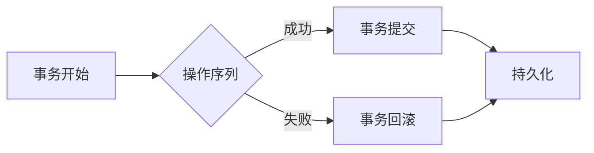

# 【AI大数据计算原理与代码实例讲解】事务

> 关键词：事务，数据库，ACID属性，并发控制，事务日志，持久化，事务管理器，事务优化，大数据处理

## 1. 背景介绍

在数据密集型应用中，事务是确保数据一致性和完整性的核心机制。事务能够确保一系列操作要么全部成功，要么全部失败，这对于数据库系统、分布式系统以及任何需要数据一致性的应用至关重要。随着大数据时代的到来，事务处理面临着更高的性能要求和更复杂的处理逻辑。本文将深入探讨AI大数据计算中的事务原理，并通过代码实例进行详细讲解。

## 2. 核心概念与联系

### 2.1 核心概念原理

在数据库系统中，事务是由一系列操作序列组成的逻辑工作单位。事务的关键特性包括：

- **原子性（Atomicity）**：事务中的所有操作要么全部完成，要么全部不做。这保证了事务的不可分割性。
- **一致性（Consistency）**：事务执行的结果必须使数据库从一个一致性状态转移到另一个一致性状态。
- **隔离性（Isolation）**：并发执行的事务之间不会互相影响，即一个事务的执行不能被其他事务干扰。
- **持久性（Durability）**：一个事务一旦提交，其所做的更改就会永久保存到数据库中。

### 2.2 架构的 Mermaid 流程图



### 2.3 核心概念联系

事务的这四个属性（ACID）相互关联，共同确保了数据库操作的可靠性。原子性和一致性是事务的最基本要求，隔离性则保证了并发事务之间的互不干扰，持久性则确保了事务的最终结果能够被持久保存。

## 3. 核心算法原理 & 具体操作步骤

### 3.1 算法原理概述

事务处理的核心算法包括并发控制和持久化。并发控制确保了事务的隔离性，而持久化则保证了事务的持久性。

### 3.2 算法步骤详解

#### 3.2.1 并发控制

并发控制的主要目标是确保多个事务同时执行时，不会互相干扰。常见的并发控制方法包括：

- **乐观并发控制**：假设冲突不会发生，在事务执行过程中不进行锁定，只在提交时检查冲突。
- **悲观并发控制**：假设冲突很可能会发生，在事务执行过程中使用锁来阻止冲突。

#### 3.2.2 持久化

持久化是将事务的操作结果保存到持久存储介质中，如硬盘。以下是持久化的步骤：

1. 写入事务日志：在开始事务之前，将事务的详细信息写入事务日志。
2. 执行事务操作：事务操作被执行，并更新数据库。
3. 提交事务：在事务成功完成后，将事务日志中记录的信息应用到数据库中。

### 3.3 算法优缺点

#### 3.3.1 并发控制

- 乐观并发控制优点：提高系统并发能力，减少锁的开销。
- 乐观并发控制缺点：冲突检测和解决开销较大。

- 悲观并发控制优点：冲突检测简单，系统稳定性高。
- 悲观并发控制缺点：降低系统并发能力，增加锁的开销。

#### 3.3.2 持久化

- 优点：保证数据的一致性和可靠性。
- 缺点：增加I/O开销，可能影响性能。

### 3.4 算法应用领域

事务处理在数据库系统、分布式系统、云计算、大数据处理等领域都有广泛应用。

## 4. 数学模型和公式 & 详细讲解 & 举例说明

### 4.1 数学模型构建

事务处理中的数学模型通常涉及集合理论、图论等。例如，事务的并发调度可以用图表示，冲突检测可以用集合操作实现。

### 4.2 公式推导过程

假设有两个事务 $T_1$ 和 $T_2$，它们的操作序列分别为 $O_1, O_2, ..., O_n$ 和 $O'_1, O'_2, ..., O'_m$。如果 $T_1$ 和 $T_2$ 产生冲突，则存在一个操作序列 $O_i$ 和 $O'_j$，使得 $O_i$ 和 $O'_j$ 同时对同一个数据项 $X$ 进行操作，并且 $O_i$ 和 $O'_j$ 不可串行化。

### 4.3 案例分析与讲解

假设有两个事务 $T_1$ 和 $T_2$，它们试图同时对同一账户进行转账操作。如果 $T_1$ 从账户中扣除 $100$ 元，$T_2$ 向账户中存入 $100$ 元，则这两个事务可能产生冲突。

## 5. 项目实践：代码实例和详细解释说明

### 5.1 开发环境搭建

为了演示事务处理的代码实例，我们需要搭建一个简单的数据库环境。以下是一个使用Python和SQLite的示例。

```python
import sqlite3

# 创建数据库连接
conn = sqlite3.connect('example.db')
cursor = conn.cursor()

# 创建表
cursor.execute('''
CREATE TABLE accounts (
    id INTEGER PRIMARY KEY,
    balance REAL NOT NULL
)
''')

# 插入数据
cursor.execute("INSERT INTO accounts (id, balance) VALUES (1, 1000)")

# 提交事务
conn.commit()
```

### 5.2 源代码详细实现

以下是一个简单的事务处理示例，演示了如何使用Python的`sqlite3`模块实现事务的开始、提交和回滚。

```python
import sqlite3

# 创建数据库连接
conn = sqlite3.connect('example.db')
cursor = conn.cursor()

# 开始事务
cursor.execute('BEGIN TRANSACTION;')

try:
    # 执行操作
    cursor.execute("UPDATE accounts SET balance = balance - 100 WHERE id = 1")
    cursor.execute("UPDATE accounts SET balance = balance + 100 WHERE id = 2")

    # 提交事务
    conn.commit()
except sqlite3.DatabaseError:
    # 发生错误，回滚事务
    conn.rollback()
finally:
    # 关闭连接
    cursor.close()
    conn.close()
```

### 5.3 代码解读与分析

在上面的代码中，我们首先建立了与数据库的连接，并创建了一个名为`accounts`的表，用于存储账户信息和余额。然后，我们开始了一个新的事务，并尝试执行两个操作：从账户1中扣除 $100$ 元，并向账户2中存入 $100$ 元。如果在执行过程中出现任何数据库错误，事务将被回滚，以确保数据库的一致性。最后，我们关闭了数据库连接。

### 5.4 运行结果展示

运行上述代码后，账户1的余额将减少 $100$ 元，而账户2的余额将增加 $100$ 元。如果没有发生错误，事务将被提交，这些更改将被永久保存到数据库中。

## 6. 实际应用场景

事务处理在许多实际应用场景中都非常重要，以下是一些常见的应用场景：

- **在线交易系统**：确保交易的一致性和可靠性。
- **银行系统**：管理账户余额，处理转账和支付。
- **电子政务**：确保政府数据的一致性和安全性。
- **医疗信息系统**：管理患者数据，确保医疗服务的连续性和准确性。

## 7. 工具和资源推荐

### 7.1 学习资源推荐

- 《数据库系统概念》
- 《事务处理：原理与实践》
- 《大数据技术原理与应用》

### 7.2 开发工具推荐

- **数据库管理系统**：MySQL, PostgreSQL, Oracle
- **NoSQL数据库**：MongoDB, Cassandra
- **大数据处理框架**：Apache Spark, Hadoop

### 7.3 相关论文推荐

- "Concurrency Control in Database Systems"
- "The Two-Phase Locking Protocol for Concurrency Control in a Shared Data Base"
- "The Phoenix Project: A Novel About IT, DevOps, and Helping Your Business Win"

## 8. 总结：未来发展趋势与挑战

### 8.1 研究成果总结

本文深入探讨了AI大数据计算中的事务原理，通过代码实例讲解了事务处理的实现方法，并分析了事务在各个应用场景中的重要性。

### 8.2 未来发展趋势

随着大数据和人工智能技术的不断发展，事务处理将面临以下发展趋势：

- **分布式事务**：随着分布式系统的普及，分布式事务管理将成为重要研究方向。
- **事务优化**：通过新的算法和优化技术提高事务处理性能。
- **事务安全性**：加强事务的安全性，防止数据泄露和恶意攻击。

### 8.3 面临的挑战

事务处理面临的挑战包括：

- **性能瓶颈**：如何在高并发环境下保证事务处理的性能。
- **数据一致性**：如何确保分布式系统中的数据一致性。
- **安全性问题**：如何防止数据泄露和恶意攻击。

### 8.4 研究展望

未来，事务处理技术需要进一步发展，以应对大数据和人工智能带来的挑战。同时，随着新技术的发展，事务处理也将融入更多创新元素，为构建更加高效、安全、可靠的数据密集型系统提供支持。

## 9. 附录：常见问题与解答

**Q1：什么是事务？**

A：事务是一系列操作序列组成的逻辑工作单位，它具有原子性、一致性、隔离性和持久性（ACID）特性。

**Q2：事务的隔离级别有哪些？**

A：事务的隔离级别包括读未提交（Read Uncommitted）、读已提交（Read Committed）、可重复读（Repeatable Read）和串行化（Serializable）。

**Q3：什么是并发控制？**

A：并发控制是为了防止多个事务同时执行时产生冲突而采取的一系列机制。

**Q4：什么是持久化？**

A：持久化是将事务的操作结果保存到持久存储介质中，如硬盘。

**Q5：如何提高事务处理性能？**

A：提高事务处理性能的方法包括优化算法、并行处理、缓存机制等。

---

作者：禅与计算机程序设计艺术 / Zen and the Art of Computer Programming