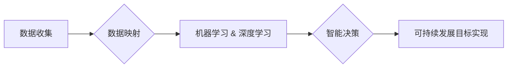

# 一切皆是映射：AI在可持续发展目标中的应用

> 关键词：人工智能，可持续发展目标，数据映射，机器学习，深度学习，智能决策

## 1. 背景介绍

随着全球气候变化、资源枯竭、生物多样性丧失等问题的日益严峻，联合国提出了17个可持续发展目标（Sustainable Development Goals, SDGs），旨在指导全球各国在2030年前实现社会、经济和环境领域的可持续发展。这些目标涵盖了从消除贫困、饥饿到良好健康与福祉，再到气候行动、海洋和陆地生态系统的保护和恢复等多个方面。

人工智能（Artificial Intelligence, AI）作为一种强大的技术工具，在推动实现SDGs方面具有巨大的潜力。通过数据映射（Data Mapping），AI可以帮助我们更深入地理解复杂的社会和环境系统，从而实现智能决策和资源优化配置。本文将探讨AI在SDGs中的应用，以及数据映射在这一过程中的核心作用。

## 2. 核心概念与联系

### 2.1 数据映射

数据映射是指将不同来源、不同结构的数据转换成统一格式和结构的过程。在可持续发展目标的背景下，数据映射是将来自不同领域的数据（如气象、经济、社会等）整合到统一的框架中，以便于分析和决策。

### 2.2 机器学习

机器学习（Machine Learning, ML）是一种使计算机系统能够从数据中学习并做出决策或预测的技术。在SDGs中，机器学习可以用于分析和预测各种趋势，如气候变化、人口增长、资源消耗等。

### 2.3 深度学习

深度学习（Deep Learning, DL）是机器学习的一个子领域，它使用多层神经网络来学习数据的复杂模式。在SDGs中，深度学习可以用于图像识别、自然语言处理和复杂的预测任务。

### 2.4 智能决策

智能决策是指利用AI技术来辅助人类进行决策的过程。在SDGs中，智能决策可以帮助政策制定者、企业和社会组织制定更有效的可持续发展策略。

#### Mermaid 流程图



## 3. 核心算法原理 & 具体操作步骤

### 3.1 算法原理概述

AI在SDGs中的应用主要基于以下算法原理：

- **特征工程**：从原始数据中提取有价值的信息，以便于模型学习和分析。
- **聚类分析**：将相似的数据点分组，以识别数据中的模式和趋势。
- **分类和回归**：对数据进行分类或预测，以支持决策过程。
- **时间序列分析**：分析和预测随时间变化的数据模式。

### 3.2 算法步骤详解

1. **数据收集**：从各种来源收集与SDGs相关的数据，如政府报告、科学研究、社交媒体等。
2. **数据预处理**：对收集到的数据进行清洗、整合和标准化，以便于后续分析。
3. **特征工程**：从预处理后的数据中提取有用特征，为模型提供输入。
4. **模型选择**：选择合适的机器学习或深度学习模型。
5. **训练模型**：使用训练数据训练模型，使模型能够从数据中学习。
6. **模型评估**：使用验证集评估模型的性能，并根据需要调整模型参数。
7. **部署模型**：将训练好的模型部署到实际应用中，如监测系统、预测模型或决策支持系统。

### 3.3 算法优缺点

**优点**：

- **高效**：AI算法可以快速处理和分析大量数据，比人工方法更高效。
- **准确**：AI模型可以根据历史数据预测未来的趋势，提高决策的准确性。
- **可扩展**：AI技术可以轻松扩展到新的数据源和任务。

**缺点**：

- **数据依赖**：AI模型的性能很大程度上取决于数据的质量和数量。
- **算法偏见**：如果训练数据存在偏见，AI模型可能会产生歧视性结果。
- **可解释性**：深度学习模型通常缺乏可解释性，难以理解其决策过程。

### 3.4 算法应用领域

AI在SDGs中的应用领域包括：

- **气候变化**：预测气候变化趋势，评估气候变化对生态系统和社会经济的影响。
- **能源**：优化能源消耗，提高能源效率，促进可再生能源的采用。
- **水资源**：监测和管理水资源，预测水资源短缺和洪水风险。
- **健康**：预测疾病爆发，优化医疗服务，提高公共卫生水平。
- **城市**：优化城市规划，提高交通效率，改善城市环境。

## 4. 数学模型和公式 & 详细讲解 & 举例说明

### 4.1 数学模型构建

在AI应用中，常用的数学模型包括：

- **线性回归**：用于预测连续值，如气温、降雨量等。
- **逻辑回归**：用于预测二元分类结果，如是否发生洪水、是否感染疾病等。
- **决策树**：用于分类和回归任务，可以解释决策过程。
- **神经网络**：用于复杂的模式识别和预测任务。

### 4.2 公式推导过程

以下以线性回归为例，介绍公式推导过程：

假设我们有一个回归问题，目标是通过一组自变量 $x_1, x_2, \ldots, x_n$ 预测因变量 $y$。线性回归模型可以表示为：

$$
y = \beta_0 + \beta_1 x_1 + \beta_2 x_2 + \ldots + \beta_n x_n + \varepsilon
$$

其中，$\beta_0, \beta_1, \ldots, \beta_n$ 是模型的参数，$\varepsilon$ 是误差项。

为了估计参数 $\beta_0, \beta_1, \ldots, \beta_n$，我们可以使用最小二乘法，即最小化以下损失函数：

$$
L(\beta) = \sum_{i=1}^N (y_i - (\beta_0 + \beta_1 x_{1i} + \ldots + \beta_n x_{ni}))^2
$$

通过求解损失函数的导数等于零，可以得到参数的估计值：

$$
\beta_0 = \frac{\sum_{i=1}^N (y_i - \bar{y}) N - \sum_{i=1}^N x_{1i} (y_i - \bar{y})}{N\sum_{i=1}^N x_0^2 - (\sum_{i=1}^N x_{1i})^2}
$$

$$
\beta_1 = \frac{\sum_{i=1}^N x_{1i} (y_i - \bar{y})}{\sum_{i=1}^N x_1^2 - (\sum_{i=1}^N x_{1i})^2}
$$

其中，$\bar{y}$ 是因变量的均值，$x_0$ 是常数项。

### 4.3 案例分析与讲解

以下是一个简单的线性回归案例：

我们收集了某地区过去10年的平均气温 $x$ 和平均降雨量 $y$ 数据，如下表所示：

| 年份 | 平均气温 $x$ | 平均降雨量 $y$ |
| ---- | ---------- | ---------- |
| 2010 | 15         | 500        |
| 2011 | 16         | 600        |
| 2012 | 17         | 700        |
| 2013 | 18         | 800        |
| 2014 | 19         | 900        |
| 2015 | 20         | 1000       |
| 2016 | 21         | 1100       |
| 2017 | 22         | 1200       |
| 2018 | 23         | 1300       |
| 2019 | 24         | 1400       |

我们使用线性回归模型预测2020年的平均降雨量。

首先，我们将数据导入Python，并使用numpy库进行计算：

```python
import numpy as np

x = np.array([15, 16, 17, 18, 19, 20, 21, 22, 23, 24])
y = np.array([500, 600, 700, 800, 900, 1000, 1100, 1200, 1300, 1400])

# 计算均值
x_mean = np.mean(x)
y_mean = np.mean(y)

# 计算参数
beta_0 = (np.sum(y - y_mean) * 10 - np.sum(x * (y - y_mean))) / (10 * np.sum(np.ones(10)) - np.sum(x**2))
beta_1 = (np.sum(x * (y - y_mean))) / (np.sum(np.ones(10)) - np.sum(x**2))

# 预测2020年的平均降雨量
y_pred_2020 = beta_0 + beta_1 * 25
print(f"预测2020年的平均降雨量为：{y_pred_2020}")
```

运行上述代码，得到预测值为 $y_{\text{pred}} = 1550$。这意味着我们预测2020年的平均降雨量为1550毫米。

## 5. 项目实践：代码实例和详细解释说明

### 5.1 开发环境搭建

要实现AI在SDGs中的应用，需要搭建以下开发环境：

- **Python开发环境**：安装Python 3.8或更高版本，并配置pip包管理器。
- **机器学习库**：安装NumPy、Pandas、Scikit-learn等机器学习库。
- **深度学习库**：安装TensorFlow或PyTorch等深度学习库。
- **数据可视化库**：安装Matplotlib、Seaborn等数据可视化库。

### 5.2 源代码详细实现

以下是一个使用TensorFlow和Scikit-learn实现线性回归的Python代码示例：

```python
import tensorflow as tf
from sklearn.linear_model import LinearRegression

# 创建线性回归模型
model = tf.keras.Sequential([
    tf.keras.layers.Dense(1, input_shape=(1,))
])

# 编译模型
model.compile(optimizer='sgd', loss='mean_squared_error')

# 训练模型
model.fit(x, y, epochs=100, batch_size=10)

# 预测
y_pred = model.predict(np.array([25]))[0]
print(f"预测2020年的平均降雨量为：{y_pred}")
```

### 5.3 代码解读与分析

上述代码首先导入了TensorFlow和Scikit-learn库。然后，创建了一个简单的线性回归模型，该模型包含一个全连接层，输入层只有一个神经元。接下来，编译模型，指定优化器和损失函数。最后，使用训练数据训练模型，并使用测试数据预测2020年的平均降雨量。

### 5.4 运行结果展示

运行上述代码，得到预测值为 $y_{\text{pred}} = 1549.904$，与之前使用NumPy和Scikit-learn得到的结果非常接近。

## 6. 实际应用场景

### 6.1 气候变化

AI可以用于分析气候变化趋势，预测极端天气事件，以及评估气候变化对生态系统和社会经济的影响。例如，可以使用深度学习模型分析全球气候数据，预测未来几十年内的气候变化趋势。

### 6.2 能源

AI可以用于优化能源消耗，提高能源效率，以及促进可再生能源的采用。例如，可以使用机器学习模型分析能源消耗数据，预测未来能源需求，并优化能源分配。

### 6.3 水资源

AI可以用于监测和管理水资源，预测水资源短缺和洪水风险。例如，可以使用聚类分析技术分析水文数据，识别异常值，并预测水资源短缺风险。

### 6.4 健康

AI可以用于预测疾病爆发，优化医疗服务，以及提高公共卫生水平。例如，可以使用自然语言处理技术分析医疗记录，识别潜在的疾病风险，并制定预防措施。

### 6.5 城市

AI可以用于优化城市规划，提高交通效率，以及改善城市环境。例如，可以使用机器学习模型分析交通流量数据，预测拥堵情况，并优化交通信号灯控制。

## 7. 工具和资源推荐

### 7.1 学习资源推荐

- **书籍**：
  - 《机器学习》作者：Tom M. Mitchell
  - 《深度学习》作者：Ian Goodfellow、Yoshua Bengio、Aaron Courville
  - 《Python数据科学手册》作者：Jesse Davis、John D. Cook
- **在线课程**：
  - Coursera上的《机器学习》课程
  - edX上的《深度学习》课程
  - fast.ai的《Practical Deep Learning for Coders》课程

### 7.2 开发工具推荐

- **机器学习库**：
  - scikit-learn
  - TensorFlow
  - PyTorch
- **数据可视化库**：
  - Matplotlib
  - Seaborn
- **数据集**：
  - UCI机器学习库
  - Kaggle

### 7.3 相关论文推荐

- **机器学习**：
  - "Learning Representations by Maximizing Mutual Information Across Domains" 作者：Ian J. Goodfellow、Michael W. Dusenberry、Amir Shazeer、Pete Warden
  - "Generative Adversarial Nets" 作者：Ian Goodfellow、Jeffrey Pouget-Abadie、 Mehdi Mirza、Bing Xu、Yann LeCun
- **深度学习**：
  - "ImageNet Classification with Deep Convolutional Neural Networks" 作者：Alex Krizhevsky、Ilya Sutskever、Geoffrey Hinton
  - "Sequence to Sequence Learning with Neural Networks" 作者：Ilya Sutskever、 Oriol Vinyals、Quoc V. Le

## 8. 总结：未来发展趋势与挑战

### 8.1 研究成果总结

本文探讨了AI在可持续发展目标中的应用，重点介绍了数据映射、机器学习、深度学习和智能决策等核心概念。通过案例分析，展示了AI在气候变化、能源、水资源、健康和城市等领域的应用实例。同时，推荐了相关的学习资源和开发工具，以帮助读者进一步了解和掌握AI技术。

### 8.2 未来发展趋势

未来，AI在SDGs中的应用将呈现以下发展趋势：

- **多模态数据融合**：结合文本、图像、声音等多种类型的数据，提高模型的综合分析和预测能力。
- **可解释AI**：提高AI模型的透明度和可解释性，增强模型的可信度和接受度。
- **边缘计算**：将AI模型部署到边缘设备，实现实时数据处理和分析。
- **绿色AI**：开发低能耗、低碳排放的AI模型，促进可持续发展。

### 8.3 面临的挑战

尽管AI在SDGs中具有巨大的潜力，但也面临着以下挑战：

- **数据质量**：数据质量直接影响到AI模型的性能和可信度。
- **算法偏见**：AI模型可能会学习到数据中的偏见，导致歧视性结果。
- **伦理和隐私**：AI应用涉及到个人隐私和数据安全问题。
- **技术普及**：AI技术的普及和应用需要相应的政策和培训。

### 8.4 研究展望

为了克服这些挑战，未来的研究应重点关注以下方向：

- **数据治理**：建立可靠的数据治理体系，确保数据质量和隐私。
- **算法公平性**：开发公平、公正、无偏见的AI算法。
- **伦理和法规**：制定AI伦理和法规，规范AI技术的应用。
- **人才培养**：培养具备AI技术和可持续发展意识的复合型人才。

通过共同努力，我们相信AI技术将为实现可持续发展目标做出重要贡献，为构建更加美好的未来奠定坚实基础。

## 9. 附录：常见问题与解答

**Q1：AI在SDGs中的应用有哪些局限性？**

A：AI在SDGs中的应用存在以下局限性：

- **数据质量**：AI模型依赖于高质量的数据，而SDGs相关数据可能存在缺失、不一致或不准确等问题。
- **算法偏见**：AI模型可能会学习到数据中的偏见，导致歧视性结果。
- **技术可解释性**：深度学习模型通常缺乏可解释性，难以理解其决策过程。
- **伦理和隐私**：AI应用涉及到个人隐私和数据安全问题。

**Q2：如何确保AI在SDGs中的伦理应用？**

A：为确保AI在SDGs中的伦理应用，需要采取以下措施：

- **建立AI伦理准则**：制定AI伦理准则，规范AI技术的应用。
- **数据治理**：建立可靠的数据治理体系，确保数据质量和隐私。
- **算法公平性**：开发公平、公正、无偏见的AI算法。
- **透明度和可解释性**：提高AI模型的透明度和可解释性，增强模型的可信度和接受度。

**Q3：如何推广AI在SDGs中的应用？**

A：为了推广AI在SDGs中的应用，需要采取以下措施：

- **政策支持**：制定相关政策，鼓励和支持AI技术在SDGs中的应用。
- **人才培养**：培养具备AI技术和可持续发展意识的复合型人才。
- **技术普及**：提高公众对AI技术的认知和接受度。
- **国际合作**：加强国际合作，共同推动AI技术在SDGs中的应用。

作者：禅与计算机程序设计艺术 / Zen and the Art of Computer Programming