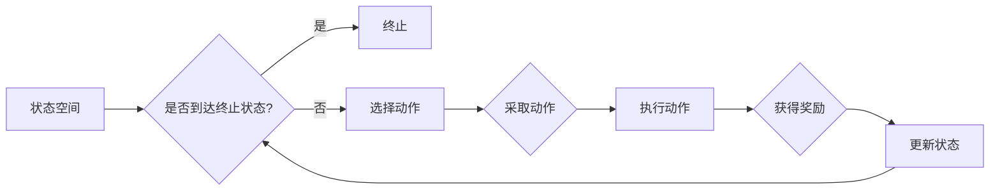

# 一切皆是映射：如何使用DQN处理高维的状态空间

> 关键词：深度强化学习，DQN，状态空间，Q学习，函数近似，神经网络，经验回放，高维数据

## 1. 背景介绍

随着人工智能技术的飞速发展，深度强化学习（Deep Reinforcement Learning, DRL）成为了一个热门的研究领域。DRL结合了深度学习在特征提取和表示学习方面的优势，以及强化学习的决策能力，在游戏、机器人控制、自动驾驶、推荐系统等多个领域展现出了巨大的潜力。

然而，对于高维状态空间，传统的强化学习方法往往难以有效处理。这是因为高维状态空间意味着大量的状态组合，使得状态空间变得巨大且难以枚举。在这种情况下，如何高效地学习状态到动作的映射关系成为了DRL领域的一大挑战。

本文将深入探讨如何使用深度Q网络（Deep Q-Network, DQN）来处理高维状态空间，分析其核心原理、具体操作步骤、数学模型以及实际应用场景，并展望未来发展趋势与挑战。

## 2. 核心概念与联系

### 2.1 核心概念

#### 深度强化学习（DRL）

深度强化学习是强化学习的一个分支，它将深度学习与强化学习相结合。在DRL中，智能体（Agent）通过与环境的交互，通过学习最优的策略来最大化累积奖励。

#### 状态空间（State Space）

状态空间是智能体在环境中可能处于的所有状态集合。在DRL中，状态空间可以是一维的，也可以是高维的。

#### 动作空间（Action Space）

动作空间是智能体在环境中可能采取的所有动作集合。动作空间可以是离散的，也可以是连续的。

#### 奖励（Reward）

奖励是智能体在执行动作后从环境中获得的奖励值。奖励用于指导智能体学习最优策略。

#### 策略（Policy）

策略是智能体在给定状态下采取动作的概率分布。

#### Q值（Q-Value）

Q值表示在特定状态下采取特定动作的预期奖励。Q值学习是强化学习中的核心概念之一。

### 2.2 Mermaid 流程图



### 2.3 核心概念联系

在DRL中，智能体通过与环境交互，不断更新状态和Q值，最终学习到最优策略。状态空间和动作空间构成了智能体决策的环境，而奖励和Q值则指导智能体学习最优策略。

## 3. 核心算法原理 & 具体操作步骤

### 3.1 算法原理概述

DQN是一种基于Q学习的深度学习方法。它使用神经网络来近似Q值函数，并通过经验回放（Experience Replay）和目标网络（Target Network）等技术来解决高维状态空间和探索-利用（Exploration-Exploitation）问题。

### 3.2 算法步骤详解

#### 步骤1：初始化

1. 初始化Q网络和目标网络。
2. 初始化经验回放内存。

#### 步骤2：选择动作

1. 在给定状态下，使用ε-贪婪策略选择动作。

#### 步骤3：执行动作

1. 根据选择的动作与环境交互，获得奖励和新的状态。

#### 步骤4：存储经验

1. 将当前状态、动作、奖励和下一个状态存储到经验回放内存中。

#### 步骤5：经验回放

1. 从经验回放内存中随机抽取一批经验。
2. 使用目标网络计算这些经验的Q值。

#### 步骤6：更新Q网络

1. 使用梯度下降算法更新Q网络的参数，以最小化Q值与目标Q值之间的差异。

#### 步骤7：目标网络更新

1. 定期更新目标网络，以跟踪Q网络。

#### 步骤8：重复步骤2-7，直到满足停止条件。

### 3.3 算法优缺点

#### 优点

1. 可以处理高维状态空间。
2. 不依赖于环境模型，适用于无模型环境。
3. 可以通过神经网络实现函数近似，提高学习效率。

#### 缺点

1. 需要大量的样本数据进行训练。
2. 容易陷入局部最优解。
3. 训练过程中可能存在梯度消失或梯度爆炸问题。

### 3.4 算法应用领域

DQN及其变体在以下领域取得了显著的应用成果：

1. 游戏AI：如Atari游戏、StarCraft II等。
2. 机器人控制：如机器人导航、抓取等。
3. 自动驾驶：如车辆控制、路径规划等。
4. 语音识别：如说话人识别、语音合成等。
5. 图像识别：如目标检测、图像分类等。

## 4. 数学模型和公式 & 详细讲解 & 举例说明

### 4.1 数学模型构建

DQN的数学模型可以表示为：

$$
Q(s,a;\theta) = \sum_{r,s'} \gamma^{|s'-s|} r + \max_{a'} Q(s';a';\theta)
$$

其中，$s$ 表示状态，$a$ 表示动作，$r$ 表示奖励，$s'$ 表示下一个状态，$\gamma$ 表示折扣因子，$|s'-s|$ 表示状态之间的距离，$\theta$ 表示Q网络的参数。

### 4.2 公式推导过程

#### 探索-利用平衡

DQN采用ε-贪婪策略来平衡探索和利用。ε-贪婪策略是指在每次决策时，以概率ε选择随机动作，以概率1-ε选择根据Q值选择动作。

#### 目标网络

为了防止梯度消失问题，DQN使用目标网络来近似Q值。目标网络定期从Q网络复制参数，并独立更新。

#### 经验回放

为了减少样本的相关性，DQN使用经验回放内存来存储经验。在训练过程中，从经验回放内存中随机抽取一批经验进行训练。

### 4.3 案例分析与讲解

以下是一个使用DQN进行Atari游戏训练的案例：

1. 初始化DQN模型和经验回放内存。
2. 运行游戏，并记录每个时间步的状态、动作、奖励和下一个状态。
3. 将这些经验存储到经验回放内存中。
4. 随机抽取一批经验进行训练，更新DQN模型。
5. 定期更新目标网络，以跟踪Q网络。

通过以上步骤，DQN模型能够学习到在Atari游戏中的最优策略，并最终达到游戏目标。

## 5. 项目实践：代码实例和详细解释说明

### 5.1 开发环境搭建

以下是一个使用TensorFlow和TensorFlow Agents实现DQN的代码示例：

```python
import gym
import numpy as np
import tensorflow as tf

from tensorflow_agents.agents.dqn import DQNAgent
from tensorflow_agents.environments import suite_gym
from tensorflow_agents.utils import common

# 创建环境
env = suite_gym.load('CartPole-v1')

# 创建DQN模型
agent = DQNAgent(
    time_step_spec=env.time_step_spec(),
    action_spec=env.action_spec(),
    actor_network=None,
    value_network=None,
    train_step_counter=tf.Variable(0)
)

# 训练模型
agent.initialize()

# 运行训练循环
for _ in range(10000):
    time_step = env.reset()
    while not time_step.is_last():
        action = agent.select_action(time_step)
        next_time_step = env.step(action)
        agent.update(time_step, action, next_time_step.reward, next_time_step.is_last())
    env.close()
```

### 5.2 源代码详细实现

上述代码展示了使用TensorFlow和TensorFlow Agents实现DQN的基本流程。首先创建环境，然后创建DQN模型，并初始化。接着，通过运行训练循环，不断更新模型参数，直至模型收敛。

### 5.3 代码解读与分析

上述代码首先导入了必要的库，并创建了一个CartPole环境。然后，使用DQNAgent创建了一个DQN模型，并初始化。在训练循环中，模型通过与环境交互，不断更新参数，最终学习到在CartPole环境中的最优策略。

### 5.4 运行结果展示

通过运行上述代码，DQN模型能够在CartPole环境中达到游戏目标，即保持平衡。

## 6. 实际应用场景

### 6.1 自动驾驶

自动驾驶是DQN的一个典型应用场景。通过将DQN应用于自动驾驶，可以实现车辆的自主导航、避障、变道等功能。

### 6.2 机器人控制

DQN可以应用于机器人控制领域，如机器人路径规划、抓取、搬运等任务。

### 6.3 电子商务推荐

DQN可以应用于电子商务推荐系统，如商品推荐、广告投放等任务。

### 6.4 机器人游戏

DQN可以应用于机器人游戏，如Atari游戏、StarCraft II等。

## 7. 工具和资源推荐

### 7.1 学习资源推荐

1. 《Reinforcement Learning: An Introduction》
2. 《Deep Reinforcement Learning》
3. TensorFlow Agents官方文档

### 7.2 开发工具推荐

1. TensorFlow
2. PyTorch
3. OpenAI Gym

### 7.3 相关论文推荐

1. "Deep Q-Network" by Deepak Pathak
2. "Asynchronous Methods for Deep Reinforcement Learning" by John Schulman
3. "Deep Reinforcement Learning with Double Q-learning" by Volodymyr Mnih

## 8. 总结：未来发展趋势与挑战

### 8.1 研究成果总结

本文深入探讨了如何使用DQN处理高维状态空间，分析了其核心原理、具体操作步骤、数学模型以及实际应用场景。通过理论分析和实践案例，展示了DQN在处理高维状态空间方面的优势和应用前景。

### 8.2 未来发展趋势

1. 研究更加高效的算法，减少训练时间。
2. 探索更加鲁棒的算法，提高模型的泛化能力。
3. 将DQN与其他技术结合，如多智能体强化学习、元学习等。
4. 将DQN应用于更多领域，如医疗、金融、工业等。

### 8.3 面临的挑战

1. 高维状态空间的学习难度大。
2. 模型参数量大，计算复杂度高。
3. 模型的可解释性差。
4. 模型的安全性问题。

### 8.4 研究展望

随着研究的不断深入，相信DQN及其变体将会在更多领域得到应用，并取得更加显著的成果。

## 9. 附录：常见问题与解答

**Q1：DQN适用于所有类型的强化学习任务吗？**

A：DQN适用于大多数强化学习任务，但对于需要精确控制或高精度动作的任务，可能需要其他类型的强化学习算法。

**Q2：DQN如何解决高维状态空间的问题？**

A：DQN使用神经网络来近似Q值函数，从而降低状态空间的高维性。

**Q3：DQN如何处理连续动作空间？**

A：DQN可以使用神经网络输出动作的直接值或动作的概率分布。

**Q4：DQN如何处理延迟奖励问题？**

A：DQN可以使用蒙特卡洛策略来处理延迟奖励问题。

**Q5：DQN与其他强化学习算法相比有哪些优缺点？**

A：DQN的优点是简单、易于实现，适用于大多数强化学习任务。缺点是计算复杂度高，可能存在梯度消失或梯度爆炸问题。

---

作者：禅与计算机程序设计艺术 / Zen and the Art of Computer Programming