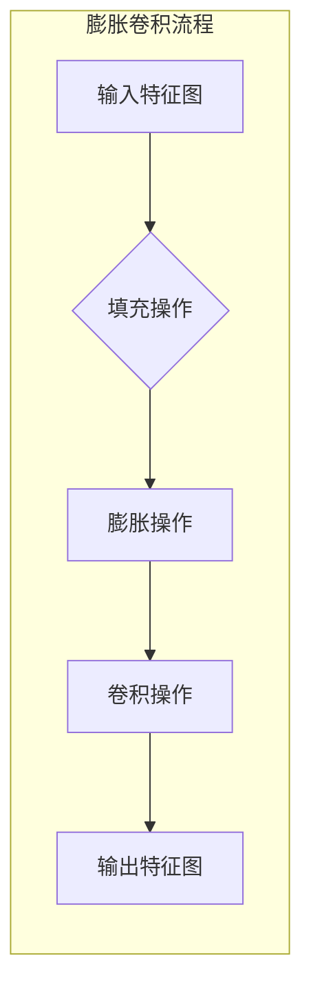

> 1. 大模型开发
> 2. 微调
> 3. 膨胀卷积
> 4. 深度学习
> 5. 图像处理
> 6. 语义分割
> 7. 神经网络

# 从零开始大模型开发与微调：膨胀卷积详解

随着深度学习在计算机视觉领域的广泛应用，大模型（Large Models）的开发和应用已经成为研究的热点。膨胀卷积（Dilated Convolution）作为一种高效的卷积操作，在大模型中扮演着重要角色。本文将从零开始，详细介绍大模型开发与微调的基本概念，重点讲解膨胀卷积的原理、实现方法以及在图像处理领域的应用。

## 1. 背景介绍

### 1.1 大模型的兴起

近年来，深度学习在图像识别、语音识别、自然语言处理等领域取得了显著的成果。大模型通过在大量数据上进行训练，可以学习到丰富的特征和知识，从而在复杂任务上取得更好的表现。然而，大模型的训练和部署也面临着计算资源、存储空间和推理速度等挑战。

### 1.2 膨胀卷积的引入

膨胀卷积作为一种特殊的卷积操作，通过在卷积核周围引入额外的填充元素，可以有效地扩大感受野，同时减少参数数量和计算量。这使得膨胀卷积在大模型中得到了广泛应用，尤其是在图像处理领域。

## 2. 核心概念与联系

### 2.1 膨胀卷积的Mermaid流程图



### 2.2 核心概念

- **输入特征图**：原始图像经过卷积层处理后的特征图。
- **填充操作**：在特征图周围添加额外的像素，以扩展感受野。
- **膨胀操作**：在填充后的特征图上进行卷积操作，将卷积核扩展到更广阔的区域。
- **卷积操作**：对膨胀后的特征图进行卷积，提取更丰富的特征。
- **输出特征图**：卷积操作后的特征图。

## 3. 核心算法原理 & 具体操作步骤

### 3.1 算法原理概述

膨胀卷积的核心思想是通过在卷积核周围添加填充元素，使得卷积核的覆盖区域增大，从而扩大感受野，同时减少参数数量和计算量。

### 3.2 算法步骤详解

1. 对输入特征图进行填充操作，添加额外的像素。
2. 在填充后的特征图上进行卷积操作，提取更丰富的特征。
3. 根据需要调整卷积核的大小和形状，以适应不同的任务需求。

### 3.3 算法优缺点

**优点**：

- 扩大感受野，提取更丰富的特征。
- 减少参数数量和计算量，提高模型效率。
- 对输入图像的噪声和干扰具有较强的鲁棒性。

**缺点**：

- 空间分辨率降低，可能损失一些细节信息。
- 需要根据任务需求调整卷积核的大小和形状。

### 3.4 算法应用领域

膨胀卷积在图像处理领域具有广泛的应用，如：

- 语义分割：通过扩大感受野，更好地提取图像中的语义信息。
- 目标检测：提高检测的准确性和鲁棒性。
- 图像去噪：去除图像中的噪声和干扰。

## 4. 数学模型和公式 & 详细讲解 & 举例说明

### 4.1 数学模型构建

膨胀卷积的数学模型可以表示为：

$$
\text{output}[i, j] = \sum_{x = -K}^{K} \sum_{y = -K}^{K} \text{input}[i + x, j + y] \cdot \text{filter}[x, y]
$$

其中，$\text{input}$ 表示输入特征图，$\text{filter}$ 表示卷积核，$\text{output}$ 表示输出特征图。

### 4.2 公式推导过程

假设输入特征图 $\text{input}$ 的大小为 $H \times W$，卷积核大小为 $K \times K$，则输出特征图的大小为 $H' \times W'$。

对于输出特征图中的每个像素 $(i, j)$，其计算公式如下：

$$
\text{output}[i, j] = \sum_{x = -K}^{K} \sum_{y = -K}^{K} \text{input}[i + x, j + y] \cdot \text{filter}[x, y]
$$

### 4.3 案例分析与讲解

以下是一个使用PyTorch实现的膨胀卷积的示例：

```python
import torch
import torch.nn as nn

class DilatedConv2d(nn.Module):
    def __init__(self, in_channels, out_channels, kernel_size, dilation):
        super(DilatedConv2d, self).__init__()
        self.dilated_conv = nn.Conv2d(in_channels, out_channels, kernel_size=kernel_size, dilation=dilation)

    def forward(self, x):
        return self.dilated_conv(x)

# 创建一个DilatedConv2d实例
dilated_conv = DilatedConv2d(3, 16, kernel_size=3, dilation=2)

# 创建一个随机输入特征图
input_tensor = torch.randn(1, 3, 64, 64)

# 前向传播
output_tensor = dilated_conv(input_tensor)

print(output_tensor.shape)  # 输出特征图的大小
```

在上面的代码中，我们定义了一个名为 `DilatedConv2d` 的自定义卷积层，它接受输入特征图、输出通道数、卷积核大小和膨胀率作为参数。在 `forward` 方法中，我们调用 `nn.Conv2d` 来执行卷积操作。

## 5. 项目实践：代码实例和详细解释说明

### 5.1 开发环境搭建

为了进行膨胀卷积的实践，我们需要搭建一个Python开发环境，并安装以下库：

- PyTorch
- NumPy
- Matplotlib

可以使用以下命令安装这些库：

```bash
pip install torch numpy matplotlib
```

### 5.2 源代码详细实现

以下是一个使用PyTorch实现语义分割任务中膨胀卷积的示例：

```python
import torch
import torch.nn as nn
import torch.optim as optim
from torch.utils.data import DataLoader
from torchvision import datasets, transforms
import matplotlib.pyplot as plt

# 定义一个简单的U-Net模型
class UNet(nn.Module):
    def __init__(self):
        super(UNet, self).__init__()
        self.conv1 = nn.Conv2d(3, 64, kernel_size=3, padding=1)
        self.conv2 = nn.Conv2d(64, 128, kernel_size=3, padding=1)
        self.conv3 = nn.Conv2d(128, 256, kernel_size=3, padding=1)
        self.conv4 = nn.Conv2d(256, 512, kernel_size=3, padding=1)
        self.dilated_conv = nn.Conv2d(512, 512, kernel_size=3, dilation=2, padding=2)
        self.conv5 = nn.Conv2d(512, 256, kernel_size=3, padding=1)
        self.conv6 = nn.Conv2d(256, 128, kernel_size=3, padding=1)
        self.conv7 = nn.Conv2d(128, 64, kernel_size=3, padding=1)
        self.conv8 = nn.Conv2d(64, 1, kernel_size=1)

    def forward(self, x):
        x1 = self.conv1(x)
        x2 = self.conv2(nn.functional.relu(x1))
        x3 = self.conv3(nn.functional.relu(x2))
        x4 = self.conv4(nn.functional.relu(x3))
        x5 = self.conv5(nn.functional.relu(self.dilated_conv(x4)))
        x6 = self.conv6(nn.functional.relu(x5 + x3))
        x7 = self.conv7(nn.functional.relu(x6 + x2))
        x8 = self.conv8(nn.functional.relu(x7 + x1))
        return x8

# 加载COCO数据集
transform = transforms.Compose([
    transforms.Resize((512, 512)),
    transforms.ToTensor()
])

train_dataset = datasets.CocoDataset(root='/path/to/coco/train2014', annFile='/path/to/coco/annotations/instances_train2014.json', transform=transform)
train_loader = DataLoader(train_dataset, batch_size=4, shuffle=True)

# 初始化模型、损失函数和优化器
model = UNet()
criterion = nn.CrossEntropyLoss()
optimizer = optim.Adam(model.parameters(), lr=0.001)

# 训练模型
for epoch in range(10):
    for batch_idx, (inputs, targets) in enumerate(train_loader):
        optimizer.zero_grad()
        outputs = model(inputs)
        loss = criterion(outputs, targets)
        loss.backward()
        optimizer.step()
        if batch_idx % 100 == 0:
            print(f'Epoch {epoch}, Batch {batch_idx}, Loss: {loss.item()}')

# 保存模型参数
torch.save(model.state_dict(), 'unet.pth')
```

### 5.3 代码解读与分析

在上面的代码中，我们定义了一个简单的U-Net模型，其中包含多个卷积层和膨胀卷积层。在 `forward` 方法中，我们依次对输入特征图进行卷积操作，并在适当的步骤引入膨胀卷积层。

我们使用COCO数据集进行训练，并通过 `DataLoader` 来批量加载数据。在训练过程中，我们使用Adam优化器来更新模型参数，并使用交叉熵损失函数来衡量模型预测结果与真实标签之间的差异。

### 5.4 运行结果展示

运行上述代码后，模型将在COCO数据集上进行训练。训练完成后，我们将模型参数保存到文件中，以便后续使用。

## 6. 实际应用场景

膨胀卷积在图像处理领域具有广泛的应用，以下是一些典型的应用场景：

- **语义分割**：通过扩大感受野，更好地提取图像中的语义信息，实现更加精确的语义分割。
- **目标检测**：提高检测的准确性和鲁棒性，尤其是在复杂背景下。
- **图像去噪**：去除图像中的噪声和干扰，提高图像质量。
- **图像超分辨率**：提高图像的分辨率，改善图像清晰度。

## 7. 工具和资源推荐

### 7.1 学习资源推荐

- 《深度学习》
- 《Python深度学习》
- PyTorch官方文档

### 7.2 开发工具推荐

- PyTorch
- NumPy
- Matplotlib
- OpenCV

### 7.3 相关论文推荐

- Dilated Convolutional Neural Networks

## 8. 总结：未来发展趋势与挑战

### 8.1 研究成果总结

本文从零开始，介绍了大模型开发与微调的基本概念，重点讲解了膨胀卷积的原理、实现方法以及在图像处理领域的应用。通过学习本文，读者可以了解到：

- 大模型开发的基本流程和关键技术。
- 膨胀卷积的原理、实现方法及其优缺点。
- 膨胀卷积在图像处理领域的应用案例。

### 8.2 未来发展趋势

未来，大模型和膨胀卷积技术将朝着以下方向发展：

- **模型轻量化**：通过模型压缩、量化等技术，降低模型的计算量和存储空间，使其更适合移动设备和嵌入式系统。
- **多模态融合**：将图像、文本、语音等多模态信息进行融合，实现更全面的特征提取和任务处理。
- **自监督学习**：通过自监督学习技术，降低对标注数据的依赖，提高模型的泛化能力。

### 8.3 面临的挑战

大模型和膨胀卷积技术在实际应用中仍面临着以下挑战：

- **计算资源**：大模型的训练和推理需要大量的计算资源，尤其是在移动设备和嵌入式系统上。
- **数据标注**：大模型的训练需要大量的标注数据，而高质量标注数据的获取成本较高。
- **模型可解释性**：大模型的决策过程难以解释，难以保证其输出结果的可靠性和安全性。

### 8.4 研究展望

为了应对上述挑战，未来需要在以下方面进行深入研究：

- **低功耗计算**：研究低功耗的深度学习硬件和算法，降低大模型的能耗。
- **数据高效标注**：探索数据高效标注技术，降低标注数据成本。
- **模型可解释性**：研究模型可解释性技术，提高模型的可靠性和安全性。

通过不断的研究和探索，大模型和膨胀卷积技术将在图像处理领域以及其他领域发挥更大的作用，为人类创造更多的价值。

## 9. 附录：常见问题与解答

**Q1：膨胀卷积与普通卷积的区别是什么？**

A：膨胀卷积与普通卷积的主要区别在于卷积核的大小和形状。普通卷积的卷积核大小固定，而膨胀卷积的卷积核可以通过增加填充元素来扩展，从而扩大感受野。

**Q2：膨胀卷积在哪些场景下效果更好？**

A：膨胀卷积在需要扩大感受野、提取更丰富特征的场景下效果更好，如语义分割、目标检测等。

**Q3：如何选择合适的膨胀率？**

A：选择合适的膨胀率需要根据具体任务和数据集进行实验。一般来说，膨胀率越大，感受野越大，提取的特征越丰富，但计算量和内存消耗也会增加。

**Q4：膨胀卷积是否会影响模型的精度？**

A：膨胀卷积本身不会直接影响模型的精度，但过大的膨胀率可能导致模型精度下降。因此，需要根据具体任务和数据集进行实验，选择合适的膨胀率。

**Q5：如何将膨胀卷积应用于其他任务？**

A：膨胀卷积可以应用于各种需要扩大感受野的任务，如目标检测、图像去噪等。在实际应用中，可以根据具体任务的特点，设计合适的膨胀卷积层和模型结构。

作者：禅与计算机程序设计艺术 / Zen and the Art of Computer Programming