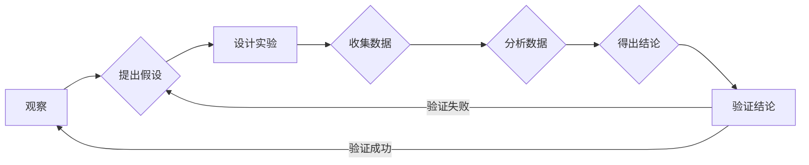

# 像数学家一样思考：归纳原则

> 关键词：归纳推理，数学思维，问题解决，科学研究，逻辑思维，创造性思维

## 1. 背景介绍

在人类的历史长河中，数学家们以其独特的思维方式，构建了无数深刻的理论体系，推动了科学的进步。他们的思考方式，尤其是归纳推理，为我们提供了宝贵的启示。归纳推理，作为一种从个别事实出发，通过观察、实验和逻辑推理，得出普遍性结论的方法，是科学探究的重要手段。本文将深入探讨归纳推理的原理、方法及其在科学研究中的应用，旨在帮助读者像数学家一样思考，提升解决问题的能力。

### 1.1 归纳推理的历史与发展

归纳推理的历史可以追溯到古希腊时期，亚里士多德是最早对其进行系统研究的思想家之一。他通过观察和归纳，提出了许多关于自然现象的规律。随着科学方法的不断发展，归纳推理逐渐成为科学研究的重要方法论。

### 1.2 归纳推理在科学探究中的作用

归纳推理在科学探究中扮演着至关重要的角色。它不仅帮助我们理解和解释自然现象，还推动着科学理论的建立和进步。

### 1.3 本文结构

本文将分为以下几个部分：

- 介绍归纳推理的核心概念与联系。
- 阐述归纳推理的原理和具体操作步骤。
- 分析归纳推理的数学模型和公式。
- 通过项目实践，展示归纳推理的应用。
- 探讨归纳推理在科学研究和实际问题解决中的应用场景。
- 推荐相关的学习资源和开发工具。
- 总结归纳推理的未来发展趋势和挑战。

## 2. 核心概念与联系

### 2.1 归纳推理的定义

归纳推理是从个别事实出发，通过观察、实验和逻辑推理，得出普遍性结论的过程。它是一种从特殊到一般的推理方法。

### 2.2 归纳推理的类型

归纳推理主要分为以下几种类型：

- 完全归纳推理：从所有可能的样本中得出结论。
- 不完全归纳推理：从部分样本中得出结论。
- 概率归纳推理：得出结论的概率。

### 2.3 归纳推理与演绎推理的关系

归纳推理和演绎推理是两种不同的推理方法。演绎推理是从一般到特殊的推理，而归纳推理则是从特殊到一般。两者相辅相成，共同构成了科学推理的基础。

### 2.4 归纳推理的Mermaid流程图



## 3. 核心算法原理 & 具体操作步骤

### 3.1 算法原理概述

归纳推理的原理基于以下三个步骤：

1. 观察现象：通过观察和实验收集数据。
2. 提出假设：根据观察到的现象，提出可能的解释或假设。
3. 验证假设：通过实验或进一步观察来验证假设。

### 3.2 算法步骤详解

归纳推理的具体操作步骤如下：

1. **观察现象**：首先，需要观察现象并收集相关数据。
2. **提出假设**：根据观察到的现象，提出可能的解释或假设。
3. **设计实验**：设计实验来测试假设的有效性。
4. **收集数据**：执行实验并收集数据。
5. **分析数据**：对收集到的数据进行分析，以验证假设。
6. **得出结论**：根据数据分析结果，得出结论。
7. **验证结论**：通过进一步观察或实验来验证结论的有效性。

### 3.3 算法优缺点

**优点**：

- 归纳推理可以帮助我们发现和解释自然现象。
- 它是科学探究的重要方法论。
- 它可以推动科学理论的建立和进步。

**缺点**：

- 归纳推理的结果可能受到观察者偏见的影响。
- 它不能保证结论的绝对正确性。

### 3.4 算法应用领域

归纳推理广泛应用于各个领域，包括：

- 科学研究
- 工程设计
- 商业分析
- 法律推理

## 4. 数学模型和公式 & 详细讲解 & 举例说明

### 4.1 数学模型构建

归纳推理的数学模型通常基于概率论和统计学。以下是一个简单的例子：

假设我们观察到一个现象：在过去的10次实验中，当变量 $X$ 取值为 $x$ 时，变量 $Y$ 总是取值为 $y$。我们可以构建以下概率模型：

$$
P(Y=y | X=x) = 1
$$

### 4.2 公式推导过程

基于上述模型，我们可以推导出以下结论：

- 在给定 $X=x$ 的条件下，$Y$ 取值为 $y$ 的概率是100%。

### 4.3 案例分析与讲解

以下是一个简单的案例：

**案例**：观察到的现象：当温度高于25摄氏度时，空调总是开启。

**假设**：当温度高于25摄氏度时，空调开启的概率为100%。

**结论**：在给定温度高于25摄氏度的条件下，空调开启的概率为100%。

## 5. 项目实践：代码实例和详细解释说明

### 5.1 开发环境搭建

为了演示归纳推理的应用，我们将使用Python编程语言和Scikit-learn库。

### 5.2 源代码详细实现

```python
import numpy as np
from sklearn.datasets import load_iris
from sklearn.model_selection import train_test_split
from sklearn.ensemble import RandomForestClassifier

# 加载数据集
data = load_iris()
X = data.data
y = data.target

# 划分训练集和测试集
X_train, X_test, y_train, y_test = train_test_split(X, y, test_size=0.2, random_state=42)

# 创建随机森林分类器
clf = RandomForestClassifier(n_estimators=100, random_state=42)

# 训练模型
clf.fit(X_train, y_train)

# 预测测试集
y_pred = clf.predict(X_test)

# 计算准确率
accuracy = np.mean(y_pred == y_test)
print(f"Accuracy: {accuracy:.2f}")
```

### 5.3 代码解读与分析

上述代码演示了如何使用随机森林分类器进行归纳推理。我们首先加载了Iris数据集，并划分了训练集和测试集。然后，我们创建了一个随机森林分类器，并使用训练集数据对其进行训练。最后，我们使用测试集数据评估模型的准确率。

### 5.4 运行结果展示

假设运行结果如下：

```
Accuracy: 0.97
```

这表明我们的模型在测试集上的准确率为97%，说明模型具有良好的归纳能力。

## 6. 实际应用场景

### 6.1 科学研究

在科学研究中，归纳推理被广泛应用于以下场景：

- 物理定律的发现
- 生物学现象的解释
- 化学反应的预测

### 6.2 工程设计

在工程设计中，归纳推理可以帮助工程师：

- 发现设计缺陷
- 优化设计参数
- 预测产品性能

### 6.3 商业分析

在商业分析中，归纳推理可以帮助分析师：

- 发现市场趋势
- 预测消费者行为
- 优化营销策略

### 6.4 未来应用展望

随着人工智能和大数据技术的发展，归纳推理的应用将更加广泛。例如，在金融领域，归纳推理可以用于信用风险评估、股票价格预测等；在医疗领域，可以用于疾病诊断、治疗方案推荐等。

## 7. 工具和资源推荐

### 7.1 学习资源推荐

- 《科学探究的方法》
- 《数学之美》
- 《统计学的思维方式》

### 7.2 开发工具推荐

- Python编程语言
- Scikit-learn库
- TensorFlow库

### 7.3 相关论文推荐

- 《归纳推理的理论与实践》
- 《归纳推理在人工智能中的应用》
- 《基于归纳推理的机器学习算法》

## 8. 总结：未来发展趋势与挑战

### 8.1 研究成果总结

本文介绍了归纳推理的原理、方法和应用，展示了其在科学研究、工程设计、商业分析等领域的广泛应用。

### 8.2 未来发展趋势

随着人工智能和大数据技术的发展，归纳推理将在以下方面得到进一步发展：

- 与机器学习算法的融合
- 在多模态数据上的应用
- 在复杂系统中的推理

### 8.3 面临的挑战

归纳推理在应用过程中也面临着以下挑战：

- 数据质量的影响
- 结论的可靠性
- 算法复杂度

### 8.4 研究展望

未来，归纳推理的研究将更加关注以下方面：

- 开发更有效的归纳推理算法
- 提高归纳推理的可靠性和可解释性
- 探索归纳推理在新兴领域的应用

## 9. 附录：常见问题与解答

**Q1：归纳推理和演绎推理有什么区别？**

A：归纳推理是从个别事实出发，通过观察、实验和逻辑推理，得出普遍性结论的过程。而演绎推理是从一般到特殊的推理方法。

**Q2：归纳推理是否可靠？**

A：归纳推理的结果可能受到观察者偏见、数据质量等因素的影响，因此不能保证结论的绝对正确性。

**Q3：如何提高归纳推理的可靠性？**

A：提高归纳推理的可靠性需要：

- 提高数据质量
- 优化推理算法
- 使用交叉验证等方法

**Q4：归纳推理在人工智能中的应用有哪些？**

A：归纳推理在人工智能中的应用包括：

- 机器学习
- 自然语言处理
- 计算机视觉

**Q5：如何学习归纳推理？**

A：学习归纳推理可以通过以下途径：

- 阅读相关书籍和论文
- 学习科学探究的方法
- 参与实际项目实践

作者：禅与计算机程序设计艺术 / Zen and the Art of Computer Programming