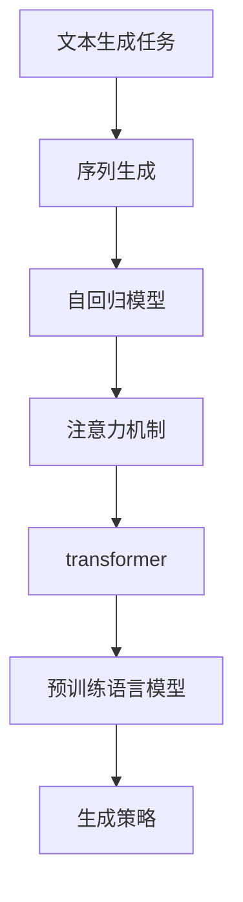
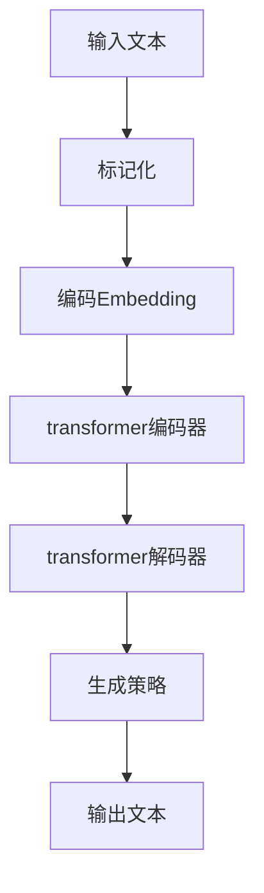

# 文本生成(Text Generation) - 原理与代码实例讲解

## 1. 背景介绍

### 1.1 问题的由来

在自然语言处理(Natural Language Processing, NLP)领域中,文本生成是一项极具挑战的任务。随着人工智能技术的不断发展,生成高质量、连贯、上下文相关的文本已成为许多应用程序的关键需求,如自动文章写作、对话系统、机器翻译等。传统的基于规则或模板的方法往往效果有限,难以生成自然流畅的文本。

### 1.2 研究现状

近年来,基于深度学习的文本生成模型取得了长足进步,尤其是自注意力机制(Self-Attention)和transformer架构的出现,使得生成质量有了大幅提升。transformer模型可以有效捕捉长距离依赖关系,生成更加连贯的文本。此外,预训练语言模型(Pre-trained Language Model,PLM)的兴起,如BERT、GPT等,为文本生成任务提供了强大的语义表示能力。

### 1.3 研究意义

高质量的文本生成技术在多个领域具有广泛的应用前景:

1. **自动文章写作**: 可以自动生成新闻报道、文学作品、营销文案等,提高写作效率。
2. **对话系统**: 生成自然流畅的对话响应,提升人机交互体验。
3. **机器翻译**: 将一种语言的文本生成为另一种语言,实现跨语言交流。
4. **自动问答**: 根据问题生成相关的答复,构建智能问答系统。
5. **数据增强**: 生成大量文本数据,丰富训练集,提升其他NLP模型的性能。

因此,研究高质量的文本生成技术对于推动人工智能的发展至关重要。

### 1.4 本文结构

本文将全面介绍文本生成的核心概念、算法原理、数学模型、实际应用以及相关资源,内容安排如下:

1. 核心概念与联系
2. 核心算法原理与具体操作步骤
3. 数学模型和公式详细讲解与举例说明
4. 项目实践:代码实例和详细解释说明
5. 实际应用场景
6. 工具和资源推荐
7. 总结:未来发展趋势与挑战
8. 附录:常见问题与解答

## 2. 核心概念与联系

文本生成任务的核心概念包括:

1. **序列生成(Sequence Generation)**: 将文本视为一系列离散标记(如字符或词元)的序列,目标是根据给定的上下文生成新的序列。
2. **自回归模型(Autoregressive Model)**: 一种生成模型,预测当前标记时会利用之前生成的标记序列作为条件。
3. **注意力机制(Attention Mechanism)**: 一种赋予模型"注意力"的机制,使其能够专注于输入序列中与当前预测相关的部分。
4. **transformer**: 一种全新的基于注意力机制的序列到序列模型架构,可有效捕捉长距离依赖关系。
5. **预训练语言模型(PLM)**: 在大规模无监督语料库上预先训练的语言模型,捕捉丰富的语义和上下文信息,可迁移到下游任务,提升性能。
6. **生成策略**: 根据模型输出概率分布生成标记序列的策略,如贪婪搜索(Greedy Search)、束搜索(Beam Search)、前向采样(Top-k/Top-p Sampling)等。

这些核心概念相互关联、环环相扣,共同构建了现代文本生成系统的理论基础。接下来我们将逐一探讨它们的原理和实现细节。



## 3. 核心算法原理与具体操作步骤

### 3.1 算法原理概述

现代文本生成系统通常基于自回归transformer模型和预训练语言模型。自回归模型将文本生成视为序列到序列的转换问题,每次预测下一个标记时,都会利用之前生成的序列作为条件。transformer架构采用了自注意力机制,能够有效捕捉长距离依赖关系,生成更加连贯的文本。

预训练语言模型则在大规模语料库上预先训练,获得丰富的语义和上下文表示能力,可迁移到下游任务,提升性能。常见的预训练模型包括BERT、GPT、T5等。

在推理(Inference)阶段,给定一个起始文本(或问题),模型会自回归地生成新的标记序列,直至达到终止条件(如生成特殊结束标记)。生成过程中,模型会根据当前已生成的文本和输入上下文,预测下一个最可能的标记。通过不断迭代,最终生成完整的目标文本。

### 3.2 算法步骤详解

以基于GPT-2的文本生成系统为例,算法步骤如下:

1. **输入处理**: 将输入文本(或问题)进行标记化(Tokenization),转换为模型可识别的标记序列。

2. **编码(Encoding)**: 将标记序列映射为模型的embedding表示,作为transformer的输入。

3. **transformer编码器(Encoder)**: 计算输入序列的上下文表示,传递给解码器。

4. **transformer解码器(Decoder)**:
    a. 初始化解码器的起始状态,通常为特殊开始标记`<bos>`。
    b. 自回归地生成新标记:
        i. 将已生成序列和编码器输出作为解码器输入。
        ii. 通过自注意力层捕捉已生成序列的内部依赖关系。
        iii. 通过解码器-编码器注意力层关注与输入序列相关的部分。
        iv. 基于注意力输出,预测下一个标记的概率分布。
        v. 根据生成策略(如贪婪搜索或束搜索)从概率分布中采样一个标记。
        vi. 将新标记添加到已生成序列中,重复上述步骤,直至生成终止标记`<eos>`或达到最大长度。

5. **输出处理**: 将生成的标记序列解码为人类可读的文本。



### 3.3 算法优缺点

**优点**:

1. **生成质量高**: 利用transformer的自注意力机制和预训练语言模型的语义表示能力,可生成高质量、连贯、上下文相关的文本。

2. **泛化能力强**: 预训练语言模型在大规模语料库上训练,具有强大的泛化能力,可应用于多种下游任务。

3. **可解释性好**: 自注意力机制赋予了模型可解释性,可视化注意力权重,分析模型关注的焦点。

**缺点**:

1. **训练成本高**: 预训练语言模型需要大量计算资源,训练成本昂贵。

2. **生成效率较低**: 自回归生成过程是序列式的,无法完全并行化,推理速度较慢。

3. **存在偏差**: 生成的文本可能存在不确定性和偏差,需要人工审查和调整。

4. **缺乏长期一致性**: 生成的长文本可能缺乏全局一致性和逻辑连贯性。

### 3.4 算法应用领域

文本生成算法在多个领域都有广泛的应用:

1. **自动文章写作**: 生成新闻报道、文学作品、营销文案等内容。

2. **对话系统**: 生成自然语言对话响应,提升人机交互体验。

3. **机器翻译**: 将一种语言的文本生成为另一种语言的译文。

4. **自动问答**: 根据问题生成相关的答复,构建智能问答系统。

5. **数据增强**: 生成大量文本数据,丰富训练集,提升其他NLP模型性能。

6. **自动文本摘要**: 根据长文本生成简明扼要的摘要。

7. **自动创作**: 生成诗歌、小说等创作性文本内容。

8. **智能辅助写作**: 为人类写作提供建议和续写,提高写作效率。

## 4. 数学模型和公式详细讲解与举例说明

### 4.1 数学模型构建

文本生成任务可以形式化为给定输入序列$X=(x_1, x_2, ..., x_n)$,生成目标序列$Y=(y_1, y_2, ..., y_m)$的条件概率模型:

$$P(Y|X;\theta)=\prod_{t=1}^{m}P(y_t|y_{<t}, X;\theta)$$

其中$\theta$表示模型参数,目标是最大化生成序列$Y$的条件概率。由于每个标记$y_t$的预测都依赖于之前生成的序列$y_{<t}$,因此这是一个典型的自回归(Autoregressive)模型。

transformer的自注意力机制使用了查询(Query)、键(Key)和值(Value)的概念,通过计算查询和键之间的相似性,对值进行加权求和,捕捉序列内部的依赖关系。具体计算过程如下:

1. 线性投影将输入映射为查询$Q$、键$K$和值$V$:

$$\begin{aligned}
Q &= XW_Q \
K &= XW_K \
V &= XW_V
\end{aligned}$$

2. 计算查询和键之间的相似性得分(点积):

$$\text{Scores} = QK^T$$

3. 对相似性得分进行缩放和软最大化(Softmax),得到注意力权重:

$$\text{Attention}(Q, K, V) = \text{Softmax}(\frac{\text{Scores}}{\sqrt{d_k}})V$$

4. 加权求和值向量,得到注意力输出。

通过多头注意力(Multi-Head Attention)机制,模型可以从不同的表示子空间捕捉不同的依赖关系。

### 4.2 公式推导过程

我们以transformer的多头自注意力机制为例,推导其数学表达式:

单头自注意力的计算公式为:

$$\text{Attention}(Q, K, V) = \text{Softmax}(\frac{QK^T}{\sqrt{d_k}})V$$

对于多头注意力,我们将查询/键/值先进行线性投影,得到不同的表示子空间:

$$\begin{aligned}
Q_i &= QW_i^Q &\in \mathbb{R}^{n \times d_k} \
K_i &= KW_i^K &\in \mathbb{R}^{n \times d_k} \
V_i &= VW_i^V &\in \mathbb{R}^{n \times d_v}
\end{aligned}$$

其中$i=1, 2, ..., h$表示第$i$个注意力头,共$h$个头。

然后分别计算每个注意力头的输出:

$$\text{head}_i = \text{Attention}(Q_i, K_i, V_i)$$

最后将所有注意力头的输出进行拼接:

$$\text{MultiHead}(Q, K, V) = \text{Concat}(\text{head}_1, ..., \text{head}_h)W^O$$

其中$W^O \in \mathbb{R}^{hd_v \times d_\text{model}}$是一个可训练的投影矩阵,将拼接后的向量映射回模型的隐状态维度$d_\text{model}$。

通过多头注意力机制,transformer能够从不同的表示子空间捕捉不同的依赖关系,提高了模型的表达能力。

### 4.3 案例分析与讲解

我们以一个文本续写的例子,分析transformer模型是如何生成新文本的。

假设输入文本为:"The young scientist was fascinated by the world of"(年轻的科学家被这个世界所着迷),我们希望模型能够生成一个合理的续写。

1. 输入文本首先被标记化,转换为一系列标记ID:

```python
input_ids = tokenizer.encode("The young scientist was fascinated by the world of")
```

2. 将标记ID输入到transformer模型,模型会计算出每个位置的隐状态表示,并通过自注意力层捕捉标记之间的依赖关系。

3. 在解码器端,模型会自回归地生成新的标记序列。假设已经生成了"