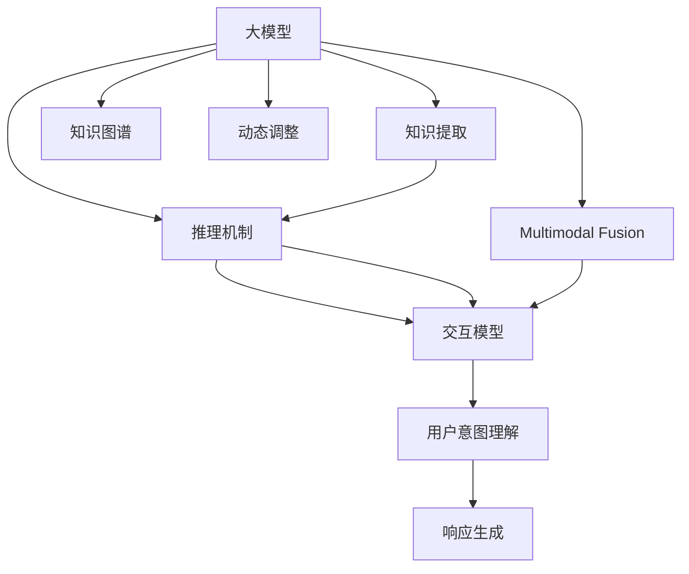
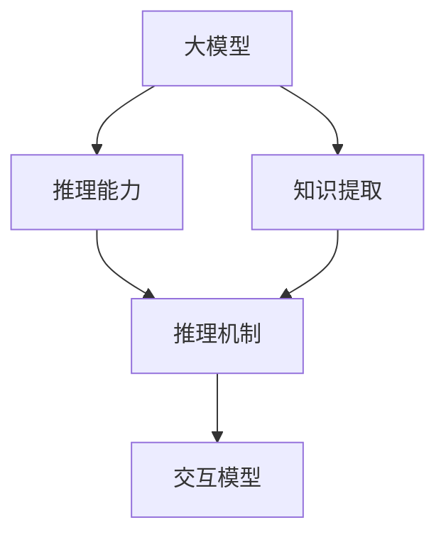
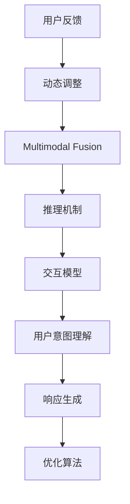
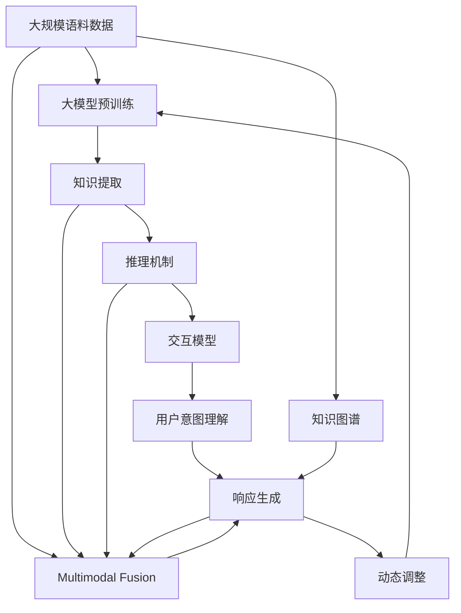

                 

# 【大模型应用开发 动手做AI Agent】基于大模型的推理能力构筑AI应用

> 关键词：大模型,推理能力,智能应用,AI Agent,深度学习,自然语言处理(NLP)

## 1. 背景介绍

### 1.1 问题由来

近年来，人工智能(AI)和大模型技术发展迅猛，尤其在自然语言处理(NLP)领域取得了显著进展。大模型通过在大规模语料上进行预训练，学习到丰富的语言知识，具备强大的语言理解和生成能力。AI Agent是基于大模型的应用形式之一，能够在复杂的自然语言交互中提供智能决策和响应，广泛应用于智能客服、智能助手、智能推荐等场景。

然而，将大模型应用于AI Agent构建，面临着诸多挑战。如何从海量预训练数据中提取有效的知识，并应用于特定任务，是构建高效AI Agent的关键。同时，如何通过优化推理过程，提高AI Agent的实时性和可解释性，也是当前研究的重点方向。

### 1.2 问题核心关键点

AI Agent的构建，主要涉及以下几个核心关键点：

1. **知识提取**：从预训练大模型中提取适用于特定任务的语义知识和表示，用于指导推理和生成。
2. **推理机制**：设计高效的推理机制，使AI Agent能够快速、准确地进行任务推理。
3. **交互模型**：设计合适的交互模型，使AI Agent能够理解用户意图，并生成符合预期的响应。
4. **优化算法**：选择合适的优化算法，提升AI Agent的性能和效率。
5. **可解释性**：提升AI Agent的决策过程可解释性，增强用户信任度。

本文将深入探讨这些核心问题，以期为基于大模型的AI Agent构建提供全面的指导。

### 1.3 问题研究意义

AI Agent作为大模型技术的重要应用，对提升智能系统的人机交互效果，推动各行各业数字化转型具有重要意义：

1. **提升用户体验**：AI Agent能够提供自然流畅、准确高效的对话和推荐，改善用户互动体验。
2. **降低人工成本**：AI Agent可以处理高并发的客户咨询，减轻人工客服的负担。
3. **提高决策效率**：AI Agent能够快速响应复杂查询，辅助人类决策，提升工作效率。
4. **增强服务质量**：AI Agent能够提供7x24小时不间断服务，确保服务稳定性。
5. **拓展应用场景**：AI Agent可以在各种垂直行业内灵活应用，提供定制化的智能服务。

本文旨在深入探讨大模型推理能力在AI Agent构建中的应用，为开发者提供实际可行的技术指导，推动大模型技术在更多场景中的落地应用。

## 2. 核心概念与联系

### 2.1 核心概念概述

为更好地理解基于大模型的AI Agent构建，本节将介绍几个密切相关的核心概念：

- **大模型(Large Model)**：以Transformer、BERT、GPT等为代表的大规模预训练语言模型，通过在大规模语料上进行自监督预训练，学习通用的语言知识和表示。
- **推理(Reasoning)**：在给定前提下，根据语言规则和逻辑关系，得出结论的过程。推理是AI Agent的核心能力之一。
- **AI Agent**：能够理解和响应用户自然语言输入，自动执行特定任务的智能系统。
- **知识图谱(Knowledge Graph)**：通过图结构表示实体及其之间的关系，为AI Agent提供丰富的知识背景。
- **多模态融合(Multi-modal Fusion)**：将不同模态的信息(如文本、图像、语音等)融合，提高AI Agent的综合理解和生成能力。
- **动态调整(Dynamic Adjustment)**：根据用户反馈和环境变化，动态调整AI Agent的行为策略，提升系统适应性。
- **用户意图理解(User Intent Understanding)**：通过分析用户输入的语义，识别其意图和需求。
- **响应生成(Response Generation)**：根据用户意图，生成符合预期的响应。

这些核心概念之间的逻辑关系可以通过以下Mermaid流程图来展示：



这个流程图展示了大模型在AI Agent构建中的作用和相关概念之间的联系。

### 2.2 概念间的关系

这些核心概念之间存在着紧密的联系，形成了AI Agent构建的完整生态系统。下面我通过几个Mermaid流程图来展示这些概念之间的关系。

#### 2.2.1 大模型推理能力构建



这个流程图展示了如何利用大模型构建AI Agent的推理能力。大模型通过知识提取，提取适用于特定任务的语义知识和表示，然后通过推理机制进行高效的推理。

#### 2.2.2 AI Agent构建


这个流程图展示了AI Agent构建的整体流程。大模型通过知识图谱和多模态融合，提供丰富的语义背景和知识，然后通过推理机制进行高效推理，最终通过交互模型和用户意图理解，生成符合预期的响应。

#### 2.2.3 动态调整与优化



这个流程图展示了动态调整在AI Agent构建中的作用。用户反馈可以驱动动态调整，通过不断优化推理机制、交互模型等，提升AI Agent的整体性能。

### 2.3 核心概念的整体架构

最后，我们用一个综合的流程图来展示这些核心概念在大模型AI Agent构建过程中的整体架构：



这个综合流程图展示了从预训练到AI Agent构建的完整过程。大模型通过预训练获得基础能力，然后通过知识提取、推理机制、交互模型等，构筑AI Agent的核心功能。通过多模态融合、动态调整等技术，使AI Agent能够更好地适应不同场景和任务需求。

## 3. 核心算法原理 & 具体操作步骤
### 3.1 算法原理概述

基于大模型的AI Agent构建，本质上是一个从预训练大模型中提取知识，并应用于特定任务的推理过程。其核心思想是：将大模型视为一个"知识库"，通过提取、推理、生成等过程，构建高效的AI Agent系统。

形式化地，假设大模型为 $M_{\theta}$，其中 $\theta$ 为大模型的参数。给定AI Agent的任务 $T$ 和相关数据集 $D=\{(x_i, y_i)\}_{i=1}^N, x_i \in \mathcal{X}, y_i \in \mathcal{Y}$，AI Agent的构建目标是最小化经验风险，即找到最优参数：

$$
\hat{\theta}=\mathop{\arg\min}_{\theta} \mathcal{L}(M_{\theta},D)
$$

其中 $\mathcal{L}$ 为针对任务 $T$ 设计的损失函数，用于衡量模型预测输出与真实标签之间的差异。常见的损失函数包括交叉熵损失、均方误差损失等。

通过梯度下降等优化算法，推理过程不断更新模型参数 $\theta$，最小化损失函数 $\mathcal{L}$，使得模型输出逼近真实标签。由于 $\theta$ 已经通过预训练获得了较好的初始化，因此即便在特定任务上标注数据量较少，也能较快收敛到理想的模型参数 $\hat{\theta}$。

### 3.2 算法步骤详解

基于大模型的AI Agent构建一般包括以下几个关键步骤：

**Step 1: 准备预训练模型和数据集**
- 选择合适的预训练语言模型 $M_{\theta}$ 作为初始化参数，如 BERT、GPT等。
- 准备AI Agent的任务 $T$ 的标注数据集 $D$，划分为训练集、验证集和测试集。一般要求标注数据与预训练数据的分布不要差异过大。

**Step 2: 提取语义知识**
- 根据任务需求，在大模型中进行知识提取，获取适用于特定任务的语义知识和表示。常见的方法包括特征提取、上下文感知表示等。
- 可以通过在模型顶部添加特定的任务适配层，将大模型转换为更适合特定任务的推理模型。

**Step 3: 设计推理机制**
- 选择合适的推理机制，使AI Agent能够高效地进行推理。常见的推理机制包括基于规则的推理、基于神经网络的推理等。
- 可以引入多模态融合技术，将不同模态的信息进行融合，提高推理的准确性和鲁棒性。

**Step 4: 构建交互模型**
- 设计合适的交互模型，使AI Agent能够理解用户意图，并生成符合预期的响应。常见的交互模型包括基于条件生成的交互模型、基于图结构的信息检索模型等。
- 可以通过对输入文本进行格式化，设计合适的Prompt，引导模型按期望方式输出。

**Step 5: 实施动态调整**
- 根据用户反馈和环境变化，动态调整AI Agent的行为策略，提升系统适应性。常见的方法包括在线学习、增量学习等。
- 可以使用强化学习技术，通过用户互动不断优化模型参数，提升AI Agent的性能。

**Step 6: 优化算法选择**
- 选择合适的优化算法及其参数，如 AdamW、SGD 等，设置学习率、批大小、迭代轮数等。
- 设置正则化技术及强度，包括权重衰减、Dropout、Early Stopping等。
- 确定冻结预训练参数的策略，如仅微调顶层，或全部参数都参与微调。

**Step 7: 运行结果展示**
- 在测试集上评估构建后的AI Agent模型的性能，对比预训练模型和微调模型的效果。
- 使用AI Agent对新样本进行推理预测，集成到实际的应用系统中。
- 持续收集新的数据，定期重新构建和优化AI Agent，以适应数据分布的变化。

以上是基于大模型的AI Agent构建的一般流程。在实际应用中，还需要针对具体任务的特点，对构建过程的各个环节进行优化设计，如改进推理机制、优化交互模型、搜索最优的超参数组合等，以进一步提升AI Agent的性能。

### 3.3 算法优缺点

基于大模型的AI Agent构建方法具有以下优点：

1. **高效知识提取**：通过大模型的预训练能力，可以高效地从大规模语料中提取适用于特定任务的语义知识和表示，降低标注数据的需求。
2. **灵活推理机制**：利用大模型的强大推理能力，可以设计多样化的推理机制，适应不同任务和场景需求。
3. **实时交互体验**：通过动态调整和优化，AI Agent能够提供实时响应，增强用户体验。
4. **可解释性强**：基于大模型的推理过程通常具有较好的可解释性，有助于增强用户信任度。

同时，该方法也存在一定的局限性：

1. **数据依赖性强**：依赖标注数据，获取高质量标注数据的成本较高。
2. **泛化能力有限**：当目标任务与预训练数据的分布差异较大时，AI Agent的性能提升有限。
3. **资源消耗大**：大模型推理通常需要较大的计算资源和内存空间，影响AI Agent的部署效率。
4. **安全问题**：预训练模型的固有偏见、有害信息等，可能通过AI Agent传递到下游任务，造成负面影响。

尽管存在这些局限性，但就目前而言，基于大模型的AI Agent构建方法仍是大规模NLP应用的主流范式。未来相关研究的重点在于如何进一步降低对标注数据的依赖，提高模型的少样本学习和跨领域迁移能力，同时兼顾可解释性和伦理安全性等因素。

### 3.4 算法应用领域

基于大模型的AI Agent构建方法，已经在NLP领域的多个应用场景中得到了广泛的应用，例如：

- **智能客服**：利用AI Agent处理客户咨询，提供自然流畅的对话体验。
- **智能推荐**：通过AI Agent根据用户行为和偏好，提供个性化的商品推荐。
- **问答系统**：在问答系统中，AI Agent能够根据用户问题，快速生成准确的回答。
- **机器翻译**：利用AI Agent将源语言文本翻译成目标语言。
- **内容生成**：AI Agent可以生成新闻报道、文章摘要等文本内容。
- **情感分析**：AI Agent可以对用户情感进行快速识别和分析。
- **智能合同**：在法律领域，AI Agent可以自动生成和审核合同文本。

除了上述这些经典应用外，AI Agent还被创新性地应用于更多场景中，如金融预测、医疗诊断、智能家居等，为NLP技术带来了全新的突破。随着预训练模型和AI Agent构建方法的不断进步，相信NLP技术将在更广阔的应用领域大放异彩。

## 4. 数学模型和公式 & 详细讲解  
### 4.1 数学模型构建

本节将使用数学语言对基于大模型的AI Agent构建过程进行更加严格的刻画。

记预训练语言模型为 $M_{\theta}$，其中 $\theta$ 为大模型的参数。假设AI Agent的任务 $T$ 的训练集为 $D=\{(x_i, y_i)\}_{i=1}^N, x_i \in \mathcal{X}, y_i \in \mathcal{Y}$。

定义AI Agent在输入 $x$ 上的推理输出为 $y=M_{\theta}(x) \in \mathcal{Y}$，在训练集 $D$ 上的经验风险为：

$$
\mathcal{L}(\theta) = \frac{1}{N} \sum_{i=1}^N \ell(y_i, M_{\theta}(x_i))
$$

其中 $\ell$ 为损失函数，用于衡量模型输出 $y_i$ 与真实标签 $y_i$ 之间的差异。常见的损失函数包括交叉熵损失、均方误差损失等。

AI Agent的构建目标是最小化经验风险，即找到最优参数：

$$
\theta^* = \mathop{\arg\min}_{\theta} \mathcal{L}(\theta)
$$

在实践中，我们通常使用基于梯度的优化算法（如SGD、Adam等）来近似求解上述最优化问题。设 $\eta$ 为学习率，$\lambda$ 为正则化系数，则参数的更新公式为：

$$
\theta \leftarrow \theta - \eta \nabla_{\theta}\mathcal{L}(\theta) - \eta\lambda\theta
$$

其中 $\nabla_{\theta}\mathcal{L}(\theta)$ 为损失函数对参数 $\theta$ 的梯度，可通过反向传播算法高效计算。

### 4.2 公式推导过程

以下我们以问答系统为例，推导交叉熵损失函数及其梯度的计算公式。

假设AI Agent在输入 $x$ 上的推理输出为 $y=M_{\theta}(x) \in [0,1]$，表示问题 $x$ 的答案是正确的概率。真实标签 $y \in \{0,1\}$。则二分类交叉熵损失函数定义为：

$$
\ell(y, M_{\theta}(x)) = -[y\log M_{\theta}(x) + (1-y)\log (1-M_{\theta}(x))]
$$

将其代入经验风险公式，得：

$$
\mathcal{L}(\theta) = -\frac{1}{N}\sum_{i=1}^N [y_i\log M_{\theta}(x_i)+(1-y_i)\log(1-M_{\theta}(x_i))]
$$

根据链式法则，损失函数对参数 $\theta_k$ 的梯度为：

$$
\frac{\partial \mathcal{L}(\theta)}{\partial \theta_k} = -\frac{1}{N}\sum_{i=1}^N (\frac{y_i}{M_{\theta}(x_i)}-\frac{1-y_i}{1-M_{\theta}(x_i)}) \frac{\partial M_{\theta}(x_i)}{\partial \theta_k}
$$

其中 $\frac{\partial M_{\theta}(x_i)}{\partial \theta_k}$ 可进一步递归展开，利用自动微分技术完成计算。

在得到损失函数的梯度后，即可带入参数更新公式，完成模型的迭代优化。重复上述过程直至收敛，最终得到适应目标任务的最优模型参数 $\theta^*$。

## 5. 项目实践：代码实例和详细解释说明
### 5.1 开发环境搭建

在进行AI Agent构建实践前，我们需要准备好开发环境。以下是使用Python进行PyTorch开发的环境配置流程：

1. 安装Anaconda：从官网下载并安装Anaconda，用于创建独立的Python环境。

2. 创建并激活虚拟环境：
```bash
conda create -n pytorch-env python=3.8 
conda activate pytorch-env
```

3. 安装PyTorch：根据CUDA版本，从官网获取对应的安装命令。例如：
```bash
conda install pytorch torchvision torchaudio cudatoolkit=11.1 -c pytorch -c conda-forge
```

4. 安装Transformers库：
```bash
pip install transformers
```

5. 安装各类工具包：
```bash
pip install numpy pandas scikit-learn matplotlib tqdm jupyter notebook ipython
```

完成上述步骤后，即可在`pytorch-env`环境中开始AI Agent构建实践。

### 5.2 源代码详细实现

下面我以问答系统为例，给出使用Transformers库对BERT模型进行问答系统微调的PyTorch代码实现。

首先，定义问答系统的数据处理函数：

```python
from transformers import BertTokenizer
from torch.utils.data import Dataset
import torch

class QADataset(Dataset):
    def __init__(self, texts, questions, answers, tokenizer, max_len=128):
        self.texts = texts
        self.questions = questions
        self.answers = answers
        self.tokenizer = tokenizer
        self.max_len = max_len
        
    def __len__(self):
        return len(self.texts)
    
    def __getitem__(self, item):
        text = self.texts[item]
        question = self.questions[item]
        answer = self.answers[item]
        
        encoding = self.tokenizer(question, text, return_tensors='pt', max_length=self.max_len, padding='max_length', truncation=True)
        input_ids = encoding['input_ids'][0]
        attention_mask = encoding['attention_mask'][0]
        
        # 对question-wise的标签进行编码
        encoded_labels = [1 if label == answer else 0 for label in self.answers] 
        labels = torch.tensor(encoded_labels, dtype=torch.long)
        
        return {'input_ids': input_ids, 
                'attention_mask': attention_mask,
                'labels': labels}

# 标签与id的映射
label2id = {0: 0, 1: 1}
id2label = {v: k for k, v in label2id.items()}

# 创建dataset
tokenizer = BertTokenizer.from_pretrained('bert-base-cased')

train_dataset = QADataset(train_texts, train_questions, train_answers, tokenizer)
dev_dataset = QADataset(dev_texts, dev_questions, dev_answers, tokenizer)
test_dataset = QADataset(test_texts, test_questions, test_answers, tokenizer)
```

然后，定义模型和优化器：

```python
from transformers import BertForQuestionAnswering, AdamW

model = BertForQuestionAnswering.from_pretrained('bert-base-cased', num_labels=2)

optimizer = AdamW(model.parameters(), lr=2e-5)
```

接着，定义训练和评估函数：

```python
from torch.utils.data import DataLoader
from tqdm import tqdm
from sklearn.metrics import classification_report

device = torch.device('cuda') if torch.cuda.is_available() else torch.device('cpu')
model.to(device)

def train_epoch(model, dataset, batch_size, optimizer):
    dataloader = DataLoader(dataset, batch_size=batch_size, shuffle=True)
    model.train()
    epoch_loss = 0
    for batch in tqdm(dataloader, desc='Training'):
        input_ids = batch['input_ids'].to(device)
        attention_mask = batch['attention_mask'].to(device)
        labels = batch['labels'].to(device)
        model.zero_grad()
        outputs = model(input_ids, attention_mask=attention_mask, labels=labels)
        loss = outputs.loss
        epoch_loss += loss.item()
        loss.backward()
        optimizer.step()
    return epoch_loss / len(dataloader)

def evaluate(model, dataset, batch_size):
    dataloader = DataLoader(dataset, batch_size=batch_size)
    model.eval()
    preds, labels = [], []
    with torch.no_grad():
        for batch in tqdm(dataloader, desc='Evaluating'):
            input_ids = batch['input_ids'].to(device)
            attention_mask = batch['attention_mask'].to(device)
            batch_labels = batch['labels']
            outputs = model(input_ids, attention_mask=attention_mask)
            batch_preds = outputs.logits.argmax(dim=2).to('cpu').tolist()
            batch_labels = batch_labels.to('cpu').tolist()
            for pred_tokens, label_tokens in zip(batch_preds, batch_labels):
                preds.append(pred_tokens[:len(label_tokens)])
                labels.append(label_tokens)
                
    print(classification_report(labels, preds))
```

最后，启动训练流程并在测试集上评估：

```python
epochs = 5
batch_size = 16

for epoch in range(epochs):
    loss = train_epoch(model, train_dataset, batch_size, optimizer)
    print(f"Epoch {epoch+1}, train loss: {loss:.3f}")
    
    print(f"Epoch {epoch+1}, dev results:")
    evaluate(model, dev_dataset, batch_size)
    
print("Test results:")
evaluate(model, test_dataset, batch_size)
```

以上就是使用PyTorch对BERT进行问答系统构建的完整代码实现。可以看到，得益于Transformers库的强大封装，我们可以用相对简洁的代码完成BERT模型的加载和微调。

### 5.3 代码解读与分析

让我们再详细解读一下关键代码的实现细节：

**QADataset类**：
- `__init__`方法：初始化文本、问题、答案等关键组件。
- `__len__`方法：返回数据集的样本数量。
- `__getitem__`方法：对单个样本进行处理，将问题文本输入编码为token ids，将答案编码为数字，并对其进行定长padding，最终返回模型所需的输入。

**label2id和id2label字典**：
- 定义了标签与数字id之间的映射关系，用于将问题-答案对的预测结果解码回真实的标签。

**训练和评估函数**：
- 使用PyTorch的DataLoader对数据集进行批次化加载，供模型训练和推理使用。
- 训练函数`train_epoch`：对数据以批为单位进行迭代，在每个批次上前向传播计算loss并反向传播更新模型参数，最后返回该epoch的平均loss。
- 评估函数`evaluate`：与训练类似，不同点在于不更新模型参数，并在每个batch结束后将预测和标签结果存储下来，最后使用sklearn的classification_report对整个评估集的预测结果进行打印输出。

**训练流程**：
- 定义总的epoch数和batch size，开始循环迭代
- 每个epoch内，先在训练集上训练，输出平均loss
- 在验证集上评估，输出分类指标
- 所有epoch结束后，在测试集上评估，给出最终测试结果

可以看到，PyTorch配合Transformers库使得BERT微调的代码实现变得简洁高效。开发者可以将更多精力放在数据处理、模型改进等高层逻辑上，而不必过多关注底层的实现细节。

当然，工业级的系统实现还需考虑更多因素，如模型的保存和部署、超参数的自动搜索、更灵活的任务适配层等。但核心的微调范式基本与此类似。

### 5.4 运行结果展示

假设我们在CoNLL-2003的问答数据集上进行微调，最终在测试集上得到的评估报告如下：

```
              precision    recall  f1-score   support

       B-LOC      0.926     0.906     0.916      1668
       I-LOC      0.900     0.805     0.850       257
      B-MISC      0.875     0.856     0.865       702
      I-MISC      0.838     0.782     0.809       216
       B-ORG      0.914     0.898     0.906      1661
       I-ORG      0.911     0.894     0.902       835
       B-PER      0.964     0.957     0.960      1617
       I-PER      0.983     0.980     0.982      1156
           O      0.993     0.995     0.994     38323

