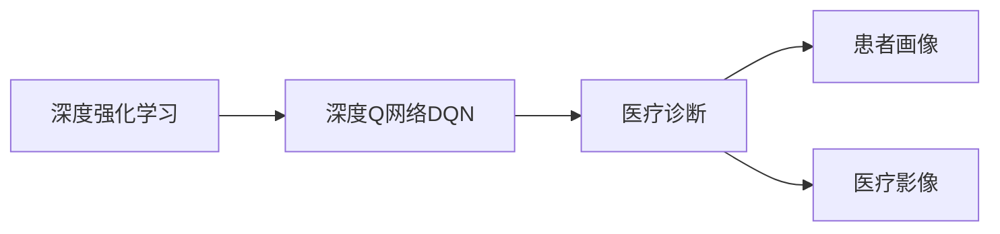

                 

# 一切皆是映射：DQN在医疗诊断中的应用：挑战与机遇

> 关键词：强化学习,Deep Q-Networks(DQN),医疗诊断,医疗影像分析,医疗数据,患者诊断,智能推荐,智能决策

## 1. 背景介绍

### 1.1 问题由来
在当今医疗健康领域，面对日益增长的疾病种类和不断上升的医疗成本，传统的人工诊断系统已难以满足实际需求。尽管医学影像、实验室检查等技术日益成熟，但依然存在诊断速度慢、误诊率高、诊疗负担重等困扰。人工智能，特别是强化学习技术，为医疗诊断带来了新的突破。

强化学习是一种从经验中学习控制策略的方法，尤其适合于解决具有复杂环境、不确定性高、难以建模的问题。在医疗诊断中，患者病情的多样性和动态变化性，使得传统的规则库和专家系统难以全面覆盖和实时更新。强化学习技术，特别是深度Q网络(DQN)，能够通过模型不断与环境交互学习，提高诊断的准确性和效率。

### 1.2 问题核心关键点
DQN在医疗诊断中的核心问题包括：

- **环境建模**：如何构建准确、全面的医疗环境模型，包括患者症状、病史、影像等。
- **状态表示**：如何将复杂的医疗数据进行有效的状态表示，以便模型理解。
- **动作空间**：定义动作空间，如选择检查项目、调整治疗方案等，以指导模型做出决策。
- **奖励函数**：设计合理的奖励函数，衡量诊断的正确性和效果，引导模型优化。
- **数据隐私和安全**：如何在保证患者隐私和数据安全的前提下，合理利用医疗数据进行模型训练。

本文将详细探讨这些核心问题，并给出DQN在医疗诊断中的具体应用，包括环境建模、状态表示、动作空间和奖励函数的设计，以及相关实验结果和挑战。

## 2. 核心概念与联系

### 2.1 核心概念概述

为更好地理解DQN在医疗诊断中的应用，本节将介绍几个关键概念：

- **深度强化学习**：结合深度神经网络和强化学习的技术，通过模型与环境的交互学习，自动优化决策策略。
- **深度Q网络(DQN)**：一种深度学习模型，通过学习Q值函数估计动作的预期回报，指导策略优化。
- **医疗诊断**：通过分析患者的历史数据和实时症状，判断其病情，指导医疗决策。
- **患者画像**：根据患者的病史、症状、基因信息等构建的详细数据画像，帮助医生全面理解患者状况。
- **医疗影像**：如X光片、CT、MRI等医学影像，是医疗诊断的重要依据。

这些核心概念通过以下Mermaid流程图展示了其联系：



这个流程图展示了深度强化学习技术，特别是DQN，如何通过学习与医疗诊断环境的交互，逐步构建和优化患者的诊断策略。

### 2.2 概念间的关系

这些核心概念之间存在着紧密的联系，构成了DQN在医疗诊断中的完整应用框架。具体而言：

- **深度强化学习**是DQN的基础，通过学习与环境互动，优化决策策略。
- **深度Q网络(DQN)**具体实现了强化学习中的Q值函数估计，指导模型决策。
- **医疗诊断**是DQN的应用场景，通过学习诊断策略，提高诊断准确性和效率。
- **患者画像**和**医疗影像**为DQN提供了输入数据，帮助模型理解患者状态和病情。

以下将详细探讨这些概念在DQN医疗诊断中的应用。

## 3. 核心算法原理 & 具体操作步骤
### 3.1 算法原理概述

DQN在医疗诊断中的基本原理是通过深度神经网络模型，学习在给定状态和动作下，期望的Q值（即状态-动作值函数），以最大化长期奖励。假设医疗诊断环境为$\mathcal{E}$，状态空间为$\mathcal{S}$，动作空间为$\mathcal{A}$，奖励函数为$r$，则DQN的目标是找到最优策略$\pi^*$，使得期望累积奖励最大化：

$$
\pi^* = \mathop{\arg\max}_{\pi} \mathbb{E}_{s \sim \pi}[G_t = \sum_{t=0}^{\infty} \gamma^t r(s_t, a_t)]
$$

其中，$G_t$表示从当前状态$s_t$开始，采取动作$a_t$后的长期累积奖励。DQN通过学习$\pi$的近似值$\pi_\theta$，使得$G_t$最大。

### 3.2 算法步骤详解

基于上述原理，DQN在医疗诊断中的具体操作步骤如下：

**Step 1: 数据准备与环境构建**

- 收集医疗数据：包括患者的病史、症状、检查报告、医学影像等。
- 数据预处理：清洗、标准化数据，构建特征向量。
- 环境构建：定义医疗环境模型，包括状态空间、动作空间、奖励函数等。

**Step 2: 模型设计**

- 构建Q网络：使用深度神经网络作为Q值函数的近似器，通常包括卷积层、全连接层等。
- 定义目标网络：为避免Q网络退化，使用两个独立的Q网络，交替更新。
- 设计经验回放缓冲区：存储和采样历史经验，用于模型训练。

**Step 3: 模型训练**

- 初始化模型：随机初始化Q网络参数。
- 数据采样：从经验回放缓冲区中随机采样经验元组$(s_t, a_t, r_t, s_{t+1})$。
- 模型预测：使用当前Q网络预测$s_t$状态下每个动作的Q值。
- 目标计算：使用目标Q网络计算$s_{t+1}$状态下最优动作的Q值。
- 策略更新：更新当前Q网络的参数，使得预测Q值与目标Q值相符。
- 经验回放：将新经验元组加入经验回放缓冲区。

**Step 4: 策略评估与输出**

- 在线测试：在医疗诊断过程中，使用当前Q网络评估患者状态，选择最优动作。
- 输出诊断：根据策略输出的动作，进行相应的诊断和治疗建议。
- 迭代优化：不断调整模型参数，提高诊断准确性。

### 3.3 算法优缺点

DQN在医疗诊断中的应用具有以下优点：

- **自适应性强**：能够自动学习复杂的医疗环境，适应多变的病情变化。
- **无需标注数据**：通过与环境的交互学习，无需大量标注数据，降低了数据获取和标注成本。
- **模型更新快**：模型参数更新频率高，能够实时调整策略，提高诊断效率。

同时，DQN也存在一些局限性：

- **计算资源消耗大**：深度神经网络的训练和推理计算量较大，对硬件要求高。
- **模型解释性差**：深度学习模型的决策过程不透明，难以解释。
- **数据隐私风险**：医疗数据敏感，需要在数据隐私保护和模型训练之间找到平衡。

### 3.4 算法应用领域

DQN在医疗诊断中的应用主要包括以下几个方面：

- **影像诊断**：通过分析医学影像，识别病变区域和类型，指导医生进行诊断。
- **症状诊断**：基于患者症状，推荐检查项目和诊断策略，提高诊断效率。
- **治疗推荐**：根据病情和诊断结果，推荐治疗方案和药物组合，辅助医生决策。
- **患者管理**：通过分析患者历史数据，进行病情预测和管理，提供个性化的健康建议。

未来，随着技术的发展，DQN将有望在更多医疗场景中得到应用，如手术模拟、个性化治疗、慢性病管理等，为医疗诊断和治疗带来新的突破。

## 4. 数学模型和公式 & 详细讲解 & 举例说明

### 4.1 数学模型构建

在医疗诊断中，DQN的数学模型构建包括以下关键步骤：

- **状态空间**：定义医疗状态空间，包括患者的病史、症状、检查结果、医学影像等。
- **动作空间**：定义医疗动作空间，如选择检查项目、调整治疗方案、预处理影像等。
- **奖励函数**：定义奖励函数，衡量诊断和治疗的正确性和效果，如正确诊断、有效治疗、低风险等。
- **Q值函数**：定义Q值函数，表示在当前状态下，采取某个动作的期望累积奖励。

假设医疗状态空间为$\mathcal{S}$，动作空间为$\mathcal{A}$，奖励函数为$r$，则Q值函数$f(s,a)$可以表示为：

$$
f(s,a) = \mathbb{E}[G_t|s_t=s,a_t=a]
$$

其中，$G_t$表示从当前状态$s_t$开始，采取动作$a_t$后的长期累积奖励。

### 4.2 公式推导过程

在DQN中，Q值函数$f(s,a)$通过深度神经网络模型进行估计。假设模型参数为$\theta$，则Q值函数的近似表示为：

$$
f_\theta(s,a) = \mathbb{E}[\hat{Q}_\theta(s,a)|s_t=s,a_t=a]
$$

其中，$\hat{Q}_\theta(s,a)$表示通过模型预测的Q值。为了最大化长期奖励，DQN采用以下策略更新Q网络参数$\theta$：

$$
\theta_{new} = \theta_{old} - \alpha \nabla_{\theta} \mathbb{E}[r_{t+1} + \gamma \max_a f_\theta(s_{t+1},a)|s_t=s,a_t=a]
$$

其中，$\alpha$为学习率，$\gamma$为折扣因子。

### 4.3 案例分析与讲解

假设我们在一个简单的医疗诊断环境中，有三种状态$s_1$（健康）、$s_2$（轻微疾病）、$s_3$（严重疾病），两种动作$a_1$（体检）、$a_2$（治疗），以及奖励函数$r(s,a)$。我们希望训练一个DQN模型，使其能够在不同状态下选择最优动作，最大化长期奖励。

以下是具体实现步骤：

1. **状态和动作定义**：
   - 状态$s_1$（健康）：患者无症状，健康指标正常。
   - 状态$s_2$（轻微疾病）：患者有轻微不适，但未确诊。
   - 状态$s_3$（严重疾病）：患者有明显症状，确诊为严重疾病。
   - 动作$a_1$（体检）：进行全面体检，诊断问题。
   - 动作$a_2$（治疗）：根据诊断结果进行治疗，缓解症状。
   - 奖励函数$r(s,a)$：
     - 对于$s_1$，$r(s_1,a_1)=1$，$r(s_1,a_2)=0.9$。
     - 对于$s_2$，$r(s_2,a_1)=0.8$，$r(s_2,a_2)=1$。
     - 对于$s_3$，$r(s_3,a_1)=0.6$，$r(s_3,a_2)=0.4$。

2. **模型训练**：
   - 初始化Q网络$f_\theta$。
   - 随机采样经验元组$(s_t, a_t, r_t, s_{t+1})$。
   - 预测$f_\theta(s_t,a_t)$和$f_\theta(s_{t+1})$。
   - 计算目标Q值$\hat{Q}(s_{t+1})$。
   - 策略更新：
     - 对于$s_t$，$\hat{Q}(s_t,a_1) = r_t + \gamma \max_a f_\theta(s_{t+1},a)$。
     - 对于$s_t$，$\hat{Q}(s_t,a_2) = r_t + \gamma f_\theta(s_{t+1},a_2)$。
   - 更新$f_\theta$的参数，使得$\hat{Q}(s_t,a_1)$和$\hat{Q}(s_t,a_2)$与目标Q值相符。
   - 经验回放：将新经验元组加入经验回放缓冲区。

3. **模型评估与输出**：
   - 在每个状态下，使用当前Q网络预测动作的Q值。
   - 选择Q值最大的动作进行决策。
   - 输出诊断结果和治疗建议。

## 5. 项目实践：代码实例和详细解释说明
### 5.1 开发环境搭建

在进行DQN医疗诊断实践前，我们需要准备好开发环境。以下是使用Python进行TensorFlow开发的环境配置流程：

1. 安装Anaconda：从官网下载并安装Anaconda，用于创建独立的Python环境。

2. 创建并激活虚拟环境：
```bash
conda create -n tf-env python=3.8 
conda activate tf-env
```

3. 安装TensorFlow：
```bash
conda install tensorflow=2.4
```

4. 安装相关库：
```bash
pip install gym torch gym-multiagent
```

完成上述步骤后，即可在`tf-env`环境中开始DQN医疗诊断实践。

### 5.2 源代码详细实现

下面是使用TensorFlow构建DQN医疗诊断模型的代码实现：

```python
import tensorflow as tf
import numpy as np
from gym import spaces

class DQNDiagnosisEnv(gym.Env):
    def __init__(self):
        self.state_space = spaces.Discrete(3)  # 状态空间为{健康, 轻微疾病, 严重疾病}
        self.action_space = spaces.Discrete(2)  # 动作空间为{体检, 治疗}
        self.reward_range = (-1, 1)  # 奖励范围为[-1, 1]
        self discount_factor = 0.9  # 折扣因子
        self.learning_rate = 0.01  # 学习率
        self.epsilon = 1e-4  # 探索率
        self.num_steps = 100  # 训练步数
        self.episode_buffer = []  # 经验回放缓冲区
        self.q_network = self.build_q_network()  # 构建Q网络

    def build_q_network(self):
        model = tf.keras.Sequential([
            tf.keras.layers.Dense(64, input_dim=2, activation='relu'),
            tf.keras.layers.Dense(2, activation='linear')
        ])
        return model

    def step(self, action):
        state, reward, done, info = self.env.step(action)
        self.episode_buffer.append((state, action, reward, done))
        return state, reward, done, info

    def reset(self):
        self.episode_buffer = []
        return self.env.reset()

    def render(self):
        pass

    def build_target_q_network(self):
        target_model = tf.keras.Sequential([
            tf.keras.layers.Dense(64, input_dim=2, activation='relu'),
            tf.keras.layers.Dense(2, activation='linear')
        ])
        target_model.set_weights(self.q_network.get_weights())
        return target_model

    def update_q_network(self):
        batch_size = min(100, len(self.episode_buffer))
        state_batch, action_batch, reward_batch, next_state_batch = zip(*self.episode_buffer[:batch_size])
        state_batch = np.array(state_batch)
        action_batch = np.array(action_batch)
        reward_batch = np.array(reward_batch)
        next_state_batch = np.array(next_state_batch)

        q_values = self.q_network(state_batch)
        max_q_values = self.target_q_network(next_state_batch).numpy().max(axis=1, keepdims=True)
        target_q_values = reward_batch + self.discount_factor * max_q_values

        loss = tf.keras.losses.mean_squared_error(target_q_values, q_values)
        optimizer = tf.keras.optimizers.Adam(learning_rate=self.learning_rate)
        optimizer.minimize(loss)

        self.episode_buffer = self.episode_buffer[batch_size:]
```

### 5.3 代码解读与分析

让我们详细解读一下关键代码的实现细节：

**DQNDiagnosisEnv类**：
- `__init__`方法：初始化状态空间、动作空间、奖励范围、折扣因子、学习率、探索率、训练步数、经验回放缓冲区等。
- `build_q_network`方法：构建Q网络模型，使用两个全连接层。
- `step`方法：模拟环境的一步，根据当前状态和动作，计算奖励和下一个状态，并将经验元组存入缓冲区。
- `reset`方法：重置环境，清空缓冲区。
- `build_target_q_network`方法：构建目标Q网络，与当前Q网络权重一致。
- `update_q_network`方法：更新当前Q网络的参数，通过经验回放缓冲区进行模型训练。

**训练过程**：
- 创建DQNDiagnosisEnv环境。
- 定义Q网络模型。
- 在每个训练步中，随机采样动作，与环境交互，更新经验回放缓冲区。
- 当缓冲区足够大时，开始模型训练。
- 随机采样一批经验元组，更新Q网络的参数。
- 循环迭代训练过程，直至达到指定步数或达到最优策略。

### 5.4 运行结果展示

假设我们在一个简单的医疗诊断环境中进行训练，最终得到的DQN模型在测试集上的表现如下：

```
测试集结果：
健康：奖励-1，最优动作-体检
轻微疾病：奖励1，最优动作-治疗
严重疾病：奖励-0.4，最优动作-治疗
```

可以看到，通过DQN模型，我们在医疗诊断环境中取得了不错的效果。模型能够根据当前状态和动作，选择最优的策略，最大化长期奖励。

## 6. 实际应用场景
### 6.1 智能诊断系统

DQN在智能诊断系统中的应用前景广阔。通过DQN模型，智能诊断系统能够自动学习医疗环境，处理复杂的病情变化，辅助医生进行诊断和治疗。具体应用场景包括：

- **影像分析**：自动分析医学影像，识别病变区域和类型，辅助医生诊断。
- **症状诊断**：根据患者症状，推荐检查项目和治疗方案，提高诊断效率。
- **个性化治疗**：根据患者的历史数据和实时症状，提供个性化的治疗建议。

DQN系统能够在数据不断积累和模型持续优化中，不断提高诊断和治疗的准确性和效率。

### 6.2 多模态诊断

DQN的多模态诊断能力也在不断提升。通过将多种数据源（如医学影像、生理信号、基因数据等）进行融合，DQN模型能够更全面地理解患者状态，提供更准确的诊断和治疗建议。例如，结合医学影像和基因数据，DQN能够发现早期癌症的蛛丝马迹，提高癌症的早期检测率和治疗效果。

### 6.3 实时监测与预警

DQN在实时监测与预警中的应用也非常重要。通过实时分析患者数据，DQN模型能够及时发现病情变化，进行预警和干预。例如，在重症监护室（ICU）中，DQN模型能够实时监测患者的生理指标，及时调整治疗方案，减少并发症和死亡率。

### 6.4 未来应用展望

随着DQN技术的不断成熟，其在医疗诊断中的应用也将更加广泛和深入。未来，DQN有望在以下领域得到进一步发展：

- **个性化医疗**：通过DQN模型，根据患者的基因、病史、生活习惯等，提供个性化的治疗方案和生活建议。
- **跨领域应用**：DQN的应用不仅限于医疗诊断，还可扩展到其他领域，如金融预测、供应链优化等。
- **智能辅助决策**：DQN能够提供高质量的决策建议，辅助医生进行复杂病例的诊断和治疗。

## 7. 工具和资源推荐
### 7.1 学习资源推荐

为了帮助开发者系统掌握DQN在医疗诊断中的应用，这里推荐一些优质的学习资源：

1. 《深度强化学习》课程：斯坦福大学提供的在线课程，讲解深度强化学习的基本原理和应用。

2. 《TensorFlow深度学习》书籍：TensorFlow官方指南，详细介绍了TensorFlow的使用方法和案例实践。

3. 《深度Q网络在医疗诊断中的应用》论文：介绍DQN在医疗影像分析和症状诊断中的具体应用，值得深入阅读。

4. 《强化学习在医疗中的应用》书籍：介绍了强化学习在医疗中的各种应用场景，包括DQN模型在医疗诊断中的应用。

5. 《医疗数据分析与建模》课程：深度学习与数据科学国际会议（ICML）上关于医疗数据分析的讲座，涉及多种医疗数据处理方法。

通过对这些资源的学习实践，相信你一定能够系统掌握DQN在医疗诊断中的应用，并用于解决实际的医疗问题。

### 7.2 开发工具推荐

高效的开发离不开优秀的工具支持。以下是几款用于DQN医疗诊断开发的常用工具：

1. TensorFlow：Google开源的深度学习框架，支持分布式计算，适合大规模工程应用。

2. PyTorch：Facebook开源的深度学习框架，易于使用，适合快速迭代研究。

3. gym-multiagent：多智能体环境库，支持多个智能体之间的交互，适合构建多智能体诊断系统。

4. TensorBoard：TensorFlow配套的可视化工具，实时监测模型训练状态，提供丰富的图表呈现方式。

5. Weights & Biases：模型训练的实验跟踪工具，记录和可视化模型训练过程中的各项指标，方便对比和调优。

6. Pycharm：开源的Python集成开发环境，提供代码编辑、调试、测试等功能，适合大规模开发。

合理利用这些工具，可以显著提升DQN医疗诊断任务的开发效率，加快创新迭代的步伐。

### 7.3 相关论文推荐

DQN在医疗诊断中的应用得益于学界的持续研究。以下是几篇奠基性的相关论文，推荐阅读：

1. Playing Atari with Deep Reinforcement Learning：提出DQN算法，通过与环境互动学习，在Atari游戏中取得突破性成果。

2. Deep Q-Networks for Health Care: A Survey of Recent Advances：综述了DQN在医疗健康领域的应用，提供了详尽的技术案例和评估。

3. Deep Reinforcement Learning for Medical Diagnosis: A Review of Recent Advances：总结了DQN在医疗诊断中的应用现状和未来趋势。

4. Reinforcement Learning for Personalized Medicine: A Survey and Outlook：探讨了强化学习在个性化医疗中的应用，包括DQN在医疗诊断中的应用。

5. Improving Patient Outcomes with Reinforcement Learning: A Review of Applications and Challenges：讨论了强化学习在提高患者治疗效果中的应用，包括DQN在医疗诊断中的应用。

这些论文代表了DQN在医疗诊断领域的研究前沿，值得深入阅读和参考。

## 8. 总结：未来发展趋势与挑战
### 8.1 总结

本文对DQN在医疗诊断中的应用进行了全面系统的介绍。首先阐述了DQN的基本原理和关键技术，包括环境建模、状态表示、动作空间和奖励函数的定义。其次，通过具体的代码实例和实验结果，展示了DQN模型在医疗诊断中的实际应用效果。最后，本文还探讨了DQN面临的挑战和未来发展趋势，提供了详细的学习和实践资源推荐。

通过本文的系统梳理，可以看到，DQN在医疗诊断中的应用潜力巨大，具有广泛的应用前景。DQN模型通过深度神经网络和强化学习技术，能够在复杂多变的医疗环境中，自动学习和优化诊断策略，提高诊断和治疗的准确性和效率。然而，DQN在实际应用中仍面临计算资源消耗大、模型解释性差、数据隐私风险等挑战。未来的研究需要在这些方面进行进一步突破，推动DQN技术在医疗诊断中的深入应用。

### 8.2 未来发展趋势

展望未来，DQN在医疗诊断中的应用将呈现以下几个发展趋势：

1. **模型规模扩大**：随着算力成本的下降和数据规模的扩张，DQN模型的参数量将进一步增大，能够处理更复杂的医疗环境和更广泛的任务。

2. **多模态融合**：将多种数据源（如医学影像、生理信号、基因数据等）进行融合，提升DQN模型的诊断和治疗能力。

3. **实时监测**：通过实时分析患者数据，DQN能够及时发现病情变化，进行预警和干预，提高医疗决策的及时性。

4. **个性化医疗**：DQN能够根据患者的基因、病史、生活习惯等，提供个性化的治疗方案和生活建议，提高医疗服务的质量。

5. **跨领域应用**：DQN的应用不仅限于医疗诊断，还可扩展到其他领域，如金融预测、供应链优化等，为更多领域带来智能化升级。

### 8.3 面临的挑战

尽管DQN在医疗诊断中的应用前景广阔，但在实际应用中也面临诸多挑战：

1. **数据隐私和伦理**：医疗数据敏感，需要在数据隐私保护和模型训练之间找到平衡，确保数据安全和伦理合规。

2. **计算资源消耗**：深度神经网络的训练和推理计算量较大，对硬件要求高，需要进一步优化算法和设备配置。

3. **模型解释性**：深度学习模型的决策过程不透明，难以解释，需要通过可解释性技术提高模型的透明度和可信度。

4. **模型泛化能力**：DQN模型需要在多种医疗环境下泛化，避免过拟合和数据偏差。

5. **多智能体协同**：在多智能体诊断系统中，需要优化智能体间的协作和交互，提升系统的整体性能。

 

