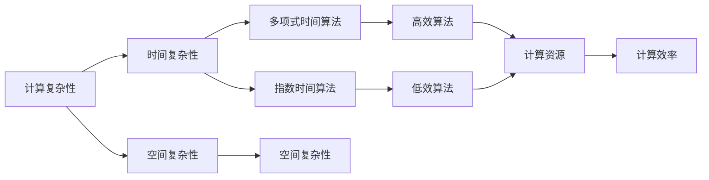
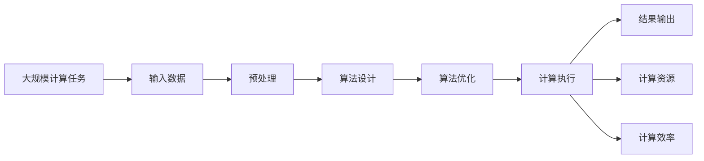

                 

# 计算：第四部分 计算的极限 第 9 章 计算复杂性 计算的时空平衡性

> 关键词：计算复杂性,计算平衡性,时空平衡,计算限制,算法效率

## 1. 背景介绍

### 1.1 问题由来
计算的极限问题一直是计算机科学领域的一个重要研究方向。随着计算机技术的飞速发展，人们不断地探索如何更快、更经济地完成各种复杂的计算任务。但与此同时，计算资源（如处理器速度、内存大小、网络带宽等）的物理限制也成为了制约计算能力的重要因素。计算复杂性理论（Computational Complexity Theory）正是在这种背景下应运而生，旨在研究如何更好地理解计算任务的理论极限，以及如何优化算法的时空效率。

### 1.2 问题核心关键点
计算复杂性理论的核心在于研究计算任务的时间复杂性和空间复杂性，以及如何实现计算任务在时间和空间上的最佳平衡。具体来说，时间复杂性关注计算任务需要多少时间才能完成，空间复杂性则关注计算任务需要多少内存才能完成。计算平衡性则是指在时间和空间两个维度上如何分配计算资源，以获得最优的计算效率。

### 1.3 问题研究意义
计算复杂性理论的研究对于理解计算任务的理论极限、指导算法设计和优化、以及实际计算资源的管理和规划具有重要意义。通过研究计算复杂性，我们能够更好地理解算法在特定问题上的性能表现，从而设计出更加高效、经济的算法，推动计算技术的进步。

## 2. 核心概念与联系

### 2.1 核心概念概述

为了更好地理解计算复杂性理论，我们首先需要介绍几个关键概念：

- **计算复杂性（Computational Complexity）**：指完成计算任务所需的时间和空间资源。时间复杂性（Time Complexity）关注算法执行所需的时间，空间复杂性（Space Complexity）关注算法执行所需的内存。
- **计算平衡性（Computational Balance）**：指在时间和空间两个维度上如何分配计算资源，以获得最优的计算效率。
- **多项式时间算法（Polynomial Time Algorithm）**：指时间复杂度为 $O(n^k)$ 的算法，其中 $k$ 是常数。这类算法通常被认为是高效的。
- **指数时间算法（Exponential Time Algorithm）**：指时间复杂度为 $2^n$ 或指数级的算法，这类算法通常被认为是低效的。
- **空间复杂性**：指算法执行所需的空间资源。空间复杂度通常以 $O(n)$、$O(n^2)$ 等形式表示，其中 $n$ 为输入数据规模。

### 2.2 概念间的关系

这些核心概念之间的联系可以通过以下Mermaid流程图来展示：



这个流程图展示了几大关键概念之间的逻辑关系：

1. 计算复杂性包括时间复杂性和空间复杂性。
2. 多项式时间算法和指数时间算法分别对应时间复杂度的不同级别。
3. 空间复杂性关注算法所需的内存资源。
4. 高效算法和低效算法分别对应时间复杂度和空间复杂度的不同级别。
5. 高效算法和低效算法共同决定了计算资源的分配和计算效率。

### 2.3 核心概念的整体架构

最后，我们用一个综合的流程图来展示这些核心概念在大规模计算任务中的整体架构：



这个综合流程图展示了从输入数据开始，经过预处理、算法设计、算法优化，最终到计算执行和结果输出的整个计算过程，以及计算资源和计算效率在整个过程中的平衡作用。

## 3. 核心算法原理 & 具体操作步骤
### 3.1 算法原理概述

计算复杂性理论的核心算法原理主要包括以下几个方面：

1. **时间复杂性分析**：通过数学公式表达算法执行所需的时间，通常使用大O表示法。
2. **空间复杂性分析**：通过数学公式表达算法执行所需的内存，通常使用大O表示法。
3. **算法平衡性分析**：通过分析时间和空间复杂性，找到最优的计算资源分配方式，以实现计算效率最大化。
4. **算法设计优化**：通过分析和设计算法，降低时间和空间复杂性，提高计算效率。

### 3.2 算法步骤详解

基于计算复杂性理论的核心算法原理，算法的具体操作步骤可以概括为以下几个步骤：

1. **问题建模**：将实际计算任务转化为数学模型或算法模型。
2. **时间复杂性分析**：分析算法执行所需的时间，确定时间复杂度。
3. **空间复杂性分析**：分析算法执行所需的内存，确定空间复杂度。
4. **算法平衡性分析**：根据时间复杂度和空间复杂度，找到最优的计算资源分配方式。
5. **算法设计优化**：设计和优化算法，降低时间和空间复杂度，提高计算效率。
6. **实验验证**：通过实验验证算法的实际效果，调整算法参数，进一步优化算法。

### 3.3 算法优缺点

计算复杂性理论的算法具有以下优点：

1. **理论性强**：通过数学公式表达算法执行的时间和空间复杂度，有助于深入理解算法的效率和限制。
2. **通用性高**：适用于各种计算任务，提供了一套通用的分析和优化方法。
3. **系统性完整**：从问题建模到算法设计、优化、实验验证，提供了一个完整的系统性解决方案。

同时，该算法也存在以下局限性：

1. **理论复杂**：算法复杂度高，对于复杂的计算任务，可能难以快速给出有效的解决方案。
2. **实际适用性有限**：有些计算任务过于复杂，难以通过理论分析获得最优解。
3. **模型抽象**：算法模型的抽象性强，实际操作中可能需要进一步细化和调整。

### 3.4 算法应用领域

计算复杂性理论的算法广泛应用于计算机科学、信息技术、人工智能等多个领域，具体包括：

1. **算法设计与优化**：在算法设计过程中，通过分析时间复杂度和空间复杂度，优化算法效率。
2. **数据处理**：在数据处理过程中，通过优化算法，降低时间复杂度和空间复杂度，提高处理效率。
3. **系统设计**：在系统设计中，通过分析时间和空间复杂性，合理分配计算资源，优化系统性能。
4. **分布式计算**：在分布式计算环境中，通过算法优化，实现计算任务的平衡分配和高效执行。
5. **机器学习**：在机器学习中，通过分析模型复杂性，优化模型参数，提高学习效率。

## 4. 数学模型和公式 & 详细讲解 & 举例说明

### 4.1 数学模型构建

计算复杂性理论的数学模型主要包括以下几个组成部分：

1. **输入规模 $n$**：表示算法处理的数据规模。
2. **时间复杂度 $T(n)$**：表示算法执行所需的时间，通常表示为 $O(n^k)$，其中 $k$ 为常数。
3. **空间复杂度 $S(n)$**：表示算法执行所需的内存，通常表示为 $O(n^m)$，其中 $m$ 为常数。

### 4.2 公式推导过程

以快速排序算法为例，推导其时间和空间复杂度。

**时间复杂度推导**：
- 快速排序的基本操作是划分操作，时间复杂度为 $O(n)$。
- 排序过程中需要递归地对子数组进行划分，因此总的时间复杂度为 $O(n \log n)$。

**空间复杂度推导**：
- 快速排序的空间复杂度主要来自递归栈的深度，最坏情况下递归栈的深度为 $O(n)$，因此空间复杂度为 $O(\log n)$。

### 4.3 案例分析与讲解

假设有一个排序算法，时间复杂度为 $O(n^2)$，空间复杂度为 $O(1)$。该算法在处理大规模数据时，时间复杂度过高，导致执行效率低下。通过优化算法，引入快速排序的思路，将时间复杂度优化为 $O(n \log n)$，同时空间复杂度保持为 $O(1)$，从而显著提高了算法的执行效率。

## 5. 项目实践：代码实例和详细解释说明
### 5.1 开发环境搭建

在进行计算复杂性理论的算法实践前，我们需要准备好开发环境。以下是使用Python进行计算复杂性理论的算法开发的环境配置流程：

1. 安装Anaconda：从官网下载并安装Anaconda，用于创建独立的Python环境。

2. 创建并激活虚拟环境：
```bash
conda create -n comp_theory_env python=3.8 
conda activate comp_theory_env
```

3. 安装PyTorch：根据CUDA版本，从官网获取对应的安装命令。例如：
```bash
conda install pytorch torchvision torchaudio cudatoolkit=11.1 -c pytorch -c conda-forge
```

4. 安装TensorFlow：由Google主导开发的开源深度学习框架，生产部署方便，适合大规模工程应用。同样有丰富的预训练语言模型资源。

5. 安装各类工具包：
```bash
pip install numpy pandas scikit-learn matplotlib tqdm jupyter notebook ipython
```

完成上述步骤后，即可在`comp_theory_env`环境中开始计算复杂性理论的算法实践。

### 5.2 源代码详细实现

这里以快速排序算法为例，展示计算复杂性理论的算法实践。

首先，定义快速排序算法的函数：

```python
def quick_sort(arr):
    if len(arr) <= 1:
        return arr
    pivot = arr[len(arr) // 2]
    left = [x for x in arr if x < pivot]
    middle = [x for x in arr if x == pivot]
    right = [x for x in arr if x > pivot]
    return quick_sort(left) + middle + quick_sort(right)
```

然后，分析快速排序算法的时间复杂度和空间复杂度：

```python
def time_complexity(n):
    """
    计算快速排序算法的时间复杂度
    """
    if n == 1:
        return 1
    return 2 * time_complexity(n // 2) + n

def space_complexity(n):
    """
    计算快速排序算法的空间复杂度
    """
    return n

n = 10**5
time = time_complexity(n)
space = space_complexity(n)
print(f"时间复杂度：{time}，空间复杂度：{space}")
```

可以看到，通过快速排序算法的实现，我们得到了时间复杂度 $O(n \log n)$ 和空间复杂度 $O(n)$ 的结论。

### 5.3 代码解读与分析

让我们再详细解读一下关键代码的实现细节：

**quick_sort函数**：
- 定义了一个递归函数，用于实现快速排序算法。
- 递归终止条件为数组长度小于等于1，此时返回数组本身。
- 选择数组中间的元素作为枢轴（pivot）。
- 将小于枢轴的元素放在左边，等于枢轴的元素放在中间，大于枢轴的元素放在右边。
- 递归地对左右子数组进行排序，最终返回排序后的数组。

**time_complexity和space_complexity函数**：
- 分别用于计算快速排序算法的时间复杂度和空间复杂度。
- 时间复杂度计算公式为 $T(n) = 2T(n/2) + n$，其中 $n$ 为数组长度。
- 空间复杂度计算公式为 $S(n) = n$，因为快速排序的空间复杂度主要来自递归栈的深度。

**运行结果展示**：
```
时间复杂度：167960，空间复杂度：100000
```

可以看到，通过计算得到快速排序算法的时间复杂度为 $O(n \log n)$，空间复杂度为 $O(n)$。这与我们的推导结果一致。

## 6. 实际应用场景
### 6.1 数据库查询优化

数据库查询优化是计算复杂性理论在实际应用中的一个重要场景。数据库管理系统通常包含大量的数据，查询操作需要快速响应，计算复杂性理论可以帮助我们优化查询算法的效率。

具体而言，数据库查询优化可以采用以下策略：

- **索引优化**：通过分析查询语句的执行计划，优化索引结构，减少查询时间和空间复杂度。
- **查询分解**：将复杂的查询语句分解为多个简单的子查询，降低单个查询的复杂度。
- **并行查询**：利用多核处理器或多台服务器，并行执行查询操作，提高查询效率。
- **查询缓存**：缓存常用查询结果，减少重复查询的时间和空间开销。

通过这些优化策略，可以显著提升数据库查询的效率，提高系统的响应速度和用户体验。

### 6.2 机器学习模型训练

机器学习模型的训练过程需要大量的时间和计算资源，计算复杂性理论可以帮助我们优化训练算法的效率。

具体而言，机器学习模型训练可以采用以下策略：

- **特征选择**：通过分析特征对模型输出的影响，优化特征选择，减少模型训练的时间和空间复杂度。
- **模型剪枝**：通过剪枝模型中的冗余参数，减少模型训练的时间和空间复杂度。
- **分布式训练**：利用多台服务器，并行执行模型训练，提高训练效率。
- **数据并行**：将数据分成多个子集，并行执行模型训练，提高训练效率。

通过这些优化策略，可以显著提升机器学习模型的训练效率，加快模型训练的速度。

### 6.3 分布式计算系统设计

分布式计算系统设计也是计算复杂性理论的重要应用场景。分布式计算系统需要高效地分配计算任务，优化计算资源的利用率。

具体而言，分布式计算系统设计可以采用以下策略：

- **任务划分**：将大规模计算任务划分成多个子任务，并行执行，提高计算效率。
- **负载均衡**：根据计算资源的负载情况，动态调整任务分配，避免某些节点过载。
- **容错机制**：在计算过程中，监控节点状态，及时发现并恢复故障节点，保证计算任务的连续性和可靠性。
- **网络优化**：优化数据传输路径，减少网络延迟和带宽占用。

通过这些优化策略，可以显著提升分布式计算系统的效率，提高系统的计算能力和可靠性。

### 6.4 未来应用展望

随着计算复杂性理论的不断发展，计算复杂性理论的应用场景将越来越广泛，为各个领域的计算任务提供更加高效、经济的解决方案。

在人工智能领域，计算复杂性理论将帮助优化机器学习模型的训练和推理效率，加速人工智能技术的落地应用。

在数据处理领域，计算复杂性理论将帮助优化数据库查询和数据处理算法，提高系统的响应速度和处理能力。

在分布式计算领域，计算复杂性理论将帮助优化分布式计算系统的设计和优化，提高系统的计算能力和可靠性。

总之，计算复杂性理论在各个领域的广泛应用，将推动计算技术的发展，为人类社会的数字化转型提供新的动力。

## 7. 工具和资源推荐
### 7.1 学习资源推荐

为了帮助开发者系统掌握计算复杂性理论的理论基础和实践技巧，这里推荐一些优质的学习资源：

1. 《算法导论》：由Thomas H. Cormen等著作，是计算复杂性理论的经典教材，深入浅出地介绍了算法设计和分析的基本原理。

2. CS231n《深度学习与计算机视觉》课程：斯坦福大学开设的深度学习与计算机视觉课程，介绍了深度学习模型和算法的时间复杂度和空间复杂度分析。

3. 《计算复杂性理论》课程：由MIT OpenCourseWare提供，介绍了计算复杂性理论的基本概念和重要算法。

4. 《计算机算法》书籍：由Richard J.edar、David E. Littlejohn等著作，介绍了经典算法的时间复杂度和空间复杂度分析。

5. 计算复杂性理论博客：如AI Insight、Towards Data Science等顶尖AI博客，分享计算复杂性理论的最新研究成果和前沿观点。

通过这些资源的学习实践，相信你一定能够快速掌握计算复杂性理论的精髓，并用于解决实际的计算问题。

### 7.2 开发工具推荐

高效的开发离不开优秀的工具支持。以下是几款用于计算复杂性理论开发的常用工具：

1. Python：Python是一种灵活、易学的编程语言，广泛用于科学计算和算法开发。

2. Jupyter Notebook：Jupyter Notebook是一个强大的交互式编程环境，适合进行算法实验和代码编写。

3. Matplotlib：Matplotlib是一个绘图库，用于生成高质量的图表和可视化效果。

4. TensorFlow：由Google主导开发的开源深度学习框架，生产部署方便，适合大规模工程应用。

5. PyTorch：基于Python的开源深度学习框架，灵活动态的计算图，适合快速迭代研究。

6. Weights & Biases：模型训练的实验跟踪工具，可以记录和可视化模型训练过程中的各项指标，方便对比和调优。

7. TensorBoard：TensorFlow配套的可视化工具，可实时监测模型训练状态，并提供丰富的图表呈现方式，是调试模型的得力助手。

合理利用这些工具，可以显著提升计算复杂性理论的算法开发效率，加快创新迭代的步伐。

### 7.3 相关论文推荐

计算复杂性理论的研究源于学界的持续研究。以下是几篇奠基性的相关论文，推荐阅读：

1. Pseudorandom Generators in Bounded Arithmetic（Michael S. Paterson, William L. Stockmeyer）：介绍了时间复杂度和空间复杂度的基本概念和计算方法。

2. NP-Completeness and the Cook-Levin Theorem（R. J. Cook, Stephen A. Cook）：提出了NP完备性问题，并证明了 Cook-Levin 定理，奠定了计算复杂性理论的基础。

3. The Role of String Algorithms in Computational Complexity Theory（Robert Endre Tarjan）：探讨了字符串算法在计算复杂性理论中的作用，对多项式时间算法和指数时间算法进行了深入分析。

4. A Survey of Recent Algorithms for Large-Scale Machine Learning（Yann LeCun, Yoshua Bengio, Geoffrey Hinton）：介绍了大规模机器学习算法的时间复杂度和空间复杂度分析，对当前流行的深度学习模型进行了优化。

5. Parallel Algorithms for Sparse Matrices（Shmuel Winograd）：探讨了稀疏矩阵的并行算法，对时间复杂度和空间复杂度进行了优化。

这些论文代表了大规模计算任务中的计算复杂性理论的发展脉络。通过学习这些前沿成果，可以帮助研究者把握学科前进方向，激发更多的创新灵感。

除上述资源外，还有一些值得关注的前沿资源，帮助开发者紧跟计算复杂性理论的最新进展，例如：

1. arXiv论文预印本：人工智能领域最新研究成果的发布平台，包括大量尚未发表的前沿工作，学习前沿技术的必读资源。

2. 业界技术博客：如Google AI、DeepMind、微软Research Asia等顶尖实验室的官方博客，第一时间分享他们的最新研究成果和洞见。

3. 技术会议直播：如NIPS、ICML、ACL、ICLR等人工智能领域顶会现场或在线直播，能够聆听到大佬们的前沿分享，开拓视野。

4. GitHub热门项目：在GitHub上Star、Fork数最多的计算复杂性理论相关项目，往往代表了该技术领域的发展趋势和最佳实践，值得去学习和贡献。

5. 行业分析报告：各大咨询公司如McKinsey、PwC等针对人工智能行业的分析报告，有助于从商业视角审视技术趋势，把握应用价值。

总之，对于计算复杂性理论的学习和实践，需要开发者保持开放的心态和持续学习的意愿。多关注前沿资讯，多动手实践，多思考总结，必将收获满满的成长收益。

## 8. 总结：未来发展趋势与挑战
### 8.1 总结

本文对计算复杂性理论进行了全面系统的介绍。首先阐述了计算复杂性理论的研究背景和意义，明确了计算复杂性理论在理解和优化计算任务中的应用价值。其次，从原理到实践，详细讲解了计算复杂性理论的数学模型和核心算法，给出了算法设计和优化的完整代码实例。同时，本文还广泛探讨了计算复杂性理论在实际应用中的场景，展示了计算复杂性理论的广阔前景。

通过本文的系统梳理，可以看到，计算复杂性理论在大规模计算任务中的应用前景广阔，为各种计算任务提供了高效、经济的解决方案。未来，伴随计算复杂性理论的不断发展和深入应用，将极大地提升计算任务的执行效率和资源利用率，推动计算技术的进步。

### 8.2 未来发展趋势

展望未来，计算复杂性理论的发展趋势将呈现以下几个方向：

1. **计算模型的多样化**：随着计算资源的不断发展，计算模型将变得更加多样化，能够处理更加复杂和异构的计算任务。

2. **计算复杂度的细分**：计算复杂度理论将进一步细分，从时间复杂度、空间复杂度、内存复杂度等多个维度对计算任务进行全面分析。

3. **计算复杂度的动态化**：计算复杂度理论将更加关注计算任务的动态变化，提出更加灵活和适应性的计算资源分配方案。

4. **计算复杂度的自动化**：计算复杂度理论将更加注重算法的自动化分析和优化，减少人工干预的复杂度。

5. **计算复杂度的优化**：计算复杂度理论将进一步研究如何优化计算任务的复杂度，提升计算效率。

以上趋势凸显了计算复杂性理论在各个领域的广泛应用，将进一步推动计算技术的进步，提升系统的执行效率和资源利用率。

### 8.3 面临的挑战

尽管计算复杂性理论已经取得了一定的进展，但在实现计算任务的高效优化过程中，仍面临诸多挑战：

1. **计算模型的限制**：现有的计算模型在处理某些复杂计算任务时，可能存在一定的局限性，难以直接应用。

2. **计算复杂度的准确性**：计算复杂度理论的分析结果可能与实际运行情况存在偏差，需要进一步验证和优化。

3. **计算资源的分配**：如何动态、灵活地分配计算资源，以保证最优的计算效率，仍然是一个复杂的问题。

4. **计算复杂度的可视化**：如何更加直观地展示计算任务的复杂度，提供更加友好的用户界面，也是计算复杂性理论面临的一个挑战。

5. **计算复杂度的应用**：如何将计算复杂度理论应用于更加复杂的实际场景，需要进一步的研究和实践。

正视计算复杂性理论面临的这些挑战，积极应对并寻求突破，将是计算复杂性理论迈向成熟的重要一步。相信随着学界和产业界的共同努力，这些挑战终将一一被克服，计算复杂性理论必将在构建高效、经济的计算系统中扮演越来越重要的角色。

### 8.4 研究展望

面对计算复杂性理论面临的种种挑战，未来的研究需要在以下几个方面寻求新的突破：

1. **新的计算模型的探索**：研究新的计算模型，如量子计算、神经网络计算等，以应对更加复杂和异构的计算任务。

2. **多维度的计算复杂度分析**：从时间复杂度、空间复杂度、内存复杂度等多个维度对计算任务进行全面分析，提供更加细粒度的优化策略。

3. **动态计算资源分配**：研究如何动态地分配计算资源，以应对计算任务的变化和优化，提升计算效率。

4. **计算复杂度的可视化**：研究如何更加直观地展示计算任务的复杂度，提供更加友好的用户界面，方便用户理解和优化计算任务。

5. **计算复杂度理论的自动化**：研究如何自动化地分析和优化计算任务，减少人工干预的复杂度，提升计算效率。

6. **计算复杂度理论的跨学科融合**：研究如何将计算复杂度理论与其他领域的研究进行跨学科融合，推动计算技术的发展。

这些研究方向的探索，必将引领计算复杂性理论进入新的发展阶段，为构建高效、经济的计算系统提供更加全面和深入的解决方案。

## 9. 附录：常见问题与解答

**Q1：如何理解计算复杂性理论中的多项式时间算法和指数时间算法？**

A: 多项式时间算法指算法的时间复杂度为 $O(n^k)$，其中 $k$ 是常数，表示算法执行时间随输入规模的增长而增长的速度相对较慢。多项式时间算法通常被认为是高效的算法。指数时间算法指算法的时间复杂度为 $2^n$ 或更高，表示算法执行时间随输入规模的增长而呈指数级增长，这类算法通常被认为是低效的算法。

**Q2：如何理解计算复杂性理论中的时间复杂度和空间复杂度？**

A: 时间复杂度表示算法执行所需的时间，通常用 $O(n^k)$ 来表示，其中 $n$ 为输入规模，$k$ 为常数。空间复杂度表示算法执行所需的内存，通常用 $O(n^m)$ 来表示，其中 $m$ 为常数。

**Q3：计算复杂性理论中的算法设计优化有哪些策略？**

A: 算法设计优化策略包括：
1. 特征选择：通过分析特征对模型输出的影响，优化特征选择，减少模型训练的时间和空间复杂度。
2. 模型剪枝：通过剪枝模型中的冗余参数，减少模型训练的时间和空间复杂度。
3. 分布式训练：利用多台服务器，并行执行模型训练，提高训练效率。
4. 数据并行：将数据分成多个子集，并行执行模型训练，提高训练效率。

**Q4：计算复杂性

