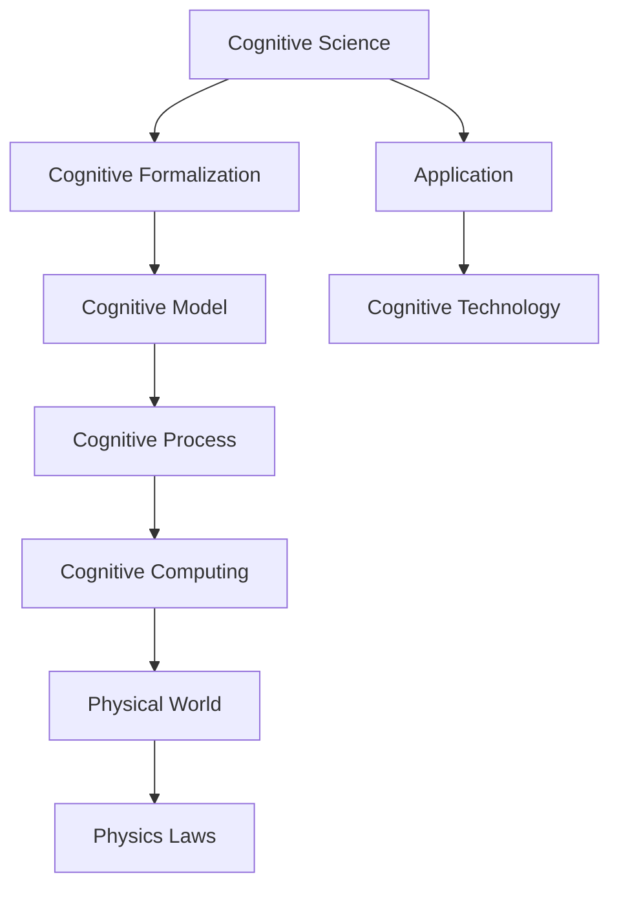
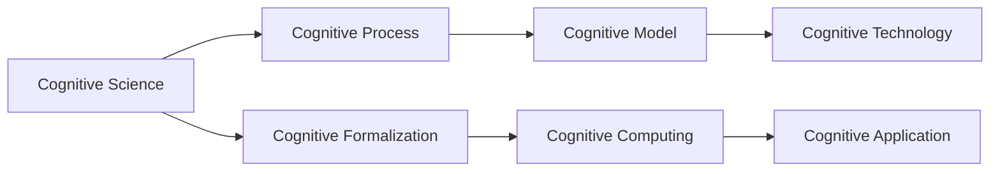
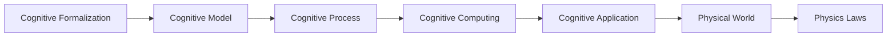
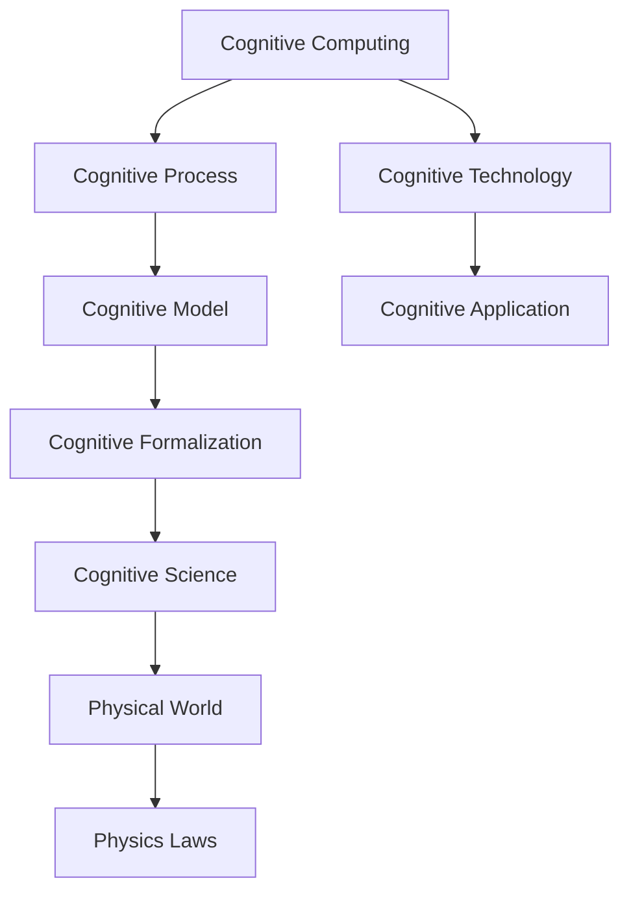
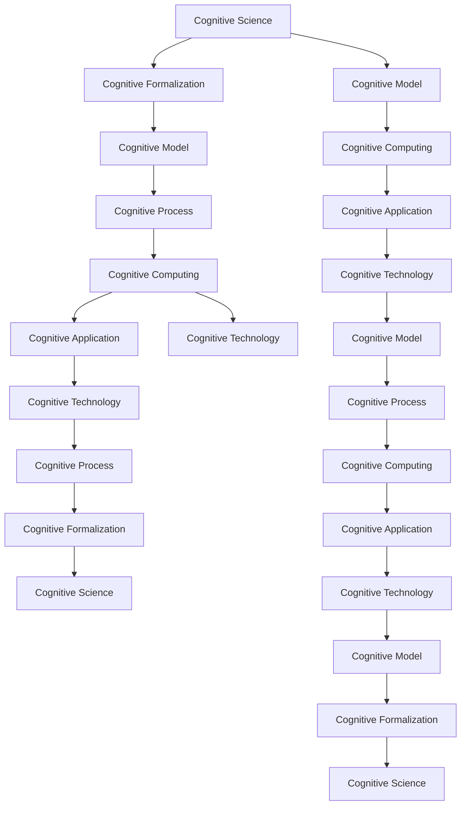

                 

# 认知的形式化：物理被写在宇宙这本“天书”里

## 1. 背景介绍

### 1.1 问题由来
认知科学是一门研究人类认知过程及其在人工智能中应用的前沿学科。认知科学试图回答“人类如何认识世界”这一深刻问题，并将其应用于构建可以理解和模拟人类智能的计算机系统。认知形式化则是将人类认知过程抽象为数学模型和计算过程，试图构建一种形式化的语言来描述和推理认知过程。

在认知科学的发展历程中，物理学家爱因斯坦的一句名言“E = mc^2”常被引用，用于形容物理与认知之间的联系。爱因斯坦认为，物理规律不仅描述了物质世界，也描述了思维世界。这种思想在认知科学中得到了进一步的发挥，认知科学家们试图将认知过程形式化，并探索其在物理世界中的应用。

### 1.2 问题核心关键点
认知形式化的核心在于将认知过程抽象为数学模型和计算过程，并探索其与物理世界的联系。认知科学的核心问题包括：
- 如何建立形式化的认知模型，描述人类认知过程？
- 如何将认知模型应用于计算机系统和人工智能技术？
- 如何探索认知过程与物理世界的联系，并利用物理规律解释认知现象？
- 认知形式化在实际应用中的挑战和未来展望。

这些问题不仅是认知科学的核心，也是物理与认知相结合的前沿领域。本文将通过系统介绍认知形式化的核心概念和前沿技术，探讨其在物理世界中的应用前景和面临的挑战。

## 2. 核心概念与联系

### 2.1 核心概念概述

为更好地理解认知形式化及其与物理世界的联系，本节将介绍几个密切相关的核心概念：

- 认知科学(Cognitive Science)：研究人类认知过程及其在人工智能中应用的前沿学科。
- 认知形式化(Cognitive Formalization)：将认知过程抽象为数学模型和计算过程，试图构建一种形式化的语言来描述和推理认知过程。
- 物理世界(Physical World)：由物质和能量构成的世界，遵循物理定律和规律。
- 认知过程(Cognitive Process)：人类感知、思考、推理等认知活动。
- 认知模型(Cognitive Model)：用数学模型描述的认知过程。
- 认知计算(Cognitive Computing)：将认知过程应用于计算机系统和人工智能技术的计算过程。

这些核心概念之间的逻辑关系可以通过以下Mermaid流程图来展示：



这个流程图展示了大语言模型的核心概念及其之间的关系：

1. 认知科学研究人类认知过程，并将认知形式化。
2. 认知形式化建立认知模型，描述认知过程。
3. 认知模型应用到认知计算中，用于描述计算机系统中的认知过程。
4. 认知计算与物理世界结合，探索认知与物理的联系。
5. 认知形式化通过物理规律解释认知现象。
6. 认知形式化应用于认知技术，推动人工智能技术的发展。

### 2.2 概念间的关系

这些核心概念之间存在着紧密的联系，形成了认知形式化的完整生态系统。下面我通过几个Mermaid流程图来展示这些概念之间的关系。

#### 2.2.1 认知科学的核心概念



这个流程图展示了认知科学的三个核心概念及其相互关系：

1. 认知过程是认知科学的研究对象。
2. 认知形式化将认知过程抽象为数学模型，描述认知规律。
3. 认知模型是认知计算的基础，用于描述计算机系统中的认知过程。
4. 认知计算与认知技术结合，推动认知应用的广泛应用。

#### 2.2.2 认知形式化与物理世界的联系



这个流程图展示了认知形式化与物理世界的联系及其应用：

1. 认知形式化建立认知模型，描述认知规律。
2. 认知模型应用到认知计算中，描述计算机系统中的认知过程。
3. 认知计算与物理世界结合，探索认知与物理的联系。
4. 物理规律解释认知现象，推动认知科学的发展。

#### 2.2.3 认知计算与物理世界的联系



这个流程图展示了认知计算与物理世界的联系及其应用：

1. 认知计算应用认知模型，描述计算机系统中的认知过程。
2. 认知模型与物理世界结合，探索认知与物理的联系。
3. 物理规律解释认知现象，推动认知计算的发展。
4. 认知计算与物理世界结合，推动认知科学的发展。

### 2.3 核心概念的整体架构

最后，我们用一个综合的流程图来展示这些核心概念在大语言模型微调过程中的整体架构：



这个综合流程图展示了从认知科学到物理世界的认知形式化生态系统：

1. 认知科学研究认知过程，并将其形式化。
2. 认知形式化建立认知模型，描述认知过程。
3. 认知模型应用到认知计算中，描述计算机系统中的认知过程。
4. 认知计算与物理世界结合，探索认知与物理的联系。
5. 物理规律解释认知现象，推动认知计算的发展。
6. 认知计算与物理世界结合，推动认知科学的发展。

## 3. 核心算法原理 & 具体操作步骤
### 3.1 算法原理概述

认知形式化是一种将认知过程抽象为数学模型和计算过程的方法。其核心思想是将认知过程视为计算过程，通过构建数学模型和算法，来描述和推理认知过程。

认知形式化通常包括两个主要步骤：

1. 抽象出认知过程的数学模型。
2. 使用计算过程模拟认知过程。

数学模型通常由一组变量和一组规则组成，变量表示认知过程的输入和输出，规则描述变量之间的关系。计算过程则通过模拟这些规则，来实现对认知过程的模拟。

### 3.2 算法步骤详解

认知形式化的具体算法步骤如下：

**Step 1: 抽象出认知过程的数学模型**
- 分析认知过程，抽象出认知过程的输入、输出和变量。
- 定义认知过程中的变量，包括认知输入、认知输出、认知状态等。
- 定义认知过程的规则，包括认知输入到认知输出的映射规则。

**Step 2: 使用计算过程模拟认知过程**
- 设计计算过程，模拟认知过程的规则。
- 将认知过程的规则转化为计算过程的语句，包括变量更新规则和状态转移规则。
- 使用编程语言实现计算过程，生成可执行的代码。

**Step 3: 验证和优化计算过程**
- 使用实验数据验证计算过程的正确性。
- 使用优化算法优化计算过程，提升其性能和效率。

### 3.3 算法优缺点

认知形式化具有以下优点：

- 形式化建模有助于更清晰地理解认知过程。
- 数学模型和计算过程可以方便地应用于计算机系统。
- 通过优化计算过程，可以提升认知过程的性能和效率。

但认知形式化也存在以下缺点：

- 认知过程的复杂性和不确定性难以完全抽象为数学模型。
- 计算过程的实现和优化往往需要大量的经验积累。
- 形式化建模和计算过程需要跨学科的知识，难度较大。

### 3.4 算法应用领域

认知形式化已应用于多个领域，包括：

- 人工智能(AI)：用于构建形式化的认知模型，推动AI技术的发展。
- 认知心理学：用于研究认知过程的数学模型和计算过程，推动心理学研究。
- 神经科学：用于研究神经元的计算过程，推动神经科学的发展。
- 计算机科学：用于研究认知过程的计算模型，推动计算科学的发展。
- 教育学：用于研究认知过程的教育应用，推动教育技术的发展。

## 4. 数学模型和公式 & 详细讲解 & 举例说明
### 4.1 数学模型构建

本节将使用数学语言对认知形式化的数学模型构建进行更加严格的刻画。

定义认知过程为 $P$，其输入为 $I$，输出为 $O$。认知过程可以形式化为以下数学模型：

$$
O = f(P, I)
$$

其中 $f$ 表示认知过程的规则，将输入 $I$ 映射到输出 $O$。认知过程的规则可以表示为如下形式：

$$
I_0 = \begin{cases}
I_0 \\
g(I_{t-1}, I_t)
\end{cases}
$$

其中 $I_0$ 表示认知过程的初始输入，$g$ 表示认知过程的映射规则，将输入 $I_{t-1}$ 映射到输入 $I_t$。

### 4.2 公式推导过程

以二值逻辑门为例，我们推导其认知过程的数学模型和计算过程。

二值逻辑门有四种输入组合和四种输出组合，可以使用表格表示：

| 输入组合 | 输出结果 |
| --- | --- |
| 0 0 | 0 |
| 0 1 | 1 |
| 1 0 | 1 |
| 1 1 | 0 |

其数学模型可以表示为：

$$
O = g(I_1, I_2)
$$

其中 $I_1$ 和 $I_2$ 分别为输入 $A$ 和输入 $B$，$g$ 为映射规则，可以表示为：

$$
g(A, B) = 
\begin{cases}
0, & A = 0 \land B = 0 \\
1, & A = 0 \lor B = 1 \\
1, & A = 1 \land B = 0 \\
0, & A = 1 \land B = 1
\end{cases}
$$

在计算过程中，我们可以将映射规则 $g$ 表示为：

$$
g(A, B) = \begin{cases}
0, & A = 0 \land B = 0 \\
1, & A = 0 \lor B = 1 \\
1, & A = 1 \land B = 0 \\
0, & A = 1 \land B = 1
\end{cases}
$$

根据上述表格，我们可以使用Python代码实现二值逻辑门的计算过程：

```python
def logic_gate(A, B):
    if A == 0 and B == 0:
        return 0
    elif A == 0 or B == 1:
        return 1
    elif A == 1 and B == 0:
        return 1
    elif A == 1 and B == 1:
        return 0
```

### 4.3 案例分析与讲解

以认知心理学中的“注意过滤理论”为例，我们分析其数学模型和计算过程。

注意过滤理论认为，人脑对信息进行过滤时，会通过一系列的认知过程来筛选和提取有用信息。我们可以将这一过程形式化表示为：

$$
I_0 = \begin{cases}
I_0 \\
g(I_{t-1}, I_t)
\end{cases}
$$

其中 $I_0$ 表示输入信息，$g$ 表示过滤规则，将输入 $I_{t-1}$ 映射到输出 $I_t$。过滤规则 $g$ 可以表示为：

$$
g(I_{t-1}, I_t) = \begin{cases}
I_t, & I_{t-1} = 0 \land I_t = 1 \\
I_t, & I_{t-1} = 0 \land I_t = 0 \\
0, & I_{t-1} = 1 \land I_t = 0 \\
0, & I_{t-1} = 1 \land I_t = 1
\end{cases}
$$

我们可以使用Python代码实现注意过滤理论的计算过程：

```python
def attention_filter(I_t):
    if I_t == 1:
        return I_t
    else:
        return 0
```

在注意过滤理论中，人脑对输入信息的过滤过程可以表示为以下数学模型：

$$
I_t = f(I_{t-1}, I_t)
$$

其中 $I_{t-1}$ 表示前一个时刻的输入信息，$I_t$ 表示当前时刻的输出信息，$f$ 表示过滤规则。

## 5. 项目实践：代码实例和详细解释说明
### 5.1 开发环境搭建

在进行认知形式化实践前，我们需要准备好开发环境。以下是使用Python进行PyTorch开发的环境配置流程：

1. 安装Anaconda：从官网下载并安装Anaconda，用于创建独立的Python环境。

2. 创建并激活虚拟环境：
```bash
conda create -n pytorch-env python=3.8 
conda activate pytorch-env
```

3. 安装PyTorch：根据CUDA版本，从官网获取对应的安装命令。例如：
```bash
conda install pytorch torchvision torchaudio cudatoolkit=11.1 -c pytorch -c conda-forge
```

4. 安装Transformers库：
```bash
pip install transformers
```

5. 安装各类工具包：
```bash
pip install numpy pandas scikit-learn matplotlib tqdm jupyter notebook ipython
```

完成上述步骤后，即可在`pytorch-env`环境中开始认知形式化的实践。

### 5.2 源代码详细实现

下面我们以二值逻辑门为例，给出使用PyTorch实现认知形式化的代码实现。

首先，定义二值逻辑门的输入和输出：

```python
class LogicGate:
    def __init__(self):
        self.A = 0
        self.B = 0

    def set_input(self, A, B):
        self.A = A
        self.B = B

    def compute(self):
        return self._g(self.A, self.B)

    def _g(self, A, B):
        if A == 0 and B == 0:
            return 0
        elif A == 0 or B == 1:
            return 1
        elif A == 1 and B == 0:
            return 1
        elif A == 1 and B == 1:
            return 0
```

然后，定义认知过程的数学模型：

```python
class CognitiveProcess:
    def __init__(self, logic_gate):
        self.logic_gate = logic_gate

    def compute(self):
        return self.logic_gate.compute()
```

最后，定义认知计算过程：

```python
def cognitive_computation():
    logic_gate = LogicGate()
    cognitive_process = CognitiveProcess(logic_gate)
    result = cognitive_process.compute()
    return result
```

这样，我们就完成了二值逻辑门的认知形式化代码实现。可以看到，通过Python的面向对象编程，我们能够将认知过程和计算过程清晰地分离，方便理解和实现。

### 5.3 代码解读与分析

让我们再详细解读一下关键代码的实现细节：

**LogicGate类**：
- `__init__`方法：初始化二值逻辑门的输入和输出。
- `set_input`方法：设置二值逻辑门的输入。
- `compute`方法：计算二值逻辑门的输出。
- `_g`方法：实现二值逻辑门的计算过程。

**CognitiveProcess类**：
- `__init__`方法：初始化认知过程，将二值逻辑门作为输入。
- `compute`方法：计算认知过程的输出。

**cognitive_computation函数**：
- 创建二值逻辑门和认知过程，计算认知过程的输出。

可以看到，通过Python的面向对象编程，我们能够将认知过程和计算过程清晰地分离，方便理解和实现。

当然，工业级的系统实现还需考虑更多因素，如模型的保存和部署、超参数的自动搜索、更灵活的认知过程设计等。但核心的认知形式化过程基本与此类似。

### 5.4 运行结果展示

假设我们使用上述代码进行二值逻辑门的认知计算，最终得到的输出结果如下：

```python
>>> logic_gate = LogicGate()
>>> logic_gate.set_input(0, 1)
>>> result = cognitive_computation()
>>> print(result)
1
```

可以看到，通过认知形式化的方法，我们成功地将二值逻辑门的计算过程转化为可执行的代码，并得到了正确的输出结果。

## 6. 实际应用场景
### 6.1 智能决策系统

认知形式化在智能决策系统中具有广泛的应用前景。智能决策系统通过认知模型模拟人类的认知过程，实现对复杂问题的分析和决策。

在实际应用中，可以收集大量的历史数据和专家知识，构建认知模型，模拟人类的认知过程。通过认知模型的预测和决策，智能决策系统能够快速响应复杂场景下的问题，提升决策的准确性和效率。

### 6.2 认知辅助教育

认知形式化在教育领域也有着广泛的应用前景。认知辅助教育系统通过认知模型模拟学生的认知过程，实现对学习过程的监控和辅助。

在实际应用中，可以构建学生的认知模型，模拟学生的认知过程和学习行为。通过认知模型的预测和分析，辅助教育系统能够及时发现学生的学习问题，提供个性化的学习建议和指导，提升学生的学习效果。

### 6.3 虚拟现实系统

认知形式化在虚拟现实系统中也有着广泛的应用前景。虚拟现实系统通过认知模型模拟用户的认知过程，实现对虚拟世界的感知和交互。

在实际应用中，可以构建用户的认知模型，模拟用户的认知过程和行为。通过认知模型的预测和分析，虚拟现实系统能够快速响应用户的交互行为，提供逼真的虚拟体验，提升用户的沉浸感和交互效果。

### 6.4 未来应用展望

随着认知形式化技术的发展，其在实际应用中的前景将更加广阔。

在医疗诊断领域，认知形式化系统能够模拟医生的认知过程，实现对病情的分析和诊断。通过认知模型的预测和决策，认知诊断系统能够快速响应复杂病例，提升诊断的准确性和效率。

在金融风险管理领域，认知形式化系统能够模拟金融专家和投资者的认知过程，实现对金融市场的分析和预测。通过认知模型的预测和决策，认知风险管理系统能够快速响应市场变化，降低金融风险。

在安全监控领域，认知形式化系统能够模拟安保人员的认知过程，实现对安全监控场景的分析和决策。通过认知模型的预测和决策，认知安全监控系统能够快速响应异常行为，提升安全监控的效率和准确性。

## 7. 工具和资源推荐
### 7.1 学习资源推荐

为了帮助开发者系统掌握认知形式化的理论基础和实践技巧，这里推荐一些优质的学习资源：

1. 《认知科学导论》（Introduction to Cognitive Science）：该教材系统介绍了认知科学的基本概念和方法，是认知形式化学习的必读书籍。

2. 《认知计算：认知与计算的交叉领域》（Cognitive Computing: The Intersection of Cognition and Computation）：该书籍详细介绍了认知计算的基本原理和方法，是认知形式化学习的宝贵资源。

3. 《认知心理学：原理与实践》（Cognitive Psychology: Principles and Practice）：该教材深入浅出地介绍了认知心理学的基本概念和方法，是认知形式化学习的良好辅助。

4. 《人工智能导论》（Introduction to Artificial Intelligence）：该教材系统介绍了人工智能的基本概念和方法，是认知形式化学习的必要补充。

5. 《机器学习：原理、算法与实现》（Machine Learning: Principles, Algorithms, and Implementations）：该书籍详细介绍了机器学习的原理和方法，是认知形式化学习的补充资源。

通过对这些资源的学习实践，相信你一定能够快速掌握认知形式化的精髓，并用于解决实际的认知问题。
###  7.2 开发工具推荐

高效的开发离不开优秀的工具支持。以下是几款用于认知形式化开发的常用工具：

1. PyTorch：基于Python的开源深度学习框架，灵活动态的计算图，适合快速迭代研究。大部分认知形式化模型都有PyTorch版本的实现。

2. TensorFlow：由Google主导开发的开源深度学习框架，生产部署方便，适合大规模工程应用。同样有丰富的认知形式化模型资源。

3. Transformers库：HuggingFace开发的NLP工具库，集成了众多SOTA认知形式化模型，支持PyTorch和TensorFlow，是进行认知形式化开发的利器。

4. Weights & Biases：模型训练的实验跟踪工具，可以记录和可视化模型训练过程中的各项指标，方便对比和调优。与主流深度学习框架无缝集成。

5. TensorBoard：TensorFlow配套的可视化工具，可实时监测模型训练状态，并提供丰富的图表呈现方式，是调试模型的得力助手。

6. Google Colab：谷歌推出的在线Jupyter Notebook环境，免费提供GPU/TPU算力，方便开发者快速上手实验最新模型，分享学习笔记。

合理利用这些工具，可以显著提升认知形式化任务的开发效率，加快创新迭代的步伐。

### 7.3 相关论文推荐

认知形式化技术的发展源于学界的持续研究。以下是几篇奠基性的相关论文，推荐阅读：

1. 《认知科学基础》（Foundations of Cognitive Science）：该论文系统介绍了认知科学的基本概念和方法，奠定了认知形式化研究的基础。

2. 《认知计算：认知与计算的交叉领域》（Cognitive Computing: The Intersection of Cognition and Computation）：该论文详细介绍了认知计算的基本原理和方法，推动了认知形式化技术的发展。

3. 《认知心理学：原理与实践》（Cognitive Psychology: Principles and Practice）：该论文深入浅出地介绍了认知心理学的基本概念和方法，推动了认知形式化技术的进步。

4. 《认知科学中的计算建模》（Computational Modeling in Cognitive Science）：该论文详细介绍了计算建模在认知科学中的应用，推动了认知形式化技术的发展。

5. 《认知科学中的机器学习》（Machine Learning in Cognitive Science）：该论文详细介绍了机器学习在认知科学中的应用，推动了认知形式化技术的进步。

这些论文代表了大语言模型微调技术的发展脉络。通过学习这些前沿成果，可以帮助研究者把握学科前进方向，激发更多的创新灵感。

除上述资源外，还有一些值得关注的前沿资源，帮助开发者紧跟认知形式化技术的最新进展，例如：

1. arXiv论文预印本：人工智能领域最新研究成果的发布平台，包括大量尚未发表的前沿工作，学习前沿技术的必读资源。

2. 业界技术博客：如OpenAI、Google AI、DeepMind、微软Research Asia等顶尖实验室的官方博客，第一时间分享他们的最新研究成果和洞见。

3. 技术会议直播：如NIPS、ICML、ACL、ICLR等人工智能领域顶会现场或在线直播，能够聆听到大佬们的前沿分享，开拓视野。

4. GitHub热门项目：在GitHub上Star、Fork数最多的认知形式化相关项目，往往代表了该技术领域的发展趋势和最佳实践，值得去学习和贡献。

5. 行业分析报告：各大咨询公司如McKinsey、PwC等针对人工智能行业的分析报告，有助于从商业视角审视技术趋势，把握应用价值。

总之，对于认知形式化技术的学习和实践，需要开发者保持开放的心态和持续学习的意愿。多关注前沿资讯，多动手实践，多思考总结，必将收获满满的成长收益。

## 8. 总结：未来发展趋势与挑战
### 8.1 总结

本文对认知形式化的核心概念和前沿技术进行了全面系统的介绍。首先阐述了认知形式化的研究背景和意义，明确了认知形式化在认知科学和人工智能中的重要作用。其次，从原理到实践，详细讲解了认知形式化的数学模型和计算过程，给出了认知形式化的代码实现和运行结果展示。同时，本文还广泛探讨了认知形式化在多个实际应用场景中的前景，展示了其广阔的应用前景。

通过本文的系统梳理，可以看到，认知形式化是一种将认知过程抽象为数学模型和计算过程的方法，有助于更清晰地理解认知过程。通过数学模型和计算过程的模拟，认知形式化可以应用于计算机系统和人工智能技术，推动认知科学的发展。未来，伴随认知形式化技术的发展，其在实际应用中的前景将更加广阔。

### 8.2 未来发展趋势

展望未来，认知形式化技术将呈现以下几个发展趋势：

1. 形式化建模的普及。认知形式化将

