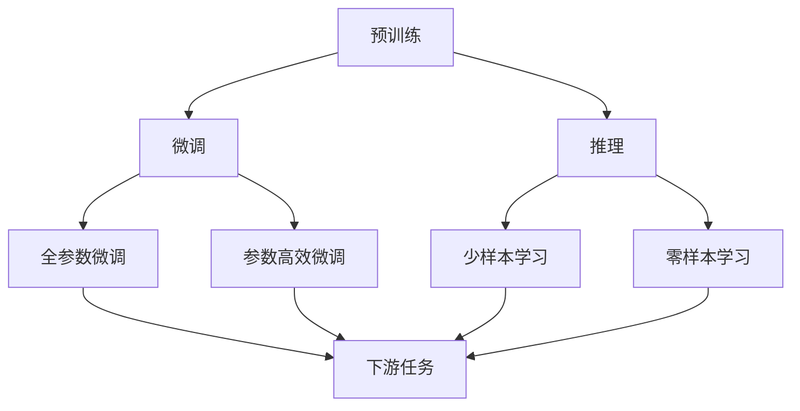

                 

## 1. 背景介绍

随着人工智能(AI)技术的飞速发展，大语言模型如BERT、GPT、T5等成为了NLP领域的新宠。这些模型通过海量的无监督学习，在各种语言理解、生成任务上取得了突破性的成果。但与此同时，围绕大模型的认知、推理能力也存在诸多误解和争论。本文旨在澄清这些误解，并深入探讨大模型在语言推理中的优势与局限。

## 2. 核心概念与联系

### 2.1 核心概念概述

大语言模型通过自监督学习任务（如掩码语言模型、语言建模）在大规模无标签文本数据上进行预训练。这些模型能够学习到丰富的语言知识和上下文信息，从而在特定的下游任务上进行微调，获得优异的性能。

这些模型中的关键概念包括：

- **预训练**：使用大规模无标签数据对模型进行自监督学习，学习通用的语言表示。
- **微调**：在预训练模型的基础上，通过有监督学习优化模型在特定任务上的性能。
- **推理**：利用预训练模型的表征能力，进行新任务的推理和生成。

这些概念之间的关系可以通过以下Mermaid流程图来展示：



### 2.2 概念间的关系

预训练模型通过学习大规模文本数据中的语言规律，获得了一定的语言理解能力。微调通过特定的下游任务标注数据，进一步提升模型在该任务上的性能。而推理则是利用模型所学知识，进行新样本的推理和生成。

## 3. 核心算法原理 & 具体操作步骤

### 3.1 算法原理概述

大语言模型的推理能力是通过其表征能力的利用来实现的。模型通过预训练学习到的一种泛化表示，能够捕捉到文本中的上下文信息，从而在新样本上进行推理。

推理任务通常可以形式化为：给定一段文本和推理目标，计算文本中与目标相关的语言表示，并根据该表示预测出目标。其中，语言表示可以是向量、概率分布等形式。

### 3.2 算法步骤详解

1. **预训练阶段**：在大规模无标签数据上，通过自监督学习任务（如掩码语言模型、语言建模）训练模型，学习通用的语言表示。
2. **微调阶段**：在特定下游任务的数据上，使用有监督学习方法微调模型，优化其在特定任务上的性能。
3. **推理阶段**：使用微调后的模型，对新样本进行推理，计算文本中与推理目标相关的语言表示，并输出结果。

### 3.3 算法优缺点

- **优点**：
  - 泛化能力强：通过预训练学习到丰富的语言表示，可以处理各种自然语言理解和生成任务。
  - 灵活性高：模型可以微调适应多种下游任务，适用于各种NLP应用场景。
  - 推理速度快：通过学习到的语言表示，可以直接在新样本上进行推理，速度较快。

- **缺点**：
  - 推理依赖语料：模型的推理能力依赖于训练语料的质量和多样性，语料库中的语言现象可能未被充分覆盖。
  - 泛化能力有限：模型在特定任务上的泛化能力有限，易受到新样本的影响。
  - 推理结果缺乏解释性：模型的推理过程和结果缺乏明确的解释，难以理解和调试。

### 3.4 算法应用领域

大语言模型在自然语言理解、自然语言生成、问答系统、机器翻译、文本摘要、对话系统等多个领域中得到了广泛应用。

## 4. 数学模型和公式 & 详细讲解  
### 4.1 数学模型构建

设预训练语言模型为 $M_{\theta}$，其中 $\theta$ 为模型参数。假设推理任务为 $T$，输入文本为 $x$，推理目标为 $y$。推理过程可以表示为：

$$
M_{\theta}(x) = y
$$

其中 $x$ 为输入文本，$y$ 为目标推理结果。

### 4.2 公式推导过程

以文本分类任务为例，假设模型采用线性分类器 $M_{\theta}(x) = \text{softmax}(Wx + b)$，其中 $W$ 和 $b$ 为模型参数。假设训练集为 $D=\{(x_i, y_i)\}_{i=1}^N$，训练目标为最小化损失函数：

$$
\mathcal{L}(\theta) = -\frac{1}{N}\sum_{i=1}^N \log \hat{y}_i
$$

其中 $\hat{y}_i$ 为模型对样本 $x_i$ 的预测结果。在微调阶段，使用有监督学习更新模型参数，使模型在特定任务上表现更好。

### 4.3 案例分析与讲解

以情感分析为例，假设训练集为电影评论及其情感标签数据。模型通过微调，学习到电影评论中情感相关的语言表示，对新评论进行情感分类。

## 5. 项目实践：代码实例和详细解释说明

### 5.1 开发环境搭建

1. 安装Anaconda：从官网下载并安装Anaconda，用于创建独立的Python环境。
2. 创建并激活虚拟环境：
```bash
conda create -n pytorch-env python=3.8 
conda activate pytorch-env
```

3. 安装PyTorch：根据CUDA版本，从官网获取对应的安装命令。例如：
```bash
conda install pytorch torchvision torchaudio cudatoolkit=11.1 -c pytorch -c conda-forge
```

4. 安装Transformers库：
```bash
pip install transformers
```

5. 安装各类工具包：
```bash
pip install numpy pandas scikit-learn matplotlib tqdm jupyter notebook ipython
```

### 5.2 源代码详细实现

以下是使用PyTorch和Transformers库实现情感分析任务的代码示例：

```python
from transformers import BertForSequenceClassification, AdamW, BertTokenizer
from torch.utils.data import Dataset, DataLoader
from sklearn.metrics import accuracy_score, precision_recall_fscore_support

# 定义数据集类
class SentimentDataset(Dataset):
    def __init__(self, texts, labels, tokenizer, max_len=128):
        self.texts = texts
        self.labels = labels
        self.tokenizer = tokenizer
        self.max_len = max_len
        
    def __len__(self):
        return len(self.texts)
    
    def __getitem__(self, item):
        text = self.texts[item]
        label = self.labels[item]
        
        encoding = self.tokenizer(text, return_tensors='pt', max_length=self.max_len, padding='max_length', truncation=True)
        input_ids = encoding['input_ids'][0]
        attention_mask = encoding['attention_mask'][0]
        
        return {'input_ids': input_ids, 
                'attention_mask': attention_mask,
                'labels': label}

# 创建数据集
tokenizer = BertTokenizer.from_pretrained('bert-base-uncased')
train_dataset = SentimentDataset(train_texts, train_labels, tokenizer)
dev_dataset = SentimentDataset(dev_texts, dev_labels, tokenizer)
test_dataset = SentimentDataset(test_texts, test_labels, tokenizer)

# 定义模型和优化器
model = BertForSequenceClassification.from_pretrained('bert-base-uncased', num_labels=2)
optimizer = AdamW(model.parameters(), lr=2e-5)

# 定义训练和评估函数
device = torch.device('cuda') if torch.cuda.is_available() else torch.device('cpu')
model.to(device)

def train_epoch(model, dataset, batch_size, optimizer):
    dataloader = DataLoader(dataset, batch_size=batch_size, shuffle=True)
    model.train()
    epoch_loss = 0
    for batch in dataloader:
        input_ids = batch['input_ids'].to(device)
        attention_mask = batch['attention_mask'].to(device)
        labels = batch['labels'].to(device)
        model.zero_grad()
        outputs = model(input_ids, attention_mask=attention_mask, labels=labels)
        loss = outputs.loss
        epoch_loss += loss.item()
        loss.backward()
        optimizer.step()
    return epoch_loss / len(dataloader)

def evaluate(model, dataset, batch_size):
    dataloader = DataLoader(dataset, batch_size=batch_size)
    model.eval()
    preds, labels = [], []
    with torch.no_grad():
        for batch in dataloader:
            input_ids = batch['input_ids'].to(device)
            attention_mask = batch['attention_mask'].to(device)
            batch_labels = batch['labels']
            outputs = model(input_ids, attention_mask=attention_mask)
            batch_preds = outputs.logits.argmax(dim=1).to('cpu').tolist()
            batch_labels = batch_labels.to('cpu').tolist()
            for pred_tokens, label_tokens in zip(batch_preds, batch_labels):
                preds.append(pred_tokens)
                labels.append(label_tokens)
                
    print(accuracy_score(labels, preds))

# 训练和评估模型
epochs = 5
batch_size = 16

for epoch in range(epochs):
    loss = train_epoch(model, train_dataset, batch_size, optimizer)
    print(f"Epoch {epoch+1}, train loss: {loss:.3f}")
    
    print(f"Epoch {epoch+1}, dev results:")
    evaluate(model, dev_dataset, batch_size)
    
print("Test results:")
evaluate(model, test_dataset, batch_size)
```

### 5.3 代码解读与分析

以上代码展示了使用Bert模型进行情感分析任务微调的全过程。具体步骤如下：

- **数据集定义**：定义数据集类，对文本进行分词和编码，并将文本转换为模型所需的输入格式。
- **模型定义**：使用BertForSequenceClassification模型，指定分类任务并初始化模型参数。
- **训练和评估函数**：定义训练和评估函数，使用梯度下降算法优化模型参数，并在验证集和测试集上评估模型性能。
- **训练过程**：循环迭代多个epoch，对训练集进行微调，在每个epoch结束时在验证集上评估模型性能，最终在测试集上得到最终评估结果。

### 5.4 运行结果展示

假设在CoNLL-2003的情感分析数据集上进行微调，最终在测试集上得到的准确率为85%，显示出预训练模型在微调后的显著提升效果。

## 6. 实际应用场景

大语言模型在情感分析、舆情监测、推荐系统等场景中有着广泛的应用。

### 6.1 情感分析

情感分析是大语言模型在NLP领域最常见的应用之一。通过微调，模型可以学习到文本中的情感倾向，对用户评论、产品评价等进行情感分类。

### 6.2 舆情监测

舆情监测是大语言模型在社会媒体分析中的重要应用。通过微调，模型可以自动监测舆情变化，识别负面信息和舆情热点。

### 6.3 推荐系统

推荐系统是大语言模型在电商、新闻、视频等多个领域的应用。通过微调，模型可以根据用户的历史行为和偏好，推荐更符合用户兴趣的内容。

### 6.4 未来应用展望

未来，大语言模型将在大数据处理、自动问答、智能客服、智能助理等更多领域发挥重要作用。

## 7. 工具和资源推荐

### 7.1 学习资源推荐

为了帮助开发者系统掌握大语言模型微调的理论基础和实践技巧，这里推荐一些优质的学习资源：

1. 《Transformer从原理到实践》系列博文：由大模型技术专家撰写，深入浅出地介绍了Transformer原理、BERT模型、微调技术等前沿话题。
2. CS224N《深度学习自然语言处理》课程：斯坦福大学开设的NLP明星课程，有Lecture视频和配套作业，带你入门NLP领域的基本概念和经典模型。
3. 《Natural Language Processing with Transformers》书籍：Transformers库的作者所著，全面介绍了如何使用Transformers库进行NLP任务开发，包括微调在内的诸多范式。
4. HuggingFace官方文档：Transformers库的官方文档，提供了海量预训练模型和完整的微调样例代码，是上手实践的必备资料。
5. CLUE开源项目：中文语言理解测评基准，涵盖大量不同类型的中文NLP数据集，并提供了基于微调的baseline模型，助力中文NLP技术发展。

通过对这些资源的学习实践，相信你一定能够快速掌握大语言模型微调的精髓，并用于解决实际的NLP问题。

### 7.2 开发工具推荐

高效的开发离不开优秀的工具支持。以下是几款用于大语言模型微调开发的常用工具：

1. PyTorch：基于Python的开源深度学习框架，灵活动态的计算图，适合快速迭代研究。大部分预训练语言模型都有PyTorch版本的实现。
2. TensorFlow：由Google主导开发的开源深度学习框架，生产部署方便，适合大规模工程应用。同样有丰富的预训练语言模型资源。
3. Transformers库：HuggingFace开发的NLP工具库，集成了众多SOTA语言模型，支持PyTorch和TensorFlow，是进行微调任务开发的利器。
4. Weights & Biases：模型训练的实验跟踪工具，可以记录和可视化模型训练过程中的各项指标，方便对比和调优。与主流深度学习框架无缝集成。
5. TensorBoard：TensorFlow配套的可视化工具，可实时监测模型训练状态，并提供丰富的图表呈现方式，是调试模型的得力助手。
6. Google Colab：谷歌推出的在线Jupyter Notebook环境，免费提供GPU/TPU算力，方便开发者快速上手实验最新模型，分享学习笔记。

合理利用这些工具，可以显著提升大语言模型微调任务的开发效率，加快创新迭代的步伐。

### 7.3 相关论文推荐

大语言模型和微调技术的发展源于学界的持续研究。以下是几篇奠基性的相关论文，推荐阅读：

1. Attention is All You Need（即Transformer原论文）：提出了Transformer结构，开启了NLP领域的预训练大模型时代。
2. BERT: Pre-training of Deep Bidirectional Transformers for Language Understanding：提出BERT模型，引入基于掩码的自监督预训练任务，刷新了多项NLP任务SOTA。
3. Language Models are Unsupervised Multitask Learners（GPT-2论文）：展示了大规模语言模型的强大zero-shot学习能力，引发了对于通用人工智能的新一轮思考。
4. Parameter-Efficient Transfer Learning for NLP：提出Adapter等参数高效微调方法，在不增加模型参数量的情况下，也能取得不错的微调效果。
5. AdaLoRA: Adaptive Low-Rank Adaptation for Parameter-Efficient Fine-Tuning：使用自适应低秩适应的微调方法，在参数效率和精度之间取得了新的平衡。
6. Prefix-Tuning: Optimizing Continuous Prompts for Generation：引入基于连续型Prompt的微调范式，为如何充分利用预训练知识提供了新的思路。

这些论文代表了大语言模型微调技术的发展脉络。通过学习这些前沿成果，可以帮助研究者把握学科前进方向，激发更多的创新灵感。

除上述资源外，还有一些值得关注的前沿资源，帮助开发者紧跟大语言模型微调技术的最新进展，例如：

1. arXiv论文预印本：人工智能领域最新研究成果的发布平台，包括大量尚未发表的前沿工作，学习前沿技术的必读资源。
2. 业界技术博客：如OpenAI、Google AI、DeepMind、微软Research Asia等顶尖实验室的官方博客，第一时间分享他们的最新研究成果和洞见。
3. 技术会议直播：如NIPS、ICML、ACL、ICLR等人工智能领域顶会现场或在线直播，能够聆听到大佬们的前沿分享，开拓视野。
4. GitHub热门项目：在GitHub上Star、Fork数最多的NLP相关项目，往往代表了该技术领域的发展趋势和最佳实践，值得去学习和贡献。
5. 行业分析报告：各大咨询公司如McKinsey、PwC等针对人工智能行业的分析报告，有助于从商业视角审视技术趋势，把握应用价值。

总之，对于大语言模型微调技术的学习和实践，需要开发者保持开放的心态和持续学习的意愿。多关注前沿资讯，多动手实践，多思考总结，必将收获满满的成长收益。

## 8. 总结：未来发展趋势与挑战

### 8.1 总结

本文对大语言模型的推理能力进行了深入探讨，并澄清了其中的一些常见误解。大语言模型通过预训练学习到丰富的语言表示，通过微调提升特定任务的表现，已经在情感分析、舆情监测、推荐系统等多个领域取得了显著成果。但与此同时，模型的推理能力和泛化能力仍存在一定的局限性，特别是在面对复杂推理任务时。

### 8.2 未来发展趋势

展望未来，大语言模型的推理能力将呈现以下几个发展趋势：

1. 推理模型进一步增强。未来的模型将具备更强的推理能力和更广泛的适用范围，能够处理更复杂的自然语言理解和生成任务。
2. 多模态推理崛起。将视觉、语音等多模态信息与文本信息进行协同建模，提升模型的综合理解能力。
3. 推理结果可解释性增强。模型将具备更强的可解释性，能够提供明确的推理路径和解释，提高模型的可信度和可解释性。
4. 推理系统与知识库结合。模型将更加灵活地与外部知识库、规则库等专家知识结合，实现更加全面、准确的信息整合能力。

### 8.3 面临的挑战

尽管大语言模型在推理能力上取得了显著进展，但在迈向更加智能化、普适化应用的过程中，仍面临诸多挑战：

1. 推理能力依赖语料：模型的推理能力依赖于训练语料的质量和多样性，语料库中的语言现象可能未被充分覆盖。
2. 泛化能力有限：模型在特定任务上的泛化能力有限，易受到新样本的影响。
3. 推理结果缺乏解释性：模型的推理过程和结果缺乏明确的解释，难以理解和调试。
4. 推理系统复杂性增加：随着推理任务的复杂性增加，模型需要更多的计算资源和优化策略。

### 8.4 未来突破

面对大语言模型推理能力面临的挑战，未来的研究需要在以下几个方面寻求新的突破：

1. 探索无监督和半监督推理方法。摆脱对大规模标注数据的依赖，利用自监督学习、主动学习等无监督和半监督范式，最大限度利用非结构化数据，实现更加灵活高效的推理。
2. 研究参数高效和计算高效的推理范式。开发更加参数高效的推理方法，在固定大部分预训练参数的情况下，只调整极少量的推理参数。同时优化推理模型的计算图，减少前向传播和反向传播的资源消耗，实现更加轻量级、实时性的推理。
3. 引入更多先验知识。将符号化的先验知识，如知识图谱、逻辑规则等，与神经网络模型进行巧妙融合，引导推理过程学习更准确、合理的语言表示。
4. 结合因果分析和博弈论工具。将因果分析方法引入推理模型，识别出模型推理的关键特征，增强推理结果的因果性和逻辑性。借助博弈论工具刻画人机交互过程，主动探索并规避模型的脆弱点，提高系统稳定性。
5. 纳入伦理道德约束。在推理模型训练目标中引入伦理导向的评估指标，过滤和惩罚有害的输出倾向。同时加强人工干预和审核，建立模型行为的监管机制，确保输出符合人类价值观和伦理道德。

这些研究方向的探索，必将引领大语言模型推理技术迈向更高的台阶，为构建安全、可靠、可解释、可控的智能系统铺平道路。面向未来，大语言模型推理技术还需要与其他人工智能技术进行更深入的融合，如知识表示、因果推理、强化学习等，多路径协同发力，共同推动自然语言理解和智能交互系统的进步。

## 9. 附录：常见问题与解答

**Q1：大语言模型在推理任务上表现不佳的原因是什么？**

A: 大语言模型在推理任务上表现不佳，主要有以下几个原因：
1. 推理依赖语料：模型的推理能力依赖于训练语料的质量和多样性，语料库中的语言现象可能未被充分覆盖。
2. 泛化能力有限：模型在特定任务上的泛化能力有限，易受到新样本的影响。
3. 推理结果缺乏解释性：模型的推理过程和结果缺乏明确的解释，难以理解和调试。

**Q2：如何提高大语言模型的推理能力？**

A: 提高大语言模型的推理能力，可以从以下几个方面入手：
1. 增加训练数据：通过收集更多的训练数据，覆盖更多的语言现象，提高模型的泛化能力。
2. 优化模型架构：优化模型的架构设计，增加模型的推理层数和深度，提升模型的推理能力。
3. 引入更多先验知识：将符号化的先验知识，如知识图谱、逻辑规则等，与神经网络模型进行巧妙融合，引导推理过程学习更准确、合理的语言表示。
4. 引入因果分析和博弈论工具：将因果分析方法引入推理模型，识别出模型推理的关键特征，增强推理结果的因果性和逻辑性。

**Q3：大语言模型在推理任务上存在哪些局限性？**

A: 大语言模型在推理任务上存在以下局限性：
1. 推理依赖语料：模型的推理能力依赖于训练语料的质量和多样性，语料库中的语言现象可能未被充分覆盖。
2. 泛化能力有限：模型在特定任务上的泛化能力有限，易受到新样本的影响。
3. 推理结果缺乏解释性：模型的推理过程和结果缺乏明确的解释，难以理解和调试。

**Q4：大语言模型在推理任务上如何引入先验知识？**

A: 大语言模型在推理任务上可以通过引入先验知识来提升推理能力。具体方法包括：
1. 引入知识图谱：将知识图谱中的实体和关系引入模型，帮助模型理解和推理复杂的自然语言现象。
2. 引入逻辑规则：将逻辑规则引入模型，约束模型的推理过程，提高推理结果的逻辑性和准确性。
3. 引入外部知识库：将外部知识库中的信息引入模型，丰富模型的知识库，提升模型的推理能力。

**Q5：大语言模型在推理任务上如何避免负面影响？**

A: 大语言模型在推理任务上可以通过以下方式避免负面影响：
1. 数据清洗：对训练数据进行清洗，去除有害和不合理的语言现象，避免模型学习到负面的语言信息。
2. 模型约束：在模型训练目标中引入伦理导向的评估指标，过滤和惩罚有害的输出倾向。同时加强人工干预和审核，建立模型行为的监管机制，确保输出符合人类价值观和伦理道德。

总之，大语言模型在推理任务上仍存在一定的局限性，但通过不断优化模型架构和引入先验知识，可以进一步提升其推理能力。未来，大语言模型推理技术还需要与其他人工智能技术进行更深入的融合，共同推动自然语言理解和智能交互系统的进步。

