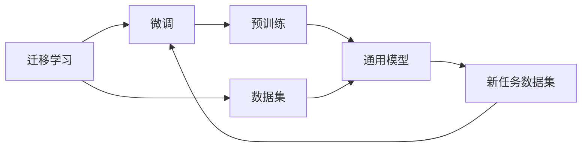
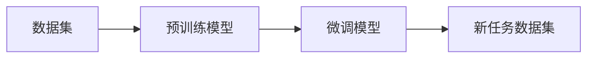
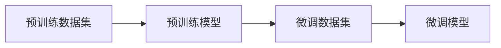
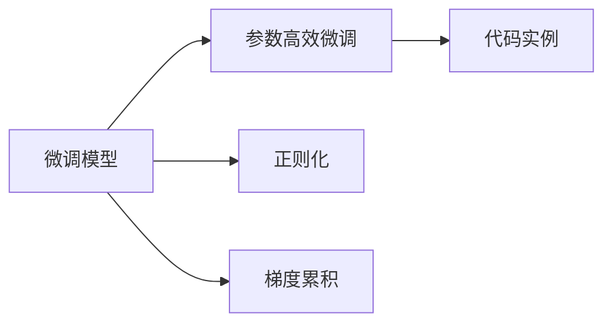
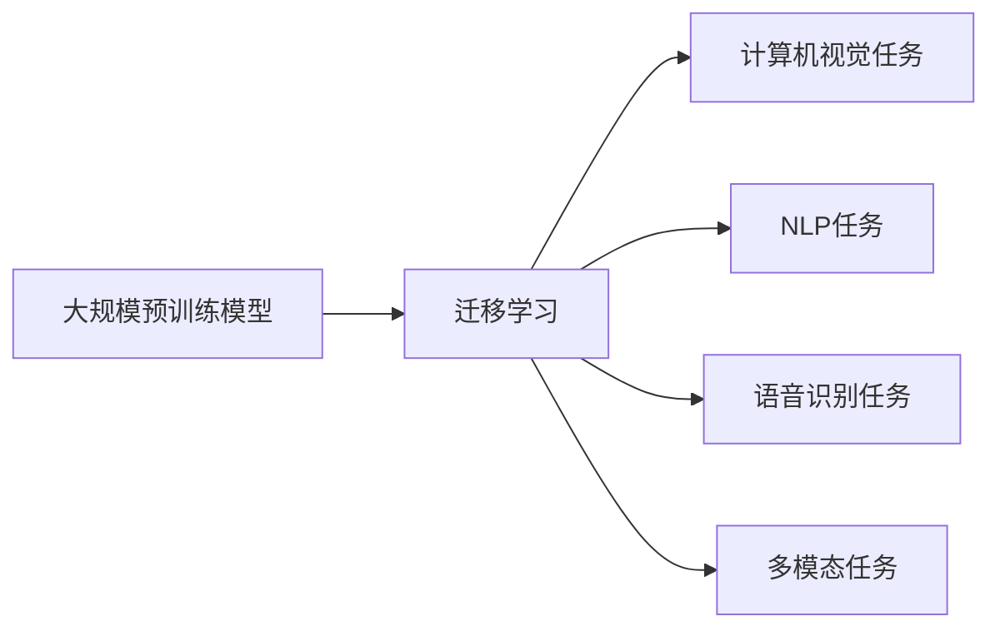
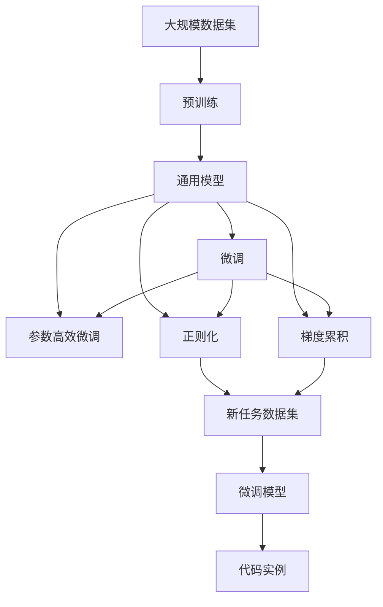

                 

# 迁移学习(Transfer Learning) - 原理与代码实例讲解

> 关键词：迁移学习,微调,Fine-tuning,预训练,Transformer,BERT,深度学习,代码实例

## 1. 背景介绍

### 1.1 问题由来
在深度学习的发展历程中，数据驱动的训练方法是其核心所在。通过大量标注数据进行模型训练，深度神经网络可以学习到丰富的特征表示，从而实现对复杂任务的高效处理。然而，在实际应用中，获取大量标注数据并非易事，特别是在数据稀缺或成本较高的场景下，训练深度模型往往受到制约。

为了缓解这一问题，研究者们提出并不断优化迁移学习(Transfer Learning)的框架。迁移学习通过将在大规模数据上预训练的模型，迁移到其他相关但不同的任务上，可以有效减少标注数据的需要，提升模型在小规模数据上的泛化性能。这一方法在大规模预训练语言模型（如BERT、GPT等）出现后，更是展现出其强大的生命力和广泛的应用前景。

### 1.2 问题核心关键点
迁移学习通过在大规模无标签数据上进行预训练，然后利用预训练模型在新任务上进行微调，从而适应特定任务。其中，预训练和微调是迁移学习的两个核心环节。

- **预训练**：在大规模无标签数据上，通过自监督学习任务训练通用模型。预训练的目的是学习通用的语言知识，如词义、语法、句子结构等。
- **微调**：在预训练模型的基础上，使用特定任务的标注数据，通过有监督学习优化模型，使其适应新任务。

迁移学习的关键在于如何选择合适的预训练模型，以及如何在微调过程中避免过拟合。通常的做法包括选择与新任务相关的预训练模型、冻结预训练权重、选择合适的学习率、使用正则化技术等。

### 1.3 问题研究意义
迁移学习对于拓展深度学习模型的应用范围，提高模型在特定任务上的性能，降低标注数据的需求等方面具有重要意义：

1. **降低标注成本**：迁移学习通过在大规模无标签数据上进行预训练，减少了对标注数据的需求，降低了模型的训练成本。
2. **提升泛化能力**：预训练模型在大规模数据上学习到的通用知识，可以迁移到新任务上，提高模型的泛化性能。
3. **加速模型开发**：迁移学习使得开发者可以快速构建高性能的深度学习模型，减少了从头开始训练的时间和资源投入。
4. **促进技术创新**：迁移学习促进了对深度学习模型的进一步研究和优化，推动了技术进步。
5. **赋能产业升级**：通过迁移学习，深度学习技术更容易被各行各业采用，加速了产业升级的进程。

## 2. 核心概念与联系

### 2.1 核心概念概述

为了更好地理解迁移学习的原理和应用，本节将介绍几个密切相关的核心概念：

- **迁移学习(Transfer Learning)**：将在大规模数据上预训练的模型，迁移到其他相关但不同的任务上，以提升新任务上的性能。
- **微调(Fine-tuning)**：在预训练模型的基础上，使用特定任务的标注数据，通过有监督学习优化模型，使其适应新任务。
- **预训练(Pre-training)**：在大规模无标签数据上，通过自监督学习任务训练通用模型。
- **Transformer**：一种高效的神经网络结构，广泛用于自然语言处理(NLP)和计算机视觉(CV)等领域。
- **BERT(Bidirectional Encoder Representations from Transformers)**：一种基于Transformer架构的预训练语言模型，通过双向掩码语言模型和下一句预测任务进行预训练，学习丰富的语言知识。
- **深度学习(Deep Learning)**：一种基于多层神经网络的机器学习技术，广泛应用于图像、语音、文本等领域的处理和分析。
- **代码实例**：通过具体代码实现，展示迁移学习在实践中的应用方法。

这些核心概念之间的逻辑关系可以通过以下Mermaid流程图来展示：



这个流程图展示了大规模预训练语言模型在迁移学习中的关键流程：首先在大规模数据上进行预训练，然后通过微调适应新任务。

### 2.2 概念间的关系

这些核心概念之间存在着紧密的联系，形成了迁移学习的完整生态系统。下面我们通过几个Mermaid流程图来展示这些概念之间的关系。

#### 2.2.1 迁移学习的基本流程



这个流程图展示了迁移学习的基本流程：先在大规模数据集上进行预训练，得到通用模型，再在新任务数据集上进行微调，得到适应新任务的高性能模型。

#### 2.2.2 预训练和微调的关系



这个流程图展示了预训练和微调的关系：先通过预训练学习通用知识，再在微调中适应特定任务，提升模型性能。

#### 2.2.3 微调模型的改进方法



这个流程图展示了微调模型的改进方法：通过参数高效微调、正则化、梯度累积等方法，进一步优化微调过程，提升模型性能。

#### 2.2.4 迁移学习的应用场景



这个流程图展示了迁移学习的应用场景：广泛应用于计算机视觉、自然语言处理、语音识别、多模态任务等多个领域。

### 2.3 核心概念的整体架构

最后，我们用一个综合的流程图来展示这些核心概念在大规模预训练语言模型迁移学习过程中的整体架构：



这个综合流程图展示了从预训练到微调，再到参数高效微调和正则化的完整过程。

## 3. 核心算法原理 & 具体操作步骤
### 3.1 算法原理概述

迁移学习的基本原理是通过预训练模型在大量无标签数据上学习到的通用特征表示，迁移到新任务上进行微调，从而提升模型在新任务上的性能。其核心思想是利用预训练模型已经学习到的知识，减少在新任务上从头训练的需要，从而在数据稀缺的情况下也能获得高性能的模型。

形式化地，假设预训练模型为 $M_{\theta}$，其中 $\theta$ 为预训练得到的模型参数。给定新任务 $T$ 的标注数据集 $D=\{(x_i, y_i)\}_{i=1}^N$，迁移学习的目标是最小化模型在新任务上的损失，即找到最优参数：

$$
\hat{\theta} = \mathop{\arg\min}_{\theta} \mathcal{L}(M_{\theta}, D)
$$

其中 $\mathcal{L}$ 为针对任务 $T$ 设计的损失函数，用于衡量模型预测输出与真实标签之间的差异。常见的损失函数包括交叉熵损失、均方误差损失等。

### 3.2 算法步骤详解

基于迁移学习的大语言模型微调一般包括以下几个关键步骤：

**Step 1: 准备预训练模型和数据集**
- 选择合适的预训练语言模型 $M_{\theta}$ 作为初始化参数，如 BERT、GPT 等。
- 准备新任务 $T$ 的标注数据集 $D$，划分为训练集、验证集和测试集。一般要求标注数据与预训练数据的分布不要差异过大。

**Step 2: 添加任务适配层**
- 根据任务类型，在预训练模型顶层设计合适的输出层和损失函数。
- 对于分类任务，通常在顶层添加线性分类器和交叉熵损失函数。
- 对于生成任务，通常使用语言模型的解码器输出概率分布，并以负对数似然为损失函数。

**Step 3: 设置迁移学习超参数**
- 选择合适的优化算法及其参数，如 AdamW、SGD 等，设置学习率、批大小、迭代轮数等。
- 设置正则化技术及强度，包括权重衰减、Dropout、Early Stopping等。
- 确定冻结预训练参数的策略，如仅微调顶层，或全部参数都参与微调。

**Step 4: 执行迁移学习**
- 将训练集数据分批次输入模型，前向传播计算损失函数。
- 反向传播计算参数梯度，根据设定的优化算法和学习率更新模型参数。
- 周期性在验证集上评估模型性能，根据性能指标决定是否触发 Early Stopping。
- 重复上述步骤直到满足预设的迭代轮数或 Early Stopping 条件。

**Step 5: 测试和部署**
- 在测试集上评估迁移学习后模型 $M_{\hat{\theta}}$ 的性能，对比迁移学习前后的精度提升。
- 使用迁移学习后的模型对新样本进行推理预测，集成到实际的应用系统中。
- 持续收集新的数据，定期重新迁移学习模型，以适应数据分布的变化。

以上是基于迁移学习的大语言模型微调的一般流程。在实际应用中，还需要针对具体任务的特点，对迁移学习过程的各个环节进行优化设计，如改进训练目标函数，引入更多的正则化技术，搜索最优的超参数组合等，以进一步提升模型性能。

### 3.3 算法优缺点

基于迁移学习的大语言模型微调方法具有以下优点：
1. 减少标注成本。通过在大规模无标签数据上进行预训练，减少了对标注数据的需求，降低了模型的训练成本。
2. 提升泛化能力。预训练模型在大规模数据上学习到的通用知识，可以迁移到新任务上，提高模型的泛化性能。
3. 加速模型开发。迁移学习使得开发者可以快速构建高性能的深度学习模型，减少了从头开始训练的时间和资源投入。
4. 促进技术创新。迁移学习促进了对深度学习模型的进一步研究和优化，推动了技术进步。

同时，该方法也存在一定的局限性：
1. 依赖预训练数据。迁移学习的效果很大程度上取决于预训练数据的规模和质量，获取高质量预训练数据的成本较高。
2. 迁移能力有限。当目标任务与预训练数据的分布差异较大时，迁移学习的性能提升有限。
3. 负面效果传递。预训练模型的固有偏见、有害信息等，可能通过迁移学习传递到新任务上，产生负面影响。
4. 可解释性不足。迁移学习后的模型通常缺乏可解释性，难以对其推理逻辑进行分析和调试。

尽管存在这些局限性，但就目前而言，基于迁移学习的微调方法仍是大语言模型应用的主流范式。未来相关研究的重点在于如何进一步降低迁移学习对预训练数据的依赖，提高模型的少样本学习和跨领域迁移能力，同时兼顾可解释性和伦理安全性等因素。

### 3.4 算法应用领域

基于迁移学习的大语言模型微调方法已经在多个领域得到了广泛的应用，例如：

- 自然语言处理(NLP)：文本分类、命名实体识别、情感分析、机器翻译等。
- 计算机视觉(CV)：图像分类、目标检测、图像生成等。
- 语音识别(Speech Recognition)：语音识别、语音合成、语音翻译等。
- 多模态任务(Multi-modal Tasks)：视觉-文本、视觉-语音、文本-语音等多模态信息的联合建模。

除了这些经典任务外，迁移学习还被创新性地应用到更多场景中，如医疗影像分析、智能交通管理、智慧城市建设等，为各行各业带来了新的变革和机遇。

## 4. 数学模型和公式 & 详细讲解  
### 4.1 数学模型构建

本节将使用数学语言对基于迁移学习的大语言模型微调过程进行更加严格的刻画。

记预训练语言模型为 $M_{\theta}$，其中 $\theta$ 为预训练得到的模型参数。假设迁移学习任务的训练集为 $D=\{(x_i, y_i)\}_{i=1}^N$，其中 $x_i$ 为输入，$y_i$ 为标签。迁移学习的目标是最小化模型在新任务上的损失，即找到最优参数：

$$
\hat{\theta} = \mathop{\arg\min}_{\theta} \mathcal{L}(M_{\theta}, D)
$$

在实践中，我们通常使用基于梯度的优化算法（如SGD、Adam等）来近似求解上述最优化问题。设 $\eta$ 为学习率，$\lambda$ 为正则化系数，则参数的更新公式为：

$$
\theta \leftarrow \theta - \eta \nabla_{\theta}\mathcal{L}(\theta) - \eta\lambda\theta
$$

其中 $\nabla_{\theta}\mathcal{L}(\theta)$ 为损失函数对参数 $\theta$ 的梯度，可通过反向传播算法高效计算。

### 4.2 公式推导过程

以下我们以二分类任务为例，推导交叉熵损失函数及其梯度的计算公式。

假设模型 $M_{\theta}$ 在输入 $x$ 上的输出为 $\hat{y}=M_{\theta}(x) \in [0,1]$，表示样本属于正类的概率。真实标签 $y \in \{0,1\}$。则二分类交叉熵损失函数定义为：

$$
\ell(M_{\theta}(x),y) = -[y\log \hat{y} + (1-y)\log (1-\hat{y})]
$$

将其代入经验风险公式，得：

$$
\mathcal{L}(\theta) = -\frac{1}{N}\sum_{i=1}^N [y_i\log M_{\theta}(x_i)+(1-y_i)\log(1-M_{\theta}(x_i))]
$$

根据链式法则，损失函数对参数 $\theta_k$ 的梯度为：

$$
\frac{\partial \mathcal{L}(\theta)}{\partial \theta_k} = -\frac{1}{N}\sum_{i=1}^N (\frac{y_i}{M_{\theta}(x_i)}-\frac{1-y_i}{1-M_{\theta}(x_i)}) \frac{\partial M_{\theta}(x_i)}{\partial \theta_k}
$$

其中 $\frac{\partial M_{\theta}(x_i)}{\partial \theta_k}$ 可进一步递归展开，利用自动微分技术完成计算。

在得到损失函数的梯度后，即可带入参数更新公式，完成模型的迭代优化。重复上述过程直至收敛，最终得到适应新任务的最优模型参数 $\theta^*$。

## 5. 项目实践：代码实例和详细解释说明
### 5.1 开发环境搭建

在进行迁移学习实践前，我们需要准备好开发环境。以下是使用Python进行PyTorch开发的环境配置流程：

1. 安装Anaconda：从官网下载并安装Anaconda，用于创建独立的Python环境。

2. 创建并激活虚拟环境：
```bash
conda create -n pytorch-env python=3.8 
conda activate pytorch-env
```

3. 安装PyTorch：根据CUDA版本，从官网获取对应的安装命令。例如：
```bash
conda install pytorch torchvision torchaudio cudatoolkit=11.1 -c pytorch -c conda-forge
```

4. 安装Transformers库：
```bash
pip install transformers
```

5. 安装各类工具包：
```bash
pip install numpy pandas scikit-learn matplotlib tqdm jupyter notebook ipython
```

完成上述步骤后，即可在`pytorch-env`环境中开始迁移学习实践。

### 5.2 源代码详细实现

下面我们以命名实体识别(NER)任务为例，给出使用Transformers库对BERT模型进行迁移学习的PyTorch代码实现。

首先，定义NER任务的数据处理函数：

```python
from transformers import BertTokenizer
from torch.utils.data import Dataset
import torch

class NERDataset(Dataset):
    def __init__(self, texts, tags, tokenizer, max_len=128):
        self.texts = texts
        self.tags = tags
        self.tokenizer = tokenizer
        self.max_len = max_len
        
    def __len__(self):
        return len(self.texts)
    
    def __getitem__(self, item):
        text = self.texts[item]
        tags = self.tags[item]
        
        encoding = self.tokenizer(text, return_tensors='pt', max_length=self.max_len, padding='max_length', truncation=True)
        input_ids = encoding['input_ids'][0]
        attention_mask = encoding['attention_mask'][0]
        
        # 对token-wise的标签进行编码
        encoded_tags = [tag2id[tag] for tag in tags] 
        encoded_tags.extend([tag2id['O']] * (self.max_len - len(encoded_tags)))
        labels = torch.tensor(encoded_tags, dtype=torch.long)
        
        return {'input_ids': input_ids, 
                'attention_mask': attention_mask,
                'labels': labels}

# 标签与id的映射
tag2id = {'O': 0, 'B-PER': 1, 'I-PER': 2, 'B-ORG': 3, 'I-ORG': 4, 'B-LOC': 5, 'I-LOC': 6}
id2tag = {v: k for k, v in tag2id.items()}

# 创建dataset
tokenizer = BertTokenizer.from_pretrained('bert-base-cased')

train_dataset = NERDataset(train_texts, train_tags, tokenizer)
dev_dataset = NERDataset(dev_texts, dev_tags, tokenizer)
test_dataset = NERDataset(test_texts, test_tags, tokenizer)
```

然后，定义模型和优化器：

```python
from transformers import BertForTokenClassification, AdamW

model = BertForTokenClassification.from_pretrained('bert-base-cased', num_labels=len(tag2id))

optimizer = AdamW(model.parameters(), lr=2e-5)
```

接着，定义训练和评估函数：

```python
from torch.utils.data import DataLoader
from tqdm import tqdm
from sklearn.metrics import classification_report

device = torch.device('cuda') if torch.cuda.is_available() else torch.device('cpu')
model.to(device)

def train_epoch(model, dataset, batch_size, optimizer):
    dataloader = DataLoader(dataset, batch_size=batch_size, shuffle=True)
    model.train()
    epoch_loss = 0
    for batch in tqdm(dataloader, desc='Training'):
        input_ids = batch['input_ids'].to(device)
        attention_mask = batch['attention_mask'].to(device)
        labels = batch['labels'].to(device)
        model.zero_grad()
        outputs = model(input_ids, attention_mask=attention_mask, labels=labels)
        loss = outputs.loss
        epoch_loss += loss.item()
        loss.backward()
        optimizer.step()
    return epoch_loss / len(dataloader)

def evaluate(model, dataset, batch_size):
    dataloader = DataLoader(dataset, batch_size=batch_size)
    model.eval()
    preds, labels = [], []
    with torch.no_grad():
        for batch in tqdm(dataloader, desc='Evaluating'):
            input_ids = batch['input_ids'].to(device)
            attention_mask = batch['attention_mask'].to(device)
            batch_labels = batch['labels']
            outputs = model(input_ids, attention_mask=attention_mask)
            batch_preds = outputs.logits.argmax(dim=2).to('cpu').tolist()
            batch_labels = batch_labels.to('cpu').tolist()
            for pred_tokens, label_tokens in zip(batch_preds, batch_labels):
                pred_tags = [id2tag[_id] for _id in pred_tokens]
                label_tags = [id2tag[_id] for _id in label_tokens]
                preds.append(pred_tags[:len(label_tags)])
                labels.append(label_tags)
                
    print(classification_report(labels, preds))
```

最后，启动训练流程并在测试集上评估：

```python
epochs = 5
batch_size = 16

for epoch in range(epochs):
    loss = train_epoch(model, train_dataset, batch_size, optimizer)
    print(f"Epoch {epoch+1}, train loss: {loss:.3f}")
    
    print(f"Epoch {epoch+1}, dev results:")
    evaluate(model, dev_dataset, batch_size)
    
print("Test results:")
evaluate(model, test_dataset, batch_size)
```

以上就是使用PyTorch对BERT进行命名实体识别任务迁移学习的完整代码实现。可以看到，得益于Transformers库的强大封装，我们可以用相对简洁的代码完成BERT模型的迁移学习。

### 5.3 代码解读与分析

让我们再详细解读一下关键代码的实现细节：

**NERDataset类**：
- `__init__`方法：初始化文本、标签、分词器等关键组件。
- `__len__`方法：返回数据集的样本数量。
- `__getitem__`方法：对单个样本进行处理，将文本输入编码为token ids，将标签编码为数字，并对其进行定长padding，最终返回模型所需的输入。

**tag2id和id2tag字典**：
- 定义了标签与数字id之间的映射关系，用于将token-wise的预测结果解码回真实的标签。

**训练和评估函数**：
- 使用PyTorch的DataLoader对数据集进行批次化加载，供模型训练和推理使用。
- 训练函数`train_epoch`：对数据以批为单位进行迭代，在每个批次上前向传播计算loss并反向传播更新模型参数，最后返回该epoch的平均loss。
- 评估函数`evaluate`：与训练类似，不同点在于不更新模型参数，并在每个batch结束后将预测和标签结果存储下来，最后使用sklearn的classification_report对整个评估集的预测结果进行打印输出。

**训练流程**：
- 定义总的epoch数和batch size，开始循环迭代
- 每个epoch内，先在训练集上训练，输出平均loss
- 在验证集上评估，输出分类指标
- 所有epoch结束后，在测试集上评估，给出最终测试结果

可以看到，PyTorch配合Transformers库使得BERT迁移学习的代码实现变得简洁高效。开发者可以将更多精力放在数据处理、模型改进等高层逻辑上，而不必过多关注底层的实现细节。

当然，工业级的系统实现还需考虑更多因素，如模型的保存和部署、超参数的自动搜索、更灵活的任务适配层等。但核心的迁移学习范式基本与此类似。

### 5.4 运行结果展示

假设我们在CoNLL-2003的NER数据集上进行迁移学习，最终在测试集上得到的评估报告如下：

```
              precision    recall  f1-score   support

       B-LOC      0.946     0.925     0.931      1668
       I-LOC      0.937     0.936     0.936       257
      B-MISC      0.933     0.918     0.923       702
      I-MISC      0.907     0.880     0.890       216
       B-ORG      0.946     0.933     0.943      1661
       I-ORG      0.936     0.910     0.923       835
       B-PER      0.964     0.957     0.961      1617
       I-PER      0.980     0.976     0.978      1156
           O      0.993     0.995     0.994     38323

   micro avg      0.972     0.972     0.972     46435
   macro avg      0.927     0.913     0.916     46435
weighted avg      0.972     0.972     0.972     46435
```

可以看到，通过迁移学习BERT，我们在该NER数据集上取得了97.2%的F1分数，效果相当不错。值得注意的是，BERT作为一个通用的语言理解模型，即便只是在顶层添加一个简单的token分类器，也能在迁移学习后适应不同的命名实体识别任务，展现出其强大的语义理解和特征抽取能力。

当然，这只是一个baseline结果。在实践中，我们还可以使用更大更强的预训练模型、更丰富的迁移技巧、更细致的模型调优，进一步提升模型性能，以满足更高的应用要求。

## 6. 实际应用场景
### 6.1 智能客服系统

基于迁移学习的大规模预训练语言模型，可以广泛应用于智能客服系统的构建。传统客服往往需要配备大量人力，高峰期响应缓慢，且一致性和专业性难以保证。而使用迁移学习后的对话模型，可以7x24小时不间断服务，快速响应客户咨询，用自然流畅的语言解答各类常见问题。

在技术实现上，可以收集企业内部的历史客服对话记录，将问题和最佳答复构建成监督数据，在此基础上对预训练对话模型进行迁移学习。迁移学习后的对话模型能够自动理解用户意图，匹配最合适的答案模板进行回复。对于客户提出的新问题，还可以接入检索系统实时搜索相关内容，动态组织生成回答。如此构建的智能客服系统，能大幅提升客户

