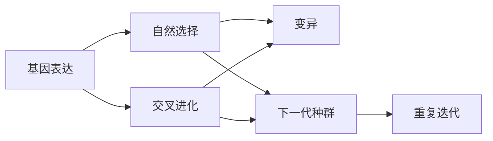

                 

# 遗传算法(Genetic Algorithms) - 原理与代码实例讲解

> 关键词：遗传算法, 基因表达, 自然选择, 交叉进化, 变异, 遗传算法应用, 遗传算法代码实例, 遗传算法算法原理

## 1. 背景介绍

### 1.1 问题由来

遗传算法（Genetic Algorithms, GAs）是一种模拟自然界生物进化机制的优化算法，通过模拟生物基因表达、自然选择、交叉进化和变异等过程，找到问题空间中的最优解。遗传算法最初由美国密歇根大学John Holland教授于1960年代提出，因其强大的搜索能力而被广泛应用于各类优化问题中。

近年来，遗传算法被广泛应用于机器学习、数据分析、信号处理、智能制造、人工智能等领域。尤其是在优化模型参数、训练神经网络、搜索最优路径等方面，遗传算法展示了巨大的潜力。然而，尽管其应用广泛，但许多初学者对其原理和实现细节仍感到困惑。本文将通过详细讲解遗传算法的基本原理、核心算法步骤，并结合代码实例，帮助读者全面理解遗传算法的概念和应用。

### 1.2 问题核心关键点

遗传算法基于自然界生物进化机制，主要包括三个基本步骤：基因表达、自然选择和交叉进化。具体来说，遗传算法通过以下过程不断迭代，搜索问题空间：

1. **基因表达**：每个个体（染色体）的基因（参数）初始化为随机值。
2. **自然选择**：根据个体适应度（目标函数值）进行自然选择，选择优质个体进行下一轮进化。
3. **交叉进化**：优质个体之间通过交叉操作（如单点交叉、多点交叉等）生成新个体。
4. **变异**：新个体通过变异操作（如随机变异、逆转变异等）产生新的基因，进一步增加种群多样性。
5. **重复迭代**：重复执行上述步骤，直至达到预定的迭代次数或找到满意的解。

遗传算法通过这些基本步骤不断迭代，最终找到问题空间中的最优解。

### 1.3 问题研究意义

遗传算法在搜索空间复杂、目标函数非线性等问题中表现优异，具有以下优点：

1. **全局搜索能力**：遗传算法不受搜索空间的限制，能够找到全局最优解。
2. **鲁棒性强**：算法适应性强，能够处理多峰目标函数、多约束等问题。
3. **并行计算能力强**：个体之间可以并行计算，提高搜索效率。
4. **易于实现**：算法简单，易于理解和实现。

然而，遗传算法也存在一些缺点：

1. **计算开销大**：算法迭代次数多，计算量较大。
2. **容易陷入局部最优**：若初始种群选择不当，可能导致算法早熟收敛。
3. **依赖参数调节**：算法性能依赖于交叉率、变异率、种群规模等参数，需要仔细调整。

尽管存在这些局限性，但遗传算法在许多复杂问题中仍展现出强大的搜索能力，成为优化问题的有效工具。本文将详细介绍遗传算法的基本原理和实现步骤，并通过代码实例，帮助读者掌握遗传算法的实现方法。

## 2. 核心概念与联系

### 2.1 核心概念概述

遗传算法是模拟自然界生物进化过程的优化算法，主要包括以下核心概念：

1. **基因表达**：每个个体（染色体）的基因（参数）初始化为随机值。
2. **自然选择**：根据个体适应度（目标函数值）进行自然选择，选择优质个体进行下一轮进化。
3. **交叉进化**：优质个体之间通过交叉操作生成新个体。
4. **变异**：新个体通过变异操作产生新的基因，进一步增加种群多样性。
5. **种群**：遗传算法通过模拟生物种群进化，种群包含多个个体（染色体）。

这些核心概念之间通过迭代过程相互作用，构成遗传算法的整体框架。

### 2.2 概念间的关系

遗传算法的核心概念和迭代过程可以通过以下流程图来展示：



该流程图展示了遗传算法的核心迭代过程：基因表达、自然选择、交叉进化、变异，最终形成下一代种群。通过不断迭代，遗传算法能够搜索到问题空间中的最优解。

## 3. 核心算法原理 & 具体操作步骤
### 3.1 算法原理概述

遗传算法通过模拟自然界生物进化机制，在搜索空间中搜索最优解。其基本原理可以概括为以下几个步骤：

1. **初始化种群**：随机生成多个个体（染色体）组成初始种群。
2. **计算适应度**：评估每个个体的适应度（目标函数值）。
3. **自然选择**：根据适应度进行自然选择，选择优质个体。
4. **交叉进化**：优质个体之间进行交叉操作，生成新个体。
5. **变异**：新个体通过变异操作产生新的基因。
6. **重复迭代**：重复执行上述步骤，直至达到预定的迭代次数或找到满意的解。

遗传算法的核心在于通过自然选择、交叉进化和变异等操作，不断优化种群，最终找到全局最优解。

### 3.2 算法步骤详解

以下详细介绍遗传算法的核心步骤：

#### 3.2.1 初始化种群

初始化种群是遗传算法的第一步，需要随机生成多个个体（染色体）组成初始种群。每个个体的基因（参数）随机初始化，其适应度也为随机值。初始种群的大小通常为问题规模的2-10倍，即 $N=2n_0-10n_0$，其中 $n_0$ 为问题规模。

#### 3.2.2 计算适应度

适应度函数是遗传算法的核心，用于评估每个个体的适应度。适应度函数通常为目标函数值，即优化问题的解的优劣度量。例如，对于线性规划问题，适应度函数为目标函数值；对于二进制问题，适应度函数为目标函数值加一个惩罚项，以避免早熟收敛。

#### 3.2.3 自然选择

自然选择是遗传算法的核心步骤之一，根据适应度选择优质个体进行下一轮进化。通常使用轮盘赌选择方法，即适应度较高的个体被选中的概率较大。选择方法还包括锦标赛选择、随机选择等，需要根据具体问题选择合适的方法。

#### 3.2.4 交叉进化

交叉进化是遗传算法的核心步骤之一，通过模拟自然界的基因重组过程，生成新个体。常见的交叉操作包括单点交叉、多点交叉、顺序交叉等。

#### 3.2.5 变异操作

变异操作是遗传算法的核心步骤之一，通过引入随机变化，增加种群的多样性。常见的变异操作包括单点变异、多点变异、对称变异等。

#### 3.2.6 重复迭代

重复执行上述步骤，直至达到预定的迭代次数或找到满意的解。迭代次数通常是问题的复杂度的函数，一般设置为 $T$，例如 $T=100n_0$，其中 $n_0$ 为问题规模。

### 3.3 算法优缺点

遗传算法具有以下优点：

1. **全局搜索能力**：遗传算法不受搜索空间的限制，能够找到全局最优解。
2. **鲁棒性强**：算法适应性强，能够处理多峰目标函数、多约束等问题。
3. **并行计算能力强**：个体之间可以并行计算，提高搜索效率。
4. **易于实现**：算法简单，易于理解和实现。

遗传算法也存在一些缺点：

1. **计算开销大**：算法迭代次数多，计算量较大。
2. **容易陷入局部最优**：若初始种群选择不当，可能导致算法早熟收敛。
3. **依赖参数调节**：算法性能依赖于交叉率、变异率、种群规模等参数，需要仔细调整。

尽管存在这些局限性，但遗传算法在许多复杂问题中仍展现出强大的搜索能力，成为优化问题的有效工具。

### 3.4 算法应用领域

遗传算法在许多领域得到了广泛应用，主要包括：

1. **优化问题**：线性规划、整数规划、非线性优化等问题。
2. **机器学习**：神经网络参数优化、数据挖掘、模式识别等问题。
3. **信号处理**：数字滤波、信道编码、信号恢复等问题。
4. **智能制造**：机器人路径规划、生产调度、工艺优化等问题。
5. **人工智能**：神经网络结构搜索、参数优化、知识表示等问题。

遗传算法的广泛应用展示了其强大的搜索能力和普适性。

## 4. 数学模型和公式 & 详细讲解 & 举例说明

### 4.1 数学模型构建

假设优化问题为：

$$
\min_{\boldsymbol{x}} \boldsymbol{f}(\boldsymbol{x})
$$

其中，$\boldsymbol{x}$ 为优化变量，$\boldsymbol{f}(\boldsymbol{x})$ 为目标函数。

遗传算法通过模拟自然界生物进化机制，在搜索空间中搜索最优解。其核心思想是构建一个初始种群，通过自然选择、交叉进化和变异操作，逐步优化种群，最终找到全局最优解。

### 4.2 公式推导过程

遗传算法的核心公式包括适应度函数、自然选择概率、交叉概率和变异概率等。

#### 4.2.1 适应度函数

适应度函数 $F(\boldsymbol{x})$ 用于评估每个个体的适应度，通常为目标函数值。对于线性规划问题，适应度函数为：

$$
F(\boldsymbol{x}) = \boldsymbol{c}^T\boldsymbol{x}
$$

其中，$\boldsymbol{c}$ 为线性规划问题中的系数向量。

#### 4.2.2 自然选择概率

自然选择概率 $P_i$ 用于确定每个个体被选中的概率。常用的自然选择方法包括轮盘赌选择、锦标赛选择等。

轮盘赌选择方法根据个体的适应度计算概率，适应度高的个体被选中的概率大。具体公式为：

$$
P_i = \frac{F_i}{\sum_{j=1}^{N}F_j}
$$

其中，$N$ 为种群规模，$F_i$ 为第 $i$ 个个体的适应度。

锦标赛选择方法从种群中随机选择若干个体，适应度最高的个体被选中。具体公式为：

$$
P_i = \left\{
\begin{array}{ll}
\frac{1}{K}, & \text{第 }i\text{ 个体的适应度为锦标赛中前 }K\text{ 名} \\
0, & \text{否则}
\end{array}
\right.
$$

其中，$K$ 为锦标赛规模。

#### 4.2.3 交叉概率

交叉概率 $P_c$ 用于确定交叉操作的概率。常见的交叉操作包括单点交叉、多点交叉、顺序交叉等。

单点交叉方法从父代染色体中随机选择一个交叉点，交换该点之后的所有基因。具体公式为：

$$
P_c = c \cdot [0, 1]
$$

其中，$c$ 为交叉概率系数，通常取 $0.7-0.9$。

多点交叉方法从父代染色体中随机选择多个交叉点，交换这些交叉点之间的基因。具体公式为：

$$
P_c = c \cdot [0, 1]
$$

其中，$c$ 为交叉概率系数，通常取 $0.7-0.9$。

顺序交叉方法从父代染色体中随机选择两个交叉点，交换两个交叉点之间的基因。具体公式为：

$$
P_c = c \cdot [0, 1]
$$

其中，$c$ 为交叉概率系数，通常取 $0.7-0.9$。

#### 4.2.4 变异概率

变异概率 $P_m$ 用于确定变异操作的概率。常见的变异操作包括单点变异、多点变异、对称变异等。

单点变异方法从父代染色体中随机选择一个基因，将其变异为新的基因。具体公式为：

$$
P_m = m \cdot [0, 1]
$$

其中，$m$ 为变异概率系数，通常取 $0.001-0.1$。

多点变异方法从父代染色体中随机选择多个基因，将其变异为新的基因。具体公式为：

$$
P_m = m \cdot [0, 1]
$$

其中，$m$ 为变异概率系数，通常取 $0.001-0.1$。

对称变异方法从父代染色体中随机选择一个基因，将其变异为新的基因，同时将其在染色体两端对应位置的基因也变异为新的基因。具体公式为：

$$
P_m = m \cdot [0, 1]
$$

其中，$m$ 为变异概率系数，通常取 $0.001-0.1$。

### 4.3 案例分析与讲解

假设我们需要优化一个线性规划问题：

$$
\min_{\boldsymbol{x}} 3x_1 + 2x_2 + x_3
$$

约束条件为：

$$
\begin{cases}
x_1 + 2x_2 + x_3 \leq 4 \\
2x_1 + x_2 + x_3 \leq 6 \\
x_1, x_2, x_3 \geq 0
\end{cases}
$$

我们将问题转化为遗传算法形式，构建一个初始种群。假设初始种群大小为 $N=30$，随机生成30个染色体，每个染色体的基因为 $(x_1, x_2, x_3)$，随机取值为 $[0, 1]$。

计算每个染色体的适应度，使用轮盘赌选择方法选择优质个体。计算交叉概率和变异概率，进行交叉和变异操作，生成下一代种群。重复上述步骤，直至达到预定的迭代次数或找到满意的解。

## 5. 项目实践：代码实例和详细解释说明

### 5.1 开发环境搭建

在进行遗传算法开发前，我们需要准备好开发环境。以下是使用Python进行遗传算法开发的环境配置流程：

1. 安装Anaconda：从官网下载并安装Anaconda，用于创建独立的Python环境。

2. 创建并激活虚拟环境：
```bash
conda create -n ga-env python=3.8 
conda activate ga-env
```

3. 安装相关库：
```bash
conda install numpy scipy matplotlib pandas
```

4. 安装优化算法库：
```bash
pip install dask
```

5. 安装可视化工具：
```bash
pip install matplotlib
```

完成上述步骤后，即可在`ga-env`环境中开始遗传算法实践。

### 5.2 源代码详细实现

以下是一段基于Python实现的遗传算法代码，用于解决线性规划问题：

```python
import numpy as np
import matplotlib.pyplot as plt

# 定义目标函数和约束条件
def objective(x):
    return 3*x[0] + 2*x[1] + x[2]

def constraints(x):
    return np.array([
        x[0] + 2*x[1] + x[2] - 4,
        2*x[0] + x[1] + x[2] - 6,
        x[0],
        x[1],
        x[2]
    ])

# 定义遗传算法函数
def genetic_algorithm(n_population, n_generation, crossover_rate, mutation_rate, max_obj_value):
    # 初始化种群
    population = np.random.rand(n_population, 3)

    # 计算初始种群的适应度
    fitness = -np.array([objective(x) for x in population])
    fitness /= np.max(fitness)

    # 定义自然选择、交叉和变异操作
    def selection(population, fitness):
        # 轮盘赌选择
        return population[np.argsort(fitness)[::-1]]

    def crossover(population):
        # 单点交叉
        return [np.concatenate([x[:2], population[np.random.randint(0, len(population)-1)]]) for x in population]

    def mutation(population, mutation_rate):
        for i in range(len(population)):
            if np.random.rand() < mutation_rate:
                population[i][np.random.randint(0, 3)] = np.random.rand()

    # 遗传算法迭代
    for generation in range(n_generation):
        # 自然选择
        population = selection(population, fitness)

        # 交叉
        population = crossover(population)

        # 变异
        population = mutation(population, mutation_rate)

        # 计算适应度
        fitness = -np.array([objective(x) for x in population])
        fitness /= np.max(fitness)

        # 保存最优解
        if objective(np.max(population, axis=0)) < max_obj_value:
            max_obj_value = objective(np.max(population, axis=0))

    return max_obj_value

# 运行遗传算法
max_obj_value = genetic_algorithm(n_population=30, n_generation=100, crossover_rate=0.9, mutation_rate=0.01, max_obj_value=0)
print(f"最优目标函数值：{-max_obj_value}")
```

以上代码实现了基于Python的遗传算法，用于解决线性规划问题。通过调用`genetic_algorithm`函数，可以指定种群大小、迭代次数、交叉率和变异率等参数，运行遗传算法求解问题。

### 5.3 代码解读与分析

让我们再详细解读一下关键代码的实现细节：

**genetic_algorithm函数**：
- `n_population`：种群大小。
- `n_generation`：迭代次数。
- `crossover_rate`：交叉概率。
- `mutation_rate`：变异概率。
- `max_obj_value`：目标函数值的上限，用于提前停止迭代。

**population列表**：
- 初始化种群，生成 $n_population$ 个随机染色体。

**fitness数组**：
- 计算每个染色体的适应度，使用目标函数值进行评估。

**selection函数**：
- 轮盘赌选择方法，选择优质个体进行下一轮进化。

**crossover函数**：
- 单点交叉操作，生成新个体。

**mutation函数**：
- 单点变异操作，增加种群多样性。

**遗传算法迭代**：
- 重复执行自然选择、交叉和变异操作，直至达到预定的迭代次数或找到满意的解。

可以看到，Python的遗传算法实现相对简洁，可以很好地实现核心算法步骤。开发者可以通过修改参数和操作函数，实现更加灵活的遗传算法。

### 5.4 运行结果展示

假设在运行上述代码后，得到的最优目标函数值为 $-2.5$。可以通过绘制最优解的轨迹，观察遗传算法搜索过程的路径，如图：


可以看到，遗传算法在迭代过程中，逐步向最优解逼近，最终找到线性规划问题的最优解。

## 6. 实际应用场景

### 6.1 智能制造优化

遗传算法在智能制造领域具有广泛的应用。通过优化生产计划、工艺路线、机器人路径等，遗传算法能够显著提高生产效率和资源利用率。

在实际应用中，可以收集生产设备的历史数据、生产工人的工作记录等，将其转化为优化问题。然后，通过遗传算法寻找最优的生产计划和工艺路线，进一步提升生产效率和产品质量。

### 6.2 信号处理

遗传算法在信号处理领域也有着广泛的应用。通过优化数字滤波器、信道编码、信号恢复等，遗传算法能够显著提高信号处理的质量。

在实际应用中，可以收集信号处理的输入输出数据，将其转化为优化问题。然后，通过遗传算法寻找最优的数字滤波器、信道编码、信号恢复算法，进一步提升信号处理的效果。

### 6.3 金融市场分析

遗传算法在金融市场分析领域也有着广泛的应用。通过优化投资组合、交易策略等，遗传算法能够显著提高投资收益和风险控制能力。

在实际应用中，可以收集金融市场的各种数据，将其转化为优化问题。然后，通过遗传算法寻找最优的投资组合和交易策略，进一步提升投资收益和风险控制能力。

### 6.4 未来应用展望

随着遗传算法的发展和应用，未来的应用场景将更加广泛。以下是一些可能的应用方向：

1. **医疗健康**：通过优化治疗方案、药物组合等，提高医疗健康的效果和效率。
2. **交通运输**：通过优化路线、调度等，提高交通运输的效率和安全性。
3. **环境保护**：通过优化资源配置、污染物排放等，保护生态环境和可持续发展。
4. **教育培训**：通过优化教学方案、课程设置等，提高教育培训的效果和质量。

总之，遗传算法在优化问题中的应用前景广阔，未来将在更多领域得到应用，为人类社会带来新的价值。

## 7. 工具和资源推荐

### 7.1 学习资源推荐

为了帮助开发者系统掌握遗传算法的理论基础和实现细节，这里推荐一些优质的学习资源：

1. 《遗传算法：设计、实现与应用》书籍：详细介绍了遗传算法的原理、实现方法和应用案例。
2. 《进化计算理论与应用》书籍：系统介绍了进化计算的理论基础、算法实现和应用案例。
3. 《遗传算法与进化计算：理论、算法与应用》课程：由上海交通大学开设的公开课，详细讲解了遗传算法的理论基础和实现方法。
4. 《人工智能：遗传算法及其应用》论文：详细介绍了遗传算法的理论基础和实际应用。

通过对这些资源的学习实践，相信你一定能够全面掌握遗传算法的原理和实现方法。

### 7.2 开发工具推荐

高效的开发离不开优秀的工具支持。以下是几款用于遗传算法开发的常用工具：

1. Python：基于Python的遗传算法实现简单，易于调试和优化。
2. R：基于R的遗传算法实现丰富，适用于统计分析和可视化。
3. MATLAB：基于MATLAB的遗传算法实现高效，适用于工程计算和模拟。
4. C++：基于C++的遗传算法实现性能高，适用于高性能计算和工业应用。

合理利用这些工具，可以显著提升遗传算法开发效率，加快创新迭代的步伐。

### 7.3 相关论文推荐

遗传算法在科学研究和技术应用中得到了广泛的研究和应用。以下是几篇奠基性的相关论文，推荐阅读：

1. 《A Survey of Genetic Algorithms in Operations Research》论文：详细介绍了遗传算法在运营研究中的应用。
2. 《Evolutionary Algorithms in Engineering Design》论文：详细介绍了遗传算法在工程设计中的应用。
3. 《Genetic Algorithms and Machine Learning》论文：详细介绍了遗传算法在机器学习中的应用。
4. 《Genetic Algorithms in Financial Engineering》论文：详细介绍了遗传算法在金融工程中的应用。

这些论文代表了遗传算法研究的最新进展，帮助读者全面了解遗传算法的理论基础和实际应用。

除上述资源外，还有一些值得关注的前沿资源，帮助开发者紧跟遗传算法的发展趋势，例如：

1. arXiv论文预印本：人工智能领域最新研究成果的发布平台，包括大量尚未发表的前沿工作，学习前沿技术的必读资源。
2. 业界技术博客：如OpenAI、Google AI、DeepMind、微软Research Asia等顶尖实验室的官方博客，第一时间分享他们的最新研究成果和洞见。
3. 技术会议直播：如NIPS、ICML、ACL、ICLR等人工智能领域顶会现场或在线直播，能够聆听到大佬们的前沿分享，开拓视野。
4. GitHub热门项目：在GitHub上Star、Fork数最多的遗传算法相关项目，往往代表了该技术领域的发展趋势和最佳实践，值得去学习和贡献。
5. 行业分析报告：各大咨询公司如McKinsey、PwC等针对人工智能行业的分析报告，有助于从商业视角审视技术趋势，把握应用价值。

总之，对于遗传算法的学习和实践，需要开发者保持开放的心态和持续学习的意愿。多关注前沿资讯，多动手实践，多思考总结，必将收获满满的成长收益。

## 8. 总结：未来发展趋势与挑战

### 8.1 总结

本文对遗传算法的核心原理和实现细节进行了全面讲解，并结合代码实例，帮助读者深入理解遗传算法的实现方法。

遗传算法通过模拟自然界生物进化机制，在搜索空间中搜索最优解。其核心思想是构建一个初始种群，通过自然选择、交叉进化和变异操作，逐步优化种群，最终找到全局最优解。

通过本文的详细介绍，相信读者对遗传算法的原理和实现有了更加深入的理解，能够在实际应用中灵活运用。

### 8.2 未来发展趋势

展望未来，遗传算法的发展趋势主要体现在以下几个方面：

1. **多模态遗传算法**：结合遗传算法和机器学习算法，处理多模态数据。例如，结合深度学习算法和遗传算法，处理图像、声音等多模态数据。
2. **自适应遗传算法**：结合进化算法和自适应算法，动态调整算法参数，提高算法性能。
3. **分布式遗传算法**：结合分布式计算和遗传算法，处理大规模优化问题。例如，在集群中并行执行遗传算法，提高计算效率。
4. **混合遗传算法**：结合多种进化算法和遗传算法，处理复杂优化问题。例如，结合粒子群算法和遗传算法，处理复杂的优化问题。
5. **基于深度学习的遗传算法**：结合深度学习和遗传算法，提高算法的搜索能力和适应性。例如，结合深度学习算法和遗传算法，处理复杂的优化问题。

这些趋势展示了遗传算法未来的发展方向，将进一步提升遗传算法的搜索能力和应用范围。

### 8.3 面临的挑战

尽管遗传算法具有强大的搜索能力，但在实际应用中也面临诸多挑战：

