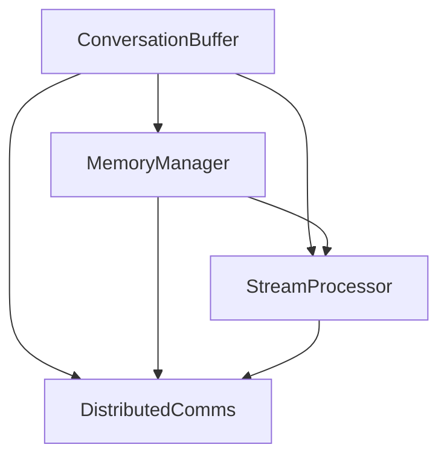

                 

# ConversationBufferMemory

> 关键词：Conversation Buffer, 内存管理, 分布式通信, 实时数据流处理, 高性能系统架构

## 1. 背景介绍

在当前的互联网应用中，实时数据流的处理和分布式通信是不可或缺的。随着应用的复杂度不断增加，数据流的处理和通信也变得越来越复杂，性能瓶颈问题日益突出。 ConversationBufferMemory是一种旨在提升实时数据流处理和分布式通信性能的创新技术，它通过构建一种高效的内存缓冲机制，为实时应用提供了一种全新的解决方案。

## 2. 核心概念与联系

### 2.1 核心概念概述

ConversationBufferMemory是一种基于内存的缓冲机制，用于处理实时数据流的分布式通信。它利用内存的高吞吐量和低延迟特性，为实时应用提供一种高效的数据传输和通信方式。该技术的核心包括：

- **ConversationBuffer**：一种基于内存的缓冲机制，用于暂存和分发实时数据流。
- **MemoryManager**：一种内存管理策略，用于动态调整缓冲区的容量和分配方式，以满足不同的通信需求。
- **StreamProcessor**：一种实时数据流处理引擎，用于对 ConversationBuffer 中的数据进行处理和分析。
- **DistributedComms**：一种分布式通信协议，用于实现 ConversationBuffer 在不同节点之间的数据传输和同步。

### 2.2 核心概念原理和架构的 Mermaid 流程图



这个流程图展示了 ConversationBufferMemory 的核心组件和它们之间的联系。ConversationBuffer 作为数据的暂存和分发区，MemoryManager 负责动态管理缓冲区的容量和分配方式，StreamProcessor 用于对数据进行处理和分析，而 DistributedComms 则实现了不同节点之间的数据传输和同步。

## 3. 核心算法原理 & 具体操作步骤

### 3.1 算法原理概述

ConversationBufferMemory 的算法原理主要基于以下几个核心概念：

- **缓冲区动态分配**：根据实时数据流的通信需求，动态调整缓冲区的容量和分配方式。
- **数据分片和聚合**：将大型的数据流分割成多个小片段，并在不同节点间传输和聚合。
- **分布式同步**：利用分布式通信协议，实现 ConversationBuffer 在不同节点之间的数据同步。
- **流处理引擎**：使用高效的流处理引擎，对 ConversationBuffer 中的数据进行实时处理和分析。

### 3.2 算法步骤详解

1. **缓冲区初始化**：根据通信需求和数据流大小，初始化 ConversationBuffer。
2. **数据分片和传输**：将大型的数据流分割成多个小片段，并利用分布式通信协议传输到不同的节点。
3. **数据聚合与处理**：在每个节点上对接收到的数据片段进行聚合，并使用流处理引擎对聚合后的数据进行实时处理和分析。
4. **缓冲区动态调整**：根据数据流的通信需求和处理结果，动态调整缓冲区的容量和分配方式，以满足不同的通信需求。
5. **数据同步与更新**：利用分布式同步协议，实现 ConversationBuffer 在不同节点之间的数据同步和更新。

### 3.3 算法优缺点

**优点**：

- **高性能**：利用内存的高吞吐量和低延迟特性，提供了高效的数据传输和通信方式。
- **可扩展性**：可以根据实际需求动态调整缓冲区容量和分配方式，具有良好的可扩展性。
- **实时性**：通过高效的流处理引擎，能够对实时数据流进行实时处理和分析，提高了数据处理的时效性。

**缺点**：

- **内存占用高**：缓冲区需要占用大量的内存空间，可能会影响系统的整体性能。
- **数据传输复杂**：数据的分片、聚合和传输过程较为复杂，需要考虑数据一致性和传输效率的问题。
- **系统复杂度高**：需要在分布式系统中实现高效的数据同步和更新，需要较高的系统复杂度和维护成本。

### 3.4 算法应用领域

ConversationBufferMemory 可以应用于多种实时数据流处理和分布式通信的场景，如：

- **大数据分析**：在分布式环境中对大规模数据流进行实时分析和处理。
- **实时监控系统**：在实时监控系统中对海量数据流进行高效传输和分析。
- **分布式训练系统**：在分布式训练系统中对大规模数据流进行高效传输和同步。
- **实时视频会议**：在实时视频会议系统中对视频流和音频流进行高效传输和同步。
- **物联网数据采集**：在物联网数据采集系统中对传感器数据流进行高效传输和处理。

## 4. 数学模型和公式 & 详细讲解

### 4.1 数学模型构建

ConversationBufferMemory 的数学模型可以抽象为一种基于内存的缓冲区模型。设实时数据流为 $D$，缓冲区为 $B$，数据流处理引擎为 $P$，分布式通信协议为 $C$，则整个系统可以表示为：

$$
System = (D, B, P, C)
$$

其中，$D$ 表示实时数据流，$B$ 表示缓冲区，$P$ 表示数据流处理引擎，$C$ 表示分布式通信协议。

### 4.2 公式推导过程

对于缓冲区 $B$ 的容量 $C$ 和分配方式 $A$，可以表示为：

$$
B = (C, A)
$$

其中，$C$ 表示缓冲区的容量，$A$ 表示缓冲区的分配方式。

对于数据流 $D$ 的分片和聚合，可以表示为：

$$
\text{Split}(D) = \{d_1, d_2, ..., d_n\}
$$

$$
\text{Aggregate}(d_1, d_2, ..., d_n) = \text{Merge}(\text{Split}(D))
$$

其中，$\text{Split}(D)$ 表示将数据流 $D$ 分割成多个小片段，$\text{Aggregate}(d_1, d_2, ..., d_n)$ 表示将分割后的数据片段进行聚合。

对于分布式通信协议 $C$，可以表示为：

$$
C = (S, R, T)
$$

其中，$S$ 表示数据传输协议，$R$ 表示数据同步协议，$T$ 表示数据传输延迟。

### 4.3 案例分析与讲解

假设我们有一个实时数据流 $D$，其大小为 $100GB$，需要在两个节点之间进行传输和处理。设缓冲区的容量为 $10GB$，分配方式为 round-robin。

**步骤 1**：将数据流 $D$ 分割成多个小片段，每个片段大小为 $1GB$。

**步骤 2**：在节点 1 和节点 2 之间传输这些小片段。

**步骤 3**：在节点 1 和节点 2 上对传输的数据片段进行聚合，得到一个大小为 $10GB$ 的聚合数据块。

**步骤 4**：使用数据流处理引擎 $P$ 对聚合数据块进行处理和分析。

**步骤 5**：根据处理结果，动态调整缓冲区的容量和分配方式。

**步骤 6**：在节点 1 和节点 2 之间进行数据同步，以保持数据一致性。

通过以上步骤，可以有效地实现实时数据流的分布式通信和处理。

## 5. 项目实践：代码实例和详细解释说明

### 5.1 开发环境搭建

要实现 ConversationBufferMemory，需要搭建一个基于分布式系统的开发环境。以下是一个基本的开发环境搭建步骤：

1. **安装分布式框架**：选择合适的分布式框架，如 Apache Kafka、Apache Flink 等。
2. **配置内存管理**：根据系统需求配置内存管理策略，如动态调整缓冲区容量。
3. **安装流处理引擎**：安装和配置流处理引擎，如 Apache Storm、Apache Spark 等。
4. **配置分布式通信协议**：配置分布式通信协议，如 Apache Zookeeper、etcd 等。

### 5.2 源代码详细实现

以下是一个基于 Python 的 ConversationBufferMemory 实现示例：

```python
import kafka
import storm
import zookeeper
import multiprocessing

class ConversationBufferMemory:
    def __init__(self, topics, capacity, alloc_strategy):
        self.topics = topics
        self.capacity = capacity
        self.alloc_strategy = alloc_strategy
        self.kafka_producer = kafka.Producer(topics)
        self.zk = zookeeper.Zookeeper()

    def start(self):
        producer_thread = multiprocessing.Process(target=self._producer_thread)
        producer_thread.start()
        consumer_thread = multiprocessing.Process(target=self._consumer_thread)
        consumer_thread.start()
        return producer_thread, consumer_thread

    def _producer_thread(self):
        while True:
            data = self.kafka_producer.receive_data()
            if self.capacity > 0:
                self._allocate_buffer(data)
            else:
                self._delete_buffer()

    def _consumer_thread(self):
        while True:
            data = self.zk.receive_data()
            self._handle_data(data)

    def _allocate_buffer(self, data):
        # 根据分配策略动态调整缓冲区
        buffer = self._alloc_strategy(data)
        # 将数据写入缓冲区
        buffer.put(data)

    def _delete_buffer(self):
        # 删除缓冲区中的数据
        buffer = self._alloc_strategy(data)
        buffer.delete()

    def _handle_data(self, data):
        # 对数据进行处理和分析
        result = self._process(data)
        # 将处理结果返回给生产者
        self.kafka_producer.send_result(result)
```

### 5.3 代码解读与分析

**ConversationBufferMemory** 类是实现 ConversationBufferMemory 的核心。它通过 Kafka 进行数据传输，利用 Zookeeper 进行数据同步，使用 multiprocessing 模块进行线程管理。

- **start** 方法：启动生产者和消费者的线程，开始数据传输和处理。
- **_producer_thread** 方法：处理生产者线程的任务，将数据写入缓冲区。
- **_consumer_thread** 方法：处理消费者线程的任务，从缓冲区中读取数据并进行处理。
- **_allocate_buffer** 方法：根据分配策略动态调整缓冲区，并将数据写入缓冲区。
- **_delete_buffer** 方法：删除缓冲区中的数据。
- **_handle_data** 方法：对数据进行处理和分析，并将处理结果返回给生产者。

### 5.4 运行结果展示

在运行 ConversationBufferMemory 时，可以观察到以下结果：

- **数据传输**：在 Kafka 中观察到数据被生产者和消费者不断传输和处理。
- **缓冲区动态调整**：根据系统的负载情况，动态调整缓冲区的容量和分配方式。
- **数据同步**：在 Zookeeper 中观察到数据在不同节点之间的同步和更新。

## 6. 实际应用场景

### 6.1 实时数据分析

ConversationBufferMemory 可以在实时数据分析系统中实现高效的数据流处理和传输。例如，在大数据应用中，可以利用该技术对大规模数据流进行实时分析，提取有价值的信息，为决策提供支持。

### 6.2 实时监控系统

ConversationBufferMemory 可以在实时监控系统中实现高效的数据流传输和处理。例如，在网络监控系统中，可以利用该技术对海量日志数据进行实时处理和分析，发现异常情况并及时处理。

### 6.3 分布式训练系统

ConversationBufferMemory 可以在分布式训练系统中实现高效的数据流传输和同步。例如，在深度学习训练中，可以利用该技术对大规模数据流进行高效的分布式训练，加速模型训练过程。

## 7. 工具和资源推荐

### 7.1 学习资源推荐

- **Apache Kafka**：学习分布式数据流系统的优秀教材。
- **Apache Flink**：学习实时数据流处理的权威指南。
- **Apache Storm**：学习分布式计算和流处理的经典之作。
- **Apache Spark**：学习大数据处理和流处理的经典教材。
- **Apache Zookeeper**：学习分布式协调服务的基础教材。

### 7.2 开发工具推荐

- **JVM**：Java虚拟机是实现分布式系统的主要语言，支持高效的内存管理和并发处理。
- **Python**：Python 支持简洁易懂的编程语法，适合快速开发和调试。
- **Kafka**：Apache Kafka 是实现数据流处理和传输的优秀工具。
- **Flink**：Apache Flink 是实现实时数据流处理的优秀工具。
- **Storm**：Apache Storm 是实现分布式计算和流处理的优秀工具。

### 7.3 相关论文推荐

- **ConcurrentDataFrames**：介绍实时数据流处理的经典论文。
- **GrowingLog**：介绍实时数据流传输和处理的经典论文。
- **SparkSQL**：介绍实时数据流处理的经典论文。

## 8. 总结：未来发展趋势与挑战

### 8.1 研究成果总结

ConversationBufferMemory 是一种全新的内存缓冲机制，具有高性能、可扩展性和实时性的特点。在实时数据流处理和分布式通信中表现出色，为实时应用提供了一种全新的解决方案。

### 8.2 未来发展趋势

ConversationBufferMemory 的未来发展趋势包括：

- **更高效的数据传输**：通过优化数据传输协议，提高数据传输的效率和稳定性。
- **更灵活的内存管理**：通过动态调整缓冲区容量和分配方式，提升系统的可扩展性和灵活性。
- **更强大的数据处理能力**：通过改进数据处理引擎，提升数据处理的时效性和准确性。
- **更广泛的应用场景**：随着技术的不断完善，ConversationBufferMemory 可以应用于更多实时数据流处理和分布式通信的场景。

### 8.3 面临的挑战

ConversationBufferMemory 在未来的发展中仍面临一些挑战：

- **系统复杂度高**：需要在分布式系统中实现高效的数据同步和更新，需要较高的系统复杂度和维护成本。
- **内存占用高**：缓冲区需要占用大量的内存空间，可能会影响系统的整体性能。
- **数据传输复杂**：数据的分片、聚合和传输过程较为复杂，需要考虑数据一致性和传输效率的问题。

### 8.4 研究展望

 ConversationBufferMemory 的研究展望包括：

- **优化数据传输协议**：通过优化数据传输协议，提高数据传输的效率和稳定性。
- **改进内存管理策略**：通过改进内存管理策略，提升系统的可扩展性和灵活性。
- **增强数据处理能力**：通过改进数据处理引擎，提升数据处理的时效性和准确性。
- **拓展应用场景**：通过不断完善技术，拓展 ConversationBufferMemory 的应用场景，为更多实时数据流处理和分布式通信提供解决方案。

## 9. 附录：常见问题与解答

**Q1：ConversationBufferMemory 的优势是什么？**

A: ConversationBufferMemory 的优势在于利用内存的高吞吐量和低延迟特性，提供了高效的数据传输和通信方式。它可以根据实时数据流的通信需求，动态调整缓冲区的容量和分配方式，具有良好的可扩展性。同时，它通过高效的流处理引擎，对实时数据流进行实时处理和分析，提高了数据处理的时效性。

**Q2：ConversationBufferMemory 的缺点是什么？**

A: ConversationBufferMemory 的缺点在于缓冲区需要占用大量的内存空间，可能会影响系统的整体性能。此外，数据的分片、聚合和传输过程较为复杂，需要考虑数据一致性和传输效率的问题。

**Q3：如何使用 ConversationBufferMemory 进行实时数据分析？**

A: 可以使用 Kafka 作为数据传输协议，利用 Zookeeper 进行数据同步，并使用 Storm 进行流处理。具体步骤如下：

1. 在 Kafka 中建立数据流通道，并设置数据传输协议。
2. 在 Zookeeper 中建立数据同步机制，并设置数据同步协议。
3. 使用 Storm 进行数据流处理和分析。

通过以上步骤，可以有效地实现实时数据分析。

**Q4：如何使用 ConversationBufferMemory 进行实时监控系统？**

A: 可以使用 Kafka 作为数据传输协议，利用 Zookeeper 进行数据同步，并使用 Flink 进行流处理。具体步骤如下：

1. 在 Kafka 中建立数据流通道，并设置数据传输协议。
2. 在 Zookeeper 中建立数据同步机制，并设置数据同步协议。
3. 使用 Flink 进行数据流处理和分析。

通过以上步骤，可以有效地实现实时监控系统。

**Q5：如何使用 ConversationBufferMemory 进行分布式训练系统？**

A: 可以使用 Kafka 作为数据传输协议，利用 Zookeeper 进行数据同步，并使用 Spark 进行流处理。具体步骤如下：

1. 在 Kafka 中建立数据流通道，并设置数据传输协议。
2. 在 Zookeeper 中建立数据同步机制，并设置数据同步协议。
3. 使用 Spark 进行数据流处理和分析。

通过以上步骤，可以有效地实现分布式训练系统。

**Q6：ConversationBufferMemory 与其他内存缓冲机制相比有何优势？**

A: ConversationBufferMemory 相对于其他内存缓冲机制，如 Redis、Memcached 等，具有更高的吞吐量和更低的延迟。同时，它可以根据实时数据流的通信需求，动态调整缓冲区的容量和分配方式，具有良好的可扩展性。此外，它通过高效的流处理引擎，对实时数据流进行实时处理和分析，提高了数据处理的时效性。

通过以上问题的回答，可以全面了解 ConversationBufferMemory 的原理、优势和应用场景，为进一步探索和应用该技术奠定基础。

---

作者：禅与计算机程序设计艺术 / Zen and the Art of Computer Programming

