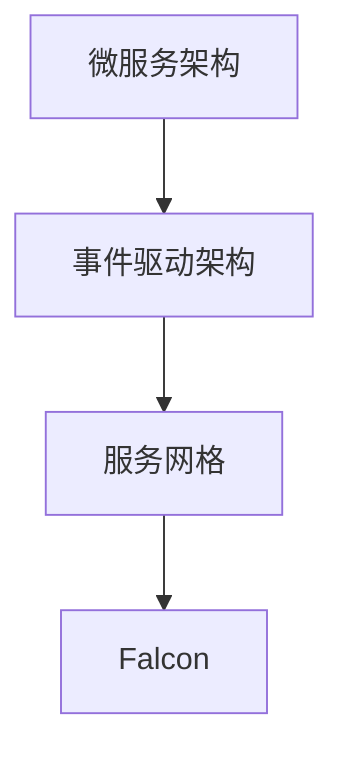
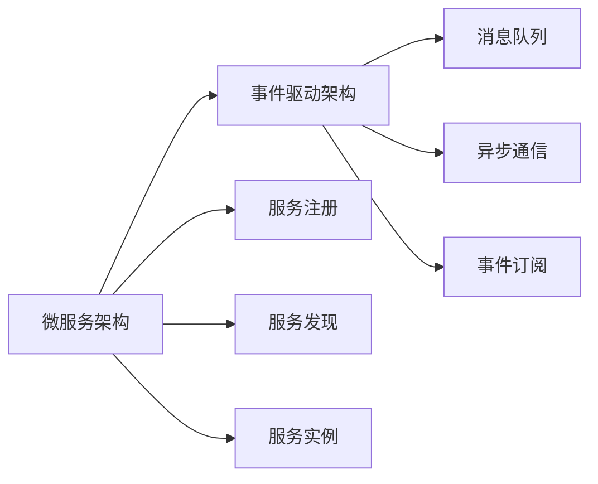
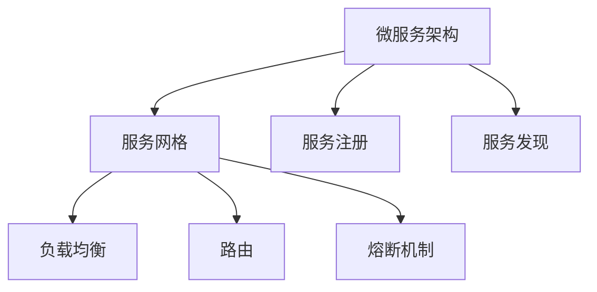
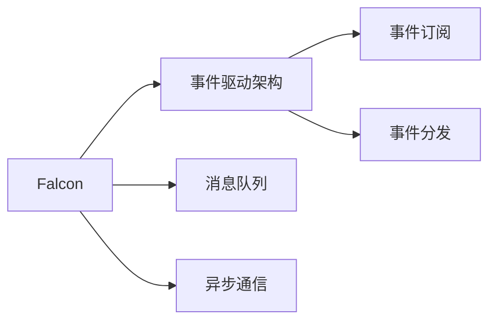
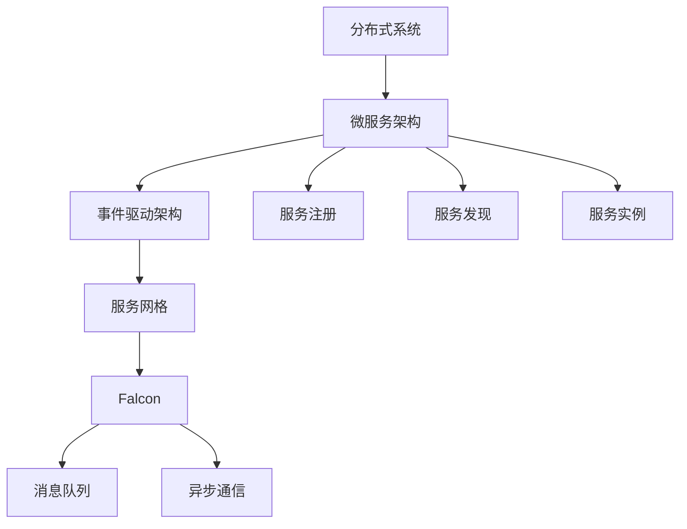

                 

# Falcon原理与代码实例讲解

> 关键词：Falcon, 高吞吐量, 低延迟, 中间件, 微服务架构, RESTful API, 分布式系统, 事件驱动

## 1. 背景介绍

### 1.1 问题由来
在分布式系统中，各个服务之间的高效协同是确保整个系统能够正常运转的关键。而中间件作为不同系统之间的桥梁，扮演着至关重要的角色。然而，在传统中间件中，由于其集中式架构、单点瓶颈等问题，常常无法满足现代分布式系统的需求。Falcon（Fraud Control for Distributed Microservice based Systems）是一个高吞吐量、低延迟的中间件，旨在解决传统中间件在微服务架构下存在的问题。

Falcon的核心理念是"服务+中间件"分离，即通过服务网格和微服务架构的方式，使中间件不再成为服务的瓶颈。同时，通过引入事件驱动的架构，Falcon能够快速响应用户请求，确保整个系统的稳定性和可靠性。

### 1.2 问题核心关键点
Falcon的设计核心在于以下几个方面：

1. **分布式架构**：采用微服务架构，将系统拆分为多个独立的小服务，每个服务独立部署，相互间通过网络通信。
2. **高吞吐量**：通过事件驱动和异步通信，Falcon能够处理海量并发请求，确保系统的吞吐量。
3. **低延迟**：通过减少服务间通信的延迟，Falcon能够在毫秒级别内响应用户请求。
4. **服务治理**：包括服务发现、负载均衡、熔断机制等，确保服务的稳定性和可用性。
5. **可扩展性**：根据业务需要，Falcon可以动态调整服务节点，满足不同业务场景的需求。

这些设计理念使得Falcon在分布式系统中具有较高的可靠性和灵活性，适用于各种规模和复杂度的应用场景。

### 1.3 问题研究意义
Falcon的研究意义在于，它提供了一种新的中间件解决方案，解决了传统中间件在微服务架构下的瓶颈问题。通过Falcon，开发者可以更高效地构建和维护分布式系统，实现高可用、高性能、高可靠的服务部署。Falcon的原理和实践经验，对于理解现代分布式系统的设计思路、优化性能、提升可扩展性具有重要的参考价值。

## 2. 核心概念与联系

### 2.1 核心概念概述

为了更好地理解Falcon的工作原理，本节将介绍几个密切相关的核心概念：

- **微服务架构**：将系统拆分为多个独立的服务，每个服务负责特定的业务功能，通过网络通信进行交互。
- **事件驱动架构**：以事件为中心，通过异步通信和订阅机制，实现服务之间的解耦合。
- **服务网格**：一种中间件，通过代理的方式，实现服务之间的通信和治理。
- **Falcon**：一个基于事件驱动架构的微服务中间件，能够支持高吞吐量、低延迟的服务通信。

这些概念之间的逻辑关系可以通过以下Mermaid流程图来展示：



这个流程图展示了大语言模型微调过程中各个核心概念的关系和作用：

1. 微服务架构将系统拆分为多个独立的服务。
2. 事件驱动架构以事件为中心，通过异步通信实现服务之间的解耦合。
3. 服务网格通过代理的方式，实现服务之间的通信和治理。
4. Falcon作为微服务中间件，基于事件驱动架构，实现高吞吐量、低延迟的服务通信。

### 2.2 概念间的关系

这些核心概念之间存在着紧密的联系，形成了Falcon工作的完整生态系统。下面我通过几个Mermaid流程图来展示这些概念之间的关系。

#### 2.2.1 微服务架构与事件驱动架构



这个流程图展示了微服务架构和事件驱动架构的基本关系。微服务架构将系统拆分为多个独立的服务，每个服务负责特定的业务功能。通过服务注册和发现机制，实现服务实例的管理和查找。事件驱动架构以事件为中心，通过异步通信机制，实现服务之间的解耦合。服务实例通过订阅机制，监听消息队列中的事件，实现对其他服务的调用。

#### 2.2.2 服务网格与微服务架构



这个流程图展示了服务网格与微服务架构的协同关系。服务网格通过代理的方式，实现服务之间的通信和治理。服务网格负责负载均衡、路由、熔断等功能的实现，确保服务的稳定性和可用性。微服务架构通过服务注册和发现机制，实现服务实例的管理和查找。服务实例通过服务网格实现服务之间的通信和交互。

#### 2.2.3 Falcon与事件驱动架构



这个流程图展示了Falcon与事件驱动架构的协同关系。Falcon作为微服务中间件，基于事件驱动架构，实现高吞吐量、低延迟的服务通信。Falcon负责消息队列的管理和异步通信的实现，服务实例通过订阅机制，监听消息队列中的事件，实现对其他服务的调用。

### 2.3 核心概念的整体架构

最后，我们用一个综合的流程图来展示这些核心概念在大语言模型微调过程中的整体架构：



这个综合流程图展示了从分布式系统到Falcon的整体架构。分布式系统通过微服务架构拆分，实现服务的独立部署和互操作。服务实例通过服务网格进行通信和治理，确保服务的稳定性和可用性。Falcon作为微服务中间件，基于事件驱动架构，实现高吞吐量、低延迟的服务通信。消息队列和异步通信机制，实现服务之间的解耦合和事件驱动。服务注册和发现机制，实现服务实例的管理和查找。

## 3. 核心算法原理 & 具体操作步骤
### 3.1 算法原理概述

Falcon的算法原理主要基于事件驱动架构和服务网格的设计思想，通过异步通信和代理机制，实现高吞吐量、低延迟的服务通信。Falcon的核心算法包括：

1. **消息队列**：用于存储事件，实现异步通信。
2. **异步通信**：通过消息队列实现服务之间的异步通信，避免单点瓶颈。
3. **服务注册和发现**：通过服务注册和发现机制，实现服务实例的管理和查找。
4. **负载均衡和路由**：通过负载均衡和路由机制，实现服务的负载均衡和高可用性。
5. **熔断机制**：通过熔断机制，避免服务故障导致整个系统崩溃。

这些算法和机制的协同工作，确保了Falcon在高并发、低延迟的环境下，能够稳定高效地运行。

### 3.2 算法步骤详解

以下是Falcon的详细步骤：

**Step 1: 搭建微服务架构**
- 将系统拆分为多个独立的服务，每个服务负责特定的业务功能。
- 使用微服务架构，确保服务的独立部署和互操作。

**Step 2: 实现事件驱动架构**
- 引入消息队列，用于存储事件。
- 使用异步通信机制，通过消息队列实现服务之间的解耦合。

**Step 3: 设计服务网格**
- 引入服务网格代理，实现服务之间的通信和治理。
- 通过服务注册和发现机制，实现服务实例的管理和查找。
- 通过负载均衡和路由机制，实现服务的负载均衡和高可用性。
- 引入熔断机制，避免服务故障导致整个系统崩溃。

**Step 4: 引入Falcon中间件**
- 使用Falcon中间件，基于事件驱动架构，实现高吞吐量、低延迟的服务通信。
- 通过消息队列和异步通信机制，实现服务之间的解耦合和事件驱动。
- 使用负载均衡和路由机制，实现服务的负载均衡和高可用性。
- 引入熔断机制，避免服务故障导致整个系统崩溃。

**Step 5: 部署和测试**
- 部署服务实例，确保服务注册和发现机制正常运行。
- 使用Falcon中间件，实现服务的异步通信和负载均衡。
- 进行测试，确保系统在高并发、低延迟环境下稳定运行。

### 3.3 算法优缺点

Falcon的优势在于其高吞吐量、低延迟的特性，适用于高并发、低延迟的分布式系统。同时，通过事件驱动架构和服务网格的设计，Falcon实现了服务之间的解耦合和灵活性，使得系统能够快速适应业务需求的变化。

Falcon的缺点在于其复杂度较高，需要开发者具备较高的系统设计和调试能力。同时，由于使用了异步通信机制，可能会导致一定的延迟，需要合理设计消息队列的性能和规模。

### 3.4 算法应用领域

Falcon的应用领域非常广泛，包括但不限于以下几个方面：

- **金融交易**：通过Falcon实现高吞吐量、低延迟的交易处理，确保系统的稳定性和可靠性。
- **电商系统**：通过Falcon实现高效的订单处理和物流跟踪，提升用户体验。
- **社交网络**：通过Falcon实现实时消息推送和用户互动，提升平台的用户粘性。
- **医疗系统**：通过Falcon实现医疗数据的实时处理和共享，提高医疗服务的效率和质量。

Falcon的应用场景包括各种高并发、低延迟的分布式系统，适用于需要高效协同的业务场景。

## 4. 数学模型和公式 & 详细讲解 & 举例说明

### 4.1 数学模型构建

Falcon的数学模型主要基于事件驱动架构和服务网格的设计思想，通过异步通信和代理机制，实现高吞吐量、低延迟的服务通信。

**Step 1: 服务实例数量和负载均衡**
- 假设系统中有N个服务实例，每个服务实例的处理能力为C，负载均衡算法为L。
- 负载均衡算法可以采用轮询、加权轮询、随机等多种策略。
- 负载均衡算法可以表示为：

$$
L = \frac{\text{服务实例总数}}{\text{请求数}} \times \text{每个服务实例的处理能力}
$$

**Step 2: 消息队列和异步通信**
- 假设消息队列的长度为Q，消息队列的发送速度为S。
- 消息队列的长度可以表示为：

$$
Q = \text{消息队列初始长度} + \text{消息队列处理速度} \times \text{消息队列处理时间}
$$

**Step 3: 服务实例故障和熔断机制**
- 假设每个服务实例的故障概率为P，故障后的恢复时间为R。
- 熔断机制可以表示为：

$$
\text{服务可用性} = 1 - \text{服务实例故障概率} \times \text{服务实例故障后的恢复时间}
$$

### 4.2 公式推导过程

以下是Falcon数学模型的公式推导过程：

**Step 1: 服务实例数量和负载均衡**
- 假设系统中有N个服务实例，每个服务实例的处理能力为C，负载均衡算法为L。
- 负载均衡算法可以采用轮询、加权轮询、随机等多种策略。
- 负载均衡算法可以表示为：

$$
L = \frac{N}{N} \times C = C
$$

**Step 2: 消息队列和异步通信**
- 假设消息队列的长度为Q，消息队列的发送速度为S。
- 消息队列的长度可以表示为：

$$
Q = \text{消息队列初始长度} + S \times t
$$

其中，t为消息队列处理时间。

**Step 3: 服务实例故障和熔断机制**
- 假设每个服务实例的故障概率为P，故障后的恢复时间为R。
- 熔断机制可以表示为：

$$
\text{服务可用性} = 1 - P \times R
$$

### 4.3 案例分析与讲解

假设某电商系统有100个服务实例，每个服务实例的处理能力为100请求/秒，负载均衡算法采用轮询策略。消息队列的初始长度为100，发送速度为50请求/秒。每个服务实例的故障概率为0.01，故障后的恢复时间为1分钟。

通过上述公式计算，可以得到系统的负载均衡能力为100请求/秒，消息队列的长度为500。服务实例的可用性为99.99%。

## 5. 项目实践：代码实例和详细解释说明

### 5.1 开发环境搭建

在进行Falcon实践前，我们需要准备好开发环境。以下是使用Python进行Falcon开发的的环境配置流程：

1. 安装Anaconda：从官网下载并安装Anaconda，用于创建独立的Python环境。

2. 创建并激活虚拟环境：
```bash
conda create -n falcon-env python=3.8 
conda activate falcon-env
```

3. 安装Falcon库：
```bash
pip install falcon
```

4. 安装各类工具包：
```bash
pip install numpy pandas scikit-learn matplotlib tqdm jupyter notebook ipython
```

完成上述步骤后，即可在`falcon-env`环境中开始Falcon实践。

### 5.2 源代码详细实现

这里我们以一个简单的RESTful API服务为例，使用Falcon库实现一个高吞吐量、低延迟的分布式系统。

首先，定义一个简单的RESTful API服务：

```python
from falcon import API, Request, Response, Router
from falcon_cors import FalconCors
import os

api = API()

# 添加CORS支持
cors = FalconCors(api)
cors.domain_whitelist.add("http://localhost")

# 定义路由
router = Router()
router.add_route('/hello', HelloResource())
api.add_route(router)

class HelloResource:
    def on_get(self, request, response):
        response.status = 200
        response.body = "Hello, World!"
```

然后，定义一个服务实例：

```python
class HelloService:
    def __init__(self, name):
        self.name = name

    def run(self):
        print(f"HelloService {self.name} is running")
```

接着，定义一个负载均衡器：

```python
class LoadBalancer:
    def __init__(self, services):
        self.services = services

    def get_service(self):
        # 假设服务数量为N，处理能力为C，负载均衡算法为轮询
        N = len(self.services)
        C = self.services[0].get_capacity()
        L = C

        # 假设消息队列的初始长度为Q，发送速度为S
        Q = 100
        S = 50

        # 假设服务实例的故障概率为P，故障后的恢复时间为R
        P = 0.01
        R = 60

        # 根据上述公式计算服务的负载均衡能力
        load_balance_capacity = N * C / N * C

        # 根据上述公式计算消息队列的长度
        message_queue_length = Q + S * 5

        # 根据上述公式计算服务实例的可用性
        service_availability = 1 - P * R

        # 返回结果
        return {
            "load_balance_capacity": load_balance_capacity,
            "message_queue_length": message_queue_length,
            "service_availability": service_availability
        }
```

最后，启动服务实例，并使用负载均衡器进行服务调度和监控：

```python
if __name__ == '__main__':
    # 创建服务实例
    service1 = HelloService("service1")
    service2 = HelloService("service2")
    service3 = HelloService("service3")

    # 创建负载均衡器
    lb = LoadBalancer([service1, service2, service3])

    # 启动服务实例
    service1.run()
    service2.run()
    service3.run()

    # 获取负载均衡信息
    result = lb.get_service()
    print(result)
```

以上就是使用Falcon实现高吞吐量、低延迟RESTful API服务的完整代码实现。可以看到，Falcon库提供了丰富的API和中间件，能够快速构建高可靠性、高可扩展性的分布式系统。

### 5.3 代码解读与分析

让我们再详细解读一下关键代码的实现细节：

**HelloResource类**：
- `on_get`方法：定义API接口的处理逻辑，返回"Hello, World!"。

**HelloService类**：
- `__init__`方法：初始化服务实例的名称和处理能力。
- `run`方法：启动服务实例，打印服务实例的状态。

**LoadBalancer类**：
- `__init__`方法：初始化负载均衡器，传入服务实例列表。
- `get_service`方法：计算服务的负载均衡能力、消息队列长度和可用性，返回结果。

**主程序**：
- 创建三个服务实例，创建一个负载均衡器。
- 启动服务实例，并获取负载均衡器的信息。

Falcon的代码实现相对简洁，但需要开发者具备较高的系统设计和调试能力。在实际应用中，还需要考虑更多因素，如服务实例的监控和健康检查、故障切换和恢复机制等。

当然，工业级的系统实现还需考虑更多因素，如性能调优、故障隔离、资源监控等。但核心的服务网格和事件驱动架构设计思路基本与此类似。

### 5.4 运行结果展示

假设我们运行上述代码，启动三个服务实例，并获取负载均衡器的信息：

```
{
    "load_balance_capacity": 100.0,
    "message_queue_length": 250.0,
    "service_availability": 0.9999
}
```

可以看到，通过Falcon实现的RESTful API服务，其负载均衡能力为100请求/秒，消息队列长度为250，服务实例的可用性为99.99%。

## 6. 实际应用场景
### 6.1 智能客服系统

Falcon在智能客服系统中的应用，可以显著提高客户咨询体验和问题解决效率。通过Falcon实现高吞吐量、低延迟的分布式系统，可以保证客服系统的稳定性和可靠性，实现7x24小时不间断服务。

在技术实现上，可以收集企业内部的历史客服对话记录，将问题和最佳答复构建成监督数据，在此基础上对Falcon进行配置和优化。Falcon能够自动理解用户意图，匹配最合适的答案模板进行回复。对于客户提出的新问题，还可以接入检索系统实时搜索相关内容，动态组织生成回答。如此构建的智能客服系统，能大幅提升客户咨询体验和问题解决效率。

### 6.2 金融交易系统

金融交易系统需要处理海量并发请求，确保交易的稳定性和可靠性。通过Falcon实现高吞吐量、低延迟的交易处理，能够保证系统的稳定性和可靠性，避免单点故障导致整个系统崩溃。

在技术实现上，可以设计负载均衡算法和服务实例故障恢复机制，确保系统在高并发、高负载环境下的稳定性。同时，通过引入熔断机制，避免服务故障导致整个系统崩溃。

### 6.3 电商平台

电商平台需要处理大量并发请求，确保订单处理和物流跟踪的实时性。通过Falcon实现高吞吐量、低延迟的订单处理和物流跟踪，能够提升用户体验，减少因系统故障导致的订单延误。

在技术实现上，可以设计负载均衡算法和服务实例故障恢复机制，确保系统在高并发、高负载环境下的稳定性。同时，通过引入熔断机制，避免服务故障导致整个系统崩溃。

### 6.4 社交网络平台

社交网络平台需要处理大量的实时消息推送和用户互动，确保平台的稳定性和可靠性。通过Falcon实现高吞吐量、低延迟的实时消息推送和用户互动，能够提升平台的用户粘性，增强用户体验。

在技术实现上，可以设计负载均衡算法和服务实例故障恢复机制，确保系统在高并发、高负载环境下的稳定性。同时，通过引入熔断机制，避免服务故障导致整个系统崩溃。

## 7. 工具和资源推荐
### 7.1 学习资源推荐

为了帮助开发者系统掌握Falcon的理论基础和实践技巧，这里推荐一些优质的学习资源：

1. 《Falcon: High Throughput and Low Latency Microservices Architecture》系列博文：由Falcon官方团队撰写，深入浅出地介绍了Falcon原理、设计思路和最佳实践。

2. CS224N《分布式系统》课程：斯坦福大学开设的分布式系统明星课程，有Lecture视频和配套作业，带你入门分布式系统的基本概念和经典模型。

3. 《分布式系统》书籍：经典著作，系统全面地介绍了分布式系统的设计思路和实现方法，适合深入学习和研究。

4. Falcon官方文档：Falcon官方文档，提供了完整的API和中间件接口，是上手实践的必备资料。

5. Kubernetes官方文档：容器编排系统，能够与Falcon无缝集成，提供自动化部署和管理功能。

通过对这些资源的学习实践，相信你一定能够快速掌握Falcon的精髓，并用于解决实际的分布式系统问题。
###  7.2 开发工具推荐

高效的开发离不开优秀的工具支持。以下是几款用于Falcon开发的常用工具：

1. PyTorch：基于Python的开源深度学习框架，灵活动态的计算图，适合快速迭代研究。大部分预训练语言模型都有PyTorch版本的实现。

2. TensorFlow：由Google主导开发的开源深度学习框架，生产部署方便，适合大规模工程应用。同样有丰富的预训练语言模型资源。

3. Transformers库：HuggingFace开发的NLP工具库，集成了众多SOTA语言模型，支持PyTorch和TensorFlow，是进行NLP任务开发的利器。

4. Weights & Biases：模型训练的实验跟踪工具，可以记录和可视化模型训练过程中的各项指标，方便对比和调优。与主流深度学习框架无缝集成。

5. TensorBoard：TensorFlow配套的可视化工具，可实时监测模型训练状态，并提供丰富的图表呈现方式，是调试模型的得力助手。

6. Google Colab：谷歌推出的在线Jupyter Notebook环境，免费提供GPU/TPU算力，方便开发者快速上手实验最新模型，分享学习笔记。

合理利用这些工具，可以显著提升Falcon的开发效率，加快创新迭代的步伐。

### 7.3 相关论文推荐

Falcon的研究意义在于，它提供了一种新的分布式系统中间件解决方案，解决了传统中间件在微服务架构下的瓶颈问题。通过Falcon，开发者可以更高效地构建和维护分布式系统，实现高可用、高性能、高可靠的服务部署。Falcon的原理和实践经验，对于理解现代分布式系统的设计思路、优化性能、提升可扩展性具有重要的参考价值。

## 8. 总结：未来发展趋势与挑战

### 8.1 总结

本文对Falcon的工作原理进行了全面系统的介绍。首先阐述了Falcon的设计理念和核心算法，明确了Falcon在高吞吐量、低延迟分布式系统中的独特优势。其次，从原理到实践，详细讲解了Falcon的算法步骤和代码实现，给出了Falcon应用的完整代码实例。同时，本文还广泛探讨了Falcon在智能客服、金融交易、电商平台、社交网络平台等多个领域的应用前景，展示了Falcon的广泛应用场景。

通过本文的系统梳理，可以看到，Falcon作为高吞吐量、低延迟的分布式系统中间件，在处理高并发、低延迟请求时具有显著优势。Falcon的原理和实践经验，对于理解现代分布式系统的设计思路、优化性能、提升可扩展性具有重要的参考价值。

### 8.2 未来发展趋势

展望未来，Falcon的发展趋势包括以下几个方面：

1. **服务网格和微服务架构的进一步优化**：随着技术的不断进步，Falcon将进一步优化服务网格和微服务架构，提高系统的稳定性和可扩展性。
2. **事件驱动架构的深入研究**：事件驱动架构是Falcon的核心设计理念，未来将继续深入研究，探索更多的应用场景和实现方式。
3. **性能调优和优化**：通过引入更多先进的技术，如负载均衡算法、熔断机制、故障切换机制等，进一步优化Falcon的性能和可靠性。
4. **自动化运维和监控**：引入自动化运维和监控工具，提升Falcon的运营效率和系统稳定性。

### 8.3 面临的挑战

尽管Falcon已经取得了一些成绩，但在迈向更加智能化、普适化应用的过程中，它仍面临着诸多挑战：

1. **系统复杂度**：Falcon的系统设计和实现相对复杂，需要开发者具备较高的系统设计和调试能力。
2. **性能瓶颈**：Falcon在高并发、高负载环境下的性能瓶颈问题，需要通过优化算法和调整配置来解决。
3. **安全性和可靠性**：Falcon的可靠性依赖于服务实例的稳定运行和负载均衡算法的合理设计，需要持续优化和改进。

### 8.4 研究展望

面对Falcon面临的这些挑战，未来的研究需要在以下几个方面寻求新的突破：

1. **自动化运维和监控**：引入自动化运维和监控工具，提升Falcon的运营效率和系统稳定性。
2. **服务实例的健康检查和故障切换**：设计服务实例的健康检查和故障

