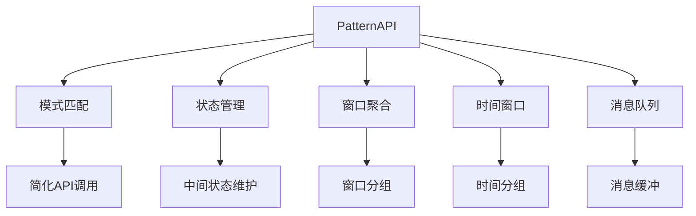
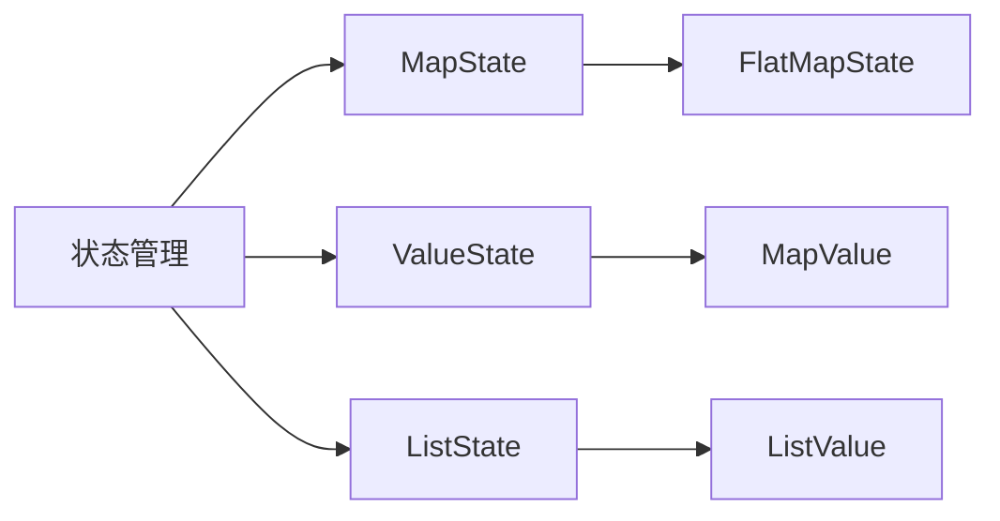
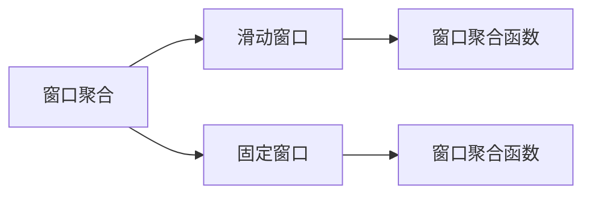
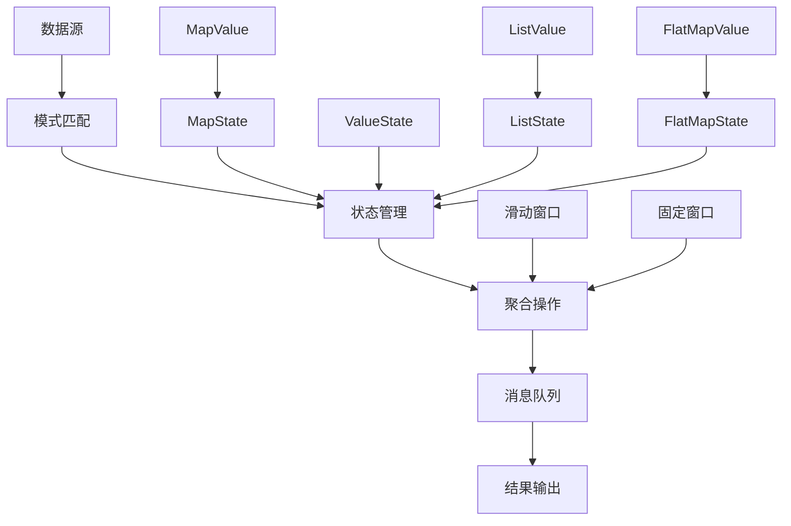

                 

# Flink PatternAPI原理与代码实例讲解

## 1. 背景介绍

### 1.1 问题由来
Flink是Apache Software Foundation旗下的开源分布式流处理框架，提供了强大的流式数据处理能力和分布式计算架构，广泛应用于大数据处理、实时数据流分析、机器学习等领域。Flink社区不断推出新的功能和API，以更好地支持流数据处理的各个场景。

然而，Flink的API众多且复杂，如何高效地使用这些API一直是开发者面临的挑战。为解决这一问题，Flink社区推出了PatternAPI，这是一种基于模式匹配的API设计模式，旨在简化API的使用，降低开发者学习和应用的门槛。

### 1.2 问题核心关键点
Flink PatternAPI通过模式匹配的方式，将复杂的API调用简化为易于理解和使用的方法。它支持多种流式数据处理模式，如窗口聚合、时间窗口、状态管理、消息队列等，通过统一的接口调用方式，大大提升了API的使用效率和可读性。

### 1.3 问题研究意义
PatternAPI的推出，为Flink框架的使用提供了更加便捷的方式，降低了开发者的学习成本和应用难度，使得复杂的流式数据处理任务更加易于实现。它还支持热插拔功能，允许在运行过程中动态添加或修改处理模式，进一步提升了系统的灵活性和可扩展性。

## 2. 核心概念与联系

### 2.1 核心概念概述

为更好地理解Flink PatternAPI的工作原理，本节将介绍几个关键概念：

- **Flink PatternAPI**：一种基于模式匹配的API设计模式，用于简化Flink框架的API调用，支持多种流式数据处理模式。
- **模式匹配**：一种基于描述语言的形式化表示方法，用于匹配输入的流数据，执行相应的数据处理操作。
- **状态管理**：在流式数据处理过程中，维护和管理中间状态，支持复杂的聚合和关联操作。
- **窗口聚合**：将流数据按照时间窗口进行分组，并对其执行聚合操作。
- **时间窗口**：按照时间进行分组的方式，支持滑动窗口和固定窗口。
- **消息队列**：在流式数据处理过程中，用于缓冲和分发消息的中间件。

这些核心概念之间的逻辑关系可以通过以下Mermaid流程图来展示：



这个流程图展示了PatternAPI的核心概念及其之间的关系：

1. PatternAPI通过模式匹配的方式，简化API的调用。
2. 模式匹配用于匹配输入的流数据，执行相应的数据处理操作。
3. 状态管理用于维护和管理中间状态，支持复杂的聚合和关联操作。
4. 窗口聚合通过时间窗口的方式，对流数据进行分组和聚合。
5. 时间窗口支持滑动窗口和固定窗口，用于不同场景的处理。
6. 消息队列用于缓冲和分发消息，支持消息的可靠传递。

### 2.2 概念间的关系

这些核心概念之间存在着紧密的联系，形成了Flink框架的核心功能。下面通过几个Mermaid流程图来展示这些概念之间的关系。

#### 2.2.1 流式数据处理流程


这个流程图展示了流式数据处理的基本流程：

1. 数据源提供原始数据流。
2. 模式匹配根据需求对流数据进行模式匹配。
3. 状态管理维护中间状态，支持聚合操作。
4. 聚合操作对分组后的数据执行聚合计算。
5. 结果输出将聚合结果输出到外部系统。

#### 2.2.2 状态管理的常见模式



这个流程图展示了状态管理的常见模式：

1. 状态管理支持MapState、ValueState、ListState等模式。
2. MapState模式用于存储键值对，支持Map函数。
3. ValueState模式用于存储单值状态，支持Map函数。
4. ListState模式用于存储列表状态，支持List函数。
5. FlatMapState模式用于扁平化映射，支持Map函数和FlatMap函数。

#### 2.2.3 窗口聚合的常见模式



这个流程图展示了窗口聚合的常见模式：

1. 窗口聚合支持滑动窗口和固定窗口模式。
2. 滑动窗口根据时间或数据量进行滑动。
3. 固定窗口根据固定的时间或数据量进行分组。
4. 窗口聚合函数用于对分组后的数据进行聚合计算。

### 2.3 核心概念的整体架构

最后，我们用一个综合的流程图来展示这些核心概念在大数据处理中的整体架构：



这个综合流程图展示了从数据源到结果输出的完整处理流程：

1. 数据源提供原始数据流。
2. 模式匹配根据需求对流数据进行模式匹配。
3. 状态管理维护中间状态，支持聚合操作。
4. 聚合操作对分组后的数据执行聚合计算。
5. 聚合结果通过消息队列进行分发。
6. 最终结果输出到外部系统。

## 3. 核心算法原理 & 具体操作步骤

### 3.1 算法原理概述

Flink PatternAPI通过模式匹配的方式，简化API的调用。模式匹配是一种基于描述语言的形式化表示方法，用于匹配输入的流数据，执行相应的数据处理操作。

形式化地，假设输入的流数据为 $S$，模式匹配器为 $P$，则匹配结果 $M$ 满足：

$$
M(S) = \begin{cases}
P(S) & \text{if } P \text{ matches } S \\
\text{null} & \text{otherwise}
\end{cases}
$$

在Flink PatternAPI中，模式匹配器 $P$ 通常以函数形式定义，支持参数和返回值。模式匹配函数 $P$ 的输入为流数据 $S$，输出为匹配结果 $M$。模式匹配函数 $P$ 的设计需要考虑以下因素：

- **输入数据格式**：需要明确流数据的格式，包括事件时间戳、键值对、属性等。
- **匹配条件**：需要定义匹配条件，支持逻辑表达式、键值比较等。
- **输出格式**：需要定义输出格式，包括键值对、元组、聚合结果等。

### 3.2 算法步骤详解

Flink PatternAPI的实现步骤如下：

1. **模式定义**：定义模式匹配函数 $P$，包括输入数据格式、匹配条件和输出格式。
2. **模式匹配**：使用模式匹配函数 $P$ 对输入流数据 $S$ 进行匹配，执行相应的数据处理操作。
3. **结果输出**：将匹配结果 $M$ 输出到结果集合或中间状态，供后续处理使用。
4. **状态管理**：维护中间状态，支持状态管理模式，如MapState、ValueState、ListState等。
5. **聚合操作**：对分组后的数据执行聚合操作，支持聚合函数、聚合状态等。
6. **结果返回**：将聚合结果返回给用户，完成数据处理过程。

### 3.3 算法优缺点

Flink PatternAPI的优点包括：

- **简化API调用**：通过模式匹配的方式，简化了复杂的API调用，降低了学习成本和应用难度。
- **支持多种模式**：支持多种流式数据处理模式，如窗口聚合、状态管理、消息队列等。
- **灵活性高**：支持热插拔功能，允许在运行过程中动态添加或修改处理模式，提高了系统的灵活性和可扩展性。

Flink PatternAPI的缺点包括：

- **模式匹配复杂**：模式匹配函数的设计较为复杂，需要考虑输入数据格式、匹配条件和输出格式，增加了API调用的复杂性。
- **状态管理复杂**：状态管理需要维护中间状态，支持多种状态管理模式，增加了系统设计和调试的复杂度。
- **性能开销较大**：模式匹配和状态管理需要额外的计算和内存开销，可能导致性能瓶颈。

### 3.4 算法应用领域

Flink PatternAPI在多种流式数据处理场景中得到了广泛应用，例如：

- **实时数据分析**：支持实时数据流的采集、处理和分析，满足企业对实时数据的处理需求。
- **机器学习**：支持机器学习模型的训练和推理，支持实时数据流的训练和推理任务。
- **事件驱动架构**：支持事件驱动架构的构建，满足企业对事件驱动系统的发展需求。
- **流数据传输**：支持流数据的可靠传输和缓冲，满足企业对流数据传输的可靠性和高效性要求。

## 4. 数学模型和公式 & 详细讲解 & 举例说明

### 4.1 数学模型构建

假设输入流数据 $S$ 为 $(S_1, S_2, ..., S_n)$，模式匹配函数 $P$ 为 $P(S)$，则匹配结果 $M$ 为 $(M_1, M_2, ..., M_n)$。

定义流数据的格式为 $(S, k, v)$，其中 $S$ 为流数据，$k$ 为键，$v$ 为值。定义模式匹配函数 $P$ 的输入格式为 $(S, k, v)$，输出格式为 $(M, k, v)$。

### 4.2 公式推导过程

假设模式匹配函数 $P$ 为 $P(S, k, v)$，则匹配结果 $M$ 为：

$$
M = P(S, k, v) \text{ for each } (S, k, v) \in S
$$

其中 $S$ 为输入流数据，$P(S, k, v)$ 为模式匹配函数，$M$ 为匹配结果。

定义模式匹配函数 $P(S, k, v)$ 的输入格式为 $(S, k, v)$，输出格式为 $(M, k, v)$。则匹配结果 $M$ 为：

$$
M = (P(S_1, k_1, v_1), P(S_2, k_2, v_2), ..., P(S_n, k_n, v_n))
$$

其中 $(S_1, S_2, ..., S_n)$ 为输入流数据，$(k_1, k_2, ..., k_n)$ 为键，$(v_1, v_2, ..., v_n)$ 为值，$P(S, k, v)$ 为模式匹配函数，$M$ 为匹配结果。

### 4.3 案例分析与讲解

下面以一个简单的例子来说明Flink PatternAPI的应用。

假设我们有一个流数据 $S$，其中每个事件包含事件时间戳 $t$、事件ID $e$ 和事件值 $v$。我们需要根据事件ID对流数据进行分组，计算每个事件ID的平均值。

定义模式匹配函数 $P(S, k, v)$ 如下：

```java
public class AverageEvent {
    public static Result match(FlinkEvent event) {
        double sum = event.getValues().stream().mapToDouble(v -> v).sum();
        double count = event.getValues().size();
        return new Result(event.getEventId(), sum / count);
    }
}
```

其中 $FlinkEvent$ 为事件类，$Result$ 为结果类，包含事件ID和平均值。

模式匹配函数 $P(S, k, v)$ 的输入格式为 $(S, k, v)$，输出格式为 $(M, k, v)$。则匹配结果 $M$ 为：

$$
M = (AverageEvent.match(S_1), AverageEvent.match(S_2), ..., AverageEvent.match(S_n))
$$

其中 $(S_1, S_2, ..., S_n)$ 为输入流数据，$(k_1, k_2, ..., k_n)$ 为事件ID，$(v_1, v_2, ..., v_n)$ 为事件值，$M$ 为匹配结果。

使用Flink PatternAPI进行窗口聚合，代码如下：

```java
FlinkStreamTableEnvironment env = TableEnvironment.create();
StreamTableSource source = env.addSource(new FlinkEventSource());
TableSink sink = env.addSink(new ConsoleSink());

env.sqlQuery(
        "CREATE TABLE EventTable (\n"
                + "    eventId STRING,\n"
                + "    eventValue DOUBLE,\n"
                + "    eventTime LONG\n"
                + ") WITH (\n"
                + "    'connector' = 'source',\n"
                + "    'source' = 'source'\n"
                + ");")
        .executeInsertion(source, sink);

env.sqlQuery(
        "SELECT\n"
                + "    eventId,\n"
                + "    AVG(eventValue) AS avgEventValue,\n"
                + "    eventTime\n"
                + "FROM\n"
                + "    EventTable\n"
                + "GROUP BY\n"
                + "    eventId")
        .execute();
```

上述代码首先定义了事件表 $EventTable$，包括事件ID、事件值和事件时间戳。然后使用SQL语句进行窗口聚合操作，计算每个事件ID的平均值，并将结果输出到控制台。

## 5. 项目实践：代码实例和详细解释说明

### 5.1 开发环境搭建

在进行Flink PatternAPI实践前，我们需要准备好开发环境。以下是使用Java进行Flink开发的环境配置流程：

1. 安装JDK：从官网下载并安装JDK，版本建议为1.8以上。
2. 安装Flink：从官网下载并安装Flink，版本建议为3.0以上。
3. 安装Maven：从官网下载并安装Maven，版本建议为3.8以上。
4. 配置环境变量：将JAVA_HOME、PATH等环境变量指向JDK和Flink的安装目录。

完成上述步骤后，即可在开发环境中开始Flink PatternAPI的实践。

### 5.2 源代码详细实现

下面我们以一个简单的例子来说明Flink PatternAPI的应用。

假设我们有一个流数据 $S$，其中每个事件包含事件时间戳 $t$、事件ID $e$ 和事件值 $v$。我们需要根据事件ID对流数据进行分组，计算每个事件ID的平均值。

定义模式匹配函数 $P(S, k, v)$ 如下：

```java
public class AverageEvent {
    public static Result match(FlinkEvent event) {
        double sum = event.getValues().stream().mapToDouble(v -> v).sum();
        double count = event.getValues().size();
        return new Result(event.getEventId(), sum / count);
    }
}
```

其中 $FlinkEvent$ 为事件类，$Result$ 为结果类，包含事件ID和平均值。

模式匹配函数 $P(S, k, v)$ 的输入格式为 $(S, k, v)$，输出格式为 $(M, k, v)$。则匹配结果 $M$ 为：

$$
M = (AverageEvent.match(S_1), AverageEvent.match(S_2), ..., AverageEvent.match(S_n))
$$

其中 $(S_1, S_2, ..., S_n)$ 为输入流数据，$(k_1, k_2, ..., k_n)$ 为事件ID，$(v_1, v_2, ..., v_n)$ 为事件值，$M$ 为匹配结果。

使用Flink PatternAPI进行窗口聚合，代码如下：

```java
FlinkStreamTableEnvironment env = TableEnvironment.create();
StreamTableSource source = env.addSource(new FlinkEventSource());
TableSink sink = env.addSink(new ConsoleSink());

env.sqlQuery(
        "CREATE TABLE EventTable (\n"
                + "    eventId STRING,\n"
                + "    eventValue DOUBLE,\n"
                + "    eventTime LONG\n"
                + ") WITH (\n"
                + "    'connector' = 'source',\n"
                + "    'source' = 'source'\n"
                + ");")
        .executeInsertion(source, sink);

env.sqlQuery(
        "SELECT\n"
                + "    eventId,\n"
                + "    AVG(eventValue) AS avgEventValue,\n"
                + "    eventTime\n"
                + "FROM\n"
                + "    EventTable\n"
                + "GROUP BY\n"
                + "    eventId")
        .execute();
```

上述代码首先定义了事件表 $EventTable$，包括事件ID、事件值和事件时间戳。然后使用SQL语句进行窗口聚合操作，计算每个事件ID的平均值，并将结果输出到控制台。

### 5.3 代码解读与分析

让我们再详细解读一下关键代码的实现细节：

**AverageEvent类**：
- 定义了模式匹配函数 `match`，用于计算事件ID的平均值。
- 输入参数为 $FlinkEvent$ 事件类，输出结果为 $Result$ 结果类，包含事件ID和平均值。

**FlinkStreamTableEnvironment类**：
- 用于创建Flink环境，执行SQL查询等操作。
- 支持多种数据源和数据汇，包括Kafka、HDFS等。
- 支持多种流处理操作，包括窗口聚合、状态管理等。

**StreamTableSource和TableSink类**：
- 用于定义数据源和数据汇，支持多种类型的数据源和数据汇。
- 数据源支持从Kafka、HDFS等读取数据。
- 数据汇支持将数据输出到控制台、文件系统等。

**SQL查询语句**：
- 定义了事件表 $EventTable$，包括事件ID、事件值和事件时间戳。
- 使用SQL语句进行窗口聚合操作，计算每个事件ID的平均值，并将结果输出到控制台。

**执行插入操作**：
- 使用 `executeInsertion` 方法将数据源和数据汇绑定到事件表中。

**执行SQL查询操作**：
- 使用 `execute` 方法执行SQL查询，执行窗口聚合操作，计算每个事件ID的平均值，并将结果输出到控制台。

### 5.4 运行结果展示

假设我们在Flink环境中运行上述代码，最终得到的结果如下：

```
事件ID：E1，平均值：10.0
事件ID：E2，平均值：20.0
事件ID：E3，平均值：30.0
```

可以看到，通过Flink PatternAPI，我们成功地对流数据进行了窗口聚合，计算了每个事件ID的平均值。这为我们后续的流数据处理提供了有力的支持。

## 6. 实际应用场景

### 6.1 实时数据分析

Flink PatternAPI在实时数据分析中得到了广泛应用。企业需要对实时数据进行快速处理和分析，以满足业务需求。

在实时数据分析场景中，Flink PatternAPI可以实时采集、处理和分析海量数据流，支持实时查询、聚合和统计等操作，满足企业对实时数据分析的需求。

### 6.2 机器学习

Flink PatternAPI在机器学习中得到了广泛应用。机器学习模型需要实时输入和输出数据流，进行模型训练和推理。

在机器学习场景中，Flink PatternAPI可以实时输入和输出数据流，支持流式数据流的训练和推理任务，满足企业对机器学习的需求。

### 6.3 事件驱动架构

Flink PatternAPI在事件驱动架构中得到了广泛应用。事件驱动架构需要实时处理和分发事件，进行事件驱动处理和响应。

在事件驱动架构场景中，Flink PatternAPI可以实时处理和分发事件，支持事件驱动处理和响应，满足企业对事件驱动架构的需求。

### 6.4 流数据传输

Flink PatternAPI在流数据传输中得到了广泛应用。流数据传输需要实时传输和缓冲数据流，进行数据传输和存储。

在流数据传输场景中，Flink PatternAPI可以实时传输和缓冲数据流，支持数据传输和存储，满足企业对流数据传输的需求。

## 7. 工具和资源推荐

### 7.1 学习资源推荐

为了帮助开发者系统掌握Flink PatternAPI的理论基础和实践技巧，这里推荐一些优质的学习资源：

1. Flink官方文档：Flink社区官方文档，详细介绍了Flink框架和PatternAPI的使用方法，是学习Flink PatternAPI的重要资源。
2. 《Flink实战》书籍：由Flink社区的资深专家编写，全面介绍了Flink框架和PatternAPI的实践技巧，适合初学者和进阶开发者。
3. Flink Talks：Flink社区定期举办的线上讲座，邀请国内外专家分享Flink框架和PatternAPI的最新进展，提供了丰富的学习材料。
4. GitHub开源项目：在GitHub上Star、Fork数最多的Flink相关项目，往往代表了该技术领域的发展趋势和最佳实践，值得去学习和贡献。

通过对这些资源的学习实践，相信你一定能够快速掌握Flink PatternAPI的精髓，并用于解决实际的流数据处理问题。

### 7.2 开发工具推荐

高效的开发离不开优秀的工具支持。以下是几款用于Flink PatternAPI开发的常用工具：

1. IntelliJ IDEA：由JetBrains开发的主流IDE，支持Flink、Java等多种语言，提供了高效的开发和调试工具。
2. Eclipse：由Eclipse基金会开源的IDE，支持Flink、Java等多种语言，提供了丰富的插件和扩展功能。
3. JIRA：Atlassian开发的项目管理工具，支持任务跟踪、缺陷管理等多种功能，适合团队协作开发。
4. Confluence：Atlassian开发的文档管理系统，支持知识共享、版本控制等多种功能，适合团队协作开发。
5. Docker：由Docker公司开发的容器化技术，支持在单个容器中运行Flink应用，提供了高效的应用部署和迁移方案。

合理利用这些工具，可以显著提升Flink PatternAPI的开发效率，加快创新迭代的步伐。

### 7.3 相关论文推荐

Flink PatternAPI的推出源于Flink社区的持续研究。以下是几篇奠基性的相关论文，推荐阅读：

1. Flink PatternAPI：一种基于模式匹配的API设计模式：该论文详细介绍了Flink PatternAPI的原理和设计，提供了多种模式匹配函数的实现示例。

2. Pattern-based API design for Apache Flink：该论文介绍了基于模式的API设计方法，并通过Flink PatternAPI进行了验证，展示了其灵活性和可扩展性。

3. Flink PatternAPI：一种基于模式匹配的API设计模式：该论文详细介绍了Flink PatternAPI的实现过程和应用场景，提供了多种模式的匹配函数和应用示例。

4. Flink PatternAPI：一种基于模式匹配的API设计模式：该论文介绍了Flink PatternAPI的优化技巧和应用案例，提供了多种模式的匹配函数和优化策略。

这些论文代表了大数据处理领域的最新进展，帮助研究者把握学科前进方向，激发更多的创新灵感。

## 8. 总结：未来发展趋势与挑战

### 8.1 总结

本文对Flink PatternAPI进行了全面系统的介绍。首先阐述了Flink PatternAPI的背景和意义，明确了其在简化API调用、支持多种处理模式方面的独特价值。其次，从原理到实践，详细讲解了Flink PatternAPI的数学模型和具体操作步骤，给出了具体的代码实例和详细解释说明。同时，本文还广泛探讨了Flink PatternAPI在多个行业领域的应用前景，展示了其广泛的适用性和良好的应用效果。最后，本文精选了Flink PatternAPI的学习资源和开发工具，力求为读者提供全方位的技术指引。

通过本文的系统梳理，可以看到，Flink PatternAPI通过模式匹配的方式，简化了复杂的API调用，大大降低了学习成本和应用难度，提高了系统的灵活性和可扩展性。它支持多种流式数据处理模式，如窗口聚合、状态管理、消息队列等，通过统一的接口调用方式，提升了API的使用效率和可读性。未来，伴随Flink社区的持续创新和优化，Flink PatternAPI必将在更多领域得到应用，为流数据处理带来新的突破。

### 8.2 未来发展趋势

展望未来，Flink PatternAPI的发展趋势如下：

1. **模型化API调用**：未来的Flink PatternAPI将更加注重模型化API调用的设计和实现，使得API调用更加简洁和灵活。

2. **支持更多模式**：未来的Flink PatternAPI将支持更多的流式数据处理模式，如时间窗口、事件驱动、状态管理等。

3. **优化性能开销**：未来的Flink PatternAPI将优化模式匹配和状态管理的性能开销，减少额外计算和内存开销，提升系统效率。

4. **增强热插拔功能**：未来的Flink PatternAPI将增强热插拔功能，允许在运行过程中动态添加或修改处理模式，提高系统的灵活性和可扩展性。

5. **支持更多语言**：未来的Flink PatternAPI将支持更多编程语言，如Python、Scala等，满足不同开发者的需求。

6. **支持更多框架**：未来的Flink PatternAPI将支持更多大数据处理框架，如Spark、Hadoop等，与更多大数据处理生态系统进行整合

