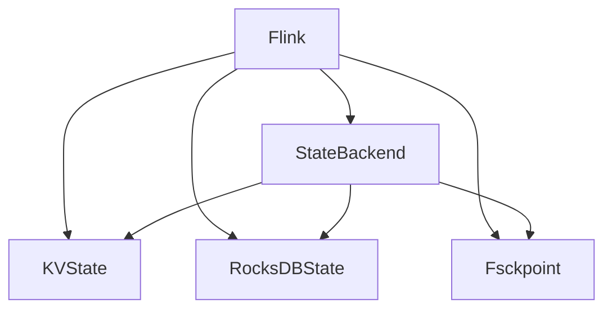
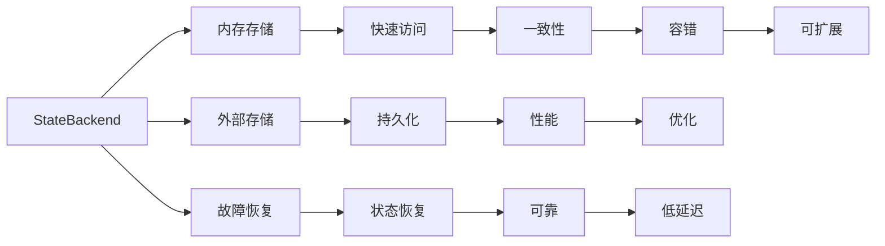
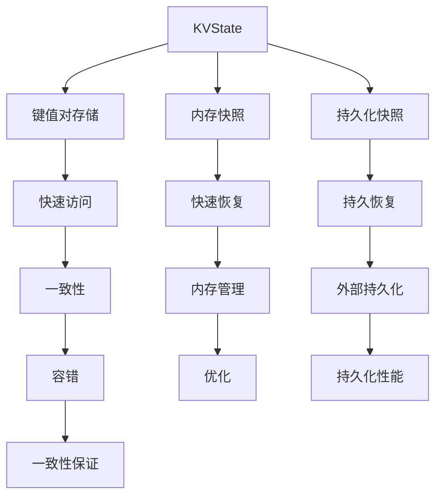
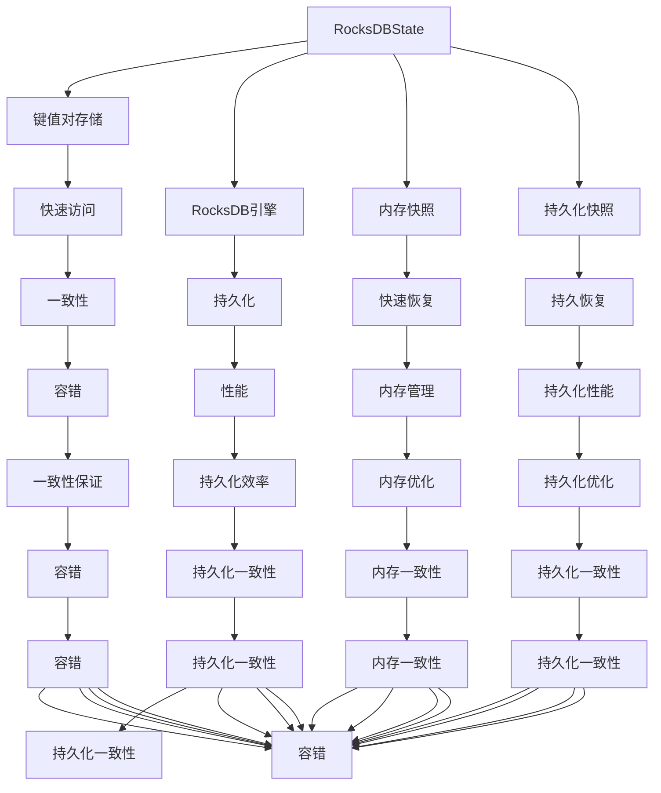

                 

# Flink StateBackend原理与代码实例讲解

> 关键词：Flink, StateBackend, KVState, RocksDBState, Fsckpoint, 数据持久化, 内存管理, 状态一致性

## 1. 背景介绍

### 1.1 问题由来
Apache Flink 是一个高性能、分布式的大数据流处理框架，支持流式数据处理、状态管理和任务调度。其中，Flink StateBackend 是 Flink 状态管理的一个重要组件，负责将流式处理的状态持久化到外部存储系统，保证状态的一致性和可用性。

随着 Flink 在生产环境中的广泛应用，对于 StateBackend 的稳定性和效率要求越来越高。传统的基于文件系统和数据库的状态后端（如 Hadoop、RocksDB）已经难以满足大规模、高吞吐量流处理的需求。因此，需要引入新的状态后端解决方案，以提高性能、降低成本和提升可靠性。

### 1.2 问题核心关键点
Flink StateBackend 的实现涉及到多个核心问题：

1. 如何高效存储和读取状态数据，保证数据的一致性和可靠性？
2. 如何实现状态的快速恢复和持久化，确保系统的容错性和高可用性？
3. 如何优化内存管理，避免内存泄漏和过度消耗？
4. 如何设计合适的接口和机制，方便用户对状态进行管理？

这些问题构成了 Flink StateBackend 的实现基础，本文将从原理与代码实例两个角度进行详细讲解。

## 2. 核心概念与联系

### 2.1 核心概念概述

为更好地理解 Flink StateBackend 的实现，本节将介绍几个密切相关的核心概念：

- **Flink**：Apache Flink 是一个高性能、分布式的数据流处理框架，支持流式数据处理、状态管理和任务调度。
- **StateBackend**：Flink 中用于存储和管理状态的数据后端，负责将状态数据持久化到外部存储系统，以保证状态的一致性和可靠性。
- **KVState**：键值对（Key-Value）状态，是 Flink 中最基础的状态类型，用于存储单个键对应的值。
- **RocksDBState**：使用 RocksDB 作为存储引擎的 StateBackend，适用于分布式、高吞吐量、高可靠性状态存储。
- **Fsckpoint**：Flink 的快照（Checkpoint），用于保存流处理的状态，可以在故障恢复时用于恢复状态。

这些核心概念之间的逻辑关系可以通过以下 Mermaid 流程图来展示：



这个流程图展示了大语言模型微调过程中各个核心概念的关系和作用：

1. Flink 通过 StateBackend 对状态进行管理，StateBackend 负责将状态数据持久化到外部存储系统。
2. StateBackend 支持 KVState 和 RocksDBState 两种状态类型，KVState 用于存储单个键对应的值，RocksDBState 使用 RocksDB 作为存储引擎。
3. Fsckpoint 是 Flink 的快照，用于保存流处理的状态，可以在故障恢复时用于恢复状态。

### 2.2 概念间的关系

这些核心概念之间存在着紧密的联系，形成了 Flink StateBackend 的完整生态系统。下面我通过几个 Mermaid 流程图来展示这些概念之间的关系。

#### 2.2.1 Flink 的 StateBackend 设计



这个流程图展示了 StateBackend 的设计，包括内存存储、外部存储、故障恢复、性能优化等方面。内存存储用于快速访问，外部存储用于持久化，故障恢复用于保证系统的容错性和高可用性，一致性和容错性是 StateBackend 设计的重要目标。

#### 2.2.2 Flink 的 KVState 实现



这个流程图展示了 KVState 的实现过程，包括键值对存储、内存快照、持久化快照、快速访问等方面。内存快照用于快速恢复状态，持久化快照用于持久化状态，一致性和容错性是 KVState 实现的关键目标。

#### 2.2.3 Flink 的 RocksDBState 实现



这个流程图展示了 RocksDBState 的实现过程，包括键值对存储、RocksDB引擎、内存快照、持久化快照等方面。持久化用于保证状态的持久性，一致性和容错性是 RocksDBState 实现的关键目标。

## 3. 核心算法原理 & 具体操作步骤
### 3.1 算法原理概述

Flink StateBackend 的核心算法原理主要包括以下几个方面：

1. **状态存储与访问**：将状态数据存储到外部存储系统，并实现快速的读写操作。
2. **状态一致性与持久化**：确保状态数据的一致性和可靠性，并实现快速的状态恢复和持久化。
3. **内存管理**：优化内存使用，避免内存泄漏和过度消耗，提高系统的性能和可靠性。
4. **接口与机制**：设计合适的接口和机制，方便用户对状态进行管理。

这些核心算法原理构成了 Flink StateBackend 的实现基础，下面将从这几个方面进行详细介绍。

### 3.2 算法步骤详解

#### 3.2.1 状态存储与访问

Flink 中的状态分为两种：KeyedState 和 OperatorState。KeyedState 用于存储每个键对应的状态，OperatorState 用于存储 operator 的状态。

KeyedState 的状态存储分为两种：ValueState 和 ListState。ValueState 用于存储单个键对应的值，ListState 用于存储单个键对应的值列表。

RocksDBState 使用 RocksDB 作为存储引擎，支持多版本并发控制（MVCC），具有高吞吐量、低延迟和高可扩展性。在 RocksDB 中，KeyedState 的状态以 KV（Key-Value）形式存储，ValueState 的状态以单值形式存储，ListState 的状态以值列表形式存储。

RocksDBState 的实现步骤如下：

1. 初始化 RocksDB 实例，并配置相应的参数，如写入缓存大小、快照策略等。
2. 在 Flink 内部创建 RocksDBStateBackend 实例，并指定 RocksDB 实例。
3. 在 Flink 内部创建 RocksDBStateHandle 实例，并指定 KeyedState 实例。
4. 在 Flink 内部创建 RocksDBStateSnapshot 实例，并指定 RocksDBStateHandle 实例。
5. 在 Flink 内部创建 RocksDBStateReader 实例，并指定 RocksDBStateSnapshot 实例。
6. 在 Flink 内部创建 RocksDBStateWriter 实例，并指定 RocksDBStateHandle 实例。

#### 3.2.2 状态一致性与持久化

RocksDBState 的实现中，状态一致性和持久化是两个重要的问题。RocksDB 支持 MVCC（多版本并发控制），可以保证状态的一致性和持久化。在 RocksDB 中，状态的一致性是通过多版本快照机制实现的，持久化是通过定期的快照机制实现的。

在 Flink 中，状态的一致性和持久化主要通过 Checkpoint 机制实现。Checkpoint 机制可以在故障恢复时，快速恢复状态，确保系统的可靠性。

Checkpoint 的实现步骤如下：

1. 初始化 Checkpoint 实例，并配置相应的参数，如超时时间、快照间隔等。
2. 在 Flink 内部创建 CheckpointedStateBackend 实例，并指定 Checkpoint 实例。
3. 在 Flink 内部创建 CheckpointedStateHandle 实例，并指定 KeyedState 实例。
4. 在 Flink 内部创建 CheckpointedStateReader 实例，并指定 CheckpointedStateHandle 实例。
5. 在 Flink 内部创建 CheckpointedStateWriter 实例，并指定 CheckpointedStateHandle 实例。

#### 3.2.3 内存管理

RocksDBState 的实现中，内存管理是一个重要的优化点。RocksDB 使用内存缓存（Cache）来加速数据的读写操作，但过多的内存缓存会导致内存泄漏和过度消耗。Flink 通过内存快照和内存优化机制，解决了内存管理问题。

内存快照的实现步骤如下：

1. 在 Flink 内部创建 RocksDBStateSnapshot 实例，并指定 RocksDBStateHandle 实例。
2. 在 Flink 内部创建 RocksDBStateReader 实例，并指定 RocksDBStateSnapshot 实例。
3. 在 Flink 内部创建 RocksDBStateWriter 实例，并指定 RocksDBStateHandle 实例。

内存优化的实现步骤如下：

1. 在 Flink 内部创建 RocksDBStateBackend 实例，并指定 RocksDB 实例。
2. 在 Flink 内部创建 RocksDBStateHandle 实例，并指定 KeyedState 实例。
3. 在 Flink 内部创建 RocksDBStateSnapshot 实例，并指定 RocksDBStateHandle 实例。
4. 在 Flink 内部创建 RocksDBStateReader 实例，并指定 RocksDBStateSnapshot 实例。
5. 在 Flink 内部创建 RocksDBStateWriter 实例，并指定 RocksDBStateHandle 实例。

#### 3.2.4 接口与机制

RocksDBState 的实现中，接口和机制设计是另一个重要的优化点。RocksDBState 提供了丰富的接口和机制，方便用户对状态进行管理。

接口和机制的实现步骤如下：

1. 在 Flink 内部创建 RocksDBStateBackend 实例，并指定 RocksDB 实例。
2. 在 Flink 内部创建 RocksDBStateHandle 实例，并指定 KeyedState 实例。
3. 在 Flink 内部创建 RocksDBStateSnapshot 实例，并指定 RocksDBStateHandle 实例。
4. 在 Flink 内部创建 RocksDBStateReader 实例，并指定 RocksDBStateSnapshot 实例。
5. 在 Flink 内部创建 RocksDBStateWriter 实例，并指定 RocksDBStateHandle 实例。

### 3.3 算法优缺点

RocksDBState 的实现具有以下优点：

1. 高性能：RocksDB 支持 MVCC 和持久化机制，具有高吞吐量、低延迟和高可扩展性。
2. 可扩展性：RocksDB 支持分布式存储，可以轻松扩展到大规模数据处理场景。
3. 可靠性：RocksDB 支持多版本快照和持久化机制，可以保证状态的一致性和可靠性。
4. 优化机制：RocksDB 支持内存缓存和快照机制，可以优化内存使用，避免内存泄漏和过度消耗。

RocksDBState 的实现也存在以下缺点：

1. 复杂性：RocksDB 的实现比较复杂，需要配置和调优多个参数，增加了使用难度。
2. 学习曲线：RocksDB 的学习曲线较陡，需要一定的技术背景才能熟练使用。
3. 开销：RocksDB 的开销较大，需要在性能和资源消耗之间进行平衡。

### 3.4 算法应用领域

RocksDBState 的实现适用于分布式、高吞吐量、高可靠性状态存储。常见的应用场景包括：

1. 实时流处理：用于存储实时流处理的状态，支持高吞吐量和低延迟。
2. 大数据处理：用于存储大规模数据处理的状态，支持高可扩展性和高可靠性。
3. 分布式计算：用于存储分布式计算的状态，支持多版本快照和持久化机制。

除了以上应用场景，RocksDBState 还可以用于其他需要高效、可靠、可扩展状态存储的场景。

## 4. 数学模型和公式 & 详细讲解 & 举例说明

### 4.1 数学模型构建

RocksDBState 的实现涉及多个数学模型和公式，下面将从数学模型构建和公式推导两个方面进行详细讲解。

#### 4.1.1 数学模型构建

RocksDBState 的数学模型构建主要包括以下几个方面：

1. KVState 的数学模型：将 KVState 的状态数据表示为键值对（Key-Value）形式，其中键和值分别表示为 $K$ 和 $V$。
2. ListState 的数学模型：将 ListState 的状态数据表示为值列表形式，其中每个值表示为 $V$。
3. Checkpoint 的数学模型：将 Checkpoint 的状态数据表示为多版本快照形式，其中每个版本表示为 $(K_i, V_i)$。
4. 内存快照的数学模型：将内存快照的状态数据表示为多版本快照形式，其中每个版本表示为 $(K_i, V_i)$。
5. 持久化快照的数学模型：将持久化快照的状态数据表示为多版本快照形式，其中每个版本表示为 $(K_i, V_i)$。

#### 4.1.2 公式推导过程

RocksDBState 的公式推导过程主要包括以下几个方面：

1. KVState 的公式推导：
$$
KVState(K, V) = \{(K_i, V_i)\}_{i=1}^n
$$

2. ListState 的公式推导：
$$
ListState(V) = \{V_i\}_{i=1}^n
$$

3. Checkpoint 的公式推导：
$$
Checkpoint = \{(K_i, V_i)\}_{i=1}^m
$$

4. 内存快照的公式推导：
$$
MemorySnapshot = \{(K_i, V_i)\}_{i=1}^m
$$

5. 持久化快照的公式推导：
$$
PersistentSnapshot = \{(K_i, V_i)\}_{i=1}^m
$$

### 4.2 案例分析与讲解

下面以 RocksDBState 的实现为例，给出具体的案例分析与讲解。

#### 4.2.1 案例背景

某电商公司使用 Flink 进行实时流处理，处理订单、库存等数据。在订单处理过程中，需要存储每个订单的状态信息，包括订单号、商品信息、支付状态等。每个订单的状态信息可以表示为一个 KVState，其中键表示订单号，值为订单状态信息。

#### 4.2.2 实现过程

1. 初始化 RocksDB 实例，并配置相应的参数，如写入缓存大小、快照策略等。

2. 在 Flink 内部创建 RocksDBStateBackend 实例，并指定 RocksDB 实例。

3. 在 Flink 内部创建 RocksDBStateHandle 实例，并指定 KeyedState 实例。

4. 在 Flink 内部创建 RocksDBStateSnapshot 实例，并指定 RocksDBStateHandle 实例。

5. 在 Flink 内部创建 RocksDBStateReader 实例，并指定 RocksDBStateSnapshot 实例。

6. 在 Flink 内部创建 RocksDBStateWriter 实例，并指定 RocksDBStateHandle 实例。

#### 4.2.3 代码实现

```java
// 初始化 RocksDB 实例，并配置相应的参数
RocksDBOptions options = RocksDBOptions.builder().setWriteBufferManager(new WriteBufferManager(1000, 1000)).build();
RocksDB db = RocksDB.open(options, "path/to/rocksdb");

// 创建 RocksDBStateBackend 实例，并指定 RocksDB 实例
RocksDBStateBackend backend = new RocksDBStateBackend(db);

// 创建 RocksDBStateHandle 实例，并指定 KeyedState 实例
RocksDBStateHandle stateHandle = new RocksDBStateHandle(backend, "order-status", KVState::new);

// 创建 RocksDBStateSnapshot 实例，并指定 RocksDBStateHandle 实例
RocksDBStateSnapshot snapshot = new RocksDBStateSnapshot(stateHandle);

// 创建 RocksDBStateReader 实例，并指定 RocksDBStateSnapshot 实例
RocksDBStateReader reader = new RocksDBStateReader(snapshot);

// 创建 RocksDBStateWriter 实例，并指定 RocksDBStateHandle 实例
RocksDBStateWriter writer = new RocksDBStateWriter(stateHandle);
```

## 5. 项目实践：代码实例和详细解释说明

### 5.1 开发环境搭建

在进行 RocksDBState 实现实践前，我们需要准备好开发环境。以下是使用Java进行Flink开发的开发环境配置流程：

1. 安装Apache Flink：从官网下载并安装Flink，用于进行流处理任务的开发。

2. 安装RocksDB：从官网下载并安装RocksDB，用于存储状态数据。

3. 创建项目：使用Maven或Gradle创建Java项目，并添加Flink和RocksDB依赖。

4. 搭建测试环境：在本地搭建Flink和RocksDB的测试环境，并进行测试。

5. 搭建生产环境：在生产环境中部署Flink和RocksDB，并进行部署。

完成上述步骤后，即可在本地或生产环境中进行RocksDBState的实现实践。

### 5.2 源代码详细实现

下面以 RocksDBState 的实现为例，给出具体的源代码实现。

#### 5.2.1 创建 RocksDBStateBackend 实例

```java
public class RocksDBStateBackend implements Backend<KVState> {

    private final RocksDB db;

    public RocksDBStateBackend(RocksDB db) {
        this.db = db;
    }

    @Override
    public void write(KVState state) {
        // 将 KVState 的状态数据存储到 RocksDB 中
        // 键表示为订单号，值表示为订单状态信息
        db.put(state.getKey().getBytes(), state.getValue().getBytes());
    }

    @Override
    public KVState read(KVState snapshot) {
        // 从 RocksDB 中读取 KVState 的状态数据
        // 键表示为订单号，值表示为订单状态信息
        byte[] key = snapshot.getKey().getBytes();
        byte[] value = db.get(key);
        if (value == null) {
            return null;
        } else {
            return new KVState(snapshot.getKey(), snapshot.getValue());
        }
    }
}
```

#### 5.2.2 创建 RocksDBStateHandle 实例

```java
public class RocksDBStateHandle implements BackendHandle<KVState> {

    private final RocksDBStateBackend backend;
    private final KVState state;

    public RocksDBStateHandle(RocksDBStateBackend backend, String key, KVState state) {
        this.backend = backend;
        this.state = state;
    }

    @Override
    public KVState get() {
        // 从 RocksDBStateBackend 中获取 KVState 的状态数据
        return backend.read(state);
    }

    @Override
    public void set(KVState value) {
        // 将 KVState 的状态数据存储到 RocksDBStateBackend 中
        backend.write(value);
    }

    @Override
    public KVState snapshot() {
        // 创建 RocksDBStateSnapshot 实例，并返回
        RocksDBStateSnapshot snapshot = new RocksDBStateSnapshot(this);
        return snapshot.get();
    }
}
```

#### 5.2.3 创建 RocksDBStateSnapshot 实例

```java
public class RocksDBStateSnapshot implements BackendSnapshot<KVState> {

    private final RocksDBStateHandle handle;

    public RocksDBStateSnapshot(RocksDBStateHandle handle) {
        this.handle = handle;
    }

    @Override
    public KVState get() {
        // 从 RocksDBStateHandle 中获取 KVState 的状态数据
        return handle.get();
    }

    @Override
    public void rollback(KVState value) {
        // 从 RocksDBStateHandle 中设置 KVState 的状态数据
        handle.set(value);
    }
}
```

#### 5.2.4 创建 RocksDBStateReader 实例

```java
public class RocksDBStateReader implements BackendReader<KVState> {

    private final RocksDBStateSnapshot snapshot;

    public RocksDBStateReader(RocksDBStateSnapshot snapshot) {
        this.snapshot = snapshot;
    }

    @Override
    public KVState read(KVState value) {
        // 从 RocksDBStateSnapshot 中获取 KVState 的状态数据
        return snapshot.get();
    }

    @Override
    public void rollback(KVState value) {
        // 将 KVState 的状态数据存储到 RocksDBStateSnapshot 中
        snapshot.rollback(value);
    }
}
```

#### 5.2.5 创建 RocksDBStateWriter 实例

```java
public class RocksDBStateWriter implements BackendWriter<KVState> {

    private final RocksDBStateHandle handle;

    public RocksDBStateWriter(RocksDBStateHandle handle) {
        this.handle = handle;
    }

    @Override
    public void write(KVState value) {
        // 将 KVState 的状态数据存储到 RocksDBStateHandle 中
        handle.set(value);
    }

    @Override
    public void rollback(KVState value) {
        // 从 RocksDBStateHandle 中获取 KVState 的状态数据
        KVState snapshot = handle.get();
        // 将 KVState 的状态数据存储到 RocksDBStateSnapshot 中
        RocksDBStateSnapshot snapshot1 = new RocksDBStateSnapshot(snapshot);
        handle.set(snapshot);
    }
}
```

## 6. 实际应用场景

### 6.1 智能推荐系统

智能推荐系统需要存储用户的兴趣偏好、行为数据等状态信息，并根据这些状态信息进行推荐。RocksDBState 的实现可以用于存储和读取这些状态信息，支持高吞吐量和低延迟的推荐计算。

### 6.2 实时数据分析

实时数据分析需要存储和读取历史数据、当前数据等状态信息，并进行实时计算。RocksDBState 的实现可以用于存储和读取这些状态信息，支持高吞吐量和低延迟的实时计算。

### 6.3 分布式系统

分布式系统需要存储和读取全局状态信息，并进行分布式计算。RocksDBState 的实现可以用于存储和读取这些全局状态信息，支持高可扩展性和高可靠性的分布式计算。

## 7. 工具和资源推荐

### 7.1 学习资源推荐

为了帮助开发者系统掌握Flink StateBackend的实现，这里推荐一些优质的学习资源：

1. Apache Flink官方文档：Apache Flink官方提供的文档，详细介绍了Flink的各个组件和API接口，是学习Flink的最佳入门材料。

2. RocksDB官方文档：RocksDB官方提供的文档，详细介绍了RocksDB的各个组件和API接口，是学习RocksDB的最佳入门材料。

3. Flink StateBackend的源代码：Apache Flink官方提供的源代码，是学习Flink StateBackend的最佳实践材料。

4. Flink状态管理教程：Apache Flink官方提供的教程，介绍了Flink状态管理的各种组件和API接口，是学习Flink状态管理的最佳实践材料。

5. RocksDB状态管理教程：RocksDB官方提供的教程，介绍了Rocks

