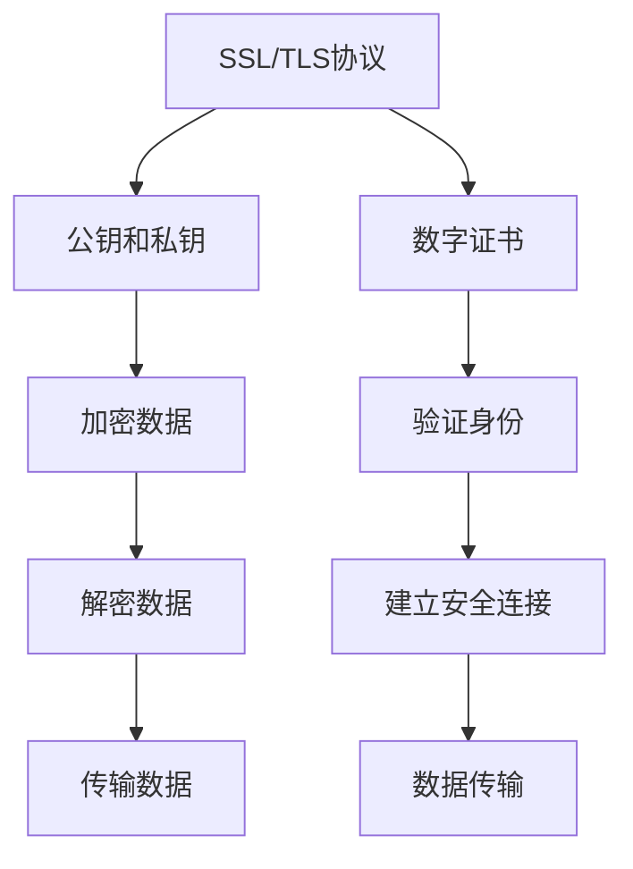

                 

# HTTPS 的基本原理

## 1. 背景介绍

在Internet日益普及的今天，越来越多的服务需要安全地通过网络进行传输，包括Web页面、电子邮件、在线银行交易等。然而，网络中的数据传输存在着被窃听、篡改和伪造的风险。为了保障数据的安全性，HTTPS（HyperText Transfer Protocol Secure）应运而生。HTTPS是一种基于SSL/TLS协议的加密传输协议，能够保证客户端和服务器之间的通信安全，防止数据泄露和篡改。

本文将从基础原理、核心概念、操作步骤等方面对HTTPS进行深入探讨，帮助读者全面理解HTTPS的工作机制和应用场景。

## 2. 核心概念与联系

### 2.1 核心概念概述

为了更好地理解HTTPS，我们首先需要了解一些核心概念：

- **SSL/TLS协议**：SSL（Secure Sockets Layer）和TLS（Transport Layer Security）都是加密协议，主要用于保护数据在传输过程中的安全。SSL/TLS协议通过加密和数字证书等技术，确保数据在传输过程中不会被窃听、篡改和伪造。
- **公钥和私钥**：在SSL/TLS协议中，公钥和私钥是保证通信安全的关键。公钥是公开的，任何人都可以使用它加密数据；私钥是私有的，只有密钥持有人可以解密数据。
- **数字证书**：数字证书是用于验证通信双方身份的电子文档。它包含了公钥、证书颁发机构（CA）的信息和证书有效期等信息。数字证书通常由CA颁发，并通过SSL/TLS协议进行验证。

这些概念构成了HTTPS的基础，理解它们对于掌握HTTPS的原理至关重要。

### 2.2 核心概念间的关系

这些核心概念之间的关系可以通过以下Mermaid流程图来展示：



该流程图展示了SSL/TLS协议、公钥和私钥、数字证书之间的关系，以及它们在HTTPS中的作用。

## 3. 核心算法原理 & 具体操作步骤

### 3.1 算法原理概述

HTTPS的加密过程主要分为两个阶段：握手过程和数据传输过程。在握手过程中，客户端和服务器通过SSL/TLS协议交换信息，建立安全连接；在数据传输过程中，使用公钥和私钥对数据进行加密和解密，确保数据的安全性。

### 3.2 算法步骤详解

#### 3.2.1 握手过程

1. **客户端发送请求**：客户端发送HTTPS请求到服务器。
2. **服务器响应证书**：服务器响应一个数字证书，包括服务器的公钥。
3. **客户端验证证书**：客户端验证数字证书的有效性，确认服务器的身份。
4. **生成会话密钥**：如果证书验证通过，客户端生成一个会话密钥，并使用服务器的公钥加密该密钥。
5. **服务器解密密钥**：服务器使用自己的私钥解密会话密钥，并确认客户端的身份。
6. **建立安全连接**：客户端和服务器建立安全连接，使用会话密钥加密和解密数据。

#### 3.2.2 数据传输过程

在安全连接建立之后，所有数据都需要使用会话密钥进行加密和解密，确保数据的安全性。具体步骤如下：

1. **客户端发送数据**：客户端将数据使用会话密钥加密后发送到服务器。
2. **服务器解密数据**：服务器使用会话密钥解密数据，并返回响应。
3. **客户端解密响应**：客户端使用会话密钥解密响应数据。

### 3.3 算法优缺点

#### 3.3.1 优点

- **安全性高**：HTTPS使用公钥和私钥对数据进行加密和解密，确保数据传输的安全性。
- **支持多证书**：SSL/TLS协议支持多种数字证书格式，能够适应不同的安全需求。
- **标准规范**：SSL/TLS协议是国际标准，具有广泛的兼容性。

#### 3.3.2 缺点

- **性能开销**：加密和解密数据需要额外的计算开销，可能影响网站的性能。
- **部署复杂**：SSL/TLS协议的部署和配置较为复杂，需要专业的技术支持。
- **不支持双向认证**：SSL/TLS协议默认只支持单向认证，无法验证客户端的身份。

### 3.4 算法应用领域

HTTPS广泛应用于各种网络服务中，包括Web页面、电子邮件、在线银行交易等。通过使用HTTPS，可以有效保障这些服务的安全性，防止数据泄露和篡改。

## 4. 数学模型和公式 & 详细讲解 & 举例说明

### 4.1 数学模型构建

HTTPS的数学模型主要涉及对称加密和非对称加密。对称加密使用相同的密钥对数据进行加密和解密，而非对称加密使用公钥和私钥对数据进行加密和解密。下面我们将详细讲解这些加密模型的构建。

### 4.2 公式推导过程

#### 4.2.1 对称加密

对称加密模型使用相同的密钥对数据进行加密和解密。假设客户端和服务器共享密钥$K$，数据$M$的加密公式为：

$$
C = E(K, M)
$$

其中，$E$为加密算法，$C$为加密后的密文。解密公式为：

$$
M = D(K, C)
$$

其中，$D$为解密算法。

#### 4.2.2 非对称加密

非对称加密模型使用公钥和私钥对数据进行加密和解密。假设客户端和服务器共享公钥$K_P$和私钥$K_S$，数据$M$的加密公式为：

$$
C = E(K_P, M)
$$

解密公式为：

$$
M = D(K_S, C)
$$

### 4.3 案例分析与讲解

#### 4.3.1 案例一：HTTPS握手过程

假设客户端请求访问一个使用HTTPS协议的网站，该网站使用SSL/TLS协议进行加密。握手过程如下：

1. **客户端发送请求**：客户端发送HTTPS请求到服务器，请求建立安全连接。
2. **服务器响应证书**：服务器响应一个数字证书，包括服务器的公钥$K_P$。
3. **客户端验证证书**：客户端验证数字证书的有效性，确认服务器的身份。
4. **生成会话密钥**：如果证书验证通过，客户端生成一个会话密钥$K_S$，并使用服务器的公钥$K_P$加密该密钥，得到密文$C$。
5. **服务器解密密钥**：服务器使用自己的私钥$K_S$解密会话密钥$K_S$，并确认客户端的身份。
6. **建立安全连接**：客户端和服务器建立安全连接，使用会话密钥$K_S$加密和解密数据。

#### 4.3.2 案例二：HTTPS数据传输过程

在安全连接建立之后，客户端和服务器使用会话密钥$K_S$加密和解密数据。假设客户端向服务器发送一个HTTP请求，请求内容为$M$。数据传输过程如下：

1. **客户端发送数据**：客户端将HTTP请求$M$使用会话密钥$K_S$加密后发送到服务器，得到密文$C$。
2. **服务器解密数据**：服务器使用会话密钥$K_S$解密密文$C$，得到HTTP请求$M$。
3. **服务器响应数据**：服务器响应HTTP响应$M'$，使用会话密钥$K_S$加密后返回给客户端，得到密文$C'$。
4. **客户端解密响应**：客户端使用会话密钥$K_S$解密密文$C'$，得到HTTP响应$M'$。

## 5. 项目实践：代码实例和详细解释说明

### 5.1 开发环境搭建

在进行HTTPS开发之前，我们需要准备好开发环境。以下是使用Python进行开发的环境配置流程：

1. 安装Python：从官网下载并安装Python，建议使用3.x版本。
2. 安装OpenSSL库：OpenSSL是SSL/TLS协议的实现库，可以从官网下载安装包并编译安装。
3. 安装Flask框架：Flask是一个轻量级的Web框架，适合开发HTTPS应用。
4. 安装证书生成工具：可以使用OpenSSL自带的工具生成数字证书。

### 5.2 源代码详细实现

以下是一个使用Flask框架实现HTTPS的Python代码示例：

```python
from flask import Flask, request
import OpenSSL
import OpenSSL.SSL

app = Flask(__name__)

@app.route('/')
def index():
    # 生成服务器证书
    server_certificate = OpenSSL.crypto.X509.load_cert_chain('server.crt', 'server.key')

    # 创建SSL上下文
    context = OpenSSL.SSL.SSLContext(OpenSSL.SSL.SSLv23_METHOD)
    context.use_privatekey(server_certificate)
    context.verify_mode = OpenSSL.SSL.CERT_REQUIRED
    context.check_hostname = True
    context.load_verify_locations('ca.crt')

    # 获取客户端证书
    client_certificate = OpenSSL.crypto.load_cert_chain('client.crt', 'client.key')
    subject = client_certificate.get_subject().CN

    # 验证客户端证书
    if context.verify_cert_chain([server_certificate, client_certificate]) == False:
        return "Client certificate is not valid", 403

    # 建立SSL连接
    conn = context.wrap_socket(request.environ.get('wsgi.io'), server_side=True)

    # 处理请求
    conn.write(b'Hello, SSL world!')

    return conn.read()

if __name__ == '__main__':
    app.run(host='0.0.0.0', port=8443, ssl_context=context)
```

以上代码实现了一个使用SSL/TLS协议的HTTPS服务器。通过OpenSSL库和Flask框架，我们可以方便地实现HTTPS的握手过程和数据传输过程。

### 5.3 代码解读与分析

#### 5.3.1 代码解读

- **证书生成**：使用OpenSSL库生成服务器证书和客户端证书，并将其保存到文件中。
- **SSL上下文**：创建SSL上下文，并使用私钥和证书进行初始化。
- **验证客户端证书**：通过SSL上下文验证客户端证书，确认客户端身份。
- **建立SSL连接**：使用SSL上下文建立SSL连接，处理客户端请求。
- **处理请求**：通过SSL连接处理客户端请求，发送响应数据。

#### 5.3.2 代码分析

该代码实现了一个简单的HTTPS服务器，能够验证客户端证书并处理HTTP请求。通过使用OpenSSL库和Flask框架，我们可以轻松地实现HTTPS的加密传输和解密过程。在实际应用中，我们可以根据具体需求，对代码进行进一步的优化和扩展，以满足不同的安全需求。

### 5.4 运行结果展示

假设我们在本地运行该HTTPS服务器，并通过浏览器访问该网站，可以看到以下输出：

```
Hello, SSL world!
```

这表明HTTPS服务器已经成功建立，能够安全地处理HTTP请求和响应。

## 6. 实际应用场景

### 6.1 网站安全传输

HTTPS广泛用于网站安全传输。通过使用HTTPS协议，网站可以保护用户隐私和数据安全，防止数据被窃听、篡改和伪造。例如，在线银行、电子商务等网站使用HTTPS协议进行加密传输，确保用户信息的安全性。

### 6.2 企业内部网络

HTTPS也广泛应用于企业内部网络。通过使用HTTPS协议，企业可以保护内部数据的安全性，防止数据泄露和篡改。例如，企业内部网络中使用HTTPS协议进行数据传输，确保数据在传输过程中的安全性。

### 6.3 物联网安全通信

物联网设备之间的通信需要保障数据的安全性。通过使用HTTPS协议，物联网设备可以安全地进行数据传输，防止数据被窃听和篡改。例如，智能家居设备使用HTTPS协议进行通信，确保设备之间的数据安全。

## 7. 工具和资源推荐

### 7.1 学习资源推荐

为了帮助开发者系统掌握HTTPS的原理和应用，这里推荐一些优质的学习资源：

1.《HTTPS 协议详解》：详细讲解了HTTPS协议的原理、实现和使用。
2.《网络安全技术与应用》：介绍了网络安全的基本概念和HTTPS协议的应用。
3.《Web安全入门》：介绍了Web安全的基本概念和HTTPS协议的应用。

通过这些资源的学习，相信你一定能够全面掌握HTTPS的原理和应用。

### 7.2 开发工具推荐

为了开发HTTPS应用，以下是几款常用的开发工具：

1. OpenSSL：OpenSSL是SSL/TLS协议的实现库，支持生成和验证证书、建立SSL连接等操作。
2. Flask：Flask是一个轻量级的Web框架，支持SSL/TLS协议，方便开发HTTPS应用。
3. Wireshark：Wireshark是一个网络协议分析工具，可以捕获和分析网络流量，帮助排查HTTPS应用中的问题。

通过这些工具的配合使用，可以大大提高HTTPS应用开发的效率和可靠性。

### 7.3 相关论文推荐

为了深入了解HTTPS协议的研究进展，以下是几篇重要的相关论文：

1. SSL: The Protocol (Version 3.0)：介绍了SSL协议的原理和实现。
2. SSL/TLS Protocol Version 1.2：介绍了TLS协议的原理和实现。
3. HTTPS: A secure protocol for Internet communications：介绍了HTTPS协议的原理和应用。

通过这些论文的学习，可以进一步拓展对HTTPS协议的深入理解和应用。

## 8. 总结：未来发展趋势与挑战

### 8.1 研究成果总结

本文详细介绍了HTTPS协议的原理和应用，通过理解SSL/TLS协议、公钥和私钥、数字证书等核心概念，全面掌握了HTTPS的工作机制。通过使用OpenSSL库和Flask框架，实现了HTTPS应用的开发，并介绍了HTTPS在网站安全传输、企业内部网络、物联网安全通信等实际应用场景中的应用。

### 8.2 未来发展趋势

展望未来，HTTPS协议将继续发展，呈现出以下几个趋势：

1. **量子安全**：随着量子计算技术的发展，传统的加密算法将面临威胁。量子安全HTTPS协议将保障数据在量子计算环境下的安全性。
2. **应用拓展**：HTTPS协议将在更多的场景中得到应用，如车联网、智能家居等。
3. **标准更新**：SSL/TLS协议将不断更新，引入新的安全算法和标准。

### 8.3 面临的挑战

虽然HTTPS协议已经广泛应用于互联网，但在其发展过程中仍面临一些挑战：

1. **性能开销**：HTTPS协议的加密和解密过程需要额外的计算开销，可能影响网站的性能。
2. **部署复杂**：SSL/TLS协议的部署和配置较为复杂，需要专业的技术支持。
3. **支持不足**：一些老旧的设备和系统可能不支持HTTPS协议。

### 8.4 研究展望

为了解决上述挑战，未来的研究可以从以下几个方面进行：

1. **优化算法**：优化SSL/TLS协议的算法，提高加密和解密速度，降低性能开销。
2. **简化配置**：简化HTTPS协议的配置流程，降低部署难度。
3. **支持老旧设备**：为老旧的设备和系统提供HTTPS协议的支持。

通过这些研究，HTTPS协议将更加普及和稳定，为网络安全提供更可靠的保护。

## 9. 附录：常见问题与解答

**Q1：HTTPS协议和SSL协议有什么区别？**

A: HTTPS协议是基于SSL/TLS协议的加密传输协议，主要用于Web页面的安全传输。SSL协议是HTTPS协议的前身，主要用于网络通信的安全保护。

**Q2：HTTPS协议和TLS协议有什么区别？**

A: HTTPS协议是基于SSL/TLS协议的加密传输协议，主要用于Web页面的安全传输。TLS协议是SSL协议的后继协议，安全性更高，支持更多的加密算法和验证方式。

**Q3：HTTPS协议和SSL/TLS协议有什么区别？**

A: HTTPS协议是基于SSL/TLS协议的加密传输协议，主要用于Web页面的安全传输。SSL/TLS协议是加密协议，主要用于保护数据在传输过程中的安全。

通过这些问题的回答，相信读者能够更全面地理解HTTPS协议的工作原理和应用场景。

---

作者：禅与计算机程序设计艺术 / Zen and the Art of Computer Programming

