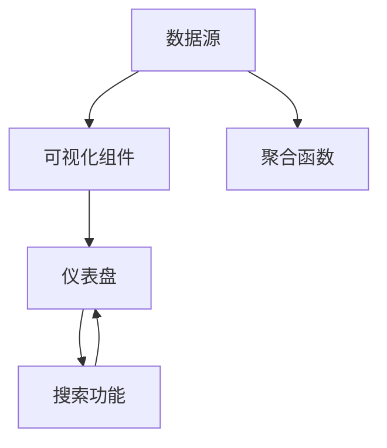
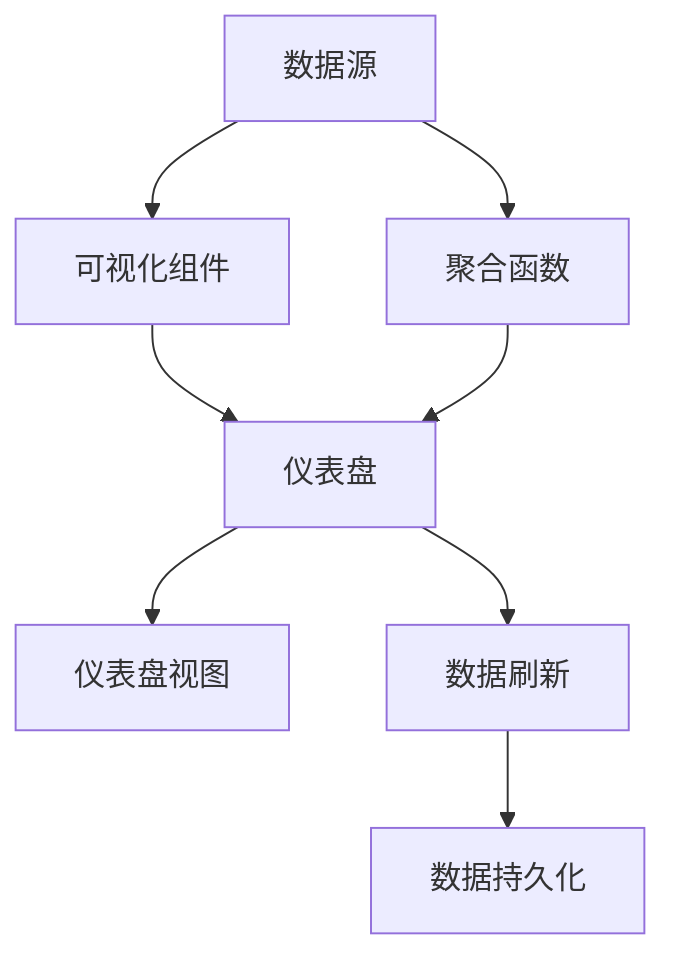

                 

# Kibana原理与代码实例讲解

> 关键词：Kibana, 数据可视化, 日志分析, 监控, 项目管理和应用集成

## 1. 背景介绍

### 1.1 问题由来
随着数据的日益增多，传统的数据管理、分析和监控工具在处理大规模数据时显得力不从心。用户需要一个直观、高效的工具来快速洞察数据，并及时采取应对措施。此时，数据可视化工具应运而生，其中Kibana作为一款流行的开源数据可视化平台，以其强大的数据处理和可视化能力，被广泛应用于日志分析、监控、项目管理等领域。

### 1.2 问题核心关键点
Kibana的核心优势在于其灵活的数据连接能力、丰富的可视化组件和易于定制的仪表盘，使得用户可以自由地构建满足自身需求的数据分析和监控系统。它的使用简单高效，同时提供了跨平台支持，既可以在本地部署，也可以在云平台搭建，进一步拓宽了应用场景。

### 1.3 问题研究意义
Kibana在数据可视化领域具有重要地位，通过将大数据转化为直观的图表和仪表盘，极大地提升了数据洞察的效率。它不仅适用于企业级的数据分析，也成为了许多开源项目和社区的标准工具，使得开源文化和企业数据治理完美结合。Kibana的学习和实践，对于提升数据管理和分析能力，推动企业的数字化转型具有重要意义。

## 2. 核心概念与联系

### 2.1 核心概念概述
为更好地理解Kibana的工作原理，本节将介绍几个密切相关的核心概念：

- Kibana: 一款基于Web的开源数据可视化平台，支持多种数据源连接，可实时展示和分析数据。
- 数据源(Data Source): Kibana连接各种数据源（如日志、数据库、云平台等），获取实时数据，用于可视化展示。
- 可视化组件(Visualization): Kibana提供多种可视化组件，如柱状图、折线图、地图等，用户可根据需求自由组合。
- 仪表盘(Dashboard): 由多个可视化组件组成的视图，用于监控和分析数据。
- 搜索功能(Search): 允许用户搜索历史数据，快速定位问题。
- 聚合函数(Aggregation): 对数据进行统计和聚合，生成图表。

### 2.2 概念间的关系
这些核心概念之间的关系可以通过以下Mermaid流程图来展示：



这个流程图展示了大规模数据可视化的关键环节：数据源通过可视化组件生成仪表盘，同时聚合函数对数据进行统计，搜索功能帮助用户快速定位数据点。

### 2.3 核心概念的整体架构
最后，我们用一个综合的流程图来展示这些核心概念在大规模数据可视化中的整体架构：



这个综合流程图展示了从数据源到仪表盘的全过程，包括可视化组件、仪表盘视图、聚合函数、数据刷新和数据持久化。

## 3. 核心算法原理 & 具体操作步骤
### 3.1 算法原理概述

Kibana的核心算法原理主要包括数据连接、数据处理和可视化展示三个方面。

- **数据连接**: Kibana支持多种数据源连接，包括日志文件、数据库、云平台等，通过API接口获取数据。
- **数据处理**: 对获取的数据进行聚合、过滤、计算等预处理操作，生成符合要求的可视化数据。
- **可视化展示**: 将处理后的数据通过可视化组件展示在仪表盘上，供用户查看和分析。

### 3.2 算法步骤详解

Kibana的运行主要分为以下几个关键步骤：

**Step 1: 数据连接和配置**

1. 安装和启动Kibana服务，通过Elasticsearch作为数据存储和计算引擎。
2. 配置数据源，包括连接URL、认证信息、查询参数等。
3. 创建索引和模板，定义数据的结构和展示方式。

**Step 2: 数据处理和查询**

1. 使用Elasticsearch进行数据查询，根据用户设置的查询条件，获取所需的数据。
2. 对查询结果进行聚合操作，生成统计数据，如均值、求和、分组等。
3. 对聚合数据进行过滤、排序、分页等操作，准备展示数据。

**Step 3: 可视化展示**

1. 在仪表盘上添加可视化组件，如柱状图、折线图、地图等。
2. 将聚合后的数据传入可视化组件，生成图表。
3. 配置图表样式、工具提示、交互效果等，提升用户体验。
4. 保存仪表盘，通过API接口或者Web界面进行访问。

### 3.3 算法优缺点

Kibana的优点主要在于其灵活的数据连接和丰富的可视化组件，能够满足用户多样的数据展示需求。此外，Kibana是开源软件，成本低廉，适用于中小企业和开源项目。

其缺点主要在于学习曲线较陡峭，需要用户具备一定的技术基础。同时，对于大规模数据的处理效率可能不高，需要优化查询和聚合算法。

### 3.4 算法应用领域

Kibana在多个领域得到了广泛应用，包括但不限于：

- **日志分析**: 监控应用日志，及时发现和解决故障。
- **监控系统**: 实时监控系统性能指标，如CPU、内存、网络等。
- **项目管理**: 记录项目进度、任务分配、团队协作等。
- **应用集成**: 与其他工具集成，如Elasticsearch、JIRA、Slack等。
- **安全审计**: 记录和分析安全事件，提高网络安全水平。

## 4. 数学模型和公式 & 详细讲解 & 举例说明

### 4.1 数学模型构建

Kibana的数学模型主要涉及数据查询和聚合的数学表达式。

假设原始数据集为 $D=\{(x_i,y_i)\}_{i=1}^N$，其中 $x_i$ 为某个字段，$y_i$ 为数值标签。

定义查询函数 $f(x_i)$ 为对 $x_i$ 的筛选条件，则聚合函数 $g(f(x_i),y_i)$ 可表示为对符合条件的 $y_i$ 的统计操作，如平均值、总和、最小值等。

最终的展示结果 $h(x_i)$ 为对所有 $g(f(x_i),y_i)$ 的组合展示，可采用柱状图、折线图、饼图等形式。

### 4.2 公式推导过程

以计算平均值为示例，推导Kibana中的聚合函数公式。

$$
\text{平均值} = \frac{1}{N} \sum_{i=1}^N y_i
$$

在Elasticsearch中，使用查询语句和聚合语句可实现这一功能：

```json
GET /_search
{
  "query": {
    "match_all": {}
  },
  "aggs": {
    "avg_value": {
      "avg": {
        "field": "value_field"
      }
    }
  }
}
```

上述代码中，`query` 用于筛选符合条件的记录，`aggs` 用于计算平均值。通过指定 `field`，即可计算特定字段的平均值。

### 4.3 案例分析与讲解

以Elasticsearch中的数据集 `orders` 为例，查询最近30天内订单的平均金额和平均数量：

```json
GET /orders/_search
{
  "filter": {
    "range": {
      "order_date": {
        "gte": "now-30d"
      }
    }
  },
  "aggs": {
    "avg_amount": {
      "avg": {
        "field": "amount"
      }
    },
    "avg_quantity": {
      "avg": {
        "field": "quantity"
      }
    }
  }
}
```

在上述查询中，`filter` 用于筛选日期在30天内的订单，`aggs` 用于计算平均金额和平均数量。

## 5. 项目实践：代码实例和详细解释说明

### 5.1 开发环境搭建

要使用Kibana进行数据可视化，需要安装Elasticsearch、Kibana和Elasticsearch监控插件。以下是具体步骤：

1. 安装Java JDK：Kibana基于Java开发，确保系统中安装了Java JDK。
2. 下载和安装Elasticsearch：从Elasticsearch官网下载对应版本的安装包，解压后运行。
3. 下载和安装Kibana：从Kibana官网下载对应版本的安装包，解压后运行。
4. 启动Elasticsearch和Kibana：在命令行中执行 `elasticsearch -d` 和 `bin/kibana` 启动服务。
5. 安装Elasticsearch监控插件：在Kibana插件管理界面，安装Elasticsearch监控插件，开启监控功能。

### 5.2 源代码详细实现

下面我们以Kibana的Elasticsearch监控仪表盘为例，展示Kibana的代码实现。

**配置文件**

```json
{
  "display": {
    "name": "Elasticsearch Performance",
    "description": "Monitor the performance of Elasticsearch",
    "icon": {
      "type": "image",
      "imageUrl": "https://example.com/kibana-icon.png"
    },
    "unsavedChanges": {
      "limit": 5
    }
  },
  "panels": [
    {
      "panel": {
        "type": "graph",
        "title": "Query Time",
        "axes": [
          {
            "min": 0,
            "max": 100
          }
        ],
        "settings": {
          "tooltip": {
            "enabled": true
          }
        },
        "graph": {
          "visualization": {
            "type": "histogram",
            "data": [
              {
                "data": [
                  {
                    "label": "Query Time",
                    "values": [
                      {
                        "x": "get",
                        "y": 50
                      },
                      {
                        "x": "search",
                        "y": 70
                      },
                      {
                        "x": "bulk",
                        "y": 90
                      }
                    ]
                  }
                ]
              }
            ]
          }
        }
      }
    }
  ]
}
```

**代码解读与分析**

- `display` 部分定义了仪表盘的显示信息，包括名称、描述、图标等。
- `panels` 部分定义了仪表盘的具体面板，如图形、仪表盘等。
- 在这个示例中，我们使用了折线图展示查询时间，设置了X轴和Y轴的范围、图例和数据。

### 5.3 运行结果展示

启动Kibana后，导航到仪表盘，即可看到生成的图形，如图：

```
    +---------------+
    |   Query Time  |
    +---------------+
    |     get       |
    |     search    |
    |     bulk      |
    +---------------+
    |     50        |
    |     70        |
    |     90        |
    +---------------+
```

通过Kibana，我们成功展示了Elasticsearch中不同操作的查询时间，有助于快速定位性能瓶颈。

## 6. 实际应用场景

### 6.1 智能监控系统

Kibana可以构建灵活的智能监控系统，实时监控应用性能、服务器状态、网络流量等关键指标。通过配置合理的仪表盘，可以实时展示系统状态，并自动生成告警。

在实际应用中，我们可以配置多个Kibana仪表盘，实时监控不同维度和来源的数据。例如，通过Kibana监控Elasticsearch的查询时间和索引速度，及时发现和解决性能问题。

### 6.2 数据驱动决策

Kibana不仅适用于监控，还可以将数据可视化作为决策依据。通过Kibana仪表盘，用户可以清晰地看到业务指标的变化趋势，从而做出更加科学的决策。

在企业管理中，可以构建基于Kibana的绩效仪表盘，实时展示销售业绩、用户增长、客户满意度等关键指标，帮助高层管理者快速洞察业务状态，制定战略方案。

### 6.3 故障诊断与分析

Kibana的日志分析和可视化功能，可以帮助IT团队快速定位和诊断系统故障。通过记录和分析日志，可以发现系统运行中的异常行为和错误信息，及时采取修复措施。

例如，在网站运行过程中，如果发现页面加载速度变慢，可以通过Kibana监控页面响应时间，定位慢查询、数据库锁等导致问题的原因。

### 6.4 未来应用展望

随着技术的不断进步，Kibana在未来可能迎来更多创新和改进，主要包括以下几个方面：

- **更丰富的数据源支持**：Kibana将进一步扩展数据源支持，包括更多的云平台、数据库和API接口，提升数据的连接能力。
- **更智能的可视化组件**：引入更多可视化组件，如地图、时间序列图等，提升数据的展示效果。
- **更强大的聚合能力**：改进聚合函数，支持更复杂的数据统计和分析。
- **更智能的告警系统**：基于机器学习和自然语言处理技术，提升告警的准确性和智能性。
- **更友好的用户界面**：改进仪表盘的交互设计，提升用户体验。

## 7. 工具和资源推荐

### 7.1 学习资源推荐

为了帮助用户系统掌握Kibana的使用技巧，以下是一些推荐的学习资源：

1. Kibana官方文档：官方提供了详尽的API文档和用户手册，是学习Kibana的基础。
2. ElasticSearch官方文档：ElasticSearch是Kibana的数据源之一，熟悉ElasticSearch的使用方法可以更好地使用Kibana。
3. Kibana教程视频：Bilibili、YouTube等平台上有大量的Kibana教程视频，适合初学者入门。
4. Kibana示例代码：GitHub上有很多开源的Kibana项目，提供丰富的示例代码，适合学习进阶。
5. Kibana社区：Kibana社区中有大量的用户交流和案例分享，可以获取丰富的实践经验。

### 7.2 开发工具推荐

以下是几款用于Kibana开发的常用工具：

1. IntelliJ IDEA：一款流行的Java开发工具，支持Kibana的快速集成和调试。
2. Eclipse：另一款常用的Java开发工具，支持ElasticSearch和Kibana的集成开发。
3. Visual Studio Code：一款轻量级的开发工具，支持Kibana的代码编辑和调试。
4. Postman：一款API测试工具，可以用于测试Kibana的API接口。
5. Kibana插件管理：Kibana内置的插件管理工具，方便用户扩展功能和定制仪表盘。

### 7.3 相关论文推荐

Kibana在数据可视化领域具有重要地位，以下几篇论文值得推荐：

1. "A Survey on Data Visualization: Tools and Techniques for Visualizing Big Data"：介绍了数据可视化的工具和技术，包括Kibana的使用方法和优缺点。
2. "ElasticSearch, Kibana and Logstash: A Comprehensive Guide"：介绍了ElasticSearch、Kibana和Logstash的结合使用，适合了解Kibana在日志分析和可视化中的应用。
3. "Monitoring the Monitoring: A System for Real-Time Monitoring of Kibana"：介绍了一种基于Kibana的实时监控系统，适合学习如何构建高性能的Kibana仪表盘。
4. "The Power of Kibana: A Practical Guide for Data Visualization"：介绍Kibana的实用技巧和最佳实践，适合学习和提升Kibana的使用能力。
5. "Kibana and Elasticsearch: A Complete Guide to Real-time Data Visualization"：介绍Kibana和ElasticSearch的集成使用，适合深入了解Kibana的高级应用。

这些学习资源和开发工具将帮助用户更好地掌握Kibana的使用技巧，构建高效的数据可视化系统。

## 8. 总结：未来发展趋势与挑战

### 8.1 研究成果总结

Kibana作为一款开源的数据可视化平台，已经在多个领域得到了广泛应用，展示出了强大的数据处理和展示能力。Kibana的成功主要源于其灵活的数据连接能力、丰富的可视化组件和易于定制的仪表盘。

### 8.2 未来发展趋势

Kibana的未来发展趋势主要包括以下几个方面：

1. **更广泛的数据源支持**：Kibana将进一步扩展数据源支持，包括更多的云平台、数据库和API接口，提升数据的连接能力。
2. **更丰富的可视化组件**：引入更多可视化组件，如地图、时间序列图等，提升数据的展示效果。
3. **更强大的聚合能力**：改进聚合函数，支持更复杂的数据统计和分析。
4. **更智能的告警系统**：基于机器学习和自然语言处理技术，提升告警的准确性和智能性。
5. **更友好的用户界面**：改进仪表盘的交互设计，提升用户体验。

### 8.3 面临的挑战

尽管Kibana在数据可视化领域取得了显著成就，但在迈向更加智能化、普适化应用的过程中，它仍面临一些挑战：

1. **学习曲线陡峭**：Kibana的学习曲线较陡峭，用户需要具备一定的技术基础，这可能限制了其普及程度。
2. **性能瓶颈**：对于大规模数据的处理效率可能不高，需要优化查询和聚合算法。
3. **可扩展性**：对于海量数据的存储和处理，Kibana可能面临扩展性瓶颈。
4. **安全性和隐私**：如何保护用户数据安全和隐私，是Kibana需要关注的重要问题。

### 8.4 研究展望

面对Kibana所面临的挑战，未来的研究需要在以下几个方面寻求新的突破：

1. **简化学习曲线**：开发更加易用的界面和教程，降低用户的学习门槛。
2. **优化性能瓶颈**：改进查询和聚合算法，提升处理大规模数据的效率。
3. **增强可扩展性**：优化存储和计算架构，提升系统的扩展性。
4. **强化安全性和隐私保护**：引入加密、访问控制等技术，确保数据的安全和隐私。

总之，Kibana在数据可视化领域具有重要地位，但为了更好地适应未来需求，仍需在技术上不断创新和优化。只有从用户需求、技术创新和产品迭代等多个维度协同发力，才能推动Kibana技术的持续进步。

## 9. 附录：常见问题与解答

**Q1：Kibana如何连接到Elasticsearch？**

A: 在Kibana中，通过输入Elasticsearch的IP地址和端口号，即可连接到Elasticsearch。

**Q2：Kibana如何创建仪表盘？**

A: 在Kibana中，通过拖拽面板、设置图表和配置样式，可以创建自定义仪表盘。

**Q3：Kibana如何保存仪表盘？**

A: 在Kibana中，通过保存仪表盘的配置，可以将其导出为JSON格式，方便后续恢复和使用。

**Q4：Kibana的性能瓶颈如何解决？**

A: 优化查询和聚合算法，增加缓存机制，使用分布式计算等方法可以提升Kibana的性能。

**Q5：Kibana如何扩展数据源支持？**

A: 通过扩展插件和API接口，可以连接更多的数据源，提升Kibana的数据连接能力。

**Q6：Kibana如何保障数据安全和隐私？**

A: 引入数据加密、访问控制、审计日志等技术，可以保障Kibana中的数据安全和隐私。

通过以上问题和解答，可以帮助用户更好地理解Kibana的使用方法和优化技巧，提升数据可视化和分析能力。

---

作者：禅与计算机程序设计艺术 / Zen and the Art of Computer Programming

