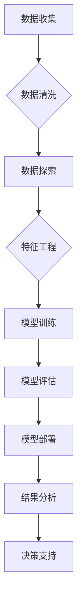

# 使用AI代理进行市场分析：工作流程与数据解读

> 关键词：AI代理，市场分析，机器学习，数据挖掘，预测建模，商业洞察

## 1. 背景介绍

在快速变化的市场环境中，企业需要实时洞察市场动态，以便做出快速、准确的决策。传统的市场分析方法往往依赖于大量的人工分析和经验判断，既耗时又容易受到主观因素的影响。随着人工智能技术的发展，AI代理（Artificial Intelligence Agent）作为一种新兴的技术，能够帮助企业自动化市场分析过程，提供客观、高效的分析结果。本文将探讨使用AI代理进行市场分析的工作流程，并解读相关数据，以帮助企业更好地理解和利用AI技术。

### 1.1 问题的由来

市场分析是企业运营决策的重要环节，涉及对市场趋势、竞争对手、消费者行为等多方面信息的收集、处理和分析。然而，传统的市场分析方法存在以下问题：

- 数据量庞大：市场数据通常来源于多个渠道，包括销售数据、社交媒体、市场调研等，数据量庞大且复杂。
- 分析难度高：市场数据往往是非结构化的，需要专业人员进行分析，耗时且容易出错。
- 主观性强：市场分析结果往往受到分析师个人经验和偏见的影响，导致结果不一致。

### 1.2 研究现状

AI代理技术通过机器学习和数据挖掘技术，能够自动处理和分析大量市场数据，提供客观、高效的分析结果。目前，AI代理在市场分析中的应用主要包括以下几个方面：

- 市场趋势预测：通过分析历史市场数据，预测未来市场趋势。
- 竞争对手分析：监测竞争对手的市场动态，包括价格、促销、新品发布等。
- 消费者行为分析：分析消费者购买行为，为产品开发和营销策略提供依据。
- 风险评估：识别潜在的市场风险，为决策提供预警。

### 1.3 研究意义

使用AI代理进行市场分析具有以下意义：

- 提高效率：自动化数据分析过程，节省人力和时间成本。
- 增强客观性：减少主观因素影响，提高分析结果的准确性。
- 支持决策：为决策者提供数据驱动的洞察，支持更明智的决策。

### 1.4 本文结构

本文将按照以下结构展开：

- 介绍AI代理的基本概念和工作原理。
- 详细讲解使用AI代理进行市场分析的工作流程。
- 通过实际案例展示AI代理在市场分析中的应用。
- 解读市场分析数据，提供商业洞察。
- 探讨AI代理在市场分析中的未来发展趋势和挑战。

## 2. 核心概念与联系

### 2.1 核心概念

- **AI代理**：一种能够模拟人类智能行为的软件程序，能够自主学习、推理和决策。
- **机器学习**：一种使计算机能够通过数据学习并做出决策或预测的技术。
- **数据挖掘**：从大量数据中提取有价值信息的过程。
- **预测建模**：使用历史数据建立模型，预测未来事件或趋势。

### 2.2 架构的Mermaid流程图



### 2.3 核心概念之间的联系

AI代理通过机器学习技术从数据中学习，并通过数据挖掘技术提取有价值的信息。预测建模是机器学习的一个应用，用于建立模型并预测未来事件。AI代理将预测模型应用于实际场景，为决策提供支持。

## 3. 核心算法原理 & 具体操作步骤

### 3.1 算法原理概述

AI代理进行市场分析的核心算法原理包括数据收集、数据清洗、数据探索、特征工程、模型训练、模型评估、模型部署、结果分析和决策支持。

### 3.2 算法步骤详解

1. **数据收集**：从多个渠道收集市场数据，包括销售数据、社交媒体数据、市场调研数据等。
2. **数据清洗**：去除数据中的噪声和异常值，确保数据质量。
3. **数据探索**：分析数据的分布特征，发现数据中的规律和趋势。
4. **特征工程**：从原始数据中提取对预测任务有用的特征。
5. **模型训练**：使用历史数据训练预测模型，如线性回归、决策树、随机森林等。
6. **模型评估**：使用验证数据评估模型的性能，如准确率、召回率、F1分数等。
7. **模型部署**：将训练好的模型部署到生产环境中。
8. **结果分析**：分析模型的预测结果，提取市场洞察。
9. **决策支持**：为决策者提供基于数据的建议。

### 3.3 算法优缺点

#### 优点

- 自动化：自动化数据分析过程，提高效率。
- 客观性：减少主观因素影响，提高分析结果的准确性。
- 可扩展性：能够处理大规模数据集。

#### 缺点

- 需要大量数据：训练高质量的模型需要大量的历史数据。
- 模型选择困难：不同的模型适用于不同的预测任务，选择合适的模型需要专业知识。
- 解释性有限：一些复杂的模型难以解释其预测结果。

### 3.4 算法应用领域

AI代理在市场分析中的应用领域包括：

- 市场趋势预测
- 竞争对手分析
- 消费者行为分析
- 风险评估
- 营销效果评估

## 4. 数学模型和公式 & 详细讲解 & 举例说明

### 4.1 数学模型构建

在市场分析中，常见的数学模型包括：

- **线性回归模型**：用于预测连续型变量，如销售额。
- **逻辑回归模型**：用于预测离散型变量，如客户流失率。
- **决策树模型**：用于分类和回归任务，易于理解和解释。
- **支持向量机模型**：用于分类和回归任务，能够处理非线性关系。

### 4.2 公式推导过程

以线性回归模型为例，其公式如下：

$$
y = \beta_0 + \beta_1 x_1 + \beta_2 x_2 + ... + \beta_n x_n + \epsilon
$$

其中，$y$ 是因变量，$x_1, x_2, ..., x_n$ 是自变量，$\beta_0, \beta_1, ..., \beta_n$ 是模型参数，$\epsilon$ 是误差项。

### 4.3 案例分析与讲解

假设我们要预测一家公司的月销售额。我们可以使用线性回归模型进行预测。首先，我们需要收集历史销售数据，包括月份、广告支出、促销活动和销售额。然后，使用这些数据训练线性回归模型。最后，使用模型预测下个月的销售额。

## 5. 项目实践：代码实例和详细解释说明

### 5.1 开发环境搭建

为了进行市场分析，我们需要搭建以下开发环境：

- 编程语言：Python
- 库：NumPy、Pandas、Scikit-learn、Matplotlib
- 数据分析工具：Jupyter Notebook

### 5.2 源代码详细实现

以下是一个使用Python和Scikit-learn进行线性回归预测的简单示例：

```python
import numpy as np
import pandas as pd
from sklearn.linear_model import LinearRegression
import matplotlib.pyplot as plt

# 加载数据
data = pd.read_csv('sales_data.csv')

# 提取特征和标签
X = data[['ad_spending', 'promotion_activity']]
y = data['sales']

# 训练模型
model = LinearRegression()
model.fit(X, y)

# 预测结果
y_pred = model.predict([[100, 50]])

# 绘制结果
plt.scatter(X, y, color='blue')
plt.plot(X, y_pred, color='red', linewidth=2)
plt.show()
```

### 5.3 代码解读与分析

这段代码首先加载销售数据，然后提取特征和标签。接下来，使用线性回归模型进行训练，并使用模型预测下个月的销售额。最后，使用Matplotlib绘制实际销售数据和预测结果的散点图。

### 5.4 运行结果展示

运行上述代码后，将得到一个散点图，其中蓝色点表示实际销售数据，红色线表示预测结果。

## 6. 实际应用场景

### 6.1 市场趋势预测

AI代理可以分析历史销售数据，预测未来市场趋势。例如，一家电商平台可以使用AI代理分析历史销售数据，预测春节期间的销售趋势，以便提前备货。

### 6.2 竞争对手分析

AI代理可以监测竞争对手的市场动态，包括价格、促销、新品发布等。例如，一家手机制造商可以使用AI代理监测竞争对手的新品发布，以便及时调整自己的产品策略。

### 6.3 消费者行为分析

AI代理可以分析消费者购买行为，为产品开发和营销策略提供依据。例如，一家服装品牌可以使用AI代理分析消费者购买数据，了解不同年龄段消费者的偏好，以便开发更符合市场需求的产品。

### 6.4 未来应用展望

随着人工智能技术的不断发展，AI代理在市场分析中的应用将更加广泛。未来，AI代理将能够：

- 自动化更多市场分析任务
- 提供更深入的商业洞察
- 支持更复杂的决策

## 7. 工具和资源推荐

### 7.1 学习资源推荐

- 《Python数据科学手册》
- 《机器学习实战》
- 《数据挖掘：实用机器学习技术》

### 7.2 开发工具推荐

- Jupyter Notebook
- Scikit-learn
- TensorFlow
- PyTorch

### 7.3 相关论文推荐

- "Market basket analysis: Unsupervised learning techniques for mining market basket data"
- "Predictive Analytics: The Power to Predict Who Will Click, Buy, Lie, or Die"
- "Data Science from Scratch: First Principles with Python"

## 8. 总结：未来发展趋势与挑战

### 8.1 研究成果总结

本文介绍了使用AI代理进行市场分析的工作流程，并解读了相关数据。通过实际案例，展示了AI代理在市场分析中的应用，为帮助企业更好地理解和利用AI技术提供了参考。

### 8.2 未来发展趋势

随着人工智能技术的不断发展，AI代理在市场分析中的应用将呈现以下趋势：

- 模型更加智能化
- 分析更加深入
- 应用更加广泛

### 8.3 面临的挑战

尽管AI代理在市场分析中具有巨大的潜力，但仍然面临着以下挑战：

- 数据质量
- 模型解释性
- 安全性

### 8.4 研究展望

未来，AI代理在市场分析中的应用将不断拓展，为企业和个人提供更加智能化的服务。同时，研究者需要不断探索新的算法和技术，以应对挑战，推动AI代理技术的进步。

## 9. 附录：常见问题与解答

**Q1：AI代理是否适用于所有行业？**

A1：AI代理可以适用于几乎所有行业，但需要针对特定行业的数据和需求进行定制化开发。

**Q2：如何确保AI代理的分析结果的准确性？**

A2：确保AI代理分析结果准确性的关键在于数据质量和模型训练。需要收集高质量的数据，并使用合适的数据处理和模型训练方法。

**Q3：AI代理是否会取代人类分析师？**

A3：AI代理可以辅助人类分析师进行市场分析，但不会完全取代人类分析师。

**Q4：如何评估AI代理的性能？**

A4：可以通过准确率、召回率、F1分数等指标评估AI代理的性能。

**Q5：如何确保AI代理的分析结果安全可靠？**

A5：需要采取数据加密、访问控制等措施，确保AI代理的分析结果安全可靠。

作者：禅与计算机程序设计艺术 / Zen and the Art of Computer Programming