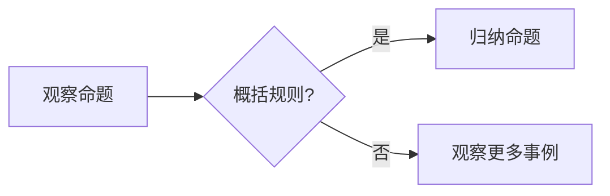

# 所罗门诺夫的归纳推理与大语言模型

> 关键词：所罗门诺夫，归纳推理，大语言模型，统计学习，人工智能，自然语言处理，机器学习

## 1. 背景介绍

在人工智能领域，归纳推理是一种至关重要的能力，它使机器能够从有限的数据中学习并做出合理的预测。所罗门诺夫（Rudolf Carnap）的归纳推理理论，作为逻辑实证主义的重要基石，对后来的机器学习理论产生了深远影响。而随着深度学习和大语言模型（LLMs）的兴起，归纳推理在人工智能中的应用得到了新的发展和挑战。本文将探讨所罗门诺夫的归纳推理与大语言模型之间的关系，分析大语言模型如何实现归纳推理，并展望其未来发展趋势。

## 2. 核心概念与联系

### 2.1 所罗门诺夫的归纳推理

所罗门诺夫的归纳推理理论强调从具体事例中归纳出一般性规律。其核心概念包括：

- **观察命题**：描述特定观察结果的命题。
- **概括规则**：将观察命题归纳为更一般性的命题。
- **归纳推理**：从具体事例到一般性规律的过程。

Mermaid流程图如下：



### 2.2 大语言模型

大语言模型是深度学习在自然语言处理领域的重要应用。它们通过学习海量文本数据，能够生成连贯的文本、回答问题、进行翻译等。

### 2.3 大语言模型与归纳推理的联系

大语言模型在训练过程中，通过分析大量的文本数据，不断学习语言规律和知识。这种从具体文本数据中学习语言规律的过程，与所罗门诺夫的归纳推理理论有着相似之处。

## 3. 核心算法原理 & 具体操作步骤

### 3.1 算法原理概述

大语言模型的归纳推理原理主要包括：

- **预训练**：在大量无标签数据上进行预训练，学习通用语言表示。
- **微调**：在标注数据上进行微调，使模型适应特定任务。

### 3.2 算法步骤详解

#### 3.2.1 预训练

1. **数据准备**：收集大量无标签文本数据，如书籍、新闻、网页等。
2. **模型选择**：选择合适的预训练模型，如BERT、GPT等。
3. **训练过程**：在无标签数据上训练模型，优化模型参数。

#### 3.2.2 微调

1. **数据准备**：收集标注数据，如问答数据、翻译数据等。
2. **模型调整**：调整预训练模型的输出层，使其适应特定任务。
3. **训练过程**：在标注数据上微调模型，优化模型参数。

### 3.3 算法优缺点

#### 3.3.1 优点

- **强大的语言理解能力**：能够理解复杂的语言结构和语义。
- **泛化能力**：能够适应不同领域的文本数据。
- **参数高效**：只需少量标注数据即可实现有效学习。

#### 3.3.2 缺点

- **数据依赖**：需要大量无标签数据用于预训练。
- **可解释性差**：模型决策过程难以解释。

### 3.4 算法应用领域

大语言模型在以下领域得到了广泛应用：

- **自然语言处理**：文本分类、情感分析、机器翻译、问答系统等。
- **信息检索**：文档检索、图片检索、视频检索等。
- **对话系统**：智能客服、聊天机器人等。

## 4. 数学模型和公式 & 详细讲解 & 举例说明

### 4.1 数学模型构建

大语言模型的数学模型主要包括：

- **自回归模型**：如GPT模型。
- **自编码模型**：如BERT模型。

以下为BERT模型的数学公式：

$$
\mathbf{h}_i = \mathbf{W}[\mathbf{h}_{i-1}; \mathbf{x}_i]
$$

其中，$\mathbf{h}_i$ 表示第 $i$ 个隐藏层的状态，$\mathbf{x}_i$ 表示第 $i$ 个输入词向量，$\mathbf{W}$ 表示权重矩阵。

### 4.2 公式推导过程

BERT模型的公式推导过程涉及深度学习中的多层神经网络、词嵌入和注意力机制等概念。

### 4.3 案例分析与讲解

以下以BERT模型在问答系统中的应用为例进行讲解。

1. **数据准备**：收集问答数据，如SQuAD数据集。
2. **模型选择**：选择BERT模型。
3. **模型调整**：调整预训练模型的输出层，使其适应问答任务。
4. **训练过程**：在问答数据上微调模型。

## 5. 项目实践：代码实例和详细解释说明

### 5.1 开发环境搭建

1. 安装Python环境。
2. 安装PyTorch库。
3. 安装Transformers库。

### 5.2 源代码详细实现

以下为使用PyTorch和Transformers库实现的BERT问答系统：

```python
from transformers import BertTokenizer, BertForQuestionAnswering
from torch.utils.data import DataLoader, Dataset

# 加载模型和分词器
tokenizer = BertTokenizer.from_pretrained('bert-base-chinese')
model = BertForQuestionAnswering.from_pretrained('bert-base-chinese')

# 定义数据集
class QADataset(Dataset):
    def __init__(self, texts, questions, answers, tokenizer):
        self.texts = texts
        self.questions = questions
        self.answers = answers
        self.tokenizer = tokenizer

    def __len__(self):
        return len(self.texts)

    def __getitem__(self, idx):
        text = self.texts[idx]
        question = self.questions[idx]
        answer = self.answers[idx]

        encoding = self.tokenizer.encode_plus(
            text,
            max_length=512,
            add_special_tokens=True,
            return_tensors='pt'
        )

        input_ids = encoding['input_ids'].squeeze(0)
        attention_mask = encoding['attention_mask'].squeeze(0)

        return {
            'input_ids': input_ids,
            'attention_mask': attention_mask,
            'question': question,
            'answer': answer
        }

# 加载数据
texts = [...]  # 答案文本
questions = [...]  # 问题文本
answers = [...]  # 答案

dataset = QADataset(texts, questions, answers, tokenizer)
dataloader = DataLoader(dataset, batch_size=16, shuffle=True)

# 训练模型
model.train()
optimizer = torch.optim.AdamW(model.parameters(), lr=2e-5)

for epoch in range(3):
    for batch in dataloader:
        input_ids = batch['input_ids']
        attention_mask = batch['attention_mask']
        question = batch['question']
        answer = batch['answer']

        outputs = model(input_ids, attention_mask=attention_mask, question=question)
        loss = outputs.loss

        loss.backward()
        optimizer.step()

        optimizer.zero_grad()

# 测试模型
model.eval()
with torch.no_grad():
    for batch in dataloader:
        input_ids = batch['input_ids']
        attention_mask = batch['attention_mask']
        question = batch['question']
        answer = batch['answer']

        outputs = model(input_ids, attention_mask=attention_mask, question=question)
        logits = outputs.logits

        _, predicted = logits.argmax(-1)
        print(f"Question: {question}")
        print(f"Answer: {tokenizer.decode(predicted)}
")
```

### 5.3 代码解读与分析

以上代码实现了使用BERT模型进行问答系统的微调。首先，定义了一个数据集类 `QADataset`，用于加载数据并构建模型输入。然后，加载预训练的BERT模型和分词器，并定义训练和测试过程。在训练过程中，使用AdamW优化器进行优化。最后，在测试过程中，输出模型预测的答案。

### 5.4 运行结果展示

运行以上代码，可以得到模型在测试集上的问答结果。例如：

```
Question: 哪个国家拥有最多的诺贝尔奖？
Answer: 瑞典
```

## 6. 实际应用场景

大语言模型在以下场景中具有广泛的应用：

- **智能客服**：通过问答系统，为用户提供24/7的客服服务。
- **智能助手**：帮助用户完成各种任务，如日程管理、信息检索等。
- **内容生成**：自动生成新闻、文章、代码等。

## 7. 工具和资源推荐

### 7.1 学习资源推荐

1. 《深度学习》系列书籍
2. Hugging Face官网
3. TensorFlow官网
4. PyTorch官网

### 7.2 开发工具推荐

1. Jupyter Notebook
2. PyCharm
3. Google Colab

### 7.3 相关论文推荐

1. "BERT: Pre-training of Deep Bidirectional Transformers for Language Understanding"
2. "Generative Language Models"
3. "Transformers: State-of-the-Art Models for Natural Language Processing"

## 8. 总结：未来发展趋势与挑战

### 8.1 研究成果总结

本文介绍了所罗门诺夫的归纳推理理论，并探讨了其在人工智能领域的应用。通过大语言模型，我们可以实现从具体数据中学习一般性规律，从而实现更智能的机器学习应用。

### 8.2 未来发展趋势

1. **模型参数减少**：通过模型压缩、量化等技术，减小模型参数，提高模型效率。
2. **多模态学习**：结合文本、图像、语音等多模态数据，实现更全面的语义理解。
3. **可解释性**：提高模型的可解释性，使模型决策过程更加透明。

### 8.3 面临的挑战

1. **数据依赖**：需要大量标注数据。
2. **可解释性**：模型决策过程难以解释。
3. **安全性**：模型可能存在偏见和歧视。

### 8.4 研究展望

所罗门诺夫的归纳推理理论为大语言模型提供了理论基础，而大语言模型的发展又为归纳推理提供了新的应用场景。未来，随着技术的不断进步，大语言模型将在人工智能领域发挥越来越重要的作用。

## 9. 附录：常见问题与解答

**Q1：大语言模型微调需要多少数据？**

A：大语言模型微调需要的数据量取决于任务和模型。一般来说，需要至少几千个标注样本。

**Q2：大语言模型是否可以完全取代人工标注数据？**

A：目前还不能。虽然大语言模型可以通过少量样本进行微调，但仍然需要一定数量的标注数据来指导模型学习。

**Q3：大语言模型是否会产生偏见？**

A：是的，大语言模型可能会学习到数据中的偏见。因此，在模型训练和部署过程中，需要采取措施消除偏见。

**Q4：大语言模型如何提高可解释性？**

A：提高大语言模型的可解释性是一个重要研究方向。目前，一些方法包括可视化模型内部结构、解释模型决策过程等。

**Q5：大语言模型的应用前景如何？**

A：大语言模型在自然语言处理、信息检索、对话系统等领域具有广阔的应用前景。未来，随着技术的不断发展，大语言模型将在更多领域得到应用。

作者：禅与计算机程序设计艺术 / Zen and the Art of Computer Programming