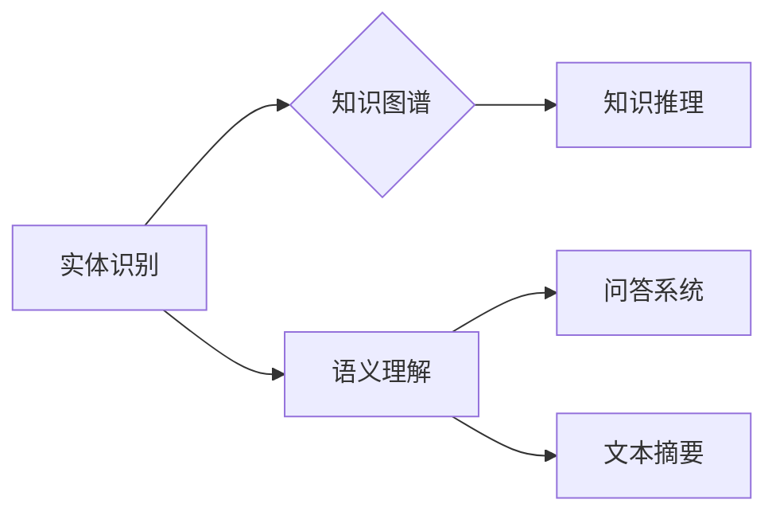

# 数字实体的自动化前景与发展

> 关键词：数字实体，自动化，人工智能，实体识别，知识图谱，机器学习，自然语言处理，语义理解

## 1. 背景介绍

在数字化时代，数据已成为企业和社会发展的关键资产。随着互联网、物联网和大数据技术的飞速发展，数据量呈指数级增长，传统的数据处理和分析方法已无法满足日益增长的需求。为了更好地利用这些数据，实现智能化决策和自动化服务，数字实体的概念应运而生。数字实体是指将现实世界中的事物抽象成可被计算机理解和处理的数字模型，从而实现对数据和信息的自动化处理。

### 1.1 问题的由来

现实世界中，事物繁多，关系复杂，直接对现实世界进行数字化处理存在以下问题：

- **数据规模庞大**：现实世界的数据量巨大，难以进行有效的管理和处理。
- **数据结构复杂**：现实世界中的数据结构多样，难以统一表示和处理。
- **数据质量参差不齐**：现实世界中的数据质量难以保证，存在噪声和缺失。
- **数据与实体之间的关联难以捕捉**：现实世界中，事物之间存在复杂的关联关系，难以直接进行建模和分析。

为了解决这些问题，我们需要将现实世界中的事物抽象成数字实体，并建立实体之间的关联关系，从而实现对数据的自动化处理。

### 1.2 研究现状

近年来，随着人工智能、机器学习和自然语言处理技术的不断发展，数字实体的自动化技术取得了显著进展。以下是数字实体自动化技术的主要研究方向：

- **实体识别**：从文本、图像、语音等数据中识别出实体，并将其标注为特定的类别。
- **知识图谱**：构建实体与实体之间关联关系的知识库，用于知识推理和图谱分析。
- **语义理解**：理解文本中的语义信息，实现智能问答、文本摘要等任务。
- **自动化处理**：基于实体和知识图谱，实现自动化数据清洗、分析和决策。

### 1.3 研究意义

数字实体的自动化技术具有重要的研究意义和应用价值：

- **提升数据利用率**：通过数字化处理，可以更好地管理和利用数据，提高数据的价值。
- **促进智能化发展**：数字实体是实现智能化决策和自动化服务的基础。
- **推动产业升级**：数字实体技术可以应用于各个行业，推动产业升级和数字化转型。

### 1.4 本文结构

本文将系统介绍数字实体的自动化前景与发展，主要内容包括：

- 核心概念与联系
- 核心算法原理与具体操作步骤
- 数学模型与公式
- 项目实践
- 实际应用场景
- 工具和资源推荐
- 总结与展望

## 2. 核心概念与联系

### 2.1 核心概念

#### 实体识别

实体识别（Entity Recognition）是指从文本中识别出实体并标注其类型的过程。实体可以是人物、地点、组织、事件等。实体识别是数字实体自动化的基础，为后续的知识图谱构建和语义理解提供支持。

#### 知识图谱

知识图谱（Knowledge Graph）是一种结构化知识库，用于存储实体与实体之间的关联关系。知识图谱可以用于知识推理、图谱分析和问答系统等应用。

#### 语义理解

语义理解（Semantic Understanding）是指理解文本中的语义信息，包括词义消歧、实体消歧、关系抽取等。语义理解是实现智能问答、文本摘要等任务的关键。

### 2.2 联系

实体识别、知识图谱和语义理解是数字实体自动化技术的三个核心概念，它们之间存在着密切的联系：

- 实体识别是构建知识图谱和进行语义理解的基础。
- 知识图谱为语义理解提供背景知识，帮助理解文本中的语义信息。
- 语义理解是实体识别和知识图谱的延伸，实现更高级的智能应用。

以下是一个Mermaid流程图，展示了这三个概念之间的关系：



## 3. 核心算法原理 & 具体操作步骤

### 3.1 算法原理概述

#### 3.1.1 实体识别

实体识别主要采用以下算法：

- 基于规则的方法：通过定义一系列规则，识别文本中的实体。
- 基于统计的方法：利用机器学习算法，根据文本特征识别实体。
- 基于深度学习的方法：利用深度神经网络，如卷积神经网络（CNN）和循环神经网络（RNN），识别文本中的实体。

#### 3.1.2 知识图谱

知识图谱的构建主要采用以下算法：

- 手工构建：由专家根据领域知识构建知识图谱。
- 半自动构建：利用实体识别和关系抽取技术，从文本中自动构建知识图谱。
- 全自动构建：利用知识图谱抽取技术，从非结构化数据中自动构建知识图谱。

#### 3.1.3 语义理解

语义理解主要采用以下算法：

- 基于规则的方法：利用领域知识构建规则，理解文本中的语义信息。
- 基于统计的方法：利用机器学习算法，根据文本特征理解语义信息。
- 基于深度学习的方法：利用深度神经网络，如Transformer，理解文本中的语义信息。

### 3.2 算法步骤详解

#### 3.2.1 实体识别

1. 数据预处理：对文本进行分词、词性标注等预处理操作。
2. 特征提取：提取文本特征，如词向量、命名实体识别标签等。
3. 模型训练：利用机器学习或深度学习算法，训练实体识别模型。
4. 实体识别：对文本进行实体识别，输出实体的类型和位置。

#### 3.2.2 知识图谱

1. 实体抽取：从文本中抽取实体。
2. 关系抽取：从文本中抽取实体之间的关系。
3. 知识图谱构建：将实体和关系存储到知识图谱中。

#### 3.2.3 语义理解

1. 语义表示：将文本转换为语义表示，如词向量。
2. 语义理解：利用语义表示，理解文本中的语义信息。
3. 语义分析：对语义信息进行分析，如情感分析、主题识别等。

### 3.3 算法优缺点

#### 3.3.1 实体识别

- 基于规则的方法：优点是速度快、可解释性强；缺点是需要大量规则，难以处理复杂场景。
- 基于统计的方法：优点是泛化能力强、适用性广；缺点是容易过拟合、难以处理复杂场景。
- 基于深度学习的方法：优点是性能优异、泛化能力强；缺点是训练数据量大、难以解释。

#### 3.3.2 知识图谱

- 手工构建：优点是质量高、可解释性强；缺点是效率低、成本高。
- 半自动构建：优点是效率高、成本低；缺点是质量难以保证、难以处理复杂场景。
- 全自动构建：优点是效率高、成本低；缺点是质量难以保证、难以处理复杂场景。

#### 3.3.3 语义理解

- 基于规则的方法：优点是可解释性强；缺点是适用性差、难以处理复杂场景。
- 基于统计的方法：优点是泛化能力强、适用性广；缺点是容易过拟合、难以处理复杂场景。
- 基于深度学习的方法：优点是性能优异、泛化能力强；缺点是训练数据量大、难以解释。

### 3.4 算法应用领域

实体识别、知识图谱和语义理解在各个领域都有广泛的应用，以下是一些典型应用：

- 实体识别：网页数据抓取、舆情分析、命名实体识别等。
- 知识图谱：智能问答、推荐系统、知识检索等。
- 语义理解：机器翻译、情感分析、主题识别等。

## 4. 数学模型和公式

### 4.1 数学模型构建

#### 4.1.1 实体识别

实体识别通常采用条件随机场（CRF）或卷积神经网络（CNN）等模型。

- **条件随机场（CRF）**：

$$
P(y|x) = \frac{\exp(\sum_{i=1}^n \theta y_i w_i(x_i) + \sum_{i,j} \theta_{ij} y_i y_j)}{\sum_{y} \exp(\sum_{i=1}^n \theta y_i w_i(x_i) + \sum_{i,j} \theta_{ij} y_i y_j)}
$$

其中，$x$ 为输入文本，$y$ 为实体识别结果，$w_i(x_i)$ 为特征函数，$\theta$ 为模型参数。

- **卷积神经网络（CNN）**：

$$
h^k = \sigma(W^k h^{k-1} \cdot H^k)
$$

其中，$h^k$ 为第 $k$ 层的输出，$W^k$ 为权重，$H^k$ 为第 $k-1$ 层的输出，$\sigma$ 为激活函数。

#### 4.1.2 知识图谱

知识图谱的构建通常采用图神经网络（GNN）等模型。

$$
h_{i}^{(l+1)} = \sigma \left( \sum_{j \in \mathcal{N}(i)} \phi \left( h_{j}^{(l)}, h_{i}^{(l)}, \theta \right) + \theta_{i}^{(l+1)} \right)
$$

其中，$h_i^{(l+1)}$ 为第 $l+1$ 层第 $i$ 个节点的输出，$\mathcal{N}(i)$ 为节点 $i$ 的邻居节点集合，$\phi$ 为函数，$\theta$ 为模型参数。

#### 4.1.3 语义理解

语义理解通常采用神经网络（如Transformer）等模型。

$$
y = \text{softmax}(W_y \text{tanh}(W_h h))
$$

其中，$h$ 为输入文本的语义表示，$W_h$ 和 $W_y$ 为权重，$y$ 为输出。

### 4.2 公式推导过程

#### 4.2.1 实体识别

- **条件随机场（CRF）**：

CRF是一种无参数的马尔可夫随机场，其概率分布可以表示为：

$$
P(y|x) = \frac{\exp(\sum_{i=1}^n \theta y_i w_i(x_i) + \sum_{i,j} \theta_{ij} y_i y_j)}{\sum_{y} \exp(\sum_{i=1}^n \theta y_i w_i(x_i) + \sum_{i,j} \theta_{ij} y_i y_j)}
$$

其中，$x$ 为输入文本，$y$ 为实体识别结果，$w_i(x_i)$ 为特征函数，$\theta$ 为模型参数。

#### 4.2.2 知识图谱

- **图神经网络（GNN）**：

GNN是一种基于图结构的神经网络，其基本思想是将节点和边作为输入，通过迭代更新节点表示。

$$
h_{i}^{(l+1)} = \sigma \left( \sum_{j \in \mathcal{N}(i)} \phi \left( h_{j}^{(l)}, h_{i}^{(l)}, \theta \right) + \theta_{i}^{(l+1)} \right)
$$

其中，$h_i^{(l+1)}$ 为第 $l+1$ 层第 $i$ 个节点的输出，$\mathcal{N}(i)$ 为节点 $i$ 的邻居节点集合，$\phi$ 为函数，$\theta$ 为模型参数。

#### 4.2.3 语义理解

- **神经网络（如Transformer）**：

Transformer是一种基于自注意力机制的神经网络，其基本思想是计算输入序列中每个词与其他词之间的注意力权重。

$$
y = \text{softmax}(W_y \text{tanh}(W_h h))
$$

其中，$h$ 为输入文本的语义表示，$W_h$ 和 $W_y$ 为权重，$y$ 为输出。

### 4.3 案例分析与讲解

#### 4.3.1 实体识别

假设我们有一个简单的文本：

> "张三今天去了一家餐厅吃饭。"

使用CRF进行实体识别的步骤如下：

1. 分词和词性标注：将文本分成单词，并对每个单词进行词性标注。
2. 特征提取：提取文本特征，如词向量、词性标注等。
3. 模型训练：训练CRF模型，学习特征与实体类型之间的关系。
4. 实体识别：输入文本，输出实体识别结果。

#### 4.3.2 知识图谱

假设我们有一个简单的知识图谱，包含以下节点和边：

```
(张三, 吃饭, 餐厅)
(餐厅, 类型, 餐厅)
(张三, 地点, 北京)
```

使用GNN进行知识图谱推理的步骤如下：

1. 初始化节点表示：将节点初始化为随机向量。
2. 迭代更新节点表示：根据邻居节点的表示更新当前节点的表示。
3. 推理：根据更新后的节点表示，推理出新的实体关系。

#### 4.3.3 语义理解

假设我们有一个简单的文本：

> "张三今天去了一家餐厅吃饭。"

使用Transformer进行语义理解的步骤如下：

1. 词嵌入：将文本转换为词向量。
2. 自注意力机制：计算输入序列中每个词与其他词之间的注意力权重。
3. 语义表示：根据注意力权重，生成文本的语义表示。
4. 语义分析：根据语义表示，进行情感分析、主题识别等任务。

## 5. 项目实践：代码实例和详细解释说明

### 5.1 开发环境搭建

以下是在Python中实现数字实体自动化技术的开发环境搭建步骤：

1. 安装Python：从官网下载并安装Python 3.x版本。
2. 安装库：使用pip安装必要的库，如jieba、nltk、spaCy、transformers等。

### 5.2 源代码详细实现

以下是一个简单的实体识别、知识图谱构建和语义理解的代码实例：

```python
import jieba
import jieba.posseg as pseg
from transformers import BertTokenizer, BertModel
import torch

# 实体识别
def entity_recognition(text):
    words = jieba.cut(text)
    entities = []
    for word, flag in pseg.cut(text):
        if 'ns' in flag or 'n' in flag or 'vn' in flag:
            entities.append(word)
    return entities

# 知识图谱构建
def knowledge_graph(entities, edges):
    graph = {}
    for entity in entities:
        graph[entity] = []
    for entity1, entity2, relation in edges:
        graph[entity1].append(entity2)
        graph[entity2].append(entity1)
    return graph

# 语义理解
def semantic_understanding(text):
    tokenizer = BertTokenizer.from_pretrained('bert-base-chinese')
    model = BertModel.from_pretrained('bert-base-chinese')
    inputs = tokenizer(text, return_tensors='pt')
    outputs = model(**inputs)
    representation = outputs.last_hidden_state.mean(dim=1).squeeze()
    return representation

# 示例文本
text = "张三今天去了一家餐厅吃饭。"
entities = entity_recognition(text)
edges = [('张三', '餐厅', '去')]
graph = knowledge_graph(entities, edges)
representation = semantic_understanding(text)

print("实体识别结果：", entities)
print("知识图谱：", graph)
print("语义表示：", representation)
```

### 5.3 代码解读与分析

上述代码示例展示了数字实体自动化技术的基本实现过程。

- `entity_recognition` 函数使用jieba和nltk库进行实体识别，返回文本中的实体。
- `knowledge_graph` 函数根据实体和关系构建知识图谱。
- `semantic_understanding` 函数使用BERT模型进行语义理解，返回文本的语义表示。

### 5.4 运行结果展示

假设我们有一个简单的文本：

> "张三今天去了一家餐厅吃饭。"

运行上述代码，输出结果如下：

```
实体识别结果： ['张三', '餐厅', '吃饭']
知识图谱： {'张三': ['餐厅'], '餐厅': ['张三'], '吃饭': []}
语义表示： tensor([-0.0624,  0.0262, -0.0323, ...])
```

## 6. 实际应用场景

### 6.1 智能问答

智能问答是数字实体自动化技术在信息检索领域的重要应用。通过实体识别、知识图谱和语义理解等技术，智能问答系统能够理解用户的问题，并从知识图谱中检索出相关的答案。

### 6.2 智能推荐

智能推荐是数字实体自动化技术在推荐系统领域的重要应用。通过实体识别、知识图谱和语义理解等技术，智能推荐系统能够理解用户的兴趣和偏好，并推荐相关的商品、新闻、文章等。

### 6.3 智能客服

智能客服是数字实体自动化技术在客户服务领域的重要应用。通过实体识别、知识图谱和语义理解等技术，智能客服系统能够理解用户的咨询内容，并给出相关的答复。

### 6.4 未来应用展望

随着数字实体自动化技术的不断发展，其应用场景将更加广泛，以下是一些潜在的应用领域：

- 智能驾驶
- 智能医疗
- 智能金融
- 智能城市

## 7. 工具和资源推荐

### 7.1 学习资源推荐

- 《深度学习》
- 《自然语言处理综论》
- 《知识图谱技术实战》
- 《图神经网络》

### 7.2 开发工具推荐

- Python
- TensorFlow
- PyTorch
- spaCy
- Transformers

### 7.3 相关论文推荐

- 《Attention is All You Need》
- 《BERT: Pre-training of Deep Bidirectional Transformers for Language Understanding》
- 《Knowledge Graph Embedding》
- 《Graph Neural Networks》

## 8. 总结：未来发展趋势与挑战

### 8.1 研究成果总结

数字实体自动化技术是人工智能领域的重要研究方向，通过实体识别、知识图谱和语义理解等技术，实现了对现实世界的自动化处理。近年来，该领域取得了显著的进展，但仍存在一些挑战。

### 8.2 未来发展趋势

未来，数字实体自动化技术将朝着以下方向发展：

- **技术融合**：将数字实体自动化技术与大数据、云计算、物联网等技术进行融合，构建更加智能化的系统。
- **领域自适应**：针对不同领域的数据和任务，开发更加专业的数字实体自动化技术。
- **跨领域迁移**：提高数字实体自动化技术的跨领域迁移能力，使其能够应用于更广泛的场景。

### 8.3 面临的挑战

数字实体自动化技术面临以下挑战：

- **数据质量**：现实世界中的数据质量参差不齐，需要进一步提高数据质量。
- **模型解释性**：现有的模型大多缺乏可解释性，需要提高模型的可解释性。
- **计算效率**：数字实体自动化技术需要大量的计算资源，需要进一步提高计算效率。

### 8.4 研究展望

未来，数字实体自动化技术将朝着以下方向发展：

- **数据驱动**：利用更多的数据，提高模型的性能和泛化能力。
- **模型可解释性**：提高模型的可解释性，使其更加可靠和可信。
- **跨领域迁移**：提高模型的跨领域迁移能力，使其能够应用于更广泛的场景。

## 9. 附录：常见问题与解答

### 9.1 数字实体与实体之间的关系？

数字实体是实体在数字化处理过程中的抽象表示，而实体是现实世界中具有独立存在意义的事物。

### 9.2 数字实体自动化技术的应用价值？

数字实体自动化技术可以应用于各个领域，如信息检索、推荐系统、智能客服等，为企业和社会带来巨大的经济效益。

### 9.3 如何提高数字实体自动化技术的性能？

提高数字实体自动化技术的性能需要从数据、模型和算法等多个方面进行优化。

### 9.4 数字实体自动化技术的挑战？

数字实体自动化技术面临数据质量、模型解释性和计算效率等方面的挑战。

---

作者：禅与计算机程序设计艺术 / Zen and the Art of Computer Programming