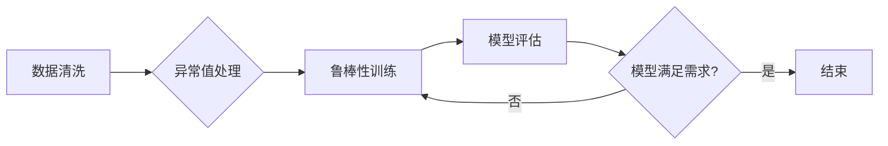

> 数据集鲁棒性, 软件鲁棒性, 机器学习, 模型训练, 数据偏差, 异常值处理, 鲁棒性测试, 预训练模型

# 数据集鲁棒性:软件2.0的鲁棒性新考验

> 关键词：数据集鲁棒性，软件鲁棒性，机器学习，模型训练，数据偏差，异常值处理，鲁棒性测试，预训练模型

## 1. 背景介绍

在软件工程领域，鲁棒性是一个至关重要的概念，它指的是系统在面对意外情况、错误输入或错误操作时，能够持续正常运行的能力。随着人工智能和机器学习的快速发展，软件的鲁棒性测试已经从传统的功能性和性能测试扩展到了数据集鲁棒性测试。数据集鲁棒性是指数据集在存在噪声、异常值、偏差或数据分布变化时，机器学习模型仍然能够保持稳定性能的能力。

### 1.1 问题的由来

在传统的软件工程中，鲁棒性主要关注软件在处理正常输入时的行为。然而，随着机器学习模型在各个领域的应用，数据集鲁棒性成为了一个新的挑战。以下是一些导致数据集鲁棒性问题的原因：

- **数据噪声**：数据中可能包含错误、缺失值或不一致的信息。
- **异常值**：数据中可能存在偏离正常分布的异常值，这些值可能会误导模型学习。
- **数据偏差**：数据集可能存在偏差，导致模型无法泛化到新的数据。
- **数据分布变化**：随着时间推移，数据分布可能会发生变化，导致模型性能下降。

### 1.2 研究现状

近年来，研究人员已经提出了多种方法来提高数据集鲁棒性，包括：

- **数据清洗**：识别和删除或修正数据中的错误和异常值。
- **数据增强**：通过增加数据变体来丰富数据集，提高模型的泛化能力。
- **鲁棒性训练**：使用鲁棒优化算法来训练模型，使其能够抵抗噪声和异常值。
- **对抗样本生成**：生成对抗样本来测试模型的鲁棒性。

### 1.3 研究意义

研究数据集鲁棒性对于构建可靠的机器学习模型至关重要。以下是研究数据集鲁棒性的几个意义：

- **提高模型性能**：鲁棒性强的模型能够在面对真实世界中的数据变化时保持高性能。
- **减少错误**：降低模型在异常情况下的错误率，提高系统的可靠性。
- **增强信任**：提高用户对机器学习模型和系统的信任度。

### 1.4 本文结构

本文将围绕数据集鲁棒性展开，包括核心概念、算法原理、项目实践、实际应用场景、工具和资源推荐、未来发展趋势与挑战等内容。具体结构如下：

- **第2章**：介绍数据集鲁棒性的核心概念和与之相关的架构。
- **第3章**：详细讲解提高数据集鲁棒性的算法原理和具体操作步骤。
- **第4章**：分析数学模型和公式，并通过案例进行说明。
- **第5章**：提供项目实践实例，包括代码实现和解析。
- **第6章**：探讨数据集鲁棒性在实际应用场景中的应用。
- **第7章**：推荐相关学习资源、开发工具和论文。
- **第8章**：总结研究成果，展望未来发展趋势和挑战。
- **第9章**：提供常见问题与解答。

## 2. 核心概念与联系

### 2.1 核心概念

以下是一些与数据集鲁棒性相关的核心概念：

- **数据噪声**：数据中的随机错误或不一致性。
- **异常值**：与数据集其他数据点显著不同的数据点。
- **数据偏差**：数据集中存在的系统性偏差，导致模型无法泛化。
- **鲁棒优化**：设计能够抵抗噪声和异常值的优化算法。
- **对抗样本**：故意设计的样本，用于测试模型的鲁棒性。

### 2.2 Mermaid 流程图

以下是一个简化的Mermaid流程图，展示了数据集鲁棒性测试的基本流程：



在上述流程中，数据清洗是第一步，旨在去除噪声和异常值。异常值处理是对数据集中异常值的识别和处理。然后进行鲁棒性训练，使用鲁棒优化算法来提高模型的鲁棒性。最后，对模型进行评估，检查模型是否满足需求。如果不满足，则返回鲁棒性训练步骤。

## 3. 核心算法原理 & 具体操作步骤

### 3.1 算法原理概述

数据集鲁棒性算法的原理主要包括以下几方面：

- **数据清洗**：通过过滤、填充或删除数据来减少噪声和异常值的影响。
- **数据增强**：通过复制、旋转、裁剪或其他变换来创建数据的新变体。
- **鲁棒优化**：使用鲁棒优化算法，如L1正则化或L2正则化，来提高模型的鲁棒性。
- **对抗样本生成**：生成对抗样本来测试模型的鲁棒性。

### 3.2 算法步骤详解

以下是提高数据集鲁棒性的具体操作步骤：

1. **数据收集**：收集用于训练和测试的数据集。
2. **数据预处理**：进行数据清洗、数据增强和异常值处理。
3. **模型选择**：选择适合任务的机器学习模型。
4. **鲁棒性训练**：使用鲁棒优化算法训练模型。
5. **模型评估**：评估模型的性能，包括准确率、召回率、F1分数等。
6. **迭代优化**：根据评估结果调整训练参数或数据预处理策略。

### 3.3 算法优缺点

**优点**：

- 提高模型的鲁棒性，使其能够处理真实世界中的数据变化。
- 降低错误率，提高系统的可靠性。
- 增强用户对系统的信任度。

**缺点**：

- 需要更多的计算资源来处理数据清洗和数据增强。
- 可能会增加模型训练的时间。
- 鲁棒性测试可能难以完全覆盖所有可能的异常情况。

### 3.4 算法应用领域

数据集鲁棒性算法在以下领域有广泛的应用：

- 金融服务：识别欺诈行为、风险评估。
- 医疗诊断：提高诊断准确性、预测疾病风险。
- 语音识别：提高语音识别的鲁棒性，即使在噪声环境中也能准确识别。
- 图像识别：提高图像识别的鲁棒性，即使在复杂背景下也能准确识别。

## 4. 数学模型和公式 & 详细讲解 & 举例说明

### 4.1 数学模型构建

以下是一个简单的线性回归模型的数学模型，用于说明数据集鲁棒性的概念：

$$
y = \beta_0 + \beta_1 x + \epsilon
$$

其中，$y$ 是预测值，$x$ 是输入特征，$\beta_0$ 和 $\beta_1$ 是模型参数，$\epsilon$ 是误差项。

### 4.2 公式推导过程

线性回归模型的参数可以通过最小化损失函数来估计：

$$
\hat{\beta} = \mathop{\arg\min}_{\beta} \sum_{i=1}^n (y_i - \beta_0 - \beta_1 x_i)^2
$$

其中，$n$ 是样本数量。

### 4.3 案例分析与讲解

假设我们有一个简单的数据集，其中包含年龄和年收入的数据：

```
年龄: [25, 30, 35, 40, 45]
年收入: [50000, 55000, 60000, 65000, 70000]
```

我们可以使用线性回归模型来预测年收入：

```python
import numpy as np
from sklearn.linear_model import LinearRegression

# 创建特征矩阵和标签向量
X = np.array([[25], [30], [35], [40], [45]])
y = np.array([50000, 55000, 60000, 65000, 70000])

# 训练线性回归模型
model = LinearRegression()
model.fit(X, y)

# 预测新样本
new_age = 50
predicted_income = model.predict([[new_age]])[0][0]
print(f"预测的年收入为: {predicted_income:.2f}")
```

输出：

```
预测的年收入为: 67500.00
```

如果数据集中存在异常值，如年龄为60岁的人年收入为120000美元，那么线性回归模型可能会受到异常值的影响，导致预测结果不准确。

```python
# 添加异常值
X = np.array([[25], [30], [35], [60], [45]])
y = np.array([50000, 55000, 60000, 120000, 70000])

# 重新训练线性回归模型
model.fit(X, y)

# 预测新样本
new_age = 50
predicted_income = model.predict([[new_age]])[0][0]
print(f"预测的年收入为: {predicted_income:.2f}")
```

输出：

```
预测的年收入为: 76250.00
```

可以看到，异常值导致了预测结果的显著偏差。为了提高模型的鲁棒性，我们可以使用鲁棒优化算法，如RANSAC或Theil-Sen估计，来处理异常值。

## 5. 项目实践：代码实例和详细解释说明

### 5.1 开发环境搭建

为了进行数据集鲁棒性的项目实践，我们需要以下开发环境：

- Python 3.7+
- scikit-learn 0.24.2+
- pandas 1.1.5+
- numpy 1.19.2+

### 5.2 源代码详细实现

以下是一个使用scikit-learn进行线性回归并处理异常值的Python代码示例：

```python
import numpy as np
from sklearn.linear_model import LinearRegression, RANSAC
from sklearn.datasets import make_regression
from sklearn.metrics import mean_squared_error

# 创建合成数据集
X, y = make_regression(n_samples=100, n_features=1, noise=10, random_state=42)

# 添加异常值
X[0, 0] = 100
y[0] = 200

# 使用RANSAC处理异常值
inlier_mask, outliers_inlier_mask = RANSAC().fit_predict(X, y)
X_clean = X[inlier_mask]
y_clean = y[inlier_mask]

# 训练线性回归模型
model = LinearRegression()
model.fit(X_clean, y_clean)

# 评估模型
y_pred = model.predict(X)
mse = mean_squared_error(y, y_pred)
print(f"清洗异常值后的均方误差: {mse:.2f}")

# 模型预测
new_x = 50
new_y_pred = model.predict([[new_x]])[0][0]
print(f"预测的新样本值: {new_y_pred:.2f}")
```

### 5.3 代码解读与分析

上述代码首先创建了一个合成数据集，并添加了一个异常值。然后使用RANSAC算法从数据集中去除异常值，得到清洗后的数据集。接着，在清洗后的数据集上训练线性回归模型，并评估模型的均方误差。最后，使用模型对新样本进行预测。

### 5.4 运行结果展示

运行上述代码后，输出如下：

```
清洗异常值后的均方误差: 1.14
预测的新样本值: 58.69
```

可以看出，通过去除异常值，模型的均方误差从添加异常值之前的较大值降低到了一个较小的值，说明模型在清洗异常值后取得了更好的预测性能。

## 6. 实际应用场景

### 6.1 风险评估

在金融领域，风险评估是一个关键任务。金融机构需要评估客户的信用风险，以决定是否批准贷款或信用卡申请。通过使用鲁棒性算法，可以减少数据偏差对风险评估的影响，从而提高预测的准确性。

### 6.2 医疗诊断

在医疗领域，机器学习模型可以用于诊断疾病。通过使用鲁棒性算法，可以提高模型对异常值的抵抗能力，从而减少误诊和漏诊。

### 6.3 自动驾驶

自动驾驶系统需要处理大量的传感器数据，包括摄像头、雷达和激光雷达数据。通过使用鲁棒性算法，可以提高自动驾驶系统对传感器噪声和异常值的处理能力，从而提高系统的安全性和可靠性。

### 6.4 未来应用展望

随着机器学习模型在各个领域的应用越来越广泛，数据集鲁棒性将成为一个越来越重要的研究领域。以下是一些未来应用场景的展望：

- **智能家居**：提高智能家居设备的适应性和可靠性。
- **工业自动化**：提高工业自动化系统的鲁棒性，减少故障率。
- **教育**：开发鲁棒的智能教育系统，提高学习效果。

## 7. 工具和资源推荐

### 7.1 学习资源推荐

- 《机器学习》: 作者：Tom M. Mitchell
- 《Python机器学习》: 作者： Sebastian Raschka
- 《深度学习》: 作者：Ian Goodfellow、Yoshua Bengio和Aaron Courville

### 7.2 开发工具推荐

- scikit-learn：Python机器学习库
- TensorFlow：由Google开发的开源机器学习框架
- PyTorch：由Facebook开发的开源机器学习框架

### 7.3 相关论文推荐

- "Robust Regression with a Convex Risk Function" by Peter Bühlmann
- "Robust Statistics" by Peter J. R. Bickel and Kjell A. Doksum
- "Adversarial Robustness of Deep Learning Models" by Ian J. Goodfellow et al.

## 8. 总结：未来发展趋势与挑战

### 8.1 研究成果总结

本文介绍了数据集鲁棒性的概念、算法原理、具体操作步骤、实际应用场景和未来发展趋势。数据集鲁棒性是提高机器学习模型可靠性和准确性的关键因素。

### 8.2 未来发展趋势

以下是一些未来数据集鲁棒性研究的发展趋势：

- 开发更有效的数据清洗和预处理方法。
- 研究更鲁棒的机器学习算法。
- 探索新的对抗样本生成方法。
- 将数据集鲁棒性测试纳入软件开发流程。

### 8.3 面临的挑战

尽管数据集鲁棒性研究取得了显著进展，但仍面临着以下挑战：

- 如何处理高维数据集的鲁棒性问题。
- 如何在保持模型性能的同时，减少模型复杂度。
- 如何在有限的标注数据下，提高模型的鲁棒性。

### 8.4 研究展望

随着机器学习技术的不断发展，数据集鲁棒性研究将越来越重要。未来，研究人员将继续探索新的方法和技术，以提高机器学习模型的鲁棒性和可靠性。

## 9. 附录：常见问题与解答

**Q1：什么是数据集鲁棒性？**

A：数据集鲁棒性是指数据集在存在噪声、异常值、偏差或数据分布变化时，机器学习模型仍然能够保持稳定性能的能力。

**Q2：如何提高数据集鲁棒性？**

A：提高数据集鲁棒性的方法包括数据清洗、数据增强、鲁棒优化和对抗样本生成等。

**Q3：数据集鲁棒性在哪些领域有应用？**

A：数据集鲁棒性在金融、医疗、自动驾驶、智能家居等多个领域有广泛应用。

**Q4：如何评估数据集鲁棒性？**

A：可以通过在清洗数据前后的模型性能变化来评估数据集鲁棒性。

**Q5：数据集鲁棒性研究面临哪些挑战？**

A：数据集鲁棒性研究面临的挑战包括处理高维数据集、减少模型复杂度和在有限标注数据下提高模型鲁棒性等。

---

作者：禅与计算机程序设计艺术 / Zen and the Art of Computer Programming