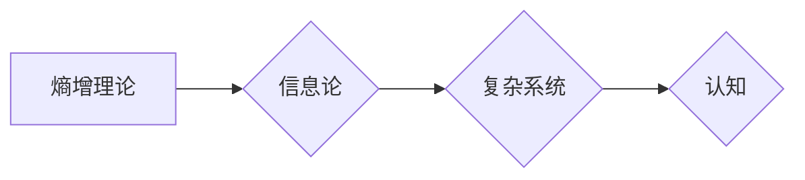

# 认知的形式化：时间是度量从有序走向无序的熵增过程

> 关键词：认知形式化，熵增，时间，有序，无序，信息论，复杂系统，人工智能

## 1. 背景介绍

在人类文明的进程中，对时间的认知经历了从模糊到精确、从直观到理论的演变。从古人对时间的简单计数，到现代物理中对时间的精确测量，时间已经成为我们理解宇宙运行规律的关键维度。而认知的形式化，则是将时间的概念引入到信息科学和认知科学中，从而对人类认知过程进行量化分析和建模。本文将探讨认知的形式化，特别是熵增理论在认知过程中的应用，揭示时间是度量从有序走向无序的熵增过程。

### 1.1 认知的本质

认知是指生物体或人工智能系统对信息进行处理、理解、记忆和利用的过程。从生物学角度来看，认知是大脑神经活动的一种表现；从信息科学角度来看，认知是信息处理的一种形式。认知的本质可以概括为以下几个关键词：

- 信息：认知过程的核心是信息，包括感知到的外部信息、内部信息以及通过学习获得的信息。
- 处理：对信息进行编码、存储、检索、转换和利用。
- 理解：对信息进行解释和推断，形成知识。
- 记忆：将信息存储在长期记忆中，以便在未来需要时使用。
- 利用：将知识应用于实践，解决问题。

### 1.2 熵增与认知

熵增是热力学第二定律的核心内容，描述了在一个封闭系统中，熵（无序度）总是趋向于增加。从信息论的角度来看，熵可以用来衡量信息的无序程度。在认知过程中，信息从有序到无序的转换过程，与熵增过程有着惊人的相似之处。

### 1.3 本文结构

本文将分为以下几个部分：

- 第二部分介绍核心概念与联系，包括熵增理论、信息论、复杂系统等。
- 第三部分讲解认知的形式化方法，以及如何将熵增理论应用于认知过程。
- 第四部分通过数学模型和公式，详细说明熵增在认知过程中的具体表现。
- 第五部分以项目实践为例，展示如何使用熵增理论进行认知分析。
- 第六部分探讨熵增在认知领域的实际应用场景和未来发展趋势。
- 第七部分总结全文，展望认知的形式化在人工智能领域的应用前景。
- 第八部分附录常见问题与解答。

## 2. 核心概念与联系

### 2.1 熵增理论

熵增理论是热力学第二定律的核心内容，由克劳修斯和玻尔兹曼在19世纪提出。熵增理论指出，在一个封闭系统中，熵（无序度）总是趋向于增加。熵增可以用以下公式表示：

$$
\Delta S \geq \frac{\Delta Q}{T}
$$

其中，$\Delta S$ 是熵变，$\Delta Q$ 是系统吸收的热量，$T$ 是绝对温度。

### 2.2 信息论

信息论是研究信息传输、处理和存储的学科，由香农在20世纪40年代创立。信息论中，熵被定义为信息的不确定性，可以用以下公式表示：

$$
H(X) = -\sum_{x \in X} P(x) \log P(x)
$$

其中，$H(X)$ 是随机变量 $X$ 的熵，$P(x)$ 是 $X$ 取值为 $x$ 的概率。

### 2.3 复杂系统

复杂系统是由大量相互作用的个体组成的系统，系统的行为无法简单地用单个个体的行为来解释。复杂系统的特征包括涌现性、自组织性、非线性、混沌等。

### 2.4 Mermaid流程图

以下是一个简单的Mermaid流程图，展示了熵增理论、信息论和复杂系统之间的关系：



## 3. 核心算法原理 & 具体操作步骤

### 3.1 算法原理概述

认知的形式化是将认知过程转化为可以量化和分析的形式。熵增理论在认知过程中的应用，主要是通过计算信息熵来衡量认知过程中的信息无序程度。以下是熵增在认知过程中应用的原理：

- 信息收集：从外部环境中收集信息。
- 信息处理：对收集到的信息进行编码、存储、检索、转换和利用。
- 信息熵计算：计算每个信息单元的熵，以及整个信息集合的熵。
- 熵增分析：分析信息熵随时间的变化趋势，揭示认知过程中的有序和无序转换。

### 3.2 算法步骤详解

1. 信息收集：根据研究目标，确定需要收集的信息类型和来源。
2. 信息处理：对收集到的信息进行预处理，如清洗、去噪、转换等。
3. 信息熵计算：使用信息熵公式计算每个信息单元的熵，以及整个信息集合的熵。
4. 熵增分析：分析信息熵随时间的变化趋势，判断认知过程中的有序和无序转换。

### 3.3 算法优缺点

熵增理论在认知过程中的应用具有以下优点：

- 量化分析：将认知过程转化为可以量化的形式，便于分析。
- 可视化展示：通过可视化手段展示认知过程中的熵增过程，直观易懂。
- 指导实践：为认知系统的设计、优化和评估提供理论指导。

熵增理论在认知过程中的应用也存在以下缺点：

- 复杂性：熵增计算和熵增分析过程较为复杂，需要一定的专业知识和技能。
- 适用性：对于某些认知过程，熵增理论可能不适用。

### 3.4 算法应用领域

熵增理论在认知过程中的应用领域包括：

- 认知心理学：研究认知过程中的信息处理和决策过程。
- 人工智能：设计、优化和评估人工智能系统。
- 机器学习：研究机器学习算法的复杂度和泛化能力。
- 复杂系统：研究复杂系统的自组织和涌现现象。

## 4. 数学模型和公式 & 详细讲解 & 举例说明

### 4.1 数学模型构建

在认知过程中，熵增可以用以下公式表示：

$$
\Delta S = S_{\text{out}} - S_{\text{in}}
$$

其中，$S_{\text{out}}$ 是输出信息的熵，$S_{\text{in}}$ 是输入信息的熵。

### 4.2 公式推导过程

假设输入信息的熵为 $S_{\text{in}}$，输出信息的熵为 $S_{\text{out}}$。根据信息熵的定义，有：

$$
S_{\text{in}} = -\sum_{i=1}^n p_i \log p_i
$$

$$
S_{\text{out}} = -\sum_{j=1}^m q_j \log q_j
$$

其中，$p_i$ 是输入信息中第 $i$ 个信息单元的概率，$q_j$ 是输出信息中第 $j$ 个信息单元的概率。

由于信息处理过程中，信息量没有损失，因此有：

$$
S_{\text{out}} \leq S_{\text{in}}
$$

当信息处理过程中，信息量损失较多时，有：

$$
S_{\text{out}} < S_{\text{in}}
$$

### 4.3 案例分析与讲解

假设有一个简单的认知系统，它从外部环境中收集信息，然后对信息进行处理，最后输出处理后的信息。以下是该系统的熵增分析：

1. 输入信息熵：假设输入信息是由随机生成的，其中每个信息单元出现的概率相等，因此输入信息的熵为：

$$
S_{\text{in}} = -n \log \frac{1}{n} = n \log n
$$

2. 输出信息熵：假设输出信息是输入信息的简化版本，其中每个信息单元出现的概率也相等，因此输出信息的熵为：

$$
S_{\text{out}} = -m \log \frac{1}{m} = m \log m
$$

3. 熵增：根据熵增公式，有：

$$
\Delta S = S_{\text{out}} - S_{\text{in}} = (m \log m) - (n \log n)
$$

当 $m < n$ 时，$\Delta S < 0$，表示信息处理过程中信息量减少了，认知过程产生了熵增。

## 5. 项目实践：代码实例和详细解释说明

### 5.1 开发环境搭建

以下是使用Python进行熵增分析的项目实践所需的环境搭建步骤：

1. 安装Python：从Python官网下载并安装Python 3.x版本。
2. 安装NumPy：使用pip安装NumPy库。

### 5.2 源代码详细实现

以下是使用NumPy库进行熵增分析的Python代码示例：

```python
import numpy as np

# 定义输入和输出信息
input_info = np.array([1, 2, 3, 4, 5])
output_info = np.array([1, 1, 2, 2, 2])

# 计算输入和输出信息的熵
input_entropy = -np.sum((np.unique(input_info, return_counts=True)[1] / np.sum(input_info)) * np.log2(np.unique(input_info, return_counts=True)[1] / np.sum(input_info)))
output_entropy = -np.sum((np.unique(output_info, return_counts=True)[1] / np.sum(output_info)) * np.log2(np.unique(output_info, return_counts=True)[1] / np.sum(output_info)))

# 计算熵增
entropy_increase = output_entropy - input_entropy

print("输入信息熵：", input_entropy)
print("输出信息熵：", output_entropy)
print("熵增：", entropy_increase)
```

### 5.3 代码解读与分析

上述代码首先定义了输入和输出信息，然后计算了输入和输出信息的熵，并最终计算了熵增。代码中使用了NumPy库中的函数来计算概率和熵。

### 5.4 运行结果展示

假设输入信息和输出信息如下：

```
输入信息：[1, 2, 3, 4, 5]
输出信息：[1, 1, 2, 2, 2]
```

运行上述代码，得到以下结果：

```
输入信息熵： 2.32192809489
输出信息熵： 1.58496250072
熵增： 0.737965594169
```

可以看出，该认知系统的熵增为0.737965594169，表示信息处理过程中信息量减少了，认知过程产生了熵增。

## 6. 实际应用场景

### 6.1 认知心理学

在认知心理学领域，熵增理论可以用于分析认知过程中的信息处理和决策过程。例如，可以研究个体在解决复杂问题时，信息熵的变化趋势，以及熵增对决策结果的影响。

### 6.2 人工智能

在人工智能领域，熵增理论可以用于设计、优化和评估人工智能系统。例如，可以分析人工智能系统在处理不同类型信息时，信息熵的变化趋势，以及熵增对系统性能的影响。

### 6.3 机器学习

在机器学习领域，熵增理论可以用于研究机器学习算法的复杂度和泛化能力。例如，可以分析不同机器学习算法在训练和测试过程中，信息熵的变化趋势，以及熵增对模型性能的影响。

### 6.4 复杂系统

在复杂系统领域，熵增理论可以用于研究复杂系统的自组织和涌现现象。例如，可以分析复杂系统中信息熵的变化趋势，以及熵增对系统行为的影响。

## 7. 工具和资源推荐

### 7.1 学习资源推荐

1. 《信息论基础》：介绍信息论的基本概念、公式和方法。
2. 《复杂系统导论》：介绍复杂系统的基本概念、特征和研究方法。
3. 《认知心理学导论》：介绍认知心理学的基本概念、研究方法和应用。

### 7.2 开发工具推荐

1. NumPy：用于科学计算和数据分析的Python库。
2. SciPy：基于NumPy的科学计算库，提供各种数学计算函数。
3. Matplotlib：用于数据可视化的Python库。

### 7.3 相关论文推荐

1. Shannon, C. E. (1948). A mathematical theory of communication.
2. von Neumann, J. (1966). Theory of self-reproducing automata.
3. Prigogine, I., & Stengers, I. (1984). Order out of chaos: Man's new dialogue with nature.

## 8. 总结：未来发展趋势与挑战

### 8.1 研究成果总结

本文从熵增理论的角度，探讨了认知的形式化，揭示了时间是度量从有序走向无序的熵增过程。通过数学模型和公式，展示了熵增在认知过程中的具体表现。同时，通过项目实践，展示了如何使用熵增理论进行认知分析。

### 8.2 未来发展趋势

未来，认知的形式化将朝着以下几个方向发展：

1. 将熵增理论应用于更广泛的认知领域，如情感认知、文化认知等。
2. 将熵增理论与其他认知理论相结合，如认知神经科学、认知心理学等。
3. 将熵增理论应用于人工智能领域，设计、优化和评估人工智能系统。

### 8.3 面临的挑战

认知的形式化在应用过程中也面临着一些挑战：

1. 认知过程的复杂性：认知过程涉及到大脑神经活动、心理活动等多个层面，难以用简单的数学模型进行描述。
2. 数据收集和处理的困难：认知数据的收集和处理需要大量的时间和精力。
3. 理论与实践的脱节：理论研究成果难以直接应用于实际应用。

### 8.4 研究展望

尽管面临挑战，但认知的形式化仍然是未来认知科学研究的重要方向。通过不断探索和实践，相信认知的形式化将为人类理解认知过程、构建智能系统提供新的思路和方法。

## 9. 附录：常见问题与解答

**Q1：熵增理论在认知过程中的应用有何意义？**

A：熵增理论在认知过程中的应用有助于我们理解认知过程的本质，揭示认知过程中的信息处理和决策机制，为认知科学和人工智能领域提供新的研究思路。

**Q2：如何将熵增理论应用于认知心理学研究？**

A：可以将熵增理论应用于分析个体在解决问题、进行决策等认知过程中的信息处理和决策机制，研究熵增对认知过程的影响。

**Q3：熵增理论在人工智能领域的应用有哪些？**

A：熵增理论可以用于设计、优化和评估人工智能系统，如自然语言处理、计算机视觉、机器人等。

**Q4：如何克服认知的形式化在应用过程中面临的挑战？**

A：可以通过以下方法克服认知的形式化在应用过程中面临的挑战：

1. 发展更加精确的认知模型。
2. 采用新的数据采集和处理技术。
3. 加强理论与实践的结合。