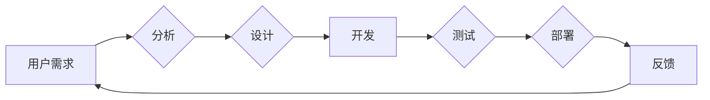

> 关键词：软件 2.0，深度学习，强化学习，人工智能，软件架构，软件开发，机器学习，智能系统

# 软件 2.0 的发展趋势：深度学习、强化学习

随着信息技术的飞速发展，软件领域正经历着从软件 1.0 到软件 2.0 的转变。软件 2.0 的核心特征是智能化，它将深度学习、强化学习等人工智能技术融入到软件开发和架构中，使得软件能够具备自主学习、自我优化和适应复杂环境的能力。本文将深入探讨软件 2.0 的发展趋势，重点关注深度学习和强化学习在软件开发中的应用。

## 1. 背景介绍

### 1.1 软件发展史

软件的发展经历了几个阶段：

- **软件 1.0 时代**：以代码为主，强调程序员的技能和经验，软件以功能为导向，缺乏智能化。
- **软件 2.0 时代**：以用户为中心，强调用户体验和交互，软件开始融合人工智能技术，实现智能化。
- **软件 3.0 时代**：以数据驱动，强调数据分析和挖掘，软件能够自我学习和进化。

### 1.2 人工智能的兴起

近年来，随着计算能力的提升和大数据的积累，人工智能技术取得了突破性进展。深度学习和强化学习作为人工智能的两个重要分支，正在改变着软件开发的模式。

## 2. 核心概念与联系

### 2.1 深度学习

深度学习是一种模仿人脑神经网络结构和学习方式的机器学习技术。它通过多层的神经网络对数据进行特征提取和模式识别，从而实现对复杂问题的建模。

### 2.2 强化学习

强化学习是一种通过与环境交互来学习最佳行为策略的机器学习技术。它通过奖励和惩罚机制来指导智能体在复杂环境中做出最优决策。

### 2.3 Mermaid 流程图



在软件 2.0 时代，深度学习和强化学习将贯穿于软件开发的整个过程，从需求分析、设计、开发到测试、部署，直至迭代优化。

## 3. 核心算法原理 & 具体操作步骤

### 3.1 算法原理概述

#### 3.1.1 深度学习

深度学习的基本原理是多层神经网络，通过前向传播和反向传播进行训练。网络中的每个神经元都负责学习输入数据中的特征，并通过激活函数将特征传递到下一层。

#### 3.1.2 强化学习

强化学习的基本原理是通过与环境交互，通过奖励和惩罚来指导智能体学习最佳行为策略。强化学习算法通过不断尝试和错误来优化策略。

### 3.2 算法步骤详解

#### 3.2.1 深度学习

1. 数据预处理：对原始数据进行清洗、标注和标准化处理。
2. 网络构建：设计神经网络结构，包括层数、神经元数量、激活函数等。
3. 模型训练：使用训练数据进行前向传播和反向传播，优化网络参数。
4. 模型评估：使用测试数据评估模型性能，进行参数调整和模型优化。

#### 3.2.2 强化学习

1. 环境定义：定义智能体的行为空间和状态空间。
2. 策略选择：选择合适的策略表示方法，如Q表、策略梯度等。
3. 策略评估：评估策略在环境中的表现，计算奖励和惩罚。
4. 策略优化：根据评估结果调整策略，优化智能体的行为。

### 3.3 算法优缺点

#### 3.3.1 深度学习

优点：
- 能够学习复杂的特征表示。
- 能够处理大规模数据。
- 自动学习数据中的特征。

缺点：
- 需要大量标注数据。
- 模型可解释性差。
- 训练时间长。

#### 3.3.2 强化学习

优点：
- 能够处理复杂动态环境。
- 能够学习最优行为策略。
- 能够适应环境变化。

缺点：
- 需要大量训练时间。
- 策略收敛速度慢。
- 策略难以解释。

### 3.4 算法应用领域

#### 3.4.1 深度学习

- 图像识别和分类。
- 语音识别和合成。
- 自然语言处理。
- 医疗诊断。

#### 3.4.2 强化学习

- 自动驾驶。
- 游戏人工智能。
- 机器人控制。
- 金融交易。

## 4. 数学模型和公式 & 详细讲解 & 举例说明

### 4.1 数学模型构建

#### 4.1.1 深度学习

- 前向传播：

$$
y_l = f(W_l \cdot a_{l-1} + b_l)
$$

- 反向传播：

$$
\delta W_{lk} = \frac{\partial J}{\partial W_{lk}} = \delta a_{l-1} \cdot a_{l-2}^T
$$

#### 4.1.2 强化学习

- 策略梯度：

$$
\theta^* = \mathop{\arg\max}_{\theta} J(\theta)
$$

- Q值函数：

$$
Q(s,a) = \sum_{s' \in S} \gamma \max_{a' \in A} Q(s',a')
$$

### 4.2 公式推导过程

#### 4.2.1 深度学习

- 前向传播的推导过程：

假设有一个多层神经网络，输入层到输出层的传递函数为：

$$
y_l = f(W_l \cdot a_{l-1} + b_l)
$$

其中 $W_l$ 为连接权重，$a_{l-1}$ 为上一层的输出，$b_l$ 为偏置项，$f$ 为激活函数。

则前向传播的计算过程为：

1. 初始化 $a_0 = x$，其中 $x$ 为输入数据。
2. 对于第 $l$ 层，计算：

$$
a_l = f(W_l \cdot a_{l-1} + b_l)
$$

3. 重复步骤2，直到计算到输出层的输出 $y$。

#### 4.2.2 强化学习

- 策略梯度的推导过程：

假设有一个策略函数 $\pi(\theta)$，其中 $\theta$ 为策略参数，策略梯度为：

$$
\nabla_\theta J(\theta) = \sum_{t=0}^T \nabla_\theta G_t
$$

其中 $G_t$ 为在时间步 $t$ 上的奖励，$\nabla_\theta$ 为策略参数的梯度。

### 4.3 案例分析与讲解

#### 4.3.1 深度学习

以图像识别为例，使用卷积神经网络对图像进行分类。

1. 数据预处理：对图像进行裁剪、归一化等处理。
2. 网络构建：构建一个卷积神经网络，包括多个卷积层和全连接层。
3. 模型训练：使用标注数据对模型进行训练，优化网络参数。
4. 模型评估：使用测试数据评估模型性能，调整参数和结构。

#### 4.3.2 强化学习

以自动驾驶为例，使用强化学习算法控制自动驾驶汽车。

1. 环境定义：定义自动驾驶汽车的行为空间和状态空间。
2. 策略选择：选择合适的策略表示方法，如Q表。
3. 策略评估：评估策略在环境中的表现，计算奖励和惩罚。
4. 策略优化：根据评估结果调整策略，优化自动驾驶汽车的行为。

## 5. 项目实践：代码实例和详细解释说明

### 5.1 开发环境搭建

以Python为例，搭建深度学习开发环境：

1. 安装Python 3.7及以上版本。
2. 安装PyTorch库。
3. 安装NumPy、Matplotlib等常用库。

### 5.2 源代码详细实现

以下是一个简单的深度学习图像识别示例代码：

```python
import torch
import torch.nn as nn

class CNN(nn.Module):
    def __init__(self):
        super(CNN, self).__init__()
        self.conv1 = nn.Conv2d(1, 32, kernel_size=3, stride=1, padding=1)
        self.conv2 = nn.Conv2d(32, 64, kernel_size=3, stride=1, padding=1)
        self.fc1 = nn.Linear(64 * 7 * 7, 128)
        self.fc2 = nn.Linear(128, 10)

    def forward(self, x):
        x = nn.functional.relu(self.conv1(x))
        x = nn.functional.max_pool2d(x, 2)
        x = nn.functional.relu(self.conv2(x))
        x = nn.functional.max_pool2d(x, 2)
        x = x.view(x.size(0), -1)
        x = nn.functional.relu(self.fc1(x))
        x = self.fc2(x)
        return x

model = CNN()
```

### 5.3 代码解读与分析

以上代码定义了一个简单的卷积神经网络，用于图像识别。网络包含两个卷积层、两个全连接层和一个ReLU激活函数。通过前向传播和反向传播，模型可以学习到图像的特征，并进行分类。

### 5.4 运行结果展示

运行以上代码，可以对图像进行分类，输出预测结果。

## 6. 实际应用场景

### 6.1 自动驾驶

自动驾驶是深度学习和强化学习在软件 2.0 时代的重要应用场景。通过深度学习，自动驾驶汽车可以识别道路、车辆、行人等场景信息；通过强化学习，自动驾驶汽车可以学习最佳驾驶策略，实现安全、高效的驾驶。

### 6.2 智能客服

智能客服是深度学习和强化学习在软件 2.0 时代的另一个重要应用场景。通过深度学习，智能客服可以理解用户意图，提供个性化的服务；通过强化学习，智能客服可以学习最佳对话策略，提升用户体验。

### 6.3 医疗诊断

医疗诊断是深度学习和强化学习在软件 2.0 时代的又一个重要应用场景。通过深度学习，智能系统可以识别疾病特征，辅助医生进行诊断；通过强化学习，智能系统可以学习最佳治疗方案，提高治疗效果。

## 7. 工具和资源推荐

### 7.1 学习资源推荐

- 《深度学习》
- 《Python深度学习》
- 《强化学习》
- 《Python编程：从入门到实践》

### 7.2 开发工具推荐

- PyTorch
- TensorFlow
- Keras
- OpenAI Gym

### 7.3 相关论文推荐

- "Deep Learning for Computer Vision: A Review"
- "Playing Atari with Deep Reinforcement Learning"
- "Mastering Chess and Shogi by Self-Play with a General Reinforcement Learning Algorithm"
- "A Theoretically Grounded Application of Dropout in Recurrent Neural Networks"

## 8. 总结：未来发展趋势与挑战

### 8.1 研究成果总结

本文介绍了软件 2.0 的发展趋势，重点关注深度学习和强化学习在软件开发中的应用。通过深度学习和强化学习，软件能够实现智能化，为人类生活带来更多便利。

### 8.2 未来发展趋势

- 深度学习和强化学习将更加深入地融入软件开发和架构。
- 软件将具备更强的自主学习、自我优化和适应复杂环境的能力。
- 软件将更加智能化，为人类生活带来更多便利。

### 8.3 面临的挑战

- 深度学习和强化学习的计算复杂度高，需要大量的计算资源和数据。
- 深度学习和强化学习的模型可解释性差，难以理解其内部工作机制。
- 深度学习和强化学习的训练时间长，难以满足实时性要求。

### 8.4 研究展望

- 开发更加高效的深度学习和强化学习算法，降低计算复杂度。
- 提高深度学习和强化学习的模型可解释性，增强用户信任。
- 开发更加轻量级的深度学习和强化学习模型，满足实时性要求。

## 9. 附录：常见问题与解答

**Q1：软件 2.0 和软件 1.0 有什么区别？**

A：软件 1.0 以代码为主，强调程序员的技能和经验；软件 2.0 以用户为中心，强调用户体验和交互，融合人工智能技术。

**Q2：深度学习和强化学习在软件开发中有什么应用？**

A：深度学习可以用于图像识别、语音识别、自然语言处理等；强化学习可以用于自动驾驶、游戏人工智能、机器人控制等。

**Q3：如何降低深度学习和强化学习的计算复杂度？**

A：可以通过模型压缩、量化加速、混合精度训练等方法降低计算复杂度。

**Q4：如何提高深度学习和强化学习的模型可解释性？**

A：可以通过可解释人工智能、因果推理等方法提高模型可解释性。

**Q5：深度学习和强化学习的训练时间长，如何满足实时性要求？**

A：可以通过模型压缩、量化加速、轻量级模型等方法满足实时性要求。

---

作者：禅与计算机程序设计艺术 / Zen and the Art of Computer Programming