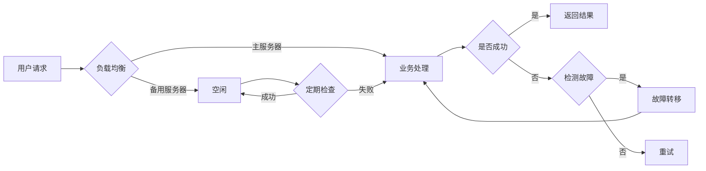

# 高可用性系统设计的实例分析

> 关键词：高可用性，系统设计，容错，故障转移，集群，负载均衡，冗余，自动化

## 1. 背景介绍

在当今的信息化时代，系统的可用性成为衡量其成功与否的重要指标。高可用性系统设计的目标是确保系统在出现硬件故障、软件错误、网络问题或人为失误等意外情况时，依然能够持续提供服务，保证业务连续性。本文将通过实例分析，深入探讨高可用性系统设计的关键原则、技术和实践。

### 1.1 系统可用性的重要性

随着互联网和云计算的快速发展，企业对于系统可用性的要求越来越高。以下是系统可用性对企业和用户的重要性：

- **提高用户满意度**：系统的高可用性可以确保用户在任何时候都能获得稳定的服务，从而提升用户体验和满意度。
- **保障业务连续性**：对于依赖在线服务的业务，系统的高可用性可以确保业务的连续性，避免因系统故障导致的损失。
- **降低维护成本**：通过系统的高可用设计，可以减少系统故障和停机时间，从而降低维护成本。
- **提升品牌形象**：高可用性系统可以提升企业的品牌形象，增强用户对企业的信任。

### 1.2 研究意义

高可用性系统设计是系统工程领域的一个重要分支，其研究意义体现在以下几个方面：

- **提高系统可靠性**：通过系统设计原则和技术，可以显著提高系统的可靠性，降低故障发生的概率。
- **优化系统性能**：高可用性设计有助于优化系统性能，提高系统的响应速度和吞吐量。
- **降低维护难度**：合理的设计可以降低系统的维护难度，便于系统管理和故障排除。
- **促进技术创新**：高可用性系统设计是推动新技术应用的重要推动力，有助于技术创新和产业升级。

## 2. 核心概念与联系

### 2.1 核心概念

- **高可用性（High Availability, HA）**：指系统在长时间内保持可用状态的能力，通常以系统无故障运行时间的百分比来衡量。
- **容错（Fault Tolerance, FT）**：指系统在出现故障时，能够自动切换到备用系统或恢复正常状态的能力。
- **故障转移（Failover）**：指系统在主系统发生故障时，将服务切换到备用系统上的过程。
- **负载均衡（Load Balancing, LB）**：指将请求分发到多个服务器上，以实现负载均衡和性能优化。
- **冗余（Redundancy）**：指在系统中添加额外的组件或资源，以防止单个组件或资源故障导致系统不可用。
- **自动化（Automation）**：指通过自动化的工具和方法来减少人工干预，提高系统的稳定性和效率。

### 2.2 架构流程图

以下是大致的高可用性系统设计流程图：



## 3. 核心算法原理 & 具体操作步骤

### 3.1 算法原理概述

高可用性系统设计的核心原理是通过冗余、负载均衡、故障转移和自动化等技术手段，确保系统在面对故障时能够快速恢复，并保证服务的连续性。

### 3.2 算法步骤详解

以下是高可用性系统设计的具体步骤：

1. **需求分析**：明确系统的业务需求、用户需求以及高可用性要求。
2. **系统架构设计**：根据需求分析结果，设计系统架构，包括硬件、软件和网络等方面的配置。
3. **冗余设计**：在系统中添加冗余组件或资源，如多台服务器、多个网络路径等，以防止单点故障。
4. **负载均衡**：使用负载均衡技术，将请求分发到多个服务器上，提高系统性能和可用性。
5. **故障转移**：设计故障转移机制，确保在主系统发生故障时，能够快速切换到备用系统。
6. **自动化**：使用自动化工具，实现系统监控、故障检测、故障转移和恢复等过程的自动化。
7. **测试与验证**：对系统进行全面的测试和验证，确保高可用性设计能够满足实际需求。

### 3.3 算法优缺点

**优点**：

- 提高系统可靠性：通过冗余和故障转移，降低系统故障的概率。
- 提高系统性能：通过负载均衡，提高系统处理请求的能力。
- 提高维护效率：通过自动化，减少人工干预，提高维护效率。

**缺点**：

- 增加系统复杂度：高可用性设计需要更多的硬件、软件和网络资源，增加系统复杂度。
- 增加维护成本：高可用性系统需要更多的维护工作，增加维护成本。
- 可用性非100%：虽然高可用性设计能够提高系统可靠性，但并不能保证系统100%可用。

### 3.4 算法应用领域

高可用性系统设计广泛应用于以下领域：

- 金融行业：银行、证券、保险等金融行业对于系统可用性要求极高，以确保交易的连续性和安全性。
- 电子商务：电商平台需要保证商品信息、订单处理等服务的连续性，以满足用户需求。
- 在线教育：在线教育平台需要保证课程内容、直播教学等服务的可用性，以满足学生的学习需求。
- 医疗行业：医疗行业需要保证医疗设备、病历管理等服务的高可用性，以确保医疗服务质量。

## 4. 数学模型和公式 & 详细讲解 & 举例说明

### 4.1 数学模型构建

高可用性系统的数学模型通常包括以下指标：

- **平均无故障时间（Mean Time to Failure, MTTF）**：指系统平均无故障运行的时间。
- **平均修复时间（Mean Time to Repair, MTTR）**：指系统从故障发生到修复完毕的平均时间。
- **可用性（Availability）**：指系统在特定时间内保持可用状态的概率。

### 4.2 公式推导过程

**MTTF** 的计算公式为：

$$
MTTF = \frac{T}{F}
$$

其中，$T$ 为系统总运行时间，$F$ 为故障次数。

**MTTR** 的计算公式为：

$$
MTTR = \frac{R}{F}
$$

其中，$R$ 为系统修复时间，$F$ 为故障次数。

**可用性** 的计算公式为：

$$
Availability = \frac{MTTF}{MTTF + MTTR}
$$

### 4.3 案例分析与讲解

以下是一个典型的两个节点高可用性系统示例：

- **系统架构**：由两个节点组成，每个节点包含主节点和备用节点。
- **工作原理**：当主节点正常工作时，负责处理请求；当主节点发生故障时，备用节点自动接管服务。
- **可用性计算**：

  假设每个节点MTTF为 $T_1$，MTTR为 $T_2$，则系统的总MTTF为：

  $$
  MTTF_{total} = 2 \times T_1
  $$

  系统的可用性为：

  $$
  Availability = \frac{2 \times T_1}{2 \times T_1 + 2 \times T_2} = \frac{T_1}{T_1 + T_2}
  $$

  可以看出，随着MTTF的增加，系统的可用性也会提高。

## 5. 项目实践：代码实例和详细解释说明

### 5.1 开发环境搭建

为了演示高可用性系统设计，我们可以使用Python和Flask框架搭建一个简单的Web应用。以下是开发环境搭建步骤：

1. 安装Python 3.8及以上版本。
2. 安装Flask框架：
   ```bash
   pip install flask
   ```
3. 创建一个名为 `app.py` 的Python文件，并编写以下代码：

   ```python
   from flask import Flask, request, jsonify
   import time

   app = Flask(__name__)

   def handle_request():
       time.sleep(1)  # 模拟处理请求耗时
       return jsonify({"message": "Hello, World!"})

   @app.route('/api', methods=['POST'])
   def api():
       return handle_request()

   if __name__ == '__main__':
       app.run(host='0.0.0.0', port=5000)
   ```

### 5.2 源代码详细实现

以上代码定义了一个简单的Flask Web应用，包含一个 `/api` 接口，用于处理请求并返回 "Hello, World!" 信息。

### 5.3 代码解读与分析

代码中，首先导入必要的库，并创建一个Flask应用实例。然后定义一个 `handle_request` 函数，用于模拟处理请求的耗时。最后，定义一个 `/api` 路由，当接收到POST请求时，调用 `handle_request` 函数处理请求并返回JSON格式的响应。

### 5.4 运行结果展示

在终端运行以下命令启动Flask应用：

```bash
python app.py
```

然后在浏览器或Postman等工具中发送POST请求到 `http://localhost:5000/api`，可以看到返回的JSON响应：

```json
{
  "message": "Hello, World!"
}
```

## 6. 实际应用场景

### 6.1 云计算平台

云计算平台通常采用高可用性设计，以确保服务的连续性。以下是一些常见的高可用性设计：

- **多地域部署**：将服务部署在多个地域，以避免单个地域故障导致服务中断。
- **负载均衡**：使用负载均衡器将请求分发到多个节点，提高系统性能和可用性。
- **故障转移**：在主节点发生故障时，将服务切换到备用节点。
- **数据备份**：定期备份数据，以便在数据丢失或损坏时进行恢复。

### 6.2 在线支付系统

在线支付系统对于可用性要求极高，以下是一些常见的高可用性设计：

- **双活架构**：主节点和备用节点同时运行，当主节点发生故障时，备用节点自动接管服务。
- **负载均衡**：使用负载均衡器将请求分发到多个节点，提高系统性能和可用性。
- **分布式数据库**：使用分布式数据库，以保证数据的一致性和可用性。
- **监控和报警**：实时监控系统状态，并在发生故障时及时报警。

### 6.3 物联网平台

物联网平台通常涉及大量的设备和服务，以下是一些常见的高可用性设计：

- **设备冗余**：使用多台设备同时运行，以保证设备的可用性。
- **边缘计算**：在设备端进行数据处理，减少对中心节点的依赖。
- **故障检测和隔离**：实时检测设备故障，并将其隔离，以保证其他设备的正常运行。
- **数据同步**：定期同步数据，以保证数据的一致性和可靠性。

## 7. 工具和资源推荐

### 7.1 学习资源推荐

以下是一些关于高可用性系统设计的优质学习资源：

- 《高可用架构：构建可靠分布式系统》
- 《大型网站技术架构：核心原理与案例分析》
- 《分布式系统原理与范型》
- 《大规模分布式存储系统：原理与实战》

### 7.2 开发工具推荐

以下是一些用于高可用性系统开发的常用工具：

- **Nginx**：高性能的Web服务器和反向代理服务器。
- **Keepalived**：实现故障转移的软件。
- **HAProxy**：高性能的负载均衡器。
- **Zookeeper**：分布式协调服务。
- **Consul**：服务发现和配置管理工具。

### 7.3 相关论文推荐

以下是一些关于高可用性系统设计的相关论文：

- 《High Availability in Practice》
- 《The Design of a Highly Available Distributed File System》
- 《Resilient Distributed Databases: A Survey of Issues and Solutions》
- 《A Survey of the State of the Art in Service-Oriented Systems》

## 8. 总结：未来发展趋势与挑战

### 8.1 研究成果总结

本文通过对高可用性系统设计的实例分析，深入探讨了高可用性系统的核心概念、原理、技术和实践。通过分析实际应用场景，展示了高可用性系统设计在金融、电商、在线教育、物联网等领域的应用价值。

### 8.2 未来发展趋势

随着云计算、物联网、大数据等技术的快速发展，未来高可用性系统设计将呈现以下趋势：

- **更加智能化**：利用人工智能技术，实现故障预测、智能监控和自动化修复。
- **更加分布式**：分布式系统将成为主流，高可用性设计将更加注重分布式架构。
- **更加弹性**：系统将更加弹性，能够根据负载自动调整资源。
- **更加安全**：安全将成为高可用性设计的重点，确保系统在遭受攻击时依然可用。

### 8.3 面临的挑战

虽然高可用性系统设计取得了显著进展，但仍面临以下挑战：

- **技术复杂度**：高可用性设计需要考虑的因素众多，技术复杂度较高。
- **成本高昂**：高可用性系统需要更多的硬件、软件和网络资源，成本较高。
- **人才稀缺**：高可用性系统设计需要专业人才，人才稀缺。

### 8.4 研究展望

未来，高可用性系统设计的研究将主要集中在以下几个方面：

- **跨领域融合**：将高可用性设计与其他领域的技术（如人工智能、区块链等）进行融合，实现更加智能、安全、可靠的服务。
- **标准化**：制定高可用性系统设计的相关标准和规范，提高行业整体水平。
- **普及教育**：加强对高可用性系统设计的教育和培训，培养更多专业人才。

相信随着技术的不断发展和创新，高可用性系统设计将迎来更加美好的未来。

## 9. 附录：常见问题与解答

**Q1：高可用性系统设计是否意味着系统永不故障？**

A: 高可用性系统设计的目标是提高系统在长时间内保持可用状态的能力，但并不能保证系统永不故障。任何系统都有可能发生故障，高可用性设计只是在故障发生时能够快速恢复，降低故障对业务的影响。

**Q2：高可用性系统设计是否意味着系统成本很高？**

A: 高可用性系统设计需要更多的硬件、软件和网络资源，因此成本相对较高。但通过合理的设计和优化，可以在保证系统可用性的前提下，控制成本。

**Q3：如何评估高可用性系统的性能？**

A: 评估高可用性系统的性能可以从以下几个方面进行：

- **MTTF和MTTR**：通过统计系统的故障发生频率和修复时间，评估系统的可靠性。
- **可用性**：计算系统在特定时间内保持可用状态的概率，评估系统的可用性。
- **故障恢复时间**：评估系统从故障发生到恢复正常状态所需的时间。

**Q4：高可用性系统设计是否适用于所有场景？**

A: 高可用性系统设计适用于对可用性要求较高的场景，如金融、电商、在线教育等。但对于一些对可用性要求不高的场景，如个人博客、论坛等，高可用性设计可能并不必要。

**Q5：如何提高高可用性系统的性能？**

A: 提高高可用性系统的性能可以从以下几个方面进行：

- **优化系统架构**：设计合理的系统架构，提高系统的稳定性和可靠性。
- **使用高性能硬件**：使用高性能的硬件设备，提高系统的处理能力和响应速度。
- **优化软件性能**：优化软件代码，提高系统的效率和性能。
- **加强运维管理**：加强系统监控和运维管理，及时发现和解决故障。

作者：禅与计算机程序设计艺术 / Zen and the Art of Computer Programming