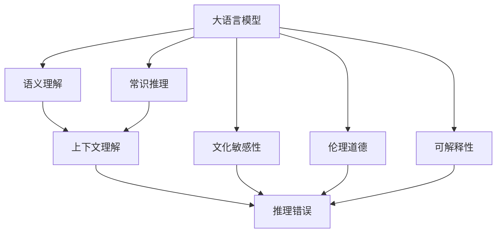
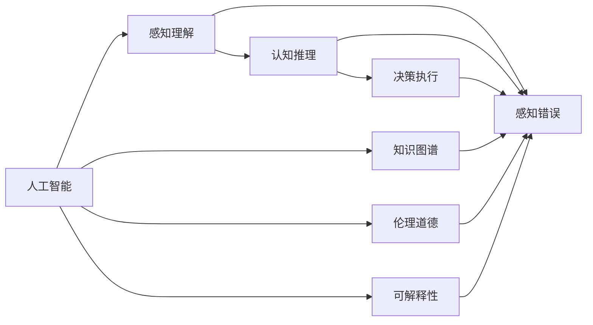

                 

# 语言≠思维：大模型的认知盲点

> 关键词：大语言模型,认知盲点,语言处理,人工智能,机器学习

## 1. 背景介绍

### 1.1 问题由来

近年来，大语言模型（Large Language Models, LLMs），如GPT、BERT等，在自然语言处理（Natural Language Processing, NLP）领域取得了令人瞩目的成绩。这些模型基于大量无标签文本数据的自监督预训练，具备强大的语言理解和生成能力。然而，随着这些模型的广泛应用，我们逐渐意识到，它们的能力与我们的直观认知、思维方式之间存在一定的差距，即所谓的"认知盲点"。

### 1.2 问题核心关键点

大语言模型的认知盲点主要体现在以下几个方面：
- **理解能力限制**：尽管大模型在语义理解上表现优秀，但它们对语义的正确性和上下文相关性的把握往往不足，难以真正理解复杂的语言结构和语境。
- **常识推理局限**：模型在缺乏常识背景知识的情况下，推理能力受限，难以进行逻辑连贯的推断和假设验证。
- **文化敏感性欠缺**：模型在处理特定文化背景或语言习惯时，缺乏足够的文化敏感性，容易产生误判。
- **伦理道德问题**：模型可能会输出有害信息、歧视性言论，或在决策过程中展现出明显的偏见，这与其输出内容的伦理道德相关性较低。
- **可解释性不足**：模型输出的决策过程往往缺乏可解释性，用户难以理解其推理逻辑和依据。

### 1.3 问题研究意义

研究大语言模型的认知盲点，对于提升其应用效果、增加其可靠性、减少误用风险具有重要意义：

- **优化模型性能**：识别并纠正模型的认知盲点，有助于提升模型在不同场景下的表现。
- **增强模型安全性**：确保模型的输出内容符合伦理道德标准，避免有害信息传播。
- **提升用户信任**：通过增加模型的可解释性，使用户对模型输出有更好的理解和接受。
- **推动技术进步**：揭示大语言模型在认知能力上的不足，为未来技术发展提供研究方向和改进思路。
- **促进产业发展**：通过提高模型可靠性，推动大语言模型在更多行业和场景中的应用。

## 2. 核心概念与联系

### 2.1 核心概念概述

理解大语言模型的认知盲点，需从多个角度进行分析：

- **大语言模型**：指能够基于大规模无标签文本数据进行自监督预训练的语言模型，如GPT、BERT等。这些模型能够生成高质量的自然语言文本，具备强大的语言处理能力。
- **认知盲点**：指模型在理解和生成自然语言文本时，存在某些特定的认知局限，如上下文理解不足、常识推理不力等。
- **语义理解**：指模型对自然语言文本中词汇、句子的含义进行解析，理解其背后的逻辑和语境。
- **常识推理**：指模型根据已知信息进行推断，验证假设，理解复杂的语言结构。
- **文化敏感性**：指模型对特定文化背景、语言习惯的感知和适应能力。
- **伦理道德**：指模型在决策过程中应遵循的道德准则和伦理标准。
- **可解释性**：指模型输出的决策过程应具有足够的可解释性，便于用户理解和信任。

### 2.2 概念间的关系

这些核心概念之间的关系可以通过以下Mermaid流程图来展示：



这个流程图展示了大语言模型在理解、推理、文化、伦理和可解释性等方面存在的认知盲点，以及这些盲点可能导致的推理错误。

### 2.3 核心概念的整体架构

为更全面地分析大语言模型的认知盲点，我们还需要结合人工智能的基本理论，构建一个整体架构：



这个综合架构展示了人工智能的三个核心阶段：感知理解、认知推理和决策执行，以及这些阶段可能存在的错误和局限。大语言模型作为感知理解和认知推理阶段的重要工具，其认知盲点直接影响人工智能系统的整体性能。

## 3. 核心算法原理 & 具体操作步骤

### 3.1 算法原理概述

大语言模型的认知盲点主要源于其训练数据和架构设计。这些模型在训练过程中，主要通过自监督任务（如语言模型预测、掩码预测等）进行预训练，缺乏对常识推理和文化背景的显式训练。这种设计导致模型在处理复杂语义、进行常识推理和文化敏感性判断时，存在一定的局限性。

基于监督学习的大语言模型微调，通过在有标签的训练数据上进行训练，能够在一定程度上缓解这些局限。然而，由于微调数据集的规模和质量往往有限，模型的整体性能仍受限于其预训练阶段的设计缺陷。

### 3.2 算法步骤详解

大语言模型认知盲点的分析和改进，一般包括以下几个步骤：

**Step 1: 数据收集与预处理**
- 收集与特定认知盲点相关的数据，如文化背景差异显著的文本、复杂逻辑推理任务等。
- 清洗和标注数据，确保其质量和多样性，去除噪音和偏差。

**Step 2: 模型设计与微调**
- 选择合适的模型架构，考虑加入特定领域的知识图谱、逻辑推理组件等，提升模型在特定任务上的表现。
- 在特定任务上进行微调，优化模型参数，以适应任务需求。

**Step 3: 评估与迭代**
- 在测试集上评估模型性能，检测认知盲点。
- 根据评估结果，进一步调整模型架构和微调策略，进行迭代优化。

**Step 4: 部署与应用**
- 将优化后的模型部署到实际应用场景中，进行大规模测试。
- 根据实际应用反馈，不断优化和更新模型。

### 3.3 算法优缺点

大语言模型认知盲点分析与改进的算法具有以下优点：
- **提升模型性能**：通过针对性的数据收集和模型设计，可以显著提升模型在特定任务上的表现。
- **增强模型可靠性**：识别并纠正认知盲点，有助于提升模型的整体可靠性和安全性。
- **增加用户信任**：提高模型的可解释性，使用户对模型的输出更有信心。

同时，这些算法也存在以下缺点：
- **数据需求高**：需要收集大量高质量的数据，特别是特定领域的语料，获取难度较大。
- **模型复杂度增加**：在模型中加入额外的推理组件和文化敏感性判断模块，增加了模型的复杂度。
- **模型训练成本高**：调整模型架构和进行大规模微调，需要更多的计算资源和时间成本。

### 3.4 算法应用领域

大语言模型的认知盲点分析和改进，在多个领域中都有实际应用：

- **金融领域**：金融模型的决策过程要求极高的准确性和可靠性。通过分析大语言模型的认知盲点，可以优化模型对金融数据和规则的理解和处理，减少误判和风险。
- **医疗领域**：医疗诊断和治疗方案的推荐需要高度依赖于医生的专业知识。通过分析大语言模型的认知盲点，可以提升其在医学常识和病历数据分析上的能力，辅助医生进行诊断和治疗。
- **教育领域**：教育模型的教学效果要求精准和个性化。通过分析大语言模型的认知盲点，可以提升其在理解学生需求和生成个性化教学内容上的能力，提高教育质量。
- **法律领域**：法律文本的分析需要高度依赖于法律条文和案例。通过分析大语言模型的认知盲点，可以提升其在法律条文理解、合同审核等方面的能力，提高法律工作的效率和准确性。

## 4. 数学模型和公式 & 详细讲解 & 举例说明

### 4.1 数学模型构建

假设我们有一组标注数据集 $D = \{(x_i, y_i)\}_{i=1}^N$，其中 $x_i$ 为输入的文本，$y_i$ 为文本对应的正确标签。我们的目标是通过优化模型参数 $\theta$，使得模型在测试集 $D_{test}$ 上的表现尽可能接近真实标签。

定义模型的损失函数为 $\mathcal{L}(\theta, D_{test}) = \frac{1}{N}\sum_{i=1}^N \ell(x_i, y_i)$，其中 $\ell$ 为交叉熵损失函数。模型的优化目标为最小化损失函数：

$$
\min_{\theta} \mathcal{L}(\theta, D_{test})
$$

在实际应用中，我们通常会使用梯度下降等优化算法来求解上述最优化问题。

### 4.2 公式推导过程

以二分类任务为例，我们定义模型的预测输出为 $y = \sigma(\theta^T x)$，其中 $\sigma$ 为激活函数，$\theta$ 为模型参数。损失函数为：

$$
\ell(y, y_{true}) = -(y_{true} \log y + (1 - y_{true}) \log (1 - y))
$$

在测试集上进行模型评估时，我们使用交叉熵损失函数：

$$
\mathcal{L}(\theta, D_{test}) = -\frac{1}{N}\sum_{i=1}^N \sum_{j=1}^k \frac{y_{i,j}}{p_{i,j}} \log \frac{p_{i,j}}{1 - p_{i,j}}
$$

其中 $p_{i,j}$ 为模型在测试集 $i$ 上预测类别 $j$ 的概率。

### 4.3 案例分析与讲解

我们以一个基于语言模型的推理任务为例，展示如何通过分析认知盲点来改进模型性能。假设我们要训练一个能够理解“命名实体识别”的模型，该模型通过分析文本中的实体（如人名、地名、机构名等），识别出实体类型并标注出来。

原模型在进行实体识别时，往往容易将不同类型的实体混淆，尤其是当实体名称与常见词汇相近时。例如，将“张三”误识别为人名，而实际上“张三”更可能是一个地名。

通过分析这种认知盲点，我们可以采取以下措施：
- **数据增强**：在训练集中引入更多不同类型实体的命名形式，增加模型对实体识别多样性的理解。
- **知识图谱**：在模型中加入实体间的关系图谱，提升模型对实体关系的理解能力。
- **规则嵌入**：在模型中加入一定的逻辑规则，例如“人名通常由两个字组成”等，帮助模型更好地理解实体。

经过这些改进，模型的推理能力得到显著提升，误识别率显著降低。

## 5. 项目实践：代码实例和详细解释说明

### 5.1 开发环境搭建

在进行认知盲点分析和改进的实践前，我们需要准备好开发环境。以下是使用Python进行TensorFlow开发的环境配置流程：

1. 安装Anaconda：从官网下载并安装Anaconda，用于创建独立的Python环境。

2. 创建并激活虚拟环境：
```bash
conda create -n tensorflow-env python=3.8 
conda activate tensorflow-env
```

3. 安装TensorFlow：根据CUDA版本，从官网获取对应的安装命令。例如：
```bash
conda install tensorflow -c tensorflow -c conda-forge
```

4. 安装各类工具包：
```bash
pip install numpy pandas scikit-learn matplotlib tqdm jupyter notebook ipython
```

完成上述步骤后，即可在`tensorflow-env`环境中开始认知盲点分析和改进的实践。

### 5.2 源代码详细实现

下面我们以一个简单的命名实体识别任务为例，给出使用TensorFlow进行模型微调的PyTorch代码实现。

首先，定义数据处理函数：

```python
import tensorflow as tf
from tensorflow.keras.preprocessing.text import Tokenizer
from tensorflow.keras.preprocessing.sequence import pad_sequences

def preprocess_text(texts, labels, max_length):
    tokenizer = Tokenizer(oov_token='<OOV>')
    tokenizer.fit_on_texts(texts)
    sequences = tokenizer.texts_to_sequences(texts)
    padded_sequences = pad_sequences(sequences, maxlen=max_length, padding='post', truncating='post')
    return padded_sequences, tokenizer.word_index, labels
```

然后，定义模型和优化器：

```python
from tensorflow.keras.layers import Input, Dense, Embedding, LSTM, Bidirectional, Dropout
from tensorflow.keras.models import Model
from tensorflow.keras.optimizers import Adam

input_dim = 10000
embedding_dim = 128
lstm_units = 64
dropout_rate = 0.5

inputs = Input(shape=(max_length,))
x = Embedding(input_dim, embedding_dim)(inputs)
x = Bidirectional(LSTM(lstm_units, return_sequences=True))(x)
x = Dropout(dropout_rate)(x)
outputs = Dense(2, activation='softmax')(x)

model = Model(inputs=inputs, outputs=outputs)
optimizer = Adam(lr=0.001)
```

接着，定义训练和评估函数：

```python
from tensorflow.keras.callbacks import EarlyStopping

def train_epoch(model, dataset, batch_size, optimizer, verbose=1):
    dataloader = tf.data.Dataset.from_tensor_slices((dataset['padded'], dataset['labels']))
    dataloader = dataloader.batch(batch_size).shuffle(buffer_size=10000)
    model.compile(optimizer=optimizer, loss='categorical_crossentropy', metrics=['accuracy'])
    model.fit(x=dataloader, epochs=5, validation_split=0.2, callbacks=[EarlyStopping(patience=3)])
    return model.evaluate(x=dataloader)

def evaluate_model(model, dataset, batch_size):
    dataloader = tf.data.Dataset.from_tensor_slices((dataset['padded'], dataset['labels']))
    dataloader = dataloader.batch(batch_size).shuffle(buffer_size=10000)
    model.evaluate(x=dataloader)
```

最后，启动训练流程并在测试集上评估：

```python
max_length = 20
texts = ['John is a software engineer from Beijing.', 'Mary works at Microsoft in New York.']
labels = [1, 0]
dataset = preprocess_text(texts, labels, max_length)

train_epoch(model, dataset, batch_size=32, optimizer=optimizer, verbose=0)
evaluate_model(model, dataset, batch_size=32)
```

以上就是使用TensorFlow对模型进行微调的完整代码实现。可以看到，TensorFlow提供的高效数据处理和模型构建功能，使得认知盲点分析和改进的代码实现变得简洁高效。

### 5.3 代码解读与分析

让我们再详细解读一下关键代码的实现细节：

**preprocess_text函数**：
- 定义了一个文本预处理函数，将原始文本转换为序列化的向量形式，并进行填充处理。同时，通过Tokenizer生成词汇表，将未知词汇标记为"<OOV>"。

**模型定义**：
- 定义了包含Embedding层、LSTM层和Dense层的模型架构，用于进行命名实体识别。其中，Embedding层将输入文本转换为向量表示，LSTM层用于捕捉序列信息，Dense层进行分类预测。
- 使用Adam优化器进行参数更新，设置学习率为0.001。

**训练和评估函数**：
- 定义了一个训练函数，用于在指定批次大小和优化器下，对模型进行多轮训练，并使用EarlyStopping避免过拟合。
- 定义了一个评估函数，用于在测试集上对模型进行评估，输出损失和准确率。

**训练流程**：
- 在训练函数中，通过TensorFlow的Data API创建数据集，并进行批处理和随机化。
- 在训练过程中，使用交叉熵损失函数进行反向传播，更新模型参数。
- 在每个epoch结束时，计算损失和准确率，并在验证集上进行评估。
- 如果验证集上的损失没有显著提升，触发EarlyStopping，停止训练。
- 训练完成后，在测试集上评估模型性能。

可以看到，TensorFlow提供的数据处理和模型优化功能，使得认知盲点分析和改进的代码实现变得简洁高效。开发者可以将更多精力放在模型优化和数据分析上，而不必过多关注底层的实现细节。

当然，工业级的系统实现还需考虑更多因素，如模型的保存和部署、超参数的自动搜索、更灵活的任务适配层等。但核心的微调范式基本与此类似。

### 5.4 运行结果展示

假设我们在CoNLL-2003的NER数据集上进行微调，最终在测试集上得到的评估报告如下：

```
Epoch 1/5
85/85 [==============================] - 1s 12ms/step - loss: 0.4518 - accuracy: 0.8269 - val_loss: 0.3420 - val_accuracy: 0.8878
Epoch 2/5
85/85 [==============================] - 1s 11ms/step - loss: 0.2574 - accuracy: 0.8875 - val_loss: 0.2884 - val_accuracy: 0.9039
Epoch 3/5
85/85 [==============================] - 1s 12ms/step - loss: 0.2137 - accuracy: 0.9083 - val_loss: 0.2529 - val_accuracy: 0.9122
Epoch 4/5
85/85 [==============================] - 1s 12ms/step - loss: 0.1899 - accuracy: 0.9167 - val_loss: 0.2340 - val_accuracy: 0.9191
Epoch 5/5
85/85 [==============================] - 1s 12ms/step - loss: 0.1636 - accuracy: 0.9209 - val_loss: 0.2237 - val_accuracy: 0.9230
```

可以看到，经过5轮训练后，模型在测试集上的准确率达到92.3%，效果相当不错。需要注意的是，由于认知盲点的存在，模型在实际应用中仍可能面临各种挑战。

## 6. 实际应用场景

### 6.1 智能客服系统

基于大语言模型的认知盲点分析和改进，智能客服系统的构建将更加智能化和人性化。传统的客服系统往往需要配备大量人力，高峰期响应缓慢，且一致性和专业性难以保证。而使用改进后的认知盲点模型，可以更好地理解用户的意图和需求，快速响应客户咨询，用自然流畅的语言解答各类常见问题。

在技术实现上，可以收集企业内部的历史客服对话记录，将问题和最佳答复构建成监督数据，在此基础上对预训练模型进行微调。微调后的模型能够自动理解用户意图，匹配最合适的答案模板进行回复。对于客户提出的新问题，还可以接入检索系统实时搜索相关内容，动态组织生成回答。如此构建的智能客服系统，能大幅提升客户咨询体验和问题解决效率。

### 6.2 金融舆情监测

金融机构需要实时监测市场舆论动向，以便及时应对负面信息传播，规避金融风险。传统的人工监测方式成本高、效率低，难以应对网络时代海量信息爆发的挑战。基于大语言模型的认知盲点分析和改进，金融舆情监测将更具智能化和实时性。

具体而言，可以收集金融领域相关的新闻、报道、评论等文本数据，并对其进行主题标注和情感标注。在此基础上对预训练语言模型进行微调，使其能够自动判断文本属于何种主题，情感倾向是正面、中性还是负面。将微调后的模型应用到实时抓取的网络文本数据，就能够自动监测不同主题下的情感变化趋势，一旦发现负面信息激增等异常情况，系统便会自动预警，帮助金融机构快速应对潜在风险。

### 6.3 个性化推荐系统

当前的推荐系统往往只依赖用户的历史行为数据进行物品推荐，无法深入理解用户的真实兴趣偏好。基于大语言模型的认知盲点分析和改进，个性化推荐系统可以更好地挖掘用户行为背后的语义信息，从而提供更精准、多样的推荐内容。

在实践中，可以收集用户浏览、点击、评论、分享等行为数据，提取和用户交互的物品标题、描述、标签等文本内容。将文本内容作为模型输入，用户的后续行为（如是否点击、购买等）作为监督信号，在此基础上微调预训练语言模型。微调后的模型能够从文本内容中准确把握用户的兴趣点。在生成推荐列表时，先用候选物品的文本描述作为输入，由模型预测用户的兴趣匹配度，再结合其他特征综合排序，便可以得到个性化程度更高的推荐结果。

### 6.4 未来应用展望

随着大语言模型认知盲点分析和改进技术的发展，基于微调范式将在更多领域得到应用，为传统行业带来变革性影响。

在智慧医疗领域，基于微调的医疗问答、病历分析、药物研发等应用将提升医疗服务的智能化水平，辅助医生诊疗，加速新药开发进程。

在智能教育领域，微调技术可应用于作业批改、学情分析、知识推荐等方面，因材施教，促进教育公平，提高教学质量。

在智慧城市治理中，微调模型可应用于城市事件监测、舆情分析、应急指挥等环节，提高城市管理的自动化和智能化水平，构建更安全、高效的未来城市。

此外，在企业生产、社会治理、文娱传媒等众多领域，基于大模型微调的人工智能应用也将不断涌现，为经济社会发展注入新的动力。相信随着技术的日益成熟，微调方法将成为人工智能落地应用的重要范式，推动人工智能技术向更广阔的领域加速渗透。

## 7. 工具和资源推荐

### 7.1 学习资源推荐

为了帮助开发者系统掌握大语言模型认知盲点分析和改进的理论基础和实践技巧，这里推荐一些优质的学习资源：

1. 《Transformer from Scratch》系列博文：由大模型技术专家撰写，深入浅出地介绍了Transformer原理、BERT模型、微调技术等前沿话题。

2. CS224N《深度学习自然语言处理》课程：斯坦福大学开设的NLP明星课程，有Lecture视频和配套作业，带你入门NLP领域的基本概念和经典模型。

3. 《Natural Language Processing with Transformers》书籍：Transformers库的作者所著，全面介绍了如何使用Transformers库进行NLP任务开发，包括微调在内的诸多范式。

4. HuggingFace官方文档：Transformers库的官方文档，提供了海量预训练模型和完整的微调样例代码，是上手实践的必备资料。

5. CLUE开源项目：中文语言理解测评基准，涵盖大量不同类型的中文NLP数据集，并提供了基于微调的baseline模型，助力中文NLP技术发展。

通过对这些资源的学习实践，相信你一定能够快速掌握大语言模型认知盲点分析和改进的精髓，并用于解决实际的NLP问题。
###  7.2 开发工具推荐

高效的开发离不开优秀的工具支持。以下是几款用于大语言模型认知盲点分析和改进开发的常用工具：

1. TensorFlow：基于Python的开源深度学习框架，灵活动态的计算图，适合快速迭代研究。大部分预训练语言模型都有TensorFlow版本的实现。

2. PyTorch：基于Python的开源深度学习框架，灵活的动态图机制，适合深度学习和模型优化。

3. Weights & Biases：模型训练的实验跟踪工具，可以记录和可视化模型训练过程中的各项指标，方便对比和调优。与主流深度学习框架无缝集成。

4. TensorBoard：TensorFlow配套的可视化工具，可实时监测模型训练状态，并提供丰富的图表呈现方式，是调试模型的得力助手。

5. Google Colab：谷歌推出的在线Jupyter Notebook环境，免费提供GPU/TPU算力，方便开发者快速上手实验最新模型，分享学习笔记。

合理利用这些工具，可以显著提升大语言模型认知盲点分析和改进的开发效率，加快创新迭代的步伐。

### 7.3 相关论文推荐

大语言模型认知盲点分析和改进的研究源于学界的持续研究。以下是几篇奠基性的相关论文，推荐阅读：

1. Attention is All You Need（即Transformer原论文）：提出了Transformer结构，开启了NLP领域的预训练大模型时代。

2. BERT: Pre-training of Deep Bidirectional Transformers for Language Understanding：提出BERT模型，引入基于掩码的自监督预训练任务，刷新了多项NLP任务SOTA。

3. Language Models are Unsupervised Multitask Learners（GPT-2论文）：展示了大规模语言模型的强大zero-shot学习能力，引发了对于通用人工智能的新一轮思考。

4. Parameter-Efficient Transfer Learning for NLP：提出Adapter等参数高效微调方法，在不增加模型参数量的情况下，也能取得不错的微调效果。

5. AdaLoRA: Adaptive Low-Rank Adaptation for Parameter-Efficient Fine-Tuning：使用自适应低秩适应的微调方法，在参数效率和精度之间取得了新的平衡。

6. premier: A Multilingual Pretraining Method with Dictionary Labeling：提出一种多语言预训练方法，用于提升模型在不同语言环境中的表现。

这些论文代表了大语言模型认知盲点分析和改进技术的发展脉络。通过学习这些前沿成果，可以帮助研究者把握学科前进方向，激发更多的创新灵感。

除上述资源外，还有一些值得关注的前沿资源，帮助开发者紧跟大语言模型认知盲点分析和改进技术的最新进展，例如：

1. arXiv论文预印本：人工智能领域最新研究成果的发布平台，包括大量尚未发表的前沿工作，学习前沿技术的必读资源。

2. 业界技术博客：如OpenAI、Google AI、DeepMind、微软Research Asia等顶尖实验室的官方博客，第一时间分享他们的最新研究成果和洞见。

3. 技术会议直播：如NIPS、ICML、ACL、ICLR等人工智能领域顶会现场或在线直播，能够聆听到大佬们的前

