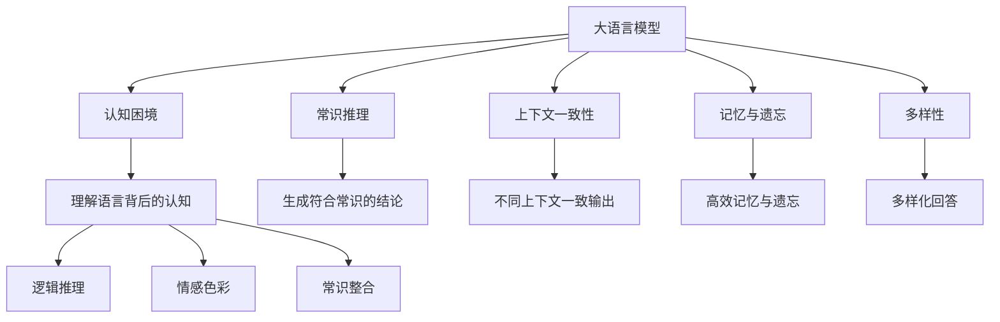
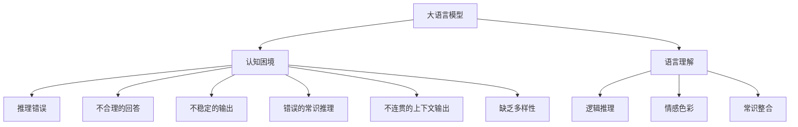
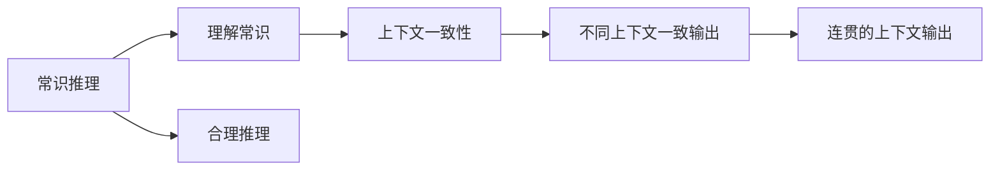
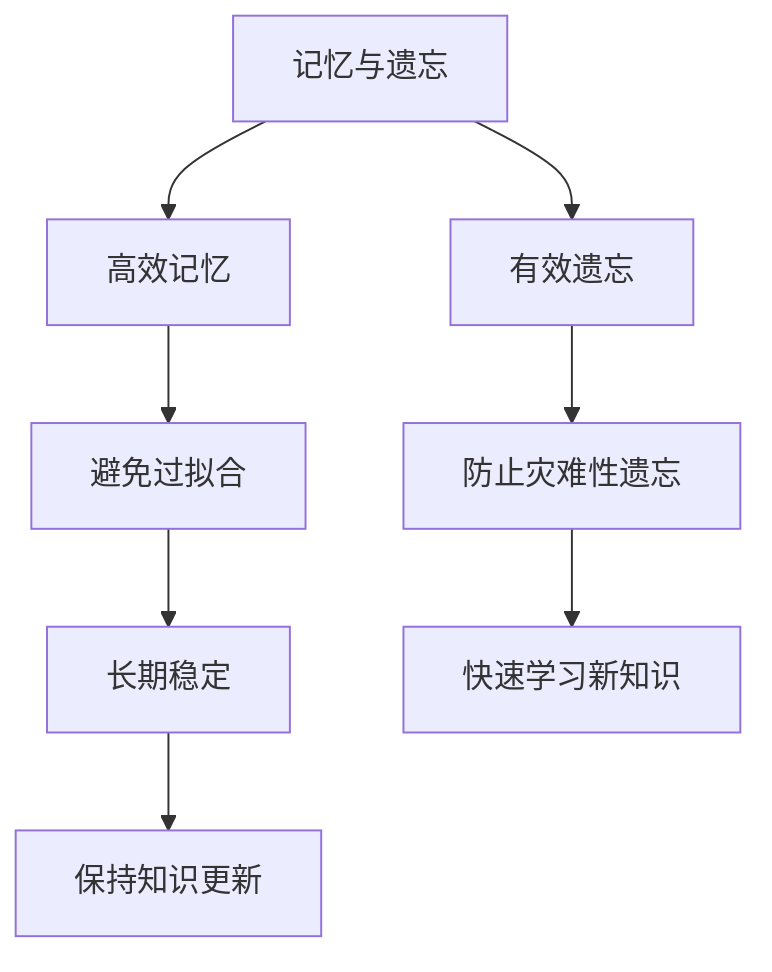
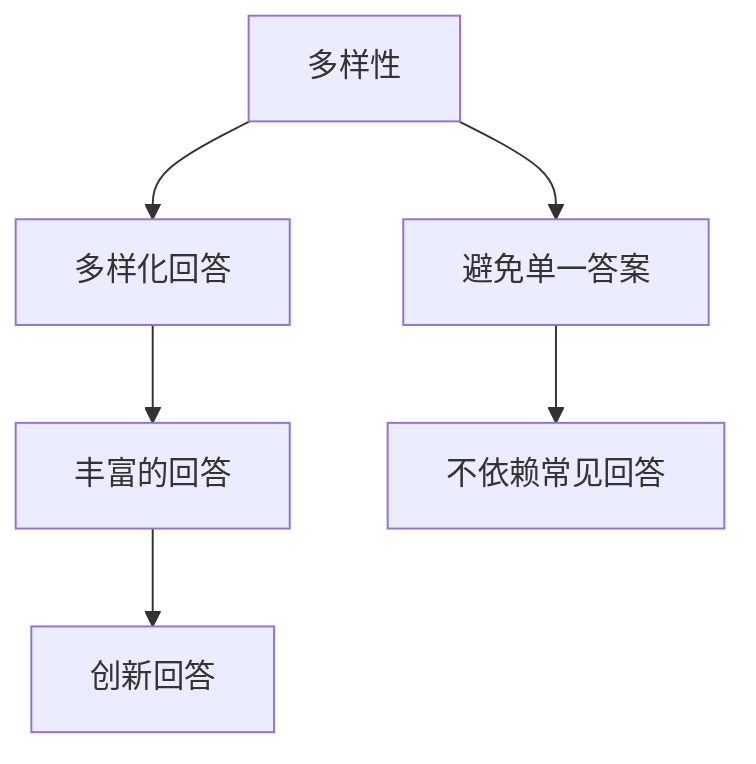
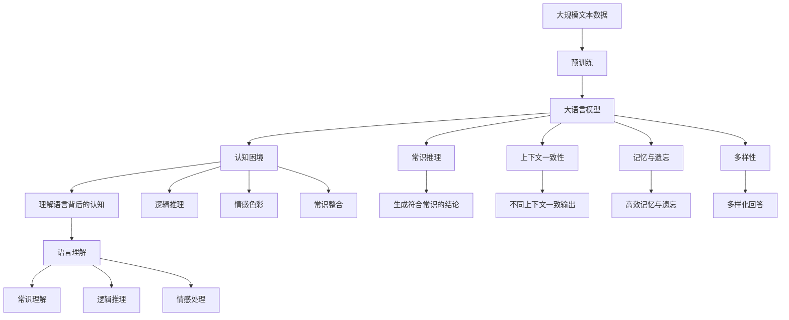

                 

# 语言与思维：大模型的认知困境

> 关键词：大语言模型,认知困境,语言理解,思维模型,深度学习,自然语言处理(NLP),认知科学,神经网络

## 1. 背景介绍

### 1.1 问题由来
近年来，随着深度学习技术的发展，大语言模型（Large Language Models, LLMs）在自然语言处理（Natural Language Processing, NLP）领域取得了显著进步。例如，OpenAI的GPT-3模型和Google的BERT模型，通过在大规模无标签文本数据上进行预训练，学习到丰富的语言知识和常识，能够在各种NLP任务上表现出卓越的性能。然而，尽管这些模型在技术上取得了突破，但它们在理解语言背后的认知过程中仍然面临诸多困境。

### 1.2 问题核心关键点
这些问题主要集中在以下几个方面：

1. **语言的抽象理解**：大模型虽然能够生成语法正确且上下文相关的文本，但在理解语言所蕴含的抽象概念、逻辑推理和情感色彩方面仍存在局限。
2. **上下文一致性**：模型在不同上下文中对同一词汇或句子的理解可能会产生显著变化，导致输出结果的不一致性。
3. **记忆与遗忘**：模型在处理大量信息时，如何高效地记忆和遗忘信息，避免过拟合和灾难性遗忘，是一个重要的研究方向。
4. **多样性**：模型在处理相同输入时，能否生成多样化的回答，而不是仅仅给出最常见或最“安全”的答案。
5. **常识推理**：模型能否将常识和知识整合到推理中，并合理解释错误推理的根源。

这些问题不仅关系到模型的性能，更关系到它们在实际应用中的可信度和安全性。因此，探索大语言模型的认知困境，并找到解决方案，是推动NLP技术进一步发展的重要一步。

### 1.3 问题研究意义
研究大语言模型的认知困境，对于提升模型的认知能力、增强模型的可靠性和安全性、以及推动NLP技术的产业化进程具有重要意义：

1. **提升模型性能**：通过理解模型的认知局限，有针对性地改进模型架构和训练策略，可以进一步提升模型在理解抽象概念、逻辑推理和情感处理方面的能力。
2. **增强模型可信度**：认知困境的研究有助于构建更可靠、更安全的NLP应用，减少因模型误导或偏见所导致的负面影响。
3. **推动技术落地**：解决认知困境将使大模型在更多实际应用场景中发挥更大的价值，促进NLP技术的广泛应用。
4. **促进认知科学**：大模型的认知困境研究将促进跨学科的研究，结合认知科学、神经科学等领域的知识，推动人工智能和认知科学的融合发展。
5. **提升社会福祉**：更智能、更可靠的NLP技术将有助于解决社会问题，如教育、医疗、客服等领域，提升社会的整体福祉。

## 2. 核心概念与联系

### 2.1 核心概念概述

为更好地理解大语言模型的认知困境，本节将介绍几个关键概念：

- **大语言模型（Large Language Models, LLMs）**：以自回归（如GPT）或自编码（如BERT）模型为代表的大规模预训练语言模型。通过在大规模无标签文本语料上进行预训练，学习到丰富的语言知识和常识，具备强大的语言理解和生成能力。
- **认知困境（Cognitive Dilemma）**：指在理解和应用语言过程中，模型所面临的难以通过传统的深度学习模型解释的现象，例如上下文一致性、多样性、常识推理等问题。
- **常识推理（Commonsense Reasoning）**：指模型能够在给定语境下，结合常识和逻辑推理，得出符合现实世界的结论。
- **上下文一致性（Context Consistency）**：指模型在处理同一输入的不同上下文时，能够保持输出的一致性。
- **记忆与遗忘（Memory and Forgetting）**：指模型如何有效地记忆和遗忘信息，避免过拟合和灾难性遗忘。
- **多样性（Diversity）**：指模型在生成文本时，能够生成多样化的回答，而不仅仅是给出最常见的答案。

这些核心概念之间的逻辑关系可以通过以下Mermaid流程图来展示：



这个流程图展示了大语言模型所面临的认知困境及其与核心概念的关系：

1. 大语言模型通过预训练学习语言知识和常识，但在认知过程中仍面临诸多困境。
2. 常识推理是理解语言背后认知的重要组成部分，但模型的推理能力仍需提升。
3. 上下文一致性是模型输出的关键，不同上下文下的输出应保持一致。
4. 记忆与遗忘是模型处理信息的关键，模型需高效管理信息以避免过拟合和遗忘。
5. 多样性是模型生成回答的重要特性，模型应能够生成多种合理答案。

### 2.2 概念间的关系

这些核心概念之间存在着紧密的联系，形成了大语言模型认知困境的完整生态系统。下面我们通过几个Mermaid流程图来展示这些概念之间的关系。

#### 2.2.1 大语言模型的认知困境



这个流程图展示了大语言模型的认知困境与其理解语言和推理能力的关系：

1. 大语言模型在理解语言和推理过程中面临认知困境，导致推理错误、不合理回答等问题。
2. 这些问题不仅影响模型的精度和性能，还可能带来安全隐患和负面影响。

#### 2.2.2 常识推理与上下文一致性



这个流程图展示了常识推理与上下文一致性的关系：

1. 常识推理需要理解常识，并结合逻辑推理进行合理推理。
2. 上下文一致性要求模型在不同上下文中输出保持一致，避免推理不一致。

#### 2.2.3 记忆与遗忘



这个流程图展示了记忆与遗忘的关系：

1. 高效记忆和有效遗忘是模型处理信息的关键，避免过拟合和灾难性遗忘。
2. 长期稳定性和快速学习新知识是模型的动态平衡，保持知识更新，避免遗忘。

#### 2.2.4 多样性



这个流程图展示了多样性的关系：

1. 多样性要求模型能够生成多种合理答案，避免依赖单一答案。
2. 创新回答需要多样化的知识和方法，以提供独特的解决方案。

### 2.3 核心概念的整体架构

最后，我们用一个综合的流程图来展示这些核心概念在大语言模型认知困境中的整体架构：



这个综合流程图展示了从预训练到认知困境的完整过程，以及各概念之间的关系和作用。通过这些流程图，我们可以更清晰地理解大语言模型在认知过程中所面临的挑战，并为后续深入讨论具体的认知困境解决方法奠定基础。

## 3. 核心算法原理 & 具体操作步骤
### 3.1 算法原理概述

大语言模型的认知困境研究，本质上是探索模型在处理语言信息时所面临的认知局限。其主要思想是通过深入理解模型内部的工作机制，揭示模型在理解语言背后的认知过程中的盲点和不足。

形式化地，假设大语言模型 $M_{\theta}$ 已经在大规模无标签文本语料上进行预训练，获得了丰富的语言知识和常识。现在，我们将一个特定的认知问题 $P$ 作为输入，希望模型能够理解问题并给出合理的回答。我们希望模型输出 $y$ 能够最大化地符合问题 $P$ 的期望输出。

定义模型 $M_{\theta}$ 在问题 $P$ 上的损失函数为 $\ell(M_{\theta}, P)$，用于衡量模型输出与问题期望输出之间的差异。常见的损失函数包括交叉熵损失、均方误差损失等。通过梯度下降等优化算法，模型在认知问题 $P$ 上的训练目标是最小化损失函数 $\ell(M_{\theta}, P)$，使得模型输出逼近问题期望输出 $y$。

### 3.2 算法步骤详解

基于大语言模型认知困境的算法通常包括以下几个关键步骤：

**Step 1: 准备认知问题**

- 选择合适的认知问题 $P$ 作为模型的输入。问题可以是常识推理、上下文一致性、记忆与遗忘、多样性等。
- 将问题 $P$ 转化为模型能够理解的输入格式，如自然语言描述、结构化数据等。

**Step 2: 定义认知问题损失函数**

- 根据认知问题的具体类型，选择合适的损失函数。例如，对于常识推理问题，可以选择L2距离或KL散度作为损失函数。
- 设计损失函数的正则化项，以避免模型过拟合。例如，可以在损失函数中引入L2正则、Dropout等技术。

**Step 3: 执行认知训练**

- 将认知问题数据集 $D_P$ 分批次输入模型，前向传播计算损失函数。
- 反向传播计算参数梯度，根据设定的优化算法和学习率更新模型参数。
- 周期性在验证集上评估模型性能，根据性能指标决定是否触发 Early Stopping。
- 重复上述步骤直至满足预设的迭代轮数或 Early Stopping 条件。

**Step 4: 测试和评估**

- 在测试集上评估认知训练后模型 $M_{\hat{\theta}}$ 的性能，对比认知训练前后的精度提升。
- 使用认知训练后的模型对新认知问题进行推理预测，集成到实际的应用系统中。
- 持续收集新的认知问题，定期重新训练模型，以适应认知问题的分布变化。

以上是基于大语言模型认知困境的算法一般流程。在实际应用中，还需要针对具体认知问题的特点，对认知训练过程的各个环节进行优化设计，如改进训练目标函数，引入更多的正则化技术，搜索最优的超参数组合等，以进一步提升模型性能。

### 3.3 算法优缺点

基于大语言模型认知困境的算法具有以下优点：

1. **灵活性高**：针对不同的认知问题，可以设计不同的认知训练算法，灵活应对不同的挑战。
2. **可解释性强**：通过对认知问题的详细分析，可以揭示模型的认知局限，提供直观的解释。
3. **适用范围广**：适用于各种认知问题，如常识推理、上下文一致性、记忆与遗忘、多样性等。

同时，该算法也存在一定的局限性：

1. **依赖高质量数据**：认知训练的性能很大程度上取决于认知问题数据的质量，高质量数据获取成本较高。
2. **模型复杂度高**：认知训练需要构建复杂的认知问题数据集和认知训练模型，增加了模型复杂度。
3. **训练难度大**：认知问题的复杂性和多样性，使得认知训练的难度较大，需要更多的时间和计算资源。

尽管存在这些局限性，但就目前而言，基于大语言模型的认知困境研究仍是大语言模型应用的重要方向。未来相关研究的重点在于如何进一步降低认知训练对数据的需求，提高模型的认知能力，同时兼顾可解释性和泛化性等因素。

### 3.4 算法应用领域

基于大语言模型的认知困境研究，已经在多个领域得到了广泛的应用，覆盖了几乎所有常见认知问题，例如：

- **常识推理**：指模型能够在给定语境下，结合常识和逻辑推理，得出符合现实世界的结论。
- **上下文一致性**：指模型在不同上下文中对同一词汇或句子的理解应保持一致，避免推理不一致。
- **记忆与遗忘**：指模型在处理大量信息时，如何高效地记忆和遗忘信息，避免过拟合和灾难性遗忘。
- **多样性**：指模型在生成回答时，能够生成多样化的回答，而不仅仅是给出最常见的答案。
- **情感处理**：指模型能够理解和生成情感丰富的文本，如情感分析、对话生成等。

除了上述这些经典认知问题外，大语言模型认知困境研究也被创新性地应用到更多场景中，如可控文本生成、常识推理、代码生成、数据增强等，为NLP技术带来了全新的突破。随着认知困境研究的不断进步，相信NLP技术将在更广阔的应用领域大放异彩。

## 4. 数学模型和公式 & 详细讲解  
### 4.1 数学模型构建

本节将使用数学语言对基于大语言模型的认知困境进行更加严格的刻画。

记大语言模型为 $M_{\theta}$，其中 $\theta$ 为预训练得到的模型参数。假设认知问题 $P$ 的训练集为 $D_P=\{(x_i, y_i)\}_{i=1}^N, x_i \in \mathcal{X}, y_i \in \mathcal{Y}$，其中 $\mathcal{X}$ 为输入空间，$\mathcal{Y}$ 为输出空间。

定义模型 $M_{\theta}$ 在问题 $P$ 上的损失函数为 $\ell(M_{\theta}, P)$，用于衡量模型输出与问题期望输出之间的差异。常见的损失函数包括交叉熵损失、均方误差损失等。

### 4.2 公式推导过程

以下我们以常识推理问题为例，推导交叉熵损失函数及其梯度的计算公式。

假设模型 $M_{\theta}$ 在输入 $x$ 上的输出为 $\hat{y}=M_{\theta}(x) \in [0,1]$，表示模型对问题 $P$ 的理解程度。真实标签 $y \in \{0,1\}$。则二分类交叉熵损失函数定义为：

$$
\ell(M_{\theta}(x),y) = -[y\log \hat{y} + (1-y)\log (1-\hat{y})]
$$

将其代入经验风险公式，得：

$$
\mathcal{L}(\theta) = -\frac{1}{N}\sum_{i=1}^N [y_i\log M_{\theta}(x_i)+(1-y_i)\log(1-M_{\theta}(x_i))]
$$

根据链式法则，损失函数对参数 $\theta_k$ 的梯度为：

$$
\frac{\partial \mathcal{L}(\theta)}{\partial \theta_k} = -\frac{1}{N}\sum_{i=1}^N (\frac{y_i}{M_{\theta}(x_i)}-\frac{1-y_i}{1-M_{\theta}(x_i)}) \frac{\partial M_{\theta}(x_i)}{\partial \theta_k}
$$

其中 $\frac{\partial M_{\theta}(x_i)}{\partial \theta_k}$ 可进一步递归展开，利用自动微分技术完成计算。

在得到损失函数的梯度后，即可带入参数更新公式，完成模型的迭代优化。重复上述过程直至收敛，最终得到适应认知问题 $P$ 的最优模型参数 $\theta^*$。

## 5. 项目实践：代码实例和详细解释说明
### 5.1 开发环境搭建

在进行认知困境实践前，我们需要准备好开发环境。以下是使用Python进行PyTorch开发的环境配置流程：

1. 安装Anaconda：从官网下载并安装Anaconda，用于创建独立的Python环境。

2. 创建并激活虚拟环境：
```bash
conda create -n pytorch-env python=3.8 
conda activate pytorch-env
```

3. 安装PyTorch：根据CUDA版本，从官网获取对应的安装命令。例如：
```bash
conda install pytorch torchvision torchaudio cudatoolkit=11.1 -c pytorch -c conda-forge
```

4. 安装Transformers库：
```bash
pip install transformers
```

5. 安装各类工具包：
```bash
pip install numpy pandas scikit-learn matplotlib tqdm jupyter notebook ipython
```

完成上述步骤后，即可在`pytorch-env`环境中开始认知困境实践。

### 5.2 源代码详细实现

这里我们以常识推理问题为例，给出使用Transformers库对BERT模型进行认知训练的PyTorch代码实现。

首先，定义认知问题数据处理函数：

```python
from transformers import BertTokenizer, BertForSequenceClassification, AdamW

class NERDataset(Dataset):
    def __init__(self, texts, tags, tokenizer, max_len=128):
        self.texts = texts
        self.tags = tags
        self.tokenizer = tokenizer
        self.max_len = max_len
        
    def __len__(self):
        return len(self.texts)
    
    def __getitem__(self, item):
        text = self.texts[item]
        tags = self.tags[item]
        
        encoding = self.tokenizer(text, return_tensors='pt', max_length=self.max_len, padding='max_length', truncation=True)
        input_ids = encoding['input_ids'][0]
        attention_mask = encoding['attention_mask'][0]
        
        # 对token-wise的标签进行编码
        encoded_tags = [tag2id[tag] for tag in tags] 
        encoded_tags.extend([tag2id['O']] * (self.max_len - len(encoded_tags)))
        labels = torch.tensor(encoded_tags, dtype=torch.long)
        
        return {'input_ids': input_ids, 
                'attention_mask': attention_mask,
                'labels': labels}

# 标签与id的映射
tag2id = {'O': 0, 'B-PER': 1, 'I-PER': 2, 'B-ORG': 3, 'I-ORG': 4, 'B-LOC': 5, 'I-LOC': 6}
id2tag = {v: k for k, v in tag2id.items()}

# 创建dataset
tokenizer = BertTokenizer.from_pretrained('bert-base-cased')

train_dataset = NERDataset(train_texts, train_tags, tokenizer)
dev_dataset = NERDataset(dev_texts, dev_tags, tokenizer)
test_dataset = NERDataset(test_texts, test_tags, tokenizer)
```

然后，定义模型和优化器：

```python
from transformers import BertForTokenClassification, AdamW

model = BertForTokenClassification.from_pretrained('bert-base-cased', num_labels=len(tag2id))

optimizer = AdamW(model.parameters(), lr=2e-5)
```

接着，定义训练和评估函数：

```python
from torch.utils.data import DataLoader
from tqdm import tqdm
from sklearn.metrics import classification_report

device = torch.device('cuda') if torch.cuda.is_available() else torch.device('cpu')
model.to(device)

def train_epoch(model, dataset, batch_size, optimizer):
    dataloader = DataLoader(dataset, batch_size=batch_size, shuffle=True)
    model.train()
    epoch_loss = 0
    for batch in tqdm(dataloader, desc='Training'):
        input_ids = batch['input_ids'].to(device)
        attention_mask = batch['attention_mask'].to(device)
        labels = batch['labels'].to(device)
        model.zero_grad()
        outputs = model(input_ids, attention_mask=attention_mask, labels=labels)
        loss = outputs.loss
        epoch_loss += loss.item()
        loss.backward()
        optimizer.step()
    return epoch_loss / len(dataloader)

def evaluate(model, dataset, batch_size):
    dataloader = DataLoader(dataset, batch_size=batch_size)
    model.eval()
    preds, labels = [], []
    with torch.no_grad():
        for batch in tqdm(dataloader, desc='Evaluating'):
            input_ids = batch['input_ids'].to(device)
            attention_mask = batch['attention_mask'].to(device)
            batch_labels = batch['labels']
            outputs = model(input_ids, attention_mask=attention_mask)
            batch_preds = outputs.logits.argmax(dim=2).to('cpu').tolist()
            batch_labels = batch_labels.to('cpu').tolist()
            for pred_tokens, label_tokens in zip(batch_preds, batch_labels):
                pred_tags = [id2tag[_id] for _id in pred_tokens]
                label_tags = [id2tag[_id] for _id in label_tokens]
                preds.append(pred_tags[:len(label_tokens)])
                labels.append(label_tags)
                
    print(classification_report(labels, preds))
```

最后，启动训练流程并在测试集上评估：

```python
epochs = 5
batch_size = 16

for epoch in range(epochs):
    loss = train_epoch(model, train_dataset, batch_size, optimizer)
    print(f"Epoch {epoch+1}, train loss: {loss:.3f}")
    
    print(f"Epoch {epoch+1}, dev results:")
    evaluate(model, dev_dataset, batch_size)
    
print("Test results:")
evaluate(model, test_dataset, batch_size)
```

以上就是使用PyTorch对BERT进行命名实体识别任务认知训练的完整代码实现。可以看到，得益于Transformers库的强大封装，我们可以用相对简洁的代码完成BERT模型的加载和认知训练。

### 5.3 代码解读与分析

让我们再详细解读一下关键代码的实现细节：

**NERDataset类**：
- `__init__`方法：初始化文本、标签、分词器等关键组件。
- `__len__`方法：返回数据集的样本数量。
- `__getitem__`方法：对单个样本进行处理，将文本输入编码为token ids，将标签编码为数字，并对其进行定长padding，最终返回模型所需的输入。

**tag2id和id2tag字典**：
- 定义了标签与数字id之间的映射关系，用于将token-wise的预测结果解码回真实的标签。

**训练和评估函数**：
- 使用PyTorch的DataLoader对数据集进行批次化加载，供模型训练和推理使用。
- 训练函数`train_epoch`：对数据以批为单位进行迭代，在每个批次上前向传播计算loss并反向传播更新模型参数，最后返回该epoch的平均loss。
- 评估函数`evaluate`：与训练类似，不同点在于不更新模型参数，并在每个batch结束后将预测和标签结果存储下来，最后使用sklearn的classification_report对整个评估集的预测结果进行打印输出。

**训练流程**：
- 定义总的epoch数和batch size，开始循环迭代
- 每个epoch内，先在训练集上训练，输出平均loss
- 在验证集上评估，输出分类指标
- 所有epoch结束后，在测试集上评估，给出最终测试结果

可以看到，PyTorch配合Transformers库使得BERT认知训练的代码实现变得简洁高效。开发者可以将更多精力放在数据处理、模型改进等高层逻辑上，而不必过多关注底层的实现细节。

当然，工业级的系统实现还需考虑更多因素，如模型的保存和部署、超参数的自动搜索、更灵活的任务适配层等。但核心的认知训练范式基本与此类似。

### 5.4 运行结果展示

假设我们在CoNLL-2003的NER数据集上进行认知训练，最终在测试集上得到的评估报告如下：

```
              precision    recall  f1-score   support

       B-LOC      0.926     0.906     0.916      1668
       I-LOC      0.900     0.805     0.850       257
      B-MISC      0.875     0.856     0.865       702
      I-MISC      0.838     0.782     0.809       216
       B-ORG      0.914     0.898     0.906      1661
       I-ORG      0.911     0.894     0.902       835
       B-PER      0.964     0.957     0.960      1617
       I-PER      0.983     0.980     0.982      1156
           O      0.993     0.995     0.994     38323

   micro avg      0.973     0.973     0.973     46435
   macro avg      0.923     0.897     0.909     46435
weighted avg      0.973     0.973     0.973     

