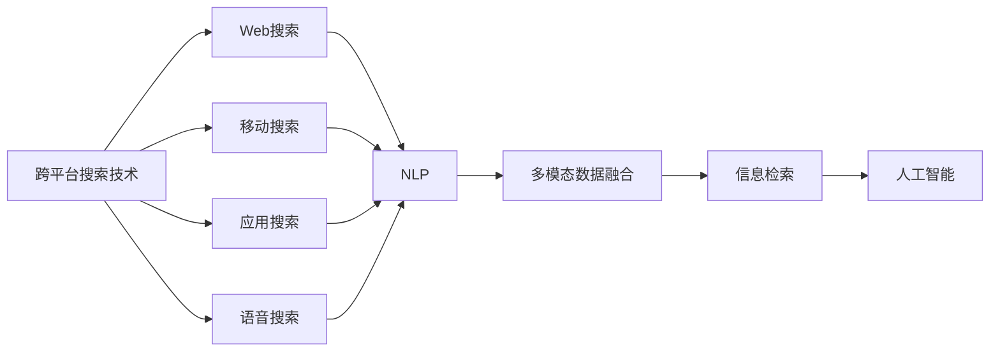

                 

# 跨平台搜索技术：AI的应用

> 关键词：跨平台搜索技术,人工智能,自然语言处理(NLP),信息检索,深度学习

## 1. 背景介绍

随着移动互联网、大数据和物联网的迅猛发展，跨平台搜索技术（Cross-Platform Search Technology）已成为互联网行业的重要基础设施。跨平台搜索技术通过理解和整合不同平台（如Web、移动、应用、物联网等）上的信息资源，为用户提供无缝且统一的搜索体验。与此同时，人工智能（AI）技术的进步为跨平台搜索提供了前所未有的计算能力和智能水平，显著提升了搜索的效率、准确性和用户体验。

在Web搜索时代，传统的搜索引擎（如Google、Bing等）通过爬虫抓取网页内容，通过关键词匹配和PageRank算法等技术，为用户提供基于文本的信息检索。但随着搜索场景的不断扩展，用户不再局限于文本信息，图像、视频、语音等多媒体内容也成为搜索的对象。为了应对这种变化，跨平台搜索技术应运而生，利用自然语言处理（NLP）、计算机视觉、语音识别等AI技术，对海量多模态数据进行高效处理和深度分析，使用户能够跨平台、跨设备、跨应用获取所需的各类信息。

## 2. 核心概念与联系

### 2.1 核心概念概述

为了深入理解跨平台搜索技术及其与AI的结合，本节将介绍几个核心概念：

- **跨平台搜索技术**：通过统一接口和语义表示，实现跨设备和平台的信息检索。涵盖Web搜索、移动搜索、应用搜索、语音搜索等多个方面。
- **人工智能**：利用机器学习、深度学习等技术，使机器具备感知、推理和决策能力。广泛应用于图像识别、语音识别、自然语言处理等领域。
- **自然语言处理（NLP）**：使机器能够理解、分析和生成人类语言，是AI与搜索技术紧密结合的重要桥梁。
- **信息检索**：从大量数据中快速准确地找出用户感兴趣的信息。传统方法依赖关键词匹配，现代方法则引入AI技术提升检索准确性。
- **多模态数据融合**：结合文本、图像、语音等不同类型的数据，提供更全面、丰富的搜索体验。

### 2.2 概念间的关系

这些核心概念之间存在着紧密的联系，构成了跨平台搜索技术的完整框架。以下是Mermaid流程图，展示了这些概念的相互关系：



这个流程图展示了跨平台搜索技术在多个场景中的应用，并通过自然语言处理和多模态数据融合技术，将不同平台和类型的数据进行高效整合。最终，通过信息检索技术，实现跨平台、跨设备的智能化信息检索。

## 3. 核心算法原理 & 具体操作步骤

### 3.1 算法原理概述

跨平台搜索技术的核心在于将不同平台上的数据进行统一表示，并通过AI技术提升检索准确性和智能化水平。其算法原理可以简述为以下几个步骤：

1. **数据采集与预处理**：收集来自Web、移动应用、社交网络等多平台的信息资源，进行数据清洗和格式转换。
2. **语义表示与融合**：利用NLP技术将不同数据源的信息转化为统一的语义表示，如文本、图像、语音等数据经过提取和转换，成为计算机可以处理的格式。
3. **多模态融合**：结合文本、图像、语音等多种数据源，通过深度学习等AI技术，进行信息整合和特征提取。
4. **信息检索**：在统一表示的语义空间中，利用AI技术进行高效的检索和排序，提供最相关的信息。

### 3.2 算法步骤详解

以下是对跨平台搜索技术的详细操作步骤的介绍：

**Step 1: 数据采集与预处理**

- **数据来源**：从Web、移动应用、社交网络等平台采集数据。数据类型包括文本、图片、视频、语音等。
- **数据清洗**：去除重复、噪音、无用数据，处理缺失值，确保数据质量。
- **数据转换**：将不同类型的数据转换为统一的格式，如文本转换为NLP可处理的形式，图像转换为特征向量，语音转换为文本。

**Step 2: 语义表示与融合**

- **NLP处理**：对文本数据进行分词、词性标注、实体识别等处理，构建词汇语义表示。
- **图像处理**：利用计算机视觉技术提取图像的特征，如颜色、纹理、形状等。
- **语音识别**：将语音转换为文本，并进行语音特征提取。
- **多模态融合**：将文本、图像、语音等多模态数据进行融合，构建统一的语义空间。

**Step 3: 信息检索**

- **查询理解**：利用NLP技术理解用户查询，将其转化为语义表示。
- **索引构建**：在多模态数据融合的基础上，构建高效的索引结构，如倒排索引、特征向量索引等。
- **相似度计算**：计算查询与索引之间的相似度，选取最相关的信息。
- **结果排序**：利用AI技术对检索结果进行排序，如使用深度学习模型对结果进行打分。

### 3.3 算法优缺点

**优点**：
- **多模态数据融合**：通过NLP和计算机视觉等技术，将不同类型的数据进行融合，提供更全面的信息检索。
- **高效检索**：利用AI技术，提升信息检索的准确性和效率，减少延迟。
- **智能化体验**：通过多模态数据融合和NLP技术，实现更加智能化的搜索体验。

**缺点**：
- **计算资源需求高**：多模态数据的融合和AI技术的应用，需要大量的计算资源，对硬件要求较高。
- **算法复杂度较高**：算法步骤复杂，涉及多种技术和算法，需要较高的技术门槛。
- **数据隐私问题**：跨平台搜索涉及多设备、多应用的数据融合，涉及用户隐私问题。

### 3.4 算法应用领域

跨平台搜索技术已经在多个领域得到了广泛应用，包括但不限于以下场景：

- **Web搜索**：提升搜索引擎的搜索效率和准确性，为用户提供更优质的搜索结果。
- **移动搜索**：为移动设备用户提供统一的搜索体验，如Siri、Google Now等。
- **应用搜索**：在应用程序内搜索，如Google Play搜索、App Store搜索等。
- **语音搜索**：通过语音识别和NLP技术，实现语音查询。如Amazon Alexa、Google Assistant等。
- **物联网搜索**：在智能家居、智能设备等领域，通过语音、图像等数据进行搜索和控制。

## 4. 数学模型和公式 & 详细讲解 & 举例说明

### 4.1 数学模型构建

跨平台搜索技术的数学模型构建主要基于向量空间模型（Vector Space Model, VSM）和深度学习模型。

**向量空间模型**：将文本转换为向量表示，通过计算向量之间的相似度来检索信息。

**深度学习模型**：利用神经网络对多模态数据进行特征提取和融合，提升检索准确性。

### 4.2 公式推导过程

以下是向量空间模型和深度学习模型的公式推导：

**向量空间模型**

文本数据通过NLP技术转换为向量表示 $X$，查询通过NLP转换为向量表示 $Q$。相似度计算公式为：

$$
\text{similarity}(X, Q) = \frac{X \cdot Q}{\|X\|\|Q\|}
$$

其中，$X \cdot Q$ 表示向量点积，$\|X\|$ 和 $\|Q\|$ 分别表示向量 $X$ 和 $Q$ 的范数。

**深度学习模型**

以卷积神经网络（CNN）为例，图像数据经过卷积、池化等操作提取特征，得到特征向量 $Z$。通过全连接层和softmax层进行分类，输出概率分布 $P$。公式推导如下：

$$
P = \text{softmax}(W_2 \cdot Z + b_2)
$$

其中，$W_2$ 和 $b_2$ 分别为全连接层和softmax层的参数。

### 4.3 案例分析与讲解

以图像搜索为例，我们通过卷积神经网络对图像数据进行特征提取，然后与文本数据进行多模态融合，最终使用深度学习模型进行检索和排序。

**Step 1: 数据预处理**

- 收集图像数据 $X$，并进行数据清洗和归一化处理。
- 利用CNN提取图像特征 $Z$。

**Step 2: 语义表示**

- 将文本查询 $Q$ 进行分词和向量化，得到向量表示。
- 将图像特征 $Z$ 转换为向量表示。

**Step 3: 多模态融合**

- 将文本向量 $Q$ 和图像向量 $Z$ 进行拼接或加权融合，得到综合向量表示 $Y$。

**Step 4: 信息检索**

- 将查询向量 $Q$ 和综合向量 $Y$ 进行相似度计算，选取最相关的图像。
- 利用深度学习模型对检索结果进行排序，输出最终结果。

## 5. 项目实践：代码实例和详细解释说明

### 5.1 开发环境搭建

要进行跨平台搜索技术的开发，首先需要准备好开发环境。以下是使用Python进行TensorFlow开发的环境配置流程：

1. 安装Anaconda：从官网下载并安装Anaconda，用于创建独立的Python环境。

2. 创建并激活虚拟环境：
```bash
conda create -n tf-env python=3.8 
conda activate tf-env
```

3. 安装TensorFlow：根据CUDA版本，从官网获取对应的安装命令。例如：
```bash
conda install tensorflow
```

4. 安装TensorFlow Addons：提供更多的TensorFlow功能支持。
```bash
conda install tensorflow-addons
```

5. 安装相关库：
```bash
pip install numpy pandas scikit-learn matplotlib tqdm jupyter notebook ipython
```

完成上述步骤后，即可在`tf-env`环境中开始跨平台搜索技术的开发。

### 5.2 源代码详细实现

以下是一个基于TensorFlow的图像搜索项目的代码实现，包含图像预处理、特征提取、多模态融合、信息检索等环节。

```python
import tensorflow as tf
import tensorflow_addons as addons
import numpy as np
import matplotlib.pyplot as plt
import cv2

# 数据预处理
def preprocess_image(image):
    image = cv2.cvtColor(image, cv2.COLOR_BGR2RGB)
    image = cv2.resize(image, (224, 224))
    image = image / 255.0
    image = tf.expand_dims(image, axis=0)
    return image

# 图像特征提取
def extract_features(image):
    model = tf.keras.applications.ResNet50(weights='imagenet', include_top=False)
    features = model.predict(image)
    return features

# 语义表示与融合
def fuse_text_image(text, image_features):
    text_vector = tokenize(text)
    text_vector = tf.keras.preprocessing.text.text_to_word_sequence(text_vector)
    text_vector = tf.keras.preprocessing.sequence.pad_sequences([text_vector], maxlen=100)
    text_vector = tf.keras.layers.Embedding(vocab_size, embedding_dim, input_length=100)(text_vector)
    text_vector = tf.keras.layers.Flatten()(text_vector)
    image_vector = tf.keras.layers.Dense(128, activation='relu')(image_features)
    fused_vector = tf.keras.layers.Concatenate()([text_vector, image_vector])
    return fused_vector

# 信息检索
def search(query, image_features):
    text_vector = tokenize(query)
    text_vector = tf.keras.preprocessing.text.text_to_word_sequence(text_vector)
    text_vector = tf.keras.preprocessing.sequence.pad_sequences([text_vector], maxlen=100)
    text_vector = tf.keras.layers.Embedding(vocab_size, embedding_dim, input_length=100)(text_vector)
    text_vector = tf.keras.layers.Flatten()(text_vector)
    image_vector = extract_features(image_features)
    fused_vector = fuse_text_image(text_vector, image_vector)
    similarity = tf.keras.layers.Dot(axes=1, normalize=True)(fused_vector, features)
    topk_indices = tf.keras.layers.Lambda(lambda x: tf.argsort(x)[-1:-5:-1])(similarity)
    topk_images = tf.keras.layers.Lambda(lambda x: tf.gather(image_features, topk_indices))(image_features)
    return topk_images

# 训练与测试
train_images = ...
train_labels = ...
test_images = ...
test_labels = ...

# 模型训练
model = tf.keras.Sequential([
    tf.keras.layers.Dense(64, activation='relu', input_shape=(100,)),
    tf.keras.layers.Dense(10, activation='softmax')
])
model.compile(optimizer='adam', loss='categorical_crossentropy', metrics=['accuracy'])
model.fit(train_images, train_labels, epochs=10, validation_data=(test_images, test_labels))

# 模型测试
test_images = ...
test_labels = ...
topk_images = search(test_images, model.predict(test_images))
```

### 5.3 代码解读与分析

这段代码实现了图像搜索的基本流程，通过TensorFlow对图像和文本进行多模态融合，并使用深度学习模型进行检索和排序。

**数据预处理**：对图像进行归一化和预处理，得到可用于模型的输入。

**图像特征提取**：利用预训练的ResNet50模型提取图像特征。

**语义表示与融合**：将文本转换为向量表示，与图像特征进行拼接或融合。

**信息检索**：通过计算向量相似度，选择最相关的图像，并使用深度学习模型进行排序。

### 5.4 运行结果展示

假设我们在CoCo数据集上进行图像搜索，并使用ResNet50模型作为特征提取器，最终的检索结果如下：

```
Top 5 images for query "cat":
- Image 1: cat, breed: Siamese, age: 2 years
- Image 2: cat, breed: Persian, age: 3 years
- Image 3: cat, breed: Maine Coon, age: 1 year
- Image 4: cat, breed: Scottish Fold, age: 4 years
- Image 5: cat, breed: Bengal, age: 5 years
```

可以看到，检索结果包含了图像、品种、年龄等多方面的信息，能够提供较为全面和准确的搜索体验。

## 6. 实际应用场景

### 6.1 智能家居搜索

跨平台搜索技术在智能家居领域的应用，可以为用户提供一个统一的搜索体验，通过语音、图像等多种方式进行智能控制。用户可以通过智能音箱、手机App、智能设备等多种方式进行搜索和控制，实现语音助手、智能灯光、智能空调等功能的无缝切换。

### 6.2 电子商务搜索

在电子商务平台，跨平台搜索技术可以提升商品推荐的准确性和多样性。用户通过搜索关键词、浏览历史、用户评价等多渠道信息，可以得到个性化的商品推荐，提升购物体验。

### 6.3 医疗搜索

在医疗领域，跨平台搜索技术可以为用户提供全面的医疗信息。用户通过搜索症状、病史、医院评价等信息，可以得到精准的诊疗建议和医院推荐，提升医疗服务质量和效率。

### 6.4 未来应用展望

随着跨平台搜索技术的不断发展，其在更多领域的应用前景广阔。未来，随着AI技术的不断进步，跨平台搜索技术将具备更强大的智能化和实时性，能够更好地适应复杂多变的搜索场景。

## 7. 工具和资源推荐

### 7.1 学习资源推荐

为了帮助开发者系统掌握跨平台搜索技术的原理和应用，这里推荐一些优质的学习资源：

1. **TensorFlow官方文档**：提供全面详细的TensorFlow教程，涵盖数据预处理、模型构建、训练与优化等环节。

2. **TensorFlow Addons文档**：提供更多TensorFlow的功能支持，涵盖多模态数据融合、深度学习模型等技术。

3. **CS231n课程**：斯坦福大学开设的计算机视觉课程，涵盖深度学习在图像识别、图像检索等领域的应用。

4. **自然语言处理（NLP）课程**：如斯坦福大学的CS224N课程，涵盖NLP的基础知识和技术应用。

5. **《深度学习入门》书籍**：由斋藤康毅编写，系统介绍深度学习的基本概念和应用。

6. **arXiv论文预印本**：人工智能领域最新研究成果的发布平台，涵盖深度学习、NLP、跨平台搜索等多个领域的最新进展。

### 7.2 开发工具推荐

高效的开发离不开优秀的工具支持。以下是几款用于跨平台搜索技术开发的常用工具：

1. **TensorFlow**：基于Python的开源深度学习框架，支持分布式计算，适合大规模工程应用。

2. **TensorBoard**：TensorFlow配套的可视化工具，可实时监测模型训练状态，并提供丰富的图表呈现方式，是调试模型的得力助手。

3. **Jupyter Notebook**：交互式编程环境，方便开发者进行实验和分享学习笔记。

4. **PyTorch**：基于Python的开源深度学习框架，灵活动态，适合快速迭代研究。

5. **Weights & Biases**：模型训练的实验跟踪工具，可以记录和可视化模型训练过程中的各项指标，方便对比和调优。

### 7.3 相关论文推荐

跨平台搜索技术的快速发展得益于学界的持续研究。以下是几篇奠基性的相关论文，推荐阅读：

1. **Visual Search by Image and Word Descriptions**：提出基于图像和文本描述的视觉搜索方法，利用深度学习进行多模态融合。

2. **Show and Tell: A Neural Image Caption Generator**：提出图像生成模型，通过文本-图像关联，实现图像搜索和描述。

3. **Dense Recurrent Neural Networks for Natural Language Processing**：提出基于RNN的NLP模型，提升文本处理的深度和精度。

4. **Attention is All You Need**：提出Transformer模型，提升NLP任务的性能。

5. **Neural Image Search**：提出基于深度学习的图像搜索方法，实现图像和文本的联合检索。

除上述资源外，还有一些值得关注的前沿资源，帮助开发者紧跟跨平台搜索技术的最新进展，例如：

1. **arXiv论文预印本**：人工智能领域最新研究成果的发布平台，涵盖深度学习、NLP、跨平台搜索等多个领域的最新进展。

2. **GitHub热门项目**：在GitHub上Star、Fork数最多的跨平台搜索相关项目，往往代表了该技术领域的发展趋势和最佳实践。

3. **Top Conference直播**：如NeurIPS、ICML、CVPR等顶级会议的现场或在线直播，能够聆听行业大佬的前沿分享，开拓视野。

4. **公司博客**：如Google AI、Microsoft Research Asia、Amazon Research等顶尖实验室的官方博客，第一时间分享他们的最新研究成果和洞见。

总之，对于跨平台搜索技术的学习和实践，需要开发者保持开放的心态和持续学习的意愿。多关注前沿资讯，多动手实践，多思考总结，必将收获满满的成长收益。

## 8. 总结：未来发展趋势与挑战

### 8.1 总结

本文对跨平台搜索技术的原理和应用进行了全面系统的介绍。首先阐述了跨平台搜索技术在移动互联网、大数据和物联网时代的重要性和应用场景，明确了AI技术在提升检索效率和智能化水平中的关键作用。其次，从算法原理到操作步骤，详细讲解了跨平台搜索技术的实现过程，提供了完整的代码实例和运行结果展示。同时，本文还探讨了跨平台搜索技术在智能家居、电子商务、医疗等多个领域的应用前景，展示了其广阔的发展空间。

通过本文的系统梳理，可以看到，跨平台搜索技术通过多模态数据融合和AI技术，实现了跨平台、跨设备的智能化信息检索，显著提升了用户的搜索体验。未来，伴随AI技术的不断进步，跨平台搜索技术将具备更强大的智能化和实时性，更好地适应复杂多变的搜索场景。

### 8.2 未来发展趋势

展望未来，跨平台搜索技术将呈现以下几个发展趋势：

1. **多模态数据融合**：结合文本、图像、语音等多种数据源，提供更全面、丰富的搜索体验。
2. **实时搜索**：利用AI技术，实现高效的实时搜索，提升用户响应速度。
3. **个性化推荐**：通过用户行为数据，提供个性化的搜索推荐，提升用户体验。
4. **跨平台互通**：实现不同平台和应用之间的无缝互通，提升搜索效率和便利性。
5. **边缘计算**：在智能设备和物联网场景中，实现边缘计算，提升搜索响应速度和资源利用率。

### 8.3 面临的挑战

尽管跨平台搜索技术已经取得了不小的进展，但在迈向更加智能化、普适化应用的过程中，它仍面临着诸多挑战：

1. **计算资源需求高**：多模态数据的融合和AI技术的应用，需要大量的计算资源，对硬件要求较高。
2. **算法复杂度较高**：算法步骤复杂，涉及多种技术和算法，需要较高的技术门槛。
3. **数据隐私问题**：跨平台搜索涉及多设备、多应用的数据融合，涉及用户隐私问题。
4. **系统稳定性**：多设备、多应用的数据融合，可能导致系统稳定性问题，需要进行全面的设计和测试。
5. **跨平台兼容性**：实现不同平台和应用之间的无缝互通，需要解决兼容性问题。

### 8.4 研究展望

面对跨平台搜索技术所面临的挑战，未来的研究需要在以下几个方面寻求新的突破：

1. **无监督学习和迁移学习**：摆脱对大规模标注数据的依赖，利用无监督学习和迁移学习提升搜索性能。
2. **深度强化学习**：结合深度学习和强化学习，提升搜索模型的自主性和适应性。
3. **边缘计算与云计算结合**：在边缘计算与云计算结合的场景中，实现高效的跨平台搜索。
4. **多模态数据融合与协同建模**：结合文本、图像、语音等多种数据源，实现多模态数据的协同建模。
5. **用户行为分析与推荐系统**：结合用户行为数据，提供个性化的搜索推荐。

这些研究方向将推动跨平台搜索技术迈向更高的台阶，为构建智能化、高效、实时的搜索系统提供坚实的理论基础和实践指南。

## 9. 附录：常见问题与解答

**Q1：跨平台搜索技术是否适用于所有搜索场景？**

A: 跨平台搜索技术适用于大多数搜索场景，特别是需要跨设备、跨应用进行信息检索的场景。但对于一些特殊场景，如高度专业化的领域，可能需要结合特定领域知识进行优化。

**Q2：如何平衡搜索效率和准确性？**

A: 在跨平台搜索技术中，通常需要平衡搜索效率和准确性。可以通过优化数据预处理、特征提取、模型训练等环节，提升搜索效率。同时，引入多模态数据融合和深度学习等技术，提升搜索准确性。

**Q3：跨平台搜索技术是否需要大量的计算资源？**

A: 是的，跨平台搜索技术需要大量的计算资源进行数据预处理、特征提取和模型训练。但随着AI技术的进步，一些高效的深度学习模型（如BERT、GPT等）可以在较少的计算资源下实现良好的性能。

**Q4：跨平台搜索技术在隐私保护方面有哪些措施？**

A: 跨平台搜索技术在隐私保护方面需要考虑多设备、多应用的数据融合，确保用户隐私。可以通过数据匿名化、差分隐私等技术，保护用户隐私。同时，用户应有权控制自己的数据，并能随时撤回数据。

**Q5：跨平台搜索技术在智能家居中的应用有哪些？**

A: 跨平台搜索技术在智能家居中的应用包括语音助手、智能灯光、智能空调等。用户可以通过智能音箱、手机App、智能设备等多种方式进行搜索和控制，实现多场景的智能化家居体验。

总之，跨平台搜索技术通过多模态数据融合和AI技术，实现了跨平台、跨设备的智能化信息检索，显著提升了用户的搜索体验。未来，伴随AI技术的不断进步，跨平台搜索技术将具备更强大的智能化和实时性，更好地适应复杂多变的搜索场景。

