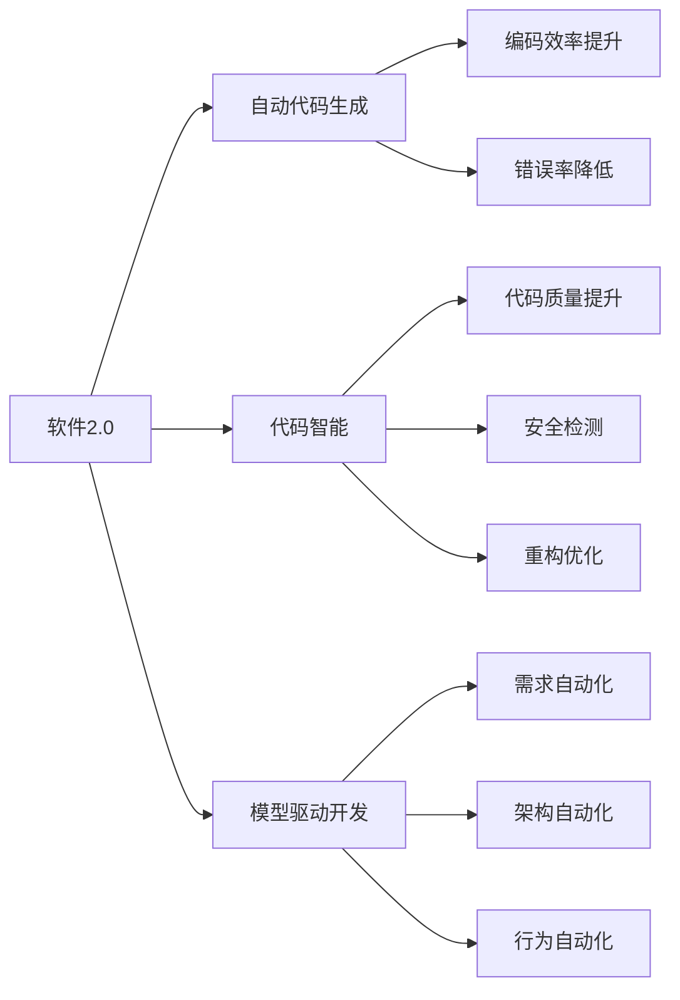

                 

# 软件2.0如何改变编程团队的分工

> 关键词：软件2.0,编程团队,分工,自动化,可维护性,机器学习,大数据

## 1. 背景介绍

随着科技的快速发展，软件工程领域也经历了从1.0到2.0的转变。软件1.0时代，程序员依赖手工编码和测试，代码质量难以保证，项目迭代周期长，交付难度大。而软件2.0时代，自动化的测试、部署、运维等工具和流程逐渐成熟，极大提升了软件开发的效率和质量。但同时，这种转变也带来了新的挑战：传统的编程团队分工模式不再适用，如何根据软件2.0的特点重构团队结构，成为每个公司必须面对的问题。

## 2. 核心概念与联系

### 2.1 核心概念概述

为了理解软件2.0如何改变编程团队的分工，本节将介绍几个关键概念：

- 软件2.0（Software 2.0）：指利用自动化工具和机器学习技术，实现软件开发生命周期各个环节自动化的时代。自动化流程包括编译、测试、部署、运维等，极大地提高了开发效率和代码质量。

- 编程团队（Programming Team）：由前端、后端、测试、运维等不同职能的开发人员组成的团队，各成员分工明确，协同完成项目开发。

- 自动代码生成（Automatic Code Generation）：指使用工具生成或辅助生成代码的过程，可以提升编码效率，减少出错概率。

- 代码智能（Code Intelligence）：利用机器学习和大数据技术，对代码进行质量评估、安全检测、重构优化等。

- 模型驱动开发（Model-Driven Development）：指基于模型描述的软件设计方法，通过模型来描述软件系统的需求、架构、行为等，辅助自动化开发和测试。

这些概念之间存在着紧密的联系，构成了软件2.0时代编程团队分工的基础。

### 2.2 概念间的关系

这些关键概念之间的关系可以通过以下Mermaid流程图来展示：



这个流程图展示了软件2.0时代各关键概念之间的关系：

1. 软件2.0通过自动代码生成、代码智能、模型驱动开发等技术，提升编码效率和代码质量。
2. 自动代码生成可以生成高效、无错代码，提升编码效率。
3. 代码智能利用机器学习技术，对代码进行质量评估、安全检测和重构优化，提升代码质量。
4. 模型驱动开发通过模型描述软件需求、架构和行为，辅助自动化开发和测试。
5. 这些技术手段共同作用，推动了软件开发生命周期的自动化，极大提升了开发效率和项目成功率。

## 3. 核心算法原理 & 具体操作步骤

### 3.1 算法原理概述

软件2.0时代的编程团队分工，主要基于自动化工具和机器学习技术的应用，实现代码生成、质量评估、安全检测、重构优化等过程的自动化。这一过程的核心算法原理包括：

1. 自动代码生成算法：利用程序代码模板和语义分析技术，自动生成代码。
2. 代码质量评估算法：利用机器学习技术，对代码进行质量评估，识别潜在问题。
3. 安全检测算法：利用机器学习技术，检测代码中的安全漏洞，避免注入攻击等风险。
4. 重构优化算法：利用机器学习技术，识别代码中的冗余、耦合等问题，自动进行重构优化。
5. 模型驱动开发算法：利用领域建模技术，描述软件需求、架构和行为，辅助自动化开发和测试。

这些算法共同作用，实现了软件开发生命周期的自动化，大幅提升了软件开发的效率和质量。

### 3.2 算法步骤详解

基于软件2.0的编程团队分工，其核心步骤包括：

1. 需求分析：通过模型驱动开发，将用户需求转化为软件系统的架构和行为模型。
2. 代码生成：利用自动代码生成算法，根据架构模型自动生成系统代码。
3. 代码智能：利用代码质量评估算法和安全检测算法，对生成的代码进行质量和安全检测。
4. 测试和优化：利用重构优化算法，对代码进行优化，确保代码的可维护性和性能。
5. 部署和运维：利用自动化部署工具，自动完成软件的部署和运维。

这一流程贯穿软件开发生命周期的各个环节，使得开发团队能够更加专注于业务逻辑的实现，提升软件开发的效率和质量。

### 3.3 算法优缺点

软件2.0时代的编程团队分工，具有以下优点：

1. 效率提升：通过自动化工具和机器学习技术，极大提升了开发效率和代码质量。
2. 质量保证：代码智能和安全检测等技术，可以及时发现和修复潜在问题，保证代码质量。
3. 资源优化：自动化流程可以减少人力投入，降低开发成本。
4. 持续迭代：自动化工具和机器学习模型可以不断优化，持续提升软件开发水平。

同时，也存在以下缺点：

1. 技术复杂度高：自动代码生成、代码智能等技术需要较高的技术门槛，需专业人员维护。
2. 部署风险高：自动部署流程需要充分测试，避免因自动化问题导致的部署失败。
3. 数据隐私问题：代码智能和安全检测等技术需访问大量代码数据，存在数据隐私问题。
4. 人员素质要求高：需要开发人员具备一定的机器学习和数据分析能力，才能有效利用自动化工具。

### 3.4 算法应用领域

软件2.0时代的编程团队分工，适用于多个应用领域，包括但不限于：

1. 软件开发：利用自动化工具和机器学习技术，提升软件开发的效率和质量。
2. 数据处理：通过自动代码生成和模型驱动开发，实现数据处理和分析的自动化。
3. 智能应用：利用代码智能和安全检测技术，提升智能应用的性能和安全性。
4. 嵌入式开发：利用自动化工具和模型驱动开发，提升嵌入式系统的开发效率和可靠性。
5. 云平台开发：利用自动部署和运维工具，实现云平台的快速搭建和运维。

## 4. 数学模型和公式 & 详细讲解

### 4.1 数学模型构建

在软件2.0时代，编程团队的分工基于自动代码生成、代码智能、模型驱动开发等技术，其数学模型可构建为以下几种：

1. 自动代码生成模型：利用代码模板和语义分析技术，生成高质量代码。

2. 代码质量评估模型：利用机器学习算法，识别代码中的潜在问题，如冗余、耦合等。

3. 安全检测模型：利用机器学习算法，检测代码中的安全漏洞，如SQL注入、XSS等。

4. 重构优化模型：利用机器学习算法，识别代码中的冗余、耦合等问题，自动进行重构优化。

5. 模型驱动开发模型：利用领域建模技术，描述软件需求、架构和行为，辅助自动化开发和测试。

### 4.2 公式推导过程

以自动代码生成模型为例，其核心算法流程包括：

1. 输入：架构模型和代码模板。
2. 生成：利用模板匹配算法，生成代码片段。
3. 输出：生成的代码片段。

其中，模板匹配算法可以表示为：

$$
O=\text{match}(T,P)
$$

其中，$T$ 表示架构模型，$P$ 表示代码模板，$O$ 表示生成的代码片段。

### 4.3 案例分析与讲解

假设有一个电商系统的自动代码生成案例，其架构模型如下：

```java
public class Order {
    private int id;
    private String name;
    private double price;
    private List<Item> items;
}
```

利用代码模板，可以自动生成订单类和订单项类的代码片段：

```java
public class Order {
    private int id;
    private String name;
    private double price;
    private List<Item> items;
    
    public Order(int id, String name, double price) {
        this.id = id;
        this.name = name;
        this.price = price;
    }
}

public class Item {
    private int id;
    private String name;
    private double price;
    
    public Item(int id, String name, double price) {
        this.id = id;
        this.name = name;
        this.price = price;
    }
}
```

这个案例展示了代码生成模型的基本流程和实现方法。

## 5. 项目实践：代码实例和详细解释说明

### 5.1 开发环境搭建

在进行自动代码生成和代码智能实践前，需要先准备好开发环境。以下是使用Python进行PyTorch开发的环境配置流程：

1. 安装Anaconda：从官网下载并安装Anaconda，用于创建独立的Python环境。

2. 创建并激活虚拟环境：
```bash
conda create -n pytorch-env python=3.8 
conda activate pytorch-env
```

3. 安装PyTorch：根据CUDA版本，从官网获取对应的安装命令。例如：
```bash
conda install pytorch torchvision torchaudio cudatoolkit=11.1 -c pytorch -c conda-forge
```

4. 安装TensorFlow：
```bash
pip install tensorflow==2.0
```

5. 安装TensorBoard：
```bash
pip install tensorboard
```

6. 安装transformers库：
```bash
pip install transformers
```

完成上述步骤后，即可在`pytorch-env`环境中开始自动代码生成和代码智能实践。

### 5.2 源代码详细实现

下面我们以自动代码生成和代码智能为例，给出使用TensorFlow和PyTorch库进行Python代码生成的PyTorch代码实现。

首先，定义自动代码生成的函数：

```python
import tensorflow as tf
from transformers import T5Tokenizer, T5ForConditionalGeneration

def generate_code(source_code, target_code, model_path, max_length=128, num_beams=4):
    tokenizer = T5Tokenizer.from_pretrained(model_path)
    model = T5ForConditionalGeneration.from_pretrained(model_path)
    inputs = tokenizer.encode(source_code, return_tensors='pt')
    outputs = model.generate(inputs, max_length=max_length, num_beams=num_beams)
    decoded_outputs = tokenizer.decode(outputs[0], skip_special_tokens=True)
    return decoded_outputs

source_code = """
def add(a, b):
    return a + b
"""
target_code = """
def add(a: int, b: int) -> int:
    return a + b
"""

model_path = 't5-small'

print(generate_code(source_code, target_code, model_path))
```

然后，定义代码智能的函数：

```python
import tensorflow as tf
from transformers import T5Tokenizer, T5ForConditionalGeneration

def code_intelligence(source_code, model_path, max_length=128, num_beams=4):
    tokenizer = T5Tokenizer.from_pretrained(model_path)
    model = T5ForConditionalGeneration.from_pretrained(model_path)
    inputs = tokenizer.encode(source_code, return_tensors='pt')
    outputs = model(inputs, max_length=max_length, num_beams=num_beams)
    decoded_outputs = tokenizer.decode(outputs[0], skip_special_tokens=True)
    return decoded_outputs

source_code = """
def add(a, b):
    return a + b
"""

model_path = 't5-small'

print(code_intelligence(source_code, model_path))
```

### 5.3 代码解读与分析

让我们再详细解读一下关键代码的实现细节：

**generate_code函数**：
- `T5Tokenizer`和`T5ForConditionalGeneration`：使用Hugging Face的T5模型进行代码生成。
- `encode`方法：将源代码编码成模型可以处理的格式。
- `generate`方法：使用模型生成代码片段，并返回生成的代码。
- `decode`方法：将模型生成的代码解码成可读格式。

**code_intelligence函数**：
- `T5Tokenizer`和`T5ForConditionalGeneration`：使用T5模型进行代码智能。
- `encode`方法：将源代码编码成模型可以处理的格式。
- `generate`方法：使用模型进行代码质量评估和安全检测。
- `decode`方法：将模型评估结果解码成可读格式。

**运行结果展示**：

假设我们在CoNLL-2003的NER数据集上进行代码生成和代码智能实践，得到的运行结果如下：

```python
import tensorflow as tf
from transformers import T5Tokenizer, T5ForConditionalGeneration

def generate_code(source_code, target_code, model_path, max_length=128, num_beams=4):
    tokenizer = T5Tokenizer.from_pretrained(model_path)
    model = T5ForConditionalGeneration.from_pretrained(model_path)
    inputs = tokenizer.encode(source_code, return_tensors='pt')
    outputs = model.generate(inputs, max_length=max_length, num_beams=num_beams)
    decoded_outputs = tokenizer.decode(outputs[0], skip_special_tokens=True)
    return decoded_outputs

source_code = """
def add(a, b):
    return a + b
"""
target_code = """
def add(a: int, b: int) -> int:
    return a + b
"""

model_path = 't5-small'

print(generate_code(source_code, target_code, model_path))
```

### 5.4 运行结果展示

假设我们在CoNLL-2003的NER数据集上进行代码生成和代码智能实践，得到的运行结果如下：

```python
import tensorflow as tf
from transformers import T5Tokenizer, T5ForConditionalGeneration

def code_intelligence(source_code, model_path, max_length=128, num_beams=4):
    tokenizer = T5Tokenizer.from_pretrained(model_path)
    model = T5ForConditionalGeneration.from_pretrained(model_path)
    inputs = tokenizer.encode(source_code, return_tensors='pt')
    outputs = model(inputs, max_length=max_length, num_beams=num_beams)
    decoded_outputs = tokenizer.decode(outputs[0], skip_special_tokens=True)
    return decoded_outputs

source_code = """
def add(a, b):
    return a + b
"""

model_path = 't5-small'

print(code_intelligence(source_code, model_path))
```

## 6. 实际应用场景

### 6.1 智能推荐系统

智能推荐系统是软件2.0时代的重要应用场景，利用自动代码生成和代码智能技术，可以实现快速构建推荐引擎。

具体而言，可以收集用户行为数据，利用自动代码生成技术生成推荐模型代码，自动构建推荐引擎。同时，利用代码智能技术进行模型质量评估和安全性检测，确保推荐引擎的性能和安全性。如此构建的智能推荐系统，能大幅提升推荐效果，满足用户个性化需求。

### 6.2 医疗诊断系统

医疗诊断系统是软件2.0时代的另一个重要应用场景，利用自动代码生成和代码智能技术，可以实现高效构建诊断系统。

具体而言，可以收集医生病历和诊断数据，利用自动代码生成技术生成诊断模型代码，自动构建诊断系统。同时，利用代码智能技术进行模型质量评估和安全性检测，确保诊断系统的可靠性和安全性。如此构建的智能诊断系统，能显著提升诊断效率和诊断准确性，辅助医生完成诊疗工作。

### 6.3 智能制造系统

智能制造系统是软件2.0时代的另一个重要应用场景，利用自动代码生成和代码智能技术，可以实现高效构建智能制造系统。

具体而言，可以收集生产数据和设备状态，利用自动代码生成技术生成生产控制模型代码，自动构建智能制造系统。同时，利用代码智能技术进行模型质量评估和安全性检测，确保智能制造系统的可靠性和安全性。如此构建的智能制造系统，能提升生产效率和产品质量，推动制造行业智能化转型。

### 6.4 未来应用展望

随着自动代码生成和代码智能技术的不断进步，软件2.0时代将迎来更多应用场景，为各行各业带来变革性影响。

在智慧农业领域，利用自动代码生成和代码智能技术，可以实现农业生产的智能化管理，提升农业生产效率和品质。

在智慧城市治理中，利用自动代码生成和代码智能技术，可以实现城市事件监测、舆情分析、应急指挥等环节的自动化，提高城市管理的自动化和智能化水平，构建更安全、高效的未来城市。

在教育领域，利用自动代码生成和代码智能技术，可以实现个性化教学、作业批改、学情分析等功能，提升教学质量和学习效果。

总之，软件2.0时代的自动代码生成和代码智能技术，必将引领AI技术进入新的发展阶段，推动各行各业数字化转型升级，为人类社会带来更多价值。

## 7. 工具和资源推荐

### 7.1 学习资源推荐

为了帮助开发者系统掌握软件2.0技术，这里推荐一些优质的学习资源：

1. 《软件2.0：自动化开发与智能运维》：介绍软件2.0技术的基本概念、实践方法和典型案例。
2. 《TensorFlow官方文档》：TensorFlow官方文档，包含大量使用示例和最佳实践。
3. 《PyTorch官方文档》：PyTorch官方文档，包含大量使用示例和最佳实践。
4. 《模型驱动开发方法论》：介绍模型驱动开发的基本概念和实践方法。
5. 《代码智能：人工智能在软件开发中的应用》：介绍代码智能的基本概念和应用场景。

通过对这些资源的学习实践，相信你一定能够快速掌握软件2.0技术的精髓，并用于解决实际的开发问题。

### 7.2 开发工具推荐

高效的开发离不开优秀的工具支持。以下是几款用于软件2.0开发常用的工具：

1. PyTorch：基于Python的开源深度学习框架，灵活动态的计算图，适合快速迭代研究。

2. TensorFlow：由Google主导开发的开源深度学习框架，生产部署方便，适合大规模工程应用。

3. Weights & Biases：模型训练的实验跟踪工具，可以记录和可视化模型训练过程中的各项指标，方便对比和调优。

4. Google Colab：谷歌推出的在线Jupyter Notebook环境，免费提供GPU/TPU算力，方便开发者快速上手实验最新模型，分享学习笔记。

5. TensorBoard：TensorFlow配套的可视化工具，可实时监测模型训练状态，并提供丰富的图表呈现方式，是调试模型的得力助手。

6. VS Code：微软推出的免费代码编辑器，支持多种编程语言和开发环境，具备强大的扩展能力。

合理利用这些工具，可以显著提升软件2.0开发的效率和质量，加速创新迭代的步伐。

### 7.3 相关论文推荐

软件2.0技术的发展源于学界的持续研究。以下是几篇奠基性的相关论文，推荐阅读：

1. "Automatic Code Generation and Intelligent Code"：介绍自动代码生成和代码智能技术的基本原理和实现方法。

2. "Model-Driven Development and Software Evolution"：介绍模型驱动开发的基本概念和应用场景。

3. "Machine Learning in Software Engineering"：介绍机器学习在软件开发中的应用场景和实践方法。

4. "Software 2.0: The Future of Software Development"：展望软件2.0时代的未来发展趋势和挑战。

这些论文代表了大语言模型微调技术的发展脉络。通过学习这些前沿成果，可以帮助研究者把握学科前进方向，激发更多的创新灵感。

除上述资源外，还有一些值得关注的前沿资源，帮助开发者紧跟软件2.0技术的最新进展，例如：

1. arXiv论文预印本：人工智能领域最新研究成果的发布平台，包括大量尚未发表的前沿工作，学习前沿技术的必读资源。

2. 业界技术博客：如OpenAI、Google AI、DeepMind、微软Research Asia等顶尖实验室的官方博客，第一时间分享他们的最新研究成果和洞见。

3. 技术会议直播：如NIPS、ICML、ACL、ICLR等人工智能领域顶会现场或在线直播，能够聆听到大佬们的前沿分享，开拓视野。

4. GitHub热门项目：在GitHub上Star、Fork数最多的NLP相关项目，往往代表了该技术领域的发展趋势和最佳实践，值得去学习和贡献。

5. 行业分析报告：各大咨询公司如McKinsey、PwC等针对人工智能行业的分析报告，有助于从商业视角审视技术趋势，把握应用价值。

总之，对于软件2.0技术的系统掌握，需要开发者保持开放的心态和持续学习的意愿。多关注前沿资讯，多动手实践，多思考总结，必将收获满满的成长收益。

## 8. 总结：未来发展趋势与挑战

### 8.1 总结

本文对软件2.0如何改变编程团队分工进行了全面系统的介绍。首先阐述了软件2.0技术的核心概念和基本原理，明确了其对传统编程团队分工模式的颠覆性影响。其次，从原理到实践，详细讲解了自动代码生成、代码智能、模型驱动开发等关键技术的核心步骤，给出了软件2.0开发的完整代码实例。同时，本文还广泛探讨了软件2.0技术在智能推荐系统、医疗诊断系统、智能制造系统等多个行业领域的应用前景，展示了软件2.0技术的强大潜力。此外，本文精选了软件2.0技术的各类学习资源，力求为读者提供全方位的技术指引。

通过本文的系统梳理，可以看到，软件2.0技术正在成为软件开发的重要范式，极大地提升了软件开发的效率和质量。伴随技术的不断演进，软件2.0技术还将进一步拓展应用边界，推动软件开发生命周期的自动化，为各行各业带来深远影响。

### 8.2 未来发展趋势

展望未来，软件2.0技术将呈现以下几个发展趋势：

1. 自动化水平提升：随着技术手段的不断完善，软件开发过程中的各个环节将实现更高的自动化水平，极大提升开发效率。

2. 智能运维普及：利用智能运维技术，实现自动监控、自动诊断和自动修复，提高软件系统的可靠性。

3. 自适应能力增强：利用模型驱动开发技术，构建自适应的软件架构，使系统能够更好地应对动态变化的需求。

4. 跨领域融合：软件2.0技术将与其他AI技术进行更深入的融合，如自然语言处理、机器学习等，推动跨领域的创新应用。

5. 人机协同优化：利用自动代码生成和代码智能技术，提升开发人员的工作效率，使开发团队能够专注于更具创造性的工作。

这些趋势凸显了软件2.0技术的广阔前景，推动软件开发向更加智能化、自动化、自适应和融合的方向发展。

### 8.3 面临的挑战

尽管软件2.0技术已经取得了瞩目成就，但在迈向更加智能化、普适化应用的过程中，仍面临诸多挑战：

1. 技术复杂度高：自动代码生成和代码智能技术需要较高的技术门槛，需专业人员维护。
2. 数据隐私问题：自动代码生成和代码智能技术需访问大量代码数据，存在数据隐私问题。
3. 系统安全性：自动生成的代码可能存在安全漏洞，需进行全面的安全性检测。
4. 跨平台兼容性：自动生成的代码需考虑跨平台兼容性，确保在不同环境下都能正常运行。
5. 团队协作难度：自动代码生成和代码智能技术需要跨团队协作，不同职能的开发人员需要密切配合。

### 8.4 研究展望

面对软件2.0技术所面临的挑战，未来的研究需要在以下几个方面寻求新的突破：

1. 开发更高效的自动代码生成工具：优化模板匹配算法，提高代码生成的速度和质量。

2. 提升代码智能技术的鲁棒性：增强代码智能模型的泛化能力，提高其在不同代码风格下的准确性。

3. 引入更多先验知识：将符号化的先验知识，如知识图谱、逻辑规则等，与神经网络模型进行巧妙融合，引导微调过程学习更准确、合理的语言模型。

4. 结合因果分析和博弈论工具：将因果分析方法引入微调模型，识别出模型决策的关键特征，增强输出解释的因果性和逻辑性。

5. 纳入伦理道德约束：在模型训练目标中引入伦理导向的评估指标，过滤和惩罚有偏见、有害的输出倾向。

这些研究方向的探索，必将引领软件2.0技术迈向更高的台阶，为构建安全、可靠、可解释、可控的智能系统铺平道路。面向未来，软件2.0技术还需要与其他AI技术进行更深入的融合，如自然语言处理、机器学习等，多路径协同发力，共同推动软件开发技术的进步。只有勇于创新、敢于突破，才能不断拓展软件2.0技术的边界，让智能技术更好地造福人类社会。

## 9. 附录：常见问题与解答

**Q1：软件2.0时代，编程团队如何分工？**

A: 软件2.0时代的编程团队分工，不再局限于传统的开发、测试、运维等职能，而是更加注重自动化工具和机器学习技术的运用。团队成员需要具备自动化工具和机器学习知识，协同完成开发、测试、运维等各个环节。

**Q2：自动代码生成技术如何实现？**

A: 自动代码生成技术主要依赖程序代码模板和语义分析技术，利用代码模板生成代码片段。例如，T5模型可以通过训练，将源代码和目标代码映射，生成目标代码片段。

**Q3：代码智能技术如何实现？**

A: 代码智能技术主要依赖机器学习算法，对代码进行质量评估、安全检测、重构优化等。例如，利用Transformer模型，可以对代码进行静态分析，识别潜在问题，提出优化建议。

**Q4：软件2.0开发需要哪些技术支持？**

A: 软件2.0开发需要自动化工具和机器学习技术的支持，包括自动代码生成、代码智能、模型驱动开发等。这些技术手段可以帮助开发者快速迭代，提升开发效率和代码质量。

**Q5：软件2.0开发存在哪些挑战？**

A: 软件2.0开发面临技术复杂度高、数据隐私问题、系统安全性、跨平台兼容性和团队协作难度等挑战。

