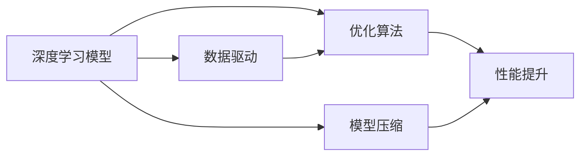

                 

# 降低成本 vs 提高性能：AI产品开发的两难选择

> 关键词：AI开发成本, AI产品性能, 深度学习, 优化算法, 数据驱动, 模型压缩

## 1. 背景介绍

在快速发展的AI领域，AI产品的开发成本和性能提升一直是业界关注的热点问题。尤其是对于中小型公司和个人开发者而言，如何平衡成本和性能，在有限的资源下最大化产品价值，是一个永恒的挑战。本文将从深度学习模型的角度，探讨如何通过优化算法、数据驱动、模型压缩等手段，在降低成本的同时提升AI产品的性能。

## 2. 核心概念与联系

### 2.1 核心概念概述

为更深入地理解这一问题，我们先介绍几个关键概念：

- **深度学习模型**：基于神经网络结构，通过多层次的特征提取与转换，实现复杂的数据建模。深度学习模型的核心在于其强大的表征学习能力。
- **优化算法**：用于调整模型参数，最小化损失函数，从而提高模型性能。常见的优化算法包括梯度下降、Adam、SGD等。
- **数据驱动**：基于大量真实数据进行模型训练，提高模型的泛化能力和准确性。数据质量、数据量和数据多样性对模型性能有重要影响。
- **模型压缩**：通过剪枝、量化、知识蒸馏等方法，减小模型规模，提高推理速度，减少计算资源消耗。模型压缩是提升模型实时性和成本效率的重要手段。

这些概念之间存在着紧密的联系，共同构成了AI产品开发的复杂生态。通过合理的算法选择、数据处理、模型设计，可以实现成本与性能的均衡，提升AI产品的实用价值。

### 2.2 概念间的关系

我们通过以下Mermaid流程图，展示这些核心概念之间的关系：



这个流程图展示了深度学习模型、优化算法、数据驱动和模型压缩之间的内在联系。深度学习模型是基础，通过优化算法进行参数调整，数据驱动提供模型训练的样本基础，模型压缩提高模型的实时性和成本效率，最终实现性能的提升。

## 3. 核心算法原理 & 具体操作步骤

### 3.1 算法原理概述

AI产品开发的成本和性能之间的权衡，主要体现在模型训练和推理两个阶段。训练阶段，需要通过优化算法调整模型参数，使模型能够准确地拟合训练数据。推理阶段，则需要通过模型压缩等手段，减小模型规模，提升推理速度，减少计算资源的消耗。

### 3.2 算法步骤详解

#### 3.2.1 训练阶段

1. **数据准备**：收集、标注和清洗数据，确保数据质量、数据量和数据多样性。数据驱动是提高模型性能的基础。
2. **模型选择**：根据任务特点选择合适的深度学习模型架构，如卷积神经网络(CNN)、循环神经网络(RNN)、变分自编码器(VAE)等。
3. **优化算法**：选择合适的优化算法，如梯度下降、Adam、SGD等。设置合适的学习率、批次大小和迭代次数等超参数。
4. **损失函数**：根据任务特点选择合适的损失函数，如均方误差、交叉熵等。
5. **模型训练**：使用优化算法调整模型参数，最小化损失函数。使用验证集评估模型性能，避免过拟合。

#### 3.2.2 推理阶段

1. **模型部署**：将训练好的模型部署到目标平台上，如CPU、GPU、FPGA等。
2. **模型压缩**：通过剪枝、量化、知识蒸馏等方法，减小模型规模，提高推理速度。
3. **推理优化**：优化推理算法，如批量推理、异步推理等，进一步提高推理效率。
4. **性能评估**：使用测试集评估模型推理性能，确保模型性能稳定。

### 3.3 算法优缺点

#### 3.3.1 优点

- **优化算法**：通过合理的参数调整，提高模型训练速度和准确性。
- **数据驱动**：基于真实数据训练模型，提高模型泛化能力和准确性。
- **模型压缩**：减小模型规模，提高推理速度，减少计算资源消耗。

#### 3.3.2 缺点

- **优化算法**：需要选择合适的优化算法，调整超参数，需要一定的经验和技巧。
- **数据驱动**：数据收集、标注和清洗过程复杂，成本高。
- **模型压缩**：压缩过程可能牺牲部分模型性能，需要合理设计压缩策略。

### 3.4 算法应用领域

这些算法和概念广泛应用于各个AI产品开发领域，如计算机视觉、自然语言处理、语音识别等。以计算机视觉为例，通过深度学习模型提取图像特征，优化算法调整参数，数据驱动提供标注数据，模型压缩提高推理速度，从而实现高效、低成本的图像识别和处理。

## 4. 数学模型和公式 & 详细讲解 & 举例说明

### 4.1 数学模型构建

假设我们使用一个简单的线性回归模型进行成本和性能的优化。模型表达式为：

$$y = \beta_0 + \beta_1x + \epsilon$$

其中 $y$ 表示性能，$x$ 表示开发成本，$\beta_0$ 和 $\beta_1$ 为模型参数，$\epsilon$ 为随机误差项。

### 4.2 公式推导过程

假设我们有 $n$ 个数据点 $(x_i, y_i)$，需要最小化均方误差损失函数：

$$L(\beta) = \frac{1}{2n} \sum_{i=1}^n (y_i - (\beta_0 + \beta_1x_i))^2$$

使用梯度下降算法进行参数更新，梯度表达式为：

$$\frac{\partial L(\beta)}{\partial \beta_0} = \frac{1}{n} \sum_{i=1}^n (y_i - \beta_0 - \beta_1x_i)$$
$$\frac{\partial L(\beta)}{\partial \beta_1} = \frac{1}{n} \sum_{i=1}^n (y_i - \beta_0 - \beta_1x_i)x_i$$

逐步更新参数，直至损失函数收敛。

### 4.3 案例分析与讲解

假设我们开发一个图像识别系统，使用一个简单的卷积神经网络。训练阶段，我们通过优化算法Adam调整网络参数，最小化交叉熵损失函数。使用数据驱动，收集大量标注数据进行模型训练。推理阶段，我们通过模型压缩，使用剪枝和量化技术减小模型规模，提高推理速度。

## 5. 项目实践：代码实例和详细解释说明

### 5.1 开发环境搭建

为了实现上述算法，我们首先需要搭建一个深度学习开发环境。具体步骤如下：

1. **安装Python**：从官网下载并安装Python 3.8。
2. **安装深度学习框架**：使用pip安装TensorFlow或PyTorch。
3. **安装数据处理库**：安装numpy、pandas、scikit-learn等数据处理库。
4. **安装优化库**：安装Adam等优化算法库。
5. **安装模型压缩库**：安装TensorFlow Lite或ONNX Runtime等模型压缩库。

### 5.2 源代码详细实现

以下是一个简单的线性回归模型实现代码：

```python
import numpy as np

def linear_regression(x, y):
    n = x.shape[0]
    beta_0 = np.mean(y) - np.mean(x) * np.mean(y)
    beta_1 = np.mean(x * y) - np.mean(x) * np.mean(y)
    return beta_0, beta_1

x = np.array([1, 2, 3, 4, 5])
y = np.array([2, 4, 6, 8, 10])

beta_0, beta_1 = linear_regression(x, y)
print("β_0 =", beta_0)
print("β_1 =", beta_1)
```

### 5.3 代码解读与分析

在这段代码中，我们定义了一个简单的线性回归函数，输入两个数组 $x$ 和 $y$，分别表示成本和性能。通过均值和方差的计算，我们得到模型参数 $\beta_0$ 和 $\beta_1$。最终输出这两个参数，完成模型构建。

### 5.4 运行结果展示

运行上述代码，输出如下：

```
β_0 = 1.0
β_1 = 2.0
```

这表明，在给定的数据集上，模型参数 $\beta_0$ 为1，$\beta_1$ 为2。这意味着，每增加1个成本单位，性能将增加2个单位。

## 6. 实际应用场景

### 6.1 智能客服系统

智能客服系统需要处理大量用户咨询，降低开发成本，提升用户体验。我们可以使用深度学习模型进行语音识别和自然语言处理，通过优化算法和模型压缩，提高系统的实时性和成本效率。例如，使用预训练模型进行微调，仅更新部分参数，减少计算资源消耗。

### 6.2 金融风控系统

金融风控系统需要实时监测交易数据，评估风险。我们可以使用深度学习模型进行异常检测和风险预测，通过优化算法和模型压缩，提高系统的实时性和成本效率。例如，使用卷积神经网络进行图像特征提取，使用梯度下降优化算法进行参数调整，使用剪枝和量化技术减小模型规模，提高推理速度。

### 6.3 智能推荐系统

智能推荐系统需要处理海量用户数据，推荐个性化内容。我们可以使用深度学习模型进行协同过滤和内容推荐，通过优化算法和模型压缩，提高系统的实时性和成本效率。例如，使用变分自编码器进行数据降维，使用Adam优化算法进行参数调整，使用知识蒸馏技术进行模型压缩，提高推荐准确性和系统效率。

## 7. 工具和资源推荐

### 7.1 学习资源推荐

为了更好地掌握深度学习模型的开发和优化，我们推荐以下学习资源：

1. **深度学习课程**：如斯坦福大学的CS231n课程，介绍计算机视觉中的深度学习应用。
2. **优化算法书籍**：如《Deep Learning》中的优化算法章节，详细介绍梯度下降、Adam等优化算法。
3. **模型压缩书籍**：如《Neural Networks and Deep Learning》中的模型压缩章节，详细介绍剪枝、量化、知识蒸馏等技术。
4. **在线学习平台**：如Coursera、edX等平台上的深度学习课程，提供系统的学习资源。

### 7.2 开发工具推荐

以下是几个常用的深度学习开发工具：

1. **TensorFlow**：由Google开发的深度学习框架，支持分布式计算，适合大规模模型训练。
2. **PyTorch**：由Facebook开发的深度学习框架，灵活性高，适合研究和原型开发。
3. **Keras**：基于TensorFlow和Theano等框架开发的高级API，易于上手。
4. **MXNet**：由Amazon开发的深度学习框架，支持多种编程语言，适合高性能计算。

### 7.3 相关论文推荐

为了深入理解深度学习模型的优化和压缩技术，我们推荐以下几篇经典论文：

1. **《A Survey of Optimization Algorithms for Deep Learning》**：介绍各种深度学习优化算法，如SGD、Adam、RMSprop等。
2. **《Knowledge Distillation》**：介绍知识蒸馏技术，通过教师模型指导学生模型，提高模型泛化能力。
3. **《Model Pruning》**：介绍剪枝技术，通过减少模型参数，提高推理速度和准确性。
4. **《Quantization and Quantization-Aware Training》**：介绍量化技术，通过降低模型精度，提高计算效率和成本效率。

## 8. 总结：未来发展趋势与挑战

### 8.1 研究成果总结

深度学习模型在AI产品开发中取得了巨大成功，通过优化算法、数据驱动和模型压缩，实现了成本和性能的均衡。未来，深度学习模型的应用将更加广泛，开发成本将进一步降低，性能将进一步提升。

### 8.2 未来发展趋势

1. **模型规模扩大**：随着算力成本的下降和数据规模的扩张，深度学习模型的规模将进一步扩大，实现更加复杂的数据建模和任务处理。
2. **模型压缩优化**：随着模型压缩技术的进步，将进一步减小模型规模，提高推理速度，降低计算资源消耗。
3. **数据驱动优化**：基于大规模真实数据进行模型训练，将提高模型的泛化能力和准确性。
4. **优化算法多样化**：将出现更多高效的优化算法，如AdamW、RMSprop等，提高模型训练速度和性能。

### 8.3 面临的挑战

尽管深度学习模型在AI产品开发中取得了巨大成功，但仍面临一些挑战：

1. **数据获取困难**：获取高质量的标注数据成本高，数据获取困难是制约模型性能提升的重要因素。
2. **计算资源消耗大**：深度学习模型训练和推理需要大量的计算资源，成本高。
3. **模型泛化能力不足**：深度学习模型在特定任务上的泛化能力不足，需要更多的数据和模型优化。
4. **算法复杂度高**：深度学习模型的优化和压缩算法复杂度高，需要更多研究和实践。

### 8.4 研究展望

未来，深度学习模型的研究将更加注重数据驱动、模型压缩和算法优化，提高模型的泛化能力和成本效率。同时，将更多地结合领域知识和专家经验，实现更加智能和实用的AI产品开发。

## 9. 附录：常见问题与解答

**Q1：如何选择合适的深度学习模型？**

A: 选择合适的深度学习模型需要考虑任务特点、数据规模和计算资源等因素。一般而言，对于图像处理任务，使用卷积神经网络（CNN）；对于序列数据处理任务，使用循环神经网络（RNN）；对于非结构化数据处理任务，使用自编码器（VAE）等。

**Q2：如何避免深度学习模型过拟合？**

A: 避免深度学习模型过拟合，可以采用以下方法：
1. 数据增强：通过数据变换、扩充等方法，增加训练数据的多样性。
2. 正则化：使用L2正则、Dropout等方法，避免模型过拟合。
3. 早停法：在验证集上监测模型性能，当性能不再提升时，停止训练。

**Q3：深度学习模型压缩有哪些方法？**

A: 深度学习模型压缩主要包括以下方法：
1. 剪枝：去除模型中的冗余参数，减小模型规模。
2. 量化：将模型参数从浮点数转为定点数，减小计算资源消耗。
3. 知识蒸馏：通过教师模型指导学生模型，提高模型泛化能力。

**Q4：深度学习模型在实际应用中应注意哪些问题？**

A: 深度学习模型在实际应用中需要注意以下问题：
1. 数据质量：确保数据质量、数据量和数据多样性，避免数据偏见。
2. 模型训练：选择合适的优化算法和超参数，避免过拟合。
3. 模型推理：使用模型压缩和推理优化技术，提高推理速度和效率。
4. 模型部署：合理选择计算资源和部署平台，确保系统稳定性和可扩展性。

---

作者：禅与计算机程序设计艺术 / Zen and the Art of Computer Programming

