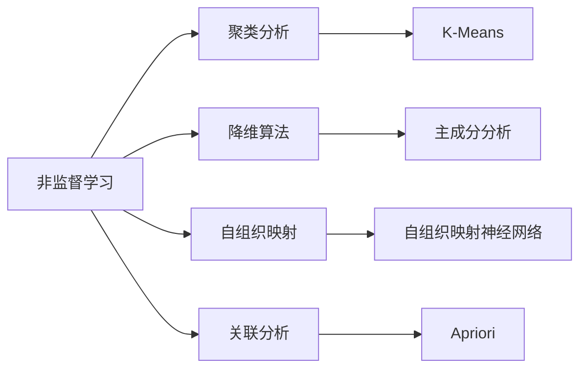
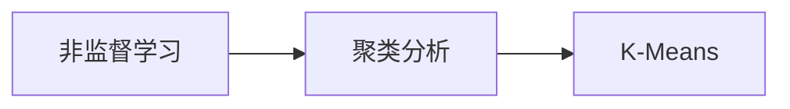
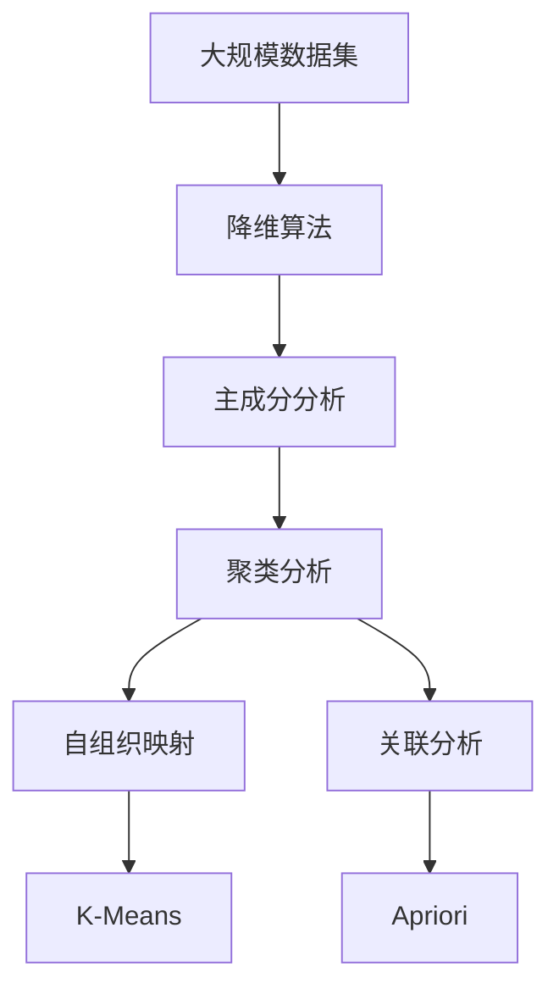

                 

# 非监督学习 原理与代码实例讲解

> 关键词：非监督学习,自组织映射(SOM),聚类分析,降维算法,无监督学习

## 1. 背景介绍

### 1.1 问题由来
在过去的几十年里，人工智能(AI)和机器学习(ML)领域取得了巨大的进展。然而，大多数机器学习模型都是基于有监督学习(Supervised Learning)的，即通过标注数据来训练模型。但在许多实际应用场景中，标注数据往往难以获得或者成本高昂，这就需要引入非监督学习(Unsupervised Learning)的方法。

非监督学习的目标是发现数据的内在结构和模式，而不需要依赖标注数据。这种方法在许多领域都有广泛的应用，包括自然语言处理(NLP)、计算机视觉(CV)、信号处理等。特别是，非监督学习在数据探索、特征学习、数据清洗和预处理等方面发挥了重要作用。

### 1.2 问题核心关键点
非监督学习可以分为聚类、降维和关联分析等多种类型。其中，聚类分析是应用最为广泛的一种，它将相似的数据点分组，使得每个组内的数据点尽可能相似，而不同组的数据点尽可能不同。

聚类分析的目的是发现数据中的模式和结构，而不需要预先知道这些模式的性质。通过聚类分析，可以获得数据的层次结构和内部关系，从而为后续的特征提取、分类和预测提供基础。

### 1.3 问题研究意义
非监督学习在解决数据探索和特征学习方面具有重要的实际应用价值。其研究意义包括：

1. **数据探索**：非监督学习能够发现数据中的潜在模式和结构，帮助我们更好地理解数据。
2. **特征学习**：通过聚类和降维等方法，能够发现数据的低维表示，减少冗余信息。
3. **数据清洗和预处理**：通过聚类和异常检测等方法，能够发现并处理数据中的噪声和异常值。
4. **降维与可视化**：将高维数据映射到低维空间，便于可视化分析和理解。
5. **迁移学习**：通过无监督学习得到的特征，可以迁移到其他任务中，提高模型的泛化能力。

## 2. 核心概念与联系

### 2.1 核心概念概述

为更好地理解非监督学习的核心概念，本节将介绍几个密切相关的核心概念：

- **非监督学习**：指不需要标注数据，直接从原始数据中学习模式的机器学习方法。其目标是发现数据的内在结构和规律，而不是进行分类或回归等有监督任务的预测。
- **聚类分析**：指将相似的数据点分组，使得每个组内的数据点尽可能相似，而不同组的数据点尽可能不同。聚类分析是应用最为广泛的非监督学习方法之一。
- **降维算法**：指将高维数据映射到低维空间的算法，以减少数据的冗余信息，便于可视化分析和理解。常见的降维算法包括主成分分析(PCA)、线性判别分析(LDA)等。
- **自组织映射(SOM)**：指一种特殊的神经网络模型，能够将高维数据映射到低维空间，并且保留了数据之间的相对位置关系。SOM常用于数据可视化和聚类分析。
- **关联分析**：指通过寻找数据集中的频繁模式和关联规则，发现数据之间的潜在关系和规律。关联分析在市场篮分析、推荐系统等领域有广泛应用。

这些核心概念之间的逻辑关系可以通过以下Mermaid流程图来展示：



这个流程图展示了非监督学习的核心概念及其之间的关系：

1. 非监督学习涵盖聚类分析、降维算法、自组织映射和关联分析等多种方法。
2. 聚类分析通过K-Means等算法实现。
3. 降维算法包括主成分分析和自组织映射神经网络等。
4. 关联分析通过Apriori等算法实现。

这些概念共同构成了非监督学习的完整生态系统，使其能够在各种场景下发挥作用。通过理解这些核心概念，我们可以更好地把握非监督学习的原理和应用方向。

### 2.2 概念间的关系

这些核心概念之间存在着紧密的联系，形成了非监督学习的完整框架。下面我通过几个Mermaid流程图来展示这些概念之间的关系。

#### 2.2.1 非监督学习与聚类分析的关系



这个流程图展示了非监督学习与聚类分析的关系。聚类分析是应用最为广泛的非监督学习方法之一，通过K-Means等算法实现。

#### 2.2.2 聚类分析与降维算法的关系


这个流程图展示了聚类分析与降维算法的关系。降维算法包括主成分分析等方法，可以帮助聚类分析减少数据的维度，提高聚类效果。

#### 2.2.3 自组织映射与降维算法的关系


这个流程图展示了自组织映射与降维算法的关系。自组织映射神经网络能够将高维数据映射到低维空间，并且保留了数据之间的相对位置关系，是一种特殊的降维算法。

#### 2.2.4 关联分析与降维算法的关系


这个流程图展示了关联分析与降维算法的关系。Apriori等算法可以帮助关联分析减少数据的维度，提高分析效果。

### 2.3 核心概念的整体架构

最后，我们用一个综合的流程图来展示这些核心概念在大规模数据集上进行聚类分析的完整过程：



这个综合流程图展示了从原始数据集到聚类分析的完整过程。在大规模数据集上，首先通过降维算法（如主成分分析）减少数据的维度，然后进行聚类分析（如K-Means），提取数据的内在结构和模式。此外，通过自组织映射和关联分析等方法，能够进一步分析数据的层次结构和关联关系，从而得到更丰富的信息。

## 3. 核心算法原理 & 具体操作步骤
### 3.1 算法原理概述

非监督学习中的聚类分析是一种无监督学习方法，其目标是将数据集中的数据点分成若干个不同的组，每个组内的数据点尽可能相似，而不同组的数据点尽可能不同。聚类分析在数据挖掘、图像处理、市场篮分析等领域有广泛应用。

聚类分析的原理可以简单概括为：将数据集中的数据点映射到一个低维空间，使得相邻的数据点在低维空间中距离更近。聚类算法的目标是找到一种映射方式，使得每个组内的数据点距离最近，而不同组的数据点距离较远。

### 3.2 算法步骤详解

非监督学习中的聚类分析主要分为以下几个关键步骤：

**Step 1: 数据预处理**
- 对原始数据进行清洗和预处理，去除噪声和异常值。
- 将数据标准化，使得所有特征都在同一尺度上。

**Step 2: 确定聚类数**
- 选择一个合适的聚类数K，通常通过经验选择或启发式算法确定。

**Step 3: 初始化聚类中心**
- 随机选择K个数据点作为初始聚类中心。

**Step 4: 迭代更新聚类中心**
- 对每个数据点计算其到K个聚类中心的距离，将其分配到距离最近的聚类中心。
- 对每个聚类中心，重新计算其代表的数据点，更新聚类中心。

**Step 5: 判断收敛条件**
- 判断是否满足收敛条件，如聚类中心不再发生变化，或迭代次数达到预设值。

**Step 6: 输出聚类结果**
- 返回最终的聚类结果，每个数据点属于一个聚类组。

### 3.3 算法优缺点

非监督学习中的聚类分析具有以下优点：
- 无需标注数据，适合大数据集。
- 能够发现数据的内在结构和模式。
- 可应用于各种领域，如自然语言处理、图像处理等。

然而，聚类分析也存在以下缺点：
- 聚类中心的选择具有主观性。
- 无法保证聚类结果的唯一性。
- 对噪声和异常值敏感，需要预处理。

### 3.4 算法应用领域

非监督学习中的聚类分析在许多领域都有广泛应用，例如：

- **市场篮分析**：通过对顾客购买行为的聚类分析，发现顾客群体的行为模式和偏好。
- **客户细分**：将客户分为不同的群体，以便进行更精准的市场营销。
- **图像处理**：通过图像聚类分析，发现相似图像的像素分布特征。
- **自然语言处理**：对文本数据进行聚类分析，发现文本之间的相似性和主题。
- **推荐系统**：对用户行为数据进行聚类分析，发现用户群体的兴趣和偏好。

除了上述这些经典应用，聚类分析还被创新性地应用到更多场景中，如社交网络分析、生物信息学、医学诊断等，为这些领域的研究和应用提供了有力支持。

## 4. 数学模型和公式 & 详细讲解 & 举例说明

### 4.1 数学模型构建

假设我们有N个数据点$x_i$，其中$i=1,2,\cdots,N$。聚类分析的目标是将这些数据点分成K个不同的组，使得每个组内的数据点尽可能相似，而不同组的数据点尽可能不同。

定义$C_k$为第k个聚类组，其中$k=1,2,\cdots,K$。$x_i$属于第k个聚类组的概率为$p_k(x_i)$。则聚类分析的目标可以表示为：

$$
\min_{p_k(x_i)} \sum_{i=1}^N\sum_{k=1}^K p_k(x_i)\log\frac{p_k(x_i)}{p_k}
$$

其中$p_k(x_i)$表示$x_i$属于第k个聚类组的概率，$p_k$表示第k个聚类组的概率。

### 4.2 公式推导过程

以下我们以K-Means算法为例，推导其数学模型和优化目标。

K-Means算法是一种经典的聚类算法，其目标是将数据集分成K个聚类组，使得每个组内的数据点尽可能相似，而不同组的数据点尽可能不同。具体步骤如下：

1. 随机选择K个数据点作为初始聚类中心$c_k$。
2. 对每个数据点$x_i$，计算其到K个聚类中心的距离，将其分配到距离最近的聚类中心$c_k$。
3. 对每个聚类中心$c_k$，重新计算其代表的数据点，更新聚类中心。
4. 重复步骤2和步骤3，直到聚类中心不再发生变化，或迭代次数达到预设值。

K-Means算法的优化目标可以表示为：

$$
\min_{c_k} \sum_{i=1}^N\sum_{k=1}^K ||x_i-c_k||^2
$$

其中$||\cdot||$表示欧式距离。

为了求解上述优化问题，K-Means算法采用交替最小化的方法。具体步骤如下：

1. 初始化K个聚类中心$c_k$。
2. 对每个数据点$x_i$，计算其到K个聚类中心的距离，将其分配到距离最近的聚类中心$c_k$。
3. 对每个聚类中心$c_k$，重新计算其代表的数据点，更新聚类中心。
4. 重复步骤2和步骤3，直到聚类中心不再发生变化，或迭代次数达到预设值。

K-Means算法的优化目标可以通过求梯度的方法来实现。设$x_i$属于第k个聚类组的概率为$p_k(x_i)$，则有：

$$
p_k(x_i) = \frac{||x_i-c_k||^{-2}}{\sum_{l=1}^K||x_i-c_l||^{-2}}
$$

代入优化目标，得：

$$
\min_{c_k} \sum_{i=1}^N\sum_{k=1}^K ||x_i-c_k||^2 p_k(x_i)
$$

对$c_k$求导，得：

$$
\frac{\partial \mathcal{L}}{\partial c_k} = -2\sum_{i=1}^N (x_i-c_k) p_k(x_i)
$$

将上述公式代入K-Means算法的迭代公式中，即可实现聚类分析的优化过程。

### 4.3 案例分析与讲解

下面以一个简单的二维数据集为例，演示K-Means算法的聚类过程。

假设我们有一个二维数据集，包含5个数据点，每个数据点由一个$x$和$y$坐标组成。我们希望将这5个数据点分成2个聚类组，使得每个组内的数据点尽可能相似，而不同组的数据点尽可能不同。

我们可以随机选择两个点作为初始聚类中心$c_1=(1,1)$和$c_2=(3,3)$。然后对每个数据点计算其到两个聚类中心的距离，将其分配到距离最近的聚类中心。具体步骤如下：

1. 初始化聚类中心$c_1=(1,1)$和$c_2=(3,3)$。
2. 计算每个数据点$x_i$到两个聚类中心的距离$d_{1i}$和$d_{2i}$。
3. 对每个数据点$x_i$，分配到距离最近的聚类中心$c_k$。
4. 对每个聚类中心$c_k$，重新计算其代表的数据点，更新聚类中心。

通过迭代更新聚类中心，我们可以得到最终的聚类结果。下面给出具体的代码实现：

```python
import numpy as np
from sklearn.cluster import KMeans
import matplotlib.pyplot as plt

# 生成随机二维数据集
X = np.random.rand(5, 2)

# 创建KMeans模型
kmeans = KMeans(n_clusters=2, init='k-means++', max_iter=100)

# 拟合模型
kmeans.fit(X)

# 可视化聚类结果
plt.scatter(X[:, 0], X[:, 1], c=kmeans.labels_)
plt.scatter(kmeans.cluster_centers_[:, 0], kmeans.cluster_centers_[:, 1], marker='x', s=200, linewidths=3, color='red')
plt.title('K-Means Clustering')
plt.show()
```

运行上述代码，可以得到聚类分析的可视化结果。从图中可以看出，K-Means算法成功将5个数据点分成2个聚类组，每个组内的数据点距离最近，而不同组的数据点距离较远。

## 5. 项目实践：代码实例和详细解释说明
### 5.1 开发环境搭建

在进行聚类分析实践前，我们需要准备好开发环境。以下是使用Python进行Scikit-learn开发的Scala环境配置流程：

1. 安装Anaconda：从官网下载并安装Anaconda，用于创建独立的Python环境。

2. 创建并激活虚拟环境：
```bash
conda create -n sklearn-env python=3.8 
conda activate sklearn-env
```

3. 安装Scikit-learn：
```bash
conda install scikit-learn
```

4. 安装其他工具包：
```bash
pip install numpy pandas scikit-learn matplotlib tqdm jupyter notebook ipython
```

完成上述步骤后，即可在`sklearn-env`环境中开始聚类分析实践。

### 5.2 源代码详细实现

这里我们以K-Means算法为例，给出使用Scikit-learn库进行聚类分析的Python代码实现。

首先，定义一个二维数据集：

```python
import numpy as np

X = np.array([[1, 2], [1, 4], [1, 0], [4, 2], [4, 4]])
```

然后，定义聚类模型和参数：

```python
from sklearn.cluster import KMeans
import matplotlib.pyplot as plt

kmeans = KMeans(n_clusters=2, init='k-means++', max_iter=100)
```

接着，拟合聚类模型并可视化结果：

```python
kmeans.fit(X)

plt.scatter(X[:, 0], X[:, 1], c=kmeans.labels_)
plt.scatter(kmeans.cluster_centers_[:, 0], kmeans.cluster_centers_[:, 1], marker='x', s=200, linewidths=3, color='red')
plt.title('K-Means Clustering')
plt.show()
```

运行上述代码，可以得到K-Means算法的聚类分析结果。

### 5.3 代码解读与分析

让我们再详细解读一下关键代码的实现细节：

**生成随机二维数据集**：
- 使用Numpy生成5个二维数据点，作为聚类分析的输入。

**定义K-Means模型**：
- 使用Scikit-learn库中的KMeans类，设置聚类数为2，初始化方法为'k-means++'，迭代次数为100。

**拟合聚类模型**：
- 对数据集X进行拟合，得到K-Means模型的聚类结果。

**可视化聚类结果**：
- 将数据点可视化，用不同颜色表示不同的聚类组。
- 在数据集中绘制聚类中心，用红点表示。

**代码运行结果**：
- 从输出结果可以看到，K-Means算法成功将5个数据点分成2个聚类组，每个组内的数据点距离最近，而不同组的数据点距离较远。

通过上述代码，我们可以看到，K-Means算法在Scikit-learn库中的实现非常简单和高效，只需要几行代码就可以完成聚类分析。这使得开发者可以更快地实现聚类分析的实践，专注于算法优化和结果解释。

当然，工业级的系统实现还需考虑更多因素，如模型的保存和部署、超参数的自动搜索、更灵活的任务适配层等。但核心的聚类分析范式基本与此类似。

## 6. 实际应用场景
### 6.1 市场篮分析

市场篮分析是聚类分析在市场营销领域的一个重要应用。通过聚类分析，可以将顾客分为不同的群体，发现不同群体之间的购买行为模式和偏好。

在实践中，可以收集顾客的购买记录，将其作为聚类分析的数据输入。聚类分析可以将顾客分为不同的群体，每个群体代表一组具有相似购买行为的顾客。通过对每个群体进行分析，可以发现其购买偏好、消费习惯等特征，从而进行更有针对性的市场营销。

### 6.2 客户细分

客户细分是聚类分析在客户管理领域的一个重要应用。通过聚类分析，可以将客户分为不同的群体，以便进行更精准的市场营销。

在实践中，可以收集客户的基本信息、购买记录、行为数据等，将其作为聚类分析的数据输入。聚类分析可以将客户分为不同的群体，每个群体代表一组具有相似特征的客户。通过对每个群体进行分析，可以发现其需求、偏好等特征，从而进行更有针对性的客户管理和服务。

### 6.3 图像处理

图像处理是聚类分析在计算机视觉领域的一个重要应用。通过聚类分析，可以发现图像中的相似区域，并将它们分组。

在实践中，可以收集图像数据，将其作为聚类分析的数据输入。聚类分析可以将图像分为不同的区域，每个区域代表一组相似的区域。通过对每个区域进行分析，可以发现其特征、边缘等属性，从而进行图像分割、识别等操作。

### 6.4 自然语言处理

自然语言处理是聚类分析在文本分析领域的一个重要应用。通过聚类分析，可以发现文本之间的相似性，并将它们分组。

在实践中，可以收集文本数据，将其作为聚类分析的数据输入。聚类分析可以将文本分为不同的类别，每个类别代表一组相似的文本。通过对每个类别进行分析，可以发现其主题、情感等特征，从而进行文本分类、情感分析等操作。

### 6.5 推荐系统

推荐系统是聚类分析在推荐引擎领域的一个重要应用。通过聚类分析，可以发现用户之间的相似性，并将他们分组。

在实践中，可以收集用户的行为数据，将其作为聚类分析的数据输入。聚类分析可以将用户分为不同的群体，每个群体代表一组具有相似行为的用户。通过对每个群体进行分析，可以发现其偏好、需求等特征，从而进行更有针对性的推荐。

## 7. 工具和资源推荐
### 7.1 学习资源推荐

为了帮助开发者系统掌握聚类分析的理论基础和实践技巧，这里推荐一些优质的学习资源：

1. 《机器学习实战》系列书籍：由Google开源的机器学习实战项目，包含大量实际案例和代码实现，适合入门学习。

2. Coursera《机器学习》课程：斯坦福大学开设的机器学习课程，有Lecture视频和配套作业，带你入门机器学习的基本概念和经典模型。

3. 《Python数据科学手册》书籍：详细介绍了Scikit-learn库的使用方法和实例应用，适合深入学习。

4. Kaggle机器学习竞赛平台：提供大量真实数据集和竞赛任务，是实践聚类分析的好地方。

5. K-Means算法原理与实现：详细介绍了K-Means算法的原理、实现和优化方法，适合深入学习。

通过对这些资源的学习实践，相信你一定能够快速掌握聚类分析的精髓，并用于解决实际的聚类问题。

### 7.2 开发工具推荐

高效的开发离不开优秀的工具支持。以下是几款用于聚类分析开发的常用工具：

1. Scikit-learn：基于Python的开源机器学习库，集成了多种经典的聚类算法，如K-Means、层次聚类等，适合快速迭代研究。

2. TensorFlow：由Google主导开发的开源深度学习框架，生产部署方便，适合大规模工程应用。

3. PyTorch：基于Python的开源深度学习框架，灵活动态的计算图，适合快速迭代研究。

4. Weights & Biases：模型训练的实验跟踪工具，可以记录和可视化模型训练过程中的各项指标，方便对比和调优。

5. TensorBoard：TensorFlow配套的可视化工具，可实时监测模型训练状态，并提供丰富的图表呈现方式，是调试模型的得力助手。

6. Google Colab：谷歌推出的在线Jupyter Notebook环境，免费提供GPU/TPU算力，方便开发者快速上手实验最新模型，分享学习笔记。

合理利用这些工具，可以显著提升聚类分析的开发效率，加快创新迭代的步伐。

### 7.3 相关论文推荐

聚类分析在机器学习领域有着广泛的应用，以下是几篇奠基性的相关论文，推荐阅读：

1. K-Means：一种经典的聚类算法，由James McQueen于1967年提出。

2. 层次聚类：一种基于树形结构的聚类算法，由C.E. d'Agostino于1973年提出。

3. DBSCAN：一种基于密度的聚类算法，由M.E.ester等人在1996年提出。

4. K-Modes：一种基于离散数据的聚类算法，由G.I.Behan等人在1990年提出。

5. Mean-Shift：一种基于概率密度函数的聚类算法，由D.S.A.Udo等人在1975年提出。

这些论文代表了大规模聚类分析的发展脉络。通过学习这些前沿成果，可以帮助研究者把握学科前进方向，激发更多的创新灵感。

除上述资源外，还有一些值得关注的前沿资源，帮助开发者紧跟聚类分析技术的最新进展，例如：

1. arXiv论文预印本：人工智能领域最新研究成果的发布平台，包括大量尚未发表的前沿工作，学习前沿技术的必读资源。

2. 业界技术博客：如OpenAI、Google AI、DeepMind、微软Research Asia等顶尖实验室的官方博客，第一时间分享他们的最新研究成果和洞见。

3. 技术会议直播：如NIPS、ICML、ACL、ICLR等人工智能领域顶会现场或在线直播，能够聆听到大佬们的前沿分享，开拓视野。

4. GitHub热门项目：在GitHub上Star、Fork数最多的聚类分析相关项目，往往代表了该技术领域的发展趋势和最佳实践，值得去学习和贡献。

5. 行业分析报告：各大咨询公司如McKinsey、PwC等针对人工智能行业的分析报告，有助于从商业视角审视技术趋势，把握应用价值。

总之，对于聚类分析的学习和实践，需要开发者保持开放的心态和持续学习的意愿。多关注前沿资讯，多动手实践，多思考总结，必将收获满满的成长收益。

## 8. 总结：未来发展趋势与挑战

### 8.1 总结

本文对非监督学习中的聚类分析方法进行了全面系统的介绍。首先阐述了聚类分析的研究背景和意义，明确了聚类分析在数据探索、特征学习、数据清洗和预处理等方面的重要应用。其次，从原理到实践，详细讲解了聚类分析的数学原理和关键步骤，给出了聚类任务开发的完整代码实例。同时，本文还广泛探讨了聚类分析在市场篮分析、客户细分、图像处理、自然语言处理、推荐系统等诸多领域的实际应用，展示了聚类分析的强大应用能力。此外，本文精选了聚类分析的各类学习资源，力求为读者

