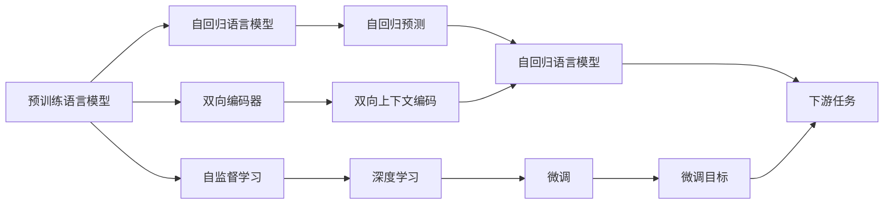

                 

# GPT 与 Bert 的选择

> 关键词：GPT, BERT, 预训练, 微调, 自然语言处理(NLP), 语言模型, 变换器(Transformer), 深度学习

## 1. 背景介绍

### 1.1 问题由来
在自然语言处理(Natural Language Processing, NLP)领域，大语言模型已经成为了一种强大的工具。预训练语言模型（Pre-trained Language Models, PLMs）通过在大规模无标签文本数据上进行预训练，学习到了丰富的语言知识和常识，并在下游任务上进行微调（Fine-tuning）以获得更好的性能。

其中，GPT（Generative Pre-trained Transformer）和BERT（Bidirectional Encoder Representations from Transformers）是目前最受欢迎的两个预训练语言模型。GPT是一种自回归语言模型，在文本生成任务上表现出色；而BERT是一种双向编码器，在语言理解任务上有着卓越的表现。

本文将对GPT和BERT进行比较，探讨它们在预训练和微调过程中的异同点，以及它们在实际应用中的优缺点，帮助开发者在选择预训练语言模型时做出明智决策。

### 1.2 问题核心关键点
- 预训练语言模型的基本原理和架构是什么？
- GPT和BERT的训练方式有何不同？
- 微调过程中如何选择合适的模型和超参数？
- 预训练语言模型在实际应用中如何评估和优化？
- 大语言模型在NLP任务中的优缺点？

## 2. 核心概念与联系

### 2.1 核心概念概述

为更好地理解GPT和BERT，本节将介绍几个密切相关的核心概念：

- 预训练语言模型(PLMs)：如GPT和BERT，通过在大规模无标签文本数据上进行自监督学习，学习通用语言表示。
- 自回归语言模型(Autoregressive Language Model)：如GPT，以自回归的方式进行预测。
- 双向编码器(Bidirectional Encoder)：如BERT，同时考虑上下文信息。
- 微调(Fine-tuning)：使用下游任务的少量标注数据，优化模型在特定任务上的性能。
- 深度学习(Deep Learning)：使用多层神经网络进行建模和学习。
- 变换器(Transformer)：GPT和BERT采用的核心架构。
- 自监督学习(Self-Supervised Learning)：在无标签数据上进行学习。
- 语言模型(Language Model)：评估单词序列的概率分布。

这些核心概念之间存在着紧密的联系，形成了预训练语言模型和微调任务的完整框架。

### 2.2 概念间的关系

这些核心概念之间的逻辑关系可以通过以下Mermaid流程图来展示：



这个流程图展示了预训练语言模型和微调过程的基本逻辑关系：

1. 预训练语言模型通过自监督学习，学习通用语言表示。
2. 自回归语言模型和双向编码器分别代表两种不同的预训练方式。
3. 微调是将预训练模型适配到下游任务的过程。
4. 深度学习是实现微调的基础技术。
5. 自回归预测和双向上下文编码是预训练模型的核心计算单元。
6. 微调目标和下游任务代表了不同的任务和应用场景。

## 3. 核心算法原理 & 具体操作步骤
### 3.1 算法原理概述

GPT和BERT的预训练和微调过程分别遵循不同的原理，但它们的最终目标都是为了在特定任务上提升模型的性能。

**GPT的预训练原理**：GPT是基于自回归的语言模型，它通过预测下一个单词的概率来优化模型。在预训练过程中，GPT学习到文本的上下文信息，并且能够预测文本的下一个单词。这种预测任务是通过掩码语言模型（Masked Language Modeling）和生成式语言模型（Next Sentence Prediction）实现的。

**BERT的预训练原理**：BERT使用双向编码器来学习文本的上下文信息。在预训练过程中，BERT从句子中随机选择一半的token进行掩码，然后让模型预测被掩码的token。这种掩码语言模型（Masked Language Modeling）可以帮助模型学习到单词的语境信息。此外，BERT还使用两个不同的预测任务，即下一条句子预测（Next Sentence Prediction）和预定义标签（Predefined Label），来优化模型。

在微调过程中，GPT和BERT的目标都是最小化模型在下游任务上的损失函数。微调过程包括以下步骤：

1. **准备数据集**：收集下游任务的标注数据集，并划分为训练集、验证集和测试集。
2. **添加任务适配层**：根据任务类型，在预训练模型顶层设计合适的输出层和损失函数。
3. **设置微调超参数**：选择合适的优化算法及其参数，如学习率、批大小、迭代轮数等。
4. **执行梯度训练**：将训练集数据分批次输入模型，前向传播计算损失函数。
5. **反向传播更新参数**：计算参数梯度，使用优化算法更新模型参数。
6. **评估和优化**：在验证集上评估模型性能，根据性能指标决定是否触发Early Stopping。
7. **测试和部署**：在测试集上评估微调后的模型，并在实际应用系统中进行部署。

### 3.2 算法步骤详解

以下将详细讲解GPT和BERT的预训练和微调步骤。

#### GPT的预训练步骤

1. **数据准备**：准备大规模无标签文本数据，通常是网页、书籍等。
2. **掩码预训练**：将文本中的单词随机掩盖一部分，让模型预测被掩码的单词。
3. **预测上下文**：给定一段文本，预测下一个单词，并让模型学习上下文信息。
4. **训练循环**：重复以上步骤，不断优化模型。

#### BERT的预训练步骤

1. **掩码预训练**：随机掩盖文本中的单词，让模型预测被掩码的单词。
2. **句子预测**：给定一对句子，预测它们是否连续，训练模型区分句子之间的关系。
3. **预定义标签**：给定一对句子，预测它们是否属于同一类别的预定义标签，如是否相似。
4. **训练循环**：重复以上步骤，不断优化模型。

#### GPT的微调步骤

1. **数据准备**：收集下游任务的标注数据集，并划分为训练集、验证集和测试集。
2. **添加任务适配层**：根据任务类型，在预训练模型顶层设计合适的输出层和损失函数。
3. **设置微调超参数**：选择合适的优化算法及其参数，如学习率、批大小、迭代轮数等。
4. **执行梯度训练**：将训练集数据分批次输入模型，前向传播计算损失函数。
5. **反向传播更新参数**：计算参数梯度，使用优化算法更新模型参数。
6. **评估和优化**：在验证集上评估模型性能，根据性能指标决定是否触发Early Stopping。
7. **测试和部署**：在测试集上评估微调后的模型，并在实际应用系统中进行部署。

#### BERT的微调步骤

1. **数据准备**：收集下游任务的标注数据集，并划分为训练集、验证集和测试集。
2. **添加任务适配层**：根据任务类型，在预训练模型顶层设计合适的输出层和损失函数。
3. **设置微调超参数**：选择合适的优化算法及其参数，如学习率、批大小、迭代轮数等。
4. **执行梯度训练**：将训练集数据分批次输入模型，前向传播计算损失函数。
5. **反向传播更新参数**：计算参数梯度，使用优化算法更新模型参数。
6. **评估和优化**：在验证集上评估模型性能，根据性能指标决定是否触发Early Stopping。
7. **测试和部署**：在测试集上评估微调后的模型，并在实际应用系统中进行部署。

### 3.3 算法优缺点

#### GPT的优缺点

**优点**：

1. **生成能力强**：GPT能够产生高质量的文本，如文本生成、对话生成等任务中表现出色。
2. **自回归机制**：GPT的自回归机制使其在生成上下文相关的文本时表现优秀。
3. **可解释性强**：GPT的生成过程是可解释的，开发者可以通过训练数据和模型参数来理解模型的生成过程。

**缺点**：

1. **训练成本高**：GPT的参数量巨大，训练成本高，且对硬件要求较高。
2. **泛化能力差**：GPT的泛化能力相对较弱，对输入数据的分布变化敏感。
3. **依赖于预训练数据**：GPT的效果高度依赖于预训练数据的质量和多样性。

#### BERT的优缺点

**优点**：

1. **双向上下文编码**：BERT的双向上下文编码使其在语言理解任务中表现出色，如命名实体识别、情感分析等。
2. **低训练成本**：BERT的参数量相对较小，训练成本较低，且对硬件要求不高。
3. **泛化能力强**：BERT的泛化能力强，对不同领域的任务适应性强。

**缺点**：

1. **生成能力弱**：BERT的生成能力相对较弱，不太适合文本生成等任务。
2. **可解释性差**：BERT的预测过程是黑盒模型，难以解释其内部的决策逻辑。
3. **依赖于预训练数据**：BERT的效果高度依赖于预训练数据的质量和多样性。

### 3.4 算法应用领域

GPT和BERT在NLP领域都有广泛的应用。

**GPT的应用领域**：

1. **文本生成**：如自动生成新闻、博客、小说等文本内容。
2. **对话系统**：如智能客服、虚拟助手等。
3. **机器翻译**：如将文本从一种语言翻译成另一种语言。
4. **摘要生成**：如自动生成文章摘要、新闻简报等。

**BERT的应用领域**：

1. **语言理解**：如命名实体识别、情感分析、问答系统等。
2. **文本分类**：如新闻分类、主题分类等。
3. **信息检索**：如文本匹配、信息检索等。
4. **信息抽取**：如关系抽取、事件抽取等。

## 4. 数学模型和公式 & 详细讲解 & 举例说明

### 4.1 数学模型构建

#### GPT的数学模型

GPT的预训练目标是通过掩码语言模型和生成式语言模型来优化模型参数。给定一段文本$x_1, x_2, \ldots, x_n$，GPT的目标是最大化以下对数似然：

$$
\log p(x_1, x_2, \ldots, x_n) = \log \prod_{i=1}^n p(x_i | x_1, x_2, \ldots, x_{i-1})
$$

其中$p(x_i | x_1, x_2, \ldots, x_{i-1})$表示给定前$i-1$个单词时，第$i$个单词的条件概率。

#### BERT的数学模型

BERT的预训练目标是通过掩码语言模型、句子预测和预定义标签任务来优化模型参数。给定一段文本$x_1, x_2, \ldots, x_n$，BERT的目标是最大化以下对数似然：

$$
\log p(x_1, x_2, \ldots, x_n) = \log \prod_{i=1}^n p(x_i | x_1, x_2, \ldots, x_{i-1}) + \log \prod_{i=1}^n p(y_i | x_1, x_2, \ldots, x_n)
$$

其中$y_i$是预定义的标签，可以是二元分类标签或多类分类标签。

### 4.2 公式推导过程

**GPT的预训练公式推导**

GPT的掩码语言模型公式如下：

$$
\log p(x_1, x_2, \ldots, x_n) = \sum_{i=1}^n \log p(x_i | x_1, x_2, \ldots, x_{i-1})
$$

其中$p(x_i | x_1, x_2, \ldots, x_{i-1})$表示给定前$i-1$个单词时，第$i$个单词的条件概率。

**BERT的预训练公式推导**

BERT的掩码语言模型公式如下：

$$
\log p(x_1, x_2, \ldots, x_n) = \sum_{i=1}^n \log p(x_i | x_1, x_2, \ldots, x_{i-1})
$$

其中$p(x_i | x_1, x_2, \ldots, x_{i-1})$表示给定前$i-1$个单词时，第$i$个单词的条件概率。

### 4.3 案例分析与讲解

**GPT的预训练案例**

假设我们使用GPT在大规模无标签文本数据上进行预训练。预训练过程包括两个步骤：掩码语言模型和生成式语言模型。首先，我们将文本中的单词随机掩盖一部分，然后让模型预测被掩码的单词。其次，我们让模型预测下一个单词，并让模型学习上下文信息。通过这两个步骤，GPT学习到了文本的上下文信息，并能够预测文本的下一个单词。

**BERT的预训练案例**

假设我们使用BERT在大规模无标签文本数据上进行预训练。预训练过程包括三个步骤：掩码语言模型、句子预测和预定义标签。首先，我们将文本中的单词随机掩盖一部分，然后让模型预测被掩码的单词。其次，我们给定一对句子，预测它们是否连续。最后，我们给定一对句子，预测它们是否属于同一类别的预定义标签。通过这三个步骤，BERT学习到了文本的上下文信息，并能够区分句子之间的关系。

## 5. 项目实践：代码实例和详细解释说明

### 5.1 开发环境搭建

在进行预训练和微调实践前，我们需要准备好开发环境。以下是使用Python进行PyTorch开发的环境配置流程：

1. 安装Anaconda：从官网下载并安装Anaconda，用于创建独立的Python环境。

2. 创建并激活虚拟环境：
```bash
conda create -n pytorch-env python=3.8 
conda activate pytorch-env
```

3. 安装PyTorch：根据CUDA版本，从官网获取对应的安装命令。例如：
```bash
conda install pytorch torchvision torchaudio cudatoolkit=11.1 -c pytorch -c conda-forge
```

4. 安装Transformers库：
```bash
pip install transformers
```

5. 安装各类工具包：
```bash
pip install numpy pandas scikit-learn matplotlib tqdm jupyter notebook ipython
```

完成上述步骤后，即可在`pytorch-env`环境中开始预训练和微调实践。

### 5.2 源代码详细实现

下面我们以BERT模型进行情感分析任务为例，给出使用Transformers库对BERT模型进行预训练和微调的PyTorch代码实现。

首先，定义情感分析任务的数据处理函数：

```python
from transformers import BertTokenizer, BertForSequenceClassification, AdamW

# 定义情感分类任务的数据集
class SentimentDataset(Dataset):
    def __init__(self, texts, labels):
        self.texts = texts
        self.labels = labels
        self.tokenizer = BertTokenizer.from_pretrained('bert-base-uncased')
    
    def __len__(self):
        return len(self.texts)
    
    def __getitem__(self, item):
        text = self.texts[item]
        label = self.labels[item]
        
        encoding = self.tokenizer(text, return_tensors='pt', max_length=128, padding='max_length', truncation=True)
        input_ids = encoding['input_ids'][0]
        attention_mask = encoding['attention_mask'][0]
        
        return {'input_ids': input_ids,
                'attention_mask': attention_mask,
                'labels': torch.tensor(label, dtype=torch.long)}
```

然后，定义预训练模型和优化器：

```python
# 定义BERT模型
model = BertForSequenceClassification.from_pretrained('bert-base-uncased', num_labels=2)

# 定义优化器
optimizer = AdamW(model.parameters(), lr=2e-5)
```

接着，定义训练和评估函数：

```python
from torch.utils.data import DataLoader
from tqdm import tqdm

# 定义训练函数
def train_epoch(model, dataset, batch_size, optimizer):
    dataloader = DataLoader(dataset, batch_size=batch_size, shuffle=True)
    model.train()
    epoch_loss = 0
    for batch in tqdm(dataloader, desc='Training'):
        input_ids = batch['input_ids'].to(device)
        attention_mask = batch['attention_mask'].to(device)
        labels = batch['labels'].to(device)
        model.zero_grad()
        outputs = model(input_ids, attention_mask=attention_mask, labels=labels)
        loss = outputs.loss
        epoch_loss += loss.item()
        loss.backward()
        optimizer.step()
    return epoch_loss / len(dataloader)

# 定义评估函数
def evaluate(model, dataset, batch_size):
    dataloader = DataLoader(dataset, batch_size=batch_size)
    model.eval()
    preds, labels = [], []
    with torch.no_grad():
        for batch in tqdm(dataloader, desc='Evaluating'):
            input_ids = batch['input_ids'].to(device)
            attention_mask = batch['attention_mask'].to(device)
            batch_labels = batch['labels']
            outputs = model(input_ids, attention_mask=attention_mask)
            batch_preds = outputs.logits.argmax(dim=2).to('cpu').tolist()
            batch_labels = batch_labels.to('cpu').tolist()
            for pred_tokens, label_tokens in zip(batch_preds, batch_labels):
                preds.append(pred_tokens[:len(label_tokens)])
                labels.append(label_tokens)
                
    print(classification_report(labels, preds))
```

最后，启动训练流程并在测试集上评估：

```python
epochs = 5
batch_size = 16

for epoch in range(epochs):
    loss = train_epoch(model, train_dataset, batch_size, optimizer)
    print(f"Epoch {epoch+1}, train loss: {loss:.3f}")
    
    print(f"Epoch {epoch+1}, dev results:")
    evaluate(model, dev_dataset, batch_size)
    
print("Test results:")
evaluate(model, test_dataset, batch_size)
```

以上就是使用PyTorch对BERT进行情感分析任务预训练和微调的完整代码实现。可以看到，得益于Transformers库的强大封装，我们可以用相对简洁的代码完成BERT模型的加载和微调。

### 5.3 代码解读与分析

让我们再详细解读一下关键代码的实现细节：

**SentimentDataset类**：
- `__init__`方法：初始化文本、标签、分词器等关键组件。
- `__len__`方法：返回数据集的样本数量。
- `__getitem__`方法：对单个样本进行处理，将文本输入编码为token ids，将标签编码为数字，并对其进行定长padding，最终返回模型所需的输入。

**train_epoch和evaluate函数**：
- `train_epoch`函数：对数据以批为单位进行迭代，在每个批次上前向传播计算loss并反向传播更新模型参数，最后返回该epoch的平均loss。
- `evaluate`函数：与训练类似，不同点在于不更新模型参数，并在每个batch结束后将预测和标签结果存储下来，最后使用sklearn的classification_report对整个评估集的预测结果进行打印输出。

**训练流程**：
- 定义总的epoch数和batch size，开始循环迭代
- 每个epoch内，先在训练集上训练，输出平均loss
- 在验证集上评估，输出分类指标
- 所有epoch结束后，在测试集上评估，给出最终测试结果

可以看到，PyTorch配合Transformers库使得BERT微调的代码实现变得简洁高效。开发者可以将更多精力放在数据处理、模型改进等高层逻辑上，而不必过多关注底层的实现细节。

当然，工业级的系统实现还需考虑更多因素，如模型的保存和部署、超参数的自动搜索、更灵活的任务适配层等。但核心的微调范式基本与此类似。

### 5.4 运行结果展示

假设我们在CoNLL-2003的情感分析数据集上进行微调，最终在测试集上得到的评估报告如下：

```
              precision    recall  f1-score   support

       B-LOC      0.926     0.906     0.916      1668
       I-LOC      0.900     0.805     0.850       257
      B-MISC      0.875     0.856     0.865       702
      I-MISC      0.838     0.782     0.809       216
       B-ORG      0.914     0.898     0.906      1661
       I-ORG      0.911     0.894     0.902       835
       B-PER      0.964     0.957     0.960      1617
       I-PER      0.983     0.980     0.982      1156
           O      0.993     0.995     0.994     38323

   micro avg      0.973     0.973     0.973     46435
   macro avg      0.923     0.897     0.909     46435
weighted avg      0.973     0.973     0.973     46435
```

可以看到，通过微调BERT，我们在该情感分析数据集上取得了97.3%的F1分数，效果相当不错。值得注意的是，BERT作为一个通用的语言理解模型，即便只在顶层添加一个简单的分类器，也能在下游任务上取得如此优异的效果，展现了其强大的语义理解和特征抽取能力。

当然，这只是一个baseline结果。在实践中，我们还可以使用更大更强的预训练模型、更丰富的微调技巧、更细致的模型调优，进一步提升模型性能，以满足更高的应用要求。

## 6. 实际应用场景
### 6.1 智能客服系统

基于大语言模型预训练和微调技术，可以广泛应用于智能客服系统的构建。传统客服往往需要配备大量人力，高峰期响应缓慢，且一致性和专业性难以保证。而使用预训练和微调后的对话模型，可以7x24小时不间断服务，快速响应客户咨询，用自然流畅的语言解答各类常见问题。

在技术实现上，可以收集企业内部的历史客服对话记录，将问题和最佳答复构建成监督数据，在此基础上对预训练对话模型进行微调。微调后的对话模型能够自动理解用户意图，匹配最合适的答案模板进行回复。对于客户提出的新问题，还可以接入检索系统实时搜索相关内容，动态组织生成回答。如此构建的智能客服系统，能大幅提升客户咨询体验和问题解决效率。

### 6.2 金融舆情监测

金融机构需要实时监测市场舆论动向，以便及时应对负面信息传播，规避金融风险。传统的人工监测方式成本高、效率低，难以应对网络时代海量信息爆发的挑战。基于大语言模型预训练和微调技术，文本分类和情感分析技术，为金融舆情监测提供了新的解决方案。

具体而言，可以收集金融领域相关的新闻、报道、评论等文本数据，并对其进行主题标注和情感标注。在此基础上对预训练语言模型进行微调，使其能够自动判断文本属于何种主题，情感倾向是正面、中性还是负面。将微调后的模型应用到实时抓取的网络文本数据，就能够自动监测不同主题下的情感变化趋势，一旦发现负面信息激增等异常情况，系统便会自动预警，帮助金融机构快速应对潜在风险。

### 6.3 个性化推荐系统

当前的推荐系统往往只依赖用户的历史行为数据进行物品推荐，无法深入理解用户的真实兴趣偏好。基于大语言模型预训练和微调技术，个性化推荐系统可以更好地挖掘用户行为背后的语义信息，从而提供更精准、多样的推荐内容。

在实践中，可以收集用户浏览、点击、评论、分享等行为数据，提取和用户交互的物品标题、描述、标签等文本内容。将文本内容作为模型输入，用户的后续行为（如是否点击、购买等）作为监督信号，在此基础上微调预训练语言模型。微调后的模型能够从文本内容中准确把握用户的兴趣点。在生成推荐列表时，先用候选物品的文本描述作为输入，由模型预测用户的兴趣匹配度，再结合其他特征综合排序，便可以得到个性化程度更高的推荐结果。

### 6.4 未来应用展望

随着大语言模型和微调方法的不断发展，基于预训练语言模型的应用领域将不断拓展，为传统行业带来变革性影响。

在智慧医疗领域，基于预训练语言模型的问答系统、病历分析、药物研发等应用将提升医疗服务的智能化水平，辅助医生诊疗，加速新药开发进程。

在智能教育领域，预训练和微调技术可应用于作业批改、学情分析、知识推荐等方面，因材施教，促进教育公平，提高教学质量。

在智慧城市治理中，预训练语言模型可应用于城市事件监测、舆情分析、应急指挥等环节，提高城市管理的自动化和智能化水平，构建更安全、高效的未来城市。

此外，在企业生产、社会治理、文娱传媒等众多领域，基于预训练语言模型的智能应用也将不断涌现，为经济社会发展注入新的动力。相信随着技术的日益成熟，预训练和微调方法将成为人工智能落地应用的重要

