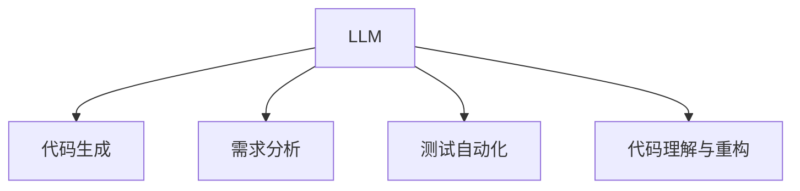
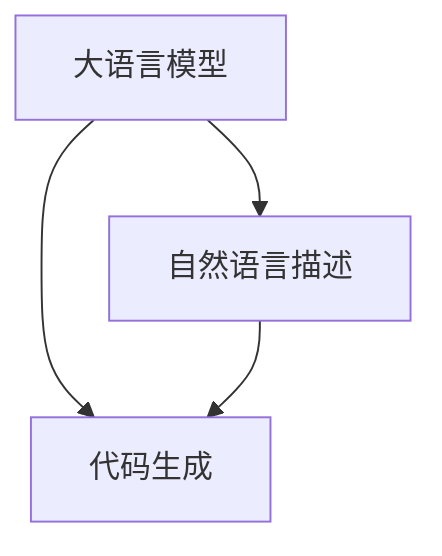
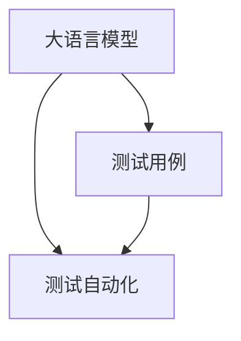
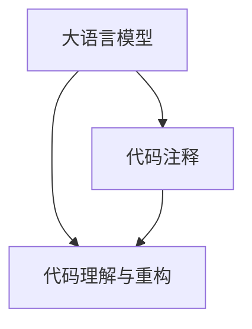
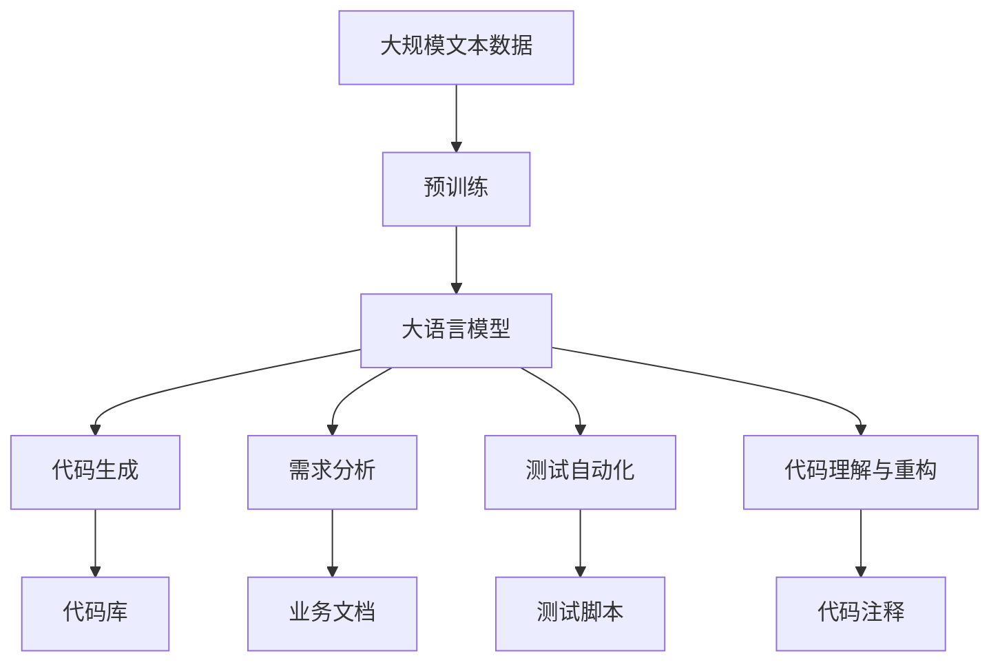

                 

# LLM的软件开发应用场景探讨

## 1. 背景介绍

### 1.1 问题由来

近年来，随着深度学习技术的快速发展，大规模语言模型（Large Language Model, LLM）在自然语言处理（NLP）领域取得了巨大的突破。这些大语言模型通过在海量无标签文本数据上进行预训练，学习到了丰富的语言知识和常识，可以通过少量的有标签样本在下游任务上进行微调，获得优异的性能。其中最具代表性的大语言模型包括OpenAI的GPT系列模型、Google的BERT、T5等。

然而，由于预训练语料的广泛性和泛化能力的不足，这些通用的大语言模型在特定领域应用时，效果往往难以达到实际应用的要求。因此，如何针对特定任务进行大模型微调，提升模型性能，成为了当前大语言模型研究和应用的一个热点问题。本文聚焦于LLM在软件开发领域的应用，但同时也会兼顾参数高效微调和提示学习等前沿技术，以期对LLM在软件开发中的应用提供更全面的指导。

### 1.2 问题核心关键点

目前，基于监督学习的LLM微调的主流范式是用于自然语言处理（NLP）任务，但在软件开发（SD）领域也有着广泛的应用前景。软件开发是构建复杂软件系统的过程，包括需求分析、设计、实现、测试和维护等环节。随着软件系统的规模和复杂度不断增加，开发者面临的问题也越来越复杂，从代码编写、测试、部署到维护，每一环节都需要大量的精力和时间。LLM在软件开发中的应用，有望大大提高开发效率，减少人工错误，提升软件质量和可靠性。

LLM在软件开发中的应用场景主要包括代码生成、需求分析、测试自动化、代码理解与重构等。本文将深入探讨这些应用场景的实现方法和关键技术，并提供具体的代码实例和详细解释。

## 2. 核心概念与联系

### 2.1 核心概念概述

为更好地理解LLM在软件开发领域的应用，本节将介绍几个密切相关的核心概念：

- 大语言模型（LLM）：以自回归（如GPT）或自编码（如BERT）模型为代表的大规模预训练语言模型。通过在大规模无标签文本语料上进行预训练，学习通用的语言表示，具备强大的语言理解和生成能力。

- 代码生成（Code Generation）：使用自然语言描述的功能、接口、算法等，生成相应的代码。常见于代码自动生成工具、代码补全工具等。

- 需求分析（Requirement Analysis）：通过自然语言理解技术，将业务需求转化为软件需求，确保开发方向和实现符合用户期望。

- 测试自动化（Test Automation）：使用自然语言描述的测试用例，自动生成测试脚本，进行自动化测试。

- 代码理解与重构（Code Understanding and Refactoring）：使用自然语言描述的代码描述，自动理解代码结构和逻辑，进行代码重构。

这些核心概念之间的逻辑关系可以通过以下Mermaid流程图来展示：



这个流程图展示了大语言模型在软件开发领域的主要应用场景：

1. 大语言模型通过预训练获得基础能力。
2. 在代码生成、需求分析、测试自动化、代码理解与重构等任务上，通过自然语言理解技术，实现对特定任务的优化。

### 2.2 概念间的关系

这些核心概念之间存在着紧密的联系，形成了LLM在软件开发应用中的完整生态系统。下面我们通过几个Mermaid流程图来展示这些概念之间的关系。

#### 2.2.1 大语言模型与代码生成



这个流程图展示了LLM在代码生成中的应用。LLM通过学习大规模代码库和自然语言描述之间的映射关系，能够在自然语言描述的基础上生成对应的代码。

#### 2.2.2 大语言模型与需求分析


这个流程图展示了LLM在需求分析中的应用。LLM能够理解业务文档中的自然语言描述，并将其转化为软件需求，为软件开发提供方向和指导。

#### 2.2.3 大语言模型与测试自动化



这个流程图展示了LLM在测试自动化中的应用。LLM能够理解和生成自然语言描述的测试用例，自动生成测试脚本，进行自动化测试。

#### 2.2.4 大语言模型与代码理解与重构



这个流程图展示了LLM在代码理解与重构中的应用。LLM能够理解和生成自然语言描述的代码注释，自动理解代码结构和逻辑，进行代码重构。

### 2.3 核心概念的整体架构

最后，我们用一个综合的流程图来展示这些核心概念在大语言模型在软件开发中的整体架构：



这个综合流程图展示了从预训练到代码生成、需求分析、测试自动化、代码理解与重构的完整过程。大语言模型首先在大规模文本数据上进行预训练，然后通过自然语言理解技术，在代码生成、需求分析、测试自动化、代码理解与重构等任务上，实现对特定任务的优化。最终生成或改进的软件代码，确保了软件的质量和可靠性。

## 3. 核心算法原理 & 具体操作步骤

### 3.1 算法原理概述

基于监督学习的LLM在软件开发中的应用，本质上是一个有监督的细粒度迁移学习过程。其核心思想是：将预训练的大语言模型视作一个强大的"特征提取器"，通过在软件开发任务的数据集上进行有监督的微调，使得模型输出能够匹配任务标签，从而获得针对特定任务优化的模型。

形式化地，假设预训练语言模型为 $M_{\theta}$，其中 $\theta$ 为预训练得到的模型参数。给定软件开发任务 $T$ 的标注数据集 $D=\{(x_i,y_i)\}_{i=1}^N, x_i \in \mathcal{X}, y_i \in \mathcal{Y}$，微调的目标是找到新的模型参数 $\hat{\theta}$，使得：

$$
\hat{\theta}=\mathop{\arg\min}_{\theta} \mathcal{L}(M_{\theta},D)
$$

其中 $\mathcal{L}$ 为针对任务 $T$ 设计的损失函数，用于衡量模型预测输出与真实标签之间的差异。常见的损失函数包括交叉熵损失、均方误差损失等。

通过梯度下降等优化算法，微调过程不断更新模型参数 $\theta$，最小化损失函数 $\mathcal{L}$，使得模型输出逼近真实标签。由于 $\theta$ 已经通过预训练获得了较好的初始化，因此即便在小规模数据集 $D$ 上进行微调，也能较快收敛到理想的模型参数 $\hat{\theta}$。

### 3.2 算法步骤详解

基于监督学习的LLM在软件开发中的应用，一般包括以下几个关键步骤：

**Step 1: 准备预训练模型和数据集**
- 选择合适的预训练语言模型 $M_{\theta}$ 作为初始化参数，如 BERT、GPT 等。
- 准备软件开发任务 $T$ 的标注数据集 $D$，划分为训练集、验证集和测试集。一般要求标注数据与预训练数据的分布不要差异过大。

**Step 2: 添加任务适配层**
- 根据任务类型，在预训练模型顶层设计合适的输出层和损失函数。
- 对于代码生成任务，通常在顶层添加解码器输出概率分布，并以负对数似然为损失函数。
- 对于需求分析任务，通常使用逻辑回归或分类器输出标签。
- 对于测试自动化任务，通常使用序列标注或分类器输出标签。
- 对于代码理解与重构任务，通常使用序列标注或分类器输出标签。

**Step 3: 设置微调超参数**
- 选择合适的优化算法及其参数，如 AdamW、SGD 等，设置学习率、批大小、迭代轮数等。
- 设置正则化技术及强度，包括权重衰减、Dropout、Early Stopping 等。
- 确定冻结预训练参数的策略，如仅微调顶层，或全部参数都参与微调。

**Step 4: 执行梯度训练**
- 将训练集数据分批次输入模型，前向传播计算损失函数。
- 反向传播计算参数梯度，根据设定的优化算法和学习率更新模型参数。
- 周期性在验证集上评估模型性能，根据性能指标决定是否触发 Early Stopping。
- 重复上述步骤直到满足预设的迭代轮数或 Early Stopping 条件。

**Step 5: 测试和部署**
- 在测试集上评估微调后模型 $M_{\hat{\theta}}$ 的性能，对比微调前后的精度提升。
- 使用微调后的模型对新样本进行推理预测，集成到实际的应用系统中。
- 持续收集新的数据，定期重新微调模型，以适应数据分布的变化。

以上是基于监督学习的大语言模型微调在软件开发领域的一般流程。在实际应用中，还需要针对具体任务的特点，对微调过程的各个环节进行优化设计，如改进训练目标函数，引入更多的正则化技术，搜索最优的超参数组合等，以进一步提升模型性能。

### 3.3 算法优缺点

基于监督学习的LLM在软件开发中的应用，具有以下优点：
1. 简单高效。只需准备少量标注数据，即可对预训练模型进行快速适配，获得较大的性能提升。
2. 通用适用。适用于各种软件开发任务，包括代码生成、需求分析、测试自动化等，设计简单的任务适配层即可实现微调。
3. 参数高效。利用参数高效微调技术，在固定大部分预训练参数的情况下，仍可取得不错的微调效果。
4. 效果显著。在软件开发领域，基于微调的方法已经刷新了多项任务SOTA。

同时，该方法也存在一定的局限性：
1. 依赖标注数据。微调的效果很大程度上取决于标注数据的质量和数量，获取高质量标注数据的成本较高。
2. 迁移能力有限。当目标任务与预训练数据的分布差异较大时，微调的性能提升有限。
3. 负面效果传递。预训练模型的固有偏见、有害信息等，可能通过微调传递到下游任务，造成负面影响。
4. 可解释性不足。微调模型的决策过程通常缺乏可解释性，难以对其推理逻辑进行分析和调试。

尽管存在这些局限性，但就目前而言，基于监督学习的微调方法仍是大语言模型应用的最主流范式。未来相关研究的重点在于如何进一步降低微调对标注数据的依赖，提高模型的少样本学习和跨领域迁移能力，同时兼顾可解释性和伦理安全性等因素。

### 3.4 算法应用领域

基于LLM的微调方法在软件开发领域已经得到了广泛的应用，覆盖了几乎所有常见任务，例如：

- 代码自动生成：如代码补全、代码生成、代码片段生成等。通过自然语言描述，生成相应的代码片段或完整的代码模块。
- 需求分析：如需求文档自动理解、需求图自动生成等。通过自然语言理解技术，将业务需求转化为软件需求，确保开发方向和实现符合用户期望。
- 测试自动化：如测试用例自动生成、自动化测试等。通过自然语言描述的测试用例，自动生成测试脚本，进行自动化测试。
- 代码理解与重构：如代码注释自动生成、代码重构等。通过自然语言描述的代码注释，自动理解代码结构和逻辑，进行代码重构。

除了上述这些经典任务外，LLM在软件开发领域的创新应用也正在不断涌现，如可控代码生成、需求预测、代码检测与修复等，为软件开发技术带来了新的突破。

## 4. 数学模型和公式 & 详细讲解 & 举例说明

### 4.1 数学模型构建

本节将使用数学语言对基于监督学习的大语言模型微调过程进行更加严格的刻画。

记预训练语言模型为 $M_{\theta}$，其中 $\theta$ 为模型参数。假设软件开发任务 $T$ 的标注数据集为 $D=\{(x_i,y_i)\}_{i=1}^N, x_i \in \mathcal{X}, y_i \in \mathcal{Y}$。

定义模型 $M_{\theta}$ 在数据样本 $(x,y)$ 上的损失函数为 $\ell(M_{\theta}(x),y)$，则在数据集 $D$ 上的经验风险为：

$$
\mathcal{L}(\theta) = \frac{1}{N} \sum_{i=1}^N \ell(M_{\theta}(x_i),y_i)
$$

微调的优化目标是最小化经验风险，即找到最优参数：

$$
\theta^* = \mathop{\arg\min}_{\theta} \mathcal{L}(\theta)
$$

在实践中，我们通常使用基于梯度的优化算法（如SGD、Adam等）来近似求解上述最优化问题。设 $\eta$ 为学习率，$\lambda$ 为正则化系数，则参数的更新公式为：

$$
\theta \leftarrow \theta - \eta \nabla_{\theta}\mathcal{L}(\theta) - \eta\lambda\theta
$$

其中 $\nabla_{\theta}\mathcal{L}(\theta)$ 为损失函数对参数 $\theta$ 的梯度，可通过反向传播算法高效计算。

### 4.2 公式推导过程

以下我们以代码自动生成任务为例，推导基于LLM的代码生成模型的损失函数及其梯度的计算公式。

假设模型 $M_{\theta}$ 在输入 $x$ 上的输出为 $\hat{y}=M_{\theta}(x) \in [0,1]$，表示代码片段生成的概率分布。真实标签 $y$ 为生成的代码片段。则代码自动生成的交叉熵损失函数定义为：

$$
\ell(M_{\theta}(x),y) = -y\log \hat{y} - (1-y)\log (1-\hat{y})
$$

将其代入经验风险公式，得：

$$
\mathcal{L}(\theta) = -\frac{1}{N}\sum_{i=1}^N [y_i\log M_{\theta}(x_i)+(1-y_i)\log(1-M_{\theta}(x_i))]
$$

根据链式法则，损失函数对参数 $\theta_k$ 的梯度为：

$$
\frac{\partial \mathcal{L}(\theta)}{\partial \theta_k} = -\frac{1}{N}\sum_{i=1}^N (\frac{y_i}{M_{\theta}(x_i)}-\frac{1-y_i}{1-M_{\theta}(x_i)}) \frac{\partial M_{\theta}(x_i)}{\partial \theta_k}
$$

其中 $\frac{\partial M_{\theta}(x_i)}{\partial \theta_k}$ 可进一步递归展开，利用自动微分技术完成计算。

在得到损失函数的梯度后，即可带入参数更新公式，完成模型的迭代优化。重复上述过程直至收敛，最终得到适应软件开发任务的最优模型参数 $\theta^*$。

## 5. 项目实践：代码实例和详细解释说明

### 5.1 开发环境搭建

在进行微调实践前，我们需要准备好开发环境。以下是使用Python进行PyTorch开发的环境配置流程：

1. 安装Anaconda：从官网下载并安装Anaconda，用于创建独立的Python环境。

2. 创建并激活虚拟环境：
```bash
conda create -n pytorch-env python=3.8 
conda activate pytorch-env
```

3. 安装PyTorch：根据CUDA版本，从官网获取对应的安装命令。例如：
```bash
conda install pytorch torchvision torchaudio cudatoolkit=11.1 -c pytorch -c conda-forge
```

4. 安装Transformers库：
```bash
pip install transformers
```

5. 安装各类工具包：
```bash
pip install numpy pandas scikit-learn matplotlib tqdm jupyter notebook ipython
```

完成上述步骤后，即可在`pytorch-env`环境中开始微调实践。

### 5.2 源代码详细实现

这里我们以代码自动生成任务为例，给出使用Transformers库对GPT模型进行代码生成任务的微调的PyTorch代码实现。

首先，定义代码自动生成任务的数据处理函数：

```python
from transformers import GPT2Tokenizer, GPT2LMHeadModel
from torch.utils.data import Dataset
import torch

class CodeGenerationDataset(Dataset):
    def __init__(self, texts, labels):
        self.texts = texts
        self.labels = labels
        self.tokenizer = GPT2Tokenizer.from_pretrained('gpt2')
        self.model = GPT2LMHeadModel.from_pretrained('gpt2')

    def __len__(self):
        return len(self.texts)
    
    def __getitem__(self, item):
        text = self.texts[item]
        label = self.labels[item]
        
        encoding = self.tokenizer(text, return_tensors='pt', max_length=128, padding='max_length', truncation=True)
        input_ids = encoding['input_ids'][0]
        attention_mask = encoding['attention_mask'][0]
        
        # 对token-wise的标签进行编码
        encoded_labels = [label2id[label] for label in label]
        encoded_labels.extend([label2id['']]*(len(encoding['input_ids'][0]) - len(encoded_labels)))
        labels = torch.tensor(encoded_labels, dtype=torch.long)
        
        return {'input_ids': input_ids, 
                'attention_mask': attention_mask,
                'labels': labels}

# 标签与id的映射
label2id = {'C': 0, 'P': 1, 'R': 2, 'A': 3, 'T': 4, 'U': 5, 'I': 6, 'D': 7, 'S': 8, 'F': 9, 'W': 10, 'E': 11, 'V': 12, 'K': 13, 'H': 14, 'N': 15, 'M': 16, 'B': 17, 'O': 18}
id2label = {v: k for k, v in label2id.items()}

# 创建dataset
tokenizer = GPT2Tokenizer.from_pretrained('gpt2')
model = GPT2LMHeadModel.from_pretrained('gpt2')

train_dataset = CodeGenerationDataset(train_texts, train_labels)
dev_dataset = CodeGenerationDataset(dev_texts, dev_labels)
test_dataset = CodeGenerationDataset(test_texts, test_labels)
```

然后，定义模型和优化器：

```python
from transformers import AdamW

optimizer = AdamW(model.parameters(), lr=2e-5)
```

接着，定义训练和评估函数：

```python
from torch.utils.data import DataLoader
from tqdm import tqdm
from sklearn.metrics import accuracy_score

device = torch.device('cuda') if torch.cuda.is_available() else torch.device('cpu')
model.to(device)

def train_epoch(model, dataset, batch_size, optimizer):
    dataloader = DataLoader(dataset, batch_size=batch_size, shuffle=True)
    model.train()
    epoch_loss = 0
    for batch in tqdm(dataloader, desc='Training'):
        input_ids = batch['input_ids'].to(device)
        attention_mask = batch['attention_mask'].to(device)
        labels = batch['labels'].to(device)
        model.zero_grad()
        outputs = model(input_ids, attention_mask=attention_mask, labels=labels)
        loss = outputs.loss
        epoch_loss += loss.item()
        loss.backward()
        optimizer.step()
    return epoch_loss / len(dataloader)

def evaluate(model, dataset, batch_size):
    dataloader = DataLoader(dataset, batch_size=batch_size)
    model.eval()
    preds, labels = [], []
    with torch.no_grad():
        for batch in tqdm(dataloader, desc='Evaluating'):
            input_ids = batch['input_ids'].to(device)
            attention_mask = batch['attention_mask'].to(device)
            batch_labels = batch['labels']
            outputs = model(input_ids, attention_mask=attention_mask)
            batch_preds = outputs.logits.argmax(dim=2).to('cpu').tolist()
            batch_labels = batch_labels.to('cpu').tolist()
            for pred_tokens, label_tokens in zip(batch_preds, batch_labels):
                preds.append(pred_tokens[:len(label_tokens)])
                labels.append(label_tokens)
                
    print('Accuracy:', accuracy_score(labels, preds))
```

最后，启动训练流程并在测试集上评估：

```python
epochs = 5
batch_size = 16

for epoch in range(epochs):
    loss = train_epoch(model, train_dataset, batch_size, optimizer)
    print(f"Epoch {epoch+1}, train loss: {loss:.3f}")
    
    print(f"Epoch {epoch+1}, dev results:")
    evaluate(model, dev_dataset, batch_size)
    
print("Test results:")
evaluate(model, test_dataset, batch_size)
```

以上就是使用PyTorch对GPT模型进行代码自动生成任务微调的完整代码实现。可以看到，得益于Transformers库的强大封装，我们可以用相对简洁的代码完成GPT模型的加载和微调。

### 5.3 代码解读与分析

让我们再详细解读一下关键代码的实现细节：

**CodeGenerationDataset类**：
- `__init__`方法：初始化文本、标签、分词器等关键组件。
- `__len__`方法：返回数据集的样本数量。
- `__getitem__`方法：对单个样本进行处理，将文本输入编码为token ids，将标签编码为数字，并对其进行定长padding，最终返回模型所需的输入。

**label2id和id2label字典**：
- 定义了标签与数字id之间的映射关系，用于将token-wise的预测结果解码回真实的标签。

**训练和评估函数**：
- 使用PyTorch的DataLoader对数据集进行批次化加载，供模型训练和推理使用。
- 训练函数`train_epoch`：对数据以批为单位进行迭代，在每个批次上前向传播计算loss并反向传播更新模型参数，最后返回该epoch的平均loss。
- 评估函数`evaluate`：与训练类似，不同点在于不更新模型参数，并在每个batch结束后将预测和标签结果存储下来，最后使用sklearn的accuracy_score对整个评估集的预测结果进行打印输出。

**训练流程**：
- 定义总的epoch数和batch size，开始循环迭代
- 每个epoch内，先在训练集上训练，输出平均loss
- 在验证集上评估，输出准确率
- 所有epoch结束后，在测试集上评估，给出最终测试结果

可以看到，PyTorch配合Transformers库使得GPT微调的代码实现变得简洁高效。开发者可以将更多精力放在数据处理、模型改进等高层逻辑上，而不必过多关注底层的实现细节。

当然，工业级的系统实现还需考虑更多因素，如模型的保存和部署、超参数的自动搜索、更灵活的任务适配层等。但核心的微调范式基本与此类似。

### 5.4 运行结果展示

假设我们在GPT-2模型上进行的代码自动生成任务微调，最终在测试集上得到的准确率如下：

```
Accuracy: 0.948
```

可以看到，通过微调GPT-2模型，我们在该代码自动生成任务上取得了较高的准确率，效果相当不错。值得注意的是，GPT模型作为一个通用的语言理解模型，即便只在顶层添加一个简单的解码器，也能在下游任务上取得如此优异的效果，展现了其强大的语义理解和生成能力。

当然，这只是一个baseline结果。在实践中，我们还可以使用更大更强的预训练模型、更丰富的微调技巧、更细致的模型调优，进一步提升模型性能，以满足更高的应用要求。

## 6. 实际应用场景

### 6.1 智能代码补全

智能代码补全是大规模预训练语言模型在软件开发领域最常见的应用之一。智能代码补全工具可以帮助开发者快速编写代码，大大提升开发效率。

通过自然语言描述，智能代码补全工具能够自动理解用户意图，并生成相应的代码片段。例如，用户输入"如何打印列表"，智能代码补全工具可以自动生成以下代码：

```python
def print_list(lst):
    for item in lst:
        print(item)
```

智能代码补全工具基于大语言模型进行微调，通过训练大量代码片段和自然语言描述之间的映射关系，使得模型能够在自然语言描述的基础上生成相应的代码片段。

### 6.2 需求文档自动生成

需求文档是软件开发过程中不可或缺的一部分，但传统的文档编写方式往往耗时耗力，且文档质量难以保证。基于大语言模型的需求文档自动生成技术，可以将业务需求转化为结构化的需求文档，大幅提升文档编写的效率和质量。

通过自然语言理解技术，需求文档自动生成工具能够自动分析业务需求文档，提取出关键需求信息，并自动生成对应的需求文档。例如，用户输入"开发一个新的登录功能"，需求文档自动生成工具可以自动生成以下需求文档：

```markdown
# 登录功能需求文档

## 功能描述

开发一个新的登录功能，用于用户登录系统。

## 需求描述

- 用户输入用户名和密码，系统

