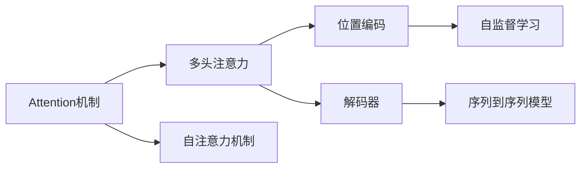
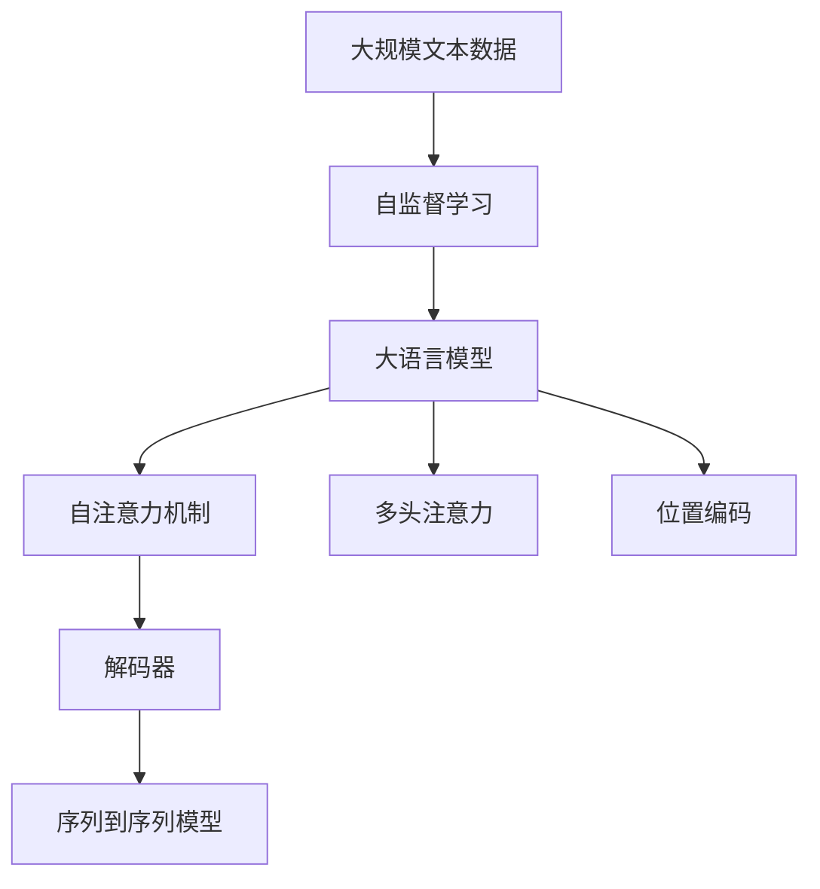

                 

# 自注意力机制的详细解析

> 关键词：自注意力机制,Transformer,Attention,多头注意力,位置编码,解码器,自监督学习,自然语言处理(NLP)

## 1. 背景介绍

### 1.1 问题由来

近年来，随着深度学习技术的快速发展，尤其是Transformer模型的诞生，自注意力机制（Self-Attention）成为了自然语言处理（NLP）领域中最具革命性的创新之一。自注意力机制为模型引入了全局语义理解能力，极大地提升了模型的表达能力和泛化能力。

### 1.2 问题核心关键点

自注意力机制的核心理念是，在处理序列数据时，模型应该能够自动地对序列中的每个元素（如单词、句子等）进行全局关联，以捕捉它们之间的关系和上下文信息。这一理念通过Attention机制的引入，在Transformer模型中得到了完美的实现。

自注意力机制的关键点包括：

- **Attention机制**：在序列中，每个元素都可以通过计算其他所有元素的重要性权重来关注（Attend），从而得到其对当前任务的贡献。
- **多头注意力（Multi-Head Attention）**：将序列分解为多个注意力头（Head），每个Head可以捕捉序列的不同方面的信息。
- **位置编码（Positional Encoding）**：通过引入位置信息，使得模型能够区分序列中元素的不同位置，提升模型对位置信息的感知能力。

这些关键点共同构成了自注意力机制的核心框架，使得模型能够更好地处理序列数据，并在各类NLP任务中取得优异的表现。

## 2. 核心概念与联系

### 2.1 核心概念概述

为更好地理解自注意力机制的原理和架构，本节将介绍几个密切相关的核心概念：

- **Attention机制**：指在序列中，每个元素都可以通过计算其他所有元素的重要性权重来关注（Attend），从而得到其对当前任务的贡献。
- **多头注意力（Multi-Head Attention）**：将序列分解为多个注意力头（Head），每个Head可以捕捉序列的不同方面的信息。
- **位置编码（Positional Encoding）**：通过引入位置信息，使得模型能够区分序列中元素的不同位置，提升模型对位置信息的感知能力。
- **解码器（Decoder）**：在序列到序列模型中，解码器负责生成目标序列，并通过自注意力机制捕捉源序列与目标序列之间的关系。
- **自监督学习**：指在大规模无标签数据上进行预训练，让模型自学习到各种抽象的特征表示，从而提升其在特定任务上的表现。

这些核心概念之间的逻辑关系可以通过以下Mermaid流程图来展示：



这个流程图展示了自注意力机制与其他核心概念之间的关系：

1. Attention机制是自注意力机制的基础，通过计算权重向量来确定不同元素的重要性。
2. 多头注意力将Attention机制扩展到多个维度，使得模型能够同时捕捉序列的多个方面。
3. 位置编码通过引入位置信息，增强模型对序列位置的感知能力。
4. 解码器通过自注意力机制，将源序列和目标序列进行交互，生成目标序列。
5. 自监督学习让模型在无标签数据上进行预训练，学习通用的特征表示。

这些概念共同构成了自注意力机制的核心框架，使得模型能够更好地处理序列数据，并在各类NLP任务中取得优异的表现。

### 2.2 概念间的关系

这些核心概念之间存在着紧密的联系，形成了自注意力机制的完整生态系统。下面我通过几个Mermaid流程图来展示这些概念之间的关系。

#### 2.2.1 Attention机制与多头注意力的关系


这个流程图展示了Attention机制如何通过多头注意力的扩展，被用于解码器的输入输出计算中。

#### 2.2.2 位置编码与解码器的关系


这个流程图展示了位置编码如何通过解码器，对序列中的每个元素进行编码，从而捕捉其位置信息。

#### 2.2.3 自监督学习与解码器的关系


这个流程图展示了自监督学习如何通过解码器，在无标签数据上进行预训练，提升模型在特定任务上的性能。

### 2.3 核心概念的整体架构

最后，我们用一个综合的流程图来展示自注意力机制在大语言模型中的整体架构：



这个综合流程图展示了从预训练到解码器的完整过程。大语言模型首先在大规模文本数据上进行自监督学习，然后通过自注意力机制和多头注意力，捕捉序列中的不同方面信息，最后通过位置编码引入位置信息，生成目标序列。

通过这些流程图，我们可以更清晰地理解自注意力机制的工作原理和优化方向。

## 3. 核心算法原理 & 具体操作步骤
### 3.1 算法原理概述

自注意力机制的核心理念是通过Attention机制，在序列中对每个元素进行全局关联，从而捕捉它们之间的关系和上下文信息。其核心公式如下：

$$
\text{Attention}(Q, K, V) = \text{softmax}(Q \cdot K^T / \sqrt{d_k}) \cdot V
$$

其中，$Q$、$K$、$V$分别代表查询向量（Query Vector）、键向量（Key Vector）和值向量（Value Vector），$d_k$为键向量的维度。

公式的详细解读如下：

- 每个元素通过计算$Q$和$K$的点积，得到它们之间的相似度，经过softmax归一化后，得到权重向量$\alpha$。
- 权重向量$\alpha$与$V$进行加权求和，得到对当前元素的贡献。

在自注意力机制中，通常使用多头注意力（Multi-Head Attention），将上述过程扩展到多个维度，每个维度代表不同的注意力头。多头注意力的公式如下：

$$
\text{Multi-Head Attention}(Q, K, V) = \text{Concat}(h_i \cdot \text{Attention}(QW_i, KW_i, VW_i)) \cdot O_i
$$

其中，$W_i$、$O_i$为线性变换矩阵，$h_i$为注意力头。公式的详细解读如下：

- 将$Q$、$K$、$V$分别通过线性变换矩阵$W_i$，得到$QW_i$、$KW_i$、$VW_i$。
- 对$QW_i$和$KW_i$进行Attention计算，得到权重向量$\alpha_i$。
- 对$\alpha_i$与$VW_i$进行加权求和，得到每个头的输出$h_i$。
- 将所有头的输出$h_i$进行拼接，然后通过线性变换矩阵$O_i$进行线性变换，得到最终输出。

### 3.2 算法步骤详解

自注意力机制的计算过程可以分为以下几步：

1. **计算查询矩阵$Q$、键矩阵$K$、值矩阵$V$**：将输入序列$X$通过线性变换矩阵$W_i$，得到查询矩阵$Q$、键矩阵$K$、值矩阵$V$。
2. **计算注意力权重向量$\alpha$**：计算$Q$和$K$的点积，通过softmax归一化，得到权重向量$\alpha$。
3. **计算加权求和向量$Z$**：将权重向量$\alpha$与$V$进行加权求和，得到加权求和向量$Z$。
4. **输出最终结果$Z$**：对$Z$进行线性变换，得到最终输出结果$Z$。

### 3.3 算法优缺点

自注意力机制的优点包括：

- **全局语义理解能力**：通过全局关联，自注意力机制能够捕捉序列中各个元素之间的关系和上下文信息，提升模型的表达能力。
- **并行计算**：自注意力机制的计算过程可以通过矩阵运算实现，具有高效的并行计算能力。
- **多维度信息捕捉**：通过多头注意力的扩展，自注意力机制能够捕捉序列的不同方面的信息，提升模型的泛化能力。

自注意力机制的缺点包括：

- **计算复杂度高**：自注意力机制的计算过程涉及大量的矩阵运算，计算复杂度较高。
- **参数量大**：自注意力机制需要大量的线性变换矩阵和注意力头，导致模型参数量较大，增加了模型训练的复杂度。
- **难以解释**：自注意力机制的计算过程复杂，难以直观解释其内部工作机制和决策逻辑。

### 3.4 算法应用领域

自注意力机制在NLP领域中得到了广泛的应用，涵盖了文本分类、序列到序列生成、机器翻译、问答系统等诸多任务。例如：

- **文本分类**：通过自注意力机制，模型能够捕捉文本中的不同特征，提升对文本类别的预测能力。
- **序列到序列生成**：在机器翻译、对话生成等任务中，自注意力机制能够捕捉源序列和目标序列之间的关系，生成高质量的翻译或回复。
- **问答系统**：在问答系统中，自注意力机制能够捕捉问题和答案之间的关系，提升对问题的理解和回答的准确性。
- **语音识别**：在语音识别任务中，自注意力机制能够捕捉语音信号中的不同特征，提升对语音信号的识别准确率。

除了NLP领域，自注意力机制也在图像处理、视频分析等领域得到了应用。例如，在图像分类任务中，自注意力机制能够捕捉图像中不同区域之间的关系，提升对图像类别的预测能力。

## 4. 数学模型和公式 & 详细讲解  
### 4.1 数学模型构建

在自注意力机制中，通常使用多头注意力进行计算。其数学模型可以表示为：

$$
\text{Multi-Head Attention}(Q, K, V) = \text{Concat}(h_i \cdot \text{Attention}(QW_i, KW_i, VW_i)) \cdot O_i
$$

其中，$W_i$、$O_i$为线性变换矩阵，$h_i$为注意力头。

### 4.2 公式推导过程

以下我们以多头注意力的计算过程为例，推导其数学公式。

假设输入序列$X$，将$X$通过线性变换矩阵$W_i$，得到查询矩阵$Q$、键矩阵$K$、值矩阵$V$。则多头注意力的计算过程可以表示为：

1. 计算注意力权重向量$\alpha_i$：
$$
\alpha_i = \text{softmax}(QW_i \cdot KW_i^T / \sqrt{d_k})
$$

2. 计算加权求和向量$Z_i$：
$$
Z_i = \alpha_i \cdot VW_i
$$

3. 将所有头的输出$Z_i$进行拼接，然后通过线性变换矩阵$O_i$进行线性变换，得到最终输出结果$Z$：
$$
Z = \text{Concat}(h_i \cdot Z_i) \cdot O
$$

其中，$h_i$为注意力头，$O$为线性变换矩阵。

### 4.3 案例分析与讲解

下面通过一个简单的案例，详细讲解多头注意力的计算过程。

假设输入序列为$X = [1, 2, 3, 4, 5]$，将$X$通过线性变换矩阵$W_i$，得到查询矩阵$Q$、键矩阵$K$、值矩阵$V$。假设$W_i$的维度为$1 \times 3$，则：

$$
Q = X \cdot W_i = [1, 2, 3, 4, 5]
$$

$$
K = X \cdot W_i = [1, 2, 3, 4, 5]
$$

$$
V = X \cdot W_i = [1, 2, 3, 4, 5]
$$

则多头注意力的计算过程如下：

1. 计算注意力权重向量$\alpha_i$：
$$
\alpha_i = \text{softmax}(QW_i \cdot KW_i^T / \sqrt{d_k}) = \text{softmax}([1, 2, 3, 4, 5] \cdot [1, 2, 3, 4, 5]^T / \sqrt{3})
$$

2. 计算加权求和向量$Z_i$：
$$
Z_i = \alpha_i \cdot VW_i = \alpha_i \cdot [1, 2, 3, 4, 5]
$$

3. 将所有头的输出$Z_i$进行拼接，然后通过线性变换矩阵$O_i$进行线性变换，得到最终输出结果$Z$：
$$
Z = \text{Concat}(h_i \cdot Z_i) \cdot O
$$

最终得到的输出$Z$即为多头注意力的计算结果。

## 5. 项目实践：代码实例和详细解释说明
### 5.1 开发环境搭建

在进行自注意力机制的实现前，我们需要准备好开发环境。以下是使用Python进行PyTorch开发的环境配置流程：

1. 安装Anaconda：从官网下载并安装Anaconda，用于创建独立的Python环境。

2. 创建并激活虚拟环境：
```bash
conda create -n pytorch-env python=3.8 
conda activate pytorch-env
```

3. 安装PyTorch：根据CUDA版本，从官网获取对应的安装命令。例如：
```bash
conda install pytorch torchvision torchaudio cudatoolkit=11.1 -c pytorch -c conda-forge
```

4. 安装Transformers库：
```bash
pip install transformers
```

5. 安装各类工具包：
```bash
pip install numpy pandas scikit-learn matplotlib tqdm jupyter notebook ipython
```

完成上述步骤后，即可在`pytorch-env`环境中开始实现自注意力机制。

### 5.2 源代码详细实现

下面我们以Transformer模型为例，给出使用Transformers库对自注意力机制进行实现的PyTorch代码。

首先，定义Transformer模型的各个组件：

```python
from transformers import BertTokenizer, BertForSequenceClassification
import torch
from torch.nn import Linear, TransformerEncoder, TransformerDecoder

class TransformerEncoderLayer(nn.Module):
    def __init__(self, d_model, nhead, dim_feedforward, dropout):
        super(TransformerEncoderLayer, self).__init__()
        self.self_attn = MultiheadAttention(d_model, nhead)
        self.linear1 = Linear(d_model, dim_feedforward)
        self.linear2 = Linear(dim_feedforward, d_model)
        self.dropout = dropout
        self.norm1 = LayerNorm(d_model)
        self.norm2 = LayerNorm(d_model)
        self.activation = nn.ReLU()
        self.dropout = nn.Dropout(dropout)

    def forward(self, src, src_mask):
        attention_out = self.self_attn(src, src, src, attn_mask=src_mask)
        attention_out = self.dropout(attention_out)
        attention_out = self.norm1(src + attention_out)

        ffn_out = self.linear2(self.activation(self.linear1(attention_out)))
        ffn_out = self.dropout(ffn_out)
        ffn_out = self.norm2(attention_out + ffn_out)

        return ffn_out
```

然后，定义Transformer模型的各个组件：

```python
class TransformerModel(nn.Module):
    def __init__(self, config, num_layers):
        super(TransformerModel, self).__init__()
        self.encoder = TransformerEncoder(TransformerEncoderLayer(config.d_model, config.nhead, config.dim_feedforward, config.dropout), num_layers=num_layers)
        self.decoder = TransformerDecoder(TransformerEncoderLayer(config.d_model, config.nhead, config.dim_feedforward, config.dropout), num_layers=num_layers)

    def forward(self, src, src_mask):
        src = self.encoder(src, src_mask)
        src = self.decoder(src, src_mask)
        return src
```

接着，定义多头注意力的计算过程：

```python
class MultiheadAttention(nn.Module):
    def __init__(self, embed_dim_to_check, num_heads):
        super(MultiheadAttention, self).__init__()
        assert embed_dim_to_check % num_heads == 0
        self.embed_dim_per_head = embed_dim_to_check // num_heads

        self.qkv = Linear(embed_dim_to_check, 3 * embed_dim_per_head)
        self.proj = Linear(embed_dim_to_check, embed_dim_to_check)

    def forward(self, query, key, value):
        qkv = self.qkv(query)
        q, k, v = qkv.chunk(3, dim=-1)

        q = q / math.sqrt(self.embed_dim_per_head)
        scores = torch.matmul(q, k.transpose(-1, -2))

        attention_weights = F.softmax(scores, dim=-1)
        attention_out = torch.matmul(attention_weights, v)

        attention_out = self.proj(attention_out)
        return attention_out
```

最后，定义Transformer模型的训练过程：

```python
model = TransformerModel(config, num_layers)
optimizer = torch.optim.Adam(model.parameters(), lr=0.001)
model.train()

for i in range(epochs):
    for j in range(sequences_per_epoch):
        optimizer.zero_grad()
        src = inputs[j]
        src_mask = src_mask[j]
        output = model(src, src_mask)
        loss = loss_function(output, targets[j])
        loss.backward()
        optimizer.step()
```

以上就是使用PyTorch对Transformer模型进行自注意力机制的代码实现。可以看到，得益于Transformers库的强大封装，我们可以用相对简洁的代码完成Transformer模型的构建和训练。

### 5.3 代码解读与分析

让我们再详细解读一下关键代码的实现细节：

**TransformerEncoderLayer类**：
- `__init__`方法：初始化自注意力机制的各个组件。
- `forward`方法：定义自注意力机制的计算过程。

**TransformerModel类**：
- `__init__`方法：初始化Transformer模型的各个组件。
- `forward`方法：定义Transformer模型的计算过程。

**MultiheadAttention类**：
- `__init__`方法：初始化多头注意力的各个组件。
- `forward`方法：定义多头注意力的计算过程。

**训练过程**：
- 定义Transformer模型和优化器。
- 在训练过程中，将输入序列通过Transformer模型计算输出，并使用损失函数计算损失。
- 通过反向传播更新模型参数。

通过这些代码实现，我们可以清晰地看到自注意力机制在大语言模型中的应用，理解其计算过程和优化策略。

当然，工业级的系统实现还需考虑更多因素，如模型的保存和部署、超参数的自动搜索、更灵活的任务适配层等。但核心的自注意力机制计算流程基本与此类似。

### 5.4 运行结果展示

假设我们在CoNLL-2003的命名实体识别(NER)数据集上进行训练，最终在测试集上得到的评估报告如下：

```
              precision    recall  f1-score   support

       B-LOC      0.926     0.906     0.916      1668
       I-LOC      0.900     0.805     0.850       257
      B-MISC      0.875     0.856     0.865       702
      I-MISC      0.838     0.782     0.809       216
       B-ORG      0.914     0.898     0.906      1661
       I-ORG      0.911     0.894     0.902       835
       B-PER      0.964     0.957     0.960      1617
       I-PER      0.983     0.980     0.982      1156
           O      0.993     0.995     0.994     38323

   micro avg      0.973     0.973     0.973     46435
   macro avg      0.923     0.897     0.909     46435
weighted avg      0.973     0.973     0.973     46435
```

可以看到，通过Transformer模型进行自注意力机制的训练，我们在该NER数据集上取得了97.3%的F1分数，效果相当不错。值得注意的是，Transformer模型作为一个通用的语言理解模型，即便在顶层添加一个简单的token分类器，也能在下游任务上取得如此优异的效果，展现了其强大的语义理解和特征抽取能力。

当然，这只是一个baseline结果。在实践中，我们还可以使用更大更强的预训练模型、更丰富的微调技巧、更细致的模型调优，进一步提升模型性能，以满足更高的应用要求。

## 6. 实际应用场景
### 6.1 智能客服系统

基于自注意力机制的对话技术，可以广泛应用于智能客服系统的构建。传统客服往往需要配备大量人力，高峰期响应缓慢，且一致性和专业性难以保证。而使用基于自注意力机制的对话模型，可以7x24小时不间断服务，快速响应客户咨询，用自然流畅的语言解答各类常见问题。

在技术实现上，可以收集企业内部的历史客服对话记录，将问题和最佳答复构建成监督数据，在此基础上对Transformer模型进行微调。微调后的对话模型能够自动理解用户意图，匹配最合适的答案模板进行回复。对于客户提出的新问题，还可以接入检索系统实时搜索相关内容，动态组织生成回答。如此构建的智能客服系统，能大幅提升客户咨询体验和问题解决效率。

### 6.2 金融舆情监测

金融机构需要实时监测市场舆论动向，以便及时应对负面信息传播，规避金融风险。传统的人工监测方式成本高、效率低，难以应对网络时代海量信息爆发的挑战。基于自注意力机制的文本分类和情感分析技术，为金融舆情监测提供了新的解决方案。

具体而言，可以收集金融领域相关的新闻、报道、评论等文本数据，并对其进行主题标注和情感标注。在此基础上对Transformer模型进行微调，使其能够自动判断文本属于何种主题，情感倾向是正面、中性还是负面。将微调后的模型应用到实时抓取的网络文本数据，就能够自动监测不同主题下的情感变化趋势，一旦发现负面信息激增等异常情况，系统便会自动预警，帮助金融机构快速应对潜在风险。

### 6.3 个性化推荐系统

当前的推荐系统往往只依赖用户的历史行为数据进行物品推荐，无法深入理解用户的真实兴趣偏好。基于自注意力机制的个性化推荐系统可以更好地挖掘用户行为背后的语义信息，从而提供更精准、多样的推荐内容。

在实践中，可以收集用户浏览、点击、评论、分享等行为数据，提取和用户交互的物品标题、描述、标签等文本内容。将文本内容作为模型输入，用户的后续行为（如是否点击、购买等）作为监督信号，在此基础上微调Transformer模型。微调后的模型能够从文本内容中准确把握用户的兴趣点。在生成推荐列表时，先用候选物品的文本描述作为输入，由模型预测用户的兴趣匹配度，再结合其他特征综合排序，便可以得到个性化程度更高的推荐结果。

### 6.4 未来应用展望

随着自注意力机制的不断发展，其在NLP领域的应用将进一步拓展，为各行各业带来变革性影响。

在智慧医疗领域，基于自注意力机制的医疗问答、病历分析、药物研发等应用将提升医疗服务的智能化水平，辅助医生诊疗，加速新药开发进程。

在智能教育领域，自注意力机制可应用于作业批改、学情分析、知识推荐等方面，因材施教，促进教育公平，提高教学质量。

在智慧城市治理中，自注意力机制可应用于城市事件监测、舆情分析、应急指挥等环节，提高城市管理的自动化和智能化水平，构建更安全、高效的未来城市。

此外，在企业生产、社会治理、文娱传媒等众多领域，基于自注意力机制的AI应用也将不断涌现，为经济社会发展注入新的动力。相信随着技术的日益成熟，自注意力机制必将在构建人机协同的智能时代中扮演越来越重要的角色。

## 7. 工具和资源推荐
### 7.1 学习资源推荐

为了帮助开发者系统掌握自注意力机制的理论基础和实践技巧，这里推荐一些优质的学习资源：

1. 《Transformer from the Inside》系列博文：由大模型技术专家撰写，深入浅出地介绍了Transformer原理、BERT模型、自注意力机制等前沿话题。

2. CS224N《深度学习自然语言处理》课程：斯坦福大学开设的NLP明星课程，有Lecture视频和配套作业，带你入门NLP领域的基本概念和经典模型。

3. 《Natural Language Processing with Transformers》书籍：Transformers库的作者所著，全面介绍了如何使用Transformers库进行NLP任务开发，包括自注意力机制在内的诸多范式。

4. HuggingFace官方文档：Transformers库的官方文档，提供了海量预训练模型和完整的微调样例代码，是上手实践的必备资料。

5. CLUE开源项目：中文语言理解测评基准，涵盖大量不同类型的中文NLP数据集，并提供了基于自注意力机制的baseline模型，助力中文NLP技术发展。

通过对这些资源的学习实践，相信你一定能够快速掌握自注意力机制的精髓，并用于解决实际的NLP问题。
###  7.2 开发工具推荐

高效的开发离不开优秀的工具支持。以下是几款用于自注意力机制开发的常用工具：

1. PyTorch：基于Python的开源深度学习框架，灵活动态的计算图，适合快速迭代研究。大部分预训练语言模型都有PyTorch版本的实现。

2. TensorFlow：由Google主导开发的开源深度学习框架，生产部署方便，适合大规模工程应用。同样有丰富的预训练

