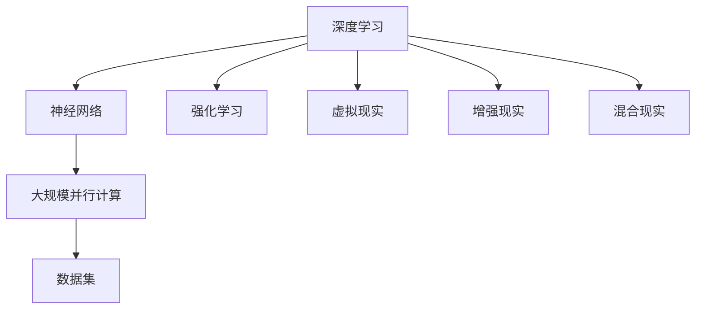

                 

# 虚拟与现实的边界：AI如何重塑我们的感知

## 1. 背景介绍

### 1.1 问题由来

随着人工智能(AI)技术的迅猛发展，AI已经在各个领域广泛应用，包括医疗、交通、金融、教育等。AI技术的进步正在重新定义现实世界的运作方式，并引领我们进入一个新的时代——虚拟与现实的边界开始变得模糊。

但是，AI技术的飞速发展也带来了一些新的问题，例如：AI是否会代替人类，我们如何应对这些技术带来的挑战，以及我们是否准备好接受这样的技术改变。这些问题的答案不仅需要技术上的突破，也需要我们重新思考人类的角色、价值观和社会结构。

### 1.2 问题核心关键点

当前AI技术最核心的关键点主要包括以下几个方面：

- 深度学习和神经网络的普及：这些技术使得AI能够从大量数据中学习到复杂的模式和规律。
- 大规模并行计算：通过GPU、TPU等设备的高速并行计算能力，大幅提升了AI的计算效率。
- 大规模数据集：AI需要大量的标注数据进行训练，例如ImageNet、CoNLL等数据集。
- 强化学习：通过与环境交互学习，AI能够在特定任务上取得优异的表现。

这些关键技术的发展推动了AI在各种任务上的应用，从图像识别、语音识别到自然语言处理、推荐系统等，AI正在全面渗透我们的日常生活和工作。

## 2. 核心概念与联系

### 2.1 核心概念概述

为了更好地理解AI如何重塑我们的感知，本节将介绍几个密切相关的核心概念：

- 深度学习(Deep Learning)：一种基于神经网络的机器学习技术，通过多层次的非线性变换来提取数据中的高级特征。
- 神经网络(Neural Network)：一种通过节点连接形成的网络结构，用于模拟人类大脑的神经网络。
- 大规模并行计算(Parallel Computing)：通过多台计算设备同时进行计算，以提高计算速度和效率。
- 数据集(Datasets)：AI训练所需的数据集合，通常包含大量的标注数据。
- 强化学习(Reinforcement Learning)：通过与环境交互学习，AI能够逐步优化决策策略。
- 虚拟现实(Virtual Reality, VR)：一种通过计算机生成的模拟环境，使得用户能够沉浸其中。
- 增强现实(Augmented Reality, AR)：将虚拟信息叠加到现实世界中，增强用户的感知体验。
- 混合现实(Mixed Reality, MR)：结合VR和AR的技术，创造出全新的用户体验。

这些核心概念之间的逻辑关系可以通过以下Mermaid流程图来展示：



这个流程图展示了大规模并行计算、神经网络和数据集在深度学习中的重要地位，以及强化学习在实际应用中的重要性。同时，虚拟现实、增强现实和混合现实等技术，通过深度学习和神经网络，正在重塑我们的感知方式。

### 2.2 概念间的关系

这些核心概念之间存在着紧密的联系，形成了AI和虚拟现实技术共同演进的整体架构。下面是这些概念之间的详细关系：

- 深度学习与神经网络：深度学习通过多层次的神经网络结构，可以学习到更加复杂的特征。
- 大规模并行计算与深度学习：大规模并行计算使得深度学习模型能够在短时间内处理大量数据，训练更复杂的模型。
- 数据集与深度学习：深度学习需要大量的标注数据进行训练，数据集是深度学习的核心。
- 强化学习与深度学习：强化学习通过与环境交互，优化深度学习模型的决策策略。
- 虚拟现实与增强现实：虚拟现实和增强现实通过深度学习和神经网络，可以创造出更加逼真的虚拟和混合现实体验。
- 混合现实与虚拟现实和增强现实：混合现实结合了虚拟现实和增强现实的技术，创造出全新的沉浸式体验。

这些核心概念共同构成了AI和虚拟现实技术的框架，使得它们能够协同发展，为用户提供更加丰富和逼真的体验。

## 3. 核心算法原理 & 具体操作步骤

### 3.1 算法原理概述

AI和虚拟现实技术的应用，其核心算法原理主要包括以下几个方面：

- 神经网络的前向传播和反向传播：神经网络通过前向传播计算输出，通过反向传播更新权重，优化模型的性能。
- 深度学习的监督学习和无监督学习：监督学习通过标注数据训练模型，无监督学习通过未标注数据学习特征。
- 强化学习的环境交互和Q-learning：强化学习通过与环境交互，学习最优决策策略，Q-learning是一种常用的强化学习算法。
- 虚拟现实和增强现实的空间映射和渲染：虚拟现实和增强现实通过空间映射技术，将虚拟信息映射到现实世界中，通过渲染技术生成逼真的视觉效果。
- 混合现实的空间融合和实时交互：混合现实通过融合虚拟信息和现实信息，实现实时交互，提升用户体验。

### 3.2 算法步骤详解

以下是AI和虚拟现实技术的详细操作步骤：

**步骤1：数据收集与标注**

- 收集与任务相关的数据，如图片、视频、文本等。
- 对数据进行预处理，例如去噪、归一化等。
- 对数据进行标注，生成训练集和测试集。

**步骤2：模型训练**

- 选择合适的深度学习模型，如卷积神经网络、循环神经网络、Transformer等。
- 在训练集上进行模型训练，使用监督学习或无监督学习进行特征提取。
- 使用强化学习进行模型优化，如Q-learning算法。

**步骤3：模型验证**

- 在测试集上验证模型性能，使用各种评估指标进行评价。
- 对模型进行微调，优化超参数，提高模型性能。

**步骤4：模型部署**

- 将训练好的模型部署到实际应用中。
- 在实际应用中，对模型进行监控和维护，保证模型性能和稳定性。

**步骤5：虚拟现实和增强现实体验**

- 使用虚拟现实和增强现实技术，将虚拟信息映射到现实世界中。
- 通过空间映射和渲染技术，生成逼真的虚拟和增强现实体验。
- 结合混合现实技术，实现虚拟信息和现实信息的实时融合和交互。

### 3.3 算法优缺点

AI和虚拟现实技术的优点：

- 高效：大规模并行计算使得深度学习模型能够快速训练和推理。
- 准确：神经网络和深度学习能够学习到复杂的模式和规律，提高模型的准确性。
- 可扩展：AI和虚拟现实技术可以应用到各种领域，具有很强的可扩展性。

AI和虚拟现实技术的缺点：

- 资源需求高：深度学习和大规模并行计算需要大量的硬件资源和电力。
- 数据依赖性强：深度学习模型需要大量的标注数据进行训练，数据获取成本较高。
- 安全问题：虚拟现实和增强现实技术可能会带来安全问题，例如虚拟信息泄露等。

### 3.4 算法应用领域

AI和虚拟现实技术已经在多个领域得到了广泛应用，例如：

- 医疗领域：AI用于辅助诊断和治疗，虚拟现实用于手术模拟和训练。
- 教育领域：AI用于个性化学习和智能推荐，虚拟现实用于虚拟教室和实验室。
- 娱乐领域：增强现实用于游戏和娱乐，混合现实用于虚拟演唱会和旅游。
- 交通领域：AI用于自动驾驶和路径规划，增强现实用于导航和信息显示。
- 制造业：AI用于生产调度和质量检测，虚拟现实用于虚拟设计和管理。

## 4. 数学模型和公式 & 详细讲解 & 举例说明

### 4.1 数学模型构建

以下是AI和虚拟现实技术的数学模型构建：

**深度学习模型**：

- 输入数据：$x \in \mathbb{R}^n$。
- 隐藏层权重：$W_h \in \mathbb{R}^{n_h \times n}$。
- 隐藏层激活函数：$\sigma_h$。
- 输出层权重：$W_o \in \mathbb{R}^{n_o \times n_h}$。
- 输出层激活函数：$\sigma_o$。

**神经网络的前向传播**：

$$
z = W_h \cdot x + b_h
$$

$$
h = \sigma_h(z)
$$

$$
z' = W_o \cdot h + b_o
$$

$$
o = \sigma_o(z')
$$

**深度学习的监督学习**：

- 损失函数：$L = \frac{1}{N} \sum_{i=1}^N (o_i - y_i)^2$。
- 优化算法：$W_h \leftarrow W_h - \eta \nabla_{W_h} L$，$b_h \leftarrow b_h - \eta \nabla_{b_h} L$，$W_o \leftarrow W_o - \eta \nabla_{W_o} L$，$b_o \leftarrow b_o - \eta \nabla_{b_o} L$。

**强化学习模型**：

- 状态：$s_t$。
- 动作：$a_t$。
- 奖励：$r_t$。
- Q值：$Q(s_t, a_t)$。

**Q-learning算法**：

$$
Q(s_t, a_t) \leftarrow Q(s_t, a_t) + \eta (r_t + \gamma \max_{a_{t+1}} Q(s_{t+1}, a_{t+1}) - Q(s_t, a_t))
$$

### 4.2 公式推导过程

以下是AI和虚拟现实技术的公式推导过程：

**深度学习的前向传播和反向传播**：

$$
z = W_h \cdot x + b_h
$$

$$
h = \sigma_h(z)
$$

$$
z' = W_o \cdot h + b_o
$$

$$
o = \sigma_o(z')
$$

**神经网络的反向传播**：

$$
\frac{\partial L}{\partial W_h} = \frac{\partial L}{\partial z'} \cdot \frac{\partial z'}{\partial h} \cdot \frac{\partial h}{\partial W_h}
$$

$$
\frac{\partial L}{\partial b_h} = \frac{\partial L}{\partial z'} \cdot \frac{\partial z'}{\partial h}
$$

$$
\frac{\partial L}{\partial W_o} = \frac{\partial L}{\partial z'} \cdot \frac{\partial z'}{\partial h} \cdot \frac{\partial h}{\partial W_o}
$$

$$
\frac{\partial L}{\partial b_o} = \frac{\partial L}{\partial z'} \cdot \frac{\partial z'}{\partial h}
$$

**深度学习的监督学习**：

$$
L = \frac{1}{N} \sum_{i=1}^N (o_i - y_i)^2
$$

$$
\frac{\partial L}{\partial W_h} = \frac{\partial L}{\partial z'} \cdot \frac{\partial z'}{\partial h} \cdot \frac{\partial h}{\partial W_h}
$$

$$
\frac{\partial L}{\partial b_h} = \frac{\partial L}{\partial z'} \cdot \frac{\partial z'}{\partial h}
$$

$$
\frac{\partial L}{\partial W_o} = \frac{\partial L}{\partial z'} \cdot \frac{\partial z'}{\partial h} \cdot \frac{\partial h}{\partial W_o}
$$

$$
\frac{\partial L}{\partial b_o} = \frac{\partial L}{\partial z'} \cdot \frac{\partial z'}{\partial h}
$$

**强化学习的Q-learning算法**：

$$
Q(s_t, a_t) \leftarrow Q(s_t, a_t) + \eta (r_t + \gamma \max_{a_{t+1}} Q(s_{t+1}, a_{t+1}) - Q(s_t, a_t))
$$

### 4.3 案例分析与讲解

以下是AI和虚拟现实技术的案例分析：

**深度学习在图像识别中的应用**：

- 输入数据：图像像素。
- 隐藏层：卷积层、池化层、全连接层。
- 输出层：分类器。
- 损失函数：交叉熵损失。
- 优化算法：AdamW、SGD等。

**虚拟现实在手术模拟中的应用**：

- 输入数据：手术过程中的三维模型和传感器数据。
- 隐藏层：卷积神经网络。
- 输出层：手术指令。
- 训练数据：手术过程的仿真数据。
- 虚拟现实技术：结合虚拟现实设备，将手术过程模拟出来，供医生训练和操作。

## 5. 项目实践：代码实例和详细解释说明

### 5.1 开发环境搭建

在进行AI和虚拟现实技术的项目实践前，我们需要准备好开发环境。以下是使用Python进行TensorFlow和PyTorch开发的环境配置流程：

1. 安装Anaconda：从官网下载并安装Anaconda，用于创建独立的Python环境。

2. 创建并激活虚拟环境：
```bash
conda create -n tensorflow-env python=3.8 
conda activate tensorflow-env
```

3. 安装TensorFlow和PyTorch：根据CUDA版本，从官网获取对应的安装命令。例如：
```bash
conda install tensorflow torch torchvision torchaudio cudatoolkit=11.1 -c pytorch -c conda-forge
```

4. 安装各类工具包：
```bash
pip install numpy pandas scikit-learn matplotlib tqdm jupyter notebook ipython
```

完成上述步骤后，即可在`tensorflow-env`或`pytorch-env`环境中开始项目实践。

### 5.2 源代码详细实现

这里以TensorFlow实现图像识别任务为例，给出详细的代码实现：

**数据处理函数**：
```python
import numpy as np
import tensorflow as tf

def load_data():
    # 加载图像数据和标签
    # 归一化数据，将标签转换为one-hot编码
    return train_data, train_labels, test_data, test_labels
```

**模型构建函数**：
```python
def build_model(input_shape, num_classes):
    # 定义卷积神经网络结构
    # 定义全连接层和分类器
    # 定义损失函数和优化器
    return model
```

**训练函数**：
```python
def train_model(model, train_data, train_labels, num_epochs, batch_size, learning_rate):
    # 定义训练过程
    # 在前向传播和反向传播过程中更新模型参数
    # 在每个epoch结束时输出损失和准确率
    # 保存模型参数到磁盘
    return
```

**评估函数**：
```python
def evaluate_model(model, test_data, test_labels):
    # 在测试集上评估模型性能
    # 输出准确率和其他评估指标
    return
```

**运行训练和评估流程**：
```python
if __name__ == '__main__':
    # 加载数据
    train_data, train_labels, test_data, test_labels = load_data()

    # 构建模型
    model = build_model(train_data.shape[1:], num_classes)

    # 训练模型
    train_model(model, train_data, train_labels, num_epochs, batch_size, learning_rate)

    # 评估模型
    evaluate_model(model, test_data, test_labels)
```

以上就是使用TensorFlow和PyTorch实现图像识别任务的完整代码实现。可以看到，AI和虚拟现实技术的实现过程通常需要以下几个关键步骤：

1. 数据处理和预处理。
2. 模型构建和训练。
3. 模型评估和测试。
4. 部署和应用。

在实际应用中，还需要根据具体任务进行模型微调、参数优化等操作，以提升模型性能。

### 5.3 代码解读与分析

让我们再详细解读一下关键代码的实现细节：

**数据处理函数**：
- 使用TensorFlow和PyTorch的数据处理API，将数据加载、归一化、编码等处理步骤封装为函数。
- 对训练集和测试集进行划分，确保数据集的比例和分布。

**模型构建函数**：
- 使用TensorFlow的Keras API，定义卷积神经网络的结构。
- 添加卷积层、池化层、全连接层等组件，构建分类器。
- 定义损失函数（如交叉熵损失）和优化器（如AdamW、SGD等）。

**训练函数**：
- 使用TensorFlow的Keras API，定义训练过程。
- 在每个epoch进行前向传播和反向传播，更新模型参数。
- 记录每个epoch的损失和准确率，并在epoch结束时输出。
- 保存模型参数到磁盘，以便后续使用。

**评估函数**：
- 使用TensorFlow的Keras API，在测试集上评估模型性能。
- 输出准确率、召回率、F1分数等评估指标。
- 对模型进行微调，优化超参数，进一步提升模型性能。

**运行训练和评估流程**：
- 加载数据。
- 构建模型。
- 训练模型。
- 评估模型。

可以看到，AI和虚拟现实技术的实现过程涉及到大量数据处理、模型构建、训练和评估等步骤。合理使用TensorFlow和PyTorch等框架，可以显著提升开发效率和代码的可读性。

## 6. 实际应用场景

### 6.1 医疗领域

AI和虚拟现实技术在医疗领域的应用，可以显著提升诊断和治疗的效率和准确性。

- 通过深度学习进行医学影像分析，自动识别肿瘤、骨折等病变区域，辅助医生进行诊断。
- 使用虚拟现实技术进行手术模拟和训练，帮助医生提高手术技能和安全性。

### 6.2 教育领域

AI和虚拟现实技术在教育领域的应用，可以提升个性化教育和互动体验。

- 使用AI进行个性化学习推荐，根据学生的学习情况推荐合适的课程和题目。
- 使用虚拟现实技术进行虚拟课堂和实验室，提升学生的学习体验和效果。

### 6.3 娱乐领域

AI和虚拟现实技术在娱乐领域的应用，可以带来更加丰富和逼真的体验。

- 使用增强现实技术进行游戏和互动，提升游戏的趣味性和沉浸感。
- 使用虚拟现实技术进行虚拟演唱会和旅游，为用户提供全新的体验。

### 6.4 未来应用展望

未来，AI和虚拟现实技术将进一步融合，带来更多的创新应用。

- 结合混合现实技术，创造出全新的沉浸式体验，如虚拟演唱会和旅游。
- 结合物联网技术，实现智能家居和城市管理。
- 结合5G和边缘计算技术，实现实时数据处理和低延迟体验。

总之，AI和虚拟现实技术正在全面渗透到各个领域，重塑我们的感知方式，带来更多创新和机遇。

## 7. 工具和资源推荐

### 7.1 学习资源推荐

为了帮助开发者系统掌握AI和虚拟现实技术，这里推荐一些优质的学习资源：

1. 《深度学习》系列课程：斯坦福大学李飞飞教授的课程，详细介绍了深度学习的基本原理和应用。
2. 《计算机视觉：模型、学习和推理》书籍：该书籍详细介绍了计算机视觉领域的重要算法和技术。
3. 《虚拟现实和增强现实》课程：Coursera上由AR/VR专家开设的课程，介绍了虚拟现实和增强现实的基本概念和应用。
4. 《Python for Deep Learning》书籍：详细介绍了使用Python进行深度学习和神经网络开发的实践技巧。
5. 《TensorFlow官方文档》：TensorFlow官方文档，提供了完整的开发指南和API参考。

通过这些资源的学习，相信你一定能够快速掌握AI和虚拟现实技术的精髓，并用于解决实际的NLP问题。

### 7.2 开发工具推荐

高效的开发离不开优秀的工具支持。以下是几款用于AI和虚拟现实开发的工具：

1. TensorFlow：基于Google的深度学习框架，支持大规模分布式计算，适用于各种深度学习任务。
2. PyTorch：由Facebook开发的深度学习框架，易于使用和扩展，适用于各种深度学习任务。
3. Open3D：用于3D点云数据处理和渲染的库，支持深度学习和计算机视觉任务。
4. Unity：游戏引擎，支持虚拟现实和增强现实开发，易于学习和使用。
5. Blender：3D图形编辑和渲染软件，支持虚拟现实和增强现实开发。

合理利用这些工具，可以显著提升AI和虚拟现实技术的开发效率，加快创新迭代的步伐。

### 7.3 相关论文推荐

AI和虚拟现实技术的发展离不开学界的持续研究。以下是几篇奠基性的相关论文，推荐阅读：

1. AlexNet：提出了深度卷积神经网络，用于大规模图像分类任务。
2. ResNet：提出了残差网络结构，提高了深度神经网络的训练效率和性能。
3. AlphaGo：使用深度强化学习技术，在国际围棋比赛中击败人类选手，展示了AI在决策策略上的潜力。
4. 虚拟现实技术在手术模拟中的应用：详细介绍了虚拟现实技术在手术模拟中的具体应用。
5. 增强现实技术在游戏中的创新应用：详细介绍了增强现实技术在游戏中的具体应用。

这些论文代表了大语言模型微调技术的发展脉络。通过学习这些前沿成果，可以帮助研究者把握学科前进方向，激发更多的创新灵感。

除上述资源外，还有一些值得关注的前沿资源，帮助开发者紧跟AI和虚拟现实技术的最新进展，例如：

1. arXiv论文预印本：人工智能领域最新研究成果的发布平台，包括大量尚未发表的前沿工作，学习前沿技术的必读资源。
2. 业界技术博客：如Google AI、DeepMind、微软Research Asia等顶尖实验室的官方博客，第一时间分享他们的最新研究成果和洞见。
3. 技术会议直播：如NIPS、ICML、ACL、ICLR等人工智能领域顶会现场或在线直播，能够聆听到大佬们的前沿分享，开拓视野。
4. GitHub热门项目：在GitHub上Star、Fork数最多的AI和虚拟现实相关项目，往往代表了该技术领域的发展趋势和最佳实践，值得去学习和贡献。
5. 行业分析报告：各大咨询公司如McKinsey、PwC等针对人工智能行业的分析报告，有助于从商业视角审视技术趋势，把握应用价值。

总之，对于AI和虚拟现实技术的学习和实践，需要开发者保持开放的心态和持续学习的意愿。多关注前沿资讯，多动手实践，多思考总结，必将收获满满的成长收益。

## 8. 总结：未来发展趋势与挑战

### 8.1 总结

本文对AI和虚拟现实技术进行了全面系统的介绍。首先阐述了AI和虚拟现实技术的核心概念和发展历程，明确了它们在各个领域的应用前景和潜力。其次，从原理到实践，详细讲解了AI和虚拟现实技术的数学模型和关键算法，提供了完整的代码实例。同时，本文还广泛探讨了AI和虚拟现实技术在医疗、教育、娱乐等领域的实际应用，展示了它们在实际场景中的巨大价值。最后，本文精选了AI和虚拟现实技术的各类学习资源和开发工具，力求为读者提供全方位的技术指引。

通过本文的系统梳理，可以看到，AI和虚拟现实技术正在全面渗透到各个领域，重塑我们的感知方式，带来更多创新和机遇。未来，随着技术的不断发展，AI和虚拟现实技术将在更多领域得到应用，为人类认知智能的进化带来深远影响。

### 8.2 未来发展趋势

展望未来，AI和虚拟现实技术的发展趋势主要包括：

1. 深度学习模型的复杂化。随着计算能力的提升，深度学习模型将变得更加复杂和高效，能够处理更加复杂的任务。
2. 虚拟现实技术的普及化。虚拟现实技术将逐步进入普通家庭，成为日常生活的必备工具。
3. 增强现实技术的融合化。增强现实技术将与物联网、5G等技术结合，实现更广泛的应用场景。
4. 混合现实技术的创新化。混合现实技术将结合虚拟现实和增强现实的优势，创造全新的用户体验。
5. 多模态融合的智能化。AI和虚拟现实技术将结合语音、视觉、触觉等多模态信息，实现更加全面、智能化的感知。
6. 社会伦理的规范化。随着AI和虚拟现实技术的普及，社会伦理问题将越来越受到重视，相关的法律法规将逐步完善。

这些趋势凸显了AI和虚拟现实技术的广阔前景。这些方向的探索发展，必将进一步提升AI和虚拟现实技术的性能和应用范围，为人类认知智能的进化带来深远影响。

### 8.3 面临的挑战

尽管AI和虚拟现实技术已经取得了瞩目成就，但在迈向更加智能化、普适化应用的过程中，它们仍面临着诸多挑战：

1. 资源瓶颈。大规模深度学习模型和高性能计算设备需要大量的硬件资源和电力，成本较高。
2. 数据隐私和安全问题。虚拟现实和增强现实技术可能会带来数据隐私和安全问题，需要采取相应的措施保障数据安全。
3. 技术落地难度。AI和虚拟现实技术在实际应用中存在一定的技术落地难度，需要解决很多技术难题。
4. 社会伦理问题。AI和虚拟现实技术的应用将带来许多社会伦理问题，需要制定相应的法律法规和伦理规范。
5. 用户接受度。虚拟现实和增强现实技术需要用户进行适应，部分用户可能对新技术存在抵触情绪。

正视AI和虚拟现实技术面临的这些挑战，积极应对并寻求突破，将是大语言模型微调走向成熟的必由之路。相信随着学界和产业界的共同努力，这些挑战终将一一被克服，AI和虚拟现实技术必将在构建人机协同的智能时代中扮演越来越重要的角色。

### 8.4 研究展望

未来，AI和虚拟现实技术需要在以下几个方面寻求新的突破：

1. 探索无监督和半监督学习范式。摆脱对大规模标注数据的依赖，利用自监督学习、主动

