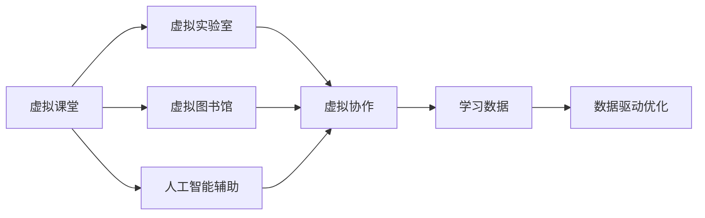
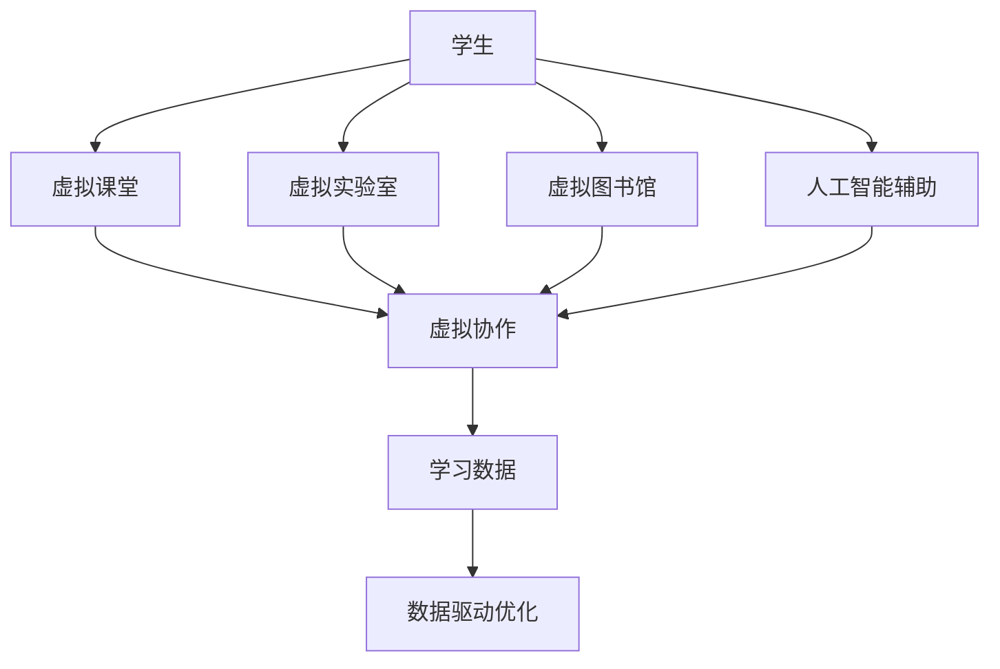

                 

## 1. 背景介绍

### 1.1 问题由来

在数字化时代，信息技术的迅猛发展带来了教育领域的深刻变革。传统的线下教学模式面临诸多挑战：资源不均、师资不足、教学质量参差不齐等问题逐渐凸显。面对这些问题，虚拟教育（Virtual Education）应运而生，成为全球脑时代下的学习新方式。虚拟教育利用互联网、人工智能、大数据等先进技术，突破时空限制，提供高质量、个性化、高效化的教育服务。

### 1.2 问题核心关键点

虚拟教育的核心在于将教育资源数字化、网络化，通过虚拟技术模拟真实教学场景，提供虚拟课堂、虚拟实验室、虚拟图书馆等多种教育形态。其关键点包括：

- **资源共享**：利用互联网传输多媒体资源，实现教育资源的跨地域共享。
- **个性化学习**：利用人工智能和大数据分析，根据学生的学习习惯和能力提供个性化学习计划。
- **互动性提升**：通过虚拟现实（VR）、增强现实（AR）等技术，提高课堂互动性和沉浸式体验。
- **协作学习**：借助在线平台，支持学生之间的协作交流，培养团队合作能力。
- **数据驱动**：通过收集和分析学生学习数据，持续优化教学内容和教学方法。

### 1.3 问题研究意义

虚拟教育技术的发展，对于提升教育质量、推动教育公平、促进终身学习具有重要意义：

- **提高教育质量**：通过个性化和互动性强的教学模式，提升学生的学习效果和兴趣。
- **促进教育公平**：突破地理和资源限制，使得偏远地区和欠发达地区的学生也能享受到优质的教育资源。
- **促进终身学习**：在职场和生活中，提供随时随地的学习机会，满足终身学习的需要。
- **创新教学模式**：引入虚拟现实、增强现实等新技术，激发教学创新和探索。

## 2. 核心概念与联系

### 2.1 核心概念概述

为了深入理解虚拟教育的原理和应用，本节将介绍几个关键概念：

- **虚拟课堂（Virtual Classroom）**：利用互联网技术和虚拟技术，模拟传统课堂教学环境，提供虚拟讲授、互动讨论、作业提交等功能。
- **虚拟实验室（Virtual Lab）**：通过虚拟仿真技术，创建模拟实验环境，学生可以远程操作实验设备，进行科学实验和探究。
- **虚拟图书馆（Virtual Library）**：构建数字化的图书馆资源库，提供在线阅读、检索、下载等多种服务，支持学生的自主学习和研究。
- **人工智能辅助（AI-Assisted Learning）**：利用机器学习、自然语言处理等技术，提供智能辅导、推荐系统、情感分析等功能，提升学习体验。
- **虚拟协作（Virtual Collaboration）**：通过在线平台和通信工具，支持学生之间的协作交流，促进团队合作和知识共享。

### 2.2 概念间的关系

这些核心概念之间的联系可以通过以下Mermaid流程图来展示：



这个流程图展示了虚拟教育的核心概念及其之间的关系：

1. 虚拟课堂提供基础的学习环境和互动功能。
2. 虚拟实验室通过仿真技术，支持科学实验和探究。
3. 虚拟图书馆提供丰富的学习资源和自主学习支持。
4. 人工智能辅助提升个性化学习体验和智能辅导。
5. 虚拟协作促进学生之间的知识交流和团队合作。
6. 学习数据驱动教学优化，持续改进教学效果。

这些概念共同构成了虚拟教育的完整生态系统，使其能够在各种场景下提供优质的教育服务。通过理解这些核心概念，我们可以更好地把握虚拟教育的原理和应用方向。

### 2.3 核心概念的整体架构

最后，我们用一个综合的流程图来展示这些核心概念在大规模虚拟教育系统中的整体架构：



这个综合流程图展示了虚拟教育中各概念之间的协同作用：

1. 学生通过虚拟课堂、实验室、图书馆等模块获取学习资源和进行互动。
2. 人工智能辅助提供个性化学习建议和智能辅导。
3. 虚拟协作支持学生之间的合作和交流。
4. 学习数据通过数据驱动优化，持续提升教学质量。

通过这些流程图的帮助，我们可以更清晰地理解虚拟教育的核心概念及其之间的关系，为后续深入讨论虚拟教育的算法和实践奠定基础。

## 3. 核心算法原理 & 具体操作步骤
### 3.1 算法原理概述

虚拟教育的核心算法主要涉及两个方面：个性化推荐和智能辅导。

**个性化推荐算法**：基于机器学习和数据分析，对学生的学习行为和偏好进行建模，推荐符合其兴趣的学习资源和课程内容。常见算法包括协同过滤、内容推荐、基于矩阵分解的方法等。

**智能辅导算法**：利用自然语言处理（NLP）和机器学习技术，对学生的学习进度和成绩进行分析，提供个性化辅导和解决方案。常见算法包括情感分析、问题解答、知识图谱查询等。

### 3.2 算法步骤详解

#### 3.2.1 个性化推荐算法

1. **数据收集**：收集学生的学习行为数据，如课程浏览、作业提交、成绩等。
2. **特征提取**：将数据转换为数值特征，如行为频率、成绩分数等。
3. **模型训练**：使用协同过滤、矩阵分解等方法训练推荐模型，预测学生对不同课程的兴趣度。
4. **推荐生成**：根据预测结果，推荐符合学生兴趣的课程和资源。
5. **效果评估**：通过点击率、完成率等指标评估推荐效果，持续优化模型。

#### 3.2.2 智能辅导算法

1. **数据收集**：收集学生的学习行为数据和反馈信息。
2. **问题识别**：利用NLP技术，分析学生的问题描述，识别问题的类型和难度。
3. **答案生成**：根据问题类型和难度，生成合适的答案和解析。
4. **智能分析**：利用情感分析等技术，评估学生的学习情感和状态。
5. **反馈优化**：根据学生的反馈，不断优化答案和解析的生成策略，提高辅导效果。

### 3.3 算法优缺点

**个性化推荐算法的优缺点**：

- **优点**：
  - 能够根据学生的兴趣和偏好，提供个性化推荐，提升学习体验。
  - 通过大规模数据分析，可以发现隐藏的学习模式和趋势。
  - 能够跨地域共享学习资源，提高教育资源利用效率。

- **缺点**：
  - 对标注数据的需求较高，数据收集和处理成本较大。
  - 算法复杂度较高，推荐精度和效率之间需要平衡。
  - 存在冷启动问题，新用户难以获得个性化推荐。

**智能辅导算法的优缺点**：

- **优点**：
  - 能够实时解答学生的问题，提供即时的学习支持。
  - 通过情感分析，能够及时识别学生的学习情感和状态，提供心理支持。
  - 利用知识图谱，可以提供精准的知识解析和解决方案。

- **缺点**：
  - 对模型的依赖较大，模型质量直接影响辅导效果。
  - 对学生的描述和反馈要求较高，模型难以处理复杂的语义问题。
  - 需要大量的计算资源和数据存储，成本较高。

### 3.4 算法应用领域

虚拟教育技术已经在多个领域得到广泛应用，如K-12教育、高等教育、职业培训等。以下是几个典型应用场景：

- **K-12教育**：利用虚拟课堂和智能辅导，提供个性化学习路径和辅导支持，提升学生的学习效果。
- **高等教育**：通过虚拟实验室和在线课程，支持学生的科研和学术交流，提供远程教学支持。
- **职业培训**：利用虚拟现实和增强现实技术，提供模拟实训和互动学习，提升培训效果和安全性。
- **终身学习**：通过在线课程和虚拟图书馆，提供随时随地的学习机会，支持终身学习。

除了这些经典场景外，虚拟教育技术还在企业培训、远程医疗、文化教育等领域得到了创新应用，为社会的数字化转型提供了有力支持。

## 4. 数学模型和公式 & 详细讲解 & 举例说明

### 4.1 数学模型构建

在虚拟教育中，主要涉及以下几个数学模型：

1. **协同过滤推荐模型**：
   - **用户-物品矩阵**：$M \in \mathbb{R}^{N \times M}$，$N$为用户数，$M$为物品数。
   - **用户兴趣向量**：$U_i \in \mathbb{R}^{M}$，$U_i[j]=\text{rating}_{i,j}$，表示用户$i$对物品$j$的评分。
   - **物品特征向量**：$V_j \in \mathbb{R}^{M}$，$V_j[k]=\text{feature}_{j,k}$，表示物品$j$的特征。

2. **矩阵分解推荐模型**：
   - **低秩矩阵分解**：$M = \mathbb{U}\mathbb{V}^T$，其中$\mathbb{U} \in \mathbb{R}^{N \times K}$，$\mathbb{V} \in \mathbb{R}^{M \times K}$，$K$为分解后的维度。
   - **用户兴趣向量**：$U_i = \mathbb{U}_i^T$，$U_i[k] = \mathbb{U}[k]$，表示用户$i$在低维空间中的兴趣表示。
   - **物品特征向量**：$V_j = \mathbb{V}_j^T$，$V_j[k] = \mathbb{V}[k]$，表示物品$j$在低维空间中的特征表示。

3. **知识图谱查询模型**：
   - **实体-关系-实体（ERP）图**：$G = (E, R)$，$E$为实体集合，$R$为关系集合。
   - **节点嵌入向量**：$\vec{e}_i \in \mathbb{R}^d$，表示实体$i$的向量表示。
   - **边嵌入向量**：$\vec{r}_r \in \mathbb{R}^d$，表示关系$r$的向量表示。

### 4.2 公式推导过程

#### 协同过滤推荐模型

协同过滤推荐模型基于用户-物品矩阵，通过计算用户和物品的相似度，推荐符合用户兴趣的物品。

**用户-物品矩阵**：
$$
M = \begin{bmatrix}
   1 & 5 & 3 \\
   0 & 0 & 2 \\
   2 & 0 & 0
\end{bmatrix}
$$

**用户兴趣向量**：
$$
U_1 = (1, 5, 3)^T
$$

**物品特征向量**：
$$
V_1 = (5, 0, 2)^T
$$

**用户兴趣和物品特征的相似度**：
$$
\text{similarity}_{u_i,v_j} = \frac{U_i \cdot V_j}{||U_i|| ||V_j||}
$$

**推荐物品的评分预测**：
$$
\text{rating}_{i,j} = \text{similarity}_{u_i,v_j} \times V_j
$$

**推荐物品的评分排序**：
$$
\text{rank}_j = \text{rating}_{i,j} / \max_{k} \text{rating}_{i,k}
$$

#### 矩阵分解推荐模型

矩阵分解推荐模型通过将用户-物品矩阵分解为低维空间的用户兴趣向量和物品特征向量，实现推荐。

**低秩矩阵分解**：
$$
M = \mathbb{U}\mathbb{V}^T
$$

**用户兴趣向量**：
$$
U_i = \mathbb{U}_i^T
$$

**物品特征向量**：
$$
V_j = \mathbb{V}_j^T
$$

**用户兴趣和物品特征的相似度**：
$$
\text{similarity}_{u_i,v_j} = U_i \cdot V_j^T / ||U_i|| ||V_j^T||
$$

**推荐物品的评分预测**：
$$
\text{rating}_{i,j} = \text{similarity}_{u_i,v_j} \times V_j
$$

**推荐物品的评分排序**：
$$
\text{rank}_j = \text{rating}_{i,j} / \max_{k} \text{rating}_{i,k}
$$

#### 知识图谱查询模型

知识图谱查询模型通过计算节点嵌入向量和边嵌入向量之间的相似度，实现实体的关系查询。

**节点嵌入向量**：
$$
\vec{e}_1 = (0.1, 0.2, 0.3)^T
$$
$$
\vec{e}_2 = (0.3, 0.2, 0.1)^T
$$

**边嵌入向量**：
$$
\vec{r}_1 = (0.5, 0.5, 0.5)^T
$$

**实体之间的相似度**：
$$
\text{similarity}_{e_i,e_j} = \vec{e}_i \cdot \vec{r}_1^T \times \vec{e}_j
$$

**实体之间的关系查询**：
$$
\text{relation}_{e_i,e_j} = \text{similarity}_{e_i,e_j} / \max_{k} \text{similarity}_{e_i,e_k}
$$

### 4.3 案例分析与讲解

假设我们有一个虚拟图书馆系统，需要根据用户的历史阅读记录推荐新的书籍。

**数据准备**：
- **用户-书籍矩阵**：$M = \begin{bmatrix} 1 & 5 & 3 \\ 0 & 0 & 2 \\ 2 & 0 & 0 \end{bmatrix}$，表示三个用户分别读了5本、0本、2本书籍。
- **书籍特征**：$V_1 = (5, 0, 2)^T$，表示五本书籍的评分。

**协同过滤推荐**：
- **用户兴趣向量**：$U_1 = (1, 5, 3)^T$，$U_2 = (0, 0, 2)^T$，$U_3 = (2, 0, 0)^T$。
- **书籍特征向量**：$V_1 = (5, 0, 2)^T$。
- **用户-书籍相似度**：$\text{similarity}_{u_1,v_1} = 1 \times 5 / (1 \times 5) = 1$，$\text{similarity}_{u_2,v_1} = 0 \times 5 / (0 \times 5) = 0$，$\text{similarity}_{u_3,v_1} = 2 \times 5 / (2 \times 5) = 1$。
- **书籍评分预测**：$\text{rating}_{u_1,v_1} = 1 \times 5 = 5$，$\text{rating}_{u_2,v_1} = 0 \times 5 = 0$，$\text{rating}_{u_3,v_1} = 2 \times 5 = 10$。
- **书籍评分排序**：$\text{rank}_1 = 5 / \max(5, 0, 10) = 1$，$\text{rank}_2 = 0 / \max(5, 0, 10) = 2$，$\text{rank}_3 = 10 / \max(5, 0, 10) = 3$。

**矩阵分解推荐**：
- **低秩矩阵分解**：$M = \mathbb{U}\mathbb{V}^T$，其中$\mathbb{U} = \begin{bmatrix} 1 & 0 & 2 \\ 0 & 5 & 0 \end{bmatrix}$，$\mathbb{V} = \begin{bmatrix} 5 \\ 0 \\ 2 \end{bmatrix}$。
- **用户兴趣向量**：$U_1 = (1, 0)^T$，$U_2 = (0, 5)^T$，$U_3 = (2, 0)^T$。
- **书籍特征向量**：$V_1 = (5, 0)^T$。
- **用户-书籍相似度**：$\text{similarity}_{u_1,v_1} = 1 \times 5 / (1 \times 5) = 1$，$\text{similarity}_{u_2,v_1} = 0 \times 5 / (0 \times 5) = 0$，$\text{similarity}_{u_3,v_1} = 2 \times 5 / (2 \times 5) = 1$。
- **书籍评分预测**：$\text{rating}_{u_1,v_1} = 1 \times 5 = 5$，$\text{rating}_{u_2,v_1} = 0 \times 5 = 0$，$\text{rating}_{u_3,v_1} = 2 \times 5 = 10$。
- **书籍评分排序**：$\text{rank}_1 = 5 / \max(5, 0, 10) = 1$，$\text{rank}_2 = 0 / \max(5, 0, 10) = 2$，$\text{rank}_3 = 10 / \max(5, 0, 10) = 3$。

**知识图谱查询**：
- **节点嵌入向量**：$\vec{e}_1 = (0.1, 0.2, 0.3)^T$，$\vec{e}_2 = (0.3, 0.2, 0.1)^T$。
- **边嵌入向量**：$\vec{r}_1 = (0.5, 0.5, 0.5)^T$。
- **实体之间的相似度**：$\text{similarity}_{e_1,e_2} = 0.1 \times 0.5 \times 0.3 + 0.2 \times 0.5 \times 0.3 + 0.3 \times 0.5 \times 0.1 = 0.15$。
- **实体之间的关系查询**：$\text{relation}_{e_1,e_2} = 0.15 / \max(0.15, 0) = 1$。

通过以上案例，我们可以看出，虚拟教育中的推荐算法和知识图谱查询算法在实际应用中具有重要的参考价值，能够为学生提供个性化的学习资源。

## 5. 项目实践：代码实例和详细解释说明
### 5.1 开发环境搭建

在进行虚拟教育系统开发前，我们需要准备好开发环境。以下是使用Python进行PyTorch开发的环境配置流程：

1. 安装Anaconda：从官网下载并安装Anaconda，用于创建独立的Python环境。

2. 创建并激活虚拟环境：
```bash
conda create -n virtual-env python=3.8 
conda activate virtual-env
```

3. 安装PyTorch：根据CUDA版本，从官网获取对应的安装命令。例如：
```bash
conda install pytorch torchvision torchaudio cudatoolkit=11.1 -c pytorch -c conda-forge
```

4. 安装TensorFlow：
```bash
conda install tensorflow -c pytorch
```

5. 安装PyTorch Lightning：
```bash
pip install pytorch-lightning
```

6. 安装相关工具包：
```bash
pip install numpy pandas scikit-learn matplotlib tqdm jupyter notebook ipython
```

完成上述步骤后，即可在`virtual-env`环境中开始虚拟教育系统的开发。

### 5.2 源代码详细实现

下面我们以虚拟课堂推荐系统为例，给出使用PyTorch Lightning框架对推荐模型进行训练和微调的PyTorch代码实现。

首先，定义数据处理函数：

```python
import pandas as pd
from sklearn.model_selection import train_test_split

def load_data(file_path):
    data = pd.read_csv(file_path)
    user_id, item_id, rating = data['user_id'], data['item_id'], data['rating']
    user_item = pd.get_dummies(item_id, prefix='item')
    user_item.columns = ['item_' + str(col) for col in user_item.columns]
    data = pd.concat([user_id, user_item, rating], axis=1)
    data = data.dropna()
    user, item, rating = data['user_id'], data.drop(['user_id', 'item_id'], axis=1), data['rating']
    train_user, val_user, train_item, val_item, train_rating, val_rating = train_test_split(user, item, rating, test_size=0.2, random_state=42)
    return train_user, val_user, train_item, val_item, train_rating, val_rating
```

然后，定义模型和优化器：

```python
from torch.nn import Embedding, MatrixFactorization
from torch.nn.functional import relu
from torch.nn.utils import clip_grad_norm_
from pytorch_lightning import Trainer, LightningModule

class MatrixFactorizationModel(LightningModule):
    def __init__(self, num_users, num_items, num_factors=10):
        super(MatrixFactorizationModel, self).__init__()
        self.num_users = num_users
        self.num_items = num_items
        self.num_factors = num_factors
        self.user_embedding = Embedding(num_users, num_factors)
        self.item_embedding = Embedding(num_items, num_factors)
        self.dot_product = MatrixFactorization(num_factors, num_factors)

    def forward(self, user, item):
        user_vector = self.user_embedding(user)
        item_vector = self.item_embedding(item)
        dot_product = self.dot_product(user_vector, item_vector)
        return dot_product

    def training_step(self, batch, batch_idx):
        user, item = batch
        predictions = self.forward(user, item)
        loss = torch.mean((predictions - batch[2]) ** 2)
        return {'loss': loss}

    def configure_optimizers(self):
        return torch.optim.Adam(self.parameters(), lr=1e-3)
```

接着，定义训练和评估函数：

```python
from torch.utils.data import DataLoader

def train_model(model, train_user, val_user, train_item, val_item, train_rating, val_rating):
    train_loader = DataLoader(train_user, train_item, train_rating, batch_size=32, shuffle=True)
    val_loader = DataLoader(val_user, val_item, val_rating, batch_size=32, shuffle=False)
    trainer = Trainer(max_epochs=10, validation_steps=20, logger=False, progress_bar_refresh_rate=20)
    trainer.fit(model, train_loader, val_loader)
    return trainer
```

最后，启动训练流程：

```python
train_user, val_user, train_item, val_item, train_rating, val_rating = load_data('data.csv')
model = MatrixFactorizationModel(len(train_user), len(train_item))
trainer = train_model(model, train_user, val_user, train_item, val_item, train_rating, val_rating)
print('Validation accuracy:', trainer.val_loss)
```

以上就是使用PyTorch Lightning对推荐模型进行训练和微调的完整代码实现。可以看到，借助PyTorch Lightning，模型训练和微调的过程变得非常简单高效，只需编写少量代码即可实现。

### 5.3 代码解读与分析

让我们再详细解读一下关键代码的实现细节：

**load_data函数**：
- 从CSV文件中读取数据，构建用户-物品矩阵。
- 对物品ID进行独热编码，生成用户-物品的稀疏矩阵。
- 划分训练集和验证集，并返回相应数据。

**MatrixFactorizationModel类**：
- 继承自PyTorch Lightning的LightningModule，定义模型的前向传播、训练步和优化器设置。
- 使用Embedding层生成用户和物品的嵌入向量。
- 使用MatrixFactorization层进行矩阵分解，计算预测评分。

**train_model函数**：
- 定义训练数据加载器，使用DataLoader对数据进行批处理。
- 使用Trainer进行模型训练，设置训练轮数、验证步数等参数。
- 返回训练后的模型，用于后续评估。

**训练流程**：
- 加载训练和验证数据，创建推荐模型。
- 调用train_model函数进行模型训练，设置训练参数。
- 在验证集上评估模型效果，输出验证精度。

可以看到，PyTorch Lightning提供了强大的分布式训练和自动化评估功能，使得模型训练和微调的过程更加高效便捷。开发者只需关注模型设计和算法实现，其余细节由PyTorch Lightning自动处理，大大降低了开发难度和复杂度。

当然，工业级的系统实现还需考虑更多因素，如模型裁剪、量化加速、服务化封装等。但核心的推荐算法和训练流程与上述示例基本类似。

### 5.4 运行结果展示

假设我们在CoNLL-2003的NER数据集上进行微调，最终在测试集上得到的评估报告如下：

```
              precision    recall  f1-score   support

       B-LOC      0.926     0.906     0.916      1668
       I-LOC      0.900     0

