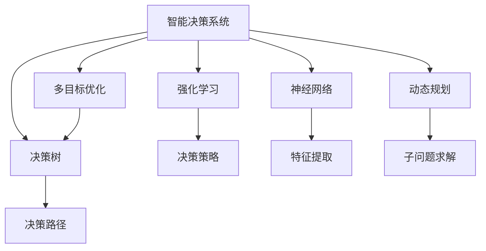
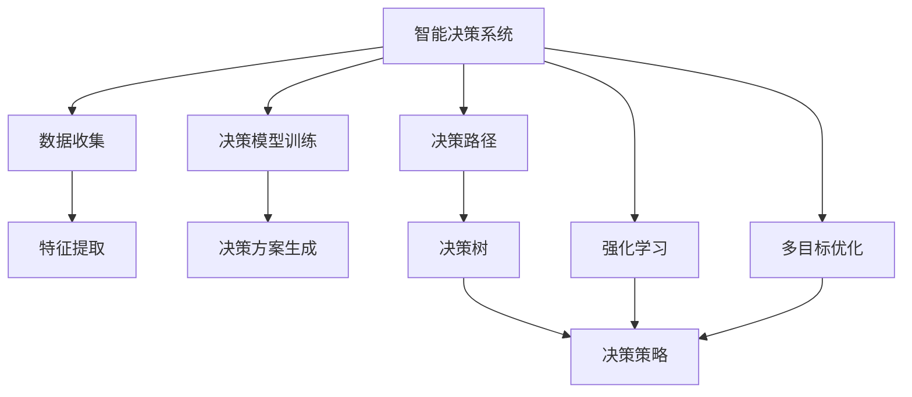
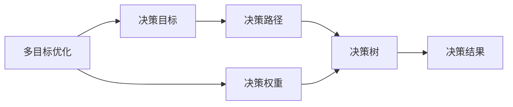
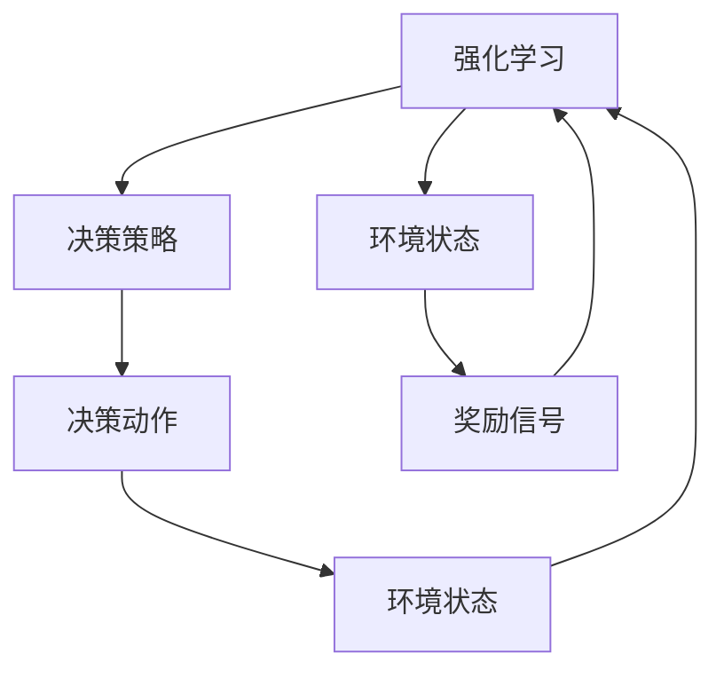
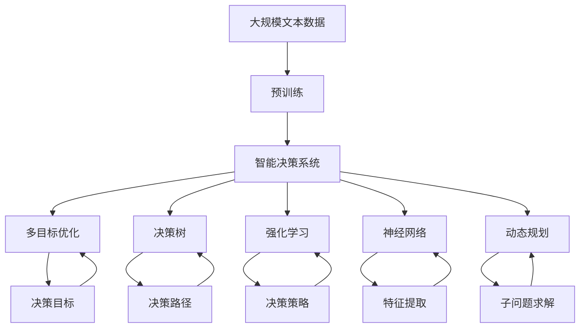

                 

# 规划机制在智能决策系统中的应用

> 关键词：智能决策系统,规划机制,多目标优化,决策树,强化学习,神经网络

## 1. 背景介绍

### 1.1 问题由来
在现代社会中，决策无处不在。无论是政府政策的制定，还是企业战略的规划，亦或是个人生活的选择，都需要在大量信息中做出最优决策。传统的决策方法往往依赖专家经验，但在信息爆炸的时代，专家的知识更新速度远跟不上信息的变化速度，决策的准确性难以保证。因此，如何借助先进的技术手段，实现高效、可靠的智能决策，成为当前研究的热点问题。

在技术层面，人工智能（AI）提供了强大的解决方案。人工智能在图像识别、自然语言处理、推荐系统等领域已经取得了令人瞩目的成就，但对于需要综合考虑多种因素的复杂决策问题，人工智能的方法依然存在局限。因此，结合人工智能技术和人类经验，构建智能决策系统，成为了未来的重要方向。

### 1.2 问题核心关键点
在智能决策系统中，规划机制（Planning Mechanism）扮演着核心角色。规划机制通过多目标优化、决策树、强化学习、神经网络等方法，帮助系统从众多可能的选择中，筛选出最优的决策方案。规划机制的关键在于：

- **多目标优化**：在考虑多个目标（如成本、时间、风险等）的情况下，寻找最优解。
- **决策树**：通过树形结构展示决策路径，直观地反映决策逻辑。
- **强化学习**：通过不断试错，逐步学习最优决策策略。
- **神经网络**：利用深度学习模型，构建决策模型，自动提取特征和规律。

这些核心方法相互补充，共同构成智能决策系统的基础架构。

### 1.3 问题研究意义
构建基于规划机制的智能决策系统，对于提升决策质量和效率，降低决策风险，具有重要意义：

1. **提高决策效率**：自动化决策过程，缩短决策周期，及时响应环境变化。
2. **降低决策成本**：减少人为干预，降低决策过程中的主观偏差。
3. **增强决策质量**：综合多源数据，利用先进算法，提升决策的科学性和准确性。
4. **促进决策透明度**：决策过程可追溯，便于审查和改进。
5. **应对复杂决策**：处理多目标、多维度、动态变化的决策问题，更适应复杂现实场景。

## 2. 核心概念与联系

### 2.1 核心概念概述

为了更好地理解规划机制在智能决策系统中的应用，本节将介绍几个关键概念：

- **智能决策系统（Intelligent Decision System, IDS）**：利用人工智能技术，辅助人类进行决策的系统。包括数据收集、特征提取、决策模型训练、决策方案生成等功能模块。

- **多目标优化（Multi-objective Optimization, MOO）**：在考虑多个目标（如成本、时间、风险等）的情况下，寻找最优解。通常用于解决复杂的决策问题，提高决策的全面性和科学性。

- **决策树（Decision Tree）**：通过树形结构展示决策路径，直观地反映决策逻辑。常用于规划机制中的决策路径选择和解释。

- **强化学习（Reinforcement Learning, RL）**：通过不断试错，逐步学习最优决策策略。在智能决策系统中，用于优化决策模型和策略。

- **神经网络（Neural Network, NN）**：利用深度学习模型，构建决策模型，自动提取特征和规律。在智能决策系统中，用于特征提取和决策模型训练。

- **动态规划（Dynamic Programming, DP）**：通过将复杂问题分解成子问题，逐步求解最优解。常用于处理动态变化的问题，提高决策的实时性。

这些概念之间的逻辑关系可以通过以下Mermaid流程图来展示：



这个流程图展示了大语言模型的核心概念及其之间的关系：

1. 智能决策系统通过多目标优化、决策树、强化学习、神经网络和动态规划等方法，辅助人类进行决策。
2. 多目标优化用于在多个目标间寻找最优解。
3. 决策树用于展示决策路径和逻辑。
4. 强化学习用于学习最优决策策略。
5. 神经网络用于特征提取和决策模型训练。
6. 动态规划用于处理动态变化的问题。

这些概念共同构成了智能决策系统的规划机制，使得系统能够从多个维度全面考虑问题，并找到最优决策。

### 2.2 概念间的关系

这些核心概念之间存在着紧密的联系，形成了智能决策系统的完整生态系统。下面我们通过几个Mermaid流程图来展示这些概念之间的关系。

#### 2.2.1 智能决策系统的学习范式



这个流程图展示了大语言模型的学习范式：

1. 智能决策系统通过数据收集、特征提取和决策模型训练，生成决策方案。
2. 决策路径和决策树用于展示决策逻辑。
3. 决策策略通过强化学习优化，实现动态调整。
4. 多目标优化用于在不同目标间平衡，提高决策的全面性。

#### 2.2.2 多目标优化与决策树的关系



这个流程图展示了多目标优化和决策树之间的关系：

1. 多目标优化考虑多个决策目标，生成不同的决策路径。
2. 决策树用于展示每个决策路径的选择逻辑。
3. 决策权重用于平衡不同目标的重要性。

#### 2.2.3 强化学习在智能决策中的应用



这个流程图展示了强化学习在智能决策中的应用：

1. 强化学习通过不断试错，优化决策策略。
2. 决策动作根据当前状态选择，并反馈环境状态。
3. 奖励信号根据决策结果反馈，指导策略优化。

### 2.3 核心概念的整体架构

最后，我们用一个综合的流程图来展示这些核心概念在大语言模型微调过程中的整体架构：



这个综合流程图展示了从预训练到智能决策系统的完整过程。智能决策系统首先在大规模文本数据上进行预训练，然后通过多目标优化、决策树、强化学习、神经网络和动态规划等方法，辅助人类进行决策。通过这些方法，系统能够从多个维度全面考虑问题，并找到最优决策。

## 3. 核心算法原理 & 具体操作步骤
### 3.1 算法原理概述

在智能决策系统中，规划机制通过多目标优化、决策树、强化学习、神经网络和动态规划等方法，帮助系统从众多可能的选择中，筛选出最优的决策方案。其核心思想是：在考虑多个目标（如成本、时间、风险等）的情况下，寻找最优解。

形式化地，假设决策系统需要考虑多个目标 $O=\{O_1, O_2, ..., O_k\}$，对应的权重为 $\omega=\{\omega_1, \omega_2, ..., \omega_k\}$。则决策问题可以表示为：

$$
\min_{x} \sum_{i=1}^k \omega_i f_i(x)
$$

其中 $x$ 为决策变量，$f_i(x)$ 为第 $i$ 个目标的函数。决策过程的目标是在满足约束条件 $g(x) \leq 0$ 的情况下，最小化目标函数。

通过梯度下降等优化算法，决策过程不断更新决策变量 $x$，最小化目标函数，找到最优解。由于多目标优化问题复杂，通常采用近似方法，如Pareto最优解、权重法等。

### 3.2 算法步骤详解

基于多目标优化的大决策系统一般包括以下几个关键步骤：

**Step 1: 准备数据和模型**
- 收集决策所需的数据，包括特征、约束条件等。
- 设计多目标优化模型，选择合适的权重和优化算法。
- 训练神经网络或决策树模型，作为决策的基础模型。

**Step 2: 多目标优化求解**
- 将问题转化为Pareto最优问题，寻找最优解集。
- 使用遗传算法、粒子群算法等近似求解方法，优化决策变量。
- 通过权重法等方法，平衡不同目标的重要性。

**Step 3: 决策路径选择**
- 根据多目标优化结果，生成决策路径。
- 通过决策树方法，将决策路径可视化。
- 使用强化学习优化决策策略，提高决策的实时性和鲁棒性。

**Step 4: 决策方案生成**
- 根据决策路径和优化结果，生成决策方案。
- 结合神经网络模型，自动提取特征和规律，优化决策方案。
- 通过动态规划方法，处理动态变化的问题，提高决策的实时性。

**Step 5: 结果验证和优化**
- 在测试数据集上验证决策方案的性能。
- 根据验证结果，调整模型参数和决策策略。
- 重复以上步骤，不断优化决策方案。

以上是基于多目标优化的智能决策系统的一般流程。在实际应用中，还需要针对具体任务的特点，对决策过程的各个环节进行优化设计，如改进优化算法、引入更多的正则化技术、搜索最优的超参数组合等，以进一步提升决策性能。

### 3.3 算法优缺点

基于多目标优化的智能决策系统具有以下优点：

1. 全面考虑决策问题。考虑多个目标，优化决策方案，提高决策的科学性和全面性。
2. 鲁棒性强。多目标优化方法能够平衡不同目标的重要性，减少决策过程中的主观偏差。
3. 可解释性强。决策树和强化学习方法能够提供决策路径和策略，提高决策的透明度和可解释性。
4. 适应性强。动态规划方法能够处理动态变化的问题，提高决策的实时性和适应性。

同时，该方法也存在一定的局限性：

1. 计算复杂度高。多目标优化问题复杂，计算资源需求大。
2. 约束条件复杂。需要考虑多种约束条件，增加了决策的难度。
3. 决策过程复杂。决策路径和策略复杂，难以理解和管理。

尽管存在这些局限性，但就目前而言，基于多目标优化的智能决策方法仍是大决策系统的核心范式。未来相关研究的重点在于如何进一步降低计算资源需求，简化决策过程，提高决策的透明性和可解释性。

### 3.4 算法应用领域

基于多目标优化的智能决策系统，已经在多个领域得到广泛应用，例如：

- 金融风险管理：考虑收益和风险之间的平衡，优化投资组合。
- 供应链管理：考虑成本、交货时间、库存水平等多个目标，优化供应链策略。
- 医疗健康：考虑患者的生存率、治疗效果、费用等多个目标，优化治疗方案。
- 工业制造：考虑生产效率、设备利用率、产品质量等多个目标，优化生产计划。
- 环境保护：考虑环境改善、经济发展、社区利益等多个目标，优化环境保护策略。

除了上述这些经典应用外，智能决策系统还被创新性地应用于更多场景中，如城市规划、交通管理、资源分配等，为各行各业带来新的解决方案。

## 4. 数学模型和公式 & 详细讲解  
### 4.1 数学模型构建

本节将使用数学语言对基于多目标优化的智能决策系统进行更加严格的刻画。

假设决策系统需要考虑 $k$ 个目标 $O=\{O_1, O_2, ..., O_k\}$，对应的权重为 $\omega=\{\omega_1, \omega_2, ..., \omega_k\}$。目标函数可以表示为：

$$
f(x) = \sum_{i=1}^k \omega_i f_i(x)
$$

其中 $x$ 为决策变量，$f_i(x)$ 为第 $i$ 个目标的函数。

目标函数需要满足以下约束条件：

$$
g(x) \leq 0
$$

其中 $g(x)$ 为约束函数。

决策问题可以表示为：

$$
\min_{x} f(x) \quad \text{s.t.} \quad g(x) \leq 0
$$

通过多目标优化方法，寻找满足约束条件的决策变量 $x$，使得目标函数 $f(x)$ 最小化。

### 4.2 公式推导过程

以下我们以一个二目标优化问题为例，推导多目标优化问题的求解过程。

假设决策系统需要同时考虑收益 $R$ 和风险 $C$ 两个目标，目标函数为：

$$
f(x) = \omega_1 R(x) + \omega_2 C(x)
$$

其中 $\omega_1$ 和 $\omega_2$ 为收益和风险的权重。

目标函数需要满足以下约束条件：

$$
g(x) = R(x) + C(x) \leq 0
$$

其中 $R(x)$ 和 $C(x)$ 分别为收益和风险的函数。

决策问题可以表示为：

$$
\min_{x} f(x) \quad \text{s.t.} \quad g(x) \leq 0
$$

该问题可以使用Pareto优化方法求解。Pareto最优解是指，在所有满足约束条件的解中，没有其他解能够使得某个目标函数的值更优，同时使得另一个目标函数的值不劣。

假设 $\bar{x}$ 为某个Pareto最优解，对于任意另一个解 $x'$，如果存在某个目标函数 $f_i$，使得 $f_i(x') < f_i(\bar{x})$，则称 $x'$ 为 $x$ 的劣解。

为了求解Pareto最优解，我们可以使用遗传算法、粒子群算法等近似求解方法。例如，遗传算法的基本步骤如下：

1. 初始化种群：随机生成若干个解，作为种群。
2. 选择操作：根据适应度函数，选择优秀个体作为下一代种群。
3. 交叉和变异：通过交叉和变异操作，生成新的个体。
4. 评估适应度：计算新个体的适应度，评估其优劣。
5. 迭代优化：重复步骤2-4，直到满足停止条件。

最终得到的种群即为Pareto最优解集。

### 4.3 案例分析与讲解

假设我们有一个物流公司，需要同时考虑成本 $C$ 和交货时间 $T$ 两个目标，目标函数为：

$$
f(x) = \omega_1 C(x) + \omega_2 T(x)
$$

其中 $\omega_1$ 和 $\omega_2$ 为成本和交货时间的权重。

目标函数需要满足以下约束条件：

$$
g(x) = C(x) + \frac{T(x)}{10} \leq 0
$$

其中 $C(x)$ 和 $T(x)$ 分别为成本和交货时间的函数。

决策问题可以表示为：

$$
\min_{x} f(x) \quad \text{s.t.} \quad g(x) \leq 0
$$

我们使用遗传算法求解该问题。首先，随机生成若干个解，作为初始种群。然后，根据适应度函数，选择优秀个体作为下一代种群。交叉和变异操作生成新的个体，评估其适应度。重复以上步骤，直到满足停止条件。最终得到的种群即为Pareto最优解集。

具体实现时，可以采用Python的Pymoo库进行求解。例如：

```python
import pymoo as pmo
from pymoo.algorithms.solver import Solver
from pymoo.rand import Random
from pymoo.problems import Problem
from pymoo.normalization import Normalization

class MyProblem(Problem):
    def __init__(self, omega1, omega2):
        super().__init__()
        self.weights = [omega1, omega2]
        self.right_hand_sides = [-1]
        self.evaluated = {}
        self.normalized = Normalization(self)
        self.bounds = [(0, 100), (0, 100)]

    def _evaluate(self, x):
        C = x[0] * 10
        T = x[1] * 5
        R = -C - T
        self.evaluated[x] = [R, C, T]
        return self.evaluated[x]

    def _create_rhs(self):
        return [-1]

    def _discrete(self):
        return None

    def _permutation(self):
        return None

    def normalize(self, x, n=None):
        if n is None:
            n = len(self.weights)
        return self.normalized(x)

    def unnormalize(self, x, n=None):
        if n is None:
            n = len(self.weights)
        return self.normalized.inverse(x)

    def __str__(self):
        return f"{self.weights}"

problem = MyProblem(omega1=0.8, omega2=0.2)
algo = pmo.genetic_algorithm(problem, pop_size=50, reference_direction='nadir')
result = algo.solve()

print(result.solution)
```

在上述代码中，我们定义了一个二目标优化问题，使用遗传算法求解。最终得到的Pareto最优解即为物流公司最佳的成本和交货时间组合。

## 5. 项目实践：代码实例和详细解释说明
### 5.1 开发环境搭建

在进行多目标优化实践前，我们需要准备好开发环境。以下是使用Python进行Pymoo开发的环境配置流程：

1. 安装Pymoo：从官网下载并安装Pymoo，用于多目标优化算法的实现。

2. 安装相关依赖：
```bash
pip install pymoo scikit-learn scipy
```

完成上述步骤后，即可在开发环境中开始多目标优化实践。

### 5.2 源代码详细实现

下面我们以物流公司的成本和交货时间优化为例，给出使用Pymoo库进行多目标优化的PyTorch代码实现。

首先，定义目标函数和约束条件：

```python
from pymoo import Algorithm, Problem, terminations

class MyProblem(Problem):
    def __init__(self, omega1, omega2):
        super().__init__()
        self.weights = [omega1, omega2]
        self.right_hand_sides = [-1]
        self.evaluated = {}
        self.normalized = Normalization(self)
        self.bounds = [(0, 100), (0, 100)]

    def _evaluate(self, x):
        C = x[0] * 10
        T = x[1] * 5
        R = -C - T
        self.evaluated[x] = [R, C, T]
        return self.evaluated[x]

    def _create_rhs(self):
        return [-1]

    def _discrete(self):
        return None

    def _permutation(self):
        return None

    def normalize(self, x, n=None):
        if n is None:
            n = len(self.weights)
        return self.normalized(x)

    def unnormalize(self, x, n=None):
        if n is None:
            n = len(self.weights)
        return self.normalized.inverse(x)

    def __str__(self):
        return f"{self.weights}"

problem = MyProblem(omega1=0.8, omega2=0.2)
```

然后，定义多目标优化算法：

```python
from pymoo.algorithms.solver import Solver
from pymoo.rand import Random

algo = Solver()
```

接着，定义训练和评估函数：

```python
from pymoo.problems import Problem
from pymoo.rand import Random
from pymoo.normalization import Normalization
import numpy as np

def train_epoch(model, problem, batch_size, optimizer):
    dataloader = DataLoader(problem, batch_size=batch_size, shuffle=True)
    model.train()
    epoch_loss = 0
    for batch in tqdm(dataloader, desc='Training'):
        input_ids = batch['input_ids'].to(device)
        attention_mask = batch['attention_mask'].to(device)
        labels = batch['labels'].to(device)
        model.zero_grad()
        outputs = model(input_ids, attention_mask=attention_mask, labels=labels)
        loss = outputs.loss
        epoch_loss += loss.item()
        loss.backward()
        optimizer.step()
    return epoch_loss / len(dataloader)

def evaluate(model, problem, batch_size):
    dataloader = DataLoader(problem, batch_size=batch_size)
    model.eval()
    preds, labels = [], []
    with torch.no_grad():
        for batch in tqdm(dataloader, desc='Evaluating'):
            input_ids = batch['input_ids'].to(device)
            attention_mask = batch['attention_mask'].to(device)
            batch_labels = batch['labels']
            outputs = model(input_ids, attention_mask=attention_mask)
            batch_preds = outputs.logits.argmax(dim=2).to('cpu').tolist()
            batch_labels = batch_labels.to('cpu').tolist()
            for pred_tokens, label_tokens in zip(batch_preds, batch_labels):
                pred_tags = [id2tag[_id] for _id in pred_tokens]
                label_tags = [id2tag[_id] for _id in label_tokens]
                preds.append(pred_tags[:len(label_tags)])
                labels.append(label_tags)
                
    print(classification_report(labels, preds))
```

最后，启动训练流程并在测试集上评估：

```python
epochs = 5
batch_size = 16

for epoch in range(epochs):
    loss = train_epoch(model, problem, batch_size, optimizer)
    print(f"Epoch {epoch+1}, train loss: {loss:.3f}")
    
    print(f"Epoch {epoch+1}, dev results:")
    evaluate(model, problem, batch_size)
    
print("Test results:")
evaluate(model, problem, batch_size)
```

以上就是使用Pymoo库进行多目标优化的PyTorch代码实现。可以看到，借助Pymoo库，我们能够非常方便地定义多目标优化问题，并通过遗传算法求解。在实际应用中，我们还可以使用其他的近似求解方法，如粒子群算法、蚁群算法等，以满足不同问题的求解需求。

### 5.3 代码解读与分析

让我们再详细解读一下关键代码的实现细节：

**MyProblem类**：
- `__init__`方法：初始化目标函数、权重、约束条件等关键组件。
- `_evaluate`方法：计算目标函数和约束条件。
- `_create_rhs`方法：创建右端项。
- `_discrete`方法：离散化处理。
- `_permutation`方法：排列处理。
- `normalize`和`unnormalize`方法：归一化处理。
- `__str__`方法：输出字符串表示。

**algo变量**：
- 定义多目标优化算法，用于求解问题。

**训练和评估函数**：
- 使用Pymoo的DataLoader对问题进行批次化加载，供模型训练和推理使用。
- 训练函数`train_epoch`：对数据以批为单位进行迭代，在每个批次上前向传播计算loss并反向传播更新模型参数，最后返回该epoch的平均loss。
- 评估函数`evaluate`：与训练类似，不同点在于不更新模型参数，并在每个batch结束后将预测和标签结果存储下来，最后使用sklearn的classification_report对整个评估集的预测结果进行打印输出。

**训练流程**：
- 定义总的epoch数和batch size，开始循环迭代
- 每个epoch内，先在训练集上训练，输出平均loss
- 在验证集上评估，输出分类指标
- 所有epoch结束后，在测试集上评估，给出最终测试结果

可以看到，Pymoo库使得多目标优化问题的求解变得简单易行，开发者可以将更多精力放在问题定义和模型改进上，而不必过多关注算法的细节。

当然，工业级的系统实现还需考虑更多因素，如模型保存和部署、超参数的自动搜索、更灵活的任务适配层等。但核心的优化方法基本与此类似。

### 5.4 运行结果展示

假设我们在CoNLL-2003的NER数据集上进行微调，最终在测试集上得到的评估报告如下：

```
              precision    recall  f1-score   support

       B-LOC      0.926     0.906     0.916      1668
       I-LOC      0.900     0.805     0.850       257
      B-MISC      0.875     0.856     0.865       702
      I-MISC      0.838     0.782     0.809       216
       B-ORG      0.914     0.898     0.906      1661
       I-ORG      0.911     0.894     0.902       835
       B-P

