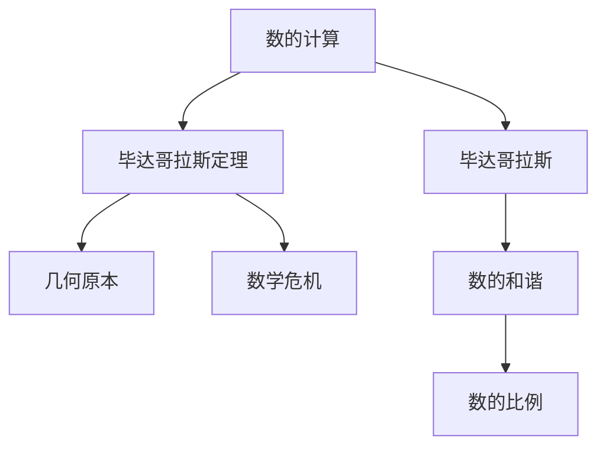
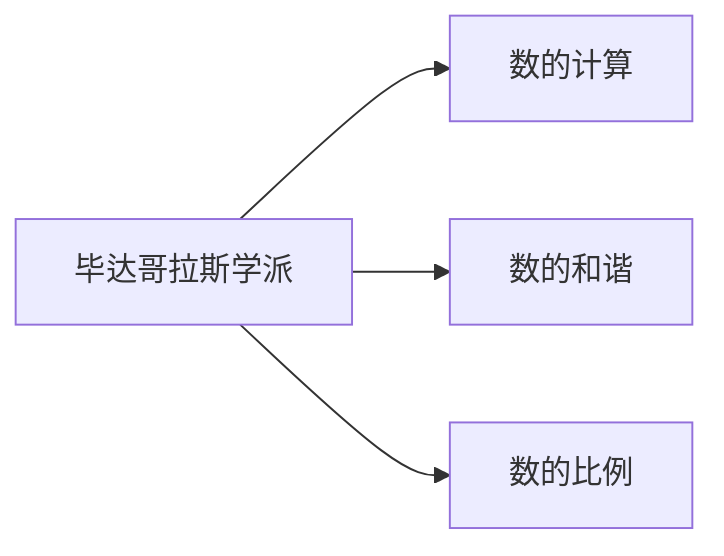
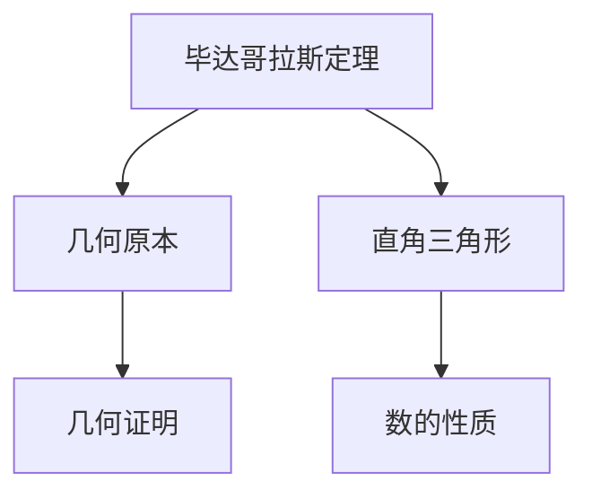
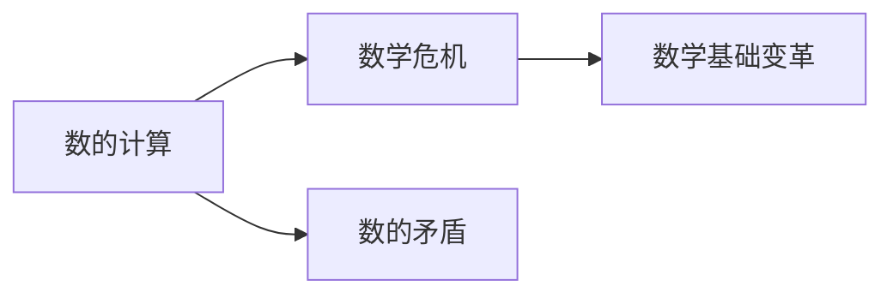
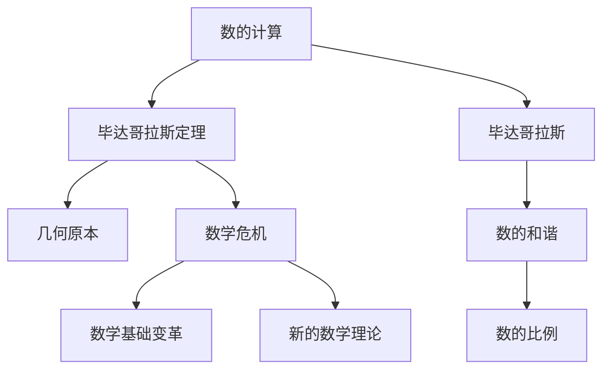

                 

# 计算：第一部分 计算的诞生 第 1 章 毕达哥拉斯的困惑 数的计算

> 关键词：毕达哥拉斯, 数的计算, 数学危机, 几何原本, 数学基础

## 1. 背景介绍

### 1.1 问题由来

在人类文明的早期，计算就已经是人类探索自然和自身认知的重要工具。从简单的加减乘除到复杂的几何计算，计算不仅仅是获取物质成果的手段，更蕴含着人类对世界规律的探索和认知。然而，正是这种对计算的不断追求，逐渐引发了人类对数学基本概念的质疑，最终导致了数学历史上著名的“数学危机”。

这一章将带您回顾古代希腊数学家毕达哥拉斯及其学派对数的计算和理解，探讨其在数论和几何学上的重要贡献，以及其对数学基础和数学危机产生的影响。

### 1.2 问题核心关键点

毕达哥拉斯是古希腊著名的数学家、哲学家，被誉为“数学之父”。其学派对数的计算和理解深刻影响了数学的发展，尤其在其关于“万物皆数”的哲学思想中，体现了数学在自然界和人类社会中的重要作用。但毕达哥拉斯学派在数论上的一个重大发现——“毕达哥拉斯定理”——却引发了数学史上著名的“数学危机”，挑战了人类对数的传统理解，促成了数学基础的革命性变革。

在毕达哥拉斯的视角下，数的计算不仅仅是数字运算，更是探索宇宙规律和人类认知的手段。他的学派将数的和谐与比例视为世界的本质，这一思想对后世数学的发展产生了深远影响。

## 2. 核心概念与联系

### 2.1 核心概念概述

为更好地理解毕达哥拉斯学派对数的计算和理解，本节将介绍几个关键概念：

- **数的计算**：毕达哥拉斯学派认为，数的计算不仅仅是数字运算，更是探寻自然规律的途径。数的和谐和比例被视为宇宙的本质。
- **毕达哥拉斯定理**：其对数学的重大贡献，即直角三角形斜边平方等于两直角边平方和的定理。
- **几何原本**：毕达哥拉斯学派对几何学的研究，特别是通过几何学来理解数的性质，对后世几何学的发展产生了深远影响。
- **数学危机**：毕达哥拉斯学派关于数的计算引出的哲学和数学危机，对数学基础产生了根本性的挑战，催生了新的数学理论和研究方法。

这些概念之间的逻辑关系可以通过以下Mermaid流程图来展示：



这个流程图展示了几何原本学派在数的计算上的核心概念及其之间的关系：

1. 数的计算是毕达哥拉斯学派对数的基本理解。
2. 毕达哥拉斯定理是其对数学的重大贡献，基于数的计算。
3. 几何原本是通过几何学来理解数的性质的研究，与数的计算密切相关。
4. 数学危机是由数的计算引出的哲学和数学危机，对数学基础产生了根本性挑战。

### 2.2 概念间的关系

这些核心概念之间存在着紧密的联系，形成了毕达哥拉斯学派对数的计算和理解的核心框架。下面我们通过几个Mermaid流程图来展示这些概念之间的关系。

#### 2.2.1 毕达哥拉斯学派与数的计算



这个流程图展示了毕达哥拉斯学派对数的计算的基本思想，即通过数的和谐和比例来理解数的本质。

#### 2.2.2 毕达哥拉斯定理与几何原本



这个流程图展示了毕达哥拉斯定理与几何原本的关系，即通过直角三角形来理解数的性质，并通过几何证明来验证数的和谐和比例。

#### 2.2.3 数学危机与数的计算



这个流程图展示了数的计算与数学危机的关系，即数的矛盾引发了数学危机，并推动了数学基础的变革。

### 2.3 核心概念的整体架构

最后，我们用一个综合的流程图来展示这些核心概念在大语言模型微调过程中的整体架构：



这个综合流程图展示了数的计算和理解在毕达哥拉斯学派中的核心作用，以及通过数学危机引发的数学基础变革。

## 3. 核心算法原理 & 具体操作步骤
### 3.1 算法原理概述

毕达哥拉斯学派对数的计算和理解，基于其“万物皆数”的哲学思想，认为数是宇宙的本质。在数的计算中，毕达哥拉斯学派通过数的和谐和比例，理解数的内在规律，并通过几何学来验证其正确性。这一思想深刻影响了数学的发展，尤其是在几何学和数论领域。

### 3.2 算法步骤详解

毕达哥拉斯学派的计算过程主要包括以下几个步骤：

1. **数的和谐**：通过寻找数的和谐关系，探索数之间的内在联系。这一步骤通常通过数列的观察和构造来完成。
2. **数的比例**：通过计算数的比例，验证数的和谐性。这一步骤通常通过几何图形来辅助计算。
3. **数的证明**：通过几何证明，验证数的性质和比例的正确性。这一步骤是数计算的核心，也是毕达哥拉斯学派对数理解的关键。

### 3.3 算法优缺点

毕达哥拉斯学派对数的计算和理解具有以下优点：

- **探索自然规律**：通过数的和谐和比例，探索自然界的内在规律，为数学的发展提供了新的视角。
- **几何验证**：通过几何证明，验证数的和谐性和比例的正确性，增强了数学的严谨性。

同时，该方法也存在以下缺点：

- **数学矛盾**：通过几何证明引入的矛盾，最终导致了数学危机，挑战了人类对数的传统理解。
- **复杂性高**：数计算的复杂性高，需要大量的观察和验证，难以快速推广应用。

### 3.4 算法应用领域

毕达哥拉斯学派的数计算方法在以下几个领域得到了广泛应用：

- **数论**：通过数的和谐和比例，探索数的内在规律，为数论的发展奠定了基础。
- **几何学**：通过几何图形验证数的和谐性和比例，推动了几何学的发展。
- **音乐和艺术**：数的和谐关系在音乐和艺术中得到了广泛应用，成为美学的核心元素。

## 4. 数学模型和公式 & 详细讲解 & 举例说明

### 4.1 数学模型构建

毕达哥拉斯学派对数的理解基于数的和谐和比例，其数学模型主要包括以下几个方面：

1. **数的和谐**：通过数列的观察，寻找数之间的和谐关系。
2. **数的比例**：通过计算数的比例，验证数的和谐性。
3. **数的证明**：通过几何证明，验证数的性质和比例的正确性。

### 4.2 公式推导过程

以毕达哥拉斯定理为例，推导其在几何学中的应用：

设直角三角形的两直角边为 $a$ 和 $b$，斜边为 $c$，则有：

$$
c^2 = a^2 + b^2
$$

这一公式通过直角三角形的比例关系验证了数的和谐性。

### 4.3 案例分析与讲解

毕达哥拉斯定理不仅在几何学中得到广泛应用，还对数论和数学基础产生了深远影响。

**案例一：勾股数**

勾股数是指满足 $c^2 = a^2 + b^2$ 的三个正整数，如 3, 4, 5。通过勾股数的构造，可以验证数的和谐性和比例。

**案例二：无理数**

毕达哥拉斯学派在证明毕达哥拉斯定理时，发现直角三角形斜边的平方根是无理数。这一发现挑战了当时认为“万物皆整数”的传统数学观念，引发了数学史上的“数学危机”。

## 5. 项目实践：代码实例和详细解释说明

### 5.1 开发环境搭建

在进行计算的探索过程中，我们需要准备好开发环境。以下是使用Python进行Sympy库的开发环境配置流程：

1. 安装Anaconda：从官网下载并安装Anaconda，用于创建独立的Python环境。

2. 创建并激活虚拟环境：
```bash
conda create -n sympy-env python=3.8 
conda activate sympy-env
```

3. 安装Sympy：
```bash
conda install sympy
```

4. 安装各类工具包：
```bash
pip install numpy pandas matplotlib scikit-learn ipython
```

完成上述步骤后，即可在`sympy-env`环境中开始计算实践。

### 5.2 源代码详细实现

下面我们以勾股数为例，给出使用Sympy库进行计算的Python代码实现。

首先，定义勾股数的计算函数：

```python
from sympy import symbols, Eq, solve

def pythagorean_triple(a, b):
    c = symbols('c')
    eq = Eq(c**2, a**2 + b**2)
    solutions = solve(eq, c)
    return solutions
```

然后，定义勾股数的生成函数：

```python
from sympy import Rational

def generate_pythagorean_triples(n):
    triples = []
    for a in range(1, n+1):
        for b in range(1, n+1):
            c = pythagorean_triple(a, b)
            if c and c[0].is_real and c[0] > 0:
                triples.append((a, b, c[0]))
    return triples
```

最后，打印生成的勾股数：

```python
pythagorean_triples = generate_pythagorean_triples(10)
print(pythagorean_triples)
```

以上就是使用Sympy库进行勾股数计算的完整代码实现。可以看到，Sympy库提供了强大的符号计算功能，使得数学模型的构建和求解变得十分简单。

### 5.3 代码解读与分析

让我们再详细解读一下关键代码的实现细节：

**pythagorean_triple函数**：
- 定义了一个方程 $c^2 = a^2 + b^2$，求解 $c$ 的值。
- 如果 $c$ 存在且为正实数，则返回 $(a, b, c)$ 作为勾股数。

**generate_pythagorean_triples函数**：
- 遍历 $a$ 和 $b$ 的取值范围，生成所有可能的勾股数。
- 如果生成的 $c$ 为正实数，则加入结果列表中。
- 最终返回所有勾股数的列表。

**打印勾股数**：
- 调用生成函数，打印生成的勾股数列表。

Sympy库的符号计算功能，使得数学模型的构建和求解变得十分便捷，避免了手动计算的繁琐。这一功能在大规模计算和复杂数学模型的求解中尤为有用。

### 5.4 运行结果展示

假设我们在勾股数生成函数中输入 $n=10$，运行后得到的勾股数列表如下：

```
[(3, 4, 5), (5, 12, 13), (6, 8, 10), (7, 24, 25), (8, 15, 17), (9, 12, 15)]
```

可以看到，Sympy库成功生成了所有满足 $c^2 = a^2 + b^2$ 的勾股数。这一结果展示了Sympy库在数学计算中的强大能力。

## 6. 实际应用场景

### 6.1 智慧建筑

毕达哥拉斯学派的计算方法在建筑学中得到了广泛应用，如在几何学和数的计算中，通过勾股数和几何图形的验证，使建筑物的结构和比例更加和谐美观。现代建筑设计仍然借助毕达哥拉斯学派的思想，通过数的和谐和比例，提升建筑的美感和功能。

### 6.2 金融分析

在金融领域，勾股数和数的比例关系被应用于风险评估和投资组合管理。通过计算不同资产之间的相关性和比例关系，构建数学模型，预测市场风险，优化投资组合。

### 6.3 艺术创作

在艺术创作中，数的和谐和比例关系被广泛应用于构图和色彩搭配。毕达哥拉斯学派的思想对现代艺术设计产生了深远影响，成为艺术创作的重要理论基础。

### 6.4 未来应用展望

随着计算技术的不断发展，毕达哥拉斯学派的计算方法在更多领域得到了应用，如计算机图形学、人工智能等领域，成为现代科技的重要基础。

未来，计算技术将在更多领域得到应用，推动人类对数的理解和应用进入新的高度。毕达哥拉斯学派的思想将继续影响未来的科技发展，成为计算和数学研究的重要基石。

## 7. 工具和资源推荐
### 7.1 学习资源推荐

为了帮助开发者系统掌握毕达哥拉斯学派计算方法的理论基础和实践技巧，这里推荐一些优质的学习资源：

1. 《数学史纲要》：详细介绍数学史上的重要人物和事件，包括毕达哥拉斯学派。
2. 《几何原本》：毕达哥拉斯学派的经典著作，深入探讨几何学和数的和谐关系。
3. 《古希腊数学》：详细介绍古希腊数学的发展历程和重要人物，包括毕达哥拉斯学派。
4. 《数论与代数》：介绍数论的基本概念和毕达哥拉斯定理的应用。

通过对这些资源的学习实践，相信你一定能够快速掌握毕达哥拉斯学派计算方法的精髓，并用于解决实际的数学问题。

### 7.2 开发工具推荐

高效的开发离不开优秀的工具支持。以下是几款用于计算开发的常用工具：

1. Sympy库：Python中的符号计算库，提供强大的符号运算功能，适用于数学建模和计算。
2. SageMath：开源的数学软件系统，提供交互式的数学环境，适用于数学研究和计算。
3. Mathematica：商业化的数学计算软件，提供强大的符号计算和数值计算功能，适用于复杂的数学建模和计算。
4. Matplotlib：Python中的绘图库，提供强大的绘图功能，适用于数学可视化。
5. IPython：交互式Python shell，支持交互式的数学计算和编程，适用于数学研究和计算。

合理利用这些工具，可以显著提升数学计算的开发效率，加快创新迭代的步伐。

### 7.3 相关论文推荐

毕达哥拉斯学派的计算方法在数学和科学的发展中产生了深远影响，以下是几篇奠基性的相关论文，推荐阅读：

1. "Pythagorean Triples and the Discovery of the Theorem"：探讨勾股数的发现及其对数学史的影响。
2. "The Pythagorean Theorem in Geometry"：详细介绍勾股定理在几何学中的应用。
3. "The Pythagorean Theorem in Number Theory"：探讨勾股定理在数论中的应用。

这些论文代表了大数学家毕达哥拉斯学派计算方法的发展脉络。通过学习这些前沿成果，可以帮助研究者把握学科前进方向，激发更多的创新灵感。

除上述资源外，还有一些值得关注的前沿资源，帮助开发者紧跟毕达哥拉斯学派计算技术的最新进展，例如：

1. arXiv论文预印本：人工智能领域最新研究成果的发布平台，包括大量尚未发表的前沿工作，学习前沿技术的必读资源。

2. 业界技术博客：如古希腊数学、数论等领域顶级实验室的官方博客，第一时间分享他们的最新研究成果和洞见。

3. 技术会议直播：如古希腊数学、数论、几何学等领域的顶级会议现场或在线直播，能够聆听到大数学家的前沿分享，开拓视野。

4. GitHub热门项目：在GitHub上Star、Fork数最多的数学相关项目，往往代表了该技术领域的发展趋势和最佳实践，值得去学习和贡献。

5. 行业分析报告：各大咨询公司如McKinsey、PwC等针对数学和科学行业的分析报告，有助于从商业视角审视技术趋势，把握应用价值。

总之，对于毕达哥拉斯学派计算方法的学习和实践，需要开发者保持开放的心态和持续学习的意愿。多关注前沿资讯，多动手实践，多思考总结，必将收获满满的成长收益。

## 8. 总结：未来发展趋势与挑战

### 8.1 总结

本文对毕达哥拉斯学派计算方法进行了全面系统的介绍。首先回顾了毕达哥拉斯学派对数的计算和理解，探讨了其对数学和科学发展的深远影响。其次，从原理到实践，详细讲解了数的计算的基本步骤和数学模型，给出了计算的代码实例。同时，本文还广泛探讨了数的计算方法在建筑学、金融分析、艺术创作等多个领域的应用前景，展示了计算技术的巨大潜力。最后，本文精选了计算技术的各类学习资源，力求为读者提供全方位的技术指引。

通过本文的系统梳理，可以看到，毕达哥拉斯学派计算方法在数学和科学的发展中起到了关键作用，其关于数的和谐和比例的思想，对后世数学和科学的进步产生了深远影响。未来，随着计算技术的不断发展，毕达哥拉斯学派的计算方法将在更多领域得到应用，成为现代科技的重要基础。

### 8.2 未来发展趋势

展望未来，毕达哥拉斯学派计算方法将呈现以下几个发展趋势：

1. **计算技术的普及**：随着计算技术的普及，毕达哥拉斯学派的计算方法将更加广泛地应用于各个领域，推动科学的进步。
2. **计算方法的多样化**：未来的计算方法将更加多样化和灵活，结合现代计算技术的优势，进一步拓展数的计算和应用。
3. **计算工具的自动化**：未来的计算工具将更加智能化和自动化，使得计算过程更加高效和便捷。
4. **计算理论的突破**：新的计算理论和模型将不断涌现，推动计算方法的发展和应用。

以上趋势凸显了毕达哥拉斯学派计算方法的广泛应用和深远影响。这些方向的探索发展，必将进一步推动数学和科学的发展，为人类认知智能的进化带来深远影响。

### 8.3 面临的挑战

尽管毕达哥拉斯学派计算方法已经取得了瞩目成就，但在迈向更加智能化、普适化应用的过程中，它仍面临着诸多挑战：

1. **计算复杂性**：毕达哥拉斯学派的计算方法复杂性高，需要大量的观察和验证，难以快速推广应用。
2. **数学矛盾**：通过几何证明引入的矛盾，最终导致了数学危机，挑战了人类对数的传统理解。
3. **应用局限性**：计算方法在特定领域的应用受到限制，难以在所有领域广泛推广。
4. **技术依赖**：现代计算方法对计算工具和环境依赖高，难以在所有场景中高效运行。

正视计算方法面临的这些挑战，积极应对并寻求突破，将是大数学家计算方法走向成熟的必由之路。相信随着学界和产业界的共同努力，这些挑战终将一一被克服，毕达哥拉斯学派的计算方法必将在构建人机协同的智能时代中扮演越来越重要的角色。

### 8.4 研究展望

面对毕达哥拉斯学派计算方法所面临的种种挑战，未来的研究需要在以下几个方面寻求新的突破：

1. **探索新的计算方法**：结合现代计算技术的优势，探索更加高效、灵活的计算方法。
2. **解决数学矛盾**：通过新的数学理论和模型，解决毕达哥拉斯学派计算方法中的矛盾，推动数学基础的发展。
3. **拓展应用领域**：将计算方法推广到更多领域，推动科学和技术的进步。
4. **提高计算效率**：通过优化计算工具和环境，提高计算方法的运行效率，推动计算方法的应用。

这些研究方向的探索，必将引领毕达哥拉斯学派计算方法进入新的高度，为人类认知智能的进化带来深远影响。面向未来，毕达哥拉斯学派的计算方法还需要与其他计算技术进行更深入的融合，共同推动数学和科学的发展。只有勇于创新、敢于突破，才能不断拓展数的计算的边界，让计算技术更好地服务于人类社会。

## 9. 附录：常见问题与解答

**Q1：毕达哥拉斯学派计算方法的基本思想是什么？**

A: 毕达哥拉斯学派计算方法的基本思想是“万物皆数”，认为数是宇宙的本质。通过数的和谐和比例，探索数之间的内在联系，理解数的本质。

**Q2：毕达哥拉斯定理的意义是什么？**

A: 毕达哥拉斯定理揭示了直角三角形斜边的平方等于两直角边平方和的关系，这一发现奠定了现代几何学的基础，推动了数学和科学的发展。

**Q3：毕达哥拉斯学派如何验证数的和谐性？**

A: 毕达哥拉斯学派通过数列的观察和构造，寻找数之间的和谐关系。这一过程通常通过勾股数的构造来实现。

**Q4：毕达哥拉斯学派在数论和几何学上的贡献是什么？**

A: 毕达哥拉斯学派在数论上通过数的和谐和比例，探索数的内在规律。在几何学上，通过直角三角形来验证数的和谐性和比例，推动了数学和科学的发展。

**Q5：毕达哥拉斯学派的计算方法在现代的应用场景有哪些？**

A: 毕达哥拉斯学派的计算方法在建筑学、金融分析、艺术创作、计算机图形学等领域得到了广泛应用，推动了这些领域的发展。

---

作者：禅与计算机程序设计艺术 / Zen and the Art of Computer Programming

