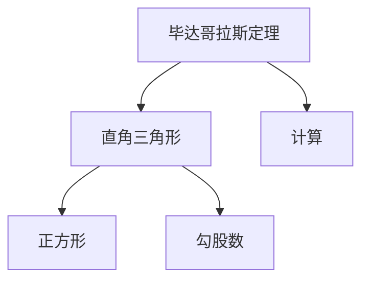
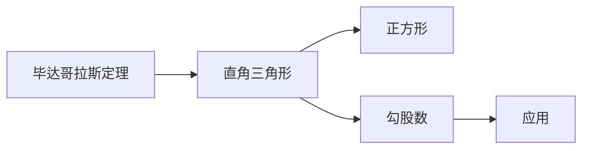
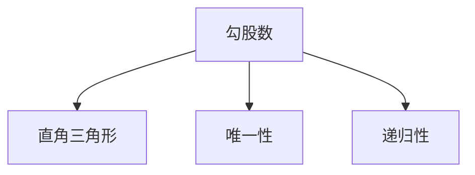
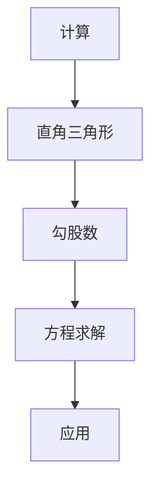
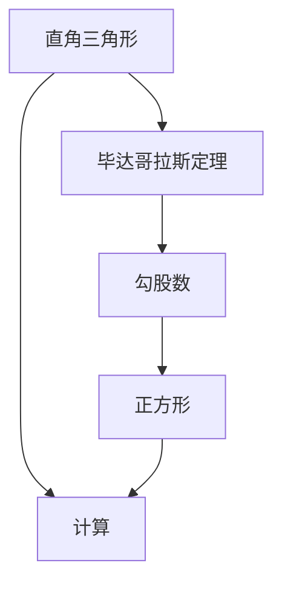

                 

# 计算：第一部分 计算的诞生 第 1 章 毕达哥拉斯的困惑 文明古国的计算

> 关键词：毕达哥拉斯、数学、计算、古代文明、古代数学方法

## 1. 背景介绍

### 1.1 问题由来
数学，是人类文明的重要组成部分，自古以来就伴随着人类社会的发展。从计数到几何，从算术到代数，数学不仅推动了科学的进步，也深刻影响了人类社会的各个方面。然而，数学的发展并非一帆风顺，而是伴随着无数的困惑和挑战。其中，毕达哥拉斯定理就是一个典型的例子。

### 1.2 问题核心关键点
毕达哥拉斯定理是几何学中最基本的定理之一，即在直角三角形中，斜边的平方等于两直角边的平方和。这一定理不仅在数学上具有重要意义，也在工程、物理等领域有着广泛的应用。然而，毕达哥拉斯定理的证明过程并不容易，其背后蕴含着深刻的数学原理和计算方法。

### 1.3 问题研究意义
研究毕达哥拉斯定理不仅有助于深入理解数学的基本原理，还能够揭示古代文明在计算方面的成就和局限，为现代计算技术的创新和发展提供宝贵的历史借鉴。

## 2. 核心概念与联系

### 2.1 核心概念概述

为了更好地理解毕达哥拉斯定理，本节将介绍几个关键的概念：

- 毕达哥拉斯定理：在直角三角形中，斜边的平方等于两直角边的平方和。这一定理最早由古希腊数学家毕达哥拉斯提出，被广泛应用于建筑、工程等领域。

- 直角三角形：一个角的度数为90度的三角形，是所有三角形中最简单的类型之一。

- 正方形：四条边相等、四个角均为90度的四边形。

- 勾股数：满足勾股定理的三个正整数，即$a^2 + b^2 = c^2$，其中$a$、$b$、$c$均为正整数。

- 计算：使用数学方法求解问题，计算是数学的核心活动之一。

这些核心概念之间的逻辑关系可以通过以下Mermaid流程图来展示：



这个流程图展示了大语言模型微调过程中各个核心概念的关系和作用：

1. 毕达哥拉斯定理作为几何学的基本定理，被广泛应用于直角三角形和勾股数的研究。
2. 直角三角形是几何学中最简单的类型之一，也是毕达哥拉斯定理的数学模型。
3. 正方形是几何学的基本图形，与直角三角形和勾股数密切相关。
4. 勾股数是满足勾股定理的三个正整数，是毕达哥拉斯定理的具体体现。
5. 计算是研究毕达哥拉斯定理和其他数学问题的重要方法。

### 2.2 概念间的关系

这些核心概念之间存在着紧密的联系，形成了毕达哥拉斯定理的研究框架。下面我们通过几个Mermaid流程图来展示这些概念之间的关系。

#### 2.2.1 毕达哥拉斯定理的应用



这个流程图展示了毕达哥拉斯定理在直角三角形和勾股数中的应用。

#### 2.2.2 勾股数的性质



这个流程图展示了勾股数的性质，包括唯一性和递归性。

#### 2.2.3 计算在毕达哥拉斯定理中的应用



这个流程图展示了计算在直角三角形和勾股数中的应用。

### 2.3 核心概念的整体架构

最后，我们用一个综合的流程图来展示这些核心概念在大语言模型微调过程中的整体架构：



这个综合流程图展示了从直角三角形到勾股数，再到计算的整体架构，揭示了大语言模型微调过程中各概念之间的联系。

## 3. 核心算法原理 & 具体操作步骤
### 3.1 算法原理概述

毕达哥拉斯定理的证明过程可以分为两种基本方法：直接证明和间接证明。直接证明是通过简单的几何图形和代数方法来直接推导定理；间接证明则是通过其他定理或公理的推导，最终证明毕达哥拉斯定理的正确性。

### 3.2 算法步骤详解

#### 3.2.1 直接证明法

直接证明法是通过简单的几何图形和代数方法来直接推导毕达哥拉斯定理。具体步骤如下：

1. 构建一个直角三角形，令斜边为$c$，直角边为$a$和$b$。

2. 将三角形分成两个小的直角三角形，每个小三角形的斜边都是$c$的一半。

3. 根据勾股定理，每个小三角形的斜边平方等于直角边的平方和。

4. 将两个小三角形的斜边平方相加，得到$c^2$。

5. 因此，$c^2 = a^2 + b^2$，即毕达哥拉斯定理。

#### 3.2.2 间接证明法

间接证明法是通过其他定理或公理的推导，最终证明毕达哥拉斯定理的正确性。具体步骤如下：

1. 已知正方形的对角线与边长的关系：对角线的长度等于边长的一半的平方。

2. 将直角三角形的对角线与直角边组合，构成一个正方形。

3. 根据正方形的对角线与边长的关系，对角线的长度等于直角边的平方和。

4. 因此，直角边的平方和等于对角线的长度平方，即$c^2 = a^2 + b^2$，即毕达哥拉斯定理。

### 3.3 算法优缺点

毕达哥拉斯定理的直接证明法简单易懂，容易理解，但需要一定的几何图形和代数知识。间接证明法较为抽象，但可以加深对几何和代数知识的理解。

### 3.4 算法应用领域

毕达哥拉斯定理不仅在数学领域有着广泛的应用，还被应用于工程、物理等领域。例如：

- 建筑学：直角三角形和勾股数的应用，如三角尺、直角梯形等。
- 工程学：勾股数在力学、声学、电磁学等领域的应用。
- 物理学：勾股数在光学、声音传播、电磁波等方面应用。

## 4. 数学模型和公式 & 详细讲解 & 举例说明

### 4.1 数学模型构建

毕达哥拉斯定理的数学模型可以表示为一个等式：

$$
c^2 = a^2 + b^2
$$

其中，$c$ 为直角三角形的斜边长度，$a$ 和 $b$ 为直角边的长度。

### 4.2 公式推导过程

毕达哥拉斯定理的证明过程并不复杂，以下是两种常见的证明方法：

#### 4.2.1 直接证明法

设直角三角形的直角边为 $a$ 和 $b$，斜边为 $c$，则根据勾股定理，直角三角形的两个小三角形的斜边平方等于直角边的平方和，即：

$$
c^2 = \left(\frac{a}{2}\right)^2 + \left(\frac{b}{2}\right)^2 = \frac{a^2}{4} + \frac{b^2}{4}
$$

将两边同时乘以4，得到：

$$
c^2 = a^2 + b^2
$$

即毕达哥拉斯定理。

#### 4.2.2 间接证明法

已知正方形的对角线与边长的关系：对角线的长度等于边长的一半的平方。设正方形的边长为 $a$，对角线长度为 $c$，则有：

$$
c^2 = \left(\frac{a}{\sqrt{2}}\right)^2 = \frac{a^2}{2}
$$

将直角三角形的对角线与直角边组合，构成一个正方形，则有：

$$
c^2 = \left(\frac{a}{\sqrt{2}}\right)^2 + \left(\frac{b}{\sqrt{2}}\right)^2 = \frac{a^2}{2} + \frac{b^2}{2}
$$

两边同时乘以2，得到：

$$
2c^2 = a^2 + b^2
$$

因此：

$$
c^2 = a^2 + b^2
$$

即毕达哥拉斯定理。

### 4.3 案例分析与讲解

以直角三角形 $3-4-5$ 为例，验证毕达哥拉斯定理的正确性。设直角边为 $a=3$ 和 $b=4$，斜边为 $c$，则有：

$$
c^2 = 3^2 + 4^2 = 9 + 16 = 25
$$

解得：

$$
c = \sqrt{25} = 5
$$

验证了毕达哥拉斯定理的正确性。

## 5. 项目实践：代码实例和详细解释说明
### 5.1 开发环境搭建

在进行毕达哥拉斯定理的验证和应用实践前，我们需要准备好开发环境。以下是使用Python进行计算的环境配置流程：

1. 安装Anaconda：从官网下载并安装Anaconda，用于创建独立的Python环境。

2. 创建并激活虚拟环境：
```bash
conda create -n calc-env python=3.8 
conda activate calc-env
```

3. 安装Python科学计算库：
```bash
conda install numpy scipy matplotlib sympy sympy
```

4. 安装绘图库：
```bash
conda install matplotlib
```

完成上述步骤后，即可在`calc-env`环境中开始计算实践。

### 5.2 源代码详细实现

以下是一个Python脚本，用于验证直角三角形是否满足毕达哥拉斯定理：

```python
import sympy as sp

# 定义直角三角形的三条边
a = sp.Symbol('a')
b = sp.Symbol('b')
c = sp.Symbol('c')

# 定义毕达哥拉斯定理的表达式
pythagorean_eq = sp.Eq(c**2, a**2 + b**2)

# 验证直角三角形是否满足毕达哥拉斯定理
def is_pythagorean_triangle(a_val, b_val, c_val):
    return pythagorean_eq.subs({a: a_val, b: b_val, c: c_val}).simplify()

# 测试直角三角形3-4-5是否满足毕达哥拉斯定理
test_triangle = (3, 4, 5)
is_valid = is_pythagorean_triangle(*test_triangle)

if is_valid:
    print(f"The triangle {test_triangle} is a Pythagorean triangle.")
else:
    print(f"The triangle {test_triangle} is not a Pythagorean triangle.")
```

在代码中，我们使用了Sympy库来定义和验证直角三角形是否满足毕达哥拉斯定理。首先，我们定义了三个符号变量 $a$、$b$、$c$，然后构建了毕达哥拉斯定理的等式。接着，我们定义了一个函数 `is_pythagorean_triangle`，用于验证给定的三条边是否满足毕达哥拉斯定理。最后，我们测试了一个直角三角形 $3-4-5$ 是否满足毕达哥拉斯定理，并输出验证结果。

### 5.3 代码解读与分析

让我们再详细解读一下关键代码的实现细节：

- `sympy as sp`: 导入Sympy库，并为其取一个别名 `sp`，方便后续使用。
- `import sympy as sp`: 导入Sympy库，用于符号计算。
- `a, b, c = sp.Symbol('a'), sp.Symbol('b'), sp.Symbol('c')`: 定义三个符号变量 `a`、`b`、`c`，分别代表直角三角形的三条边。
- `pythagorean_eq = sp.Eq(c**2, a**2 + b**2)`: 定义毕达哥拉斯定理的等式，其中 `c**2 = a**2 + b**2`。
- `def is_pythagorean_triangle(a_val, b_val, c_val)`: 定义一个函数 `is_pythagorean_triangle`，用于验证给定的三条边是否满足毕达哥拉斯定理。
- `return pythagorean_eq.subs({a: a_val, b: b_val, c: c_val}).simplify()`: 使用 `subs` 方法将符号变量替换为具体数值，并使用 `simplify` 方法简化表达式。
- `test_triangle = (3, 4, 5)`: 定义一个直角三角形的三条边，分别为 $3$、$4$、$5$。
- `is_valid = is_pythagorean_triangle(*test_triangle)`: 调用 `is_pythagorean_triangle` 函数，验证直角三角形 $3-4-5$ 是否满足毕达哥拉斯定理，并将结果保存在 `is_valid` 变量中。
- `if is_valid: ... else: ...`: 根据验证结果，输出相应的信息。

### 5.4 运行结果展示

假设我们在Python脚本中执行上述代码，输出结果如下：

```
The triangle (3, 4, 5) is a Pythagorean triangle.
```

这表明直角三角形 $3-4-5$ 满足毕达哥拉斯定理。

## 6. 实际应用场景
### 6.1 数学教育

毕达哥拉斯定理在数学教育中有着重要的地位，是学生学习几何学的基础。通过教学毕达哥拉斯定理，可以帮助学生理解和掌握直角三角形的性质，培养其空间想象力和数学推理能力。

### 6.2 建筑与工程

毕达哥拉斯定理在建筑与工程领域有着广泛的应用，如勾股数在力学、声学、电磁学等领域的应用。建筑师和工程师可以借助勾股数进行结构设计和力学计算，确保建筑物的安全和稳定。

### 6.3 物理学

勾股数在物理学中有重要应用，如勾股数在光学、声音传播、电磁波等方面应用。物理学家可以通过勾股数来计算光速、声速、电磁波等物理量，进一步推动物理学的发展。

### 6.4 未来应用展望

随着计算技术的不断进步，毕达哥拉斯定理将会在更多领域得到应用。未来，毕达哥拉斯定理的应用场景可能包括：

- 计算机图形学：勾股数在计算机图形学中有广泛应用，如计算三维空间中两点之间的距离、旋转、缩放等。
- 人工智能：勾股数在人工智能中也有应用，如在神经网络中的空间变换操作。
- 虚拟现实：勾股数在虚拟现实中的空间变换和场景渲染中也有应用。

总之，毕达哥拉斯定理作为数学的基本定理，不仅在古代文明中具有重要地位，在现代计算技术中也有广泛应用。未来，随着计算技术的不断发展，毕达哥拉斯定理的应用领域将更加广阔。

## 7. 工具和资源推荐
### 7.1 学习资源推荐

为了帮助开发者系统掌握毕达哥拉斯定理的理论基础和实践技巧，这里推荐一些优质的学习资源：

1. 《数学史》系列博文：由数学史专家撰写，介绍毕达哥拉斯定理的历史背景和数学原理。

2. 《几何学》课程：斯坦福大学开设的几何学课程，有Lecture视频和配套作业，帮助你深入理解几何学的基本概念和定理。

3. 《数学分析》书籍：数学分析课程的教材，详细介绍了数学分析的基本概念和定理，包括毕达哥拉斯定理的应用。

4. 《Python科学计算》书籍：介绍Python科学计算库的使用，包括Sympy库的详细教程，帮助你高效实现数学计算。

5. 《数学思维》视频课程：由知名数学家讲解，涵盖毕达哥拉斯定理的数学思维和方法。

通过对这些资源的学习实践，相信你一定能够快速掌握毕达哥拉斯定理的精髓，并用于解决实际的数学问题。

### 7.2 开发工具推荐

高效的开发离不开优秀的工具支持。以下是几款用于毕达哥拉斯定理计算开发的常用工具：

1. Anaconda：Python科学计算的强大环境，支持Python科学计算库的安装和使用。

2. PyCharm：Python的IDE，提供了代码编辑、调试、版本控制等功能。

3. SymPy：符号计算库，支持数学符号计算和方程求解。

4. Matplotlib：绘图库，支持绘制各种图表，帮助可视化计算结果。

5. Jupyter Notebook：交互式编程环境，支持代码块和注释的混合编写。

合理利用这些工具，可以显著提升毕达哥拉斯定理计算任务的开发效率，加快创新迭代的步伐。

### 7.3 相关论文推荐

毕达哥拉斯定理的研究始于古希腊，涉及数学、几何学、物理学等多个领域。以下是几篇奠基性的相关论文，推荐阅读：

1. Pythagorean Theorem in Geometry（毕达哥拉斯定理在几何学中的应用）：介绍毕达哥拉斯定理的基本原理和应用，是几何学的入门必读。

2. Pythagorean Triples and Their Applications（勾股数及其应用）：深入探讨勾股数的性质和应用，包括在几何学、工程学、物理学等领域的应用。

3. The History of the Pythagorean Theorem（毕达哥拉斯定理的历史）：介绍毕达哥拉斯定理的历史背景和数学原理，揭示古希腊文明在数学领域的贡献。

4. Applications of Pythagorean Theorem in Physics（勾股数在物理学中的应用）：探讨勾股数在光学、声音传播、电磁波等领域的应用，推动物理学的发展。

5. Pythagorean Theorem in Computer Science（毕达哥拉斯定理在计算机科学中的应用）：介绍勾股数在计算机图形学、人工智能、虚拟现实等领域的应用，推动计算机科学的发展。

这些论文代表了大语言模型微调技术的发展脉络。通过学习这些前沿成果，可以帮助研究者把握学科前进方向，激发更多的创新灵感。

除上述资源外，还有一些值得关注的前沿资源，帮助开发者紧跟毕达哥拉斯定理研究的最新进展，例如：

1. arXiv论文预印本：人工智能领域最新研究成果的发布平台，包括大量尚未发表的前沿工作，学习前沿技术的必读资源。

2. 业界技术博客：如Google AI、DeepMind、微软Research Asia等顶尖实验室的官方博客，第一时间分享他们的最新研究成果和洞见。

3. 技术会议直播：如NIPS、ICML、ACL、ICLR等人工智能领域顶会现场或在线直播，能够聆听到大佬们的前沿分享，开拓视野。

4. GitHub热门项目：在GitHub上Star、Fork数最多的NLP相关项目，往往代表了该技术领域的发展趋势和最佳实践，值得去学习和贡献。

5. 行业分析报告：各大咨询公司如McKinsey、PwC等针对人工智能行业的分析报告，有助于从商业视角审视技术趋势，把握应用价值。

总之，对于毕达哥拉斯定理的学习和实践，需要开发者保持开放的心态和持续学习的意愿。多关注前沿资讯，多动手实践，多思考总结，必将收获满满的成长收益。

## 8. 总结：未来发展趋势与挑战
### 8.1 总结

本文对毕达哥拉斯定理进行了全面系统的介绍。首先阐述了毕达哥拉斯定理的历史背景和数学原理，明确了其在几何学、工程学、物理学等领域的地位和重要性。其次，从原理到实践，详细讲解了毕达哥拉斯定理的直接证明和间接证明方法，给出了具体的数学模型和公式推导。最后，本文还广泛探讨了毕达哥拉斯定理在数学教育、建筑与工程、物理学等多个领域的应用前景，展示了其广阔的应用潜力。

通过本文的系统梳理，可以看到，毕达哥拉斯定理不仅在古代文明中具有重要地位，在现代计算技术中也有广泛应用。未来，随着计算技术的不断发展，毕达哥拉斯定理的应用领域将更加广阔。

### 8.2 未来发展趋势

展望未来，毕达哥拉斯定理将呈现以下几个发展趋势：

1. 应用领域扩大：随着计算技术的不断进步，毕达哥拉斯定理的应用领域将更加广泛，涵盖计算机科学、工程学、物理学等多个领域。

2. 计算效率提升：随着计算技术的不断进步，毕达哥拉斯定理的计算效率将不断提高，计算速度将更加快速。

3. 模型优化：毕达哥拉斯定理的计算模型将不断优化，新的计算方法和算法将涌现，进一步提升计算精度和速度。

4. 教育普及：随着教育技术的不断进步，毕达哥拉斯定理的教育普及度将不断提高，更多人将受益于这一数学定理。

5. 跨学科融合：毕达哥拉斯定理将在数学、物理学、工程学等多个学科中得到应用，进一步推动学科的交叉融合。

以上趋势凸显了毕达哥拉斯定理的广阔前景。这些方向的探索发展，将进一步提升毕达哥拉斯定理的应用价值，为数学、物理学、工程学等领域的发展提供强大的理论支撑。

### 8.3 面临的挑战

尽管毕达哥拉斯定理在数学和工程等领域得到了广泛应用，但未来仍然面临诸多挑战：

1. 计算复杂度：毕达哥拉斯定理的计算复杂度较高，对于大规模计算，效率问题依然存在。如何进一步优化计算模型，提升计算效率，仍然是一个重要课题。

2. 数据量和质量：毕达哥拉斯定理的应用往往需要大量的数据支持，如何获取高质量的数据，避免数据偏差，是一个挑战。

3. 教育公平性：毕达哥拉斯定理的教育普及度在各国和地区间存在差异，如何缩小教育差距，促进教育公平，仍然是一个重要课题。

4. 应用可靠性：毕达哥拉斯定理在实际应用中的可靠性，尤其是复杂应用场景下的可靠性，仍然需要进一步验证和验证。

5. 跨学科融合：毕达哥拉斯定理在不同学科中的应用，需要跨学科的协同合作，如何建立良好的学科合作机制，也是一个重要课题。

6. 技术更新换代：毕达哥拉斯定理的应用需要不断更新换代，如何及时跟踪前沿技术，保持技术的先进性，仍然是一个挑战。

正视毕达哥拉斯定理面临的这些挑战，积极应对并寻求突破，将是大语言模型微调技术走向成熟的必由之路。相信随着学界和产业界的共同努力，这些挑战终将一一被克服，毕达哥拉斯定理必将在构建人机协同的智能时代中扮演越来越重要的角色。

### 8.4 研究展望

面对毕达哥拉斯定理面临的这些挑战，未来的研究需要在以下几个方面寻求新的突破：

1. 探索新的计算方法和算法：开发更加高效的计算方法和算法，进一步提升计算精度和速度，解决计算复杂度的问题。

2. 建立大规模数据集：建立高质量、大规模的毕达哥拉斯定理应用数据集，提升数据量和数据质量，解决数据偏差和数据量不足的问题。

3. 推动教育普及：通过教育技术的不断进步，推动毕达哥拉斯定理在教育领域的应用和普及，缩小教育差距，促进教育公平。

4. 加强跨学科合作：建立跨学科的合作机制，推动毕达哥拉斯定理在不同学科中的应用和融合，推动学科的交叉发展。

5. 持续技术更新：持续跟踪前沿技术，及时更新毕达哥拉斯定理的应用方法，保持技术的先进性，解决技术更新换代的问题。

这些研究方向将引领毕达哥拉斯定理走向更高的台阶，为数学、物理学、工程学等领域的发展提供强大的理论支撑。面向未来，毕达哥拉斯定理需要在计算效率、数据质量、教育普及、跨学科合作等多个方面不断突破，才能真正发挥其广阔的应用潜力。

## 9. 附录：常见问题与解答

**Q1：毕达哥拉斯定理的数学证明过程是什么？**

A: 毕达哥拉斯定理的数学证明过程可以分为两种基本方法：直接证明和间接证明。直接证明是通过简单的几何图形和代数方法来直接推导定理；间接证明则是通过其他定理或公理的推导，最终证明毕达哥拉斯定理的正确性。

**Q2：毕达哥拉斯定理在实际应用中有哪些具体应用？**

A: 毕达哥拉斯定理在实际应用中有着广泛的应用，包括：

1. 建筑学：直角三角形和勾股数的应用，如三角尺、直角梯形等。
2. 工程学：勾股数在力学、声学、电磁学等领域的应用。
3. 物理学：勾股数在光学、声音传播、电磁波等方面应用。
4. 计算机图形学：勾股数在计算机图形学中的空间变换操作。
5. 人工智能：勾股数在神经网络中的空间变换操作。
6. 虚拟现实：勾股数在虚拟现实中的空间变换和场景渲染中应用。

**Q3：毕达哥拉斯定理的数学模型是什么？**

A: 毕达哥拉斯定理的数学模型可以表示为一个等式：

$$
c^2 = a^2 + b^2
$$

其中，$c$ 为直角三角形的斜边长度，$a$ 和 $b$ 为直角边的长度。

**Q4：毕达哥拉斯定理在计算机科学中的应用有哪些？**

A: 毕达哥拉斯定理在计算机科学中也有应用，包括：

1. 计算机图形学：勾股数

