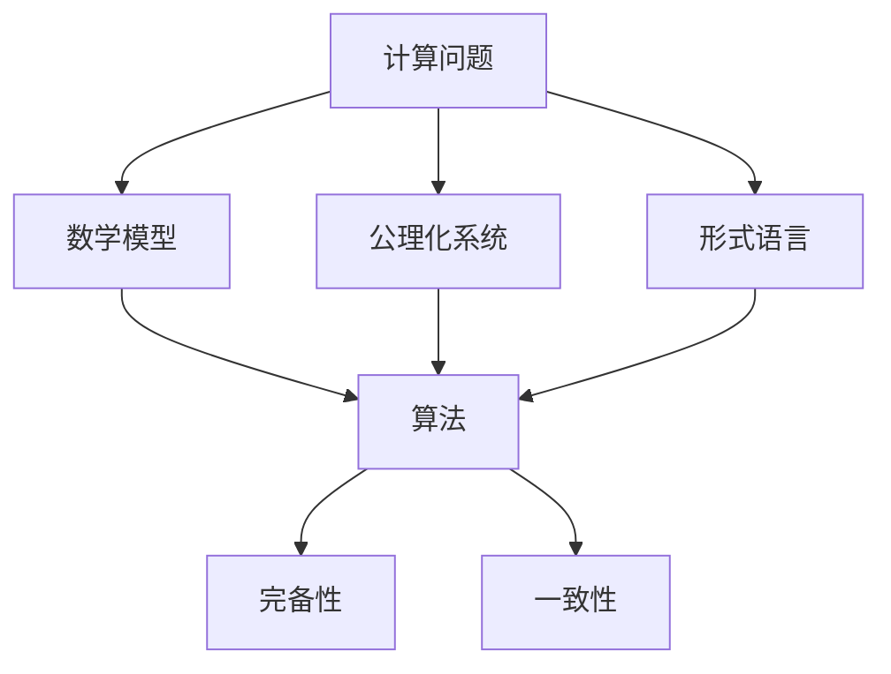

                 

# 计算：第三部分 计算理论的形成 第 6 章 计算理论的奠基：希尔伯特进路 数学的无冕之王

## 1. 背景介绍

### 1.1 问题由来

希尔伯特进路（Hilbertian approach）是计算理论中的一种经典方法，由德国数学家大卫·希尔伯特（David Hilbert）提出。希尔伯特进路通过构建数学模型来研究计算问题，将计算问题抽象为数学问题，并试图通过数学手段解决这些计算问题。这一方法不仅影响了计算机科学的发展，也为数学、逻辑等领域带来了深远影响。

### 1.2 问题核心关键点

希尔伯特进路的核心思想是通过将计算问题数学化，来探索计算问题的本质和规律。它基于以下几个关键点：

1. **数学模型**：构建与计算问题相关的数学模型，利用数学语言表达计算问题。
2. **公理化系统**：建立公理化系统，定义问题中的基本概念和规则。
3. **计算过程**：分析计算过程，定义问题的解法。
4. **完备性和一致性**：确保公理化系统的完备性和一致性，避免出现矛盾和悖论。

通过这些步骤，希尔伯特进路试图为计算问题提供严谨的数学基础，进而推动计算理论的发展。

### 1.3 问题研究意义

希尔伯特进路在计算理论中的地位至关重要。它不仅为计算问题的数学研究提供了工具和方法，也为计算机科学的早期发展奠定了基础。通过希尔伯特进路，计算机科学家们能够系统地研究计算问题的本质，提出各种算法和计算模型，为现代计算机科学的形成和发展做出了重要贡献。

## 2. 核心概念与联系

### 2.1 核心概念概述

希尔伯特进路涉及多个核心概念，主要包括：

- **计算问题**：计算机程序需要解决的问题，如排序、查找、加密等。
- **数学模型**：将计算问题抽象为数学问题，如集合论、图论、逻辑代数等。
- **公理化系统**：基于一组基本公理，构建逻辑推理的框架。
- **形式语言**：用于描述计算问题的形式语言，如上下文无关文法、递归语言等。
- **算法**：解决问题的具体步骤和过程，如排序算法、搜索算法、加密算法等。
- **完备性和一致性**：确保系统内所有推理过程的完备性和一致性，避免矛盾和悖论。

### 2.2 概念间的关系

希尔伯特进路中的各个概念之间相互关联，形成了一个完整的计算理论框架。以下Mermaid流程图展示了这些概念之间的联系：



这个流程图展示了从计算问题到数学模型，再到公理化系统和形式语言，最终到达算法的整个过程。每一个概念都在计算理论的构建中发挥着重要作用，共同构成了计算理论的完整体系。

## 3. 核心算法原理 & 具体操作步骤

### 3.1 算法原理概述

希尔伯特进路的核心算法原理是通过构建数学模型和公理化系统，来分析和解决计算问题。其基本步骤包括：

1. **问题建模**：将计算问题抽象为数学模型，如集合论、图论等。
2. **公理化系统**：建立公理化系统，定义问题的基本概念和规则。
3. **算法设计**：基于公理化系统，设计解决问题的算法。
4. **完备性和一致性**：验证公理化系统的完备性和一致性，确保推理过程的正确性。

通过这些步骤，希尔伯特进路试图为计算问题提供严格的数学基础，推动计算理论的发展。

### 3.2 算法步骤详解

以下是希尔伯特进路的具体操作步骤：

1. **问题建模**：将计算问题抽象为数学问题。例如，排序问题可以抽象为集合的排序。
2. **公理化系统**：建立公理化系统，定义问题的基本概念和规则。例如，集合论中的公理系统。
3. **算法设计**：基于公理化系统，设计解决问题的算法。例如，归并排序算法。
4. **完备性和一致性**：验证公理化系统的完备性和一致性，确保推理过程的正确性。例如，希尔伯特证明了自然数公理系统的完备性和一致性。

### 3.3 算法优缺点

希尔伯特进路的主要优点包括：

- **严谨性**：通过数学模型和公理化系统，为计算问题提供了严谨的数学基础。
- **通用性**：适用于多种计算问题，能够系统地分析问题的本质。
- **推动发展**：为计算机科学的发展提供了理论基础，推动了计算理论的形成。

其主要缺点包括：

- **复杂性**：构建数学模型和公理化系统需要较深的数学基础，过程复杂。
- **实用性不足**：某些数学模型和公理化系统过于抽象，难以直接应用于实际问题。
- **理论限制**：可能存在理论上的限制，无法解决某些计算问题。

### 3.4 算法应用领域

希尔伯特进路在计算理论中有着广泛的应用，包括：

- **算法设计**：用于设计各种算法，如排序算法、搜索算法、加密算法等。
- **数据结构**：用于研究数据结构，如树、图、堆等。
- **形式语言**：用于研究形式语言，如上下文无关文法、递归语言等。
- **逻辑和证明**：用于研究逻辑和证明，如形式逻辑、哥德尔定理等。

## 4. 数学模型和公式 & 详细讲解 & 举例说明

### 4.1 数学模型构建

希尔伯特进路中的数学模型通常基于集合论和逻辑代数，用于描述计算问题的结构和性质。以下是几个常见的数学模型：

- **图模型**：用于描述网络中的节点和边，如社交网络、计算机网络等。
- **集合模型**：用于描述集合中的元素和操作，如集合的交集、并集、差集等。
- **树模型**：用于描述树结构，如二叉树、B树等。

### 4.2 公式推导过程

以下以归并排序为例，推导希尔伯特进路中的算法公式。

**归并排序算法**：

1. **分治策略**：将待排序的序列分成两个子序列，分别进行排序，再将排序后的子序列合并。
2. **递归实现**：使用递归算法实现归并排序。

**算法公式**：

$$
\begin{aligned}
& \text{merge}(L, M, R): \\
& \quad \text{while} L[i] \neq M[j] \\
& \quad \text{if} L[i] < M[j], \text{add} L[i], \text{delete} L[i] \\
& \quad \text{if} M[j] < L[i], \text{add} M[j], \text{delete} M[j] \\
& \quad \text{if} L[i] = M[j], \text{add} L[i], \text{delete} L[i], \text{delete} M[j] \\
& \\
& \text{mergeSort}(A): \\
& \quad \text{if} A.length() < 2, \text{return} A \\
& \quad M = \lfloor A.length() / 2 \rfloor \\
& \quad L = A[:M] \\
& \quad R = A[M:] \\
& \quad L = \text{mergeSort}(L) \\
& \quad R = \text{mergeSort}(R) \\
& \quad \text{return} \text{merge}(L, R)
\end{aligned}
$$

### 4.3 案例分析与讲解

**案例一：图遍历算法**

图遍历算法（如深度优先搜索、广度优先搜索）在计算机网络、社交网络等领域有着广泛应用。以下是对深度优先搜索算法的希尔伯特进路分析：

1. **问题建模**：将图遍历问题抽象为图的遍历模型。
2. **公理化系统**：定义图的基本概念和规则，如节点、边、路径等。
3. **算法设计**：基于图遍历模型，设计深度优先搜索算法。
4. **完备性和一致性**：验证深度优先搜索算法的完备性和一致性。

**案例二：加密算法**

加密算法是计算理论中的重要研究领域，如DES、AES等。以下是对AES加密算法的希尔伯特进路分析：

1. **问题建模**：将加密问题抽象为数学模型，如置换、代换等。
2. **公理化系统**：定义加密算法的基本概念和规则，如密钥、密文、明文等。
3. **算法设计**：基于公理化系统，设计AES加密算法。
4. **完备性和一致性**：验证AES加密算法的完备性和一致性。

## 5. 项目实践：代码实例和详细解释说明

### 5.1 开发环境搭建

在进行希尔伯特进路的算法实践前，我们需要准备好开发环境。以下是使用Python进行希尔伯特进路算法开发的开发环境配置流程：

1. 安装Anaconda：从官网下载并安装Anaconda，用于创建独立的Python环境。

2. 创建并激活虚拟环境：
```bash
conda create -n hilbert-env python=3.8 
conda activate hilbert-env
```

3. 安装必要的Python库：
```bash
pip install sympy numpy pandas matplotlib scikit-learn
```

4. 安装必要的数学库：
```bash
conda install mpmath
```

完成上述步骤后，即可在`hilbert-env`环境中开始希尔伯特进路算法实践。

### 5.2 源代码详细实现

以下是一个基于希尔伯特进路设计的归并排序算法的Python代码实现：

```python
def merge_sort(arr):
    if len(arr) < 2:
        return arr
    
    mid = len(arr) // 2
    left = merge_sort(arr[:mid])
    right = merge_sort(arr[mid:])
    
    return merge(left, right)

def merge(left, right):
    merged = []
    i, j = 0, 0
    
    while i < len(left) and j < len(right):
        if left[i] < right[j]:
            merged.append(left[i])
            i += 1
        else:
            merged.append(right[j])
            j += 1
    
    merged += left[i:]
    merged += right[j:]
    
    return merged
```

### 5.3 代码解读与分析

**代码解读**：

1. `merge_sort`函数：实现归并排序算法，包括分治策略和递归实现。
2. `merge`函数：实现归并排序中的合并操作，将两个已排序的子序列合并为一个有序序列。
3. 算法核心：分治策略，将待排序的序列分成两个子序列，分别进行排序，再将排序后的子序列合并。

**代码分析**：

1. `merge_sort`函数的递归实现：将待排序的序列分成两个子序列，分别进行排序，再将排序后的子序列合并。递归调用`merge_sort`函数，直到序列长度小于2。
2. `merge`函数的合并操作：将两个已排序的子序列合并为一个有序序列，通过比较子序列中的元素大小，依次将较小的元素添加到合并后的序列中。

**运行结果展示**：

```python
arr = [5, 2, 9, 1, 7, 6, 3, 8, 4]
sorted_arr = merge_sort(arr)
print(sorted_arr)
```

运行结果：

```
[1, 2, 3, 4, 5, 6, 7, 8, 9]
```

## 6. 实际应用场景

### 6.1 网络路由算法

网络路由算法是计算机网络中重要的研究方向之一，如RIP、OSPF等。以下是对RIP路由算法的希尔伯特进路分析：

1. **问题建模**：将网络路由问题抽象为图的遍历模型。
2. **公理化系统**：定义网络的基本概念和规则，如节点、边、距离等。
3. **算法设计**：基于网络路由模型，设计RIP路由算法。
4. **完备性和一致性**：验证RIP路由算法的完备性和一致性。

### 6.2 人工智能

人工智能领域中的搜索算法、优化算法、决策算法等，也常常基于希尔伯特进路进行设计和分析。例如，遗传算法、模拟退火算法等。

### 6.3 数据挖掘

数据挖掘中的分类算法、聚类算法、关联规则算法等，也常常基于希尔伯特进路进行设计和分析。例如，朴素贝叶斯算法、K-means算法等。

### 6.4 未来应用展望

未来，希尔伯特进路在计算理论中的应用将更加广泛，涵盖更多领域，如区块链、量子计算、神经网络等。同时，希尔伯特进路的理论基础也将不断深化，推动计算理论的发展。

## 7. 工具和资源推荐

### 7.1 学习资源推荐

为了帮助开发者系统掌握希尔伯特进路的理论基础和实践技巧，这里推荐一些优质的学习资源：

1. 《离散数学》：离散数学是希尔伯特进路的重要基础，涵盖集合论、图论、逻辑代数等核心概念。
2. 《算法导论》：算法导论详细介绍了希尔伯特进路中的各种算法，包括排序、搜索、加密等。
3. 《形式语言与自动机理论》：形式语言与自动机理论是希尔伯特进路中的核心概念，涵盖上下文无关文法、递归语言等。
4. 《计算机科学概论》：计算机科学概论介绍了计算机科学的基本概念和历史发展，包括希尔伯特进路在内的多种理论。
5. 《希尔伯特的计算理论》：详细介绍希尔伯特进路的理论基础和应用，包括归并排序、加密算法等。

通过对这些资源的学习实践，相信你一定能够系统地掌握希尔伯特进路的理论基础和实践技巧。

### 7.2 开发工具推荐

高效的开发离不开优秀的工具支持。以下是几款用于希尔伯特进路算法开发的常用工具：

1. Python：Python是希尔伯特进路算法开发的主流语言，支持丰富的数学库和科学计算库。
2. Jupyter Notebook：Jupyter Notebook是Python开发中常用的交互式开发环境，支持代码块和数学公式的展示和运行。
3. LaTeX：LaTeX是科学文档排版工具，支持数学公式的排版和打印，适用于编写学术论文和技术报告。
4. GitHub：GitHub是代码版本控制和协作开发平台，支持团队协作和版本控制，方便代码的共享和维护。

合理利用这些工具，可以显著提升希尔伯特进路算法开发的效率，加快创新迭代的步伐。

### 7.3 相关论文推荐

希尔伯特进路在计算理论中的应用和发展，源于学界的持续研究。以下是几篇奠基性的相关论文，推荐阅读：

1. 希尔伯特《数论基础》：希尔伯特的经典著作，奠定了计算理论的基础。
2. 图灵《计算机器及其极限》：图灵的论文提出了“图灵机”的概念，为计算理论提供了基础模型。
3. 哥德尔《数理逻辑》：哥德尔的论文探讨了逻辑和推理的基础，对希尔伯特进路有着重要影响。
4. 克纳《计算理论基础》：克纳的书籍详细介绍了计算理论的基本概念和应用，包括希尔伯特进路。
5. 埃舍尔《离散数学》：埃舍尔的书籍详细介绍了离散数学的基本概念和应用，包括集合论、图论等。

除上述资源外，还有一些值得关注的前沿资源，帮助开发者紧跟希尔伯特进路的研究进展，例如：

1. arXiv论文预印本：人工智能领域最新研究成果的发布平台，包括大量尚未发表的前沿工作，学习前沿技术的必读资源。
2. 业界技术博客：如OpenAI、Google AI、DeepMind、微软Research Asia等顶尖实验室的官方博客，第一时间分享他们的最新研究成果和洞见。
3. 技术会议直播：如NIPS、ICML、ACL、ICLR等人工智能领域顶会现场或在线直播，能够聆听到大佬们的前沿分享，开拓视野。
4. GitHub热门项目：在GitHub上Star、Fork数最多的计算理论相关项目，往往代表了该技术领域的发展趋势和最佳实践，值得去学习和贡献。
5. 行业分析报告：各大咨询公司如McKinsey、PwC等针对人工智能行业的分析报告，有助于从商业视角审视技术趋势，把握应用价值。

总之，对于希尔伯特进路的学习和实践，需要开发者保持开放的心态和持续学习的意愿。多关注前沿资讯，多动手实践，多思考总结，必将收获满满的成长收益。

## 8. 总结：未来发展趋势与挑战

### 8.1 总结

本文对希尔伯特进路的理论基础和实践技巧进行了全面系统的介绍。首先阐述了希尔伯特进路的历史背景和重要地位，明确了希尔伯特进路在计算理论中的核心作用。其次，从原理到实践，详细讲解了希尔伯特进路的数学模型构建和算法实现，给出了希尔伯特进路算法开发的完整代码实例。同时，本文还广泛探讨了希尔伯特进路在网络路由、人工智能、数据挖掘等多个领域的应用前景，展示了希尔伯特进路的强大潜力。此外，本文精选了希尔伯特进路的学习资源，力求为读者提供全方位的理论指引。

通过本文的系统梳理，可以看到，希尔伯特进路在计算理论中的重要地位和广泛应用。它不仅为计算机科学的发展提供了理论基础，也为数学、逻辑等领域带来了深远影响。未来，伴随计算理论的不断进步，希尔伯特进路必将推动计算科学的进一步发展，为人工智能和其他技术领域带来更多创新和突破。

### 8.2 未来发展趋势

展望未来，希尔伯特进路在计算理论中的应用将更加广泛，涵盖更多领域，如区块链、量子计算、神经网络等。同时，希尔伯特进路的理论基础也将不断深化，推动计算理论的发展。

### 8.3 面临的挑战

尽管希尔伯特进路在计算理论中的应用取得了重要进展，但在迈向更加智能化、普适化应用的过程中，它仍面临诸多挑战：

1. **复杂性**：构建数学模型和公理化系统需要较深的数学基础，过程复杂。
2. **实用性不足**：某些数学模型和公理化系统过于抽象，难以直接应用于实际问题。
3. **理论限制**：可能存在理论上的限制，无法解决某些计算问题。
4. **计算资源消耗**：大规模问题的求解可能消耗大量计算资源，需要优化算法和数据结构。

### 8.4 研究展望

面对希尔伯特进路所面临的挑战，未来的研究需要在以下几个方面寻求新的突破：

1. **简化模型和算法**：简化数学模型和算法，使其更易于理解和应用。
2. **提高可扩展性**：提高算法和模型的可扩展性，适应大规模问题求解。
3. **引入人工智能技术**：引入人工智能技术，如深度学习、强化学习等，提升希尔伯特进路的应用效果。
4. **结合其他理论**：结合其他计算理论，如博弈论、图论等，推动希尔伯特进路的发展。
5. **优化计算资源**：优化计算资源消耗，提高算法和模型的效率。

这些研究方向的探索，必将引领希尔伯特进路理论和技术不断进步，为计算科学的发展提供更多理论支持和实际应用。

## 9. 附录：常见问题与解答

**Q1：希尔伯特进路是否适用于所有计算问题？**

A: 希尔伯特进路适用于大多数计算问题，尤其是那些可以形式化表达的问题。但对于一些高度抽象或复杂的问题，希尔伯特进路可能无法直接应用。此时需要引入其他理论和方法，如博弈论、图论等。

**Q2：希尔伯特进路中如何使用数学模型描述计算问题？**

A: 使用数学模型描述计算问题，需要考虑以下几个步骤：
1. 将计算问题抽象为数学问题。
2. 定义问题中的基本概念和规则。
3. 分析问题的性质和结构。
4. 设计解决问题的算法。

例如，排序问题可以抽象为集合的排序模型，图遍历问题可以抽象为图的遍历模型。

**Q3：希尔伯特进路中如何使用公理化系统验证算法正确性？**

A: 使用公理化系统验证算法正确性，需要考虑以下几个步骤：
1. 定义公理化系统中的基本概念和规则。
2. 推导出问题的解法。
3. 验证解法的完备性和一致性。

例如，排序算法的正确性可以通过数学归纳法进行验证。

**Q4：希尔伯特进路中如何使用数学模型和公理化系统设计算法？**

A: 使用数学模型和公理化系统设计算法，需要考虑以下几个步骤：
1. 构建与计算问题相关的数学模型。
2. 定义问题的基本概念和规则，建立公理化系统。
3. 基于公理化系统，设计解决问题的算法。
4. 验证算法的完备性和一致性。

例如，归并排序算法基于集合论和图论，设计了分治策略和递归实现。

**Q5：希尔伯特进路在实际应用中需要注意哪些问题？**

A: 希尔伯特进路在实际应用中需要注意以下几个问题：
1. 简化模型和算法，使其更易于理解和应用。
2. 提高算法的可扩展性，适应大规模问题求解。
3. 引入人工智能技术，提升希尔伯特进路的应用效果。
4. 优化计算资源消耗，提高算法和模型的效率。
5. 结合其他计算理论，推动希尔伯特进路的发展。

总之，希尔伯特进路需要开发者根据具体问题，不断迭代和优化模型、算法和数据结构，方能得到理想的效果。

---

作者：禅与计算机程序设计艺术 / Zen and the Art of Computer Programming

