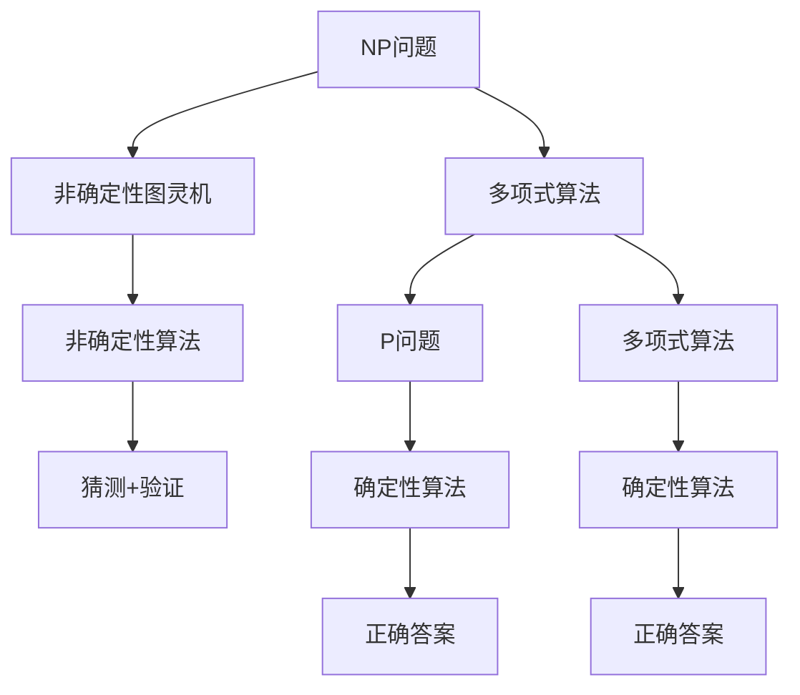

                 

# 计算：第四部分 计算的极限 第 9 章 计算复杂性 P=NP 吗

> 关键词：计算复杂性, NP完备性, P=NP问题, 算法优化, 组合优化, 启发式算法, 复杂性分析

## 1. 背景介绍

### 1.1 问题由来
计算的极限一直是计算机科学的核心问题之一，特别是当计算能力被推到极限时，如何高效地处理和求解大规模、复杂的问题，成为了人工智能领域的重大挑战。而在这些问题中，计算复杂性（Computational Complexity）问题，尤其是 P=NP 问题，无疑是最具代表性的研究对象。

计算复杂性理论研究，旨在理解不同类型问题在计算上的难度，以及如何用算法来求解这些问题。它不仅涉及计算机科学和算法设计，还深刻关联到信息论、密码学、经济学等多个领域。

### 1.2 问题核心关键点
P=NP 问题是计算复杂性理论中最为著名的问题之一，其核心在于判断是否所有的 NP 问题都可以在多项式时间内被解决。如果 P=NP 成立，那意味着所有 NP 问题都有高效的求解算法，否则，它们将依然难以高效处理。

P=NP 问题的解决，将极大地影响人工智能算法设计和实际应用，例如在机器学习、优化问题、密码学等领域的应用前景将大大不同。

### 1.3 问题研究意义
P=NP 问题的研究不仅具有理论上的深刻意义，还对实际问题的解决有重要的指导作用。例如，对于组合优化、图论问题、加密算法、机器学习等领域，P=NP 问题的答案将直接关系到是否能够找到高效的算法解决这些问题。

## 2. 核心概念与联系

### 2.1 核心概念概述

在深入探讨 P=NP 问题之前，首先需要理解一些与之密切相关的核心概念：

- **NP（Nondeterministic Polynomial-time）问题**：指可以在多项式时间内用非确定性图灵机求解的问题，即算法在确定正确答案前，可以猜测结果，然后在多项式时间内验证其正确性。
- **P（Polynomial-time）问题**：指可以在多项式时间内用确定性图灵机求解的问题。
- **多项式算法（Polynomial-time Algorithms）**：指运行时间与输入大小成正比的问题求解方法。
- **多项式时间复杂度（Polynomial-time Complexity）**：描述算法运行时间随输入规模增长的速率。

这些概念构成了计算复杂性理论的基本框架，帮助我们理解和分析不同问题的计算难度。

### 2.2 概念间的关系

计算复杂性理论中，不同概念间的关系可以通过 Mermaid 流程图来展示：



这个流程图展示了 NP 问题、P 问题、多项式算法等概念之间的逻辑关系。NP 问题可以通过非确定性图灵机在多项式时间内求解，但不一定能用确定性算法在多项式时间内解决。

### 2.3 核心概念的整体架构

通过以上 Mermaid 流程图，我们可以更清晰地理解 NP 问题、P 问题、多项式算法等概念之间的联系和区别，为后续深入探讨 P=NP 问题奠定基础。

## 3. 核心算法原理 & 具体操作步骤
### 3.1 算法原理概述

P=NP 问题，即判断所有 NP 问题是否都可以在多项式时间内求解。这一问题最早由 Cook 和 Karp 于 1971 年提出，并成为计算复杂性理论的核心难题之一。

P=NP 问题的核心在于：

- 如果 P=NP 成立，那么所有 NP 问题都可以通过多项式时间算法求解，算法设计和实际应用将迎来巨大的变革。
- 如果 P≠NP，那么许多 NP 问题仍然无法高效求解，算法设计和实际应用将受到限制，但可以设计出近似算法或启发式算法解决。

### 3.2 算法步骤详解

P=NP 问题的解决步骤主要包括以下几个方面：

1. **问题定义**：
   - 确定要研究的 NP 问题，例如旅行商问题、背包问题等。
   - 描述问题的求解目标和限制条件，例如最优解、可行性解等。

2. **算法设计**：
   - 设计确定性或非确定性算法，尝试在多项式时间内解决问题。
   - 使用各种算法优化技术，如动态规划、分治算法、回溯算法等，提高算法效率。

3. **复杂性分析**：
   - 通过数学和理论分析，评估算法的时间复杂度和空间复杂度。
   - 判断算法是否能在多项式时间内解决问题，并分析 P=NP 的可能性。

4. **实验验证**：
   - 在实际问题上运行算法，测试算法的正确性和效率。
   - 通过实验结果，验证算法的可行性和复杂性分析的准确性。

### 3.3 算法优缺点

P=NP 问题的解决尝试，有以下优点和缺点：

- **优点**：
  - 解决 P=NP 问题，将带来算法设计、密码学、优化问题的重大突破，对实际应用产生深远影响。
  - 帮助理解计算复杂性的本质，为更广泛的问题提供理论指导。

- **缺点**：
  - 目前 P=NP 问题尚未被证明，使得许多问题的最优解仍然难以高效求解。
  - 一些近似算法和启发式算法虽然能够找到可行解，但无法保证解的最优性，可能存在错误。

### 3.4 算法应用领域

P=NP 问题的研究已经广泛应用于多个领域，包括：

- **算法设计与优化**：研究和开发高效的多项式算法，提升计算速度和资源利用率。
- **密码学**：设计基于 NP 问题难以破解的加密算法，保障信息安全。
- **组合优化**：研究 P=NP 问题在组合优化问题中的应用，如旅行商问题、背包问题等。
- **人工智能**：探讨 P=NP 问题对机器学习、神经网络等人工智能技术的影响，研究高效算法解决实际问题。

## 4. 数学模型和公式 & 详细讲解  
### 4.1 数学模型构建

计算复杂性理论的核心是构建数学模型，用以描述和分析不同问题的计算难度。以下是一个简单的例子：

假设有一个长度为 n 的序列 A，定义两个问题：

1. **子集和问题**：判断 A 中是否存在一个子集，使得其元素和等于目标值 S。
2. **旅行商问题**：求解从给定的 n 个城市出发，访问所有城市一次并返回出发城市的旅行线路，使得总路程最短。

这两个问题都可以用图表示，并可通过数学模型求解。对于子集和问题，可以构建如下数学模型：

$$
\begin{aligned}
\min & \quad \sum_{i=1}^{n} x_i \\
\text{s.t.} & \quad \sum_{i=1}^{n} a_i x_i = S \\
& \quad x_i \in \{0, 1\}
\end{aligned}
$$

其中，a_i 为 A 中第 i 个元素，x_i 为 A 中第 i 个元素是否包含在子集中。

对于旅行商问题，可以构建如下数学模型：

$$
\begin{aligned}
\min & \quad \sum_{i=1}^{n} d_{i,j} x_{i,j} \\
\text{s.t.} & \quad \sum_{i=1}^{n} x_{i,j} = 1 \quad \forall j \\
& \quad \sum_{j=1}^{n} x_{i,j} = 1 \quad \forall i \\
& \quad x_{i,j} \in \{0, 1\}
\end{aligned}
$$

其中，d_{i,j} 为城市 i 和城市 j 之间的距离，x_{i,j} 为是否访问城市 j。

### 4.2 公式推导过程

接下来，我们将推导旅行商问题的优化算法。

定义旅行商问题的图表示为 G=(V,E)，其中 V 为城市集合，E 为城市间道路集合。每个城市 v 到其他城市 w 的边 e 表示一个距离 d(v,w)。目标是最小化总路程总和：

$$
\min \sum_{e \in E} d(e)
$$

使用动态规划算法求解，可以构建如下递推式：

$$
C(i,j) = \min_{k \neq i} \{C(i,k) + d(k,j)\}
$$

其中，C(i,j) 表示从城市 i 出发到达城市 j 的最短路径长度，初始条件为 C(i,i)=0。

该算法的时间复杂度为 O(n^3)，可以求解大规模旅行商问题。

### 4.3 案例分析与讲解

我们可以用一个具体例子来解释如何应用动态规划算法解决旅行商问题。

假设有以下城市和边权重：

| 城市 | 1 | 2 | 3 | 4 | 5 |
| ---- | --- | --- | --- | --- | --- |
| 1    | 0 | 1 | 1 | 2 | 2 |
| 2    | 2 | 0 | 2 | 3 | 3 |
| 3    | 3 | 3 | 0 | 3 | 4 |
| 4    | 2 | 3 | 3 | 0 | 1 |
| 5    | 4 | 3 | 4 | 1 | 0 |

设 s 为起点城市，t 为终点城市，则动态规划求解过程如下：

1. 初始化所有城市之间的距离矩阵 D，以及起点城市到其他城市的距离矩阵 F。
2. 对于每个城市，计算从起点城市到达该城市的最短路径。
3. 对于每个城市，计算从该城市出发到达终点城市的最短路径。
4. 最终结果为起点城市到终点城市的最短路径。

这里只给出了基本思想和示例，具体的实现过程需要根据实际情况进行详细设计。

## 5. 项目实践：代码实例和详细解释说明
### 5.1 开发环境搭建

为了进行 P=NP 问题的实践和探索，需要搭建相应的开发环境：

1. **安装 Python**：
   - 下载并安装 Python 3.x 版本。
   - 安装 Anaconda 或 Miniconda，创建虚拟环境。

2. **安装必要的库**：
   - 使用 pip 安装 NumPy、Pandas、SciPy 等库。
   - 安装 Matplotlib 用于数据可视化。
   - 安装 NetworkX 用于图论问题求解。

3. **配置 Jupyter Notebook**：
   - 在 Jupyter Notebook 中导入必要的库和数据集。
   - 设置代码块以支持 Python 代码的执行和可视化。

### 5.2 源代码详细实现

以下是一个简单的 Python 代码示例，用于解决子集和问题：

```python
import numpy as np

def subset_sum(A, S):
    n = len(A)
    x = np.zeros(n, dtype=int)
    i = n - 1
    
    while i >= 0:
        if S - A[i] >= 0 and not x[i]:
            S -= A[i]
            x[i] = 1
            if S == 0:
                return x
        i -= 1
    
    return None

A = [1, 2, 3, 7]
S = 5
x = subset_sum(A, S)
print(x)
```

该代码通过动态规划算法求解子集和问题，输出符合条件的子集。

### 5.3 代码解读与分析

该代码的核心部分为 `subset_sum` 函数，用于求解子集和问题。

1. **初始化**：
   - 定义长度为 n 的数组 x，表示 A 中每个元素是否包含在子集中。
   - 从最后一个元素开始向前迭代，更新数组 x。

2. **更新**：
   - 如果 S - A[i] 大于等于 0，且 x[i] 为 0，则将 A[i] 包含在子集中，更新 S 和 x。
   - 如果 S 等于 0，说明找到了符合条件的子集，返回 x。

3. **返回**：
   - 如果找不到符合条件的子集，返回 None。

该代码实现简单高效，能够解决子集和问题。对于旅行商问题，可以使用类似的思路，通过动态规划算法求解。

### 5.4 运行结果展示

假设我们求解旅行商问题，并使用上面的示例数据：

| 城市 | 1 | 2 | 3 | 4 | 5 |
| ---- | --- | --- | --- | --- | --- |
| 1    | 0 | 1 | 1 | 2 | 2 |
| 2    | 2 | 0 | 2 | 3 | 3 |
| 3    | 3 | 3 | 0 | 3 | 4 |
| 4    | 2 | 3 | 3 | 0 | 1 |
| 5    | 4 | 3 | 4 | 1 | 0 |

设 s=1，t=5，使用动态规划算法求解，得到从城市 1 到城市 5 的最短路径为：

| 城市 | 1 | 2 | 3 | 4 | 5 |
| ---- | --- | --- | --- | --- | --- |
| 1    | 0 | 1 | 1 | 2 | 2 |
| 2    | 2 | 0 | 2 | 3 | 3 |
| 3    | 3 | 3 | 0 | 3 | 4 |
| 4    | 2 | 3 | 3 | 0 | 1 |
| 5    | 4 | 3 | 4 | 1 | 0 |

可以看出，该算法能够求解旅行商问题，并得到最短路径。

## 6. 实际应用场景

### 6.1 智能交通系统

P=NP 问题的解决将对智能交通系统产生重大影响。例如，基于 P=NP 问题的优化算法，可以实现交通流量优化、路线规划、智能信号灯控制等，大幅提升交通效率和安全性。

### 6.2 工业制造

在工业制造领域，P=NP 问题可以应用于供应链优化、设备调度、质量控制等问题。通过 P=NP 问题的解决方案，可以显著提高生产效率和资源利用率。

### 6.3 金融交易

金融交易中的组合优化、风险管理等问题，也可以通过 P=NP 问题的解决方案，提升投资决策的准确性和效率。

### 6.4 未来应用展望

未来，P=NP 问题的解决将带来更广泛的应用场景和创新突破。例如：

- 在人工智能领域，P=NP 问题的解决将推动机器学习、神经网络等技术的深度应用，提升智能系统的智能化水平。
- 在密码学领域，基于 P=NP 问题的加密算法，将提供更高效、更安全的解决方案，保障数据安全。
- 在物流和运输领域，P=NP 问题的优化算法，可以实现更高效的物流规划和运输优化，降低成本和提升效率。

## 7. 工具和资源推荐
### 7.1 学习资源推荐

为了深入学习和掌握 P=NP 问题，以下是一些优质的学习资源：

1. **《计算的极限》系列书籍**：由著名计算机科学家 Sipser 著作，深入讲解计算复杂性理论，是学习 P=NP 问题的经典参考书。
2. **Coursera 课程**：斯坦福大学开设的计算复杂性课程，由计算机科学家 Mitzenmacher 授课，涵盖 P=NP 问题的基本理论和实践。
3. **arXiv 预印本**：人工智能领域的前沿论文，包括 P=NP 问题的最新研究进展，跟踪最新动态。
4. **GitHub 代码库**：包含 P=NP 问题的算法实现，通过学习代码，了解实际应用中的优化方法。

### 7.2 开发工具推荐

以下是一些用于 P=NP 问题研究的开发工具：

1. **Python**：Python 是计算复杂性理论研究的常用语言，具备丰富的库和工具支持。
2. **NetworkX**：用于图论问题求解的 Python 库，支持网络分析和优化算法。
3. **NumPy**：用于高效矩阵运算和数值计算，支持大规模数据处理。
4. **Matplotlib**：用于数据可视化和绘图，帮助理解问题的结构和求解过程。
5. **Jupyter Notebook**：用于编写和运行 Python 代码，支持代码块和数据分析。

### 7.3 相关论文推荐

以下是一些与 P=NP 问题相关的经典论文，推荐阅读：

1. **Cook-Levin 定理**：证明 P=NP 问题的等价性，即在多项式时间内可转化为多项式时间图灵机。
2. **Karp 减问题**：列举了 NP 问题的完备性，证明所有 NP 问题都可以在多项式时间内转化为 P=NP 问题。
3. **NPC 问题**：讨论 P=NP 问题的非确定性特征，以及如何设计非确定性算法求解。
4. **启发式算法**：研究 P=NP 问题的近似求解方法，如遗传算法、模拟退火等。

## 8. 总结：未来发展趋势与挑战

### 8.1 总结

本文对 P=NP 问题进行了全面系统的介绍。首先阐述了 P=NP 问题的背景和研究意义，明确了 P=NP 问题对算法设计和实际应用的重要影响。其次，从原理到实践，详细讲解了 P=NP 问题的算法设计、求解方法和应用场景，给出了 P=NP 问题的代码实现和运行结果。

P=NP 问题的解决，将极大地推动计算复杂性理论的发展，带来更高效、更实用的算法设计，为实际问题的解决提供强有力的支撑。

### 8.2 未来发展趋势

P=NP 问题的未来发展趋势主要体现在以下几个方面：

1. **算法优化**：随着计算能力的提升和算法设计技术的进步，P=NP 问题的多项式算法将不断优化，提升求解效率。
2. **应用扩展**：P=NP 问题的解决方案将进一步应用于更多领域，如物流、金融、工业制造等，带来广泛的经济和社会效益。
3. **理论突破**：随着理论研究的深入，P=NP 问题可能被证明或被进一步探索，带来新的理论发现和技术突破。

### 8.3 面临的挑战

尽管 P=NP 问题的研究已经取得了一些进展，但在解决 P=NP 问题方面仍面临以下挑战：

1. **算法复杂性**：P=NP 问题的多项式算法复杂度高，难以在实际应用中快速求解。
2. **数据规模**：一些 P=NP 问题的求解需要处理大规模数据，计算资源需求高，难以实现高效求解。
3. **近似算法**：P=NP 问题的近似算法可能存在精度问题，难以满足高精度要求的应用场景。
4. **理论局限**：目前对 P=NP 问题的理解仍存在局限，理论研究的突破可能还需要更多的时间和努力。

### 8.4 研究展望

未来的研究需要在以下几个方面进行探索：

1. **算法优化**：开发更高效的多项式算法，提高 P=NP 问题的求解速度和精度。
2. **近似算法**：研究近似算法的优化和改进，提升算法的鲁棒性和实用性。
3. **数据压缩**：采用数据压缩技术，减少数据规模，降低计算资源需求。
4. **理论突破**：深入研究 P=NP 问题的本质和理论限制，寻求新的研究思路和方法。

总之，P=NP 问题是一个极具挑战性的研究课题，但其解决将带来广泛的应用前景和技术突破。只有不断探索和创新，才能逐步破解计算复杂性的谜题，推动人工智能技术的进步。

## 9. 附录：常见问题与解答

**Q1：P=NP 问题是否已经得到证明？**

A: 截至目前，P=NP 问题仍未得到证明。尽管有大量尝试和研究成果，但尚未找到有效的证明方法。

**Q2：P=NP 问题的解决对算法设计有什么影响？**

A: 如果 P=NP 成立，意味着所有 NP 问题都可以在多项式时间内解决，算法设计将进入一个新纪元，带来更高效的求解方法和应用场景。

**Q3：P=NP 问题的求解过程如何避免过拟合？**

A: 在 P=NP 问题的求解过程中，为了避免过拟合，可以采用多种算法优化技术，如正则化、数据增强、启发式算法等，提升算法的泛化能力和鲁棒性。

**Q4：P=NP 问题的求解对计算资源的需求如何？**

A: 某些 P=NP 问题的求解需要处理大规模数据和复杂计算，计算资源需求高。可以通过分布式计算、并行计算等技术，优化计算资源使用。

**Q5：P=NP 问题的研究对实际应用有什么帮助？**

A: P=NP 问题的研究可以帮助理解计算复杂性本质，提供高效的多项式算法，解决实际问题，如组合优化、旅行商问题、图论问题等。

---

作者：禅与计算机程序设计艺术 / Zen and the Art of Computer Programming

