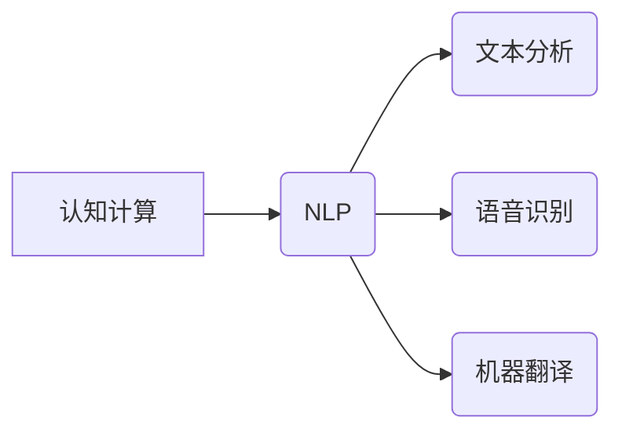
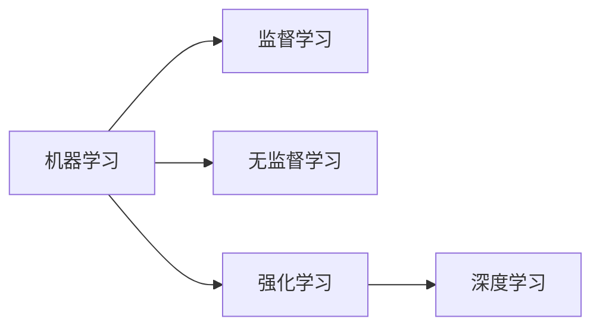
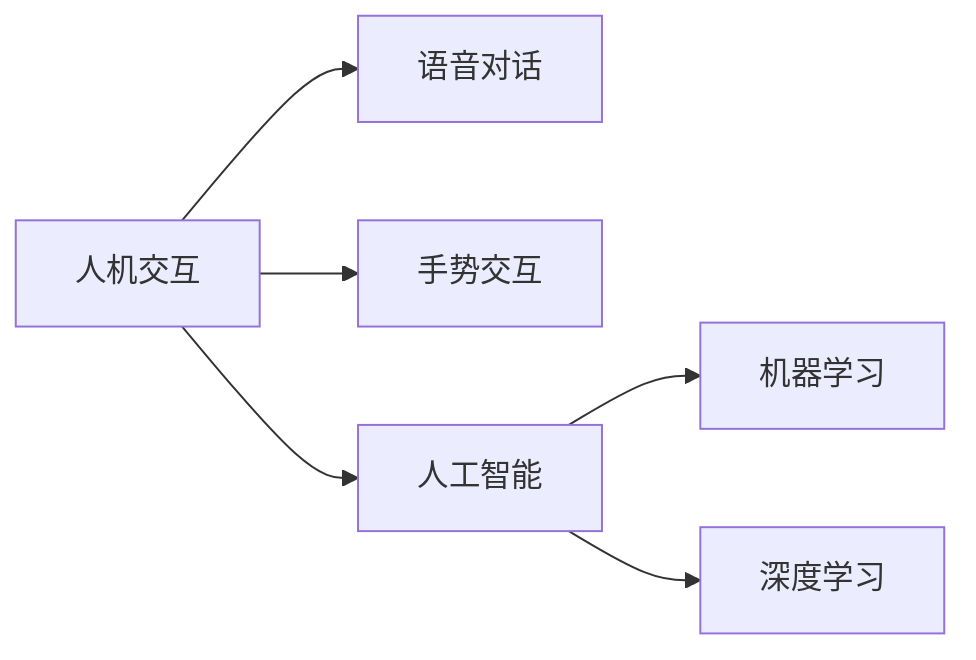

# 图灵测试已死,软件2.0模糊了人机边界

> 关键词：图灵测试，人工智能，软件2.0，人机交互，认知计算，自然语言处理，机器学习，深度学习，人机融合

## 1. 背景介绍
### 1.1 图灵测试的起源与挑战

图灵测试，由计算机科学的先驱艾伦·图灵在1950年提出，是一种评估机器是否具有人类智能的测试。测试的基本思想是，一个人类评判者通过与一个机器和一个人类进行文字对话，试图判断哪一个是机器，哪一个是人类。如果评判者无法准确地区分出机器和人类，那么机器就被认为通过了图灵测试，具有人类水平的智能。

然而，随着时间的推移，图灵测试的局限性逐渐显现。首先，图灵测试主要关注机器的对话能力，而忽略了机器在感知、推理、情感等方面的能力。其次，图灵测试依赖于人类评判者的主观判断，容易受到个人偏见和情感的影响。最后，图灵测试缺乏对机器智能内在机制的评价，难以衡量机器智能的深度和广度。

### 1.2 软件2.0时代的到来

随着互联网、云计算、大数据等技术的快速发展，软件行业正迈入2.0时代。软件2.0强调软件的智能化、个性化、场景化，以及与人类用户更加紧密的交互。在这个时代，软件不再仅仅是程序和代码的集合，而是成为连接人与服务、人与机器的桥梁。

软件2.0时代的到来，模糊了人机边界，使得人机交互变得更加自然、流畅。机器学习、深度学习等人工智能技术的应用，使得软件能够更好地理解用户需求，提供更加精准的服务。

### 1.3 本文结构

本文将从以下方面探讨图灵测试的局限性、软件2.0时代人机交互的新趋势，以及未来人机融合的可能路径：

- 第二部分：分析图灵测试的局限性，探讨认知计算和自然语言处理在评估机器智能方面的潜力。
- 第三部分：介绍软件2.0时代人机交互的新趋势，包括智能客服、虚拟助手、人机协同等。
- 第四部分：探讨未来人机融合的可能路径，包括人工智能的伦理、人机协同的商业模式等。
- 第五部分：总结全文，展望人机融合的未来发展趋势与挑战。

## 2. 核心概念与联系
### 2.1 认知计算与自然语言处理

认知计算是一种模拟人类大脑处理信息的方式的人工智能技术。它强调对数据的理解和解释，而不是简单的模式识别。认知计算的核心是知识表示和推理，它能够帮助机器理解语言、图像、声音等复杂信息，并在此基础上进行决策。

自然语言处理（NLP）是认知计算的一个重要分支，它旨在使计算机能够理解、解释和生成人类语言。NLP技术包括文本分析、语音识别、机器翻译等，它们在软件2.0时代的人机交互中发挥着重要作用。

以下是认知计算和自然语言处理之间的Mermaid流程图：



### 2.2 机器学习与深度学习

机器学习是一种使计算机能够从数据中学习并做出决策或预测的技术。它包括监督学习、无监督学习和强化学习等不同类型。深度学习是机器学习的一个子领域，它使用人工神经网络来模拟人类大脑的学习过程。

以下是机器学习和深度学习之间的Mermaid流程图：



### 2.3 人机交互与人工智能

人机交互是研究如何设计出易于人类与机器交流的系统的学科。随着人工智能技术的发展，人机交互变得越来越自然，用户可以与机器进行语音对话、手势交互等。

以下是人机交互和人工智能之间的Mermaid流程图：



## 3. 核心算法原理 & 具体操作步骤
### 3.1 算法原理概述

认知计算和自然语言处理的核心算法原理是模拟人类大脑的学习和推理过程。以下是几个关键步骤：

1. **知识表示**：将知识以结构化的形式表示出来，以便计算机能够理解和处理。
2. **推理**：根据已知的知识和规则，推导出新的结论或事实。
3. **学习**：通过学习大量的数据，改进知识表示和推理能力。
4. **语言理解**：理解自然语言文本的意义和结构。
5. **语言生成**：生成符合语法和语义的自然语言文本。

### 3.2 算法步骤详解

1. **知识表示**：使用知识图谱、本体等结构化表示知识。
2. **推理**：使用推理引擎根据知识表示进行推理。
3. **学习**：使用机器学习算法从数据中学习新的知识。
4. **语言理解**：使用NLP技术分析文本，提取语义信息。
5. **语言生成**：使用NLP技术生成符合语法和语义的自然语言文本。

### 3.3 算法优缺点

认知计算和自然语言处理算法的优点是能够模拟人类大脑的学习和推理过程，但同时也存在一些缺点：

- **复杂性**：算法复杂度高，需要大量的计算资源。
- **可解释性**：算法的决策过程难以解释。
- **泛化能力**：在处理未见过的数据时，可能表现出较差的泛化能力。

### 3.4 算法应用领域

认知计算和自然语言处理算法在以下领域有广泛的应用：

- **智能客服**：自动回答用户的问题，提供客户服务。
- **虚拟助手**：帮助用户完成各种任务，如日程管理、信息检索等。
- **人机协同**：与人类专家协同工作，提高工作效率。
- **语言翻译**：将一种语言翻译成另一种语言。

## 4. 数学模型和公式 & 详细讲解 & 举例说明
### 4.1 数学模型构建

认知计算和自然语言处理的数学模型通常包括以下部分：

- **知识表示**：如知识图谱，使用图结构表示知识。
- **推理**：如逻辑推理，使用推理规则进行推理。
- **学习**：如神经网络，使用数据训练模型。
- **语言理解**：如词嵌入，将文本转换为向量表示。
- **语言生成**：如序列到序列模型，生成文本。

### 4.2 公式推导过程

以下是一些常见的数学公式：

- **词嵌入**：$v_w = \mathrm{Word2Vec}(w)$
- **神经网络激活函数**：$\sigma(x) = \frac{1}{1+e^{-x}}$
- **损失函数**：$\mathcal{L}(y, \hat{y}) = \frac{1}{2}(y - \hat{y})^2$

### 4.3 案例分析与讲解

以下是一个使用词嵌入和神经网络进行情感分析的案例：

1. **数据预处理**：将文本数据预处理为词嵌入向量。
2. **模型训练**：使用神经网络模型训练词嵌入向量。
3. **情感分类**：使用训练好的模型对新的文本数据进行情感分类。

## 5. 项目实践：代码实例和详细解释说明
### 5.1 开发环境搭建

以下是使用Python进行自然语言处理项目实践的开发环境搭建步骤：

1. 安装Anaconda：
   ```bash
   conda create -n nlp-env python=3.8
   conda activate nlp-env
   ```
2. 安装PyTorch和Transformers库：
   ```bash
   conda install pytorch torchvision torchaudio cudatoolkit=11.1 -c pytorch -c conda-forge
   pip install transformers
   ```

### 5.2 源代码详细实现

以下是一个简单的情感分析代码实例：

```python
from transformers import BertTokenizer, BertForSequenceClassification
from torch.utils.data import DataLoader, Dataset
import torch

class SentimentDataset(Dataset):
    def __init__(self, texts, labels):
        self.texts = texts
        self.labels = labels
        self.tokenizer = BertTokenizer.from_pretrained('bert-base-uncased')

    def __len__(self):
        return len(self.texts)

    def __getitem__(self, item):
        text = self.texts[item]
        inputs = self.tokenizer(text, return_tensors='pt', padding=True, truncation=True)
        label = self.labels[item]
        return inputs, label

def train(model, data_loader, optimizer, device):
    model.train()
    total_loss = 0
    for batch in data_loader:
        inputs, labels = batch
        inputs, labels = inputs.to(device), labels.to(device)
        optimizer.zero_grad()
        outputs = model(**inputs)
        loss = outputs.loss
        loss.backward()
        optimizer.step()
        total_loss += loss.item()
    return total_loss / len(data_loader)

# 模型、优化器、数据加载等代码略...

# 训练模型
for epoch in range(epochs):
    loss = train(model, data_loader, optimizer, device)
    print(f"Epoch {epoch+1}, loss: {loss:.3f}")
```

### 5.3 代码解读与分析

以上代码展示了使用PyTorch和Transformers库进行情感分析的基本流程：

1. **数据预处理**：使用`SentimentDataset`类加载和预处理文本数据。
2. **模型训练**：定义训练函数`train`，使用模型、数据加载器、优化器和设备进行模型训练。
3. **模型评估**：使用测试集评估模型性能。

## 6. 实际应用场景
### 6.1 智能客服

智能客服是软件2.0时代的一个重要应用场景。通过使用自然语言处理和认知计算技术，智能客服能够自动回答用户的问题，提供24小时不间断的服务。

### 6.2 虚拟助手

虚拟助手是另一个重要的应用场景。它可以帮助用户完成各种任务，如日程管理、信息检索等。

### 6.3 人机协同

人机协同是软件2.0时代的另一个趋势。通过使用认知计算和自然语言处理技术，机器可以更好地理解人类的需求，并与之协同工作。

## 7. 工具和资源推荐
### 7.1 学习资源推荐

以下是一些学习认知计算和自然语言处理的学习资源：

- 《深度学习》
- 《自然语言处理综论》
- 《认知计算导论》

### 7.2 开发工具推荐

以下是一些开发认知计算和自然语言处理的项目工具：

- PyTorch
- TensorFlow
- Transformers库

### 7.3 相关论文推荐

以下是一些与认知计算和自然语言处理相关的论文：

- "Word2Vec: A Novel Word Representation Method"
- "BERT: Pre-training of Deep Bidirectional Transformers for Language Understanding"
- "Transformers: State-of-the-Art General Language Modeling"

## 8. 总结：未来发展趋势与挑战
### 8.1 研究成果总结

认知计算和自然语言处理技术的发展，为软件2.0时代的人机交互提供了强大的技术支持。通过模拟人类大脑的学习和推理过程，机器能够更好地理解人类，并提供更加智能的服务。

### 8.2 未来发展趋势

未来，认知计算和自然语言处理技术将朝着以下方向发展：

- **更强大的语言理解能力**：机器将能够更好地理解人类语言，包括语境、隐喻、双关语等。
- **更复杂的认知能力**：机器将能够进行更复杂的认知任务，如推理、决策、情感分析等。
- **更广泛的应用场景**：认知计算和自然语言处理技术将在更多领域得到应用，如医疗、教育、金融等。

### 8.3 面临的挑战

认知计算和自然语言处理技术面临着以下挑战：

- **算法复杂性**：算法复杂度高，需要大量的计算资源。
- **数据标注成本**：高质量的数据标注成本高，难以满足训练需求。
- **可解释性**：算法的决策过程难以解释。

### 8.4 研究展望

未来，认知计算和自然语言处理技术的研究将朝着以下方向展开：

- **开发更高效的算法**：降低算法复杂度，提高计算效率。
- **降低数据标注成本**：探索无监督学习和半监督学习技术，减少对标注数据的依赖。
- **提高可解释性**：开发可解释的算法，提高算法的透明度和可信度。

## 9. 附录：常见问题与解答
### 9.1 常见问题

**Q1：什么是认知计算？**

A1：认知计算是一种模拟人类大脑处理信息的方式的人工智能技术。它强调对数据的理解和解释，而不是简单的模式识别。

**Q2：什么是自然语言处理？**

A2：自然语言处理（NLP）是认知计算的一个重要分支，它旨在使计算机能够理解、解释和生成人类语言。

**Q3：图灵测试为什么已死？**

A3：图灵测试主要关注机器的对话能力，而忽略了机器在感知、推理、情感等方面的能力。此外，图灵测试依赖于人类评判者的主观判断，容易受到个人偏见和情感的影响。

### 9.2 解答

**A1：认知计算的核心是知识表示和推理，它能够帮助机器理解、解释和生成人类语言，并在此基础上进行决策。**

**A2：自然语言处理（NLP）包括文本分析、语音识别、机器翻译等，它们在软件2.0时代的人机交互中发挥着重要作用。**

**A3：图灵测试主要关注机器的对话能力，而忽略了机器在感知、推理、情感等方面的能力。此外，图灵测试依赖于人类评判者的主观判断，容易受到个人偏见和情感的影响。**

作者：禅与计算机程序设计艺术 / Zen and the Art of Computer Programming