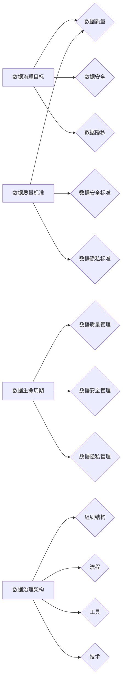

> 数据治理, 数据质量, 软件质量, 数据驱动, 数据隐私, 数据安全, 软件治理, 数据生命周期, 数据质量标准

# 数据乱象丛生,软件2.0呼唤数据治理

在数字化转型的浪潮中，数据已经成为企业最宝贵的资产之一。然而，随着数据量的激增和复杂性的提升，数据乱象也随之而来。数据质量问题、数据隐私泄露、数据安全问题层出不穷，成为制约企业发展的瓶颈。软件2.0时代，我们需要重新审视数据治理，以确保数据的价值最大化，同时保障数据的合法权益。

## 1. 背景介绍

### 1.1 数据爆炸与数据质量问题

随着物联网、移动互联网、大数据等技术的飞速发展，企业产生了海量的数据。这些数据包含了用户行为、市场趋势、业务流程等宝贵信息，是企业决策和业务创新的重要依据。然而，数据量的激增也带来了数据质量问题，如数据缺失、数据重复、数据不一致、数据不准确等。

### 1.2 数据隐私与安全问题

在数据驱动的时代，数据隐私和安全成为公众关注的焦点。随着GDPR、CCPA等数据保护法规的出台，企业需要更加重视数据隐私和安全问题，避免因数据泄露造成严重的法律和商业风险。

### 1.3 软件治理的转型

传统的软件治理体系主要关注软件开发生命周期管理，而软件2.0时代，软件治理需要从软件开发扩展到数据治理，构建全方位的数据治理体系，以确保数据质量、数据安全和数据隐私。

## 2. 核心概念与联系

### 2.1 数据治理

数据治理是指通过制定、执行和维护数据政策和程序，确保数据质量、数据安全和数据隐私，从而最大化数据价值的全过程。数据治理的核心目标包括：

- 数据质量：确保数据的准确性、完整性、一致性和可靠性。
- 数据安全：保护数据免受未经授权的访问、使用、披露、破坏、修改或删除。
- 数据隐私：确保个人隐私数据的合法收集、使用、存储和处理。

### 2.2 数据质量标准

数据质量标准是衡量数据质量的标准和规范，包括数据完整性、准确性、一致性、可用性、及时性、可追溯性等方面。

### 2.3 数据生命周期

数据生命周期是指数据从产生、存储、处理、分析到最终删除的整个过程。数据生命周期管理是数据治理的重要组成部分，包括数据质量管理、数据安全管理和数据隐私管理。

### 2.4 数据治理架构

数据治理架构是指数据治理的组织结构、流程、工具和技术。数据治理架构需要涵盖数据治理的各个环节，确保数据治理的有效实施。



## 3. 核心算法原理 & 具体操作步骤

### 3.1 算法原理概述

数据治理的核心算法主要涉及数据质量评估、数据清洗、数据脱敏、数据加密等。

- 数据质量评估：通过构建数据质量评估模型，对数据进行质量评分，识别出数据质量问题。
- 数据清洗：通过数据清洗算法，对数据进行去重、纠错、填充等操作，提高数据质量。
- 数据脱敏：通过数据脱敏算法，对敏感数据进行加密或掩码处理，保护数据隐私。
- 数据加密：通过数据加密算法，对数据进行加密存储和传输，保障数据安全。

### 3.2 算法步骤详解

#### 数据质量评估

1. 数据预处理：对原始数据进行清洗、去噪、标准化等操作，为评估做准备。
2. 构建评估指标：根据数据质量标准，构建相应的评估指标，如准确性、完整性、一致性等。
3. 评估模型训练：使用训练数据训练评估模型，将评估指标与实际数据对比，计算评估分数。
4. 评估结果分析：分析评估结果，识别出数据质量问题。

#### 数据清洗

1. 数据识别：识别出数据中的异常值、缺失值、重复值等。
2. 数据处理：根据数据类型和问题类型，选择相应的处理方法，如去重、填充、替换等。
3. 数据验证：验证处理后的数据质量，确保数据清洗效果。

#### 数据脱敏

1. 数据识别：识别出敏感数据字段，如身份证号码、电话号码等。
2. 数据脱敏处理：根据数据脱敏策略，对敏感数据进行加密或掩码处理。
3. 数据验证：验证脱敏效果，确保敏感数据安全。

#### 数据加密

1. 选择加密算法：选择合适的加密算法，如AES、RSA等。
2. 加密过程：对数据进行加密处理。
3. 解密过程：对加密数据进行解密处理。

### 3.3 算法优缺点

#### 数据质量评估

优点：能够全面评估数据质量，为数据治理提供依据。

缺点：评估模型复杂，计算量大，需要大量训练数据。

#### 数据清洗

优点：能够有效提高数据质量。

缺点：需要根据具体问题选择合适的处理方法，处理效果受限于人工经验。

#### 数据脱敏

优点：能够保护敏感数据，避免数据泄露。

缺点：处理过程复杂，可能影响数据使用。

#### 数据加密

优点：能够保障数据安全。

缺点：加密和解密过程复杂，需要额外的计算资源。

### 3.4 算法应用领域

数据治理算法在各个领域都有广泛的应用，如：

- 金融行业：用于信用卡欺诈检测、风险管理等。
- 医疗行业：用于医疗数据质量评估、患者隐私保护等。
- 电商行业：用于用户行为分析、精准营销等。
- 政府部门：用于电子政务、数据安全监管等。

## 4. 数学模型和公式 & 详细讲解 & 举例说明

### 4.1 数学模型构建

#### 数据质量评估

数据质量评估模型通常采用机器学习算法，如随机森林、决策树等。以下是一个基于随机森林的数据质量评估模型的数学公式：

$$
Q(x) = \sum_{i=1}^n w_i f(x) 
$$

其中，$Q(x)$ 为数据样本 $x$ 的质量评分，$w_i$ 为第 $i$ 个特征权重，$f(x)$ 为第 $i$ 个特征的评分函数。

#### 数据清洗

数据清洗过程中，常用的数学模型包括：

- 填充缺失值：使用均值、中位数、众数等方法填充缺失值。

$$
x_{\text{imputed}} = \text{median}(x) 
$$

- 去重：使用哈希函数对数据进行去重。

$$
h(x) = \text{hash}(x) 
$$

#### 数据脱敏

数据脱敏过程中，常用的数学模型包括：

- 数据加密：使用AES加密算法对数据进行加密。

$$
c = \text{AES\_encrypt}(k, p) 
$$

其中，$c$ 为加密后的数据，$k$ 为加密密钥，$p$ 为原始数据。

### 4.2 公式推导过程

#### 数据质量评估

数据质量评估模型的推导过程如下：

1. 构建特征工程：根据数据质量标准，选择合适的特征。
2. 训练评估模型：使用训练数据训练评估模型，得到特征权重。
3. 评估数据样本：使用评估模型对数据样本进行评分。

### 4.3 案例分析与讲解

#### 案例一：金融行业信用卡欺诈检测

在金融行业中，信用卡欺诈检测是数据治理的重要应用场景。通过构建数据质量评估模型，对交易数据进行质量评分，识别出异常交易，从而降低欺诈风险。

1. 特征工程：选择交易金额、交易时间、商户类型等特征。
2. 训练评估模型：使用历史交易数据训练评估模型。
3. 评估数据样本：对实时交易数据进行评分，识别异常交易。

#### 案例二：医疗行业患者隐私保护

在医疗行业中，患者隐私保护是数据治理的关键问题。通过数据脱敏技术，对医疗数据进行脱敏处理，保护患者隐私。

1. 数据识别：识别出敏感数据字段，如患者姓名、身份证号码等。
2. 数据脱敏处理：对敏感数据进行加密或掩码处理。
3. 数据验证：验证脱敏效果，确保敏感数据安全。

## 5. 项目实践：代码实例和详细解释说明

### 5.1 开发环境搭建

为了演示数据治理技术在实践中的应用，以下是一个基于Python的数据治理项目实践案例。

1. 安装必要的库：

```bash
pip install pandas numpy scikit-learn pandas-profiling
```

2. 读取数据：

```python
import pandas as pd

data = pd.read_csv('data.csv')
```

### 5.2 源代码详细实现

```python
from pandas_profiling import ProfileReport

# 分析数据质量
profile = ProfileReport(data, title='Pandas Profiling Report', explorative=True)
profile.to_html('profile_report.html')

# 数据清洗
data = data.dropna()  # 删除缺失值
data = data.drop_duplicates()  # 删除重复值

# 数据脱敏
data['id'] = data['id'].apply(lambda x: 'xxxxxxxx')  # 对ID字段进行脱敏

# 数据加密
from cryptography.fernet import Fernet

key = Fernet.generate_key()
cipher_suite = Fernet(key)
data['password'] = cipher_suite.encrypt(data['password'].values)
```

### 5.3 代码解读与分析

以上代码展示了如何使用Python进行数据治理实践。首先，使用Pandas Profiling对数据进行质量分析，识别出数据质量问题。然后，对数据缺失、重复等问题进行清洗。接着，对敏感数据字段进行脱敏处理，保护数据隐私。最后，对密码字段进行加密，保障数据安全。

### 5.4 运行结果展示

运行上述代码后，会生成一个HTML文件，展示数据质量分析报告。同时，数据质量得到提升，敏感数据得到保护，数据安全得到保障。

## 6. 实际应用场景

### 6.1 金融行业

在金融行业中，数据治理可以应用于：

- 信用卡欺诈检测
- 信用评分
- 贷款风险管理
- 交易监控

### 6.2 医疗行业

在医疗行业中，数据治理可以应用于：

- 患者隐私保护
- 医疗数据质量评估
- 医疗数据分析
- 疾病预测

### 6.3 电商行业

在电商行业中，数据治理可以应用于：

- 用户行为分析
- 精准营销
- 跨渠道营销
- 售后服务

### 6.4 未来应用展望

随着数据治理技术的不断发展，未来数据治理将在更多领域得到应用，如：

- 政府：电子政务、数据安全监管
- 教育：学生数据管理、教育数据分析
- 能源：能源消耗监测、能源优化
- 交通：交通流量监测、智能交通管理

## 7. 工具和资源推荐

### 7.1 学习资源推荐

- 《数据治理：理论与实践》
- 《数据治理方法与工具》
- 《数据治理实践指南》
- 《大数据时代：数据治理的挑战与机遇》

### 7.2 开发工具推荐

- Pandas
- NumPy
- scikit-learn
- Pandas Profiling
- Databricks

### 7.3 相关论文推荐

- "Data Governance: An Overview of Concepts, Processes, and Systems"
- "Data Governance: The Next Big Thing for Data-Driven Organizations"
- "Data Quality Metrics: A Literature Review"
- "Data Governance for Big Data"

## 8. 总结：未来发展趋势与挑战

### 8.1 研究成果总结

数据治理技术已经取得了显著的成果，为企业和组织带来了巨大的价值。然而，随着数据量的不断增长和数据治理的复杂性提升，未来数据治理技术仍面临诸多挑战。

### 8.2 未来发展趋势

- 数据治理框架将更加完善，实现数据治理的全生命周期管理。
- 数据治理技术将更加智能化，利用人工智能技术提高数据治理效率和效果。
- 数据治理将与云计算、大数据等技术深度融合，实现数据治理的云化、平台化。

### 8.3 面临的挑战

- 数据治理技术复杂，需要跨部门协作，提高数据治理的推广难度。
- 数据治理技术不断发展，需要持续学习和更新知识。
- 数据治理法规不断变化，需要企业及时调整数据治理策略。

### 8.4 研究展望

未来，数据治理技术的研究将重点关注以下方向：

- 数据治理标准化：制定统一的数据治理标准和规范。
- 数据治理智能化：利用人工智能技术提高数据治理效率和效果。
- 数据治理安全化：保障数据治理过程中的数据安全和隐私。

## 9. 附录：常见问题与解答

**Q1：数据治理的目的是什么？**

A：数据治理的目的是确保数据质量、数据安全和数据隐私，从而最大化数据价值。

**Q2：数据治理的主要挑战是什么？**

A：数据治理的主要挑战包括数据质量问题、数据安全问题、数据隐私问题、数据治理技术复杂等。

**Q3：数据治理与数据质量管理有什么区别？**

A：数据治理是一个全面的管理体系，包括数据质量、数据安全、数据隐私等方面。数据质量管理是数据治理的一个方面，主要关注数据的准确性、完整性、一致性等。

**Q4：如何提高数据治理的效率？**

A：提高数据治理效率的方法包括：

- 建立数据治理组织架构，明确职责分工。
- 制定数据治理流程，规范数据治理工作。
- 利用数据治理工具，提高数据治理效率。
- 加强数据治理培训，提高数据治理人员的素质。

**Q5：数据治理对企业的价值有哪些？**

A：数据治理对企业的价值包括：

- 提高数据质量，为业务决策提供可靠依据。
- 降低数据安全风险，保障企业合法权益。
- 优化业务流程，提高企业运营效率。
- 增强企业竞争力，推动企业创新发展。

作者：禅与计算机程序设计艺术 / Zen and the Art of Computer Programming