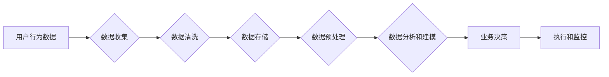

> 数据分析、平台经济、效率提升、效益增长、机器学习、预测建模、客户洞察、运营优化

# 数据分析在平台经济中的应用：如何提升效率和效益？

随着互联网和移动互联网的普及，平台经济已经成为当前经济发展的重要驱动力。平台经济通过连接供需双方，提供交易便利，降低交易成本，促进了资源的优化配置和经济的快速增长。然而，随着平台规模的不断扩大和业务复杂性的增加，如何有效地利用数据分析提升平台经济的效率和效益，成为了一个亟待解决的问题。

## 1. 背景介绍

### 1.1 平台经济的兴起

平台经济是指通过互联网平台，连接供需双方，实现商品和服务交易的商业模式。平台经济的兴起得益于以下几个因素：

- 互联网的普及：互联网的普及为平台经济提供了基础设施，使得信息传播和交易成本大幅降低。
- 移动互联网的兴起：移动互联网的兴起为平台经济提供了新的增长动力，使得用户可以随时随地通过手机等移动设备进行交易。
- 数据技术的进步：大数据、云计算、人工智能等技术的发展，为平台经济提供了强大的数据分析和技术支持。

### 1.2 数据分析在平台经济中的重要性

数据分析是平台经济中的重要组成部分，它可以帮助平台企业：

- 了解用户行为，提供个性化服务。
- 优化产品和服务，提高用户满意度。
- 降低运营成本，提高效益。
- 发现市场机会，推动业务增长。

### 1.3 本文结构

本文将围绕数据分析在平台经济中的应用展开，从核心概念、算法原理、数学模型、项目实践、实际应用场景、未来展望等方面进行详细阐述。

## 2. 核心概念与联系

### 2.1 核心概念

#### 2.1.1 平台经济

平台经济是一种新型的商业模式，通过搭建平台连接供需双方，实现商品和服务的交易。平台经济的特点包括：

- 交易成本低：通过互联网平台，交易双方可以快速找到对方，降低交易成本。
- 交易效率高：平台经济通过优化交易流程，提高交易效率。
- 灵活性和多样性：平台经济可以容纳不同类型的商品和服务，满足用户多样化的需求。

#### 2.1.2 数据分析

数据分析是指利用统计和数学方法，对数据进行收集、整理、分析、解释和预测的过程。数据分析可以帮助企业：

- 了解用户行为和需求。
- 优化产品和服务。
- 预测市场趋势。
- 发现市场机会。

### 2.2 架构流程图

以下是一个简化的数据分析在平台经济中的应用流程图：



## 3. 核心算法原理 & 具体操作步骤

### 3.1 算法原理概述

数据分析在平台经济中的应用主要包括以下几个方面：

- 用户行为分析：通过分析用户行为数据，了解用户需求和行为模式。
- 销售预测：通过预测未来销售趋势，优化库存管理。
- 客户细分：根据用户特征和行为，将用户划分为不同的群体，提供个性化的服务。
- 运营优化：通过分析运营数据，优化运营流程，提高效率。

### 3.2 算法步骤详解

#### 3.2.1 用户行为分析

1. 数据收集：收集用户在平台上的行为数据，如浏览记录、购买记录、评论等。
2. 数据清洗：清洗数据，去除无效数据和不一致数据。
3. 数据存储：将清洗后的数据存储到数据库中。
4. 数据预处理：对数据进行特征提取和转换，如文本分类、数值化等。
5. 数据分析和建模：使用机器学习算法，如聚类、关联规则挖掘等，分析用户行为模式。
6. 结果解读：解读分析结果，了解用户需求和行为模式。

#### 3.2.2 销售预测

1. 数据收集：收集销售数据，如销售额、销售量、库存量等。
2. 数据清洗：清洗数据，去除无效数据和不一致数据。
3. 数据存储：将清洗后的数据存储到数据库中。
4. 数据预处理：对数据进行特征提取和转换，如时间序列分析、异常值处理等。
5. 数据分析和建模：使用机器学习算法，如线性回归、时间序列分析等，预测未来销售趋势。
6. 结果解读：解读分析结果，优化库存管理，提高销售效率。

#### 3.2.3 客户细分

1. 数据收集：收集客户数据，如年龄、性别、消费习惯等。
2. 数据清洗：清洗数据，去除无效数据和不一致数据。
3. 数据存储：将清洗后的数据存储到数据库中。
4. 数据预处理：对数据进行特征提取和转换，如聚类算法等。
5. 数据分析和建模：使用机器学习算法，如聚类算法等，将客户划分为不同的群体。
6. 结果解读：解读分析结果，提供个性化的服务。

#### 3.2.4 运营优化

1. 数据收集：收集运营数据，如用户流量、页面停留时间、转化率等。
2. 数据清洗：清洗数据，去除无效数据和不一致数据。
3. 数据存储：将清洗后的数据存储到数据库中。
4. 数据预处理：对数据进行特征提取和转换，如数据可视化、统计分析等。
5. 数据分析和建模：使用机器学习算法，如决策树、随机森林等，分析影响运营效率的因素。
6. 结果解读：解读分析结果，优化运营流程，提高效率。

### 3.3 算法优缺点

#### 3.3.1 优点

- 提高效率：通过数据分析，可以快速找到问题所在，提高运营效率。
- 降低成本：通过数据分析，可以优化资源配置，降低运营成本。
- 提升效益：通过数据分析，可以找到新的增长点，提升效益。

#### 3.3.2 缺点

- 数据质量要求高：数据分析依赖于高质量的数据，数据质量问题会影响分析结果。
- 算法复杂度高：数据分析需要使用复杂的算法，对算法实施者要求较高。
- 隐私问题：数据分析涉及到用户隐私，需要妥善处理。

### 3.4 算法应用领域

数据分析在平台经济中的应用领域非常广泛，以下是一些典型的应用领域：

- 用户行为分析：电商平台、社交平台、内容平台等。
- 销售预测：零售、电商、金融等。
- 客户细分：银行、保险、电信等。
- 运营优化：物流、供应链、制造等。

## 4. 数学模型和公式 & 详细讲解 & 举例说明

### 4.1 数学模型构建

数据分析中的数学模型主要包括以下几种：

- 概率统计模型：如贝叶斯定理、卡方检验等。
- 机器学习模型：如线性回归、决策树、支持向量机等。
- 时间序列模型：如自回归模型、移动平均模型等。

### 4.2 公式推导过程

以下以线性回归模型为例，讲解公式推导过程。

#### 4.2.1 线性回归模型

线性回归模型是一种常用的预测模型，用于预测一个连续变量的值。

假设我们要预测的变量为 $y$，影响 $y$ 的因素为 $x_1, x_2, ..., x_n$。则线性回归模型可以表示为：

$$
y = \beta_0 + \beta_1x_1 + \beta_2x_2 + ... + \beta_nx_n
$$

其中 $\beta_0, \beta_1, ..., \beta_n$ 为模型参数。

#### 4.2.2 公式推导

线性回归模型的目的是找到最佳的参数 $\beta_0, \beta_1, ..., \beta_n$，使得预测值 $y$ 与真实值之间的误差最小。通常使用最小二乘法来估计模型参数。

最小二乘法的目标函数为：

$$
J(\beta_0, \beta_1, ..., \beta_n) = \sum_{i=1}^m (y_i - \beta_0 - \beta_1x_{i1} - ... - \beta_nx_{in})^2
$$

其中 $m$ 为样本数量。

对目标函数求偏导，并令其等于0，可以得到：

$$
\frac{\partial J}{\partial \beta_k} = -2\sum_{i=1}^m (y_i - \beta_0 - \beta_1x_{i1} - ... - \beta_nx_{in})x_{ik} = 0
$$

通过解上述方程组，可以得到模型参数 $\beta_0, \beta_1, ..., \beta_n$ 的估计值。

### 4.3 案例分析与讲解

以下以电商平台用户流失预测为例，讲解数据分析在平台经济中的应用。

#### 4.3.1 数据收集

收集电商平台用户流失数据，包括用户基本信息、购买行为、浏览行为等。

#### 4.3.2 数据清洗

清洗数据，去除无效数据和不一致数据。

#### 4.3.3 数据预处理

对数据进行特征提取和转换，如用户活跃度、购买频率等。

#### 4.3.4 数据分析和建模

使用机器学习算法，如逻辑回归等，预测用户流失概率。

#### 4.3.5 结果解读

根据预测结果，对流失用户进行分类，采取相应的挽回措施。

## 5. 项目实践：代码实例和详细解释说明

### 5.1 开发环境搭建

1. 安装Python环境。
2. 安装数据分析相关库，如Pandas、NumPy、Scikit-learn等。
3. 安装机器学习相关库，如TensorFlow、PyTorch等。

### 5.2 源代码详细实现

以下是一个简单的用户流失预测代码实例：

```python
import pandas as pd
from sklearn.model_selection import train_test_split
from sklearn.linear_model import LogisticRegression

# 加载数据
data = pd.read_csv('user_data.csv')

# 特征和标签
X = data.drop('user_id', axis=1)
y = data['user_id']

# 划分训练集和测试集
X_train, X_test, y_train, y_test = train_test_split(X, y, test_size=0.2, random_state=42)

# 模型训练
model = LogisticRegression()
model.fit(X_train, y_train)

# 模型评估
y_pred = model.predict(X_test)
print("Accuracy:", accuracy_score(y_test, y_pred))
```

### 5.3 代码解读与分析

以上代码使用逻辑回归模型进行用户流失预测。首先，加载数据，然后提取特征和标签，接着划分训练集和测试集，最后训练模型并评估模型性能。

### 5.4 运行结果展示

假设测试集上的准确率为90%，说明模型具有一定的预测能力。

## 6. 实际应用场景

### 6.1 电商平台

电商平台可以利用数据分析：

- 预测用户流失，采取挽回措施。
- 优化商品推荐，提高用户购买转化率。
- 优化库存管理，降低库存成本。

### 6.2 社交平台

社交平台可以利用数据分析：

- 分析用户行为，了解用户兴趣。
- 优化广告投放，提高广告效果。
- 个性化推荐，提高用户活跃度。

### 6.3 内容平台

内容平台可以利用数据分析：

- 优化内容推荐，提高用户阅读时长。
- 分析用户评论，了解用户对内容的评价。
- 优化广告投放，提高广告效果。

## 7. 工具和资源推荐

### 7.1 学习资源推荐

- 《Python数据分析》
- 《机器学习实战》
- 《数据科学入门》

### 7.2 开发工具推荐

- Python
- Jupyter Notebook
- Pandas
- NumPy
- Scikit-learn
- TensorFlow
- PyTorch

### 7.3 相关论文推荐

- "Machine Learning for E-commerce: A Survey of Recent Advances"
- "Data Science for E-commerce: A Roadmap"
- "Machine Learning and Data Mining for E-commerce"

## 8. 总结：未来发展趋势与挑战

### 8.1 研究成果总结

本文介绍了数据分析在平台经济中的应用，从核心概念、算法原理、数学模型、项目实践、实际应用场景等方面进行了详细阐述。数据分析可以帮助平台企业提高效率和效益，是平台经济的重要驱动力。

### 8.2 未来发展趋势

- 数据分析技术将更加智能化，如利用深度学习进行数据分析。
- 数据分析方法将更加多样化，如利用图分析、时间序列分析等方法。
- 数据分析应用将更加广泛，如应用于供应链、金融、医疗等领域。

### 8.3 面临的挑战

- 数据质量问题：数据分析依赖于高质量的数据，数据质量问题会影响分析结果。
- 技术瓶颈：数据分析技术需要不断突破，以满足日益增长的数据量和复杂性。
- 伦理问题：数据分析涉及到用户隐私，需要妥善处理。

### 8.4 研究展望

随着数据分析技术的不断发展，数据分析在平台经济中的应用将更加广泛和深入。未来，数据分析将与人工智能、区块链等新兴技术相结合，为平台经济带来更多可能性。

## 9. 附录：常见问题与解答

**Q1：数据分析在平台经济中的应用有哪些？**

A：数据分析在平台经济中的应用非常广泛，包括用户行为分析、销售预测、客户细分、运营优化等。

**Q2：如何提高数据分析的质量？**

A：提高数据分析的质量需要从以下几个方面入手：

- 提高数据质量，确保数据准确、完整、一致。
- 选择合适的分析方法，避免方法选择错误。
- 建立数据治理体系，确保数据安全。

**Q3：如何利用数据分析提升平台经济的效率？**

A：利用数据分析提升平台经济的效率，可以通过以下方式：

- 优化运营流程，提高运营效率。
- 优化资源配置，降低运营成本。
- 优化产品和服务，提高用户满意度。

**Q4：数据分析在平台经济中的挑战有哪些？**

A：数据分析在平台经济中的挑战主要包括数据质量问题、技术瓶颈、伦理问题等。

---

作者：禅与计算机程序设计艺术 / Zen and the Art of Computer Programming