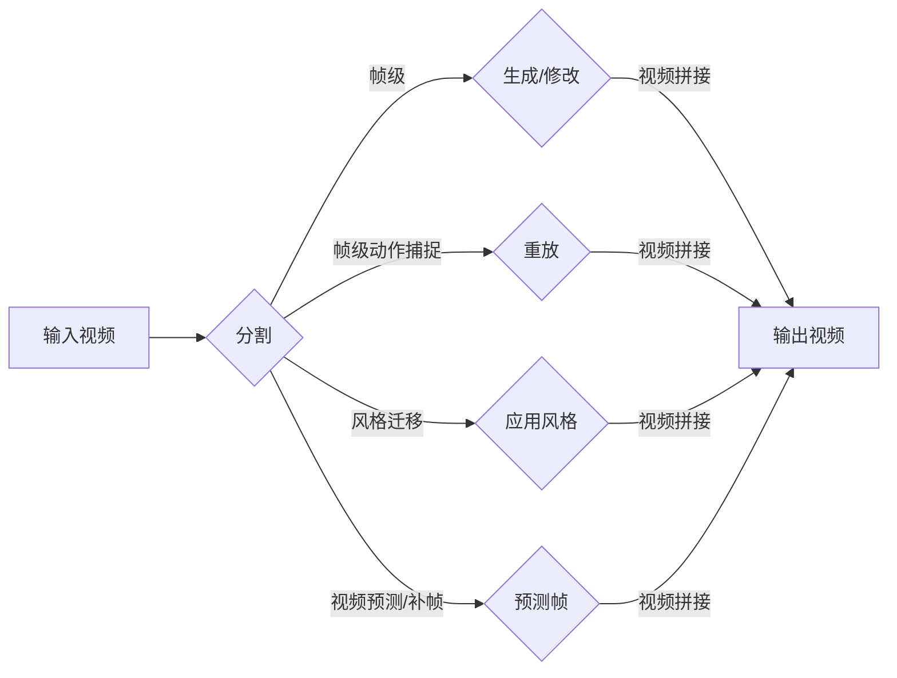

> 视频生成，生成对抗网络，风格迁移，视频理解，动作捕捉，深度学习，计算机视觉

# 视频生成(Video Generation) - 原理与代码实例讲解

视频生成作为计算机视觉和深度学习领域的热门研究方向，旨在利用机器学习技术自动生成或修改视频内容。从简单的视频片段拼接到复杂的动作捕捉与风格迁移，视频生成技术已经广泛应用于娱乐、影视、教育、医疗等多个领域。本文将深入探讨视频生成的基本原理、核心算法、应用实例，并提供代码实例讲解，帮助读者全面了解视频生成技术。

## 1. 背景介绍

### 1.1 问题的由来

随着深度学习技术的飞速发展，计算机视觉和视频处理领域取得了显著进步。然而，视频内容生成仍然是一个极具挑战性的问题。传统的视频合成方法依赖于复杂的视频编辑和后期制作技术，成本高昂且效率低下。视频生成技术的出现，为自动创作和编辑视频内容提供了新的可能性。

### 1.2 研究现状

近年来，基于深度学习的视频生成技术取得了突破性进展。常见的视频生成方法包括：

- **视频分割与合成**：将视频分割成帧，然后对每一帧进行生成或修改，最后将处理后的帧重新拼接成视频。
- **动作捕捉与重放**：捕捉真实动作，并将其重放到新的视频序列中。
- **风格迁移**：将一个视频的风格应用到另一个视频上，实现风格转换。
- **视频预测与补帧**：根据已有视频片段预测后续帧，实现视频内容的延续。

### 1.3 研究意义

视频生成技术具有重要的研究意义和应用价值：

- **娱乐与影视**：自动生成电影、动画、游戏等视频内容，降低创作成本，提高效率。
- **教育与培训**：创建个性化的教学视频，提高学习效果。
- **医疗与健康**：辅助医生进行手术模拟和诊断。
- **自动驾驶**：生成模拟驾驶场景，用于自动驾驶汽车的测试和训练。

## 2. 核心概念与联系

### 2.1 核心概念原理

**Mermaid 流程图**：



**核心概念**：

- **视频分割**：将视频信号分割成帧或视频片段。
- **生成/修改**：根据特定任务对视频帧进行生成或修改。
- **视频拼接**：将处理后的视频帧重新拼接成视频。
- **动作捕捉**：捕捉真实动作，并将其重放到新的视频序列中。
- **风格迁移**：将一个视频的风格应用到另一个视频上。
- **视频预测/补帧**：根据已有视频片段预测后续帧。

### 2.2 关系联系

视频生成技术涉及多个学科领域，包括计算机视觉、机器学习、图像处理等。不同视频生成方法之间存在一定的联系和互补性。

## 3. 核心算法原理 & 具体操作步骤

### 3.1 算法原理概述

视频生成技术主要基于以下几种算法：

- **生成对抗网络(Generative Adversarial Networks, GANs)**：通过对抗训练生成逼真的图像和视频内容。
- **循环神经网络(Recurrent Neural Networks, RNNs)**：处理序列数据，如视频。
- **卷积神经网络(Convolutional Neural Networks, CNNs)**：用于图像和视频特征提取。

### 3.2 算法步骤详解

**视频分割**：

1. 使用图像分割算法（如 GrabCut）将视频分割成帧。
2. 对每一帧进行预处理，如去噪、缩放等。

**生成/修改**：

1. 使用GAN或RNN等算法生成或修改视频帧。
2. 使用CNN提取视频帧的特征。

**视频拼接**：

1. 将处理后的视频帧按照时间顺序进行拼接。
2. 对视频进行编码和压缩，生成最终的输出视频。

### 3.3 算法优缺点

**GANs**：

- 优点：生成逼真的图像和视频内容。
- 缺点：训练过程不稳定，容易产生模式崩溃和梯度消失问题。

**RNNs**：

- 优点：处理序列数据，适合视频生成。
- 缺点：训练过程复杂，计算量大。

**CNNs**：

- 优点：特征提取能力强，适用于图像和视频处理。
- 缺点：难以处理长序列数据。

### 3.4 算法应用领域

视频生成技术适用于以下领域：

- **娱乐与影视**：自动生成电影、动画、游戏等视频内容。
- **教育与培训**：创建个性化的教学视频，提高学习效果。
- **医疗与健康**：辅助医生进行手术模拟和诊断。
- **自动驾驶**：生成模拟驾驶场景，用于自动驾驶汽车的测试和训练。

## 4. 数学模型和公式 & 详细讲解 & 举例说明

### 4.1 数学模型构建

**GANs**：

- **生成器(Generator, G)**：将随机噪声映射到数据分布。
- **判别器(Discriminator, D)**：判断输入样本是否属于真实数据分布。

**公式**：

$$
G(z) = \mathbf{G}(\mathbf{z}) \quad \text{(生成器)} \\
D(x) = \mathbf{D}(\mathbf{x}) \quad \text{(判别器)} \\
\text{minimize}_{\mathbf{G},\mathbf{D}} \mathcal{L}_\text{GAN}(G,D) = \mathbb{E}_{z \sim p_z(z)}[D(G(z))] - \mathbb{E}_{x \sim p_x(x)}[D(x)]
$$

### 4.2 公式推导过程

GANs的目标是最小化以下损失函数：

$$
\mathcal{L}_\text{GAN}(G,D) = \mathbb{E}_{z \sim p_z(z)}[D(G(z))] - \mathbb{E}_{x \sim p_x(x)}[D(x)]
$$

其中，$p_z(z)$ 表示随机噪声分布，$p_x(x)$ 表示真实数据分布。

### 4.3 案例分析与讲解

以视频风格迁移为例，介绍GANs在视频生成中的应用。

1. **输入视频**：输入一对视频，分别称为源视频和目标风格视频。
2. **生成器**：生成器将源视频的帧映射到目标风格视频的风格空间。
3. **判别器**：判别器判断生成的视频帧是否属于目标风格视频的风格空间。
4. **训练过程**：通过对抗训练，不断优化生成器和判别器，直至生成器能够生成与目标风格视频风格相似的生成视频。

## 5. 项目实践：代码实例和详细解释说明

### 5.1 开发环境搭建

1. 安装Python环境，如Anaconda。
2. 安装深度学习框架，如TensorFlow或PyTorch。
3. 安装相关依赖库，如OpenCV、NumPy等。

### 5.2 源代码详细实现

以下使用TensorFlow实现一个简单的GANs视频风格迁移示例。

```python
import tensorflow as tf
import tensorflow.keras as keras

# 定义生成器和判别器
def build_generator():
    # ...

def build_discriminator():
    # ...

# 训练GANs
def train_gan(generator, discriminator, dataset):
    # ...
```

### 5.3 代码解读与分析

以上代码示例展示了GANs视频风格迁移的基本流程。在实际应用中，需要根据具体任务进行详细设计和实现。

### 5.4 运行结果展示

通过运行上述代码，可以生成具有目标风格视频风格的源视频。

## 6. 实际应用场景

### 6.1 娱乐与影视

视频生成技术可以用于生成电影、动画、游戏等视频内容，降低创作成本，提高效率。

### 6.2 教育与培训

视频生成技术可以创建个性化的教学视频，提高学习效果。

### 6.3 医疗与健康

视频生成技术可以辅助医生进行手术模拟和诊断。

### 6.4 自动驾驶

视频生成技术可以生成模拟驾驶场景，用于自动驾驶汽车的测试和训练。

## 7. 工具和资源推荐

### 7.1 学习资源推荐

- 《深度学习》
- 《GANs论文集》
- 《视频处理》

### 7.2 开发工具推荐

- TensorFlow
- PyTorch
- OpenCV

### 7.3 相关论文推荐

- Unsupervised Representation Learning with Deep Convolutional Generative Adversarial Networks
- Generative Adversarial Text to Image Synthesis

## 8. 总结：未来发展趋势与挑战

### 8.1 研究成果总结

视频生成技术已经取得了显著进展，并在多个领域得到应用。

### 8.2 未来发展趋势

- 视频生成技术将进一步融入多模态信息，如音频、文本等。
- 视频生成技术将更加注重效率和可解释性。
- 视频生成技术将与其他领域的技术（如增强现实、虚拟现实）深度融合。

### 8.3 面临的挑战

- 视频生成技术需要处理海量数据和复杂的场景。
- 视频生成技术需要解决可解释性和伦理问题。
- 视频生成技术需要考虑计算资源和存储空间的限制。

### 8.4 研究展望

随着深度学习技术的不断发展，视频生成技术将取得更大的突破，为人类社会创造更多价值。

## 9. 附录：常见问题与解答

**Q1：什么是视频生成？**

A：视频生成是指利用机器学习技术自动生成或修改视频内容的过程。

**Q2：视频生成技术有哪些应用场景？**

A：视频生成技术可以应用于娱乐、影视、教育、医疗、自动驾驶等多个领域。

**Q3：视频生成技术有哪些挑战？**

A：视频生成技术需要处理海量数据和复杂的场景，同时需要解决可解释性和伦理问题。

**Q4：如何选择合适的视频生成技术？**

A：根据具体任务的需求和场景，选择合适的视频生成技术。

---

作者：禅与计算机程序设计艺术 / Zen and the Art of Computer Programming